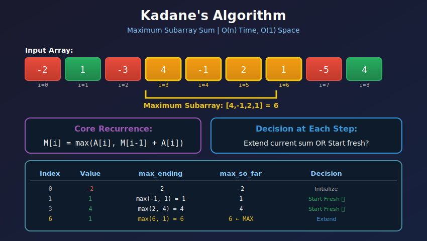
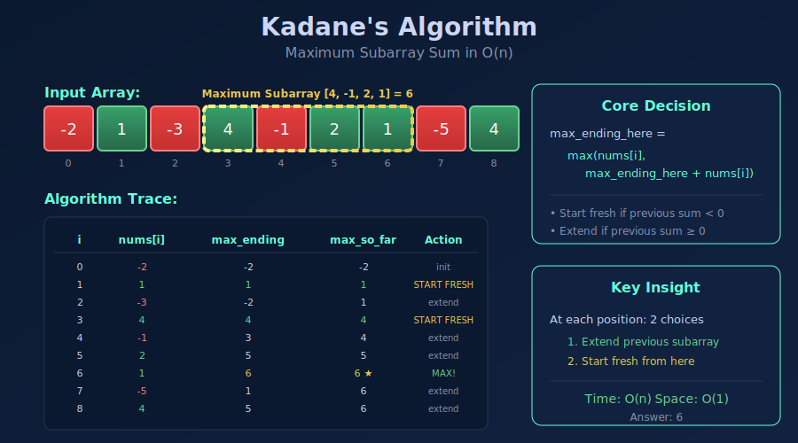
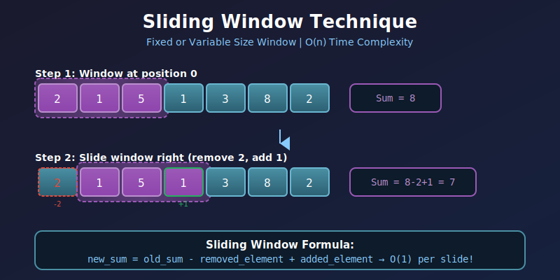
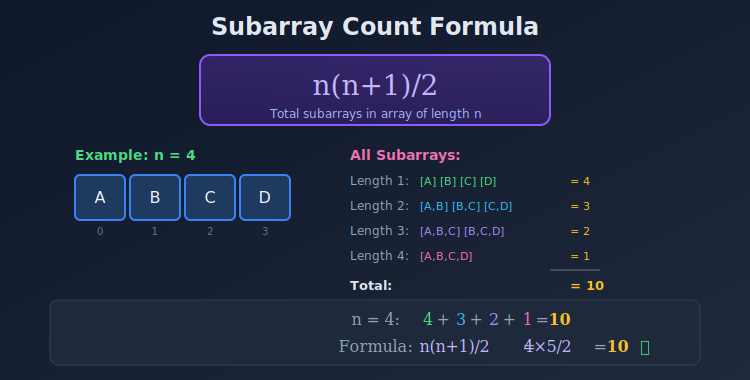

<div align="center">

# 🔢 Subarray Problems

<p>
  
  
</p>

</div>

---

## 🧭 Navigation

| ⬅️ Previous | 📂 Current | ➡️ Next |
|:------------|:----------:|--------:|
| [← 01. Basic Operations](../01_basic_operations/README.md) | **02. Subarray Problems** | [03. Prefix Sum →](../03_prefix_sum/README.md) |

---

## 🎨 Visual Diagrams

<div align="center">

### Kadane's Algorithm


### Kadane's Algorithm (Detailed)


### Sliding Window Technique


### Subarray Counting


</div>

---

## 📐 Mathematical Foundations

### 1️⃣ Subarray Count Formula

**Theorem:** Array of size n has exactly $\frac{n(n+1)}{2}$ subarrays.

**Proof (Combinatorial):**

A subarray is defined by choosing:

- Start index $i$ where $0 \leq i < n$

- End index $j$ where $i \leq j < n$

```math
\text{Count} = \sum_{i=0}^{n-1} (n-i) = n + (n-1) + \cdots + 1 = \frac{n(n+1)}{2}

```

**Alternative Proof (Choose 2 endpoints):**

```math
\binom{n+1}{2} = \frac{(n+1)!}{2!(n-1)!} = \frac{(n+1) \cdot n}{2} = \frac{n(n+1)}{2}

```

---

### 2️⃣ Kadane's Algorithm - Complete Mathematical Derivation

**Problem:** Find maximum sum contiguous subarray.

**Recurrence Relation:**

```math
\boxed{M[i] = \max(A[i], \; M[i-1] + A[i])}

```

Where $M[i]$ = maximum subarray sum ending at index $i$.

**Optimal Substructure Proof:**

Let $S\_{i}$ be the maximum sum of subarray ending at index $i$.

**Case 1:** Subarray contains only $A[i]$

```math
S_i = A[i]

```

**Case 2:** Subarray extends from some $j < i$

```math
S_i = S_{i-1} + A[i]

```

**Decision:** $S\_i = \max(\text{Case 1}, \text{Case 2}) = \max(A[i], S\_{i-1} + A[i])$

**When to start fresh?**

```math
A[i] > S_{i-1} + A[i] \iff S_{i-1} < 0

```

**Insight:** Start new subarray when previous sum is negative.

---

### 3️⃣ Visual Trace: Maximum Subarray

```
Input: [-2, 1, -3, 4, -1, 2, 1, -5, 4]

+==============================================================================+

|                        KADANE'S ALGORITHM TRACE                              |
+=======+=======+==============================================================+
| Index | Value |                     Decision                                 |
+=======+=======+==============================================================+

|   0   |  -2   | Initialize: max_ending = -2, max_so_far = -2                |
+=======+=======+==============================================================+

|   1   |   1   | max(-2 + 1, 1) = max(-1, 1) = 1  ✨ START FRESH             |
|       |       | Reason: previous sum -2 < 0, dragging us down                |
|       |       | max_ending = 1, max_so_far = 1                               |
+=======+=======+==============================================================+

|   2   |  -3   | max(1 + (-3), -3) = max(-2, -3) = -2  EXTEND                |
|       |       | max_ending = -2, max_so_far = 1                              |
+=======+=======+==============================================================+

|   3   |   4   | max(-2 + 4, 4) = max(2, 4) = 4  ✨ START FRESH               |
|       |       | max_ending = 4, max_so_far = 4                               |
+=======+=======+==============================================================+

|   4   |  -1   | max(4 + (-1), -1) = max(3, -1) = 3  EXTEND                  |
|       |       | max_ending = 3, max_so_far = 4                               |
+=======+=======+==============================================================+

|   5   |   2   | max(3 + 2, 2) = max(5, 2) = 5  EXTEND                       |
|       |       | max_ending = 5, max_so_far = 5                               |
+=======+=======+==============================================================+

|   6   |   1   | max(5 + 1, 1) = max(6, 1) = 6  EXTEND                       |
|       |       | max_ending = 6, max_so_far = 6 ← MAXIMUM                     |
+=======+=======+==============================================================+

|   7   |  -5   | max(6 + (-5), -5) = max(1, -5) = 1  EXTEND                  |
|       |       | max_ending = 1, max_so_far = 6                               |
+=======+=======+==============================================================+

|   8   |   4   | max(1 + 4, 4) = max(5, 4) = 5  EXTEND                       |
|       |       | max_ending = 5, max_so_far = 6                               |
+=======+=======+==============================================================+

Answer: max_so_far = 6  (subarray [4, -1, 2, 1])

```

---

### 4️⃣ Maximum Product Subarray Mathematics

**Challenge:** Negative × Negative = Positive

**State Definition:**

```math
\begin{aligned}
\text{max\_prod}[i] &= \text{Maximum product ending at } i \\
\text{min\_prod}[i] &= \text{Minimum product ending at } i
\end{aligned}

```

**Recurrence:**

```math
\boxed{\text{max\_prod}[i] = \max(A[i], \; A[i] \times \text{max\_prod}[i-1], \; A[i] \times \text{min\_prod}[i-1])}
\boxed{\text{min\_prod}[i] = \min(A[i], \; A[i] \times \text{max\_prod}[i-1], \; A[i] \times \text{min\_prod}[i-1])}

```

**Why track minimum?**

- If $A[i] < 0$ and $\text{min\_prod}[i-1] < 0$

- Then $A[i] \times \text{min\_prod}[i-1] > 0$ (potentially maximum!)

---

### 5️⃣ Visual: Product Subarray with Negatives

```
Input: [2, 3, -2, 4]

+----------------------------------------------------------------------------+

|  i=0: A[0]=2                                                               |
|  max_prod = 2, min_prod = 2, result = 2                                    |
+----------------------------------------------------------------------------+

|  i=1: A[1]=3                                                               |
|  Options: 3, 3×2=6, 3×2=6                                                  |
|  max_prod = 6, min_prod = 3, result = 6                                    |
+----------------------------------------------------------------------------+

|  i=2: A[2]=-2                                                              |
|  ⚠️  Negative number - signs flip!                                         |
|  Options: -2, -2×6=-12, -2×3=-6                                            |
|  max_prod = max(-2, -12, -6) = -2                                          |
|  min_prod = min(-2, -12, -6) = -12  ← Save for later!                      |
+----------------------------------------------------------------------------+

|  i=3: A[3]=4                                                               |
|  Options: 4, 4×(-2)=-8, 4×(-12)=-48                                        |
|  max_prod = 4, min_prod = -48                                              |
+----------------------------------------------------------------------------+

Answer: 6 (subarray [2, 3])

```

---

### 6️⃣ Subarray Sum Equals K - Mathematical Insight

**Key Identity:**

```math
\text{sum}(i, j) = k \iff P[j] - P[i-1] = k \iff P[i-1] = P[j] - k

```

**Algorithm:** At each index $j$, count how many previous prefix sums equal $P[j] - k$.

**Counting Formula:**

```math
\text{count} = \sum_{j=0}^{n-1} \text{freq}[P[j] - k]

```

```
Prefix Sum Array: P = [0, 1, 2, 3, 1, 2, 4]
Target k = 3

For j=3: P[3]=3, P[3]-k=0 exists once → count += 1
For j=5: P[5]=2, P[5]-k=-1 exists 0 times
For j=6: P[6]=4, P[6]-k=1 exists twice → count += 2

```

---

## 💻 Code Implementations

```python
def maxSubArray(nums: list[int]) -> int:
    """
    Kadane's Algorithm - Maximum Subarray Sum.
    
    Mathematical Recurrence:
    M[i] = max(A[i], M[i-1] + A[i])
    
    Decision: Start fresh if M[i-1] < 0
    
    Time: O(n), Space: O(1)
    """
    max_ending_here = max_so_far = nums[0]
    
    for i in range(1, len(nums)):
        # Core decision: extend or start fresh
        max_ending_here = max(nums[i], max_ending_here + nums[i])
        max_so_far = max(max_so_far, max_ending_here)
    
    return max_so_far

def maxProduct(nums: list[int]) -> int:
    """
    Maximum Product Subarray.
    
    Track both max and min because:
    negative × negative = positive
    
    Time: O(n), Space: O(1)
    """
    max_prod = min_prod = result = nums[0]
    
    for i in range(1, len(nums)):
        num = nums[i]
        # Calculate candidates
        candidates = (num, num * max_prod, num * min_prod)
        max_prod = max(candidates)
        min_prod = min(candidates)
        result = max(result, max_prod)
    
    return result

def subarraySum(nums: list[int], k: int) -> int:
    """
    Count subarrays with sum equals k.
    
    Mathematical Identity:
    sum(i,j) = k ⟺ P[j] - P[i-1] = k ⟺ P[i-1] = P[j] - k
    
    Time: O(n), Space: O(n)
    """
    from collections import defaultdict
    
    count = 0
    prefix_sum = 0
    prefix_count = defaultdict(int)
    prefix_count[0] = 1  # Empty prefix
    
    for num in nums:
        prefix_sum += num
        # How many times have we seen (prefix_sum - k)?
        count += prefix_count[prefix_sum - k]
        prefix_count[prefix_sum] += 1
    
    return count

def minSubArrayLen(target: int, nums: list[int]) -> int:
    """
    Minimum Size Subarray Sum >= target.
    
    Sliding Window with Invariant:
    Maintain window where sum < target, extend right
    When sum >= target, shrink left
    
    Time: O(n), Space: O(1)
    """
    left = 0
    current_sum = 0
    min_len = float('inf')
    
    for right in range(len(nums)):
        current_sum += nums[right]
        
        while current_sum >= target:
            min_len = min(min_len, right - left + 1)
            current_sum -= nums[left]
            left += 1
    
    return min_len if min_len != float('inf') else 0

```

---

## 🏆 LeetCode Problems

### 🟢 Easy

| # | Problem | Pattern | Time | Space |
|:-:|---------|---------|:----:|:-----:|
| 53 | [Maximum Subarray](https://leetcode.com/problems/maximum-subarray/) | Kadane's | O(n) | O(1) |
| 121 | [Best Time to Buy and Sell Stock](https://leetcode.com/problems/best-time-to-buy-and-sell-stock/) | Kadane variant | O(n) | O(1) |

### 🟡 Medium

| # | Problem | Pattern | Time | Space |
|:-:|---------|---------|:----:|:-----:|
| 152 | [Maximum Product Subarray](https://leetcode.com/problems/maximum-product-subarray/) | Track min/max | O(n) | O(1) |
| 209 | [Minimum Size Subarray Sum](https://leetcode.com/problems/minimum-size-subarray-sum/) | Sliding Window | O(n) | O(1) |
| 523 | [Continuous Subarray Sum](https://leetcode.com/problems/continuous-subarray-sum/) | Prefix + Mod | O(n) | O(min(n,k)) |
| 560 | [Subarray Sum Equals K](https://leetcode.com/problems/subarray-sum-equals-k/) | Prefix + Hash | O(n) | O(n) |
| 713 | [Subarray Product Less Than K](https://leetcode.com/problems/subarray-product-less-than-k/) | Sliding Window | O(n) | O(1) |
| 974 | [Subarray Sums Divisible by K](https://leetcode.com/problems/subarray-sums-divisible-by-k/) | Prefix + Mod | O(n) | O(k) |
| 1004 | [Max Consecutive Ones III](https://leetcode.com/problems/max-consecutive-ones-iii/) | Sliding Window | O(n) | O(1) |
| 1248 | [Count Number of Nice Subarrays](https://leetcode.com/problems/count-number-of-nice-subarrays/) | Prefix + Hash | O(n) | O(n) |

### 🔴 Hard

| # | Problem | Pattern | Time | Space |
|:-:|---------|---------|:----:|:-----:|
| 862 | [Shortest Subarray with Sum ≥ K](https://leetcode.com/problems/shortest-subarray-with-sum-at-least-k/) | Monotonic Deque | O(n) | O(n) |
| 992 | [Subarrays with K Different Integers](https://leetcode.com/problems/subarrays-with-k-different-integers/) | Sliding Window | O(n) | O(k) |

---

## 📊 Pattern Decision Tree

```
                   Subarray Problem
                         |
         +---------------+---------------+
         |               |               |
    Find Maximum    Count Subarrays   Find Minimum
         |               |               |
    +----+----+     +----+----+     Sliding Window
    |         |     |         |
  Sum?    Product?  Sum=k?  Divisible?
    |         |     |         |
 Kadane   min/max  Prefix   Prefix+Mod
         tracking  +Hash

```

---

## 💡 Key Insights & Pro Tips

> **🎯 Kadane's Core Insight**  
> At each position, you have two choices: extend the previous subarray OR start fresh. Start fresh only when previous sum is negative.

> **⚡ Product Subarray Trick**  
> Track both max AND min because negative × negative = positive. A large negative can become a large positive!

> **🔄 Prefix Sum + Hash Map**  
> For "subarray sum = k": use `prefix_sum - k` lookup. For "subarray sum divisible by k": use modulo arithmetic.

> **📊 Sliding Window vs Kadane's**  
> - Sliding Window: For non-negative numbers, find minimum length
> - Kadane's: For negative numbers too, find maximum sum

> **🔍 Subarray vs Subsequence**  
> - Subarray: Contiguous → n(n+1)/2 possible
> - Subsequence: Any order → 2^n possible

---

## 🎓 Pattern Recognition Guide

### Choosing the Right Technique

| Problem Type | Pattern | Identifier | Time |
|-------------|---------|------------|------|
| **Max/Min Sum** | Kadane's | Contains negatives | O(n) |
| **Max/Min Product** | Track min & max | Multiplication involved | O(n) |
| **Sum = K** | Prefix + Hash | Exact target value | O(n) |
| **Sum ≥ K** | Sliding Window | Minimum length, non-negative | O(n) |
| **Divisible by K** | Prefix + Modulo | Divisibility condition | O(n) |
| **Fixed Size K** | Fixed Window | Window size given | O(n) |

---

## 🎯 Complexity Analysis

### Naive vs Optimized

| Problem | Naive Approach | Optimized | Technique |
|---------|:--------------:|:---------:|-----------|
| Max Subarray Sum | O(n²) | **O(n)** | Kadane's |
| Subarray Sum = K | O(n²) | **O(n)** | Prefix Hash |
| Min Length Sum ≥ K | O(n²) | **O(n)** | Sliding Window |
| Max Product | O(n²) | **O(n)** | Track min/max |

### When Kadane's Doesn't Work

```
❌ Kadane's fails when:
   - Need to find actual subarray indices
   - Need K largest subarrays (not just maximum)
   - Circular array (needs modification)
   - Product instead of sum (needs min tracking)

✅ Use modified versions or different approaches

```

---

## 🧮 Mathematical Insights

### Why n(n+1)/2 Subarrays?

For each starting position `i`, count endings `j` where `j ≥ i`:

```
i=0: n choices (end at 0,1,2,...,n-1)
i=1: n-1 choices
i=2: n-2 choices
...
i=n-1: 1 choice

Total = n + (n-1) + ... + 1 = n(n+1)/2

```

### Kadane's Correctness Proof

**Theorem:** Algorithm finds maximum subarray sum.

**Proof by Induction:**
- Base: At i=0, max_ending[0] = A[0] ✓

- Inductive: Assume correct for i-1
  - If max_ending[i-1] < 0, best to start fresh at i
  - If max_ending[i-1] ≥ 0, extend to include A[i]
  - Therefore max_ending[i] = max(A[i], max_ending[i-1] + A[i]) ∎

---

## 📚 References & Learning Resources

### 📖 Core Concepts

| Resource | Description | Link |
|----------|-------------|------|
| **Kadane's Algorithm** | Maximum subarray problem | [Wikipedia](https://en.wikipedia.org/wiki/Maximum_subarray_problem) |
| **Bentley's Paper** | Original programming pearl | [PDF](https://www.cs.cmu.edu/~15451-f17/Handouts/bentley1984.pdf) |
| **Prefix Sum Tutorial** | Complete guide | [GeeksforGeeks](https://www.geeksforgeeks.org/prefix-sum-array-implementation-applications-competitive-programming/) |
| **Sliding Window Pattern** | Comprehensive guide | [LeetCode Discuss](https://leetcode.com/discuss/study-guide/657507/) |

### 🎥 Video Tutorials

| Resource | Topic | Link |
|----------|-------|------|
| **CS Dojo** | Kadane's algorithm explained | [YouTube](https://www.youtube.com/watch?v=86CQq3pKSUw) |
| **Back To Back SWE** | Maximum subarray | [YouTube](https://www.youtube.com/watch?v=2MmGzdiKR9Y) |
| **NeetCode** | Subarray problems playlist | [YouTube](https://www.youtube.com/playlist?list=PLot-Xpze53ldVwtstag2TL4HQhAnC8ATf) |
| **Abdul Bari** | Dynamic programming basics | [YouTube](https://www.youtube.com/watch?v=nqowUJzG-iM) |

### 📝 Interactive Learning

| Platform | Problem Set | Link |
|----------|-------------|------|
| **LeetCode** | Sliding window tag | [Problems](https://leetcode.com/tag/sliding-window/) |
| **LeetCode** | Dynamic programming tag | [Problems](https://leetcode.com/tag/dynamic-programming/) |
| **HackerRank** | Subarray problems | [Practice](https://www.hackerrank.com/domains/algorithms?filters%5Bsubdomains%5D%5B%5D=arrays-and-sorting) |
| **Codeforces** | DP problems | [Problemset](https://codeforces.com/problemset?tags=dp) |

### 🔬 Advanced Topics

| Resource | Topic | Link |
|----------|-------|------|
| **CLRS Chapter 4** | Divide and conquer max subarray | [MIT](https://mitpress.mit.edu/books/introduction-algorithms) |
| **Competitive Programmer's Handbook** | Subarray techniques | [PDF](https://cses.fi/book/book.pdf) |
| **CP-Algorithms** | Various array techniques | [Website](https://cp-algorithms.com/) |

### 🎯 Problem Collections

| Collection | Focus | Link |
|-----------|-------|------|
| **NeetCode 150** | Curated interview problems | [List](https://neetcode.io/) |
| **Blind 75** | Essential problems | [List](https://www.teamblind.com/post/New-Year-Gift---Curated-List-of-Top-75-LeetCode-Questions-to-Save-Your-Time-OaM1orEU) |
| **Grind 75** | Week-by-week plan | [List](https://www.techinterviewhandbook.org/grind75) |

---

## 🎯 Practice Roadmap

### Foundation (Must-Solve!)
1. **Maximum Subarray** (#53) - Master Kadane's first!
2. **Best Time to Buy Stock** (#121) - Kadane's variant
3. **Subarray Sum Equals K** (#560) - Learn prefix + hash

### Building Mastery
4. **Maximum Product** (#152) - Handle negatives
5. **Continuous Subarray Sum** (#523) - Modulo arithmetic
6. **Subarray Sums Divisible by K** (#974) - Advanced modulo

### Advanced Challenges
7. **Shortest Subarray with Sum ≥ K** (#862) - Monotonic deque
8. **Subarrays with K Different** (#992) - Sliding window

### Pro Level

- Solve variations (max product, min length, count)

- Optimize space to O(1)

- Handle circular arrays

---

## 💭 Deep Insights

### Why Kadane's Works: Intuition

Think of it as a running investment:

- If your portfolio (current sum) is negative, **sell everything and start fresh**
- If positive, **keep holding** and add the next stock

```python
# Investment analogy
portfolio = 0
best_ever = float('-inf')

for stock_value in prices:
    # Should I keep my current portfolio or start fresh?
    portfolio = max(stock_value, portfolio + stock_value)
    best_ever = max(best_ever, portfolio)

```

### The Power of Prefix Sums

```
Array:       [3, 1, -2, 5, -1]
Prefix:   [0, 3, 4,  2, 7,  6]
           ↑           ↑
           i           j

sum(i, j) = prefix[j] - prefix[i]
Want: sum = k
So: prefix[j] - prefix[i] = k
    prefix[i] = prefix[j] - k  ← Store in hash map!

```

---

## 🧠 Complexity Analysis Mastery

### How to Know if O(n) is Possible?

✅ **O(n) is achievable if:**
- Each element is visited once

- Operations per element are O(1)

- Can use hash map for lookups

❌ **Requires O(n²) if:**
- Need to compare all pairs

- No monotonic property to exploit

- Cannot maintain running state

### Kadane's vs Brute Force

```
Brute Force:
for i in range(n):
    for j in range(i, n):
        sum = sum(arr[i:j+1])  # O(n) each time
# Total: O(n³)

Optimized Brute:
for i in range(n):
    sum = 0
    for j in range(i, n):
        sum += arr[j]  # Running sum
# Total: O(n²)

Kadane's:
for i in range(n):
    max_ending = max(arr[i], max_ending + arr[i])
# Total: O(n) ✨

```

---

<div align="center">

### 🏆 Kadane's Algorithm: The Crown Jewel of Array Problems

*One simple idea: At each step, decide to extend or restart*

**Made with ❤️ by [Gaurav Goswami](https://github.com/Gaurav14cs17)**

[⬅️ Basic Operations](../01_basic_operations/README.md) | [➡️ Prefix Sum](../03_prefix_sum/README.md)

---

*"The best time to plant a tree was 20 years ago. The second best time is now."*  
*Start with Maximum Subarray (#53) today!* 🌱

</div>

---

## 🧭 Navigation

| ⬅️ Previous | 📂 Current | ➡️ Next |
|:------------|:----------:|--------:|
| [← 01. Basic Operations](../01_basic_operations/README.md) | **02. Subarray Problems** | [03. Prefix Sum →](../03_prefix_sum/README.md) |
