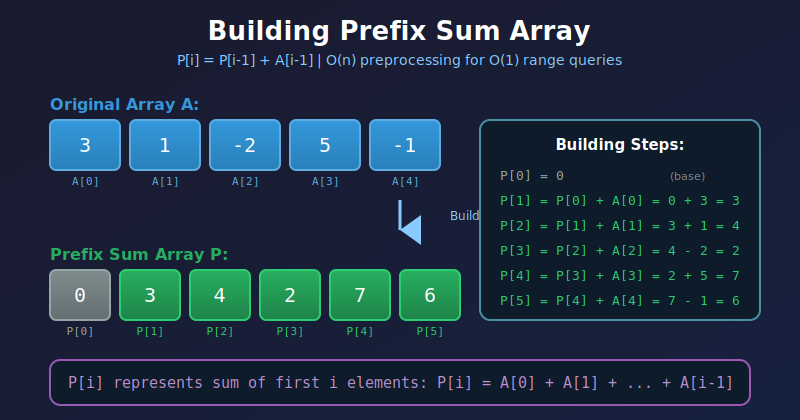
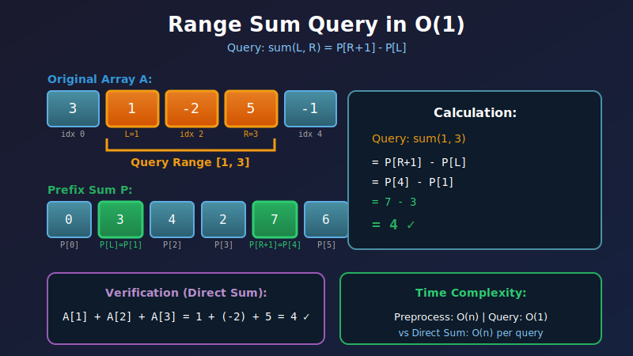
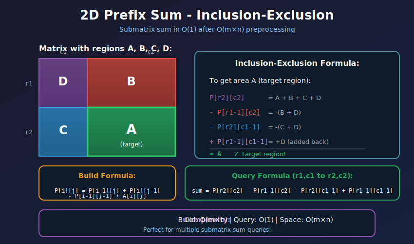

<div align="center">

# 📊 Prefix Sum Techniques

<p>
  
  
</p>

</div>

---

## 🧭 Navigation

| ⬅️ Previous | 📂 Current | ➡️ Next |
|:------------|:----------:|--------:|
| [← 02. Subarray Problems](../02_subarray_problems/README.md) | **03. Prefix Sum** | [04. Matrix Problems →](../04_matrix_problems/README.md) |

---

## 🎨 Visual Diagrams

<div align="center">

### Building Prefix Sum Array


### Range Sum Query in O(1)


### 2D Prefix Sum (Inclusion-Exclusion)


</div>

---

## 📐 Mathematical Foundations

### 1️⃣ Prefix Sum Definition & Formula

**Definition:** Prefix sum array $P$ where:

$$P[i] = \sum_{j=0}^{i} A[j]$$

**Explicit Formula:**

$$\boxed{P[0] = A[0], \quad P[i] = P[i-1] + A[i] \text{ for } i > 0}$$

**Key Identity - Range Sum:**

$$\text{sum}(L, R) = P[R] - P[L-1]$$

**Proof:**

$$\begin{aligned}
P[R] - P[L-1] &= \sum_{i=0}^{R} A[i] - \sum_{i=0}^{L-1} A[i] \\
&= \sum_{i=L}^{R} A[i] \quad \text{∎}
\end{aligned}$$

---

### 2️⃣ Why P[0] = 0 Convention?

**Including P[0] = 0 simplifies boundary cases:**

$$\text{sum}(0, R) = P[R] - P[-1] = P[R] - 0 = P[R]$$

**With this convention:**

$$P[i] = \sum_{j=0}^{i-1} A[j] \quad \text{(exclusive right bound)}$$

**Comparison:**

```
Array:    [3, 1, -2, 5, -1]
Indices:   0  1   2  3   4

Without P[0]=0:
Prefix:   [3, 4,  2, 7,  6]

With P[0]=0:
Prefix: [0, 3, 4,  2, 7,  6]
         ↑
    Simplifies sum(0,R)
```

---

### 3️⃣ Visual: Prefix Sum Construction

```
Original Array: [2, 4, -1, 5, 3]

┌─────────────────────────────────────────────────────────────────────┐
│  Building Prefix Sum Array                                          │
├─────────────────────────────────────────────────────────────────────┤
│                                                                     │
│  P[0] = 0 (convention)                                              │
│                                                                     │
│  P[1] = P[0] + A[0] = 0 + 2 = 2                                     │
│  ┌───┬───┬────┬───┬───┐                                            │
│  │ 2 │ 4 │ -1 │ 5 │ 3 │                                            │
│  └───┴───┴────┴───┴───┘                                            │
│    ↑                                                                │
│  Prefix: [0, 2, ?, ?, ?, ?]                                         │
│                                                                     │
│  P[2] = P[1] + A[1] = 2 + 4 = 6                                     │
│  ┌───┬───┬────┬───┬───┐                                            │
│  │ 2 │ 4 │ -1 │ 5 │ 3 │                                            │
│  └───┴───┴────┴───┴───┘                                            │
│        ↑                                                            │
│  Prefix: [0, 2, 6, ?, ?, ?]                                         │
│                                                                     │
│  P[3] = P[2] + A[2] = 6 + (-1) = 5                                  │
│  P[4] = P[3] + A[3] = 5 + 5 = 10                                    │
│  P[5] = P[4] + A[4] = 10 + 3 = 13                                   │
│                                                                     │
│  Final Prefix: [0, 2, 6, 5, 10, 13]                                 │
└─────────────────────────────────────────────────────────────────────┘
```

---

### 4️⃣ Range Sum Query - Detailed Example

```
Array:    [3,  1, -2,  5, -1]
Prefix: [0, 3,  4,  2,  7,  6]
Index:   0  1   2   3   4   5

Query: What is sum(1, 3)?  (sum from index 1 to 3)

┌─────────────────────────────────────────────────────────────────────┐
│  Method 1: Direct Sum (Naive) - O(n)                                │
│  sum = A[1] + A[2] + A[3]                                           │
│      = 1 + (-2) + 5                                                 │
│      = 4                                                            │
├─────────────────────────────────────────────────────────────────────┤
│  Method 2: Prefix Sum - O(1) ✨                                     │
│                                                                     │
│  sum(1, 3) = P[4] - P[1]                                            │
│            = 7 - 3                                                  │
│            = 4 ✓                                                    │
│                                                                     │
│  Visual:                                                            │
│  ┌─────────────────┐   ┌─────┐                                     │
│  │ 0...............│───│.....│                                     │
│  │  P[1]=3         │   │P[4]=7│                                    │
│  └─────────────────┘   └─────┘                                     │
│          ↑________________↑                                         │
│          This difference = sum(1,3)                                 │
└─────────────────────────────────────────────────────────────────────┘

Why P[4] and not P[3]?
Because P[i] represents sum from 0 to i-1 (exclusive)
P[4] includes elements 0,1,2,3
P[1] includes elements 0
P[4] - P[1] = elements 1,2,3 ✓
```

---

### 5️⃣ 2D Prefix Sum (Matrix)

**Definition for 2D array:**

$$P[i][j] = \sum_{r=0}^{i} \sum_{c=0}^{j} A[r][c]$$

**Recurrence Relation:**

$$\boxed{P[i][j] = P[i-1][j] + P[i][j-1] - P[i-1][j-1] + A[i][j]}$$

**Range Sum Query (r1,c1) to (r2,c2):**

$$\boxed{\text{sum} = P[r2][c2] - P[r1-1][c2] - P[r2][c1-1] + P[r1-1][c1-1]}$$

**Visual Explanation:**

```
      c1      c2
r1  ┌─────────┬────┐
    │    A    │ B  │
    │         │    │
r2  ├─────────┼────┤
    │    C    │ D  │
    └─────────┴────┘

Want: Area A only

P[r2][c2] = A + B + C + D
P[r1-1][c2] = B
P[r2][c1-1] = C
P[r1-1][c1-1] = 0

sum = (A+B+C+D) - B - C + 0 = A ✓

Inclusion-Exclusion Principle!
```

---

### 6️⃣ Mathematical Properties

**Property 1: Linearity**

$$P[A + B] = P[A] + P[B]$$

**Property 2: Difference**

$$A[i] = P[i] - P[i-1]$$

**Property 3: Telescoping**

$$\sum_{i=L}^{R} (P[i] - P[i-1]) = P[R] - P[L-1]$$

**Property 4: Modulo Arithmetic**

If $P[i] \equiv P[j] \pmod{k}$, then:

$$\sum_{x=i+1}^{j} A[x] \equiv 0 \pmod{k}$$

**Proof:**

$$\begin{aligned}
P[j] - P[i] &\equiv 0 \pmod{k} \\
\sum_{x=0}^{j} A[x] - \sum_{x=0}^{i} A[x] &\equiv 0 \pmod{k} \\
\sum_{x=i+1}^{j} A[x] &\equiv 0 \pmod{k} \quad \text{∎}
\end{aligned}$$

---

## 🎨 Visual Algorithm Walkthroughs

### Subarray Sum Divisible by K

```
Input: nums = [4, 5, 0, -2, -3, 1], k = 5
Find: Count of subarrays with sum divisible by 5

┌─────────────────────────────────────────────────────────────────────┐
│  Step 1: Build Prefix Sum Array                                     │
│  Index:     0   1   2   3   4   5   6                               │
│  Array:     -   4   5   0  -2  -3   1                               │
│  Prefix:    0   4   9   9   7   4   5                               │
├─────────────────────────────────────────────────────────────────────┤
│  Step 2: Calculate Modulo K                                         │
│  Mod 5:     0   4   4   4   2   4   0                               │
│             ↑       ↑   ↑       ↑   ↑                               │
│             │       └───┴───────┘   │                               │
│             └─────────────────────────┘                             │
├─────────────────────────────────────────────────────────────────────┤
│  Step 3: Count Frequency of Each Remainder                          │
│  Remainder 0: appears 2 times → C(2,2) = 1 subarray                 │
│  Remainder 4: appears 4 times → C(4,2) = 6 subarrays                │
│  Remainder 2: appears 1 time  → C(1,2) = 0 subarrays                │
│                                                                     │
│  Total: 1 + 6 = 7 subarrays                                         │
├─────────────────────────────────────────────────────────────────────┤
│  Mathematical Insight:                                              │
│  If P[i] ≡ P[j] (mod k), then sum(i+1, j) ≡ 0 (mod k)               │
│                                                                     │
│  Example: P[1]=4, P[3]=9                                            │
│           4 ≡ 4 (mod 5), 9 ≡ 4 (mod 5)                              │
│           sum(2,3) = 9-4 = 5 ≡ 0 (mod 5) ✓                          │
└─────────────────────────────────────────────────────────────────────┘
```

---

### Product of Array Except Self (Using Prefix/Suffix)

```
Input: [1, 2, 3, 4]
Output: [24, 12, 8, 6]  (product of all elements except self)

┌─────────────────────────────────────────────────────────────────────┐
│  Idea: result[i] = (product of left) × (product of right)           │
├─────────────────────────────────────────────────────────────────────┤
│  Step 1: Build Left Product Array                                   │
│  Index:      0    1    2    3                                       │
│  Array:      1    2    3    4                                       │
│  Left:       1    1    2    6                                       │
│              ↑    ↑    ↑    ↑                                       │
│              │    │    │    └─ 1×2×3 = 6                            │
│              │    │    └────── 1×2 = 2                              │
│              │    └─────────── 1                                    │
│              └────────────────  1 (no elements to left)             │
├─────────────────────────────────────────────────────────────────────┤
│  Step 2: Build Right Product (on-the-fly, save space)               │
│  Right:     24   12    4    1                                       │
│              ↑    ↑    ↑    ↑                                       │
│              │    │    │    └─ 1 (no elements to right)             │
│              │    │    └────── 4                                    │
│              │    └─────────── 3×4 = 12                             │
│              └────────────────  2×3×4 = 24                          │
├─────────────────────────────────────────────────────────────────────┤
│  Step 3: Multiply Left × Right                                      │
│  Index:      0     1     2     3                                    │
│  Left:       1     1     2     6                                    │
│  Right:     24    12     4     1                                    │
│  Result:    24    12     8     6  ✓                                 │
│             ↑     ↑     ↑     ↑                                     │
│             │     │     │     └─ 6×1 = 6                            │
│             │     │     └─────── 2×4 = 8                            │
│             │     └───────────── 1×12 = 12                          │
│             └─────────────────── 1×24 = 24                          │
└─────────────────────────────────────────────────────────────────────┘

Time: O(n), Space: O(1) (output array doesn't count)
```

---

## 💻 Code Implementations

```python
def buildPrefixSum(nums: list[int]) -> list[int]:
    """
    Build prefix sum array with P[0] = 0 convention.
    
    Formula: P[i] = P[i-1] + nums[i-1]
    
    Time: O(n), Space: O(n)
    """
        n = len(nums)
    prefix = [0] * (n + 1)
    
        for i in range(n):
        prefix[i + 1] = prefix[i] + nums[i]
    
    return prefix

    
def rangeSum(prefix: list[int], left: int, right: int) -> int:
    """
    Query sum from left to right (inclusive) in O(1).
    
    Formula: sum(L, R) = P[R+1] - P[L]
    
    Time: O(1)
    """
    return prefix[right + 1] - prefix[left]


def subarraysDivByK(nums: list[int], k: int) -> int:
    """
    Count subarrays with sum divisible by K.
    
    Mathematical Insight:
    If P[i] ≡ P[j] (mod k), then sum(i+1, j) ≡ 0 (mod k)
    
    Time: O(n), Space: O(k)
    """
    from collections import defaultdict
    
    prefix_sum = 0
    count = 0
    mod_count = defaultdict(int)
    mod_count[0] = 1  # Empty prefix
    
    for num in nums:
        prefix_sum += num
        # Handle negative modulo properly
        remainder = prefix_sum % k
        
        # Count how many times we've seen this remainder
        count += mod_count[remainder]
        mod_count[remainder] += 1
    
    return count


def productExceptSelf(nums: list[int]) -> list[int]:
    """
    Product of array except self without division.
    
    Idea: result[i] = (left prefix product) × (right suffix product)
    
    Optimization: Use output array for left products,
                  calculate right products on-the-fly
    
    Time: O(n), Space: O(1) excluding output
    """
    n = len(nums)
    result = [1] * n
    
    # Build left products
    left_product = 1
    for i in range(n):
        result[i] = left_product
        left_product *= nums[i]
    
    # Build right products and multiply
    right_product = 1
    for i in range(n - 1, -1, -1):
        result[i] *= right_product
        right_product *= nums[i]
    
    return result


def pivotIndex(nums: list[int]) -> int:
    """
    Find pivot where left sum = right sum.
    
    Mathematical Identity:
    At pivot i: P[i] = (Total - P[i] - nums[i])
    Simplifies to: 2×P[i] + nums[i] = Total
    
    Time: O(n), Space: O(1)
    """
    total = sum(nums)
    left_sum = 0
    
    for i in range(len(nums)):
        # Check if left_sum equals right_sum
        # right_sum = total - left_sum - nums[i]
        if left_sum == total - left_sum - nums[i]:
            return i
        left_sum += nums[i]
    
    return -1


def matrixBlockSum(mat: list[list[int]], k: int) -> list[list[int]]:
    """
    2D Prefix Sum - Sum of submatrix in O(1).
    
    Formula for range sum:
    sum = P[r2][c2] - P[r1-1][c2] - P[r2][c1-1] + P[r1-1][c1-1]
    
    Time: O(m×n), Space: O(m×n)
    """
    m, n = len(mat), len(mat[0])
    
    # Build 2D prefix sum
    prefix = [[0] * (n + 1) for _ in range(m + 1)]
    for i in range(1, m + 1):
        for j in range(1, n + 1):
            prefix[i][j] = (prefix[i-1][j] + 
                          prefix[i][j-1] - 
                          prefix[i-1][j-1] + 
                          mat[i-1][j-1])
    
    # Calculate result
    result = [[0] * n for _ in range(m)]
    for i in range(m):
        for j in range(n):
            r1 = max(0, i - k)
            c1 = max(0, j - k)
            r2 = min(m - 1, i + k)
            c2 = min(n - 1, j + k)
            
            # Query using prefix sum (adjust for 1-indexed)
            result[i][j] = (prefix[r2+1][c2+1] - 
                          prefix[r1][c2+1] - 
                          prefix[r2+1][c1] + 
                          prefix[r1][c1])
    
    return result


def continuousSubarraySum(nums: list[int], k: int) -> bool:
    """
    Check if continuous subarray sum is multiple of k (length ≥ 2).
    
    Mathematical Insight:
    If P[i] ≡ P[j] (mod k) and j > i+1, then sum(i+1,j) ≡ 0 (mod k)
    
    Time: O(n), Space: O(min(n,k))
    """
    prefix_sum = 0
    mod_seen = {0: -1}  # Map remainder to index
    
    for i, num in enumerate(nums):
        prefix_sum += num
        remainder = prefix_sum % k if k != 0 else prefix_sum
        
        if remainder in mod_seen:
            # Check if subarray length >= 2
            if i - mod_seen[remainder] >= 2:
                return True
        else:
            mod_seen[remainder] = i
    
    return False
```

---

## 🏆 LeetCode Problems

### 🟢 Easy

| # | Problem | Pattern | Time | Space |
|:-:|---------|---------|:----:|:-----:|
| 303 | [Range Sum Query - Immutable](https://leetcode.com/problems/range-sum-query-immutable/) | Basic Prefix Sum | O(1) query | O(n) |
| 724 | [Find Pivot Index](https://leetcode.com/problems/find-pivot-index/) | Left = Right | O(n) | O(1) |
| 1480 | [Running Sum of 1d Array](https://leetcode.com/problems/running-sum-of-1d-array/) | Build Prefix | O(n) | O(1) |

### 🟡 Medium

| # | Problem | Pattern | Time | Space |
|:-:|---------|---------|:----:|:-----:|
| 238 | [Product of Array Except Self](https://leetcode.com/problems/product-of-array-except-self/) | Prefix × Suffix | O(n) | O(1) |
| 304 | [Range Sum Query 2D - Immutable](https://leetcode.com/problems/range-sum-query-2d-immutable/) | 2D Prefix Sum | O(1) query | O(m×n) |
| 523 | [Continuous Subarray Sum](https://leetcode.com/problems/continuous-subarray-sum/) | Prefix + Mod | O(n) | O(min(n,k)) |
| 525 | [Contiguous Array](https://leetcode.com/problems/contiguous-array/) | Prefix + Hash | O(n) | O(n) |
| 560 | [Subarray Sum Equals K](https://leetcode.com/problems/subarray-sum-equals-k/) | Prefix + Hash | O(n) | O(n) |
| 974 | [Subarray Sums Divisible by K](https://leetcode.com/problems/subarray-sums-divisible-by-k/) | Prefix + Mod | O(n) | O(k) |
| 1004 | [Max Consecutive Ones III](https://leetcode.com/problems/max-consecutive-ones-iii/) | Prefix + Window | O(n) | O(1) |
| 1074 | [Number of Submatrices That Sum to Target](https://leetcode.com/problems/number-of-submatrices-that-sum-to-target/) | 2D Prefix + Hash | O(m²×n) | O(n) |
| 1248 | [Count Number of Nice Subarrays](https://leetcode.com/problems/count-number-of-nice-subarrays/) | Prefix + Hash | O(n) | O(n) |
| 1310 | [XOR Queries of a Subarray](https://leetcode.com/problems/xor-queries-of-a-subarray/) | Prefix XOR | O(n+q) | O(n) |

### 🔴 Hard

| # | Problem | Pattern | Time | Space |
|:-:|---------|---------|:----:|:-----:|
| 363 | [Max Sum of Rectangle No Larger Than K](https://leetcode.com/problems/max-sum-of-rectangle-no-larger-than-k/) | 2D Prefix + BST | O(m²×n×log n) | O(n) |
| 1371 | [Find the Longest Substring with Vowels in Even Counts](https://leetcode.com/problems/find-the-longest-substring-containing-vowels-in-even-counts/) | Prefix Bitmask | O(n) | O(32) |
| 1542 | [Find Longest Awesome Substring](https://leetcode.com/problems/find-longest-awesome-substring/) | Prefix Bitmask | O(n) | O(1024) |

---

## 📊 Pattern Decision Tree

```
                  Prefix Sum Problem?
                         │
         ┌───────────────┼───────────────┐
         │               │               │
    Range Query?    Subarray Sum?    Matrix Sum?
         │               │               │
    ┌────┴────┐     ┌────┴────┐         │
    │         │     │         │         │
  1D Sum?  2D Sum?  =k?    Divisible?  2D Prefix
    │         │     │         │
  Basic   2D Array  Hash   Mod+Hash
  Prefix
```

---

## 💡 Key Insights & Pro Tips

> **🎯 When to Use Prefix Sum**  
> Any time you need to answer multiple range sum queries or find subarrays with specific sum properties.

> **⚡ Space-Time Tradeoff**  
> Precompute O(n) space → Answer queries in O(1) time. Perfect when queries >> array size.

> **🔄 The Magic Formula**  
> sum(L, R) = prefix[R+1] - prefix[L]. Remember the +1 offset!

> **📊 Modulo Arithmetic Trick**  
> If prefix[i] % k == prefix[j] % k, then sum(i+1, j) is divisible by k.

> **🔍 2D Inclusion-Exclusion**  
> For 2D matrix sum: Add corners, subtract edges, add back the overlap. Like a Venn diagram!

> **💰 Product Variant**  
> Product of Array Except Self uses prefix/suffix products instead of sums. Same pattern!

---

## 🎓 Pattern Recognition Guide

### Identifying Prefix Sum Problems

| Clue | Example | Pattern |
|------|---------|---------|
| **Multiple range queries** | "Sum of elements from i to j?" | Basic Prefix Sum |
| **Subarray sum = k** | "Count subarrays with sum k" | Prefix + HashMap |
| **Divisible by k** | "Sum divisible by k?" | Prefix + Modulo |
| **Equal left/right** | "Find pivot index" | Running sum |
| **2D region sum** | "Sum of submatrix?" | 2D Prefix Sum |
| **Product except self** | "Product without division" | Prefix × Suffix |

---

## 🎯 Complexity Analysis

### Time Complexity Breakdown

| Operation | Without Prefix | With Prefix | Benefit |
|-----------|:--------------:|:-----------:|---------|
| **Preprocess** | O(1) | **O(n)** | Build once |
| **Single Query** | **O(n)** | O(1) | Huge speedup |
| **Q Queries** | O(Q×n) | **O(n + Q)** | Linear total |

### When Prefix Sum Pays Off

```
Example: n = 10⁶ elements, Q = 10⁶ queries

Without Prefix Sum:
- Each query scans array: O(n)
- Total: O(Q×n) = 10¹² operations ❌

With Prefix Sum:
- Preprocess: O(n) = 10⁶
- All queries: O(Q) = 10⁶
- Total: O(n+Q) = 2×10⁶ operations ✅

Speedup: 500,000× faster!
```

---

## 🧮 Mathematical Deep Dive

### Why Prefix Sum Works: Telescoping Series

For range [L, R]:

$$\begin{aligned}
\text{sum}(L, R) &= A[L] + A[L+1] + \cdots + A[R] \\
P[R+1] &= A[0] + A[1] + \cdots + A[R] \\
P[L] &= A[0] + A[1] + \cdots + A[L-1] \\
P[R+1] - P[L] &= (A[0] + \cdots + A[R]) - (A[0] + \cdots + A[L-1]) \\
&= A[L] + A[L+1] + \cdots + A[R] \quad \text{∎}
\end{aligned}$$

### Modulo Arithmetic in Depth

**Pigeonhole Principle Application:**

If we have $n+1$ prefix sums and $k$ possible remainders:
- By pigeonhole: at least $\lceil \frac{n+1}{k} \rceil$ prefix sums share a remainder
- If two share remainder $r$: their difference is divisible by $k$

**Example with k=3, n=5:**

```
Prefix: [0, 1, 3, 6, 10, 15]
Mod 3:  [0, 1, 0, 0,  1,  0]
         ↑     ↑  ↑      ↑
         └─────┴──┴──────┘
         4 positions with remainder 0
         → C(4,2) = 6 subarrays divisible by 3
```

---

## 🧠 Advanced Techniques

### Prefix XOR

```python
def xorQueries(arr: list[int], queries: list[list[int]]) -> list[int]:
    """
    XOR analog of prefix sum.
    
    Property: a ^ a = 0, so:
    xor(L, R) = prefix_xor[R+1] ^ prefix_xor[L]
    
    Time: O(n + q), Space: O(n)
    """
    n = len(arr)
    prefix_xor = [0] * (n + 1)
    
    for i in range(n):
        prefix_xor[i + 1] = prefix_xor[i] ^ arr[i]
    
    result = []
    for left, right in queries:
        result.append(prefix_xor[right + 1] ^ prefix_xor[left])
    
    return result
```

### Prefix with HashMap - Classic Pattern

```python
def subarraySumPattern(nums: list[int], target: int) -> int:
    """
    Template for 'subarray sum = target' problems.
    
    Pattern:
    1. Track prefix sums in HashMap
    2. At each index, look for (current_prefix - target)
    3. Increment count by frequency of that value
    
    Time: O(n), Space: O(n)
    """
    from collections import defaultdict
    
    prefix_sum = 0
    count = 0
    prefix_map = defaultdict(int)
    prefix_map[0] = 1  # Empty subarray
    
    for num in nums:
        prefix_sum += num
        # Check if (prefix_sum - target) exists
        count += prefix_map[prefix_sum - target]
        # Add current prefix to map
        prefix_map[prefix_sum] += 1
    
    return count
```

---

## 📚 References & Learning Resources

### 📖 Core Concepts

| Resource | Description | Link |
|----------|-------------|------|
| **Prefix Sum Tutorial** | Complete guide | [GeeksforGeeks](https://www.geeksforgeeks.org/prefix-sum-array-implementation-applications-competitive-programming/) |
| **Range Query Techniques** | All query methods | [CP-Algorithms](https://cp-algorithms.com/data_structures/segment_tree.html) |
| **2D Prefix Sum** | Matrix techniques | [GeeksforGeeks](https://www.geeksforgeeks.org/submatrix-sum-queries/) |

### 🎥 Video Tutorials

| Resource | Topic | Link |
|----------|-------|------|
| **NeetCode** | Prefix sum problems | [YouTube](https://www.youtube.com/watch?v=XzwjBIrLE1w) |
| **Abdul Bari** | Range query techniques | [YouTube](https://www.youtube.com/watch?v=wDlOfp8JLVs) |
| **William Fiset** | Prefix sum arrays | [YouTube](https://www.youtube.com/watch?v=dkdmKKajJJE) |

### 📝 Practice Platforms

| Platform | Problem Set | Link |
|----------|-------------|------|
| **LeetCode** | Prefix sum tag | [Problems](https://leetcode.com/tag/prefix-sum/) |
| **Codeforces** | Range query problems | [Problemset](https://codeforces.com/problemset?tags=data+structures) |
| **CSES** | Range queries section | [Practice](https://cses.fi/problemset/) |

### 🔬 Advanced Topics

| Resource | Topic | Link |
|----------|-------|------|
| **Competitive Programmer's Handbook** | Chapter 9: Range queries | [PDF](https://cses.fi/book/book.pdf) |
| **USACO Guide** | Prefix sums module | [Guide](https://usaco.guide/silver/prefix-sums) |

---

## 🎯 Practice Roadmap

### Foundation (Start Here!)
1. **Running Sum of 1d Array** (#1480) - Build prefix array
2. **Range Sum Query** (#303) - Basic queries
3. **Find Pivot Index** (#724) - Left = Right

### Building Skills
4. **Subarray Sum Equals K** (#560) - Prefix + HashMap
5. **Product Except Self** (#238) - Prefix × Suffix
6. **Continuous Subarray Sum** (#523) - Modulo arithmetic

### Advanced Mastery
7. **Subarray Sums Divisible by K** (#974) - Modulo + counting
8. **Range Sum Query 2D** (#304) - 2D prefix sum
9. **Number of Submatrices That Sum to Target** (#1074) - 2D + hash

### Expert Level
- Solve with bitmask states
- Optimize space to O(1)
- Handle updates (combine with segment tree)

---

## 💭 Common Interview Questions

**Q: When should I use prefix sum vs sliding window?**  
A: Prefix sum for exact target sums. Sliding window for minimum/maximum length with threshold.

**Q: Why is P[0] = 0 convention useful?**  
A: Simplifies queries starting at index 0. No special case needed: sum(0,R) = P[R+1] - P[0] = P[R+1].

**Q: How do I handle negative numbers in prefix sum?**  
A: Works perfectly! Negative numbers are just added/subtracted normally in the prefix array.

**Q: Can I update elements after building prefix sum?**  
A: Not efficiently. Use segment tree or Fenwick tree for updates. Prefix sum is for static arrays.

**Q: What's the difference between prefix sum and cumulative sum?**  
A: They're the same thing! Different terminology for the same concept.

---

## 🧩 Common Pitfalls & Solutions

### Pitfall 1: Off-by-One Errors

```python
# ❌ WRONG: Direct indexing
sum_range = prefix[right] - prefix[left]

# ✅ CORRECT: With P[0]=0 convention
sum_range = prefix[right + 1] - prefix[left]
```

### Pitfall 2: Forgetting Base Case

```python
# ❌ WRONG: Missing empty subarray
prefix_map = {}

# ✅ CORRECT: Include P[0]=0
prefix_map = {0: 1}
```

### Pitfall 3: Negative Modulo

```python
# ❌ WRONG: Negative remainders in Python
remainder = prefix_sum % k

# ✅ CORRECT: Always positive
remainder = prefix_sum % k
# Python handles this correctly, but in other languages:
# remainder = ((prefix_sum % k) + k) % k
```

---

## 🎨 Visual Summary

```
┌─────────────────────────────────────────────────────────────┐
│              PREFIX SUM CHEAT SHEET                         │
├─────────────────────────────────────────────────────────────┤
│                                                             │
│  Build:     P[i] = P[i-1] + A[i]         O(n) time          │
│  Query:     sum(L,R) = P[R+1] - P[L]     O(1) time          │
│                                                             │
│  2D Build:  P[i][j] = P[i-1][j] + P[i][j-1]                 │
│                     - P[i-1][j-1] + A[i][j]                 │
│                                                             │
│  2D Query:  sum = P[r2][c2] - P[r1-1][c2]                   │
│                 - P[r2][c1-1] + P[r1-1][c1-1]               │
│                                                             │
│  Subarray:  Count with sum=k:                               │
│             count += prefix_map[prefix_sum - k]             │
│                                                             │
│  Divisible: If P[i] ≡ P[j] (mod k)                          │
│             then sum(i+1,j) divisible by k                  │
└─────────────────────────────────────────────────────────────┘
```

---

<div align="center">

### 🎯 Master Prefix Sum: From O(n²) to O(n)

*The art of preprocessing: spend O(n) once, answer infinite queries in O(1)*

**Made with ❤️ by [Gaurav Goswami](https://github.com/Gaurav14cs17)**

[⬅️ Subarray Problems](../02_subarray_problems/README.md) | [➡️ Matrix Problems](../04_matrix_problems/README.md)

---

*"Preprocessing is the secret weapon of competitive programmers"* 💪  
*Start with Range Sum Query (#303) today!* 🚀

</div>

---

## 🧭 Navigation

| ⬅️ Previous | 📂 Current | ➡️ Next |
|:------------|:----------:|--------:|
| [← 02. Subarray Problems](../02_subarray_problems/README.md) | **03. Prefix Sum** | [04. Matrix Problems →](../04_matrix_problems/README.md) |
