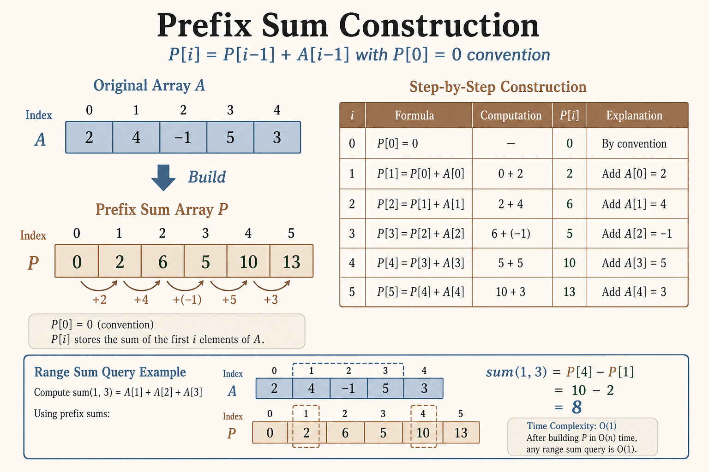
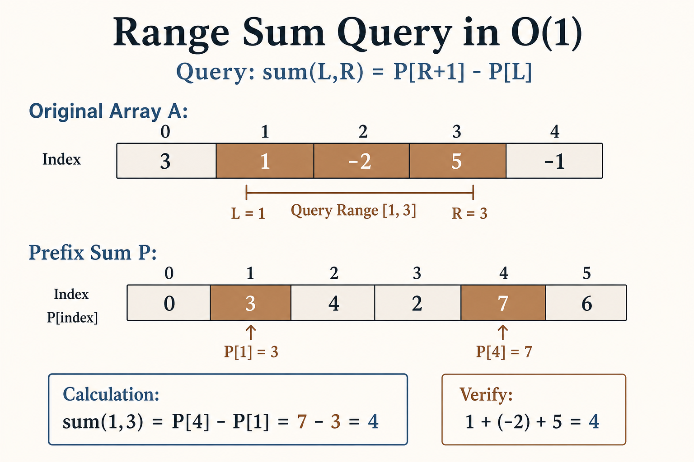
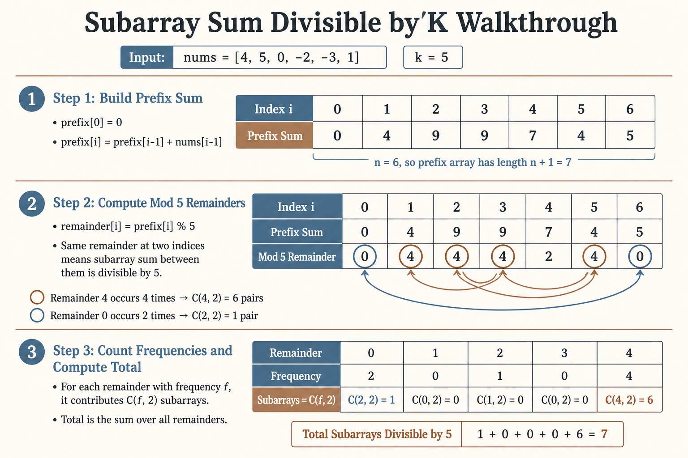
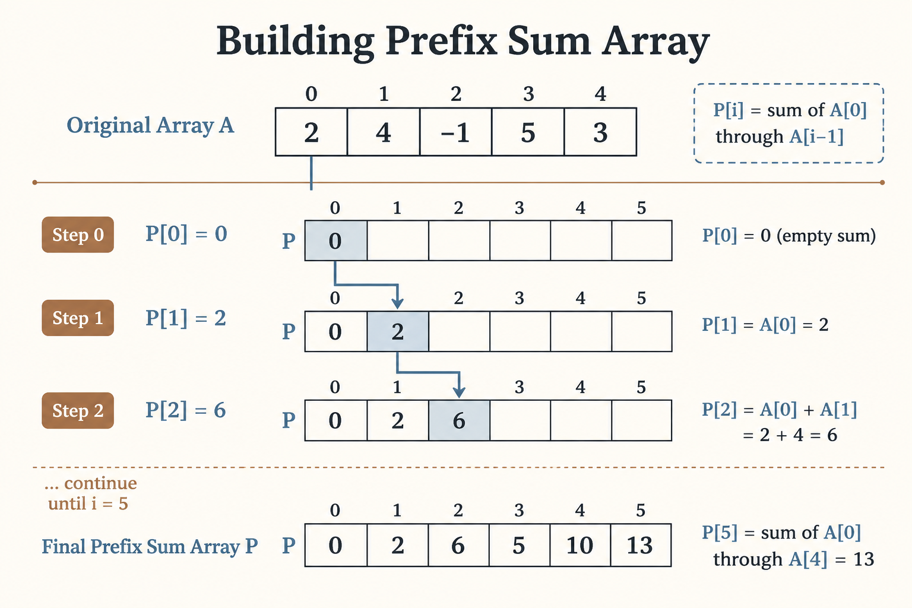
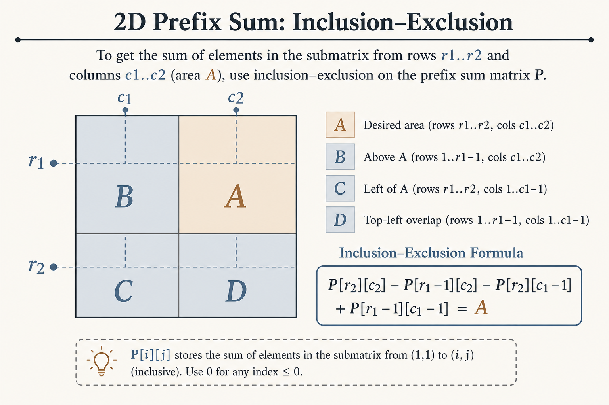
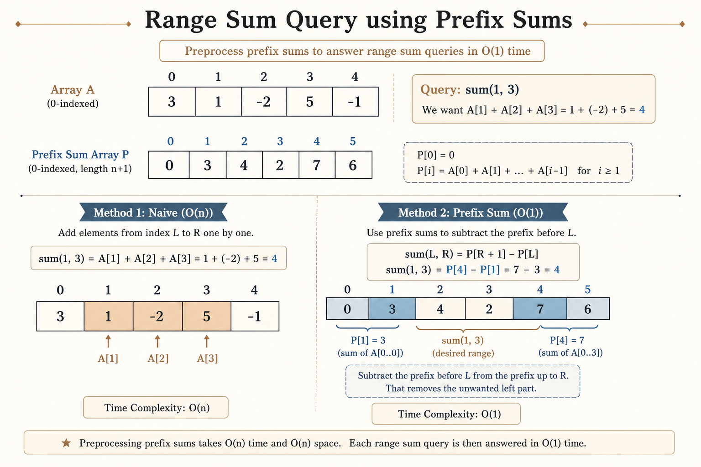
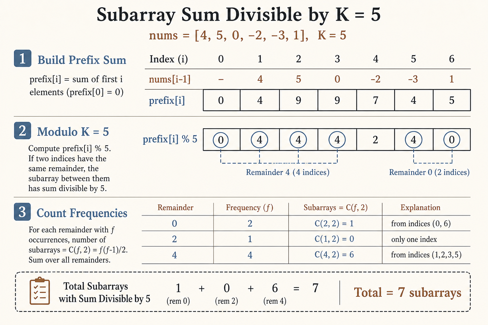
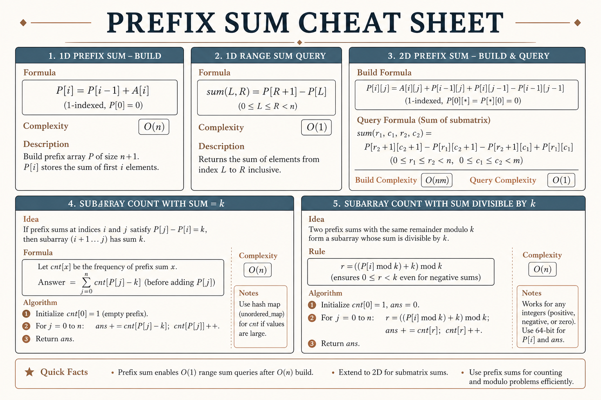

<div align="center">

# 📊 Prefix Sum Techniques

### *📊 Prefix Sum Techniques*


<p>
  
  
</p>

</div>

---

## 🎯 At a Glance

| | |
|:---|:---|
| **Topic** | 📊 Prefix Sum Techniques |
| **Difficulty** | Easy to Hard |
| **Problems** | 20+ |

{: .highlight }
> **How to use this page:** Scan **At a Glance**, then work through theory → visuals → code for each pattern.


## 🧭 Navigation

| ⬅️ Previous | 📂 Current | ➡️ Next |
|:------------|:----------:|--------:|
| [← 02. Subarray Problems](../02_subarray_problems/README.md) | **03. Prefix Sum** | [04. Matrix Problems →](../04_matrix_problems/README.md) |


## 📐 Mathematical Foundation

### 1️⃣ Prefix Sum Definition & Formula

**Definition:** Prefix sum array $P$ where:

$$P[i] = \sum_{j=0}^{i} A[j]$$

**Explicit Formula:**

$$\boxed{P[0] = A[0], \quad P[i] = P[i-1] + A[i] \text{ for } i > 0}$$

**Key Identity - Range Sum:**

$$\text{sum}(L, R) = P[R] - P[L-1]$$

**Proof:**

$$\begin{aligned}
P[R] - P[L-1] &= \sum_{i=0}^{R} A[i] - \sum_{i=0}^{L-1} A[i] \\
&= \sum_{i=L}^{R} A[i] \quad \text{∎}
\end{aligned}$$



---

### 3️⃣ Range Sum Query

**Query formula:** $\text{sum}(L, R) = P[R] - P[L-1]$



---

### 4️⃣ Subarray Sum Divisible by K

Use prefix sums with modulo: if $P[j] \equiv P[i] \pmod{k}$, the subarray $(i+1..j)$ has sum divisible by $k$.



---

### 5️⃣ Product of Array Except Self

**Idea:** $\text{result}[i] = (\text{product of left}) \times (\text{product of right})$ using prefix and suffix products.



---

### 6️⃣ Why P[0] = 0 Convention?

**Including P[0] = 0 simplifies boundary cases:**

$$\text{sum}(0, R) = P[R] - P[-1] = P[R] - 0 = P[R]$$

**With this convention:**

$$P[i] = \sum_{j=0}^{i-1} A[j] \quad \text{(exclusive right bound)}$$

**Comparison:**


Without P[0]=0:

With P[0]=0:
         ↑
    Simplifies sum(0,R)


---

### 7️⃣ 2D Prefix Sum (Matrix)

**Definition for 2D array:**

$$P[i][j] = \sum_{r=0}^{i} \sum_{c=0}^{j} A[r][c]$$

**Recurrence Relation:**

$$\boxed{P[i][j] = P[i-1][j] + P[i][j-1] - P[i-1][j-1] + A[i][j]}$$

**Range Sum Query (r1,c1) to (r2,c2):**

$$\boxed{\text{sum} = P[r2][c2] - P[r1-1][c2] - P[r2][c1-1] + P[r1-1][c1-1]}$$

**Visual Explanation:**




---

### 8️⃣ Mathematical Properties

**Property 1: Linearity**

$$P[A + B] = P[A] + P[B]$$

**Property 2: Difference**

$$A[i] = P[i] - P[i-1]$$

**Property 3: Telescoping**

$$\sum_{i=L}^{R} (P[i] - P[i-1]) = P[R] - P[L-1]$$

**Property 4: Modulo Arithmetic**

If $P[i] \equiv P[j] \pmod{k}$, then:

$$\sum_{x=i+1}^{j} A[x] \equiv 0 \pmod{k}$$

**Proof:**

$$\begin{aligned}
P[j] - P[i] &\equiv 0 \pmod{k} \\
\sum_{x=0}^{j} A[x] - \sum_{x=0}^{i} A[x] &\equiv 0 \pmod{k} \\
\sum_{x=i+1}^{j} A[x] &\equiv 0 \pmod{k} \quad \text{∎}
\end{aligned}$$

---

## 📊 Visual Overview

<div align="center">

### Building Prefix Sum Array


### Method 1: Direct Sum (Naive) - O(n)


### Step 1: Build Prefix Sum Array


### Idea: result[i] = (product of left) × (product of right)
![Idea: result[i] = (product of left) × (product of right)](./images/idea-resulti-product-of-left-product-of-right.png)

### PREFIX SUM CHEAT SHEET


</div>

---

## 💻 Code Implementations

```python
def buildPrefixSum(nums: list[int]) -> list[int]:
    """
    Build prefix sum array with P[0] = 0 convention.
    
    Formula: P[i] = P[i-1] + nums[i-1]
    
    Time: O(n), Space: O(n)
    """
        n = len(nums)
    prefix = [0] * (n + 1)
    
        for i in range(n):
        prefix[i + 1] = prefix[i] + nums[i]
    
    return prefix

    
def rangeSum(prefix: list[int], left: int, right: int) -> int:
    """
    Query sum from left to right (inclusive) in O(1).
    
    Formula: sum(L, R) = P[R+1] - P[L]
    
    Time: O(1)
    """
    return prefix[right + 1] - prefix[left]

def subarraysDivByK(nums: list[int], k: int) -> int:
    """
    Count subarrays with sum divisible by K.
    
    Mathematical Insight:
    If P[i] ≡ P[j] (mod k), then sum(i+1, j) ≡ 0 (mod k)
    
    Time: O(n), Space: O(k)
    """
    from collections import defaultdict
    
    prefix_sum = 0
    count = 0
    mod_count = defaultdict(int)
    mod_count[0] = 1  # Empty prefix
    
    for num in nums:
        prefix_sum += num
        # Handle negative modulo properly
        remainder = prefix_sum % k
        
        # Count how many times we've seen this remainder
        count += mod_count[remainder]
        mod_count[remainder] += 1
    
    return count

def productExceptSelf(nums: list[int]) -> list[int]:
    """
    Product of array except self without division.
    
    Idea: result[i] = (left prefix product) × (right suffix product)
    
    Optimization: Use output array for left products,
                  calculate right products on-the-fly
    
    Time: O(n), Space: O(1) excluding output
    """
    n = len(nums)
    result = [1] * n
    
    # Build left products
    left_product = 1
    for i in range(n):
        result[i] = left_product
        left_product *= nums[i]
    
    # Build right products and multiply
    right_product = 1
    for i in range(n - 1, -1, -1):
        result[i] *= right_product
        right_product *= nums[i]
    
    return result

def pivotIndex(nums: list[int]) -> int:
    """
    Find pivot where left sum = right sum.
    
    Mathematical Identity:
    At pivot i: P[i] = (Total - P[i] - nums[i])
    Simplifies to: 2×P[i] + nums[i] = Total
    
    Time: O(n), Space: O(1)
    """
    total = sum(nums)
    left_sum = 0
    
    for i in range(len(nums)):
        # Check if left_sum equals right_sum
        # right_sum = total - left_sum - nums[i]
        if left_sum == total - left_sum - nums[i]:
            return i
        left_sum += nums[i]
    
    return -1

def matrixBlockSum(mat: list[list[int]], k: int) -> list[list[int]]:
    """
    2D Prefix Sum - Sum of submatrix in O(1).
    
    Formula for range sum:
    sum = P[r2][c2] - P[r1-1][c2] - P[r2][c1-1] + P[r1-1][c1-1]
    
    Time: O(m×n), Space: O(m×n)
    """
    m, n = len(mat), len(mat[0])
    
    # Build 2D prefix sum
    prefix = [[0] * (n + 1) for _ in range(m + 1)]
    for i in range(1, m + 1):
        for j in range(1, n + 1):
            prefix[i][j] = (prefix[i-1][j] + 
                          prefix[i][j-1] - 
                          prefix[i-1][j-1] + 
                          mat[i-1][j-1])
    
    # Calculate result
    result = [[0] * n for _ in range(m)]
    for i in range(m):
        for j in range(n):
            r1 = max(0, i - k)
            c1 = max(0, j - k)
            r2 = min(m - 1, i + k)
            c2 = min(n - 1, j + k)
            
            # Query using prefix sum (adjust for 1-indexed)
            result[i][j] = (prefix[r2+1][c2+1] - 
                          prefix[r1][c2+1] - 
                          prefix[r2+1][c1] + 
                          prefix[r1][c1])
    
    return result

def continuousSubarraySum(nums: list[int], k: int) -> bool:
    """
    Check if continuous subarray sum is multiple of k (length ≥ 2).
    
    Mathematical Insight:
    If P[i] ≡ P[j] (mod k) and j > i+1, then sum(i+1,j) ≡ 0 (mod k)
    
    Time: O(n), Space: O(min(n,k))
    """
    prefix_sum = 0
    mod_seen = {0: -1}  # Map remainder to index
    
    for i, num in enumerate(nums):
        prefix_sum += num
        remainder = prefix_sum % k if k != 0 else prefix_sum
        
        if remainder in mod_seen:
            # Check if subarray length >= 2
            if i - mod_seen[remainder] >= 2:
                return True
        else:
            mod_seen[remainder] = i
    
    return False
```


```text
  1D Sum?  2D Sum?  =k?    Divisible?  2D Prefix
    |         |     |         |
  Basic   2D Array  Hash   Mod+Hash
  Prefix
```


**Example:** n = 10⁶ elements, Q = 10⁶ queries

**Without Prefix Sum:**

- Each query scans array: O(n)

- Total: O(Q×n) = 10¹² operations ❌

**With Prefix Sum:**

- Preprocess: O(n) = 10⁶

- All queries: O(Q) = 10⁶

- Total: O(n+Q) = 2×10⁶ operations ✅

Speedup: 500,000× faster!


```text
Mod 3:  [0, 1, 0, 0,  1,  0]
         ↑     ↑  ↑      ↑
         4 positions with remainder 0
         → C(4,2) = 6 subarrays divisible by 3
```

## 🧠 Advanced Techniques

### Prefix XOR

```python
def xorQueries(arr: list[int], queries: list[list[int]]) -> list[int]:
    """
    XOR analog of prefix sum.
    
    Property: a ^ a = 0, so:
    xor(L, R) = prefix_xor[R+1] ^ prefix_xor[L]
    
    Time: O(n + q), Space: O(n)
    """
    n = len(arr)
    prefix_xor = [0] * (n + 1)
    
    for i in range(n):
        prefix_xor[i + 1] = prefix_xor[i] ^ arr[i]
    
    result = []
    for left, right in queries:
        result.append(prefix_xor[right + 1] ^ prefix_xor[left])
    
    return result
```

### Prefix with HashMap - Classic Pattern

```python
def subarraySumPattern(nums: list[int], target: int) -> int:
    """
    Template for 'subarray sum = target' problems.
    
    Pattern:
    1. Track prefix sums in HashMap
    2. At each index, look for (current_prefix - target)
    3. Increment count by frequency of that value
    
    Time: O(n), Space: O(n)
    """
    from collections import defaultdict
    
    prefix_sum = 0
    count = 0
    prefix_map = defaultdict(int)
    prefix_map[0] = 1  # Empty subarray
    
    for num in nums:
        prefix_sum += num
        # Check if (prefix_sum - target) exists
        count += prefix_map[prefix_sum - target]
        # Add current prefix to map
        prefix_map[prefix_sum] += 1
    
    return count
```


## ⚠️ Common Pitfalls

### Pitfall 1: Off-by-One in Range Query

```python
# ❌ WRONG: Direct indexing
sum_range = prefix[right] - prefix[left]

# ✅ CORRECT: With P[0]=0 convention
sum_range = prefix[right + 1] - prefix[left]
```

### Pitfall 2: Forgetting Base Case

```python
# ❌ WRONG: Missing empty subarray
prefix_map = {}

# ✅ CORRECT: Include P[0]=0
prefix_map = {0: 1}
```

### Pitfall 3: Negative Modulo

```python
# ❌ WRONG: Negative remainders in Python
remainder = prefix_sum % k

# ✅ CORRECT: Always positive
remainder = prefix_sum % k
# Python handles this correctly, but in other languages:
# remainder = ((prefix_sum % k) + k) % k
```

---

## 🏆 LeetCode Problems

### 🟢 Easy

| # | Problem | Pattern | Time | Space |
|:-:|---------|---------|:----:|:-----:|
| 303 | [Range Sum Query Immutable](https://leetcode.com/problems/range-sum-query-immutable/) | Prefix Sum | O(1) query | O(n) |
| 724 | [Find Pivot Index](https://leetcode.com/problems/find-pivot-index/) | Prefix Sum | O(n) | O(1) |

### 🟡 Medium

| # | Problem | Pattern | Time | Space |
|:-:|---------|---------|:----:|:-----:|
| 560 | [Subarray Sum Equals K](https://leetcode.com/problems/subarray-sum-equals-k/) | Prefix + Hash | O(n) | O(n) |
| 974 | [Subarray Sums Divisible by K](https://leetcode.com/problems/subarray-sums-divisible-by-k/) | Prefix + Mod | O(n) | O(k) |
| 238 | [Product of Array Except Self](https://leetcode.com/problems/product-of-array-except-self/) | Prefix/Suffix | O(n) | O(1) |
| 304 | [Range Sum Query 2D](https://leetcode.com/problems/range-sum-query-2d-immutable/) | 2D Prefix | O(1) query | O(mn) |
| 523 | [Continuous Subarray Sum](https://leetcode.com/problems/continuous-subarray-sum/) | Prefix + Mod | O(n) | O(n) |

### 🔴 Hard

| # | Problem | Pattern | Time | Space |
|:-:|---------|---------|:----:|:-----:|
| 1314 | [Matrix Block Sum](https://leetcode.com/problems/matrix-block-sum/) | 2D Prefix | O(mn) | O(mn) |

---

## 📚 References & Learning Resources

### 📖 Core Concepts

| Resource | Description | Link |
|----------|-------------|------|
| **Prefix Sum** | GeeksforGeeks | [Prefix Sum Array](https://www.geeksforgeeks.org/prefix-sum-array-implementation-analysis-applications/) |
| **Bentley (1984)** | Maximum subarray | [Programming Pearls](https://www.cs.cmu.edu/~15451-f17/Handouts/bentley1984.pdf) |
| **LeetCode** | Prefix sum guide | [Discussion](https://leetcode.com/discuss/general-discussion/785701/) |

### 📝 Practice

| Platform | Focus | Link |
|----------|-------|------|
| **LeetCode** | Array tag | [Problems](https://leetcode.com/tag/array/) |

---

## 📋 Cheat Sheet


---


### 🎯 Master Prefix Sum: From O(n²) to O(n)

*The art of preprocessing: spend O(n) once, answer infinite queries in O(1)*

**Made with ❤️ by [Gaurav Goswami](https://github.com/Gaurav14cs17)**

[⬅️ Subarray Problems](../02_subarray_problems/README.md) | [➡️ Matrix Problems](../04_matrix_problems/README.md)

---

*"Preprocessing is the secret weapon of competitive programmers"* 💪  
*Start with Range Sum Query (#303) today!* 🚀

</div>

---
