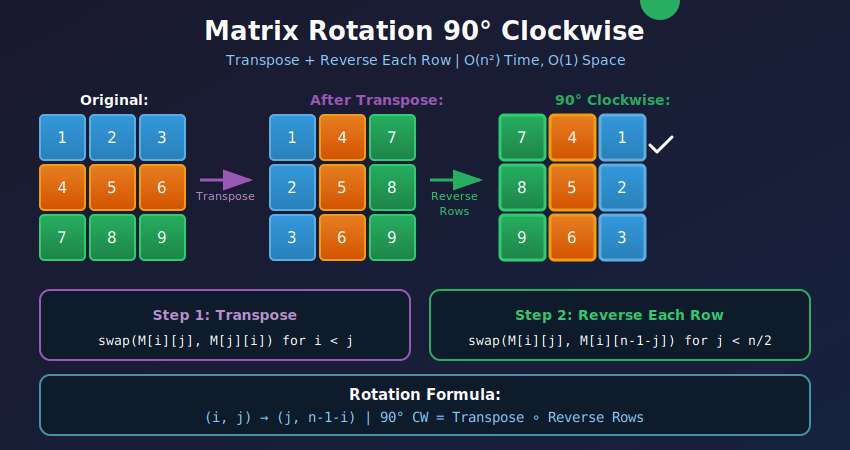
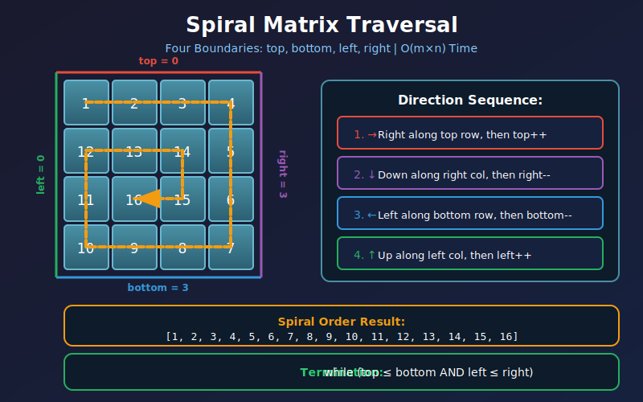
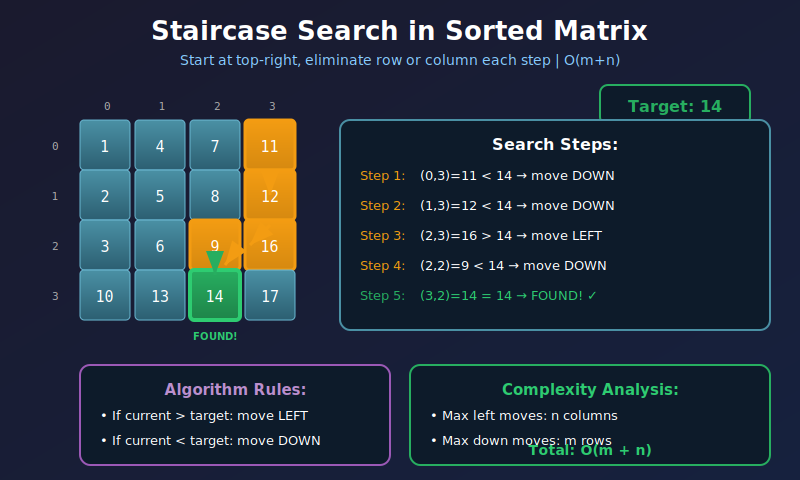
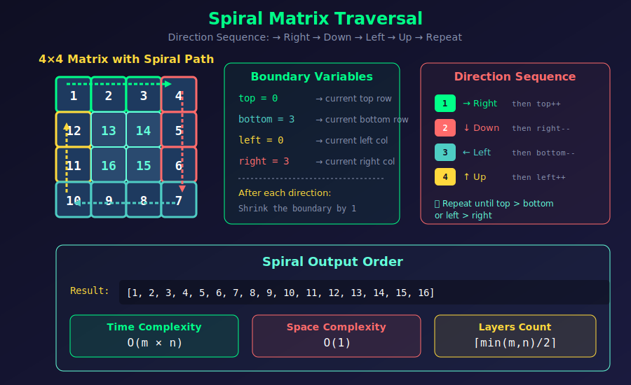

<div align="center">

# 🎯 Matrix Problems

<p>
  
  
</p>

</div>

---

## 🧭 Navigation

| ⬅️ Previous | 📂 Current | ➡️ Next |
|:------------|:----------:|--------:|
| [← 03. Prefix Sum](../03_prefix_sum/README.md) | **04. Matrix Problems** | [05. Interval Problems →](../05_interval_problems/README.md) |

---

## 🎨 Visual Diagrams

<div align="center">

### Matrix Rotation 90° Clockwise


### Spiral Matrix Traversal


### Staircase Search in Sorted Matrix


### Spiral Traversal


</div>

---

## 📐 Mathematical Foundations

### 1️⃣ Matrix Indexing & Coordinates

**Row-major order (most programming languages):**

```math
\text{Address}(i, j) = \text{Base} + (i \times n + j) \times \text{sizeof(element)}

```

**Column-major order (Fortran, MATLAB):**

```math
\text{Address}(i, j) = \text{Base} + (j \times m + i) \times \text{sizeof(element)}

```

Where $m$ = rows, $n$ = columns.

---

### 2️⃣ Matrix Rotation Mathematics

**90° Clockwise Rotation:**

```math
\boxed{M'[j][m-1-i] = M[i][j]}

```

**Transpose + Reverse Rows Algorithm:**

```math
\text{Rotate 90°} = \text{Transpose} \circ \text{Reverse Each Row}

```

**Proof by Example (3×3):**

```
Original:           Transpose:          Reverse Rows:
+---+---+---+      +---+---+---+      +---+---+---+

| 1 | 2 | 3 |      | 1 | 4 | 7 |      | 7 | 4 | 1 |
+---+---+---+  →   +---+---+---+  →   +---+---+---+

| 4 | 5 | 6 |      | 2 | 5 | 8 |      | 8 | 5 | 2 |
+---+---+---+      +---+---+---+      +---+---+---+

| 7 | 8 | 9 |      | 3 | 6 | 9 |      | 9 | 6 | 3 |
+---+---+---+      +---+---+---+      +---+---+---+
                                        (90° clockwise ✓)

```

**Rotation Angles:**

```math
\begin{aligned}
\text{90° clockwise} &: (i, j) \to (j, m-1-i) \\
\text{180°} &: (i, j) \to (m-1-i, n-1-j) \\
\text{270° clockwise} &: (i, j) \to (n-1-j, i) \\
\text{90° counter-clockwise} &: (i, j) \to (n-1-j, i)
\end{aligned}

```

---

### 3️⃣ Spiral Matrix Mathematics

**Spiral traversal maintains 4 boundaries:**

```math
\begin{aligned}
\text{top} &: \text{current top row} \\
\text{bottom} &: \text{current bottom row} \\
\text{left} &: \text{current left column} \\
\text{right} &: \text{current right column}
\end{aligned}

```

**Total elements in $m \times n$ matrix:**

```math
\text{total} = m \times n

```

**Number of complete layers:**

```math
\text{layers} = \left\lceil \min(m, n) / 2 \right\rceil

```

---

### 4️⃣ Matrix Search - Complexity Analysis

**Linear search (brute force):**

```math
T(m, n) = O(m \times n)

```

**Staircase search (sorted rows & columns):**

Start at top-right or bottom-left:

```math
\boxed{T(m, n) = O(m + n)}

```

**Proof of O(m+n) for staircase search:**

- Start at position $(0, n-1)$ (top-right)

- Each comparison moves either left or down

- Maximum left moves: $n$

- Maximum down moves: $m$

- Total: $m + n$ moves ∎

---

### 5️⃣ Visual: Matrix Rotation (90° Clockwise)

```
4×4 Matrix Rotation Process:

Original Matrix:                   After Transpose:
+----+----+----+----+             +----+----+----+----+

|  1 |  2 |  3 |  4 |             |  1 |  5 |  9 | 13 |
+----+----+----+----+             +----+----+----+----+

|  5 |  6 |  7 |  8 |      →      |  2 |  6 | 10 | 14 |
+----+----+----+----+             +----+----+----+----+

|  9 | 10 | 11 | 12 |             |  3 |  7 | 11 | 15 |
+----+----+----+----+             +----+----+----+----+

| 13 | 14 | 15 | 16 |             |  4 |  8 | 12 | 16 |
+----+----+----+----+             +----+----+----+----+

Transpose: M[i][j] ↔ M[j][i]

After Reverse Each Row:
+----+----+----+----+

| 13 |  9 |  5 |  1 |  ← Reversed row 0
+----+----+----+----+

| 14 | 10 |  6 |  2 |  ← Reversed row 1
+----+----+----+----+

| 15 | 11 |  7 |  3 |  ← Reversed row 2
+----+----+----+----+

| 16 | 12 |  8 |  4 |  ← Reversed row 3
+----+----+----+----+

Result: 90° Clockwise Rotation ✓

Mathematical Verification:
Original [0][3] = 4  →  New [3][3] = 4  ✓
Original [3][0] = 13 →  New [0][0] = 13 ✓
Formula: (i,j) → (j, n-1-i)

```

---

### 6️⃣ Visual: Spiral Matrix Traversal

```
Input: m=4, n=4

+--------------------------------------------------------------------+

|  Direction Sequence: Right → Down → Left → Up → Repeat            |
+--------------------------------------------------------------------+
|                                                                    |
|  Boundaries: top=0, bottom=3, left=0, right=3                     |
|                                                                    |
|  Step 1: Go Right (top row)                                       |
|  +----+----+----+----+                                            |
|  | →1 | →2 | →3 | →4 |  top = 0                                   |
|  +----+----+----+----+                                            |
|  |  5 |  6 |  7 |  8 |                                            |
|  +----+----+----+----+                                            |
|  |  9 | 10 | 11 | 12 |                                            |
|  +----+----+----+----+                                            |
|  | 13 | 14 | 15 | 16 |                                            |
|  +----+----+----+----+                                            |
|  After: top++ → top=1                                             |
|                                                                    |
|  Step 2: Go Down (right column)                                   |
|  +----+----+----+----+                                            |
|  |  1 |  2 |  3 |  4 |                                            |
|  +----+----+----+----+                                            |
|  |  5 |  6 |  7 | ↓8 |  right = 3                                 |
|  +----+----+----+----+                                            |
|  |  9 | 10 | 11 |↓12 |                                            |
|  +----+----+----+----+                                            |
|  | 13 | 14 | 15 |↓16 |                                            |
|  +----+----+----+----+                                            |
|  After: right-- → right=2                                         |
|                                                                    |
|  Step 3: Go Left (bottom row)                                     |
|  +----+----+----+----+                                            |
|  |  1 |  2 |  3 |  4 |                                            |
|  +----+----+----+----+                                            |
|  |  5 |  6 |  7 |  8 |                                            |
|  +----+----+----+----+                                            |
|  |  9 | 10 | 11 | 12 |                                            |
|  +----+----+----+----+                                            |
|  |←13 |←14 |←15 | 16 |  bottom = 3                                |
|  +----+----+----+----+                                            |
|  After: bottom-- → bottom=2                                       |
|                                                                    |
|  Step 4: Go Up (left column)                                      |
|  +----+----+----+----+                                            |
|  |  1 |  2 |  3 |  4 |                                            |
|  +----+----+----+----+                                            |
|  | ↑5 |  6 |  7 |  8 |  left = 0                                  |
|  +----+----+----+----+                                            |
|  | ↑9 | 10 | 11 | 12 |                                            |
|  +----+----+----+----+                                            |
|  | 13 | 14 | 15 | 16 |                                            |
|  +----+----+----+----+                                            |
|  After: left++ → left=1                                           |
|                                                                    |
|  Continue with inner spiral...                                    |
|  Result: [1,2,3,4,8,12,16,15,14,13,9,5,6,7,11,10]                 |
+--------------------------------------------------------------------+

```

---

### 7️⃣ Visual: Search in Sorted Matrix (Staircase)

```
Matrix: Each row sorted, each column sorted
Search for target = 14

+----+----+----+----+

|  1 |  4 |  7 | 11 |
+----+----+----+----+

|  2 |  5 |  8 | 12 |
+----+----+----+----+

|  3 |  6 |  9 | 16 |
+----+----+----+----+

| 10 | 13 | 14 | 17 |
+----+----+----+----+

+--------------------------------------------------------------------+

|  Staircase Search: Start at top-right (i=0, j=3)                   |
+--------------------------------------------------------------------+
|                                                                    |
|  Step 1: Start at (0,3) = 11                                      |
|  +----+----+----+----+                                            |
|  |  1 |  4 |  7 |[11]|  ← 11 < 14, move down                      |
|  +----+----+----+----+                                            |
|  |  2 |  5 |  8 | 12 |                                            |
|  +----+----+----+----+                                            |
|  |  3 |  6 |  9 | 16 |                                            |
|  +----+----+----+----+                                            |
|  | 10 | 13 | 14 | 17 |                                            |
|  +----+----+----+----+                                            |
|                                                                    |
|  Step 2: Move to (1,3) = 12                                       |
|  +----+----+----+----+                                            |
|  |  1 |  4 |  7 | 11 |                                            |
|  +----+----+----+----+                                            |
|  |  2 |  5 |  8 |[12]|  ← 12 < 14, move down                      |
|  +----+----+----+----+                                            |
|  |  3 |  6 |  9 | 16 |                                            |
|  +----+----+----+----+                                            |
|  | 10 | 13 | 14 | 17 |                                            |
|  +----+----+----+----+                                            |
|                                                                    |
|  Step 3: Move to (2,3) = 16                                       |
|  +----+----+----+----+                                            |
|  |  1 |  4 |  7 | 11 |                                            |
|  +----+----+----+----+                                            |
|  |  2 |  5 |  8 | 12 |                                            |
|  +----+----+----+----+                                            |
|  |  3 |  6 |  9 |[16]|  ← 16 > 14, move left                      |
|  +----+----+----+----+                                            |
|  | 10 | 13 | 14 | 17 |                                            |
|  +----+----+----+----+                                            |
|                                                                    |
|  Step 4: Move to (2,2) = 9                                        |
|  +----+----+----+----+                                            |
|  |  1 |  4 |  7 | 11 |                                            |
|  +----+----+----+----+                                            |
|  |  2 |  5 |  8 | 12 |                                            |
|  +----+----+----+----+                                            |
|  |  3 |  6 | [9]| 16 |  ← 9 < 14, move down                       |
|  +----+----+----+----+                                            |
|  | 10 | 13 | 14 | 17 |                                            |
|  +----+----+----+----+                                            |
|                                                                    |
|  Step 5: Move to (3,2) = 14                                       |
|  +----+----+----+----+                                            |
|  |  1 |  4 |  7 | 11 |                                            |
|  +----+----+----+----+                                            |
|  |  2 |  5 |  8 | 12 |                                            |
|  +----+----+----+----+                                            |
|  |  3 |  6 |  9 | 16 |                                            |
|  +----+----+----+----+                                            |
|  | 10 | 13 |[14]| 17 |  ← FOUND! ✓                                |
|  +----+----+----+----+                                            |
|                                                                    |
|  Total Steps: 5 (much less than 16!)                              |
|  Time Complexity: O(m + n)                                        |
+--------------------------------------------------------------------+

Algorithm:

- If current > target: move left (eliminate column)

- If current < target: move down (eliminate row)

- Each step eliminates one row or column!

```

---

## 💻 Code Implementations

```python
def rotate(matrix: list[list[int]]) -> None:
    """
    Rotate matrix 90° clockwise in-place.
    
    Algorithm: Transpose + Reverse each row
    
    Mathematical Proof:
    (i,j) --transpose--> (j,i) --reverse--> (j, n-1-i)
    Which is the formula for 90° clockwise rotation!
    
    Time: O(n²), Space: O(1)
    """
    n = len(matrix)
    
    # Step 1: Transpose (swap across diagonal)
    for i in range(n):
        for j in range(i + 1, n):
            matrix[i][j], matrix[j][i] = matrix[j][i], matrix[i][j]
    
    # Step 2: Reverse each row
    for i in range(n):
        matrix[i].reverse()

def spiralOrder(matrix: list[list[int]]) -> list[int]:
    """
    Traverse matrix in spiral order.
    
    Maintain 4 boundaries: top, bottom, left, right
    Direction sequence: Right → Down → Left → Up → Repeat
    
    Time: O(m×n), Space: O(1) excluding output
    """
    if not matrix:
        return []
    
    result = []
    top, bottom = 0, len(matrix) - 1
    left, right = 0, len(matrix[0]) - 1
    
    while top <= bottom and left <= right:
        # Move right along top row
        for col in range(left, right + 1):
            result.append(matrix[top][col])
        top += 1
        
        # Move down along right column
        for row in range(top, bottom + 1):
            result.append(matrix[row][right])
        right -= 1
        
        # Move left along bottom row (if exists)
        if top <= bottom:
            for col in range(right, left - 1, -1):
                result.append(matrix[bottom][col])
            bottom -= 1
        
        # Move up along left column (if exists)
        if left <= right:
            for row in range(bottom, top - 1, -1):
                result.append(matrix[row][left])
            left += 1
    
    return result

def searchMatrix(matrix: list[list[int]], target: int) -> bool:
    """
    Search in row-sorted and column-sorted matrix.
    
    Staircase Search: Start at top-right or bottom-left
    - If current > target: move left
    - If current < target: move down
    
    Why it works: Moving left/down eliminates entire row/column
    
    Time: O(m + n), Space: O(1)
    """
    if not matrix or not matrix[0]:
        return False
    
    m, n = len(matrix), len(matrix[0])
    row, col = 0, n - 1  # Start at top-right
    
    while row < m and col >= 0:
        current = matrix[row][col]
        
        if current == target:
            return True
        elif current > target:
            col -= 1  # Eliminate column
        else:
            row += 1  # Eliminate row
    
    return False

def setZeroes(matrix: list[list[int]]) -> None:
    """
    Set entire row and column to 0 if element is 0.
    
    Trick: Use first row/column as markers instead of extra space.
    
    Mathematical Invariant:
    - matrix[i][0] = 0 means row i should be zeroed
    - matrix[0][j] = 0 means column j should be zeroed
    
    Time: O(m×n), Space: O(1)
    """
    m, n = len(matrix), len(matrix[0])
    first_row_zero = any(matrix[0][j] == 0 for j in range(n))
    first_col_zero = any(matrix[i][0] == 0 for i in range(m))
    
    # Use first row/col as markers
    for i in range(1, m):
        for j in range(1, n):
            if matrix[i][j] == 0:
                matrix[i][0] = 0
                matrix[0][j] = 0
    
    # Zero out cells based on markers
    for i in range(1, m):
        for j in range(1, n):
            if matrix[i][0] == 0 or matrix[0][j] == 0:
                matrix[i][j] = 0
    
    # Handle first row and column
    if first_row_zero:
        for j in range(n):
            matrix[0][j] = 0
    
    if first_col_zero:
        for i in range(m):
            matrix[i][0] = 0

def generateMatrix(n: int) -> list[list[int]]:
    """
    Generate n×n matrix filled in spiral order (1 to n²).
    
    Same spiral logic as traversal, but filling instead of reading.
    
    Time: O(n²), Space: O(n²) for output
    """
    matrix = [[0] * n for _ in range(n)]
    top, bottom, left, right = 0, n - 1, 0, n - 1
    num = 1
    
    while top <= bottom and left <= right:
        # Right
        for col in range(left, right + 1):
            matrix[top][col] = num
            num += 1
        top += 1
        
        # Down
        for row in range(top, bottom + 1):
            matrix[row][right] = num
            num += 1
        right -= 1
        
        # Left
        if top <= bottom:
            for col in range(right, left - 1, -1):
                matrix[bottom][col] = num
                num += 1
            bottom -= 1
        
        # Up
        if left <= right:
            for row in range(bottom, top - 1, -1):
                matrix[row][left] = num
                num += 1
            left += 1
    
    return matrix

def isValidSudoku(board: list[list[str]]) -> bool:
    """
    Validate Sudoku board (9×9).
    
    Rules:
    - Each row: 1-9 without repetition
    - Each column: 1-9 without repetition
    - Each 3×3 box: 1-9 without repetition
    
    Trick: Use sets to track seen digits
    Box index formula: (i//3, j//3)
    
    Time: O(1) since board is fixed 9×9, Space: O(1)
    """
    rows = [set() for _ in range(9)]
    cols = [set() for _ in range(9)]
    boxes = [[set() for _ in range(3)] for _ in range(3)]
    
    for i in range(9):
        for j in range(9):
            if board[i][j] == '.':
                continue
            
            digit = board[i][j]
            box_i, box_j = i // 3, j // 3
            
            # Check duplicates
            if (digit in rows[i] or 
                digit in cols[j] or 
                digit in boxes[box_i][box_j]):
                return False
            
            # Mark as seen
            rows[i].add(digit)
            cols[j].add(digit)
            boxes[box_i][box_j].add(digit)
    
    return True

def transpose(matrix: list[list[int]]) -> list[list[int]]:
    """
    Transpose matrix (swap rows and columns).
    
    Mathematical: M'[j][i] = M[i][j]
    
    For rectangular m×n matrix, result is n×m.
    
    Time: O(m×n), Space: O(m×n)
    """
    m, n = len(matrix), len(matrix[0])
    result = [[0] * m for _ in range(n)]
    
    for i in range(m):
        for j in range(n):
            result[j][i] = matrix[i][j]
    
    return result

```

---

## 🏆 LeetCode Problems

### 🟢 Easy

| # | Problem | Pattern | Time | Space |
|:-:|---------|---------|:----:|:-----:|
| 36 | [Valid Sudoku](https://leetcode.com/problems/valid-sudoku/) | Hash Sets | O(1) | O(1) |
| 54 | [Spiral Matrix](https://leetcode.com/problems/spiral-matrix/) | Boundary Tracking | O(m×n) | O(1) |
| 73 | [Set Matrix Zeroes](https://leetcode.com/problems/set-matrix-zeroes/) | In-place Markers | O(m×n) | O(1) |
| 118 | [Pascal's Triangle](https://leetcode.com/problems/pascals-triangle/) | Combinatorics | O(n²) | O(1) |
| 566 | [Reshape the Matrix](https://leetcode.com/problems/reshape-the-matrix/) | Flat Index | O(m×n) | O(m×n) |
| 867 | [Transpose Matrix](https://leetcode.com/problems/transpose-matrix/) | Index Swap | O(m×n) | O(m×n) |

### 🟡 Medium

| # | Problem | Pattern | Time | Space |
|:-:|---------|---------|:----:|:-----:|
| 48 | [Rotate Image](https://leetcode.com/problems/rotate-image/) | Transpose + Reverse | O(n²) | O(1) |
| 59 | [Spiral Matrix II](https://leetcode.com/problems/spiral-matrix-ii/) | Boundary Tracking | O(n²) | O(n²) |
| 74 | [Search a 2D Matrix](https://leetcode.com/problems/search-a-2d-matrix/) | Binary Search | O(log(m×n)) | O(1) |
| 240 | [Search a 2D Matrix II](https://leetcode.com/problems/search-a-2d-matrix-ii/) | Staircase Search | O(m+n) | O(1) |
| 289 | [Game of Life](https://leetcode.com/problems/game-of-life/) | In-place Encoding | O(m×n) | O(1) |
| 378 | [Kth Smallest Element in Sorted Matrix](https://leetcode.com/problems/kth-smallest-element-in-a-sorted-matrix/) | Binary Search | O(n×log(max-min)) | O(1) |
| 498 | [Diagonal Traverse](https://leetcode.com/problems/diagonal-traverse/) | Direction Control | O(m×n) | O(1) |
| 885 | [Spiral Matrix III](https://leetcode.com/problems/spiral-matrix-iii/) | Expanding Spiral | O(max(m,n)²) | O(1) |
| 1072 | [Flip Columns For Maximum Equal Rows](https://leetcode.com/problems/flip-columns-for-maximum-number-of-equal-rows/) | Pattern Hashing | O(m×n) | O(m) |

### 🔴 Hard

| # | Problem | Pattern | Time | Space |
|:-:|---------|---------|:----:|:-----:|
| 37 | [Sudoku Solver](https://leetcode.com/problems/sudoku-solver/) | Backtracking | O(9^(n×m)) | O(1) |
| 85 | [Maximal Rectangle](https://leetcode.com/problems/maximal-rectangle/) | Histogram Stack | O(m×n) | O(n) |
| 212 | [Word Search II](https://leetcode.com/problems/word-search-ii/) | Trie + DFS | O(m×n×4^L) | O(N) |
| 302 | [Smallest Rectangle Enclosing Black Pixels](https://leetcode.com/problems/smallest-rectangle-enclosing-black-pixels/) | Binary Search | O(m×log n + n×log m) | O(1) |
| 329 | [Longest Increasing Path in Matrix](https://leetcode.com/problems/longest-increasing-path-in-a-matrix/) | DFS + Memoization | O(m×n) | O(m×n) |

---

## 📊 Pattern Decision Tree

```
                Matrix Problem?
                      |
       +--------------+--------------+
       |              |              |
   Traverse?      Modify?        Search?
       |              |              |
   +---+---+      +---+---+      +---+---+
   |       |      |       |      |       |
 Spiral  Layer  Rotate  Zero  Sorted  Value
   |       |      |       |      |       |
 Boundary Diagonal Trans- In-place Binary Staircase
 Tracking        pose  Markers  Search

```

---

## 💡 Key Insights & Pro Tips

> **🎯 Rotation Trick**  
> 90° clockwise = Transpose + Reverse rows. 90° counter-clockwise = Transpose + Reverse columns.

> **⚡ Spiral Pattern**  
> Maintain 4 boundaries. Always move: Right → Down → Left → Up. Shrink boundaries after each direction.

> **🔄 In-Place Matrix Manipulation**  
> Use first row/column as markers. Process inner matrix first, then handle borders separately.

> **📊 Staircase Search**  
> For sorted rows & columns: Start at corner (top-right or bottom-left). Each comparison eliminates a row or column!

> **🔍 Flat Index Conversion**  
> Convert 2D (i,j) to 1D: `index = i * n + j`. Convert back: `i = index // n, j = index % n`.

> **💰 Box Index Formula**  
> For 3×3 boxes in Sudoku: `box_i = i // 3, box_j = j // 3`. Generalizes to k×k boxes.

---

## 🎓 Pattern Recognition Guide

### Identifying Matrix Patterns

| Clue | Pattern | Example Problems |
|------|---------|------------------|
| **"Spiral order"** | Boundary tracking | Spiral Matrix I, II, III |
| **"Rotate 90°"** | Transpose + reverse | Rotate Image |
| **"Row & col sorted"** | Staircase search | Search 2D Matrix II |
| **"Set to zero"** | In-place markers | Set Matrix Zeroes |
| **"Diagonal traversal"** | Direction control | Diagonal Traverse |
| **"3×3 boxes"** | Box index formula | Sudoku problems |
| **"Layer by layer"** | Nested boundaries | Rotate, Spiral |

---

## 🎯 Complexity Analysis

### Common Matrix Operations

| Operation | Naive | Optimized | Technique |
|-----------|:-----:|:---------:|-----------|
| **Search (sorted rows/cols)** | O(m×n) | **O(m+n)** | Staircase |
| **Rotate 90°** | O(n²) | **O(n²)** | Transpose + reverse |
| **Spiral traversal** | O(m×n) | **O(m×n)** | Optimal |
| **Set zeroes** | O(m×n), O(m+n) space | **O(m×n), O(1)** | In-place markers |
| **Transpose** | O(m×n) | **O(m×n)** | Optimal for new matrix |

### Space Optimization Techniques

```
Problem: Set Matrix Zeroes

❌ O(m+n) space: Store zero rows/cols in sets
❌ O(m×n) space: Create copy of matrix

✅ O(1) space:
   - Use first row/col as markers
   - Track if first row/col originally had zeros
   - Process inner matrix using markers
   - Handle first row/col separately

```

---

## 🧮 Mathematical Deep Dive

### Matrix Rotation Group Theory

Rotations form a cyclic group of order 4:

```math
\begin{aligned}
R_0 &= \text{Identity (0°)} \\
R_1 &= \text{90° rotation} \\
R_2 &= R_1 \circ R_1 = \text{180° rotation} \\
R_3 &= R_1 \circ R_1 \circ R_1 = \text{270° rotation} \\
R_4 &= R_1 \circ R_1 \circ R_1 \circ R_1 = R_0
\end{aligned}

```

**Properties:**

- $R_1 \circ R_3 = R_0$ (90° + 270° = 360° = 0°)

- Rotation is reversible: $(R_1)^{-1} = R_3$

### Staircase Search Correctness

**Invariant:** Elements eliminated are always out of range.

**Proof by Induction:**

1. **Base:** Start at $(0, n-1)$ (top-right)

2. **Step:** At position $(i, j)$:
   - If $M[i][j] > \text{target}$: move left (eliminate column $j$)
     - All elements in column $j$ are $\geq M[i][j] > \text{target}$ ✓
   - If $M[i][j] < \text{target}$: move down (eliminate row $i$)
     - All elements in row $i$ are $\leq M[i][j] < \text{target}$ ✓

3. **Termination:** Either find target or exhaust all cells ∎

---

## 🧠 Advanced Techniques

### Encoding Multiple States In-Place

For Game of Life (cell dies/lives based on neighbors):

```python
# Use bits to encode current and next state
# Bit 0: current state
# Bit 1: next state

# State transitions:
# 0 (00) -> remains dead
# 1 (01) -> becomes dead: set to 1 (01)
# 0 (00) -> becomes alive: set to 2 (10)
# 1 (01) -> remains alive: set to 3 (11)

# After processing, right shift all cells by 1 bit
for i in range(m):
    for j in range(n):
        board[i][j] >>= 1

```

### Diagonal Indexing

**Main diagonal:** $i = j$  
**Anti-diagonal:** $i + j = \text{constant}$

For $m \times n$ matrix:

- Number of diagonals (main direction): $m + n - 1$

- Diagonal $d$ contains elements where $i - j = d - (n-1)$

```python
# Group by diagonal
from collections import defaultdict
diagonals = defaultdict(list)

for i in range(m):
    for j in range(n):
        # Main diagonal: i - j
        diagonals[i - j].append(matrix[i][j])
        
        # Anti-diagonal: i + j
        # anti_diagonals[i + j].append(matrix[i][j])

```

---

## 📚 References & Learning Resources

### 📖 Core Concepts

| Resource | Description | Link |
|----------|-------------|------|
| **Matrix Manipulation** | Comprehensive guide | [GeeksforGeeks](https://www.geeksforgeeks.org/matrix/) |
| **Matrix Rotation** | All rotation techniques | [CP-Algorithms](https://cp-algorithms.com/) |
| **2D Array Problems** | Pattern collection | [LeetCode Discuss](https://leetcode.com/discuss/study-guide/1374 wallowing/) |

### 🎥 Video Tutorials

| Resource | Topic | Link |
|----------|-------|------|
| **NeetCode** | Matrix problems playlist | [YouTube](https://www.youtube.com/playlist?list=PLot-Xpze53ldVwtstag2TL4HQhAnC8ATf) |
| **Back To Back SWE** | Spiral matrix explained | [YouTube](https://www.youtube.com/watch?v=BdJoHw7g6Bo) |
| **Tushar Roy** | Matrix rotation | [YouTube](https://www.youtube.com/watch?v=SA867FvqHrM) |

### 📝 Practice Platforms

| Platform | Focus | Link |
|----------|-------|------|
| **LeetCode** | Matrix tag | [Problems](https://leetcode.com/tag/matrix/) |
| **HackerRank** | 2D Array problems | [Practice](https://www.hackerrank.com/domains/data-structures?filters%5Bsubdomains%5D%5B%5D=arrays) |

---

## 🎯 Practice Roadmap

### Foundation (Start Here!)

1. **Transpose Matrix** (#867) - Basic 2D manipulation

2. **Spiral Matrix** (#54) - Learn boundary tracking

3. **Rotate Image** (#48) - Master transpose + reverse

### Building Skills

4. **Search 2D Matrix II** (#240) - Staircase search

5. **Set Matrix Zeroes** (#73) - In-place manipulation

6. **Valid Sudoku** (#36) - Box indexing

### Advanced Challenges

7. **Spiral Matrix II** (#59) - Generate spiral

8. **Game of Life** (#289) - State encoding

9. **Diagonal Traverse** (#498) - Direction control

### Expert Level

- Solve Sudoku (#37) - Backtracking

- Maximal Rectangle (#85) - Histogram technique

- Longest Increasing Path (#329) - DFS + memoization

---

## 💭 Common Interview Questions

**Q: How do you rotate a matrix in-place?**  
A: Transpose first (swap M[i][j] with M[j][i]), then reverse each row. This gives 90° clockwise.

**Q: Why start staircase search at top-right?**  
A: Because it's the only position where moving left/down has clear meaning: left=smaller, down=larger.

**Q: How to handle rectangular vs square matrices?**  
A: Many techniques work for both! Just use m×n instead of n×n. Watch boundary conditions.

**Q: What's the trick for O(1) space in "Set Matrix Zeroes"?**  
A: Use the first row and column as markers. Process the inner matrix first, then handle the edges.

**Q: How many spirals does an m×n matrix have?**  
A: Number of complete spirals = ceil(min(m, n) / 2). Each spiral is one "layer".

---

<div align="center">

### 🎯 Master Matrix Problems: Think in Layers and Boundaries

*From 2D confusion to elegant solutions: Transpose, rotate, traverse with confidence*

**Made with ❤️ by [Gaurav Goswami](https://github.com/Gaurav14cs17)**

[⬅️ Prefix Sum](../03_prefix_sum/README.md) | [➡️ Interval Problems](../05_interval_problems/README.md)

---

*"The matrix is everywhere. Start with Spiral Matrix (#54) today!"* 🎯  
*Master the boundaries, master the matrix.* 💪

</div>

---

## 🧭 Navigation

| ⬅️ Previous | 📂 Current | ➡️ Next |
|:------------|:----------:|--------:|
| [← 03. Prefix Sum](../03_prefix_sum/README.md) | **04. Matrix Problems** | [05. Interval Problems →](../05_interval_problems/README.md) |
