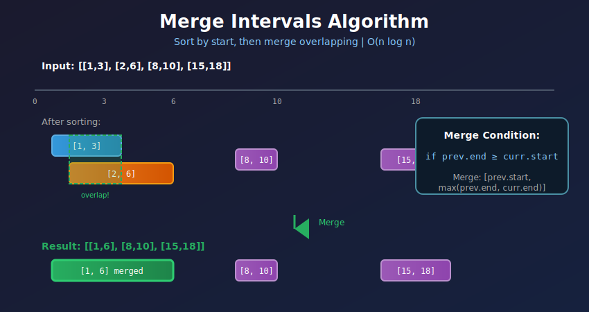
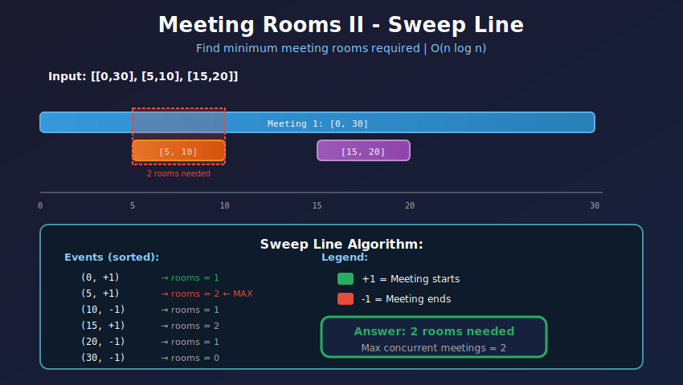
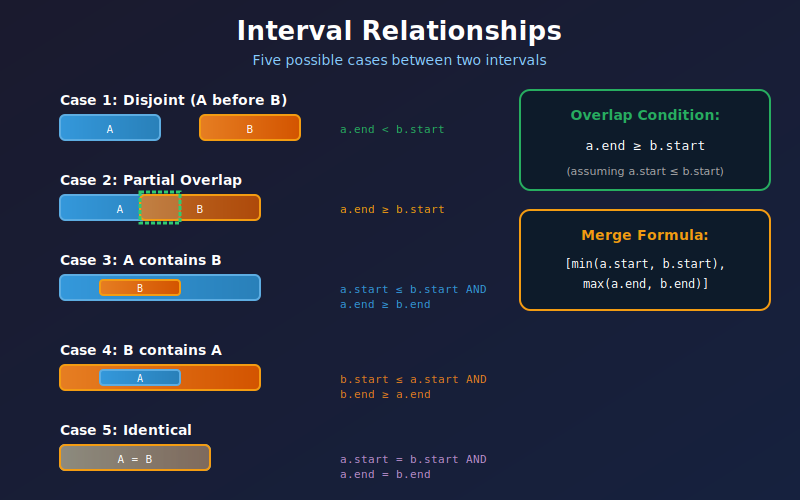
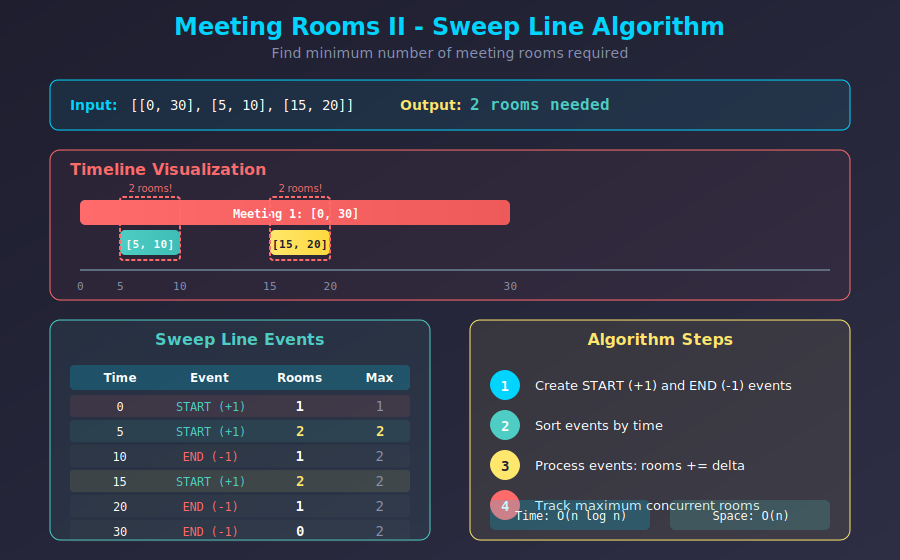

<div align="center">

# ⏱️ Interval Problems

<p>
  
  
</p>

</div>

---

## 🧭 Navigation

| ⬅️ Previous | 📂 Current | ➡️ Next |
|:------------|:----------:|--------:|
| [← 04. Matrix Problems](../04_matrix_problems/README.md) | **05. Interval Problems** | [🏠 Arrays Home](../README.md) |

---

## 🎨 Visual Diagrams

<div align="center">

### Merge Intervals Algorithm


### Meeting Rooms - Sweep Line


### Interval Relationships


### Sweep Line Algorithm


</div>

---

## 📐 Mathematical Foundations

### 1️⃣ Interval Representation

**Interval Notation:**

```math
[a, b] = \{x \in \mathbb{R} : a \leq x \leq b\}

```

**Interval Relations:**

```math
\begin{aligned}
\text{Disjoint:} \quad & [a, b] \cap [c, d] = \emptyset \iff b < c \text{ or } d < a \\
\text{Overlap:} \quad & [a, b] \cap [c, d] \neq \emptyset \iff b \geq c \text{ and } d \geq a \\
\text{Contains:} \quad & [a, b] \subseteq [c, d] \iff c \leq a \text{ and } b \leq d
\end{aligned}

```

**Merge Condition:**

Two intervals $[a, b]$ and $[c, d]$ can merge if:

```math
\boxed{b \geq c \quad \text{(assuming } a \leq c \text{)}}

```

Merged interval:

```math
[a, b] \cup [c, d] = [\min(a, c), \max(b, d)]

```

---

### 2️⃣ Sorting Strategy

**Why sort by start time?**

**Theorem:** Sorting intervals by start time allows linear-time merging.

**Proof:**
- After sorting: $s\_1 \leq s\_2 \leq \cdots \leq s\_n$
- To check if $I\_i$ and $I\_{i+1}$ overlap: compare $e\_i$ with $s\_{i+1}$
- If $e\_i \geq s\_{i+1}$: overlap (merge)
- If $e\_i < s\_{i+1}$: no overlap (start new interval)
- One pass through sorted list: $O(n)$ ∎

---

### 3️⃣ Visual: Interval Relationships

```
Interval Relationships (5 cases):

Case 1: Disjoint (a before b)
  [-----]           [-----]
    a                 b
  a.end < b.start ✓

Case 2: Overlap (partial)
  [---------]
      [---------]
      a       b
  a.start < b.start && a.end < b.end
  a.end >= b.start (overlap condition)

Case 3: Contains (a contains b)
  [---------------]
      [-----]
      a   b
  a.start <= b.start && a.end >= b.end

Case 4: Contained (b contains a)
      [-----]
  [---------------]
      a       b
  b.start <= a.start && b.end >= a.end

Case 5: Same
  [-------]
  [-------]
    a,b
  a.start == b.start && a.end == b.end

```

---

### 4️⃣ Visual: Merge Intervals Algorithm

```
Input: [[1,3], [2,6], [8,10], [15,18]]

+---------------------------------------------------------------------+
|  Step 0: Already sorted by start time                               |
|  ----------------------------------------------------------------   |
|  0    5    10   15   20                                             |
|  +----+----+----+----+                                              |
|  [--3]                    Interval 1: [1,3]                         |
|    [----6]                Interval 2: [2,6]                         |
|               [10]        Interval 3: [8,10]                        |
|                    [-18]  Interval 4: [15,18]                       |
|                                                                     |
|  Current: [1,3]                                                     |
+---------------------------------------------------------------------+
|  Step 1: Compare [1,3] with [2,6]                                   |
|  ----------------------------------------------------------------   |
|  Check: current.end (3) >= next.start (2)? YES → MERGE              |
|  New current: [1, max(3,6)] = [1,6]                                 |
|                                                                     |
|  [------6]                Merged: [1,6]                             |
|               [10]        Interval 3: [8,10]                        |
|                    [-18]  Interval 4: [15,18]                       |
+---------------------------------------------------------------------+
|  Step 2: Compare [1,6] with [8,10]                                  |
|  ----------------------------------------------------------------   |
|  Check: current.end (6) >= next.start (8)? NO → Add to result       |
|  Result: [[1,6]]                                                    |
|  New current: [8,10]                                                |
|                                                                     |
|  [------6]                ← Added to result                         |
|               [10]        Current: [8,10]                           |
|                    [-18]  Interval 4: [15,18]                       |
+---------------------------------------------------------------------+
|  Step 3: Compare [8,10] with [15,18]                                |
|  ----------------------------------------------------------------   |
|  Check: current.end (10) >= next.start (15)? NO → Add to result     |
|  Result: [[1,6], [8,10]]                                            |
|  New current: [15,18]                                               |
|                                                                     |
|  [------6]                ← In result                               |
|               [10]        ← Added to result                         |
|                    [-18]  Current: [15,18]                          |
+---------------------------------------------------------------------+
|  Step 4: No more intervals, add current to result                   |
|  ----------------------------------------------------------------   |
|  Final Result: [[1,6], [8,10], [15,18]]                             |
|                                                                     |
|  [------6]                                                          |
|               [10]                                                  |
|                    [-18]                                            |
+---------------------------------------------------------------------+

```

---

### 5️⃣ Visual: Insert Interval

```
Input: intervals = [[1,3], [6,9]], newInterval = [2,5]

+---------------------------------------------------------------------+
|  Step 1: Add all intervals that end before new interval starts      |
|  ----------------------------------------------------------------   |
|  0    2    4    6    8    10                                        |
|  +----+----+----+----+----+                                         |
|  [--3]                         Existing: [1,3]                      |
|            [6---9]             Existing: [6,9]                      |
|    [---5]                      New: [2,5]                           |
|                                                                     |
|  Check [1,3]: end=3 < newStart=2? NO → STOP                         |
|  No intervals to add before merge region                           |
+---------------------------------------------------------------------+
|  Step 2: Merge overlapping intervals                                |
|  ----------------------------------------------------------------   |
|  Start with newInterval = [2,5]                                     |
|                                                                     |
|  Check [1,3]: end=3 >= newStart=2? YES → MERGE                      |
|    Merge [1,3] with [2,5] → [1,5]                                   |
|                                                                     |
|  Check [6,9]: start=6 <= newEnd=5? NO → STOP merging                |
|                                                                     |
|  Result: Add merged [1,5]                                           |
|  [----5]                       Merged result                        |
|            [6---9]             Not merged                           |
+---------------------------------------------------------------------+
|  Step 3: Add all remaining intervals                                |
|  ----------------------------------------------------------------   |
|  Add [6,9] to result                                                |
|                                                                     |
|  Final: [[1,5], [6,9]]                                              |
|  [----5]                                                            |
|            [6---9]                                                  |
+---------------------------------------------------------------------+

```

---

### 6️⃣ Meeting Rooms Problem - Event Sorting

**Problem:** Minimum number of meeting rooms required.

**Mathematical Formulation:**

Given intervals $I\_1, I\_2, \ldots, I\_n$ where $I\_i = [s\_i, e\_i]$:

```math
\text{rooms needed} = \max_{t} \left|\{i : s_i \leq t < e_i\}\right|

```

**Sweep Line Algorithm:**

1. Create events: $(s\_i, \text{START})$ and $(e\_i, \text{END})$
2. Sort events by time
3. Track running count: +1 for START, -1 for END
4. Maximum count = rooms needed

**Proof of Correctness:**

At any time $t$, the number of active meetings equals the rooms needed at that moment. The maximum over all time points is the answer. ∎

---

### 7️⃣ Visual: Meeting Rooms (Sweep Line)

```
Input: [[0,30], [5,10], [15,20]]

+---------------------------------------------------------------------+
|  Step 1: Create events                                              |
|  ----------------------------------------------------------------   |
|  Events: (0,START), (5,START), (10,END), (15,START), (20,END), (30,END)|
|                                                                     |
|  Timeline:                                                          |
|  0    5    10   15   20        30                                   |
|  +----+----+----+----+---------+                                    |
|  [--------------------------30]   Meeting 1                         |
|       [---10]                     Meeting 2                         |
|                 [--20]            Meeting 3                         |
+---------------------------------------------------------------------+
|  Step 2: Process events in order                                    |
|  ----------------------------------------------------------------   |
|                                                                     |
|  Time 0: START                                                      |
|    rooms = 0 + 1 = 1                                                |
|    max_rooms = 1                                                    |
|                                                                     |
|  Time 5: START                                                      |
|    rooms = 1 + 1 = 2  ← Two meetings overlap!                       |
|    max_rooms = 2                                                    |
|                                                                     |
|  Time 10: END                                                       |
|    rooms = 2 - 1 = 1                                                |
|    max_rooms = 2 (unchanged)                                        |
|                                                                     |
|  Time 15: START                                                     |
|    rooms = 1 + 1 = 2                                                |
|    max_rooms = 2 (unchanged)                                        |
|                                                                     |
|  Time 20: END                                                       |
|    rooms = 2 - 1 = 1                                                |
|    max_rooms = 2 (unchanged)                                        |
|                                                                     |
|  Time 30: END                                                       |
|    rooms = 1 - 1 = 0                                                |
|    max_rooms = 2 (unchanged)                                        |
|                                                                     |
|  Answer: 2 meeting rooms needed                                     |
|                                                                     |
|  Visual of max overlap:                                             |
|  0    5    10   15   20        30                                   |
|  +----+----+----+----+---------+                                    |
|  [----------------------------]   Room 1                            |
|       [---]                       Room 2                            |
|                 [--]              Room 1 (reused)                   |
|       ↑                                                             |
|       Maximum overlap = 2 rooms                                     |
+---------------------------------------------------------------------+

```

---

## 💻 Code Implementations

```python
def merge(intervals: list[list[int]]) -> list[list[int]]:
    """
    Merge overlapping intervals.
    
    Algorithm:
    1. Sort by start time: O(n log n)
    2. Iterate and merge overlapping: O(n)
    
    Merge condition: current.end >= next.start
    
    Time: O(n log n), Space: O(n) for output
    """
    if not intervals:
        return []
    
    # Sort by start time
    intervals.sort(key=lambda x: x[0])
    
    merged = [intervals[0]]
    
    for current in intervals[1:]:
        last = merged[-1]
        
        # Check overlap: last.end >= current.start
        if last[1] >= current[0]:
            # Merge: extend end to maximum
            last[1] = max(last[1], current[1])
        else:
            # No overlap: add new interval
            merged.append(current)
    
    return merged

def insert(intervals: list[list[int]], newInterval: list[int]) -> list[list[int]]:
    """
    Insert interval and merge if necessary.
    
    Three phases:
    1. Add all intervals ending before new interval
    2. Merge all overlapping intervals
    3. Add all remaining intervals
    
    Time: O(n), Space: O(n)
    """
    result = []
    i = 0
    n = len(intervals)
    
    # Phase 1: Add intervals before new interval
    while i < n and intervals[i][1] < newInterval[0]:
        result.append(intervals[i])
        i += 1
    
    # Phase 2: Merge overlapping intervals
    while i < n and intervals[i][0] <= newInterval[1]:
        # Merge: extend bounds
        newInterval[0] = min(newInterval[0], intervals[i][0])
        newInterval[1] = max(newInterval[1], intervals[i][1])
        i += 1
    
    result.append(newInterval)
    
    # Phase 3: Add remaining intervals
    while i < n:
        result.append(intervals[i])
        i += 1
    
    return result

def canAttendMeetings(intervals: list[list[int]]) -> bool:
    """
    Check if person can attend all meetings (no overlap).
    
    Algorithm: Sort and check consecutive intervals
    If any two consecutive intervals overlap → False
    
    Time: O(n log n), Space: O(1)
    """
    if not intervals:
        return True
    
    intervals.sort(key=lambda x: x[0])
    
    for i in range(1, len(intervals)):
        # Check if previous ends after current starts
        if intervals[i-1][1] > intervals[i][0]:
            return False
    
    return True

def minMeetingRooms(intervals: list[list[int]]) -> int:
    """
    Minimum meeting rooms required.
    
    Sweep Line Algorithm:
    1. Create start and end events
    2. Sort all events
    3. Process: +1 for start, -1 for end
    4. Track maximum concurrent meetings
    
    Time: O(n log n), Space: O(n)
    """
    if not intervals:
        return 0
    
    events = []
    for start, end in intervals:
        events.append((start, 1))   # Meeting starts (+1 room)
        events.append((end, -1))    # Meeting ends (-1 room)
    
    # Sort by time; if tie, process END before START
    events.sort(key=lambda x: (x[0], x[1]))
    
    rooms = 0
    max_rooms = 0
    
    for time, delta in events:
        rooms += delta
        max_rooms = max(max_rooms, rooms)
    
    return max_rooms

def minMeetingRoomsHeap(intervals: list[list[int]]) -> int:
    """
    Alternative: Using min heap to track end times.
    
    Intuition: Track when rooms become free
    Heap maintains earliest ending meeting
    
    Time: O(n log n), Space: O(n)
    """
    if not intervals:
        return 0
    
    import heapq
    
    # Sort by start time
    intervals.sort(key=lambda x: x[0])
    
    # Heap of end times
    heap = []
    
    for start, end in intervals:
        # If earliest meeting ends before this starts, reuse room
        if heap and heap[0] <= start:
            heapq.heappop(heap)
        
        # Add current meeting's end time
        heapq.heappush(heap, end)
    
    # Heap size = number of rooms
    return len(heap)

def eraseOverlapIntervals(intervals: list[list[int]]) -> int:
    """
    Minimum intervals to remove to make non-overlapping.
    
    Greedy Algorithm:
    1. Sort by end time
    2. Keep interval with earliest end
    3. Remove overlapping intervals
    
    Why greedy works: Earliest end leaves most room for future intervals
    
    Time: O(n log n), Space: O(1)
    """
    if not intervals:
        return 0
    
    # Sort by end time (greedy choice)
    intervals.sort(key=lambda x: x[1])
    
    removed = 0
    prev_end = intervals[0][1]
    
    for i in range(1, len(intervals)):
        if intervals[i][0] < prev_end:
            # Overlap: remove current interval
            removed += 1
        else:
            # No overlap: update end time
            prev_end = intervals[i][1]
    
    return removed

def intervalIntersection(A: list[list[int]], B: list[list[int]]) -> list[list[int]]:
    """
    Find intersection of two interval lists.
    
    Two Pointers Algorithm:
    - Intersection: [max(a.start, b.start), min(a.end, b.end)]
    - Valid if start <= end
    - Advance pointer of interval that ends first
    
    Time: O(m + n), Space: O(1) excluding output
    """
    result = []
    i = j = 0
    
    while i < len(A) and j < len(B):
        # Find intersection
        start = max(A[i][0], B[j][0])
        end = min(A[i][1], B[j][1])
        
        # Valid intersection
        if start <= end:
            result.append([start, end])
        
        # Advance pointer of interval that ends first
        if A[i][1] < B[j][1]:
            i += 1
        else:
            j += 1
    
    return result

def employeeFreeTime(schedule: list[list[list[int]]]) -> list[list[int]]:
    """
    Find common free time for all employees.
    
    Algorithm:
    1. Flatten and merge all busy intervals
    2. Gaps between merged intervals = free time
    
    Time: O(n log n), Space: O(n)
    """
    # Flatten all intervals
    intervals = []
    for employee in schedule:
        for interval in employee:
            intervals.append(interval)
    
    # Sort by start time
    intervals.sort(key=lambda x: x[0])
    
    # Merge intervals
    merged = [intervals[0]]
    for current in intervals[1:]:
        if merged[-1][1] >= current[0]:
            merged[-1][1] = max(merged[-1][1], current[1])
        else:
            merged.append(current)
    
    # Find gaps (free time)
    free_time = []
    for i in range(1, len(merged)):
        free_time.append([merged[i-1][1], merged[i][0]])
    
    return free_time

```

---

## 🏆 LeetCode Problems

### 🟢 Easy

| # | Problem | Pattern | Time | Space |
|:-:|---------|---------|:----:|:-----:|
| 252 | [Meeting Rooms](https://leetcode.com/problems/meeting-rooms/) | Sort + Check | O(n log n) | O(1) |
| 495 | [Teemo Attacking](https://leetcode.com/problems/teemo-attacking/) | Merge Intervals | O(n) | O(1) |

### 🟡 Medium

| # | Problem | Pattern | Time | Space |
|:-:|---------|---------|:----:|:-----:|
| 56 | [Merge Intervals](https://leetcode.com/problems/merge-intervals/) | Sort + Merge | O(n log n) | O(n) |
| 57 | [Insert Interval](https://leetcode.com/problems/insert-interval/) | Three Phases | O(n) | O(n) |
| 253 | [Meeting Rooms II](https://leetcode.com/problems/meeting-rooms-ii/) | Sweep Line / Heap | O(n log n) | O(n) |
| 435 | [Non-overlapping Intervals](https://leetcode.com/problems/non-overlapping-intervals/) | Greedy by End | O(n log n) | O(1) |
| 452 | [Minimum Number of Arrows](https://leetcode.com/problems/minimum-number-of-arrows-to-burst-balloons/) | Greedy by End | O(n log n) | O(1) |
| 986 | [Interval List Intersections](https://leetcode.com/problems/interval-list-intersections/) | Two Pointers | O(m+n) | O(1) |
| 1288 | [Remove Covered Intervals](https://leetcode.com/problems/remove-covered-intervals/) | Sort + Check | O(n log n) | O(1) |

### 🔴 Hard

| # | Problem | Pattern | Time | Space |
|:-:|---------|---------|:----:|:-----:|
| 218 | [The Skyline Problem](https://leetcode.com/problems/the-skyline-problem/) | Sweep Line + Heap | O(n log n) | O(n) |
| 352 | [Data Stream as Disjoint Intervals](https://leetcode.com/problems/data-stream-as-disjoint-intervals/) | TreeMap | O(log n) per op | O(n) |
| 715 | [Range Module](https://leetcode.com/problems/range-module/) | Interval Tree | O(log n) | O(n) |
| 732 | [My Calendar III](https://leetcode.com/problems/my-calendar-iii/) | Sweep Line | O(n²) | O(n) |
| 759 | [Employee Free Time](https://leetcode.com/problems/employee-free-time/) | Merge + Gaps | O(n log n) | O(n) |

---

## 📊 Pattern Decision Tree

```
              Interval Problem?
                    |
      +--------------+--------------+
      |              |              |
  Merge?         Count?         Find?
      |              |              |
  +---+---+      +---+---+      +---+---+
  |       |      |       |      |       |
Sort   Overlapping Rooms  Gaps  Intersection
by     intervals  needed        |
start           |              Two
               Sweep          Pointers
               Line

```

---

## 💡 Key Insights & Pro Tips

> **🎯 Always Sort First**  
> 99% of interval problems start with sorting. Usually by start time, sometimes by end time.

> **⚡ Merge Condition**  
> Intervals [a,b] and [c,d] overlap if b >= c (assuming a <= c after sorting).

> **🔄 Greedy by End Time**  
> For "minimum removals" problems: sort by end time, keep interval with earliest end.

> **📊 Sweep Line for Counting**  
> Convert to events (START/END), sort, and process. Maximum concurrent = answer.

> **🔍 Two Pointers for Intersection**  
> When finding intersection of two sorted lists: advance pointer of interval that ends first.

> **💰 Heap for Active Intervals**  
> Track active intervals using min heap of end times. Heap size = number of active intervals.

---

## 🎓 Pattern Recognition Guide

### Identifying Interval Patterns

| Clue | Pattern | Sort Strategy | Example |
|------|---------|---------------|---------|
| **"Merge overlapping"** | Sort + merge | By start time | Merge Intervals |
| **"Insert and merge"** | Three phases | Already sorted | Insert Interval |
| **"Can attend all"** | Check consecutive | By start time | Meeting Rooms |
| **"Minimum rooms"** | Sweep line / heap | By start time | Meeting Rooms II |
| **"Remove minimum"** | Greedy | By end time | Non-overlapping Intervals |
| **"Find intersection"** | Two pointers | Both sorted | Interval Intersections |
| **"Find gaps"** | Merge + gaps | By start time | Employee Free Time |

---

## 🎯 Complexity Analysis

### Common Interval Operations

| Operation | Complexity | Bottleneck | Can Optimize? |
|-----------|:----------:|------------|---------------|
| **Merge intervals** | O(n log n) | Sorting | No (comparison-based) |
| **Insert interval** | O(n) | Linear scan | No (must check all) |
| **Check overlap** | O(1) | Comparison | - |
| **Count rooms** | O(n log n) | Sorting/Heap | No |
| **Find gaps** | O(n log n) | Sorting | No |

### Sorting Strategy Impact

```
Problem: Minimum arrows to burst balloons

❌ Sort by start time:
   - Complex logic to track overlaps
   - Hard to prove correctness

✅ Sort by end time:
   - Greedy: shoot arrow at earliest end
   - Provably optimal
   - Simple code

Lesson: Right sort strategy simplifies problem!

```

---

## 🧮 Mathematical Deep Dive

### Why Greedy Works for Interval Scheduling

**Problem:** Maximum non-overlapping intervals.

**Greedy Choice:** Always pick interval with earliest end time.

**Proof of Optimality:**

Let $OPT$ be an optimal solution, $G$ be greedy solution.

1. Let $g\_1$ be greedy's first choice (earliest end)
2. Let $o\_1$ be optimal's first choice
3. If $g\_1 = o\_1$: continue recursively
4. If $g\_1 \neq o\_1$: Replace $o\_1$ with $g\_1$ in $OPT$
   - $g\_1$ ends before $o\_1$ (by greedy choice)
   - All intervals after $o\_1$ are still valid after $g\_1$
   - This replacement doesn't decrease count
5. By induction, $|G| = |OPT|$ ∎

### Interval Overlap Formula

For intervals $[a, b]$ and $[c, d]$ where $a \leq c$:

```math
\text{Overlap length} = \max(0, \min(b, d) - c)

```

**Proof:**
- Overlap exists iff $b \geq c$
- Overlap ends at $\min(b, d)$
- Overlap starts at $c$
- Length = end - start = $\min(b, d) - c$
- Use $\max(0, \cdot)$ to handle non-overlapping case ∎

---

## 🧠 Advanced Techniques

### Sweep Line with Priority Queue

For problems requiring "active intervals at time t":

```python
def maxConcurrentIntervals(intervals: list[list[int]]) -> int:
    """
    Maximum number of overlapping intervals at any point.
    
    Advanced sweep line using heap for active intervals.
    """
    import heapq
    
    # Sort by start time
    intervals.sort()
    
    active = []  # Min heap of end times
    max_concurrent = 0
    
    for start, end in intervals:
        # Remove ended intervals
        while active and active[0] <= start:
            heapq.heappop(active)
        
        # Add current interval
        heapq.heappush(active, end)
        
        # Update maximum
        max_concurrent = max(max_concurrent, len(active))
    
    return max_concurrent

```

### Interval Tree (Advanced Data Structure)

For dynamic interval queries:

```python
class IntervalTreeNode:
    """
    Interval tree for efficient interval queries.
    
    Operations:
    - Insert: O(log n)
    - Query overlap: O(log n + k) where k = overlaps
    - Delete: O(log n)
    """
    def __init__(self, start, end):
        self.start = start
        self.end = end
        self.max_end = end  # Max end in subtree
        self.left = None
        self.right = None

# Full implementation omitted for brevity
# Used in problems like Range Module (#715)

```

---

## 📚 References & Learning Resources

### 📖 Core Concepts

| Resource | Description | Link |
|----------|-------------|------|
| **Interval Scheduling** | Classic algorithm | [Wikipedia](https://en.wikipedia.org/wiki/Interval_scheduling) |
| **Sweep Line Algorithm** | Complete guide | [CP-Algorithms](https://cp-algorithms.com/geometry/sweep-line.html) |
| **Greedy Algorithms** | Interval problems | [GeeksforGeeks](https://www.geeksforgeeks.org/greedy-algorithms/) |

### 🎥 Video Tutorials

| Resource | Topic | Link |
|----------|-------|------|
| **NeetCode** | Merge intervals explained | [YouTube](https://www.youtube.com/watch?v=44H3cEC2fFM) |
| **Back To Back SWE** | Meeting rooms II | [YouTube](https://www.youtube.com/watch?v=4MEkBvqR4dw) |
| **Tushar Roy** | Interval problems | [YouTube](https://www.youtube.com/watch?v=qKczfGUrFY4) |

### 📝 Practice Platforms

| Platform | Focus | Link |
|----------|-------|------|
| **LeetCode** | Interval tag | [Problems](https://leetcode.com/tag/interval/) |
| **InterviewBit** | Arrays: Intervals | [Practice](https://www.interviewbit.com/courses/programming/topics/arrays/) |

### 🔬 Advanced Topics

| Resource | Topic | Link |
|----------|-------|------|
| **CLRS Chapter 16** | Greedy algorithms | [MIT](https://mitpress.mit.edu/books/introduction-algorithms) |
| **Competitive Programming Handbook** | Sweep line techniques | [PDF](https://cses.fi/book/book.pdf) |

---

## 🎯 Practice Roadmap

### Foundation (Start Here!)
1. **Merge Intervals** (#56) - Master the basic pattern
2. **Insert Interval** (#57) - Three-phase approach
3. **Meeting Rooms** (#252) - Simple overlap check

### Building Skills
4. **Meeting Rooms II** (#253) - Learn sweep line
5. **Non-overlapping Intervals** (#435) - Greedy by end
6. **Interval Intersections** (#986) - Two pointers

### Advanced Challenges
7. **Employee Free Time** (#759) - Merge + gaps
8. **Minimum Arrows** (#452) - Greedy variation
9. **Remove Covered Intervals** (#1288) - Sorting tricks

### Expert Level
- Skyline Problem (#218) - Complex sweep line
- Range Module (#715) - Interval tree
- My Calendar III (#732) - Advanced counting

---

## 💭 Common Interview Questions

**Q: Why sort by start time for merging?**  
A: After sorting by start, we only need to check adjacent intervals. If intervals[i] and intervals[i+2] overlap, they must overlap through intervals[i+1].

**Q: When to use heap vs sweep line for counting?**  
A: Both work! Heap is more intuitive (track active meetings). Sweep line is more general (handles complex events).

**Q: How to choose between sorting by start vs end?**  
A: Merge/count problems: sort by start. Maximum scheduling problems: sort by end (greedy).

**Q: What if intervals have different priorities?**  
A: Sort by multiple keys: (end_time, -priority) for greedy. Or use weighted interval scheduling (dynamic programming).

**Q: Can we use TreeMap for better complexity?**  
A: Yes! TreeMap gives O(log n) insert/query instead of O(n). Useful for online/streaming problems.

---

## 🧩 Common Pitfalls & Solutions

### Pitfall 1: Off-by-One in Overlap Check

```python
# ❌ WRONG: Strict inequality
if prev_end > curr_start:  # Misses touching intervals

# ✅ CORRECT: Non-strict inequality
if prev_end >= curr_start:  # [1,3] and [3,5] overlap!

```

### Pitfall 2: Forgetting to Sort

```python
# ❌ WRONG: Assuming input is sorted
for i in range(1, len(intervals)):
    # Check overlap...

# ✅ CORRECT: Always sort first
intervals.sort(key=lambda x: x[0])
for i in range(1, len(intervals)):
    # Now safe to check...

```

### Pitfall 3: Not Handling Edge Cases

```python
# ❌ WRONG: Crashes on empty input
merged = [intervals[0]]

# ✅ CORRECT: Handle empty
if not intervals:
    return []
merged = [intervals[0]]

```

---

## 🎨 Visual Summary

```
+-------------------------------------------------------------+
|           INTERVAL PROBLEMS CHEAT SHEET                     |
+-------------------------------------------------------------+
|                                                             |
|  Overlap Check:  a.end >= b.start  (after sorting)          |
|  Merge:          [min(a.start, b.start), max(a.end, b.end)] |
|                                                             |
|  Sort Strategy:                                             |
|    - Merge/Count → sort by START                            |
|    - Greedy max  → sort by END                              |
|                                                             |
|  Meeting Rooms:                                             |
|    - Can attend? → sort + check consecutive                 |
|    - Min rooms?  → sweep line OR heap                       |
|                                                             |
|  Sweep Line:                                                |
|    1. Create events (START, END)                            |
|    2. Sort events                                           |
|    3. Process: +1/-1, track max                             |
|                                                             |
|  Two Pointers (intersection):                               |
|    - intersection = [max(a.start, b.start), min(a.end, b.end)] |
|    - Advance pointer of interval that ends first            |
+-------------------------------------------------------------+

```

---

<div align="center">

### ⏱️ Master Intervals: From Chaos to Order

*Sort first, ask questions later. The key to interval problems is choosing the right sort order.*

**Made with ❤️ by [Gaurav Goswami](https://github.com/Gaurav14cs17)**

[⬅️ Matrix Problems](../04_matrix_problems/README.md) | [🏠 Arrays Home](../README.md)

---

*"In the end, it's all about overlaps and boundaries."*  
*Start with Merge Intervals (#56) today!* 🚀

</div>

---

## 🧭 Navigation

| ⬅️ Previous | 📂 Current | ➡️ Next |
|:------------|:----------:|--------:|
| [← 04. Matrix Problems](../04_matrix_problems/README.md) | **05. Interval Problems** | [🏠 Arrays Home](../README.md) |
