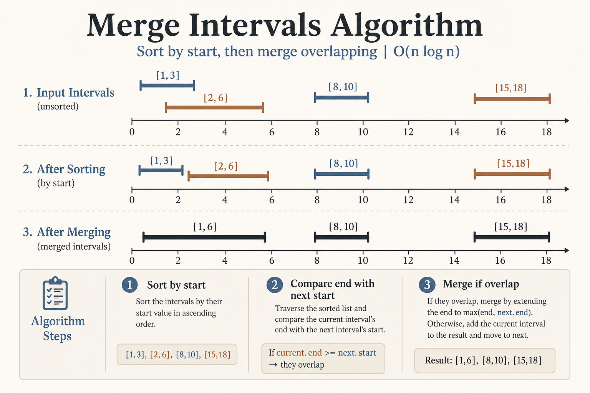
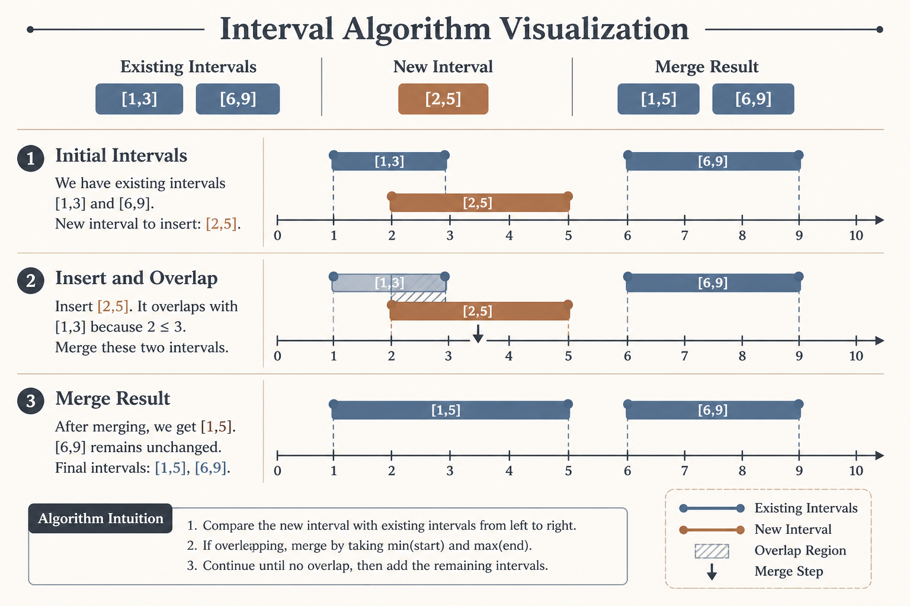
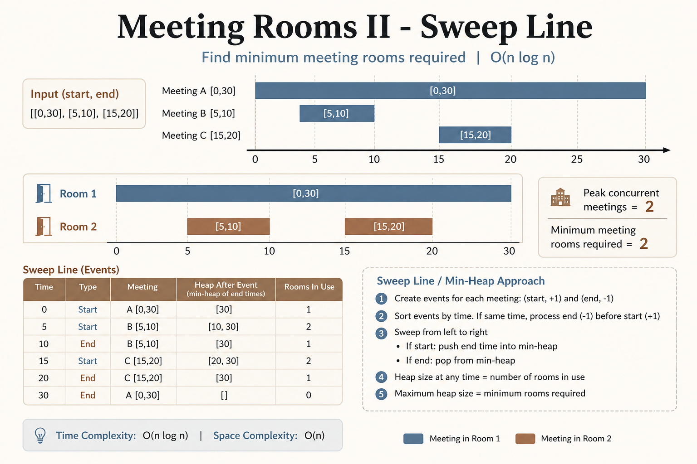
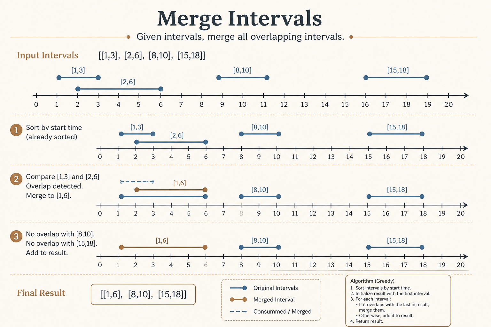
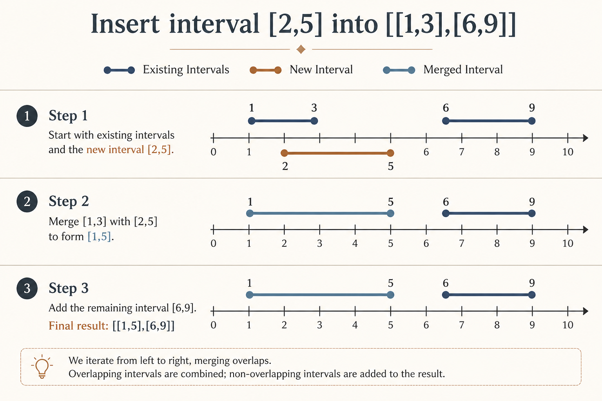
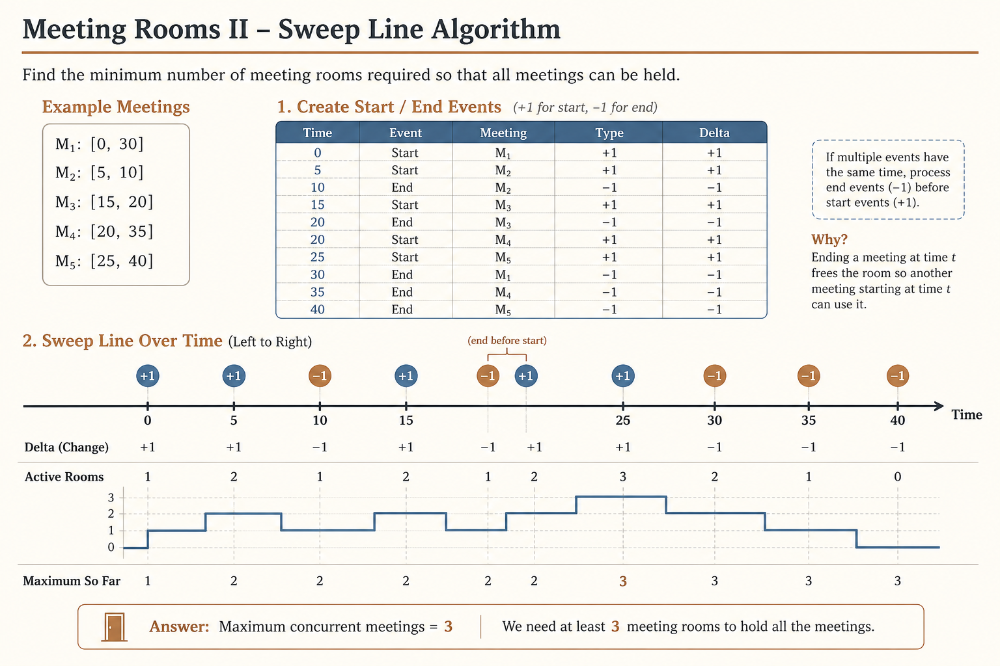
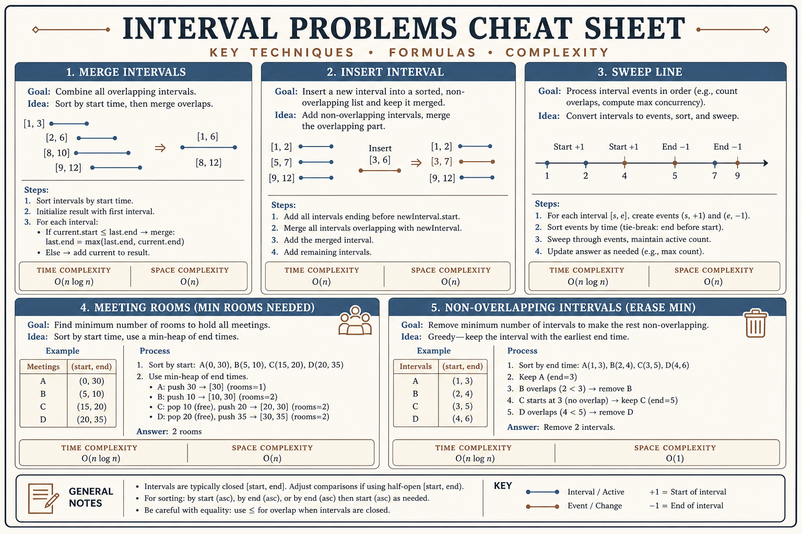

<div align="center">

# ⏱️ Interval Problems

### *⏱️ Interval Problems*


<p>
  
  
</p>

</div>

---

## 🎯 At a Glance

| | |
|:---|:---|
| **Topic** | ⏱️ Interval Problems |
| **Difficulty** | Medium to Hard |
| **Problems** | 20+ |

{: .highlight }
> **How to use this page:** Scan **At a Glance**, then work through theory → visuals → code for each problem pattern.


## 🧭 Navigation

| ⬅️ Previous | 📂 Current | ➡️ Next |
|:------------|:----------:|--------:|
| [← 04. Matrix Problems](../04_matrix_problems/README.md) | **05. Interval Problems** | [🏠 Arrays Home](../README.md) |


## 📐 Mathematical Foundation

### 1️⃣ Interval Representation

**Interval Notation:**

$$[a, b] = \{x \in \mathbb{R} : a \leq x \leq b\}$$

**Interval Relations:**

$$\begin{aligned}
\text{Disjoint:} \quad & [a, b] \cap [c, d] = \emptyset \iff b < c \text{ or } d < a \\
\text{Overlap:} \quad & [a, b] \cap [c, d] \neq \emptyset \iff b \geq c \text{ and } d \geq a \\
\text{Contains:} \quad & [a, b] \subseteq [c, d] \iff c \leq a \text{ and } b \leq d
\end{aligned}$$

**Merge Condition:**

Two intervals $[a, b]$ and $[c, d]$ can merge if:

$$\boxed{b \geq c \quad \text{(assuming } a \leq c \text{)}}$$

Merged interval:

$$[a, b] \cup [c, d] = [\min(a, c), \max(b, d)]$$

---

### 2️⃣ Sorting Strategy

**Why sort by start time?**

**Theorem:** Sorting intervals by start time allows linear-time merging.

**Proof:**

- After sorting: $s_1 \leq s_2 \leq \cdots \leq s_n$

- To check if $I_i$ and $I_{i+1}$ overlap: compare $e_i$ with $s_{i+1}$

- If $e_i \geq s_{i+1}$: overlap (merge)

- If $e_i < s_{i+1}$: no overlap (start new interval)

- One pass through sorted list: $O(n)$ ∎

---

### 3️⃣ Interval Relationships

```text
Interval Relationships (5 cases):

Case 1: Disjoint (a before b)
  [-----]           [-----]
    a                 b
  a.end < b.start ✓

Case 2: Overlap (partial)
  [---------]
      [---------]
      a       b
  a.start < b.start && a.end < b.end
  a.end >= b.start (overlap condition)

Case 3: Contains (a contains b)
  [---------------]
      [-----]
      a   b
  a.start <= b.start && a.end >= b.end

Case 4: Contained (b contains a)
      [-----]
  [---------------]
      a       b
  b.start <= a.start && b.end >= a.end

Case 5: Same
  [-------]
  [-------]
    a,b
  a.start == b.start && a.end == b.end
```

---

### 4️⃣ Merge Intervals Algorithm

**Algorithm:** Sort by start time, then merge overlapping consecutive intervals.

**Merge condition:** $\text{last.end} \geq \text{current.start}$

**Time:** $O(n \log n)$ for sorting + $O(n)$ merge pass



---

### 5️⃣ Insert Interval

**Three-phase algorithm:**

1. Add all intervals ending before the new interval starts

2. Merge all overlapping intervals with the new interval

3. Append remaining intervals

**Time:** $O(n)$ single pass (assuming sorted input or after sort)



---

### 6️⃣ Meeting Rooms Problem - Event Sorting

**Problem:** Minimum number of meeting rooms required.

**Mathematical Formulation:**

Given intervals $I_1, I_2, \ldots, I_n$ where $I_i = [s_i, e_i]$:

$$\text{rooms needed} = \max_{t} \left|\{i : s_i \leq t < e_i\}\right|$$

**Sweep Line Algorithm:**

1. Create events: $(s_i, \text{START})$ and $(e_i, \text{END})$

2. Sort events by time

3. Track running count: +1 for START, -1 for END

4. Maximum count = rooms needed

**Proof of Correctness:**

At any time $t$, the number of active meetings equals the rooms needed at that moment. The maximum over all time points is the answer. ∎



---

## 📊 Visual Overview

<div align="center">

### Step 0: Already sorted by start time


### Step 1: Add all intervals that end before new interval starts


### Step 1: Create events


### INTERVAL PROBLEMS CHEAT SHEET


</div>

---

## 💻 Code Implementations

```python
def merge(intervals: list[list[int]]) -> list[list[int]]:
    """
    Merge overlapping intervals.
    
    Algorithm:
    1. Sort by start time: O(n log n)
    2. Iterate and merge overlapping: O(n)
    
    Merge condition: current.end >= next.start
    
    Time: O(n log n), Space: O(n) for output
    """
    if not intervals:
        return []
    
    # Sort by start time
    intervals.sort(key=lambda x: x[0])
    
    merged = [intervals[0]]
    
    for current in intervals[1:]:
        last = merged[-1]
        
        # Check overlap: last.end >= current.start
        if last[1] >= current[0]:
            # Merge: extend end to maximum
            last[1] = max(last[1], current[1])
        else:
            # No overlap: add new interval
            merged.append(current)
    
    return merged

def insert(intervals: list[list[int]], newInterval: list[int]) -> list[list[int]]:
    """
    Insert interval and merge if necessary.
    
    Three phases:
    1. Add all intervals ending before new interval
    2. Merge all overlapping intervals
    3. Add all remaining intervals
    
    Time: O(n), Space: O(n)
    """
    result = []
    i = 0
    n = len(intervals)
    
    # Phase 1: Add intervals before new interval
    while i < n and intervals[i][1] < newInterval[0]:
        result.append(intervals[i])
        i += 1
    
    # Phase 2: Merge overlapping intervals
    while i < n and intervals[i][0] <= newInterval[1]:
        # Merge: extend bounds
        newInterval[0] = min(newInterval[0], intervals[i][0])
        newInterval[1] = max(newInterval[1], intervals[i][1])
        i += 1
    
    result.append(newInterval)
    
    # Phase 3: Add remaining intervals
    while i < n:
        result.append(intervals[i])
        i += 1
    
    return result

def canAttendMeetings(intervals: list[list[int]]) -> bool:
    """
    Check if person can attend all meetings (no overlap).
    
    Algorithm: Sort and check consecutive intervals
    If any two consecutive intervals overlap → False
    
    Time: O(n log n), Space: O(1)
    """
    if not intervals:
        return True
    
    intervals.sort(key=lambda x: x[0])
    
    for i in range(1, len(intervals)):
        # Check if previous ends after current starts
        if intervals[i-1][1] > intervals[i][0]:
            return False
    
    return True

def minMeetingRooms(intervals: list[list[int]]) -> int:
    """
    Minimum meeting rooms required.
    
    Sweep Line Algorithm:
    1. Create start and end events
    2. Sort all events
    3. Process: +1 for start, -1 for end
    4. Track maximum concurrent meetings
    
    Time: O(n log n), Space: O(n)
    """
    if not intervals:
        return 0
    
    events = []
    for start, end in intervals:
        events.append((start, 1))   # Meeting starts (+1 room)
        events.append((end, -1))    # Meeting ends (-1 room)
    
    # Sort by time; if tie, process END before START
    events.sort(key=lambda x: (x[0], x[1]))
    
    rooms = 0
    max_rooms = 0
    
    for time, delta in events:
        rooms += delta
        max_rooms = max(max_rooms, rooms)
    
    return max_rooms

def minMeetingRoomsHeap(intervals: list[list[int]]) -> int:
    """
    Alternative: Using min heap to track end times.
    
    Intuition: Track when rooms become free
    Heap maintains earliest ending meeting
    
    Time: O(n log n), Space: O(n)
    """
    if not intervals:
        return 0
    
    import heapq
    
    # Sort by start time
    intervals.sort(key=lambda x: x[0])
    
    # Heap of end times
    heap = []
    
    for start, end in intervals:
        # If earliest meeting ends before this starts, reuse room
        if heap and heap[0] <= start:
            heapq.heappop(heap)
        
        # Add current meeting's end time
        heapq.heappush(heap, end)
    
    # Heap size = number of rooms
    return len(heap)

def eraseOverlapIntervals(intervals: list[list[int]]) -> int:
    """
    Minimum intervals to remove to make non-overlapping.
    
    Greedy Algorithm:
    1. Sort by end time
    2. Keep interval with earliest end
    3. Remove overlapping intervals
    
    Why greedy works: Earliest end leaves most room for future intervals
    
    Time: O(n log n), Space: O(1)
    """
    if not intervals:
        return 0
    
    # Sort by end time (greedy choice)
    intervals.sort(key=lambda x: x[1])
    
    removed = 0
    prev_end = intervals[0][1]
    
    for i in range(1, len(intervals)):
        if intervals[i][0] < prev_end:
            # Overlap: remove current interval
            removed += 1
        else:
            # No overlap: update end time
            prev_end = intervals[i][1]
    
    return removed

def intervalIntersection(A: list[list[int]], B: list[list[int]]) -> list[list[int]]:
    """
    Find intersection of two interval lists.
    
    Two Pointers Algorithm:
    - Intersection: [max(a.start, b.start), min(a.end, b.end)]
    - Valid if start <= end
    - Advance pointer of interval that ends first
    
    Time: O(m + n), Space: O(1) excluding output
    """
    result = []
    i = j = 0
    
    while i < len(A) and j < len(B):
        # Find intersection
        start = max(A[i][0], B[j][0])
        end = min(A[i][1], B[j][1])
        
        # Valid intersection
        if start <= end:
            result.append([start, end])
        
        # Advance pointer of interval that ends first
        if A[i][1] < B[j][1]:
            i += 1
        else:
            j += 1
    
    return result

def employeeFreeTime(schedule: list[list[list[int]]]) -> list[list[int]]:
    """
    Find common free time for all employees.
    
    Algorithm:
    1. Flatten and merge all busy intervals
    2. Gaps between merged intervals = free time
    
    Time: O(n log n), Space: O(n)
    """
    # Flatten all intervals
    intervals = []
    for employee in schedule:
        for interval in employee:
            intervals.append(interval)
    
    # Sort by start time
    intervals.sort(key=lambda x: x[0])
    
    # Merge intervals
    merged = [intervals[0]]
    for current in intervals[1:]:
        if merged[-1][1] >= current[0]:
            merged[-1][1] = max(merged[-1][1], current[1])
        else:
            merged.append(current)
    
    # Find gaps (free time)
    free_time = []
    for i in range(1, len(merged)):
        free_time.append([merged[i-1][1], merged[i][0]])
    
    return free_time
```


```text
              Interval Problem?
                    |
Sort   Overlapping Rooms  Gaps  Intersection
start           |              Two
               Sweep          Pointers
               Line
```


**Problem: Minimum arrows to burst balloons**

❌ **Sort by start time:**
   - Complex logic to track overlaps
   - Hard to prove correctness

✅ **Sort by end time:**
   - Greedy: shoot arrow at earliest end
   - Provably optimal
   - Simple code

**Lesson:** Right sort strategy simplifies problem!


```python
def maxConcurrentIntervals(intervals: list[list[int]]) -> int:
    """
    Maximum number of overlapping intervals at any point.
    
    Advanced sweep line using heap for active intervals.
    """
    import heapq
    
    # Sort by start time
    intervals.sort()
    
    active = []  # Min heap of end times
    max_concurrent = 0
    
    for start, end in intervals:
        # Remove ended intervals
        while active and active[0] <= start:
            heapq.heappop(active)
        
        # Add current interval
        heapq.heappush(active, end)
        
        # Update maximum
        max_concurrent = max(max_concurrent, len(active))
    
    return max_concurrent
```

### Interval Tree (Advanced Data Structure)

For dynamic interval queries:

```python
class IntervalTreeNode:
    """
    Interval tree for efficient interval queries.
    
    Operations:
    - Insert: O(log n)
    - Query overlap: O(log n + k) where k = overlaps
    - Delete: O(log n)
    """
    def __init__(self, start, end):
        self.start = start
        self.end = end
        self.max_end = end  # Max end in subtree
        self.left = None
        self.right = None

# Full implementation omitted for brevity
# Used in problems like Range Module (#715)
```


### Pitfall 1: Overlap vs Touching

```python
# ❌ WRONG: Strict inequality
if prev_end > curr_start:  # Misses touching intervals

# ✅ CORRECT: Non-strict inequality
if prev_end >= curr_start:  # [1,3] and [3,5] overlap!
```

### Pitfall 2: Forgetting to Sort

```python
# ❌ WRONG: Assuming input is sorted
for i in range(1, len(intervals)):
    # Check overlap...

# ✅ CORRECT: Always sort first
intervals.sort(key=lambda x: x[0])
for i in range(1, len(intervals)):
    # Now safe to check...
```

### Pitfall 3: Not Handling Edge Cases

```python
# ❌ WRONG: Crashes on empty input
merged = [intervals[0]]

# ✅ CORRECT: Handle empty
if not intervals:
    return []
merged = [intervals[0]]
```

---

## 🏆 LeetCode Problems

### 🟢 Easy

| # | Problem | Pattern | Time | Space |
|:-:|---------|---------|:----:|:-----:|
| 252 | [Meeting Rooms](https://leetcode.com/problems/meeting-rooms/) | Sort + Check | O(n log n) | O(1) |

### 🟡 Medium

| # | Problem | Pattern | Time | Space |
|:-:|---------|---------|:----:|:-----:|
| 56 | [Merge Intervals](https://leetcode.com/problems/merge-intervals/) | Sort + Merge | O(n log n) | O(n) |
| 57 | [Insert Interval](https://leetcode.com/problems/insert-interval/) | Three Phases | O(n) | O(n) |
| 253 | [Meeting Rooms II](https://leetcode.com/problems/meeting-rooms-ii/) | Sweep Line / Heap | O(n log n) | O(n) |
| 435 | [Non-overlapping Intervals](https://leetcode.com/problems/non-overlapping-intervals/) | Greedy | O(n log n) | O(1) |
| 986 | [Interval List Intersections](https://leetcode.com/problems/interval-list-intersections/) | Two Pointers | O(m+n) | O(1) |

### 🔴 Hard

| # | Problem | Pattern | Time | Space |
|:-:|---------|---------|:----:|:-----:|
| 759 | [Employee Free Time](https://leetcode.com/problems/employee-free-time/) | Merge + Gaps | O(n log n) | O(n) |
| 715 | [Range Module](https://leetcode.com/problems/range-module/) | Interval Tree | O(log n) | O(n) |

---

## 📚 References & Learning Resources

### 📖 Core Concepts

| Resource | Description | Link |
|----------|-------------|------|
| **Interval Scheduling** | Wikipedia | [Interval scheduling](https://en.wikipedia.org/wiki/Interval_scheduling) |
| **Sweep Line** | GeeksforGeeks | [Line Sweep](https://www.geeksforgeeks.org/sweep-line-algorithm/) |
| **LeetCode** | Interval problems | [Discussion Guide](https://leetcode.com/discuss/general-discussion/1088255/) |

### 📝 Practice

| Platform | Focus | Link |
|----------|-------|------|
| **LeetCode** | Sorting tag | [Problems](https://leetcode.com/tag/sorting/) |

---

## 📋 Cheat Sheet


---

<div align="center">

### ⏱️ Master Intervals: From Chaos to Order

*Sort first, ask questions later. The key to interval problems is choosing the right sort order.*

**Made with ❤️ by [Gaurav Goswami](https://github.com/Gaurav14cs17)**

[⬅️ Matrix Problems](../04_matrix_problems/README.md) | [🏠 Arrays Home](../README.md)

---

*"In the end, it's all about overlaps and boundaries."*  
*Start with Merge Intervals (#56) today!* 🚀

</div>

---
