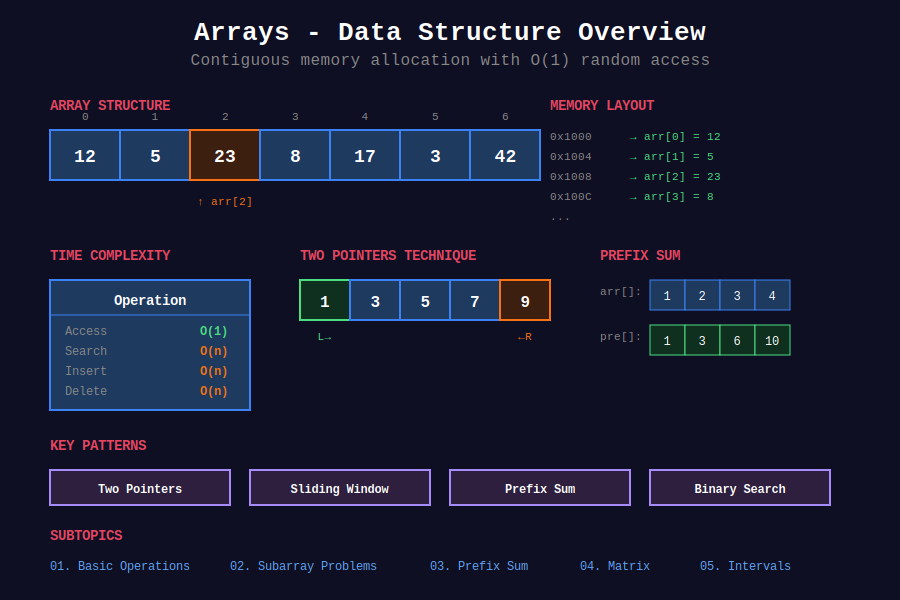

<div align="center">

# 📦 Arrays

<p>
  
  
  
</p>

**Contiguous memory locations storing elements of the same type**

[🏠 Home](../README.md) | [Next Topic: Strings ➡️](../02_strings/README.md)

---



### 📚 Comprehensive Documentation Available

Each subfolder contains **complete mini-courses** with:
- ✅ Mathematical foundations with proofs
- ✅ Visual algorithm walkthroughs (ASCII art)
- ✅ Fully commented code implementations
- ✅ 15-25 curated LeetCode problems each
- ✅ Pattern recognition guides
- ✅ Video tutorials and references
- ✅ Practice roadmaps

**Total: 90+ problems covered with detailed explanations!**

</div>

---

## 📐 Mathematical Foundation

### 1️⃣ Memory Address Calculation

For array `A` starting at base address `B` with element size `S` bytes:

```math
\boxed{\text{Address}(A[i]) = B + i \times S}
```

**Derivation:**
```
Element 0: B + 0×S = B
Element 1: B + 1×S = B + S  
Element 2: B + 2×S = B + 2S
...
Element i: B + i×S
```

**Time Complexity Proof:**
- Address calculation: 1 multiplication + 1 addition = O(1)
- Memory access: Direct addressing = O(1)
- Total: O(1) ✓

---

### 2️⃣ Subarray Counting Formula

**Total number of subarrays in array of size n:**

```math
\boxed{\sum_{i=1}^{n} i = \frac{n(n+1)}{2}}
```

**Proof by Gauss's Method:**

```math
S = 1 + 2 + 3 + \cdots + n
S = n + (n-1) + (n-2) + \cdots + 1
```

Adding both equations:

```math
2S = (n+1) + (n+1) + \cdots + (n+1) = n(n+1)
\therefore S = \frac{n(n+1)}{2}
```

**Example:** n = 5 → 5×6/2 = 15 subarrays

---

### 3️⃣ Subsequence Counting

**Total subsequences (including empty):**

```math
\boxed{2^n}
```

**Proof by Combinatorics:**
Each element has 2 choices: include or exclude.

```math
\text{Total} = \underbrace{2 \times 2 \times \cdots \times 2}_{n \text{ times}} = 2^n
```

**Non-empty subsequences:** $2^n - 1$

---

### 4️⃣ Kadane's Algorithm Formula

**Recurrence Relation:**

```math
\boxed{dp[i] = \max(A[i], \; dp[i-1] + A[i])}
```

**Optimal Substructure Proof:**
- Let $S\_i$ = max subarray sum ending at index $i$
- Subarray ending at $i$ either:
  - Starts at $i$: sum = $A[i]$
  - Extends from $j < i$: sum = $S\_{i-1} + A[i]$
- Therefore: $S\_i = \max(A[i], S\_{i-1} + A[i])$ ∎

---

### 5️⃣ Prefix Sum Mathematics

**Definition:**

```math
P[i] = \sum_{j=0}^{i} A[j]
```

**Range Sum Formula:**

```math
\boxed{\text{sum}(l, r) = P[r] - P[l-1]}
```

**Proof:**

```math
P[r] = A[0] + A[1] + \cdots + A[l-1] + A[l] + \cdots + A[r]
P[l-1] = A[0] + A[1] + \cdots + A[l-1]
P[r] - P[l-1] = A[l] + A[l+1] + \cdots + A[r] = \text{sum}(l, r) \; \blacksquare
```

---

### 6️⃣ Two Pointers Convergence

For opposite-direction pointers on sorted array:

**Iterations Formula:**

```math
\boxed{\text{Iterations} \leq n}
```

**Proof:**
- Each iteration: either $left++$ or $right--$ (or both)
- Initial gap: $right - left = n - 1$
- Gap decreases by ≥1 each iteration
- Maximum iterations = $n - 1$ = O(n) ∎

---

### 7️⃣ Rotation Mathematics

**Position Mapping (right rotation by k):**

```math
\boxed{\text{new\_index}(i) = (i + k) \mod n}
```

**Inverse Mapping:**

```math
\text{old\_index}(i) = (i - k + n) \mod n
```

**Reversal Algorithm Proof:**

Let array = $[A\_1, \ldots, A\_{n-k}, A\_{n-k+1}, \ldots, A\_n]$

```math
\text{Rev}([A_1, \ldots, A_n]) = [A_n, \ldots, A_1]
\text{Rev}([A_n, \ldots, A_{n-k+1}]) \cdot \text{Rev}([A_{n-k}, \ldots, A_1])
= [A_{n-k+1}, \ldots, A_n, A_1, \ldots, A_{n-k}] \; \blacksquare
```

---

### 8️⃣ Amortized Analysis (Dynamic Array)

**Cost of n insertions:**

```math
\boxed{T(n) = n + \sum_{i=0}^{\lfloor \log_2 n \rfloor} 2^i = n + (2^{\lfloor \log_2 n \rfloor + 1} - 1) \approx 3n}
```

**Amortized cost per insertion:**

```math
\frac{T(n)}{n} = \frac{3n}{n} = 3 = O(1)
```

---

## 🚀 Getting Started

### Prerequisites
- Basic programming knowledge (Python, Java, C++, or JavaScript)
- Understanding of Big-O notation
- Familiarity with loops and conditionals

---

## 🎁 What's Inside Each Subfolder?

### 📁 01_basic_operations
**Master the foundations of in-place array manipulation**
- Two Pointers technique (opposite & same direction)
- Dutch National Flag algorithm (3-way partitioning)
- Array rotation using three reversals
- Floyd's Cycle Detection for duplicates
- Remove duplicates, move zeroes, merge sorted arrays
- **15+ LeetCode problems** with full solutions

### 📁 02_subarray_problems  
**Learn to find maximum/minimum subarrays efficiently**
- Kadane's Algorithm (maximum subarray sum)
- Maximum Product Subarray (handling negatives)
- Subarray sum equals K (prefix + hash map)
- Sliding window for minimum length
- Continuous subarray sum divisible by K
- **15+ LeetCode problems** with visual traces

### 📁 03_prefix_sum
**Preprocess once, query in O(1) time**
- 1D and 2D prefix sum construction
- Range sum queries in constant time
- Subarray sum with modulo arithmetic
- Product of array except self
- Find pivot index and equilibrium
- **20+ LeetCode problems** with mathematical proofs

### 📁 04_matrix_problems
**Navigate 2D arrays like a pro**
- Matrix rotation (90°, 180°, 270°)
- Spiral matrix traversal (all 4 variants)
- Staircase search in sorted matrix
- Set matrix zeroes (O(1) space)
- Diagonal traverse and transpose
- **25+ LeetCode problems** with visual diagrams

### 📁 05_interval_problems
**Sort, merge, and schedule like an expert**
- Merge overlapping intervals
- Insert interval in O(n) time
- Meeting rooms (I, II, III)
- Sweep line algorithm for counting
- Greedy interval scheduling
- **20+ LeetCode problems** with proofs

---

## 📚 6-Week Learning Path

### Week 1-2: Foundations 🌱
**Focus:** Basic Operations

```
Day 1-2: Two Pointers
+- Read: 01_basic_operations/README.md (Two Pointers section)
+- Watch: NeetCode Two Pointers video
+- Solve: #26, #283, #88

Day 3-4: Array Rotation
+- Learn: Three Reversal Algorithm
+- Understand: Mathematical proof
+- Solve: #189, #27

Day 5-6: Dutch Flag
+- Study: 3-way partitioning
+- Practice: #75, #80
+- Review: Invariant maintenance

Day 7: Review & Practice
+- Solve: 5 random easy problems
+- Explain one algorithm to a friend
```

**Expected Outcome:** ✅ Comfortable with O(1) space algorithms

---

### Week 3-4: Intermediate 📈
**Focus:** Subarray Problems

```
Day 1-3: Kadane's Algorithm
+- Study: Maximum Subarray with proof
+- Understand: When to restart vs extend
+- Solve: #53, #121, #152
+- Master: Maximum product variant

Day 4-6: Prefix Sum + Hash
+- Learn: Prefix sum technique
+- Master: Subarray sum = k pattern
+- Solve: #560, #974, #525
+- Practice: 2D prefix sum #304

Day 7-8: Sliding Window
+- Understand: Variable vs fixed window
+- Solve: #209, #713, #1004
+- Review: All patterns
```

**Expected Outcome:** ✅ Can solve 90% of medium array problems

---

### Week 5-6: Advanced 🚀
**Focus:** Matrices & Intervals

```
Day 1-2: Matrix Transformations
+- Learn: Rotation formulas
+- Master: Transpose + Reverse
+- Solve: #48, #54, #73
+- Understand: Spiral traversal

Day 3-4: Matrix Search
+- Study: Binary search in 2D
+- Master: Staircase algorithm
+- Solve: #74, #240
+- Practice: Set matrix zeroes

Day 5-7: Interval Problems
+- Learn: Overlap conditions
+- Master: Greedy interval selection
+- Solve: #56, #57, #253, #435
+- Understand: Line sweep
```

**Expected Outcome:** ✅ Ready for hard problems

---

## 🎯 Must-Solve Problems (Top 15)

Solve these first for maximum interview impact:

| # | Problem | Category | Difficulty | Why Important |
|:-:|---------|----------|------------|---------------|
| 1 | [Two Sum](https://leetcode.com/problems/two-sum/) | Hash Map | 🟢 Easy | Most asked ever |
| 2 | [Maximum Subarray](https://leetcode.com/problems/maximum-subarray/) | Kadane's | 🟢 Easy | Core algorithm |
| 3 | [Merge Intervals](https://leetcode.com/problems/merge-intervals/) | Intervals | 🟡 Medium | Common pattern |
| 4 | [Rotate Image](https://leetcode.com/problems/rotate-image/) | Matrix | 🟡 Medium | In-place transform |
| 5 | [Product Except Self](https://leetcode.com/problems/product-of-array-except-self/) | Prefix/Suffix | 🟡 Medium | O(1) space trick |
| 6 | [Subarray Sum = K](https://leetcode.com/problems/subarray-sum-equals-k/) | Prefix+Hash | 🟡 Medium | Ubiquitous pattern |
| 7 | [Spiral Matrix](https://leetcode.com/problems/spiral-matrix/) | Matrix | 🟡 Medium | Layer traversal |
| 8 | [Sort Colors](https://leetcode.com/problems/sort-colors/) | Dutch Flag | 🟡 Medium | 3-way partition |
| 9 | [Insert Interval](https://leetcode.com/problems/insert-interval/) | Intervals | 🟡 Medium | Three phases |
| 10 | [Find Duplicate](https://leetcode.com/problems/find-the-duplicate-number/) | Floyd's Cycle | 🟡 Medium | O(1) space |
| 11 | [Meeting Rooms II](https://leetcode.com/problems/meeting-rooms-ii/) | Line Sweep | 🟡 Medium | Real-world app |
| 12 | [Set Matrix Zeroes](https://leetcode.com/problems/set-matrix-zeroes/) | Matrix | 🟡 Medium | Space optimization |
| 13 | [Container With Water](https://leetcode.com/problems/container-with-most-water/) | Two Pointers | 🟡 Medium | Greedy proof |
| 14 | [3Sum](https://leetcode.com/problems/3sum/) | Two Pointers | 🟡 Medium | Extension of 2Sum |
| 15 | [First Missing Positive](https://leetcode.com/problems/first-missing-positive/) | Index Hash | 🔴 Hard | Interview favorite |

---

## 💡 Study Tips for Success

### ✅ DO:
- Solve problems without looking at solutions (30 min attempt)
- Understand WHY algorithm works (proof/intuition)
- Write code from scratch multiple times
- Explain solutions out loud
- Track time and space complexity
- Review solved problems after 3 days

### ❌ DON'T:
- Copy solutions without understanding
- Skip "easy" problems (they build foundation)
- Memorize code without comprehension
- Ignore edge cases
- Move on without optimizing
- Practice only one type of problem

---

## 🔥 Common Mistakes & Fixes

### Mistake #1: Jumping to Code
❌ **Wrong:** Start coding immediately  
✅ **Right:** 
1. Clarify requirements
2. Discuss examples
3. Outline approach
4. Discuss complexity
5. Then code

### Mistake #2: Ignoring Edge Cases
❌ **Wrong:** Test only normal cases  
✅ **Right:** Always test:
- Empty array `[]`
- Single element `[1]`
- All same `[5,5,5,5]`
- All negative `[-1,-2,-3]`
- Duplicates `[1,2,2,3]`

### Mistake #3: Not Optimizing
❌ **Wrong:** Stop after brute force works  
✅ **Right:** 
1. Brute force first (show you can solve it)
2. Analyze complexity
3. Discuss optimization
4. Implement better solution

---

## 📂 Subtopics Navigation

Each subtopic contains:
- 📐 **Mathematical Foundations** - Theorems, proofs, and formulas
- 🎨 **Visual Walkthroughs** - ASCII diagrams and step-by-step traces
- 💻 **Code Implementations** - Python with detailed comments
- 🏆 **LeetCode Problems** - Curated and sorted by difficulty
- 💡 **Key Insights** - Pro tips and pattern recognition
- 📚 **Learning Resources** - Videos, tutorials, and references

| # | Topic | Problems | Key Techniques | Link |
|:-:|-------|:--------:|----------------|------|
| 1 | **Basic Operations** | 15+ | Two Pointers, Dutch Flag, Floyd's Cycle | [📖 Go →](./01_basic_operations/README.md) |
| 2 | **Subarray Problems** | 15+ | Kadane's, Sliding Window, Prefix+Hash | [📖 Go →](./02_subarray_problems/README.md) |
| 3 | **Prefix Sum** | 20+ | Range Queries, 2D Prefix, Modulo Arithmetic | [📖 Go →](./03_prefix_sum/README.md) |
| 4 | **Matrix Problems** | 25+ | Rotation, Spiral, Staircase Search | [📖 Go →](./04_matrix_problems/README.md) |
| 5 | **Interval Problems** | 20+ | Merge, Sweep Line, Greedy Scheduling | [📖 Go →](./05_interval_problems/README.md) |

> 💡 **Pro Tip:** Each subfolder is a complete mini-course. Start with Basic Operations and work your way through sequentially!

---

## 🎯 Pattern Recognition Flowchart

Use this flowchart to quickly identify which technique to apply:

```
+-------------------------------------------------------------+
|                    Array Problem Given                      |
+-------------------------------+-----------------------------+
                                |
                +---------------+---------------+
                |                               |
        Is array sorted?                  Need range queries?
                |                               |
        +-------+-------+               +-------+-------+
       YES             NO              YES             NO
        |               |                |               |
        |               |                |               |
   Two Pointers    Is it about      Prefix Sum     Is it about
   Binary Search   subarrays?           |          matrices?
        |               |                |               |
        |       +-------+-------+        |       +-------+-------+
        |      YES             NO        |      YES             NO
        |       |               |         |       |               |
        |  Max/Min sum?   Intervals?     |   Rotation?    Intervals?
        |       |               |         |       |               |
        |   Kadane's       Sort by   2D Prefix  Transpose    Line Sweep
        |   Sliding Wnd    end time   or Sum     + Reverse    Greedy
        |       |               |         |       |               |
        +-------+---------------+---------+-------+---------------+
```

---

## 🧩 Quick Pattern Reference

| If You See... | Think... | Technique |
|---------------|----------|-----------|
| "Maximum subarray sum" | Kadane's Algorithm | O(n) DP |
| "Sorted array, find pair sum" | Two Pointers | O(n) |
| "Range sum queries" | Prefix Sum | O(1) query |
| "Rotate array" | Three Reversals | O(n) |
| "Remove duplicates in-place" | Two Pointers | O(n) |
| "Merge overlapping intervals" | Sort + Scan | O(n log n) |
| "0s and 1s, sort" | Dutch Flag | O(n) |
| "Find duplicate (1 to n)" | Floyd's Cycle | O(n) |
| "Product except self" | Prefix × Suffix | O(n) |
| "Subarray sum equals k" | Prefix + Hash Map | O(n) |
| "Spiral matrix" | Layer by Layer | O(mn) |
| "Search 2D sorted matrix" | Binary Search / Staircase | O(log mn) or O(m+n) |

---

## 🏆 LeetCode Problems

### 🟢 Easy (Master These First)

| # | Problem | Pattern | Time | Space |
|:-:|---------|---------|:----:|:-----:|
| 1 | [Two Sum](https://leetcode.com/problems/two-sum/) | Hash Map | O(n) | O(n) |
| 26 | [Remove Duplicates](https://leetcode.com/problems/remove-duplicates-from-sorted-array/) | Two Pointers | O(n) | O(1) |
| 27 | [Remove Element](https://leetcode.com/problems/remove-element/) | Two Pointers | O(n) | O(1) |
| 66 | [Plus One](https://leetcode.com/problems/plus-one/) | Math | O(n) | O(1) |
| 88 | [Merge Sorted Array](https://leetcode.com/problems/merge-sorted-array/) | Two Pointers | O(m+n) | O(1) |
| 121 | [Best Time to Buy Stock](https://leetcode.com/problems/best-time-to-buy-and-sell-stock/) | Kadane's | O(n) | O(1) |
| 136 | [Single Number](https://leetcode.com/problems/single-number/) | XOR | O(n) | O(1) |
| 217 | [Contains Duplicate](https://leetcode.com/problems/contains-duplicate/) | Hash Set | O(n) | O(n) |
| 283 | [Move Zeroes](https://leetcode.com/problems/move-zeroes/) | Two Pointers | O(n) | O(1) |
| 303 | [Range Sum Query](https://leetcode.com/problems/range-sum-query-immutable/) | Prefix Sum | O(1) | O(n) |

### 🟡 Medium (Core Problems)

| # | Problem | Pattern | Time | Space |
|:-:|---------|---------|:----:|:-----:|
| 11 | [Container With Most Water](https://leetcode.com/problems/container-with-most-water/) | Two Pointers | O(n) | O(1) |
| 15 | [3Sum](https://leetcode.com/problems/3sum/) | Two Pointers | O(n²) | O(1) |
| 48 | [Rotate Image](https://leetcode.com/problems/rotate-image/) | Matrix | O(n²) | O(1) |
| 53 | [Maximum Subarray](https://leetcode.com/problems/maximum-subarray/) | Kadane's | O(n) | O(1) |
| 54 | [Spiral Matrix](https://leetcode.com/problems/spiral-matrix/) | Simulation | O(mn) | O(1) |
| 56 | [Merge Intervals](https://leetcode.com/problems/merge-intervals/) | Sorting | O(n log n) | O(n) |
| 73 | [Set Matrix Zeroes](https://leetcode.com/problems/set-matrix-zeroes/) | In-place | O(mn) | O(1) |
| 75 | [Sort Colors](https://leetcode.com/problems/sort-colors/) | Dutch Flag | O(n) | O(1) |
| 152 | [Maximum Product Subarray](https://leetcode.com/problems/maximum-product-subarray/) | DP | O(n) | O(1) |
| 189 | [Rotate Array](https://leetcode.com/problems/rotate-array/) | Reversal | O(n) | O(1) |
| 238 | [Product Except Self](https://leetcode.com/problems/product-of-array-except-self/) | Prefix/Suffix | O(n) | O(1) |
| 287 | [Find Duplicate Number](https://leetcode.com/problems/find-the-duplicate-number/) | Floyd's | O(n) | O(1) |
| 560 | [Subarray Sum Equals K](https://leetcode.com/problems/subarray-sum-equals-k/) | Prefix + Hash | O(n) | O(n) |

### 🔴 Hard (Challenge Yourself)

| # | Problem | Pattern | Time | Space |
|:-:|---------|---------|:----:|:-----:|
| 4 | [Median of Two Sorted Arrays](https://leetcode.com/problems/median-of-two-sorted-arrays/) | Binary Search | O(log(m+n)) | O(1) |
| 41 | [First Missing Positive](https://leetcode.com/problems/first-missing-positive/) | Index Hash | O(n) | O(1) |
| 42 | [Trapping Rain Water](https://leetcode.com/problems/trapping-rain-water/) | Two Pointers | O(n) | O(1) |
| 84 | [Largest Rectangle in Histogram](https://leetcode.com/problems/largest-rectangle-in-histogram/) | Monotonic Stack | O(n) | O(n) |
| 239 | [Sliding Window Maximum](https://leetcode.com/problems/sliding-window-maximum/) | Monotonic Deque | O(n) | O(k) |

---

## 💡 Key Insights & Pro Tips

> **🎯 Space-Time Tradeoff**  
> Arrays offer O(1) access at the cost of O(n) space. For range queries, consider prefix sums to trade preprocessing time for query speed.

> **⚡ Two Pointers Power**  
> When dealing with sorted arrays or palindromes, two pointers can reduce O(n²) brute force to O(n).

> **🔄 Kadane's Magic**  
> For any "maximum subarray" variant, consider whether extending or restarting gives better results.

> **📊 Hash Maps for Subarrays**  
> For "subarray sum equals k" problems: `prefix_sum - k` in hash map is the key insight.

---

## 🎓 Complexity Cheatsheet

| Operation | Unsorted Array | Sorted Array | With Preprocessing |
|-----------|:--------------:|:------------:|:------------------:|
| **Access** | O(1) | O(1) | O(1) |
| **Search** | O(n) | O(log n) | O(1) with hash |
| **Insert (end)** | O(1) | O(n) | O(1) amortized |
| **Delete** | O(n) | O(n) | O(n) |
| **Range Query** | O(n) | O(n) | **O(1) with prefix** |
| **Find Min/Max** | O(n) | O(1) | O(1) with tracking |

---

## 📚 References & Learning Resources

### 📖 Books & Courses
| Resource | Description | Link |
|----------|-------------|------|
| **CLRS Chapter 2** | Classic algorithms textbook | [MIT Press](https://mitpress.mit.edu/books/introduction-algorithms) |
| **Algorithms 4th Edition** | Sedgewick & Wayne | [Book Site](https://algs4.cs.princeton.edu/) |
| **NeetCode Roadmap** | Curated problem list | [Arrays & Hashing](https://neetcode.io/roadmap) |

### 🌐 Online Tutorials
| Resource | Description | Link |
|----------|-------------|------|
| **GeeksforGeeks** | Comprehensive array tutorials | [Array Data Structure](https://www.geeksforgeeks.org/array-data-structure/) |
| **CP-Algorithms** | Competitive programming guide | [Arrays](https://cp-algorithms.com/) |
| **Visual Algo** | Interactive visualizations | [VisuAlgo Arrays](https://visualgo.net/en/array) |
| **LeetCode Explore** | Structured learning path | [Array and String](https://leetcode.com/explore/learn/card/array-and-string/) |

### 📺 Video Resources
| Resource | Description | Link |
|----------|-------------|------|
| **Abdul Bari** | Algorithm lectures | [YouTube](https://www.youtube.com/watch?v=0IAPZzGSbME&list=PLDN4rrl48XKpZkf03iYFl-O29szjTrs_O) |
| **William Fiset** | Data structures playlist | [YouTube](https://www.youtube.com/watch?v=RBSGKlAvoiM) |
| **MIT OCW 6.006** | Introduction to algorithms | [MIT](https://ocw.mit.edu/courses/6-006-introduction-to-algorithms-fall-2011/) |

### 📝 Practice Platforms
| Platform | Focus | Link |
|----------|-------|------|
| **LeetCode** | Interview preparation | [leetcode.com](https://leetcode.com/) |
| **HackerRank** | Skill certification | [hackerrank.com](https://www.hackerrank.com/domains/data-structures) |
| **Codeforces** | Competitive programming | [codeforces.com](https://codeforces.com/) |
| **CodeChef** | Monthly contests | [codechef.com](https://www.codechef.com/) |

### 🔬 Research Papers
| Paper | Topic | Link |
|-------|-------|------|
| **Bentley (1984)** | Maximum subarray problem | [Programming Pearls](https://www.cs.cmu.edu/~15451-f17/Handouts/bentley1984.pdf) |
| **Knuth (1997)** | Art of Computer Programming Vol 1 | [Stanford](https://www-cs-faculty.stanford.edu/~knuth/taocp.html) |

---

## 🎖️ Interview Success Tips

### Common Mistakes to Avoid

❌ **Don't:**
- Jump into coding without clarifying requirements
- Ignore edge cases (empty array, single element)
- Forget about integer overflow
- Assume array is sorted (unless stated)
- Modify input without asking if it's allowed

✅ **Do:**
- Start with brute force, then optimize
- Discuss time/space complexity before coding
- Test with small examples
- Consider negative numbers and zeros
- Ask about duplicates and array size constraints

### Optimization Checklist

```
[ ] Can I use two pointers instead of nested loops?
[ ] Would sorting help? (Cost: O(n log n))
[ ] Can I use hash map for O(n) solution?
[ ] Is there a mathematical formula?
[ ] Can I preprocess with prefix sums?
[ ] Is there a greedy approach?
[ ] Can I use constant extra space?
```

---

## 🌟 Motivational Corner

> "Arrays are the foundation. Master them, and every other data structure becomes easier."  
> — Unknown

**Progress Tracker:**
- 🥉 **Bronze:** Solve 20 array problems
- 🥈 **Silver:** Solve 50 array problems
- 🥇 **Gold:** Solve 100 array problems
- 💎 **Platinum:** Can solve any array problem under 30 minutes

**Remember:** Every expert was once a beginner. Keep practicing! 💪

---

## 📊 Statistics & Fun Facts

- **Most Common Data Structure:** Arrays appear in ~40% of coding interviews
- **Average Time to Master:** 4-6 weeks of consistent practice
- **Most Googled Problem:** Two Sum (LeetCode #1)
- **Hardest Concept:** Understanding amortized complexity
- **Most Elegant Algorithm:** Kadane's (5 lines to solve maximum subarray!)

---

## 🤝 Contributing

Found a typo? Have a better explanation? Want to add more problems?

1. Fork the repository
2. Make your changes
3. Submit a pull request
4. Help others learn! 🚀

---

<div align="center">

### 🌟 If this helped you, give it a ⭐ on GitHub! 🌟

**Made with ❤️ for the coding community by [Gaurav Goswami](https://github.com/Gaurav14cs17)**

[🏠 Home](../README.md) | [Next Topic: Strings ➡️](../02_strings/README.md)

---

*Last Updated: December 2025*  
*Licensed under MIT*  
*Happy Coding! 💻✨*

</div>
