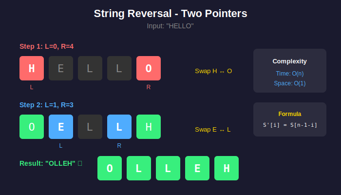
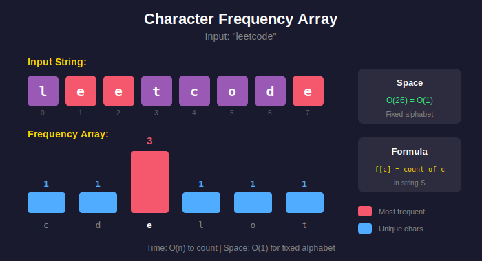
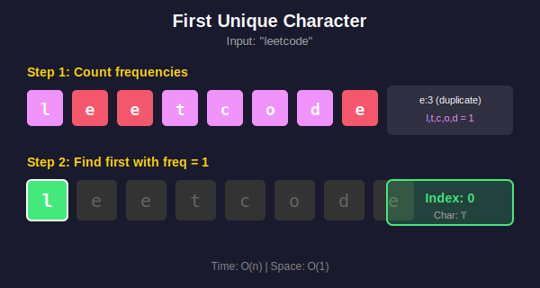

<div align="center">

# 🔤 Basic String Operations

<p>
  
  
</p>

</div>

---

## 🧭 Navigation

| ⬅️ Previous | 📂 Current | ➡️ Next |
|:------------|:----------:|--------:|
| [🏠 Strings Home](../README.md) | **01. Basic String** | [02. Anagram Problems →](../02_anagram_problems/README.md) |

---

## 📐 Mathematical Foundations

### 1️⃣ String Reversal

**Definition:** For string $S[0..n-1]$, reverse $S'$:

$$\boxed{S'[i] = S[n-1-i]}$$

**Two-Pointer Proof:**

- Left pointer: $l = 0, 1, 2, \ldots$

- Right pointer: $r = n-1, n-2, \ldots$

- Swap $S[l] \leftrightarrow S[r]$ while $l < r$

- Iterations: $\lfloor n/2 \rfloor$

---

### 2️⃣ Character Frequency Array

For string over lowercase alphabet:

$$f[c] = |\{i : S[i] = c\}|$$

**Space Complexity:** $O(|\Sigma|)$ where $|\Sigma| = 26$

---

### 3️⃣ First Unique Character

**Algorithm:**

1. Count frequencies: $f[c]$ for all $c$

2. Find first index $i$ where $f[S[i]] = 1$

**Time:** $O(n)$ for counting + $O(n)$ for search = $O(n)$

---

## 🎨 Visual Diagrams

### String Reversal - Two Pointer Approach

<p align="center">
  
</p>

### Character Frequency Array

<p align="center">
  
</p>

### First Unique Character

<p align="center">
  
</p>

---

## 💻 Code Implementations

```python
def reverseString(s: list[str]) -> None:
    """
    In-place reversal using two pointers.
    
    Formula: swap(s[l], s[r]) where l < r
    
    Time: O(n), Space: O(1)
    """
    left, right = 0, len(s) - 1
    while left < right:
        s[left], s[right] = s[right], s[left]
        left += 1
        right -= 1

def firstUniqChar(s: str) -> int:
    """
    Find first unique character.
    
    Two passes: count, then find.
    
    Time: O(n), Space: O(1)
    """
    from collections import Counter
    freq = Counter(s)
    
    for i, c in enumerate(s):
        if freq[c] == 1:
            return i
    return -1

def longestCommonPrefix(strs: list[str]) -> str:
    """
    Find longest common prefix.
    
    Vertical scanning: check column by column.
    
    Time: O(S) where S = sum of all string lengths
    Space: O(1)
    """
    if not strs:
        return ""
    
    for i in range(len(strs[0])):
        char = strs[0][i]
        for s in strs[1:]:
            if i >= len(s) or s[i] != char:
                return strs[0][:i]
    
    return strs[0]

```

---

## 🏆 LeetCode Problems

### 🟢 Easy

| # | Problem | Technique | Time | Space |
|:-:|---------|-----------|:----:|:-----:|
| 14 | [Longest Common Prefix](https://leetcode.com/problems/longest-common-prefix/) | Vertical Scan | O(S) | O(1) |
| 28 | [Find Index of First Occurrence](https://leetcode.com/problems/find-the-index-of-the-first-occurrence-in-a-string/) | KMP | O(n+m) | O(m) |
| 58 | [Length of Last Word](https://leetcode.com/problems/length-of-last-word/) | Reverse Scan | O(n) | O(1) |
| 344 | [Reverse String](https://leetcode.com/problems/reverse-string/) | Two Pointers | O(n) | O(1) |
| 387 | [First Unique Character](https://leetcode.com/problems/first-unique-character-in-a-string/) | Counter | O(n) | O(1) |
| 541 | [Reverse String II](https://leetcode.com/problems/reverse-string-ii/) | Two Pointers | O(n) | O(1) |
| 557 | [Reverse Words in a String III](https://leetcode.com/problems/reverse-words-in-a-string-iii/) | Split + Reverse | O(n) | O(n) |

### 🟡 Medium

| # | Problem | Technique | Time | Space |
|:-:|---------|-----------|:----:|:-----:|
| 151 | [Reverse Words in a String](https://leetcode.com/problems/reverse-words-in-a-string/) | Two Passes | O(n) | O(n) |
| 186 | [Reverse Words in a String II](https://leetcode.com/problems/reverse-words-in-a-string-ii/) | In-place | O(n) | O(1) |
| 443 | [String Compression](https://leetcode.com/problems/string-compression/) | Two Pointers | O(n) | O(1) |

---

---

## 🎯 Pattern Recognition Guide

### When to Use Each Technique

| Problem Type | Technique | Identifier | Time |
|-------------|-----------|------------|------|
| **Reverse string** | Two Pointers | In-place requirement | O(n) |
| **Find unique char** | Frequency Count | First occurrence | O(n) |
| **Common prefix** | Vertical Scan | Multiple strings | O(S) |
| **Word reversal** | Two Passes | Reverse twice | O(n) |
| **Compress string** | Two Pointers | Run-length encoding | O(n) |

---

## 💡 Key Insights & Pro Tips

> **🎯 String Immutability**  
> Python/Java strings are immutable. Convert to list for in-place operations, then join back.

> **⚡ Character Counting**  
> Use array for fixed alphabet (26 letters) = O(1) space. Use Counter/HashMap for variable alphabet.

> **🔄 Reversal Patterns**  
> Reverse entire string, then reverse individual words. Or vice versa.

> **📊 Last Word Length Trick**  
> Scan from right, skip spaces, count until next space. No split needed!

---

## 🎓 Complexity Analysis Summary

### Space Optimization

| Approach | Space | Notes |
|----------|:-----:|-------|
| **String split()** | O(n) | Creates new list |
| **Two pointers** | O(1) | In-place if mutable |
| **Character array** | O(n) | For immutable strings |

### Time Patterns

```
Single pass:           O(n)   → Most basic operations
Vertical scan:         O(S)   → S = sum of all lengths
Two passes:            O(n)   → Reverse + reverse
With sorting:          O(n log n) → When order matters

```

---

## 📚 References & Learning Resources

### 📖 Core Concepts

| Resource | Description | Link |
|----------|-------------|------|
| **String Basics** | Comprehensive tutorial | [GeeksforGeeks](https://www.geeksforgeeks.org/string-data-structure/) |
| **Two Pointers** | Pattern guide | [LeetCode](https://leetcode.com/explore/learn/card/array-and-string/) |
| **String Manipulation** | Python strings | [Real Python](https://realpython.com/python-strings/) |
| **Java StringBuilder** | Efficient concatenation | [Oracle Docs](https://docs.oracle.com/javase/tutorial/java/data/buffers.html) |

### 🎥 Video Tutorials

| Resource | Topic | Link |
|----------|-------|------|
| **NeetCode** | Reverse string variations | [YouTube](https://www.youtube.com/watch?v=_d0T_2Lk2qA) |
| **Back To Back SWE** | String compression | [YouTube](https://www.youtube.com/watch?v=IhJgguNiYYk) |
| **Tushar Roy** | String algorithms basics | [YouTube](https://www.youtube.com/watch?v=GTJr8OvyEVQ) |

### 📝 Interactive Practice

| Platform | Problem Set | Link |
|----------|-------------|------|
| **LeetCode** | String easy problems | [Problems](https://leetcode.com/tag/string/) |
| **HackerRank** | Basic string manipulation | [Practice](https://www.hackerrank.com/domains/algorithms?filters%5Bsubdomains%5D%5B%5D=strings) |
| **Edabit** | String challenges | [Challenges](https://edabit.com/challenges) |

### 🔬 Advanced Topics

| Topic | Description | Link |
|-------|-------------|------|
| **String Interning** | Memory optimization | [Wikipedia](https://en.wikipedia.org/wiki/String_interning) |
| **Unicode Handling** | UTF-8, UTF-16 | [Unicode Guide](https://www.unicode.org/standard/tutorial-info.html) |
| **Rope Data Structure** | Efficient long strings | [Wikipedia](https://en.wikipedia.org/wiki/Rope_(data_structure)) |

---

## 🎯 Practice Roadmap

### Beginner (Start Here!)

1. **Reverse String** (#344) - Learn two pointers

2. **First Unique Character** (#387) - Master frequency counting

3. **Length of Last Word** (#58) - String parsing

### Intermediate

4. **Reverse Words** (#151) - Two-pass technique

5. **String Compression** (#443) - Two pointers advanced

6. **Longest Common Prefix** (#14) - Vertical scanning

### Mastery Challenge

- Solve each in < 10 minutes

- Optimize to O(1) space where possible

- Explain time/space complexity

---

## 💭 Common Interview Questions

**Q: Why use StringBuilder instead of string concatenation?**  
A: String concatenation creates new string each time → O(n²). StringBuilder mutates → O(n).

**Q: How to reverse words in-place?**  
A: Reverse entire string, then reverse each word individually.

**Q: What's the difference between "" and null?**  
A: Empty string "" is valid object with length 0. null means no object exists.

---

<div align="center">

### 🎓 Master the Basics First!

*These are the building blocks for all advanced string problems.*

**Made with ❤️ by [Gaurav Goswami](https://github.com/Gaurav14cs17)**

[⬅️ Strings Home](../README.md) | [➡️ Anagram Problems](../02_anagram_problems/README.md)

---

*Practice makes perfect!* 💪

</div>

---

## 🧭 Navigation

| ⬅️ Previous | 📂 Current | ➡️ Next |
|:------------|:----------:|--------:|
| [🏠 Strings Home](../README.md) | **01. Basic String** | [02. Anagram Problems →](../02_anagram_problems/README.md) |
