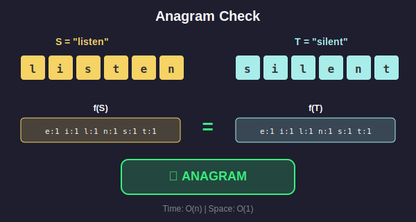
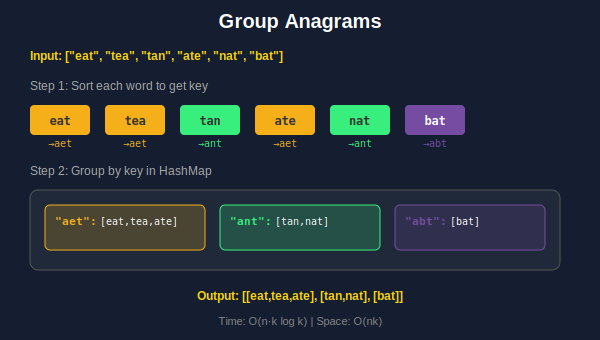
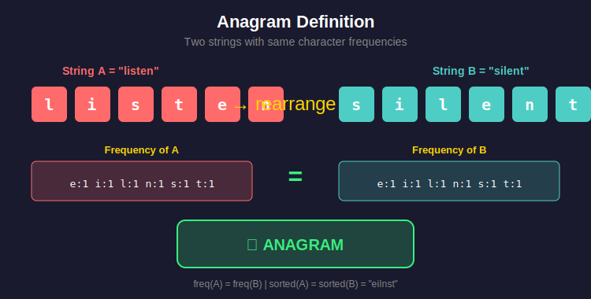
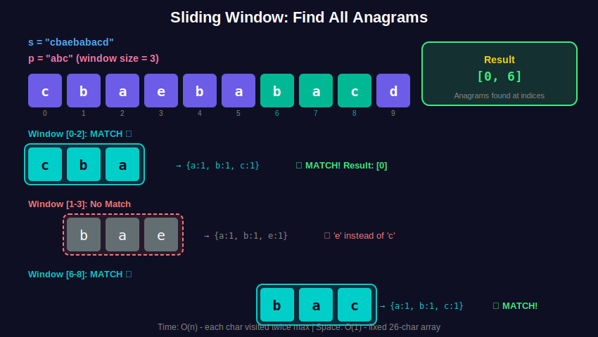

<div align="center">

# 🔀 Anagram Problems

<p>
  
  
</p>

</div>

---

## 🧭 Navigation

| ⬅️ Previous | 📂 Current | ➡️ Next |
|:------------|:----------:|--------:|
| [← 01. Basic String](../01_basic_string/README.md) | **02. Anagram Problems** | [03. Palindrome →](../03_palindrome/README.md) |

---

## 📐 Mathematical Foundations

### 1️⃣ Anagram Definition

**Definition:** Two strings $S$ and $T$ are anagrams if:

```math
\boxed{\forall c \in \Sigma: \text{count}_S(c) = \text{count}_T(c)}

```

**Equivalent conditions:**
1. $\text{sorted}(S) = \text{sorted}(T)$
2. $\vec{f}(S) = \vec{f}(T)$ (frequency vectors equal)
3. $|S| = |T|$ and $S$ is a permutation of $T$

---

### 2️⃣ Frequency Vector Representation

For lowercase alphabet ($|\Sigma| = 26$):

```math
\vec{f}(S) = [f_a, f_b, \ldots, f_z] \in \mathbb{Z}^{26}

```

**Anagram Hash (Canonical Form):**

```math
H(S) = \text{tuple}(\text{sorted}(S)) \quad \text{or} \quad H(S) = \text{tuple}(\vec{f}(S))

```

---

### 3️⃣ Sliding Window for Anagrams

**Problem:** Find all anagrams of $P$ in $S$.

**Window Invariant:**
- Window size = $|P|$
- Window frequency vector = $\vec{f}(P)$

**Update Formula:**

```math
\vec{f}_{\text{window}}[S[i]] += 1 \quad \text{(add right)}
\vec{f}_{\text{window}}[S[i-|P|]] -= 1 \quad \text{(remove left)}

```

---

### 4️⃣ Minimum Window Substring

**Problem:** Find minimum window in $S$ containing all characters of $T$.

**Condition:**

```math
\forall c \in T: \text{count}_{\text{window}}(c) \geq \text{count}_T(c)

```

**Two Pointers:**
- Expand right until condition satisfied
- Contract left while condition holds
- Track minimum window

---

## 🎨 Visual Diagrams

### Anagram Check - Frequency Vector Comparison

<p align="center">
  
</p>

### Sliding Window for Finding All Anagrams

<p align="center">
  
</p>

### Group Anagrams Using Hash Map

<p align="center">
  
</p>

### Anagram Concept
<p align="center">
  
</p>

### Sliding Window for Anagrams
<p align="center">
  
</p>

---

## 💻 Code Implementations

```python
def isAnagram(s: str, t: str) -> bool:
    """
    Check if two strings are anagrams.
    
    Anagram condition: ∀c: count_s(c) = count_t(c)
    
    Time: O(n), Space: O(1)
    """
    from collections import Counter
    return Counter(s) == Counter(t)

def groupAnagrams(strs: list[str]) -> list[list[str]]:
    """
    Group strings by anagram equivalence class.
    
    Key: Canonical form (sorted string or frequency tuple)
    
    Time: O(n × k log k), Space: O(nk)
    """
    from collections import defaultdict
    
    groups = defaultdict(list)
    for s in strs:
        # Canonical form: sorted characters
        key = tuple(sorted(s))
        groups[key].append(s)
    
    return list(groups.values())

def findAnagrams(s: str, p: str) -> list[int]:
    """
    Find all anagram start indices.
    
    Sliding window with frequency matching.
    
    Time: O(n), Space: O(1)
    """
    from collections import Counter
    
    if len(p) > len(s):
        return []
    
    result = []
    p_count = Counter(p)
    window = Counter(s[:len(p)])
    
    if window == p_count:
        result.append(0)
    
    for i in range(len(p), len(s)):
        # Add right character
        window[s[i]] += 1
        # Remove left character
        left_char = s[i - len(p)]
        window[left_char] -= 1
        if window[left_char] == 0:
            del window[left_char]
        
        if window == p_count:
            result.append(i - len(p) + 1)
    
    return result

def minWindow(s: str, t: str) -> str:
    """
    Minimum window substring containing all chars of t.
    
    Expand right → satisfy condition
    Contract left → minimize window
    
    Time: O(n), Space: O(k)
    """
    from collections import Counter
    
    if not s or not t:
        return ""
    
    t_count = Counter(t)
    required = len(t_count)
    formed = 0
    
    window = {}
    left = 0
    min_len = float('inf')
    result = ""
    
    for right, char in enumerate(s):
        # Expand window
        window[char] = window.get(char, 0) + 1
        
        if char in t_count and window[char] == t_count[char]:
            formed += 1
        
        # Contract window
        while formed == required:
            if right - left + 1 < min_len:
                min_len = right - left + 1
                result = s[left:right + 1]
            
            left_char = s[left]
            window[left_char] -= 1
            if left_char in t_count and window[left_char] < t_count[left_char]:
                formed -= 1
            left += 1
    
    return result

```

---

## 🏆 LeetCode Problems

### 🟢 Easy

| # | Problem | Technique | Time | Space |
|:-:|---------|-----------|:----:|:-----:|
| 242 | [Valid Anagram](https://leetcode.com/problems/valid-anagram/) | Counter | O(n) | O(1) |
| 383 | [Ransom Note](https://leetcode.com/problems/ransom-note/) | Counter | O(n) | O(1) |

### 🟡 Medium

| # | Problem | Technique | Time | Space |
|:-:|---------|-----------|:----:|:-----:|
| 49 | [Group Anagrams](https://leetcode.com/problems/group-anagrams/) | Hash + Sort | O(nk log k) | O(nk) |
| 438 | [Find All Anagrams](https://leetcode.com/problems/find-all-anagrams-in-a-string/) | Sliding Window | O(n) | O(1) |
| 567 | [Permutation in String](https://leetcode.com/problems/permutation-in-string/) | Sliding Window | O(n) | O(1) |

### 🔴 Hard

| # | Problem | Technique | Time | Space |
|:-:|---------|-----------|:----:|:-----:|
| 76 | [Minimum Window Substring](https://leetcode.com/problems/minimum-window-substring/) | Sliding Window | O(n) | O(k) |

---

---

## 🎨 Visual Algorithm Walkthrough

### Find All Anagrams - Sliding Window

```
Input: s = "cbaebabacd", p = "abc"

Step-by-step:
+----------------------------------------------------------+
| Initial: p_count = {a:1, b:1, c:1}                      |
+----------------------------------------------------------+
| Window size = 3                                          |
|                                                          |
| Index 0-2: "cba"                                        |
| window = {c:1, b:1, a:1} ← MATCH! ✓ Add index 0        |
|                                                          |
| Index 1-3: "bae"                                        |
| Remove 'c', Add 'e'                                     |
| window = {b:1, a:1, e:1} ← No match                    |
|                                                          |
| Index 2-4: "aeb"                                        |
| Remove 'b', Add 'b'                                     |
| window = {a:1, e:1, b:1} ← No match                    |
|                                                          |
| Index 3-5: "eba"                                        |
| Remove 'a', Add 'a'                                     |
| window = {e:1, b:1, a:1} ← No match                    |
|                                                          |
| Index 4-6: "bab"                                        |
| Remove 'e', Add 'b'                                     |
| window = {b:2, a:1} ← No match (extra b)               |
|                                                          |
| Index 5-7: "aba"                                        |
| Remove 'b', Add 'a'                                     |
| window = {b:1, a:2} ← No match (extra a)               |
|                                                          |
| Index 6-8: "bac"                                        |
| Remove 'a', Add 'c'                                     |
| window = {b:1, a:1, c:1} ← MATCH! ✓ Add index 6        |
+----------------------------------------------------------+

Result: [0, 6]

```

---

## 💡 Key Insights & Pro Tips

> **🎯 Anagram Canonical Form**  
> Two strings are anagrams ⟺ sorted versions are equal ⟺ frequency vectors are equal.

> **⚡ Frequency Array vs HashMap**  
> For lowercase letters only: use `int[26]` for O(1) space and better performance. For any chars: use HashMap.

> **🔄 Sliding Window Optimization**  
> Instead of comparing entire frequency map each time, maintain a "matched" counter. Update only when chars enter/leave window.

> **📊 Group Anagrams Hash Key**  
> Use `tuple(sorted(word))` or `tuple(freq_array)` as dict key. Both uniquely identify anagram class.

> **🔍 Minimum Window Trick**  
> Track "formed" = number of unique chars with required frequency. Expand until formed = required, then contract.

---

## 🎓 Pattern Recognition Guide

### When to Use Each Approach

| Problem Type | Technique | Time | Space |
|-------------|-----------|:----:|:-----:|
| **Check if anagram** | Sort or Count | O(n log n) or O(n) | O(1) or O(n) |
| **Group anagrams** | Hash with sorted key | O(n·k log k) | O(nk) |
| **Find all in string** | Sliding window | O(n) | O(1) |
| **Minimum window** | Sliding window + formed counter | O(n) | O(k) |
| **Permutation in string** | Same as find all | O(n) | O(1) |

---

## 🧮 Mathematical Deep Dive

### Why Sorting Works for Anagrams

**Theorem:** Two strings are anagrams ⟺ their sorted forms are identical.

**Proof:**
- (⇒) If anagrams, same char frequencies → sorted strings have chars in same order → equal
- (⇐) If sorted forms equal, same chars at same positions → same frequencies → anagrams ∎

### Sliding Window Correctness

**Invariant:** Window of size |p| contains anagram ⟺ window frequency = p frequency

**Proof of O(n) time:**
- Each character enters window exactly once: O(n)
- Each character leaves window exactly once: O(n)
- Frequency update: O(1) per operation
- Total: O(n) ∎

---

## 🎯 Complexity Comparison

### Anagram Detection Methods

| Method | Time | Space | Pros | Cons |
|--------|:----:|:-----:|------|------|
| **Sort both** | O(n log n) | O(n) | Simple | Slower |
| **Count array** | O(n) | O(1)* | Fast | Only fixed alphabet |
| **HashMap** | O(n) | O(k) | Flexible | More space |

*O(1) for fixed alphabet size (26 letters)

### Group Anagrams Methods

| Method | Time | Space | Hash Key |
|--------|:----:|:-----:|----------|
| **Sort as key** | O(n·k log k) | O(nk) | `tuple(sorted(s))` |
| **Count as key** | O(n·k) | O(nk) | `tuple(frequency)` |
| **Prime hash** | O(n·k) | O(nk) | Product of primes |

---

## 📚 References & Learning Resources

### 📖 Core Concepts

| Resource | Description | Link |
|----------|-------------|------|
| **Anagram Algorithms** | Complete guide | [GeeksforGeeks](https://www.geeksforgeeks.org/check-whether-two-strings-are-anagram-of-each-other/) |
| **Sliding Window Pattern** | Comprehensive tutorial | [LeetCode Discuss](https://leetcode.com/discuss/study-guide/657507/) |
| **Frequency Counting** | Hash map techniques | [GeeksforGeeks](https://www.geeksforgeeks.org/counting-frequencies-of-array-elements/) |
| **Permutation vs Anagram** | Key differences | [StackOverflow](https://stackoverflow.com/questions/6470089/what-is-the-difference-between-permutation-and-anagram) |

### 🎥 Video Tutorials

| Resource | Topic | Link |
|----------|-------|------|
| **NeetCode** | Valid anagram explained | [YouTube](https://www.youtube.com/watch?v=9UtInBqnCgA) |
| **NeetCode** | Group anagrams | [YouTube](https://www.youtube.com/watch?v=vzdNOK2oB2E) |
| **NeetCode** | Find all anagrams | [YouTube](https://www.youtube.com/watch?v=G8xtZy0fDKg) |
| **Back To Back SWE** | Minimum window substring | [YouTube](https://www.youtube.com/watch?v=eS6PZLjoaq8) |
| **Tushar Roy** | Sliding window technique | [YouTube](https://www.youtube.com/watch?v=jM2dhDPYMQM) |

### 📝 Interactive Practice

| Platform | Problem Set | Link |
|----------|-------------|------|
| **LeetCode** | Sliding window tag | [Problems](https://leetcode.com/tag/sliding-window/) |
| **LeetCode** | Hash table tag | [Problems](https://leetcode.com/tag/hash-table/) |
| **HackerRank** | String anagrams | [Practice](https://www.hackerrank.com/challenges/sherlock-and-anagrams/) |
| **CodeSignal** | Anagram challenges | [Arcade](https://app.codesignal.com/) |

### 🔬 Advanced Topics

| Topic | Description | Link |
|-------|-------------|------|
| **Rolling Hash** | For fast string comparison | [CP-Algorithms](https://cp-algorithms.com/string/string-hashing.html) |
| **Rabin-Karp** | Pattern matching with hash | [GeeksforGeeks](https://www.geeksforgeeks.org/rabin-karp-algorithm-for-pattern-searching/) |
| **Perfect Hashing** | Anagram detection in O(1) | [Wikipedia](https://en.wikipedia.org/wiki/Perfect_hash_function) |

### 🎯 Problem Collections

| Collection | Focus | Link |
|-----------|-------|------|
| **LeetCode Patterns** | Sliding window section | [Guide](https://seanprashad.com/leetcode-patterns/) |
| **NeetCode Roadmap** | String problems | [Roadmap](https://neetcode.io/roadmap) |
| **Grind 75** | Anagram problems | [List](https://www.techinterviewhandbook.org/grind75) |

---

## 🎯 Practice Roadmap

### Beginner Level
1. **Valid Anagram** (#242) - Learn frequency counting
2. **Ransom Note** (#383) - Apply same concept
3. **Group Anagrams** (#49) - Use hash map

### Intermediate Level
4. **Find All Anagrams** (#438) - Master sliding window
5. **Permutation in String** (#567) - Similar pattern
6. **Minimum Window** (#76) - Advanced window

### Pro Tips
- Start with fixed window problems (#438, #567)
- Then move to variable window (#76)
- Practice optimizing space to O(1) for fixed alphabet

---

## 💭 Common Interview Questions

**Q: What's faster - sorting or counting for anagram check?**  
A: Counting is O(n) vs O(n log n) for sorting. But sorting uses O(n) space for copy, counting uses O(1) for fixed alphabet.

**Q: How to handle case insensitivity?**  
A: Convert both strings to lowercase first, or map both 'A' and 'a' to same counter index.

**Q: Can prime numbers be used for anagram detection?**  
A: Yes! Assign each char a prime, multiply them. Anagrams have same product. But beware of overflow.

**Q: Difference between permutation and anagram?**  
A: Permutation = all possible arrangements. Anagram = specific arrangement that forms a valid word.

---

<div align="center">

### 🧠 Sliding Window = The Key Pattern

*Master the window technique here, use it everywhere!*

**Made with ❤️ by [Gaurav Goswami](https://github.com/Gaurav14cs17)**

[⬅️ Basic String](../01_basic_string/README.md) | [➡️ Palindrome](../03_palindrome/README.md)

---

*Frequency counting + Sliding window = 90% of string problems solved!* ✨

</div>

---

## 🧭 Navigation

| ⬅️ Previous | 📂 Current | ➡️ Next |
|:------------|:----------:|--------:|
| [← 01. Basic String](../01_basic_string/README.md) | **02. Anagram Problems** | [03. Palindrome →](../03_palindrome/README.md) |
