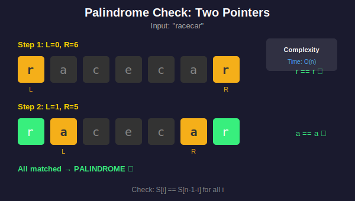
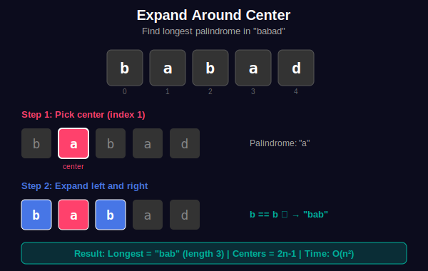
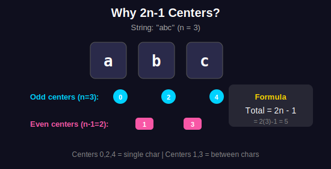
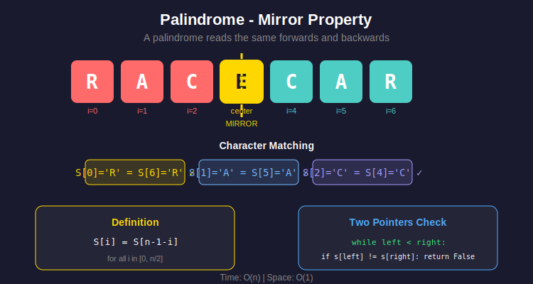

<div align="center">

# 🔄 Palindrome Problems

<p>
  
  
</p>

</div>

---

## 🧭 Navigation

| ⬅️ Previous | 📂 Current | ➡️ Next |
|:------------|:----------:|--------:|
| [← 02. Anagram Problems](../02_anagram_problems/README.md) | **03. Palindrome** | [04. Subsequence →](../04_subsequence/README.md) |

---

## 📐 Mathematical Foundations

### 1️⃣ Palindrome Definition

**Definition:** String $S[0..n-1]$ is a palindrome if:

```math
\boxed{S = \text{reverse}(S)}
```

**Equivalently:**

```math
S[i] = S[n-1-i] \quad \forall i \in [0, \lfloor n/2 \rfloor]
```

---

### 2️⃣ Expand Around Center

**Key Insight:** Every palindrome has a center.

**Centers:**
- **Odd length:** $n$ centers at indices $0, 1, \ldots, n-1$
- **Even length:** $n-1$ centers between indices

**Total centers:** $2n - 1$

**Expansion Formula:**

For center at position $c$ (using $2n-1$ mapping):

```math
\text{left} = c // 2
\text{right} = c // 2 + c \% 2
```

---

### 3️⃣ Longest Palindromic Substring DP

**State:** $dp[i][j] = 1$ if $S[i..j]$ is palindrome

**Recurrence:**

```math
dp[i][j] = \begin{cases}
1 & \text{if } i = j \\
S[i] = S[j] & \text{if } j = i + 1 \\
S[i] = S[j] \land dp[i+1][j-1] & \text{if } j > i + 1
\end{cases}
```

---

### 4️⃣ Count Palindromic Substrings

**Formula using expand around center:**

```math
\text{count} = \sum_{c=0}^{2n-2} \text{palindromes\_from\_center}(c)
```

**Time:** $O(n^2)$ total

---

### 5️⃣ Manacher's Algorithm

**Key Idea:** Reuse palindrome information to skip redundant checks.

**Augmented string:** Insert `#` between characters.

```math
S' = \#s_0\#s_1\#\ldots\#s_{n-1}\#
```

**Property:** All palindromes become odd-length in $S'$.

**Time Complexity:** $O(n)$

---

## 🎨 Visual Diagrams

### Palindrome Check - Two Pointer Approach

<p align="center">
  
</p>

### Expand Around Center Algorithm

<p align="center">
  
</p>

### Why 2n-1 Centers?

<p align="center">
  
</p>

### Palindrome Concept
<p align="center">
  
</p>

---

## 💻 Code Implementations

```python
def isPalindrome(s: str) -> bool:
    """
    Check if string is valid palindrome (alphanumeric only).
    
    Two pointers from both ends.
    
    Time: O(n), Space: O(1)
    """
    left, right = 0, len(s) - 1
    
    while left < right:
        while left < right and not s[left].isalnum():
            left += 1
        while left < right and not s[right].isalnum():
            right -= 1
        
        if s[left].lower() != s[right].lower():
            return False
        left += 1
        right -= 1
    
    return True

def longestPalindrome(s: str) -> str:
    """
    Find longest palindromic substring.
    
    Expand around each center (2n-1 centers).
    
    Time: O(n²), Space: O(1)
    """
    if not s:
        return ""
    
    start, max_len = 0, 1
    
    def expand(left: int, right: int) -> int:
        """Expand and return palindrome length."""
        while left >= 0 and right < len(s) and s[left] == s[right]:
            left -= 1
            right += 1
        return right - left - 1
    
    for i in range(len(s)):

        # Odd length (center at i)
        len1 = expand(i, i)

        # Even length (center between i and i+1)
        len2 = expand(i, i + 1)
        
        curr_max = max(len1, len2)
        if curr_max > max_len:
            max_len = curr_max
            start = i - (curr_max - 1) // 2
    
    return s[start:start + max_len]

def countSubstrings(s: str) -> int:
    """
    Count palindromic substrings.
    
    Expand around each of 2n-1 centers.
    
    Time: O(n²), Space: O(1)
    """
    n = len(s)
    count = 0
    
    for center in range(2 * n - 1):
        left = center // 2
        right = left + center % 2
        
        while left >= 0 and right < n and s[left] == s[right]:
            count += 1
            left -= 1
            right += 1
    
    return count

def partition(s: str) -> list[list[str]]:
    """
    Palindrome partitioning - find all ways to partition.
    
    Backtracking with palindrome check.
    
    Time: O(n × 2ⁿ), Space: O(n)
    """
    result = []
    
    def is_palindrome(left: int, right: int) -> bool:
        while left < right:
            if s[left] != s[right]:
                return False
            left += 1
            right -= 1
        return True
    
    def backtrack(start: int, path: list[str]) -> None:
        if start == len(s):
            result.append(path[:])
            return
        
        for end in range(start, len(s)):
            if is_palindrome(start, end):
                path.append(s[start:end + 1])
                backtrack(end + 1, path)
                path.pop()
    
    backtrack(0, [])
    return result

def validPalindrome(s: str) -> bool:
    """
    Check if string can become palindrome by removing at most one char.
    
    Time: O(n), Space: O(1)
    """
    def check(left: int, right: int) -> bool:
        while left < right:
            if s[left] != s[right]:
                return False
            left += 1
            right -= 1
        return True
    
    left, right = 0, len(s) - 1
    while left < right:
        if s[left] != s[right]:

            # Try removing left or right character
            return check(left + 1, right) or check(left, right - 1)
        left += 1
        right -= 1
    
    return True
```

---

## 🏆 LeetCode Problems

### 🟢 Easy

| # | Problem | Technique | Time | Space |
|:-:|---------|-----------|:----:|:-----:|
| 9 | [Palindrome Number](https://leetcode.com/problems/palindrome-number/) | Math | O(log n) | O(1) |
| 125 | [Valid Palindrome](https://leetcode.com/problems/valid-palindrome/) | Two Pointers | O(n) | O(1) |
| 234 | [Palindrome Linked List](https://leetcode.com/problems/palindrome-linked-list/) | Fast/Slow | O(n) | O(1) |
| 680 | [Valid Palindrome II](https://leetcode.com/problems/valid-palindrome-ii/) | Two Pointers | O(n) | O(1) |

### 🟡 Medium

| # | Problem | Technique | Time | Space |
|:-:|---------|-----------|:----:|:-----:|
| 5 | [Longest Palindromic Substring](https://leetcode.com/problems/longest-palindromic-substring/) | Expand Center | O(n²) | O(1) |
| 131 | [Palindrome Partitioning](https://leetcode.com/problems/palindrome-partitioning/) | Backtracking | O(n⋅2ⁿ) | O(n) |
| 516 | [Longest Palindromic Subsequence](https://leetcode.com/problems/longest-palindromic-subsequence/) | DP | O(n²) | O(n²) |
| 647 | [Palindromic Substrings](https://leetcode.com/problems/palindromic-substrings/) | Expand Center | O(n²) | O(1) |

### 🔴 Hard

| # | Problem | Technique | Time | Space |
|:-:|---------|-----------|:----:|:-----:|
| 132 | [Palindrome Partitioning II](https://leetcode.com/problems/palindrome-partitioning-ii/) | DP | O(n²) | O(n) |
| 214 | [Shortest Palindrome](https://leetcode.com/problems/shortest-palindrome/) | KMP | O(n) | O(n) |
| 336 | [Palindrome Pairs](https://leetcode.com/problems/palindrome-pairs/) | Trie/Hash | O(n⋅k²) | O(nk) |

---

---

## 🎨 Visual Algorithm Walkthrough

### Expand Around Center - Step by Step

```
String: "babad"

Center enumeration (2n-1 = 9 centers):
+----------------------------------------------------------+
| Center 0: b → "b" (length 1)                            |
| Center 1: b|a → no palindrome (even)                    |
| Center 2: a → "a" (length 1)                            |
|           ↓ expand                                       |
|         b a b → "bab" (length 3) ✓                      |
|           ↓ expand                                       |
|       (out of bounds)                                    |
|                                                          |
| Center 3: a|b → no palindrome (even)                    |
| Center 4: b → "b" (length 1)                            |
|           ↓ expand                                       |
|         a b a → "aba" (length 3) ✓                      |
|                                                          |
| Center 5: b|a → no palindrome (even)                    |
| Center 6: a → "a" (length 1)                            |
| Center 7: a|d → no palindrome (even)                    |
| Center 8: d → "d" (length 1)                            |
+----------------------------------------------------------+

Longest found: "bab" or "aba" (both length 3)
```

### Why 2n-1 Centers?

```
For "abc" (n=3):

Odd centers (n):         Even centers (n-1):
  a   b   c                 a|b   b|c
  ↑   ↑   ↑                  ↑     ↑
  0   2   4                  1     3

Total: 3 + 2 = 5 = 2(3) - 1 ✓

Formula: center c maps to:
  left = c ÷ 2
  right = c ÷ 2 + (c mod 2)
```

---

## 💡 Key Insights & Pro Tips

> **🎯 Center Count Formula**  
> Total centers = 2n-1. Every substring has exactly one center (odd) or center-gap (even).

> **⚡ Expand vs DP**  
> Expand around center: O(n²) time, O(1) space. DP: O(n²) time, O(n²) space. Choose expand for interviews!

> **🔄 Palindrome = Reverse**  
> String is palindrome ⟺ s == reverse(s). But two pointers is O(1) space vs O(n) for reverse.

> **📊 Manacher's Algorithm**  
> O(n) time for longest palindrome! But complex. Only use if asked specifically.

> **🔍 Valid Palindrome II Trick**  
> When mismatch found, try skip left OR skip right. If either works → valid with one deletion.

---

## 🎓 Pattern Recognition Guide

### Problem Type Decision Tree

```
Palindrome Problem
        |
    +---+---+
   Check?  Find?
    |       |
 Two Ptr  +-+--+
  O(n)  Count? Longest?
         |      |
      Expand  +-+--+
       O(n²)  DP  Manacher
            O(n²) O(n)
```

### When to Use Each Approach

| Problem Type | Technique | Time | Space | Use When |
|-------------|-----------|:----:|:-----:|----------|
| **Is palindrome?** | Two Pointers | O(n) | O(1) | Simple validation |
| **Longest palindrome** | Expand Center | O(n²) | O(1) | Interview default |
| **Count palindromes** | Expand Center | O(n²) | O(1) | Need to count all |
| **Partition** | Backtracking + memo | O(n·2ⁿ) | O(n) | Need all partitions |
| **Min cuts** | DP | O(n²) | O(n) | Optimization problem |
| **Manacher's** | Linear scan | O(n) | O(n) | Asked specifically |

---

## 🧮 Mathematical Deep Dive

### Palindrome Count Formula

**Total palindromic substrings:**

For each center $c$ in $[0, 2n-2]$:
- Expand while $s[left] = s[right]$
- Each expansion adds 1 palindrome

**Upper bound:** $O(n^2)$ - each substring could be palindrome

**Example:** "aaa" has 6 palindromes:
- Single: "a", "a", "a" (3)
- Length 2: "aa", "aa" (2)  
- Length 3: "aaa" (1)
Total: 3 + 2 + 1 = 6 = n(n+1)/2

### Manacher's Algorithm Proof Sketch

**Key Idea:** Reuse previously computed palindrome information.

**Augmented string:** Insert '#' between chars
```
"aba" → "#a#b#a#"
All palindromes become odd-length!
```

**LPS array:** `lps[i]` = radius of palindrome centered at `i`

**Optimization:** When inside known palindrome, can mirror information from other side.

**Time:** Each position visited at most twice → O(n) ∎

---

## 🎯 Complexity Comparison

### Approach Comparison

| Approach | Time | Space | Difficulty | Interview |
|----------|:----:|:-----:|:----------:|:---------:|
| **Brute Force** | O(n³) | O(1) | Easy | ❌ Too slow |
| **DP (2D)** | O(n²) | O(n²) | Medium | ⚠️ Space issue |
| **Expand Center** | O(n²) | O(1) | Medium | ✅ Best choice |
| **Manacher's** | O(n) | O(n) | Hard | ⚠️ Overkill |

### When Each Matters

```
n < 100:     Any approach works
n < 10,000:  Expand around center recommended
n > 10,000:  Consider Manacher's
```

---

## 📚 References & Learning Resources

### 📖 Core Concepts
| Resource | Description | Link |
|----------|-------------|------|
| **Palindrome Algorithms** | Complete guide | [GeeksforGeeks](https://www.geeksforgeeks.org/longest-palindrome-substring-set-1/) |
| **Manacher's Algorithm** | O(n) longest palindrome | [Wikipedia](https://en.wikipedia.org/wiki/Longest_palindromic_substring) |
| **Expand Around Center** | Detailed explanation | [LeetCode Solution](https://leetcode.com/problems/longest-palindromic-substring/solution/) |
| **Palindrome Properties** | Mathematical insights | [MathWorld](https://mathworld.wolfram.com/Palindrome.html) |

### 🎥 Video Tutorials
| Resource | Topic | Link |
|----------|-------|------|
| **NeetCode** | Longest palindromic substring | [YouTube](https://www.youtube.com/watch?v=XYQecbcd6_c) |
| **NeetCode** | Palindromic substrings | [YouTube](https://www.youtube.com/watch?v=4RACzI5-du8) |
| **Back To Back SWE** | Expand around center | [YouTube](https://www.youtube.com/watch?v=XmSOWnL6T_I) |
| **Tushar Roy** | Manacher's algorithm | [YouTube](https://www.youtube.com/watch?v=V-sEwsca1ak) |
| **Abdul Bari** | Palindrome partitioning | [YouTube](https://www.youtube.com/watch?v=fOTlBKBPNdQ) |

### 📝 Interactive Practice
| Platform | Problem Set | Link |
|----------|-------------|------|
| **LeetCode** | Palindrome tag | [Problems](https://leetcode.com/tag/palindrome/) |
| **HackerRank** | Palindrome index | [Challenge](https://www.hackerrank.com/challenges/palindrome-index/) |
| **Codeforces** | Palindrome problems | [Problemset](https://codeforces.com/problemset?tags=strings,1200-1400) |

### 🔬 Advanced Topics
| Topic | Description | Link |
|-------|-------------|------|
| **Manacher's Algorithm** | Linear time implementation | [CP-Algorithms](https://cp-algorithms.com/string/manacher.html) |
| **Palindromic Tree** | Efficient all palindromes | [Codeforces](https://codeforces.com/blog/entry/13959) |
| **KMP for Palindromes** | Shortest palindrome | [GeeksforGeeks](https://www.geeksforgeeks.org/minimum-insertions-to-form-a-palindrome-dp-28/) |
| **Aho-Corasick Palindrome** | Multiple palindrome patterns | [Paper](https://www.sciencedirect.com/science/article/pii/0022000075900115) |

### 🎯 Problem Collections
| Collection | Focus | Link |
|-----------|-------|------|
| **NeetCode 150** | Essential palindromes | [List](https://neetcode.io/practice) |
| **Blind 75** | Core problems | [List](https://www.teamblind.com/post/New-Year-Gift---Curated-List-of-Top-75-LeetCode-Questions-to-Save-Your-Time-OaM1orEU) |
| **Striver's SDE Sheet** | Palindrome section | [Sheet](https://takeuforward.org/interviews/strivers-sde-sheet-top-coding-interview-problems/) |

### 📊 Visualization Tools
| Tool | Purpose | Link |
|------|---------|------|
| **Palindrome Visualizer** | Interactive demo | [Tool](https://www.cs.usfca.edu/~galles/visualization/Algorithms.html) |
| **VisuAlgo** | Algorithm visualization | [Website](https://visualgo.net/en) |

---

## 🎯 Practice Roadmap

### Beginner Level
1. **Valid Palindrome** (#125) - Learn two pointers
2. **Palindrome Number** (#9) - Integer variant
3. **Palindrome Linked List** (#234) - Apply to linked list

### Intermediate Level
4. **Longest Palindromic Substring** (#5) - Master expand center
5. **Palindromic Substrings** (#647) - Count all
6. **Valid Palindrome II** (#680) - With one deletion

### Advanced Level
7. **Palindrome Partitioning** (#131) - Backtracking
8. **Palindrome Partitioning II** (#132) - Min cuts DP
9. **Longest Palindromic Subsequence** (#516) - DP variant
10. **Shortest Palindrome** (#214) - KMP application

### Expert Challenge
- Implement Manacher's algorithm
- Solve in O(n) time
- Explain the proof clearly

---

## 💭 Common Interview Questions

**Q: Why expand around center instead of checking every substring?**  
A: Checking every substring: O(n²) substrings × O(n) check = O(n³). Expand: O(n) centers × O(n) expand = O(n²).

**Q: How does Manacher's achieve O(n)?**  
A: By reusing information from already computed palindromes via mirroring. Never re-expands same positions.

**Q: When to use DP vs expand around center?**  
A: Expand is better for interviews (O(1) space). DP if you need to query multiple substrings.

**Q: Can we find palindrome in O(n) without Manacher's?**  
A: No for worst case. But average case with hashing can be faster in practice.

---

<div align="center">

### 🎯 2n-1 Centers: The Magic Number

*Remember this formula, and palindrome problems become easy!*

**Made with ❤️ by [Gaurav Goswami](https://github.com/Gaurav14cs17)**

[⬅️ Anagram Problems](../02_anagram_problems/README.md) | [➡️ Subsequence](../04_subsequence/README.md)

---

*Master expand-around-center, ace palindrome problems!* 🎯

</div>

---

## 🧭 Navigation

| ⬅️ Previous | 📂 Current | ➡️ Next |
|:------------|:----------:|--------:|
| [← 02. Anagram Problems](../02_anagram_problems/README.md) | **03. Palindrome** | [04. Subsequence →](../04_subsequence/README.md) |
