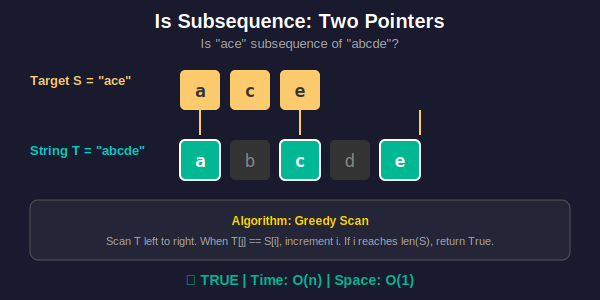
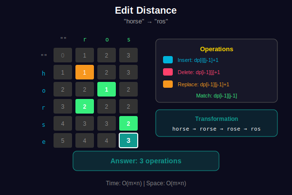

<div align="center">

# 📜 Subsequence Problems

<p>
  
  
</p>

</div>

---

## 🧭 Navigation

| ⬅️ Previous | 📂 Current | ➡️ Next Topic |
|:------------|:----------:|--------:|
| [← 03. Palindrome](../03_palindrome/README.md) | **04. Subsequence** | [🏠 Strings Home](../README.md) → [Linked Lists](../../03_linked_lists/README.md) |

---

## 📐 Mathematical Foundations

### 1️⃣ Subsequence Definition

**Definition:** $T$ is a subsequence of $S$ if $T$ can be obtained by deleting zero or more characters from $S$ without changing the order.

**Formal:** $T = S[i\_1]S[i\_2]\ldots S[i\_k]$ where $0 \leq i\_1 < i\_2 < \ldots < i\_k < n$

**Count of all subsequences:**

```math
\boxed{2^n}

```

(Each character: include or exclude)

---

### 2️⃣ Longest Common Subsequence (LCS)

**State:** $dp[i][j] =$ LCS length of $S[0..i-1]$ and $T[0..j-1]$

**Recurrence:**

```math
\boxed{dp[i][j] = \begin{cases}
dp[i-1][j-1] + 1 & \text{if } S[i-1] = T[j-1] \\
\max(dp[i-1][j], dp[i][j-1]) & \text{otherwise}
\end{cases}}

```

**Base Case:** $dp[0][j] = dp[i][0] = 0$

---

### 3️⃣ Edit Distance (Levenshtein)

**State:** $dp[i][j] =$ minimum operations to convert $S[0..i-1]$ to $T[0..j-1]$

**Recurrence:**

```math
dp[i][j] = \begin{cases}
j & \text{if } i = 0 \\
i & \text{if } j = 0 \\
dp[i-1][j-1] & \text{if } S[i-1] = T[j-1] \\
1 + \min\begin{cases}
dp[i-1][j] & \text{(delete)} \\
dp[i][j-1] & \text{(insert)} \\
dp[i-1][j-1] & \text{(replace)}
\end{cases} & \text{otherwise}
\end{cases}

```

---

### 4️⃣ Distinct Subsequences

**Problem:** Count distinct subsequences of $S$ that equal $T$.

**State:** $dp[i][j] =$ ways to form $T[0..j-1]$ from $S[0..i-1]$

**Recurrence:**

```math
dp[i][j] = \begin{cases}
dp[i-1][j] + dp[i-1][j-1] & \text{if } S[i-1] = T[j-1] \\
dp[i-1][j] & \text{otherwise}
\end{cases}

```

---

### 5️⃣ Is Subsequence (Two Pointers)

**Algorithm:** Greedy matching.

For each character in $T$, find first matching character in remaining $S$.

**Correctness Proof:**

- Greedy choice: earliest match leaves most characters for remaining

- No benefit to skipping a match

**Time:** $O(n)$ where $n = |S|$

---

## 🎨 Visual Diagrams

### Is Subsequence - Two Pointer Greedy Approach

<p align="center">
  
</p>

### LCS Dynamic Programming Table

<p align="center">
  
</p>

### Edit Distance (Levenshtein) Algorithm

<p align="center">
  
</p>

---

## 💻 Code Implementations

```python
def isSubsequence(s: str, t: str) -> bool:
    """
    Check if s is subsequence of t.
    
    Greedy two pointers.
    
    Time: O(n), Space: O(1)
    """
    i = 0  # Pointer for s
    for char in t:
        if i < len(s) and char == s[i]:
            i += 1
    return i == len(s)

def longestCommonSubsequence(text1: str, text2: str) -> int:
    """
    Find length of longest common subsequence.
    
    DP: dp[i][j] = LCS of text1[0..i-1] and text2[0..j-1]
    
    Time: O(mn), Space: O(mn)
    """
    m, n = len(text1), len(text2)
    dp = [[0] * (n + 1) for _ in range(m + 1)]
    
    for i in range(1, m + 1):
        for j in range(1, n + 1):
            if text1[i-1] == text2[j-1]:
                dp[i][j] = dp[i-1][j-1] + 1
            else:
                dp[i][j] = max(dp[i-1][j], dp[i][j-1])
    
    return dp[m][n]

def minDistance(word1: str, word2: str) -> int:
    """
    Edit distance (Levenshtein distance).
    
    dp[i][j] = min operations to convert word1[0..i-1] to word2[0..j-1]
    
    Time: O(mn), Space: O(mn)
    """
    m, n = len(word1), len(word2)
    dp = [[0] * (n + 1) for _ in range(m + 1)]
    
    # Base cases
    for i in range(m + 1):
        dp[i][0] = i
    for j in range(n + 1):
        dp[0][j] = j
    
    for i in range(1, m + 1):
        for j in range(1, n + 1):
            if word1[i-1] == word2[j-1]:
                dp[i][j] = dp[i-1][j-1]
            else:
                dp[i][j] = 1 + min(
                    dp[i-1][j],    # Delete
                    dp[i][j-1],    # Insert
                    dp[i-1][j-1]   # Replace
                )
    
    return dp[m][n]

def numDistinct(s: str, t: str) -> int:
    """
    Count distinct subsequences of s that equal t.
    
    dp[i][j] = ways to form t[0..j-1] from s[0..i-1]
    
    Time: O(mn), Space: O(mn)
    """
    m, n = len(s), len(t)
    dp = [[0] * (n + 1) for _ in range(m + 1)]
    
    # Empty t can be formed from any prefix
    for i in range(m + 1):
        dp[i][0] = 1
    
    for i in range(1, m + 1):
        for j in range(1, n + 1):
            dp[i][j] = dp[i-1][j]  # Don't use s[i-1]
            if s[i-1] == t[j-1]:
                dp[i][j] += dp[i-1][j-1]  # Use s[i-1]
    
    return dp[m][n]

```

---

## 🏆 LeetCode Problems

### 🟢 Easy

| # | Problem | Technique | Time | Space |
|:-:|---------|-----------|:----:|:-----:|
| 392 | [Is Subsequence](https://leetcode.com/problems/is-subsequence/) | Two Pointers | O(n) | O(1) |

### 🟡 Medium

| # | Problem | Technique | Time | Space |
|:-:|---------|-----------|:----:|:-----:|
| 300 | [Longest Increasing Subsequence](https://leetcode.com/problems/longest-increasing-subsequence/) | DP + Binary Search | O(n log n) | O(n) |
| 583 | [Delete Operation for Two Strings](https://leetcode.com/problems/delete-operation-for-two-strings/) | LCS | O(mn) | O(mn) |
| 712 | [Minimum ASCII Delete Sum](https://leetcode.com/problems/minimum-ascii-delete-sum-for-two-strings/) | DP | O(mn) | O(mn) |
| 1143 | [Longest Common Subsequence](https://leetcode.com/problems/longest-common-subsequence/) | DP | O(mn) | O(mn) |

### 🔴 Hard

| # | Problem | Technique | Time | Space |
|:-:|---------|-----------|:----:|:-----:|
| 72 | [Edit Distance](https://leetcode.com/problems/edit-distance/) | DP | O(mn) | O(mn) |
| 115 | [Distinct Subsequences](https://leetcode.com/problems/distinct-subsequences/) | DP | O(mn) | O(mn) |
| 940 | [Distinct Subsequences II](https://leetcode.com/problems/distinct-subsequences-ii/) | DP | O(n) | O(26) |

---

---

## 🎨 Visual DP Tables

### LCS Example: "ABCDE" vs "ACE"

```
DP Table Construction:

        ""  A  C  E
    ""   0  0  0  0
    A    0  1  1  1    ← A matches A: dp[1][1] = dp[0][0] + 1 = 1
    B    0  1  1  1    ← B doesn't match: max(dp[0][2], dp[1][1]) = 1
    C    0  1  2  2    ← C matches C: dp[2][2] = dp[1][1] + 1 = 2
    D    0  1  2  2    ← D doesn't match: max(dp[2][2], dp[3][1]) = 2
    E    0  1  2  3    ← E matches E: dp[3][3] = dp[2][2] + 1 = 3

LCS length = 3 (corresponding to "ACE")

Tracing back the solution:
  dp[5][3] = 3, s1[4]='E', s2[2]='E' → match → include 'E'
  dp[3][2] = 2, s1[2]='C', s2[1]='C' → match → include 'C'
  dp[1][1] = 1, s1[0]='A', s2[0]='A' → match → include 'A'

Result: "ACE" ✓

```

### Edit Distance Example: "horse" → "ros"

```
Operations: Delete, Insert, Replace

        ""  r  o  s
    ""   0  1  2  3
    h    1  1  2  3    ← Replace h→r: dp[1][1] = dp[0][0] + 1 = 1
    o    2  2  1  2    ← o matches: dp[2][2] = dp[1][1] = 1
    r    3  2  2  2    ← r matches: dp[3][1] = dp[2][0] = 2
    s    4  3  3  2    ← s matches: dp[4][3] = dp[3][2] = 2
    e    5  4  4  3    ← Delete e: dp[5][3] = dp[4][3] + 1 = 3

Minimum operations = 3
Path: horse → rorse → rose → ros
      (replace)  (delete) (delete)

```

---

## 💡 Key Insights & Pro Tips

> **🎯 Subsequence vs Substring**  
> Subsequence: Non-contiguous, order preserved. Total: 2^n. Substring: Contiguous. Total: n(n+1)/2.

> **⚡ LCS = Longest Palindromic Subsequence**  
> LPS(s) = LCS(s, reverse(s)). One problem, two formulations!

> **🔄 Edit Distance Operations**  
> All three operations (insert, delete, replace) can transform any string to any other. DP finds minimum.

> **📊 Is Subsequence - Greedy Works!**  
> Always take the first match. Why? Later match leaves fewer chars for remaining. Proof by exchange argument.

> **🔍 Space Optimization**  
> DP uses 2D table, but only previous row needed. Optimize O(mn) → O(min(m,n)) space!

---

## 🎓 Pattern Recognition Guide

### Problem Type Decision Tree

```
Subsequence Problem
        |
    +---+----+
  Check?   Find?
    |        |
 Greedy   +--+--+
  O(n)   Count? Optimize?
          |      |
       DP O(2ⁿ) ++-+
              LCS Edit
             O(mn) O(mn)

```

### When to Use Each Approach

| Problem Type | Technique | Time | Space | Pattern |
|-------------|-----------|:----:|:-----:|---------|
| **Is subsequence?** | Two Pointers | O(n) | O(1) | Greedy matching |
| **LCS** | 2D DP | O(mn) | O(mn) | Match or skip |
| **Edit distance** | 2D DP | O(mn) | O(mn) | 3 operations |
| **Distinct subsequences** | 2D DP | O(mn) | O(mn) | Count paths |
| **LIS** | DP + Binary Search | O(n log n) | O(n) | Patience sorting |

---

## 🧮 Mathematical Deep Dive

### Why Greedy Works for "Is Subsequence"

**Theorem:** Matching earliest occurrence is optimal.

**Proof by Exchange Argument:**

Let $G$ = greedy solution, $O$ = any other solution.
Suppose $O$ uses match at position $j$ while $G$ uses earlier match at $i < j$.

Can we replace $O$'s choice with $G$'s without loss?

- Using position $i$ leaves positions $[i+1, j]$ available

- This is ≥ what $O$ had (positions after $j$)

- Therefore $G$ is optimal ∎

### LCS Optimal Substructure

**Theorem:** LCS has optimal substructure.

**Proof:**

Let $L(i,j)$ = LCS length of $X[0..i-1]$ and $Y[0..j-1]$

**Case 1:** If $X[i-1] = Y[j-1]$

- This char must be in LCS (greedy is optimal)

- $L(i,j) = L(i-1,j-1) + 1$

**Case 2:** If $X[i-1] \neq Y[j-1]$

- One must be excluded

- $L(i,j) = \max(L(i-1,j), L(i,j-1))$

By induction, DP computes optimal solution ∎

### Edit Distance Triangle Inequality

**Property:** $d(A,C) \leq d(A,B) + d(B,C)$

**Proof:** 

- Transform $A→B$ (cost $d(A,B)$)

- Then $B→C$ (cost $d(B,C)$)

- Total: $d(A,B) + d(B,C)$

- Must be ≥ direct $A→C$ ∎

---

## 🎯 Complexity Comparison

### Space Optimization

| Approach | Time | Space | Technique |
|----------|:----:|:-----:|-----------|
| **Standard 2D DP** | O(mn) | O(mn) | Full table |
| **Two rows** | O(mn) | O(n) | Only prev & curr |
| **One row** | O(mn) | O(n) | Overwrite carefully |
| **Variables only** | O(mn) | O(1) | Possible for some |

### LCS Variants Complexity

| Variant | Time | Space | Problem |
|---------|:----:|:-----:|---------|
| **Standard LCS** | O(mn) | O(mn) | Two strings |
| **K sequences** | O(n^k) | O(n^k) | Exponential! |
| **With gaps** | O(mn) | O(mn) | Same as standard |
| **LIS (special case)** | O(n log n) | O(n) | Single sequence |

---

## 📚 References & Learning Resources

### 📖 Core Concepts

| Resource | Description | Link |
|----------|-------------|------|
| **LCS Algorithm** | Complete guide with proof | [Wikipedia](https://en.wikipedia.org/wiki/Longest_common_subsequence_problem) |
| **Edit Distance** | Levenshtein distance | [Wikipedia](https://en.wikipedia.org/wiki/Levenshtein_distance) |
| **String DP** | Comprehensive tutorial | [CP-Algorithms](https://cp-algorithms.com/dynamic_programming/) |
| **Subsequence vs Substring** | Key differences | [GeeksforGeeks](https://www.geeksforgeeks.org/subarraysubstring-vs-subsequence-and-programs-to-generate-them/) |

### 🎥 Video Tutorials

| Resource | Topic | Link |
|----------|-------|------|
| **Abdul Bari** | LCS explained | [YouTube](https://www.youtube.com/watch?v=sSno9rV8Rhg) |
| **Abdul Bari** | Edit distance | [YouTube](https://www.youtube.com/watch?v=We3YDTzNXEk) |
| **Tushar Roy** | LCS with code | [YouTube](https://www.youtube.com/watch?v=NnD96abizww) |
| **Tushar Roy** | Distinct subsequences | [YouTube](https://www.youtube.com/watch?v=mPqqXh8XvWY) |
| **Back To Back SWE** | Edit distance walkthrough | [YouTube](https://www.youtube.com/watch?v=MiqoA-yF-0M) |
| **NeetCode** | Longest common subsequence | [YouTube](https://www.youtube.com/watch?v=Ua0GhsJSlWM) |

### 📝 Interactive Practice

| Platform | Problem Set | Link |
|----------|-------------|------|
| **LeetCode** | Dynamic programming tag | [Problems](https://leetcode.com/tag/dynamic-programming/) |
| **LeetCode** | String DP problems | [Filter](https://leetcode.com/problemset/all/?topicSlugs=string%2Cdynamic-programming) |
| **HackerRank** | LCS challenges | [Practice](https://www.hackerrank.com/challenges/dynamic-programming-classics-the-longest-common-subsequence/) |
| **CSES** | DP section | [Problemset](https://cses.fi/problemset/list/) |

### 🔬 Advanced Topics

| Topic | Description | Link |
|-------|-------------|------|
| **Hirschberg's Algorithm** | O(n) space LCS | [Wikipedia](https://en.wikipedia.org/wiki/Hirschberg%27s_algorithm) |
| **Hunt-Szymanski Algorithm** | Faster LCS variant | [Paper](https://dl.acm.org/doi/10.1145/360825.360861) |
| **Longest Increasing Subsequence** | O(n log n) solution | [GeeksforGeeks](https://www.geeksforgeeks.org/longest-monotonically-increasing-subsequence-size-n-log-n/) |
| **Sequence Alignment** | Bioinformatics application | [Wikipedia](https://en.wikipedia.org/wiki/Sequence_alignment) |

### 🎯 Problem Collections

| Collection | Focus | Link |
|-----------|-------|------|
| **NeetCode 150** | Essential DP problems | [List](https://neetcode.io/practice) |
| **Blind 75** | LCS and variants | [List](https://www.teamblind.com/post/New-Year-Gift---Curated-List-of-Top-75-LeetCode-Questions-to-Save-Your-Time-OaM1orEU) |
| **Striver's SDE Sheet** | DP on strings | [Sheet](https://takeuforward.org/interviews/strivers-sde-sheet-top-coding-interview-problems/) |
| **CSES DP Section** | Practice problems | [Problems](https://cses.fi/problemset/) |

### 📊 Visualization Tools

| Tool | Purpose | Link |
|------|---------|------|
| **DP Visualizer** | See DP table fill | [Tool](https://algorithm-visualizer.org/) |
| **LCS Visualizer** | Interactive LCS | [Tool](https://www.cs.usfca.edu/~galles/visualization/DPLCS.html) |
| **Edit Distance Viz** | Step-by-step operations | [Tool](https://planetcalc.com/1721/) |

### 🏆 Competition Resources

| Resource | Topic | Link |
|----------|-------|------|
| **USACO Guide** | DP on strings | [Guide](https://usaco.guide/gold/string-search) |
| **TopCoder** | DP tutorials | [Articles](https://www.topcoder.com/thrive/articles/Dynamic%20Programming:%20From%20Novice%20to%20Advanced) |
| **Codeforces EDU** | DP course | [Course](https://codeforces.com/edu/course/2/lesson/5) |

### 📚 Research Papers

| Paper | Topic | Link |
|-------|-------|------|
| **Wagner-Fischer (1974)** | Edit distance algorithm | [Paper](https://dl.acm.org/doi/10.1145/321796.321811) |
| **Myers (1986)** | O(ND) diff algorithm | [Paper](https://www.sciencedirect.com/science/article/pii/0196677486900086) |
| **Needleman-Wunsch (1970)** | Sequence alignment | [Paper](https://www.sciencedirect.com/science/article/pii/0022283670900574) |

---

## 🎯 Practice Roadmap

### Beginner Level
1. **Is Subsequence** (#392) - Learn greedy approach
2. **Longest Common Subsequence** (#1143) - Master 2D DP
3. **Delete Operation** (#583) - Apply LCS

### Intermediate Level
4. **Edit Distance** (#72) - Three operations DP
5. **Distinct Subsequences** (#115) - Count paths
6. **Minimum ASCII Delete Sum** (#712) - Weighted variant

### Advanced Level
7. **Longest Increasing Subsequence** (#300) - O(n log n) with patience sorting
8. **Distinct Subsequences II** (#940) - Handle duplicates
9. **Shortest Common Supersequence** (#1092) - Combine strings

### Expert Challenge

- Implement Hirschberg's algorithm (O(n) space LCS)

- Solve with space optimization

- Explain DP transitions clearly

---

## 💭 Common Interview Questions

**Q: What's the difference between subsequence and substring?**  
A: Subsequence can skip characters (non-contiguous), substring must be contiguous. "ace" is subsequence of "abcde" but not substring.

**Q: Why is LCS O(mn) and not exponential?**  
A: DP avoids recomputing overlapping subproblems. Naive recursion would be O(2^min(m,n)).

**Q: Can we optimize space below O(mn)?**  
A: Yes! Only need previous row → O(n) space. For just length (not string), O(1) with variables.

**Q: What's the relationship between LCS and edit distance?**  
A: Edit distance = m + n - 2×LCS. Both can solve each other!

---

<div align="center">

### 🧠 2D DP: The Ultimate Pattern

*Master LCS and Edit Distance, unlock all DP on strings!*

**Made with ❤️ by [Gaurav Goswami](https://github.com/Gaurav14cs17)**

[⬅️ Palindrome](../03_palindrome/README.md) | [🏠 Strings Home](../README.md) | [➡️ Linked Lists](../../03_linked_lists/README.md)

---

*DP on strings = Foundation for bioinformatics, diff tools, and more!* ✨

</div>

---

## 🧭 Navigation

| ⬅️ Previous | 📂 Current | ➡️ Next Topic |
|:------------|:----------:|--------:|
| [← 03. Palindrome](../03_palindrome/README.md) | **04. Subsequence** | [🏠 Strings Home](../README.md) → [Linked Lists](../../03_linked_lists/README.md) |
