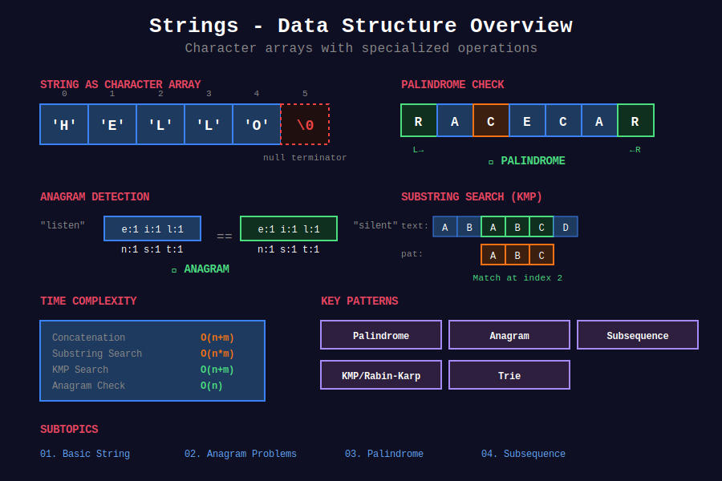

<div align="center">

# 📝 Strings

<p>
  
  
  
</p>

**Immutable sequences of characters - fundamental for text processing**

[⬅️ Previous: Arrays](../01_arrays/README.md) | [🏠 Home](../README.md) | [Next: Linked Lists ➡️](../03_linked_lists/README.md)

</div>

---



## 📐 Mathematical Foundation

### 1️⃣ String Representation

A string $S$ of length $n$ over alphabet $\Sigma$:

$$S = s_0 s_1 s_2 \cdots s_{n-1} \quad \text{where } s_i \in \Sigma$$

**ASCII Encoding:**

$$\text{char\_value} = \text{ord}(c) \in [0, 127]$$

**Memory:**

$$\text{Address}(S[i]) = \text{Base} + i \times \text{sizeof(char)}$$

---

### 2️⃣ Substring Count

**Number of substrings of length $k$ in string of length $n$:**

$$n - k + 1$$

**Total substrings (including empty):**

$$\boxed{\frac{n(n+1)}{2} + 1}$$

**Proof:**

```
Substrings starting at position 0: n choices
Substrings starting at position 1: n-1 choices
...
Substrings starting at position n-1: 1 choice

Total = n + (n-1) + ... + 1 = n(n+1)/2
Plus 1 for empty string = n(n+1)/2 + 1 ∎

```

---

### 3️⃣ Anagram Condition

**Theorem:** Strings $S$ and $T$ are anagrams if and only if:

$$\boxed{\forall c \in \Sigma: \text{count}_S(c) = \text{count}_T(c)}$$

**Equivalent Conditions:**

1. $\text{sorted}(S) = \text{sorted}(T)$

2. $\vec{f}(S) = \vec{f}(T)$ (frequency vectors equal)

3. $|S| = |T|$ and $S$ is a permutation of $T$

**Frequency Vector (for lowercase letters):**

$$\vec{f}(S) = [\text{count}_S('a'), \text{count}_S('b'), \ldots, \text{count}_S('z')] \in \mathbb{Z}^{26}$$

**Proof:**

$$S \sim T \iff \vec{f}(S) = \vec{f}(T) \iff \text{sorted}(S) = \text{sorted}(T) \; \blacksquare$$

---

### 4️⃣ Palindrome Mathematics

**Definition:** String $S[0..n-1]$ is a palindrome if:

$$\boxed{S[i] = S[n-1-i] \quad \forall i \in [0, \lfloor n/2 \rfloor]}$$

**Palindrome Centers Formula:**

$$\text{Total centers} = 2n - 1$$

- Odd length palindromes: $n$ centers at indices $0, 1, \ldots, n-1$

- Even length palindromes: $n-1$ centers between indices

**Expansion Formula:**

For center at position $c$ (using $2n-1$ indexing):

$$\text{left} = \left\lfloor \frac{c}{2} \right\rfloor, \quad \text{right} = \left\lfloor \frac{c}{2} \right\rfloor + (c \bmod 2)$$

**Proof of Center Count:**

```
Odd-length: Center at each character → n centers
Even-length: Center between each pair → n-1 centers
Total: n + (n-1) = 2n - 1 ∎

```

---

### 5️⃣ Edit Distance (Levenshtein)

**Recurrence Relation:**

$$\boxed{dp[i][j] = \begin{cases}
i & \text{if } j = 0 \\
j & \text{if } i = 0 \\
dp[i-1][j-1] & \text{if } S[i-1] = T[j-1] \\
1 + \min \begin{cases}
dp[i-1][j] & \text{(delete)} \\
dp[i][j-1] & \text{(insert)} \\
dp[i-1][j-1] & \text{(replace)}
\end{cases} & \text{otherwise}
\end{cases}}$$

**Operations Cost:**

- Delete from $S$: $dp[i-1][j] + 1$

- Insert into $S$: $dp[i][j-1] + 1$

- Replace in $S$: $dp[i-1][j-1] + 1$

**Optimal Substructure Proof:**

Let $E(i,j)$ = edit distance between $S[0..i-1]$ and $T[0..j-1]$

**Case 1:** If $S[i-1] = T[j-1]$, no operation needed:

$$E(i,j) = E(i-1, j-1)$$

**Case 2:** If $S[i-1] \neq T[j-1]$, try all operations:

- Delete $S[i-1]$: match $S[0..i-2]$ with $T[0..j-1]$ → $E(i-1,j) + 1$

- Insert $T[j-1]$: match $S[0..i-1]$ with $T[0..j-2]$ → $E(i,j-1) + 1$

- Replace $S[i-1]$ with $T[j-1]$: match $S[0..i-2]$ with $T[0..j-2]$ → $E(i-1,j-1) + 1$

Take minimum → optimal ∎

---

### 6️⃣ Longest Common Subsequence (LCS)

**State Definition:**

$$dp[i][j] = \text{LCS length of } S[0..i-1] \text{ and } T[0..j-1]$$

**Recurrence:**

$$\boxed{dp[i][j] = \begin{cases}
dp[i-1][j-1] + 1 & \text{if } S[i-1] = T[j-1] \\
\max(dp[i-1][j], dp[i][j-1]) & \text{otherwise}
\end{cases}}$$

**Base Case:** $dp[0][j] = dp[i][0] = 0$

**Properties:**

$$\text{LCS}(S, \text{reverse}(S)) = \text{Longest Palindromic Subsequence}$$

**Correctness Proof:**

**Optimal Substructure:** 

If $S[i-1] = T[j-1]$, they must appear in LCS (greedy is optimal):

$$\text{LCS}(S[0..i-1], T[0..j-1]) = \text{LCS}(S[0..i-2], T[0..j-2]) + 1$$

If $S[i-1] \neq T[j-1]$, one must be excluded:

$$\text{LCS} = \max(\text{LCS}(S[0..i-2], T[0..j-1]), \text{LCS}(S[0..i-1], T[0..j-2]))$$

By induction on string lengths, DP computes optimal solution ∎

---

### 7️⃣ String Hashing (Polynomial Rolling Hash)

**Hash Function:**

$$\boxed{H(S) = \sum_{i=0}^{n-1} s_i \cdot p^i \mod m}$$

Where:

- $p$ is a prime (typically 31 for lowercase, 53 for mixed case)

- $m$ is a large prime ($10^9 + 7$ or $10^9 + 9$)

**Rolling Update (add character on right):**

$$H(S + c) = (H(S) + c \cdot p^n) \mod m$$

**Rolling Update (remove character from left):**

$$H(S[1..n]) = \frac{H(S[0..n]) - s_0}{p} \mod m$$

**Collision Probability:**

For two different strings:

$$P(\text{collision}) \approx \frac{1}{m}$$

**Example Calculation:**

For string "abc" with $p=31$, $m=10^9+7$:

$$H(\text{"abc"}) = (97 \cdot 31^0 + 98 \cdot 31^1 + 99 \cdot 31^2) \bmod (10^9+7)
= (97 + 3038 + 95139) \bmod (10^9+7) = 98274$$

---

### 8️⃣ KMP Algorithm - Failure Function

**Failure Function:** $\pi[i]$ = length of longest proper prefix of $P[0..i]$ that is also a suffix

**Recurrence:**

$$\pi[i] = \begin{cases}
0 & \text{if } i = 0 \\
\pi[\pi[i-1]] & \text{if } P[i] \neq P[\pi[i-1]] \text{ (backtrack)} \\
\pi[i-1] + 1 & \text{if } P[i] = P[\pi[i-1]]
\end{cases}$$

**Time Complexity Proof:**

Let $k$ = value of $\pi[i]$ at any point.

- Each successful match: $k$ increases by 1
- Each mismatch: $k$ decreases (follows $\pi$ links)

- $k$ can increase at most $n$ times

- $k$ can decrease at most $n$ times (can't go negative)

Total operations: $O(n)$ ∎

**Matching Time:** $O(n + m)$ where $n = |S|$, $m = |P|$

---

## 🚀 Getting Started

### Prerequisites

- Understanding of arrays and hash maps

- Familiarity with two pointers technique

- Basic knowledge of dynamic programming

### Study Strategy

> **Week 1-2:** Basic operations + Anagrams  
> **Week 3-4:** Palindromes + Sliding window  
> **Week 5-6:** DP problems (LCS, Edit distance)

---

## 📂 Subtopics Navigation

| # | Topic | Problems | Link |
|:-:|-------|:--------:|------|
| 1 | Basic String | 10+ | [📖 Go →](./01_basic_string/README.md) |
| 2 | Anagram Problems | 10+ | [📖 Go →](./02_anagram_problems/README.md) |
| 3 | Palindrome | 12+ | [📖 Go →](./03_palindrome/README.md) |
| 4 | Subsequence | 10+ | [📖 Go →](./04_subsequence/README.md) |

---

## ⚡ Complexity Reference

| Operation | Time | Python | Java | Notes |
|-----------|:----:|:------:|:----:|-------|
| Access `s[i]` | O(1) | ✓ | ✓ | Direct indexing |
| Length | O(1) | ✓ | ✓ | Cached |
| Slice `s[i:j]` | O(j-i) | ✓ | - | Creates new string |
| Concatenate | O(n+m) | ✓ | ✓ | New string created |
| Find substring | O(nm) | ✓ | ✓ | Naive; KMP is O(n+m) |
| Compare | O(n) | ✓ | ✓ | Character by character |

### String Building Optimization

| Approach | Time | When to Use |
|----------|:----:|-------------|
| Repeated `+=` | O(n²) | ❌ Never |
| StringBuilder/List | O(n) | ✅ Multiple concatenations |
| `''.join()` | O(n) | ✅ Combining list of strings |

---

## 🎯 Must-Solve Problems (Top 15)

| # | Problem | Category | Difficulty | Why Important |
|:-:|---------|----------|------------|---------------|
| 1 | [Valid Anagram](https://leetcode.com/problems/valid-anagram/) | Frequency | 🟢 Easy | Foundation pattern |
| 2 | [Valid Palindrome](https://leetcode.com/problems/valid-palindrome/) | Two Pointers | 🟢 Easy | Most common |
| 3 | [Longest Substring Without Repeating](https://leetcode.com/problems/longest-substring-without-repeating-characters/) | Sliding Window | 🟡 Medium | Top interview |
| 4 | [Longest Palindromic Substring](https://leetcode.com/problems/longest-palindromic-substring/) | Expand Center | 🟡 Medium | Classic |
| 5 | [Group Anagrams](https://leetcode.com/problems/group-anagrams/) | Hash + Sort | 🟡 Medium | Real-world |
| 6 | [Find All Anagrams](https://leetcode.com/problems/find-all-anagrams-in-a-string/) | Sliding Window | 🟡 Medium | Window pattern |
| 7 | [Palindromic Substrings](https://leetcode.com/problems/palindromic-substrings/) | Expand Center | 🟡 Medium | Counting |
| 8 | [Longest Common Subsequence](https://leetcode.com/problems/longest-common-subsequence/) | DP | 🟡 Medium | DP foundation |
| 9 | [Reverse Words](https://leetcode.com/problems/reverse-words-in-a-string/) | Two Pointers | 🟡 Medium | Parsing |
| 10 | [Palindrome Partitioning](https://leetcode.com/problems/palindrome-partitioning/) | Backtracking | 🟡 Medium | Combination |
| 11 | [Minimum Window Substring](https://leetcode.com/problems/minimum-window-substring/) | Sliding Window | 🔴 Hard | Hardest window |
| 12 | [Edit Distance](https://leetcode.com/problems/edit-distance/) | DP | 🔴 Hard | Classic DP |
| 13 | [Regular Expression Matching](https://leetcode.com/problems/regular-expression-matching/) | DP | 🔴 Hard | Pattern matching |
| 14 | [Distinct Subsequences](https://leetcode.com/problems/distinct-subsequences/) | DP | 🔴 Hard | Counting DP |
| 15 | [Longest Valid Parentheses](https://leetcode.com/problems/longest-valid-parentheses/) | Stack/DP | 🔴 Hard | Multiple approaches |

---

## 🏆 LeetCode Problems (Complete List)

### 🟢 Easy

| # | Problem | Technique | Time | Space |
|:-:|---------|-----------|:----:|:-----:|
| 14 | [Longest Common Prefix](https://leetcode.com/problems/longest-common-prefix/) | Vertical Scan | O(mn) | O(1) |
| 28 | [Find Index of First Occurrence](https://leetcode.com/problems/find-the-index-of-the-first-occurrence-in-a-string/) | KMP | O(n+m) | O(m) |
| 125 | [Valid Palindrome](https://leetcode.com/problems/valid-palindrome/) | Two Pointers | O(n) | O(1) |
| 242 | [Valid Anagram](https://leetcode.com/problems/valid-anagram/) | Counter | O(n) | O(1) |
| 344 | [Reverse String](https://leetcode.com/problems/reverse-string/) | Two Pointers | O(n) | O(1) |
| 387 | [First Unique Character](https://leetcode.com/problems/first-unique-character-in-a-string/) | Counter | O(n) | O(1) |
| 392 | [Is Subsequence](https://leetcode.com/problems/is-subsequence/) | Two Pointers | O(n) | O(1) |

### 🟡 Medium

| # | Problem | Technique | Time | Space |
|:-:|---------|-----------|:----:|:-----:|
| 3 | [Longest Substring Without Repeating](https://leetcode.com/problems/longest-substring-without-repeating-characters/) | Sliding Window | O(n) | O(k) |
| 5 | [Longest Palindromic Substring](https://leetcode.com/problems/longest-palindromic-substring/) | Expand Center | O(n²) | O(1) |
| 22 | [Generate Parentheses](https://leetcode.com/problems/generate-parentheses/) | Backtracking | O(4ⁿ/√n) | O(n) |
| 49 | [Group Anagrams](https://leetcode.com/problems/group-anagrams/) | Hash + Sort | O(nk log k) | O(nk) |
| 131 | [Palindrome Partitioning](https://leetcode.com/problems/palindrome-partitioning/) | Backtracking | O(n⋅2ⁿ) | O(n) |
| 151 | [Reverse Words in a String](https://leetcode.com/problems/reverse-words-in-a-string/) | Two Pointers | O(n) | O(n) |
| 438 | [Find All Anagrams](https://leetcode.com/problems/find-all-anagrams-in-a-string/) | Sliding Window | O(n) | O(1) |
| 647 | [Palindromic Substrings](https://leetcode.com/problems/palindromic-substrings/) | Expand Center | O(n²) | O(1) |
| 1143 | [Longest Common Subsequence](https://leetcode.com/problems/longest-common-subsequence/) | DP | O(mn) | O(mn) |

### 🔴 Hard

| # | Problem | Technique | Time | Space |
|:-:|---------|-----------|:----:|:-----:|
| 10 | [Regular Expression Matching](https://leetcode.com/problems/regular-expression-matching/) | DP | O(mn) | O(mn) |
| 32 | [Longest Valid Parentheses](https://leetcode.com/problems/longest-valid-parentheses/) | Stack/DP | O(n) | O(n) |
| 72 | [Edit Distance](https://leetcode.com/problems/edit-distance/) | DP | O(mn) | O(mn) |
| 76 | [Minimum Window Substring](https://leetcode.com/problems/minimum-window-substring/) | Sliding Window | O(n) | O(k) |
| 115 | [Distinct Subsequences](https://leetcode.com/problems/distinct-subsequences/) | DP | O(mn) | O(mn) |

---

## 💡 Key Insights & Pro Tips

> **🎯 String Immutability**  
> Strings are immutable in Python/Java. Use StringBuilder or list for O(n) instead of O(n²) concatenation.

> **⚡ Fixed Alphabet Optimization**  
> For 26 lowercase letters, use `int[26]` instead of HashMap for O(1) space and better constants.

> **🔄 Palindrome Centers**  
> Always remember 2n-1 centers. This is the key to O(n²) palindrome problems.

> **📊 Sliding Window Template**  
> ```
> expand right → add to window
> while (invalid) → contract left
> update answer
> ```

> **🔍 DP on Strings Pattern**  
> `dp[i][j]` usually means "answer for S[0..i-1] and T[0..j-1]". Match chars or skip, take optimal.

---

## 🧮 Quick Pattern Reference

| If Problem Says... | Think... | Examples |
|-------------------|----------|----------|
| "valid palindrome" | Two Pointers | #125, #680 |
| "anagram" or "permutation" | Character Frequency | #242, #49, #567 |
| "longest substring without..." | Sliding Window + Set | #3 |
| "find all anagrams" | Sliding Window + Frequency | #438 |
| "palindromic substrings" | Expand Around Center | #5, #647 |
| "partition" | Backtracking + Palindrome Check | #131 |
| "longest common subsequence" | 2D DP | #1143 |
| "edit distance" | 2D DP | #72 |
| "minimum window" | Sliding Window | #76 |
| "pattern matching" | KMP or DP | #28, #10 |

---

## 🎓 Pattern Recognition Flowchart

```
+-------------------------------------------------------------+
|                    String Problem Given                     |
+---------------------------+---------------------------------+
                            |
                +-----------+-----------+
                |                       |
        Check equality?           Find pattern?
                |                       |
        +-------+-------+       +-------+-------+
       YES             NO       YES             NO
        |               |        |               |
   Same order?     Substring?  Fixed?      Transformation?
        |               |        |               |
   +----+----+    Sliding    KMP/Z         2D DP
  YES       NO     Window   Rolling       (LCS/Edit)
   |         |       |      Hash            |
Two Ptr  Anagram   O(n)    O(n+m)         O(mn)
Palindrome  Hash

```

---

## 📚 References & Learning Resources

### 📖 Books & Courses

| Resource | Description | Link |
|----------|-------------|------|
| **CLRS Chapter 32** | String matching algorithms | [MIT Press](https://mitpress.mit.edu/books/introduction-algorithms) |
| **Algorithms on Strings** | Comprehensive textbook | [Cambridge](https://www.cambridge.org/core/books/algorithms-on-strings-trees-and-sequences/F0B095049C7E6EF5356F0A26686C20D3) |
| **Competitive Programming 3** | Chapter 6: String processing | [Book](https://cpbook.net/) |
| **Algorithms 4th Edition** | Sedgewick & Wayne | [Book Site](https://algs4.cs.princeton.edu/) |

### 🌐 Online Tutorials

| Resource | Description | Link |
|----------|-------------|------|
| **CP-Algorithms** | String algorithms encyclopedia | [Strings](https://cp-algorithms.com/string/) |
| **GeeksforGeeks** | String tutorials & problems | [Strings](https://www.geeksforgeeks.org/string-data-structure/) |
| **LeetCode Explore** | String learning path | [Card](https://leetcode.com/explore/learn/card/array-and-string/) |
| **HackerEarth** | String algorithms tutorial | [Tutorial](https://www.hackerearth.com/practice/algorithms/string-algorithm/basics-of-string-manipulation/tutorial/) |

### 📺 Video Resources

| Resource | Topic | Link |
|----------|-------|------|
| **NeetCode** | String patterns playlist | [YouTube](https://www.youtube.com/playlist?list=PLot-Xpze53ldVwtstag2TL4HQhAnC8ATf) |
| **Abdul Bari** | KMP algorithm explained | [YouTube](https://www.youtube.com/watch?v=V5-7GzOfADQ) |
| **Back To Back SWE** | String problems series | [YouTube](https://www.youtube.com/playlist?list=PLiQ766zSC5jMZgZ0pvJ7vBB3xH0cdJmP) |
| **William Fiset** | String algorithms | [YouTube](https://www.youtube.com/watch?v=GTJr8OvyEVQ) |
| **MIT OCW 6.006** | String matching lecture | [MIT](https://ocw.mit.edu/courses/6-006-introduction-to-algorithms-fall-2011/) |
| **Tushar Roy** | DP on strings | [YouTube](https://www.youtube.com/watch?v=NnD96abizww) |

### 📝 Practice Platforms

| Platform | Focus | Link |
|----------|-------|------|
| **LeetCode** | Interview problems | [String Tag](https://leetcode.com/tag/string/) |
| **HackerRank** | String manipulation | [Practice](https://www.hackerrank.com/domains/algorithms?filters%5Bsubdomains%5D%5B%5D=strings) |
| **Codeforces** | Competitive programming | [String Problems](https://codeforces.com/problemset?tags=strings) |
| **CodeChef** | Monthly contests | [Strings](https://www.codechef.com/tags/problems/string) |
| **AtCoder** | Japanese contests | [Problems](https://atcoder.jp/) |

### 🔬 Advanced Topics

| Topic | Description | Link |
|-------|-------------|------|
| **KMP Algorithm** | O(n+m) pattern matching | [Wikipedia](https://en.wikipedia.org/wiki/Knuth%E2%80%93Morris%E2%80%93Pratt_algorithm) |
| **Rabin-Karp** | Rolling hash technique | [GeeksforGeeks](https://www.geeksforgeeks.org/rabin-karp-algorithm-for-pattern-searching/) |
| **Manacher's Algorithm** | O(n) longest palindrome | [CP-Algorithms](https://cp-algorithms.com/string/manacher.html) |
| **Aho-Corasick** | Multiple pattern matching | [Wikipedia](https://en.wikipedia.org/wiki/Aho%E2%80%93Corasick_algorithm) |
| **Suffix Array** | Advanced string structure | [CP-Algorithms](https://cp-algorithms.com/string/suffix-array.html) |
| **Suffix Tree** | Generalized suffix structure | [GeeksforGeeks](https://www.geeksforgeeks.org/pattern-searching-using-suffix-tree/) |
| **Z-Algorithm** | String matching in O(n) | [CP-Algorithms](https://cp-algorithms.com/string/z-function.html) |
| **Boyer-Moore** | Fast pattern matching | [Wikipedia](https://en.wikipedia.org/wiki/Boyer%E2%80%93Moore_string-search_algorithm) |

### 🎯 Problem Collections

| Collection | Focus | Link |
|-----------|-------|------|
| **NeetCode 150** | Curated interview problems | [Strings](https://neetcode.io/practice) |
| **Blind 75** | Essential coding problems | [List](https://www.teamblind.com/post/New-Year-Gift---Curated-List-of-Top-75-LeetCode-Questions-to-Save-Your-Time-OaM1orEU) |
| **Grind 75** | Week-by-week preparation | [Guide](https://www.techinterviewhandbook.org/grind75) |
| **Striver's SDE Sheet** | Must-do problems | [Sheet](https://takeuforward.org/interviews/strivers-sde-sheet-top-coding-interview-problems/) |
| **LeetCode Patterns** | 14 patterns guide | [Sean Prashad](https://seanprashad.com/leetcode-patterns/) |

### 📊 Visualization Tools

| Tool | Purpose | Link |
|------|---------|------|
| **Regex101** | Regular expressions tester | [Website](https://regex101.com/) |
| **VisuAlgo** | String algorithms visualization | [Suffix Array](https://visualgo.net/en/suffixarray) |
| **Algorithm Visualizer** | Step-by-step execution | [Website](https://algorithm-visualizer.org/) |
| **String Matching Viz** | Pattern matching demo | [Tool](http://whocouldthat.be/visualizing-string-matching/) |

### 🏆 Competition Resources

| Resource | Topic | Link |
|----------|-------|------|
| **USACO Guide** | String algorithms guide | [Guide](https://usaco.guide/) |
| **TopCoder** | Tutorials & editorials | [Articles](https://www.topcoder.com/thrive/articles/) |
| **Codeforces EDU** | Educational courses | [Course](https://codeforces.com/edu/course/2) |
| **CSES Problem Set** | Finnish platform | [Strings](https://cses.fi/problemset/list/) |

### 📚 Research Papers

| Paper | Topic | Link |
|-------|-------|------|
| **Knuth-Morris-Pratt (1977)** | Original KMP paper | [Paper](https://epubs.siam.org/doi/10.1137/0206024) |
| **Manacher (1975)** | Linear time palindromes | [Paper](https://www.semanticscholar.org/paper/A-New-Linear-Time-%E2%80%9Con-Line%E2%80%9D-Algorithm-for-the-Manacher/40f3b1f2a47aa8eeaa3fc0a381d6ee1d0e57ee68) |
| **Levenshtein (1966)** | Edit distance | [Paper](https://nymity.ch/sybilhunting/pdf/Levenshtein1966a.pdf) |

---

## 🎖️ Interview Success Tips

### Common Mistakes to Avoid

❌ **Don't:**

- Concatenate strings in loops without StringBuilder

- Forget about empty string edge case

- Ignore case sensitivity requirements

- Use nested loops when sliding window works

- Forget to handle Unicode characters

✅ **Do:**

- Use StringBuilder/list for multiple concatenations

- Test with edge cases: empty, single char, all same

- Clarify case sensitivity and special characters

- Recognize sliding window patterns early

- Consider both ASCII and Unicode

### Optimization Checklist

```
[ ] Can I use character array instead of HashMap?
[ ] Is sliding window applicable?
[ ] Should I use expand-around-center for palindromes?
[ ] Is this a DP problem? (LCS, edit distance patterns)
[ ] Can rolling hash optimize substring search?
[ ] Am I avoiding O(n²) string concatenation?

```

---

## 🌟 Motivational Corner

> "Strings are everywhere - from DNA sequences to search engines. Master them, and you master text processing."

**Progress Tracker:**

- 🥉 **Bronze:** Solve 20 string problems

- 🥈 **Silver:** Solve 50 string problems  

- 🥇 **Gold:** Solve 100 string problems

- 💎 **Platinum:** Can explain KMP and solve hard DP problems

**Remember:** Every string algorithm you learn makes you a better programmer! 💪

---

<div align="center">

### 🌟 If this helped you, give it a ⭐ on GitHub! 🌟

**Made with ❤️ for the coding community by [Gaurav Goswami](https://github.com/Gaurav14cs17)**

[⬅️ Previous: Arrays](../01_arrays/README.md) | [🏠 Home](../README.md) | [Next: Linked Lists ➡️](../03_linked_lists/README.md)

---

*Last Updated: December 2025*  
*Licensed under MIT*  
*Happy Coding! 💻✨*

</div>

