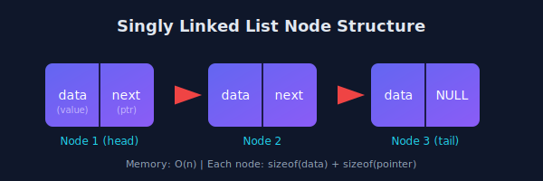
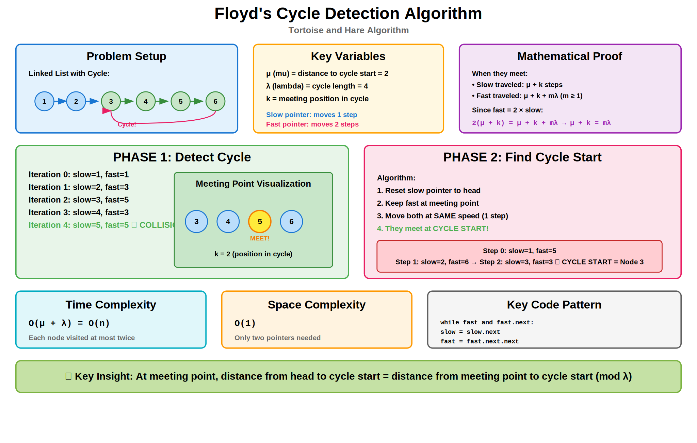
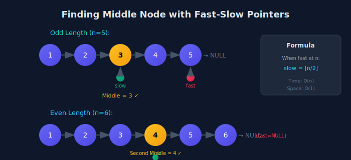
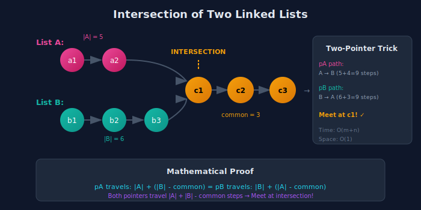

<div align="center">

# 🔧 Basic Linked List Operations

<p>
  
  
</p>

</div>

---

## 🧭 Navigation

| ⬅️ Previous | 📂 Current | ➡️ Next |
|:------------|:----------:|--------:|
| [🏠 Linked Lists Home](../README.md) | **01. Basic Operations** | [02. Reversal →](../02_reversal/README.md) |

---

## 🎨 Visual Diagrams

<div align="center">

### Linked List Node Structure


### Linked List Node (Alternate)


### Floyd's Cycle Detection


### Fast-Slow Pointer (Find Middle)


### Intersection of Two Lists


</div>

---

## 📐 Mathematical Foundations

### 1️⃣ Node Structure & Memory Layout

**Single Node:**

```
+----------+----------+

|   data   |   next   |------► next node

|  (4-8B)  |  (4-8B)  |
+----------+----------+

```

**Memory overhead per node:**

$$\text{Space} = \text{sizeof(data)} + \text{sizeof(pointer)}$$

For 32-bit integer + 64-bit pointer:

$$\text{Space} = 4 + 8 = 12 \text{ bytes per node}$$

**Total space for n nodes:**

$$\boxed{S(n) = n \times (\text{data\_size} + \text{pointer\_size})}$$

---

### 2️⃣ Length Calculation Time Complexity

**Iterative counting:**

$$\text{length} = \sum_{i=0}^{n-1} 1 = n$$

**Time Complexity:** $O(n)$ - must traverse entire list

**Space Complexity:** $O(1)$ - only counter variable

**Alternative:** Maintain length counter → $O(1)$ lookup, $O(1)$ extra space

---

### 3️⃣ Fast-Slow Pointer Mathematics

**Theorem:** When fast reaches end, slow is at middle.

$$\boxed{\text{slow\_position} = \left\lfloor \frac{n}{2} \right\rfloor}$$

**Proof:**

Let $n$ = length of list, $k$ = number of iterations.

After $k$ iterations:

- Slow pointer position: $k$

- Fast pointer position: $2k$

Fast reaches end when:

$$2k = n \implies k = \frac{n}{2}$$

Therefore, slow at position $\left\lfloor \frac{n}{2} \right\rfloor$ ∎

**Cases:**

- Odd length ($n = 5$): slow at position $2$ (exact middle)

- Even length ($n = 6$): slow at position $3$ (second middle)

---

### 4️⃣ Floyd's Cycle Detection - Complete Mathematics

**Phase 1: Detect Cycle**

Let:

- $\mu$ = distance from head to cycle start

- $\lambda$ = cycle length  

- $k$ = position in cycle where pointers meet

When they meet:

- Slow traveled: $\mu + k$ steps

- Fast traveled: $\mu + k + m\lambda$ steps (for some $m \geq 1$)

Since fast = 2 × slow:

$$\mu + k + m\lambda = 2(\mu + k)
\mu + k + m\lambda = 2\mu + 2k
\boxed{m\lambda = \mu + k}$$

**Phase 2: Find Cycle Start**

From meeting point to cycle start: $\lambda - k$ steps

From head to cycle start: $\mu$ steps

From previous equation: $\mu = m\lambda - k$

$$\mu = (m-1)\lambda + (\lambda - k)$$

This means:

- $\mu$ steps from head reaches cycle start

- $\lambda - k$ steps from meeting point also reaches cycle start (after $m-1$ complete cycles)

**Therefore:** Reset one pointer to head, move both at same speed → meet at cycle start ∎

---

### 5️⃣ Intersection Point Mathematics

**Two-pointer technique proof:**

Given two lists A and B with lengths $L_A$ and $L_B$, intersecting at distance $d$ from their ends.

**Path of pointer A:**

$$L_A + (L_B - d)$$

**Path of pointer B:**

$$L_B + (L_A - d)$$

Both equal:

$$L_A + L_B - d = L_B + L_A - d$$

They meet at intersection point after traveling equal distance! ∎

**Visual proof:**

```
A: a1 → a2 → c1 → c2 → null
B: b1 → b2 → b3 → c1 → c2 → null

Pointer A path: a1 → a2 → c1 → c2 → null → b1 → b2 → b3 → c1 ✓
Pointer B path: b1 → b2 → b3 → c1 → c2 → null → a1 → a2 → c1 ✓

Both reach c1 (intersection) after same total distance!

```

---

## 🎨 Visual Algorithm Walkthroughs

### Floyd's Cycle Detection - Detailed Trace

```
+--------------------------------------------------------------------+
|  Example Linked List with Cycle                                    |
|                                                                    |
|  1 → 2 → 3 → 4 → 5 → 6 ↴                                          |
|           ↑____________↓                                           |
|                                                                    |
|  μ (distance to cycle) = 2 (nodes 1, 2)                           |
|  λ (cycle length) = 4 (nodes 3, 4, 5, 6)                          |
+--------------------------------------------------------------------+

|  PHASE 1: Detect Cycle                                             |
|  ---------------------------------------------------------------   |
|                                                                    |
|  Iteration 0:                                                      |
|    slow = 1, fast = 1                                              |
|    ● ●                                                             |
|    1 → 2 → 3 → 4 → 5 → 6 ↴                                         |
|         ↑____________↓                                             |
|                                                                    |
|  Iteration 1:                                                      |
|    slow = 2, fast = 3                                              |
|        ●       ●                                                   |
|    1 → 2 → 3 → 4 → 5 → 6 ↴                                         |
|         ↑____________↓                                             |
|                                                                    |
|  Iteration 2:                                                      |
|    slow = 3, fast = 5                                              |
|            ●           ●                                           |
|    1 → 2 → 3 → 4 → 5 → 6 ↴                                         |
|         ↑____________↓                                             |
|                                                                    |
|  Iteration 3:                                                      |
|    slow = 4, fast = 3                                              |
|                ●   ●                                               |
|    1 → 2 → 3 → 4 → 5 → 6 ↴                                         |
|         ↑____________↓                                             |
|                                                                    |
|  Iteration 4:                                                      |
|    slow = 5, fast = 5  ← COLLISION! Cycle detected ✓              |
|                    ◉◉                                              |
|    1 → 2 → 3 → 4 → 5 → 6 ↴                                         |
|         ↑____________↓                                             |
|                                                                    |
|  Meeting at k = 2 (position in cycle)                             |
|  Verification: μ + k = 2 + 2 = 4 = 1×λ ✓                           |
+--------------------------------------------------------------------+

|  PHASE 2: Find Cycle Start                                         |
|  ---------------------------------------------------------------   |
|                                                                    |
|  Reset slow to head, keep fast at meeting point                   |
|                                                                    |
|  Step 0:                                                           |
|    slow = 1, fast = 5                                              |
|    ●                   ◉                                           |
|    1 → 2 → 3 → 4 → 5 → 6 ↴                                         |
|         ↑____________↓                                             |
|                                                                    |
|  Step 1:                                                           |
|    slow = 2, fast = 6                                              |
|        ●                   ◉                                       |
|    1 → 2 → 3 → 4 → 5 → 6 ↴                                         |
|         ↑____________↓                                             |
|                                                                    |
|  Step 2:                                                           |
|    slow = 3, fast = 3  ← MEET at cycle start! ✓                   |
|            ◉◉                                                      |
|    1 → 2 → 3 → 4 → 5 → 6 ↴                                         |
|         ↑____________↓                                             |
|                                                                    |
|  Answer: Cycle starts at node 3                                   |
+--------------------------------------------------------------------+

```

---

### Middle Node - Fast-Slow Pattern

```
Example 1: Odd Length (n=5)
---------------------------------------
1 → 2 → 3 → 4 → 5 → null

Iteration 0:
● ●
1 → 2 → 3 → 4 → 5 → null
slow=1, fast=1

Iteration 1:
    ●       ●
1 → 2 → 3 → 4 → 5 → null
slow=2, fast=3

Iteration 2:
        ●           ●
1 → 2 → 3 → 4 → 5 → null
slow=3, fast=5

Iteration 3:
        ●               
1 → 2 → 3 → 4 → 5 → null
slow=3, fast=null (stop)

Answer: 3 (exact middle) ✓

---------------------------------------

Example 2: Even Length (n=6)
---------------------------------------
1 → 2 → 3 → 4 → 5 → 6 → null

Iteration 0:
● ●
1 → 2 → 3 → 4 → 5 → 6 → null
slow=1, fast=1

Iteration 1:
    ●       ●
1 → 2 → 3 → 4 → 5 → 6 → null
slow=2, fast=3

Iteration 2:
        ●           ●
1 → 2 → 3 → 4 → 5 → 6 → null
slow=3, fast=5

Iteration 3:
            ●               
1 → 2 → 3 → 4 → 5 → 6 → null
slow=4, fast=null (stop)

Answer: 4 (second middle) ✓

```

---

### Intersection of Two Lists - Visual Proof

```
+--------------------------------------------------------------------+
|  List A: 1 → 2 ↘                                                   |
|                  → 6 → 7 → 8 → null                                |
|  List B: 3 → 4 → 5 ↗                                               |
|                                                                    |
|  Length A = 5 (2 unique + 3 common)                                |
|  Length B = 6 (3 unique + 3 common)                                |
+--------------------------------------------------------------------+

|  Pointer A Journey:                                                |
|  +--------------------------------------------------------------+  |
|  | 1 → 2 → 6 → 7 → 8 → null → 3 → 4 → 5 → 6 ✓                  |  |
|  | |__________________________|   |_____________|                |  |
|  |        List A (5)                 List B prefix (4)          |  |
|  +--------------------------------------------------------------+  |
|                                                                    |
|  Pointer B Journey:                                                |
|  +--------------------------------------------------------------+  |
|  | 3 → 4 → 5 → 6 → 7 → 8 → null → 1 → 2 → 6 ✓                  |  |
|  | |_________________________|   |____________|                  |  |
|  |         List B (6)                List A prefix (3)          |  |
|  +--------------------------------------------------------------+  |
|                                                                    |
|  Both pointers travel: 5 + 6 = 11 steps total                     |
|  Both reach node 6 at step 9 → Intersection! ✓                    |
|                                                                    |
|  Key Insight: Length difference cancels out!                      |
|  pA travels A + (B's unique part)                                 |
|  pB travels B + (A's unique part)                                 |
|  Total distance equal → meet at intersection                      |
+--------------------------------------------------------------------+

```

---

### Nth Node from End - Gap Technique

```
Problem: Find 3rd node from end
List: 1 → 2 → 3 → 4 → 5 → 6 → 7 → null

+--------------------------------------------------------------------+

|  Step 1: Create gap of n nodes                                     |
|  ---------------------------------------------------------------   |
|                                                                    |
|  Move first pointer n=3 steps:                                     |
|                                                                    |
|  Initial:                                                          |
|  ● ●                                                               |
|  1 → 2 → 3 → 4 → 5 → 6 → 7 → null                                 |
|  f   s                                                             |
|                                                                    |
|  After 1 step:                                                     |
|  ● - - ●                                                           |
|  1 → 2 → 3 → 4 → 5 → 6 → 7 → null                                 |
|  s       f                                                         |
|                                                                    |
|  After 2 steps:                                                    |
|  ● - - - - ●                                                       |
|  1 → 2 → 3 → 4 → 5 → 6 → 7 → null                                 |
|  s           f                                                     |
|                                                                    |
|  After 3 steps:                                                    |
|  ● - - - - - - ●                                                   |
|  1 → 2 → 3 → 4 → 5 → 6 → 7 → null                                 |
|  s               f                                                 |
|                                                                    |
|  Gap created: 3 nodes between s and f                             |
+--------------------------------------------------------------------+

|  Step 2: Move both until first reaches end                        |
|  ---------------------------------------------------------------   |
|                                                                    |
|      ● - - - - - - ●                                               |
|  1 → 2 → 3 → 4 → 5 → 6 → 7 → null                                 |
|      s                   f                                         |
|                                                                    |
|          ● - - - - - - ●                                           |
|  1 → 2 → 3 → 4 → 5 → 6 → 7 → null                                 |
|          s                   f                                     |
|                                                                    |
|              ● - - - - - - ●                                       |
|  1 → 2 → 3 → 4 → 5 → 6 → 7 → null                                 |
|              s                   f                                 |
|                                                                    |
|  When first reaches null, second is at target!                    |
|  Answer: Node 5 (3rd from end) ✓                                  |
|                                                                    |
|  Mathematical proof:                                               |
|  Total length = 7                                                 |
|  Position from start = 7 - 3 = 4 (0-indexed)                      |
|  Node at position 4 = 5 ✓                                         |
+--------------------------------------------------------------------+

```

---

## 💻 Code Implementations

```python
class ListNode:
    """Definition for singly-linked list node."""
    def __init__(self, val=0, next=None):
        self.val = val
        self.next = next

def hasCycle(head: ListNode) -> bool:
    """
    Floyd's Cycle Detection - Phase 1 only.
    
    Algorithm:
    - Slow moves 1 step per iteration
    - Fast moves 2 steps per iteration
    - If cycle exists, they will meet
    - If no cycle, fast reaches null
    
    Time: O(n), Space: O(1)
    """
    slow = fast = head
    
    while fast and fast.next:
        slow = slow.next        # Move 1 step
        fast = fast.next.next   # Move 2 steps
        
        if slow == fast:
            return True  # Cycle detected
    
    return False  # fast reached end, no cycle

def detectCycle(head: ListNode) -> ListNode:
    """
    Find the node where cycle begins.
    
    Floyd's Cycle Detection - Complete:
    1. Detect cycle (fast-slow collision)
    2. Reset one pointer to head
    3. Move both at same speed until they meet
    
    Mathematical basis: μ + k = mλ
    Therefore: μ = mλ - k
    
    Time: O(n), Space: O(1)
    """
    # Phase 1: Detect cycle
    slow = fast = head
    while fast and fast.next:
        slow = slow.next
        fast = fast.next.next
        if slow == fast:
            break
    else:
        return None  # No cycle
    
    # Phase 2: Find cycle start
    slow = head
    while slow != fast:
        slow = slow.next
        fast = fast.next
    
    return slow  # Cycle start node

def getIntersectionNode(headA: ListNode, headB: ListNode) -> ListNode:
    """
    Find intersection of two linked lists.
    
    Two-pointer technique:
    - Pointer A: traverse A, then B
    - Pointer B: traverse B, then A
    - Both travel same total distance
    - Meet at intersection (or both reach null)
    
    Mathematical proof:
    |A| + |B| - d = |B| + |A| - d
    where d = distance from intersection to end
    
    Time: O(m + n), Space: O(1)
    """
    if not headA or not headB:
        return None
    
    pA, pB = headA, headB
    
    while pA != pB:
        # When pointer reaches end, switch to other list
        pA = pA.next if pA else headB
        pB = pB.next if pB else headA
    
    return pA  # Intersection or None

def middleNode(head: ListNode) -> ListNode:
    """
    Find middle node using fast-slow pointers.
    
    For even length: returns second middle
    For odd length: returns exact middle
    
    Proof: When fast reaches end (position 2k = n):
           slow is at position k = n/2
    
    Time: O(n), Space: O(1)
    """
    slow = fast = head
    
    while fast and fast.next:
        slow = slow.next
        fast = fast.next.next
    
    return slow

def removeNthFromEnd(head: ListNode, n: int) -> ListNode:
    """
    Remove nth node from end of list.
    
    Two-pointer technique with gap:
    1. Create gap of n nodes
    2. Move both until first reaches end
    3. Second pointer is at (n+1)th from end
    4. Delete nth node
    
    Dummy node simplifies edge cases (removing head)
    
    Time: O(L), Space: O(1) where L = length
    """
    dummy = ListNode(0, head)
    first = second = dummy
    
    # Create gap of n+1 nodes
    for _ in range(n + 1):
        first = first.next
    
    # Move both until first reaches end
    while first:
        first = first.next
        second = second.next
    
    # second.next is the node to delete
    second.next = second.next.next
    
    return dummy.next

def deleteNode(node: ListNode) -> None:
    """
    Delete node when only node is given (not head).
    
    Trick: Copy next node's value, then delete next node
    
    Limitation: Cannot delete last node this way
    
    Time: O(1), Space: O(1)
    """
    # Copy next node's value
    node.val = node.next.val
    # Delete next node
    node.next = node.next.next

def removeElements(head: ListNode, val: int) -> ListNode:
    """
    Remove all nodes with given value.
    
    Dummy node pattern:
    - Simplifies head deletion
    - Uniform handling of all nodes
    - Return dummy.next (new head)
    
    Time: O(n), Space: O(1)
    """
    dummy = ListNode(0, head)
    current = dummy
    
    while current.next:
        if current.next.val == val:
            current.next = current.next.next  # Skip node
        else:
            current = current.next  # Move forward
    
    return dummy.next

def isPalindrome(head: ListNode) -> bool:
    """
    Check if linked list is palindrome.
    
    Algorithm:
    1. Find middle using fast-slow
    2. Reverse second half
    3. Compare first and second halves
    4. (Optional) Restore original list
    
    Combines multiple techniques!
    
    Time: O(n), Space: O(1)
    """
    if not head or not head.next:
        return True
    
    # Find middle
    slow = fast = head
    while fast.next and fast.next.next:
        slow = slow.next
        fast = fast.next.next
    
    # Reverse second half
    second = reverse(slow.next)
    slow.next = None  # Break connection
    
    # Compare
    first = head
    while second:
        if first.val != second.val:
            return False
        first = first.next
        second = second.next
    
    return True

def reverse(head: ListNode) -> ListNode:
    """Helper: Reverse linked list."""
    prev = None
    while head:
        next_node = head.next
        head.next = prev
        prev = head
        head = next_node
    return prev

def getLength(head: ListNode) -> int:
    """
    Get length of linked list.
    
    Time: O(n), Space: O(1)
    """
    length = 0
    while head:
        length += 1
        head = head.next
    return length

```

---

## 🏆 LeetCode Problems

### 🟢 Easy

| # | Problem | Technique | Time | Space |
|:-:|---------|-----------|:----:|:-----:|
| 21 | [Merge Two Sorted Lists](https://leetcode.com/problems/merge-two-sorted-lists/) | Dummy Node | O(n+m) | O(1) |
| 83 | [Remove Duplicates from Sorted List](https://leetcode.com/problems/remove-duplicates-from-sorted-list/) | Linear Scan | O(n) | O(1) |
| 141 | [Linked List Cycle](https://leetcode.com/problems/linked-list-cycle/) | Floyd's Phase 1 | O(n) | O(1) |
| 160 | [Intersection of Two Lists](https://leetcode.com/problems/intersection-of-two-linked-lists/) | Two Pointers | O(n+m) | O(1) |
| 203 | [Remove Linked List Elements](https://leetcode.com/problems/remove-linked-list-elements/) | Dummy Node | O(n) | O(1) |
| 206 | [Reverse Linked List](https://leetcode.com/problems/reverse-linked-list/) | Iterative | O(n) | O(1) |
| 234 | [Palindrome Linked List](https://leetcode.com/problems/palindrome-linked-list/) | Fast-Slow + Reverse | O(n) | O(1) |
| 237 | [Delete Node in Linked List](https://leetcode.com/problems/delete-node-in-a-linked-list/) | Value Copy | O(1) | O(1) |
| 876 | [Middle of Linked List](https://leetcode.com/problems/middle-of-the-linked-list/) | Fast-Slow | O(n) | O(1) |

### 🟡 Medium

| # | Problem | Technique | Time | Space |
|:-:|---------|-----------|:----:|:-----:|
| 19 | [Remove Nth From End](https://leetcode.com/problems/remove-nth-node-from-end-of-list/) | Two Pointers Gap | O(n) | O(1) |
| 142 | [Linked List Cycle II](https://leetcode.com/problems/linked-list-cycle-ii/) | Floyd's Complete | O(n) | O(1) |
| 328 | [Odd Even Linked List](https://leetcode.com/problems/odd-even-linked-list/) | Two Lists | O(n) | O(1) |

---

## 💡 Key Insights & Pro Tips

> **🎯 Floyd's Core Insight**  
> At meeting point: distance from head to cycle start = distance from meeting point to cycle start (modulo cycle length).

> **⚡ Fast-Slow Standard Pattern**  
> `while fast and fast.next:` - Always check both conditions to avoid null pointer errors.

> **🔄 Dummy Node Magic**  
> Use dummy node for: deletions, merging, insertions. Simplifies edge cases. Always return `dummy.next`.

> **📊 Two Pointers with Gap**  
> For "kth from end": advance first k+1 steps, then move both. When first is null, second is at target.

> **🔍 Intersection Length Trick**  
> Make both pointers traverse both lists. Length difference cancels out, they meet at intersection!

> **💰 Space Optimization**  
> Most linked list problems can be solved in O(1) space. Avoid recursion unless specifically required.

---

## 🎓 Pattern Recognition Guide

### Identifying the Right Technique

| Problem Contains... | Pattern | Technique | Example |
|---------------------|---------|-----------|---------|
| "cycle" or "loop" | Cycle detection | Floyd's algorithm | #141, #142 |
| "middle of list" | Find middle | Fast-slow pointers | #876, #234 |
| "nth from end" | Position from end | Two pointers with gap | #19 |
| "intersection" | Common node | Length difference trick | #160 |
| "palindrome" | Symmetry check | Find middle + reverse | #234 |
| "delete all X" | Remove nodes | Dummy node | #203 |
| "delete nth" | Remove specific | Two pointers | #19 |

---

## 🧮 Complexity Analysis

### Operation Comparison

| Operation | Array | Linked List | Winner |
|-----------|:-----:|:-----------:|:------:|
| **Access i-th** | O(1) | O(n) | Array |
| **Search** | O(n) or O(log n) | O(n) | Array (if sorted) |
| **Insert at head** | O(n) | **O(1)** | Linked List |
| **Insert at tail** | O(1)* | O(n) or O(1)** | Tie |
| **Delete at head** | O(n) | **O(1)** | Linked List |
| **Delete at middle** | O(n) | O(n)*** | Tie |
| **Memory overhead** | 0 | **8 bytes/node** | Array |

*Amortized for dynamic array  
**If tail pointer maintained  
***O(1) if node reference given

---

## 📚 References & Learning Resources

### 📖 Core Concepts

| Resource | Description | Link |
|----------|-------------|------|
| **Floyd's Algorithm** | Complete mathematical proof | [Wikipedia](https://en.wikipedia.org/wiki/Cycle_detection) |
| **Two Pointers Pattern** | Comprehensive guide | [LeetCode](https://leetcode.com/explore/learn/card/linked-list/214/two-pointer-technique/) |
| **Linked List Basics** | All operations explained | [GeeksforGeeks](https://www.geeksforgeeks.org/data-structures/linked-list/) |
| **Dummy Node Pattern** | When and why to use | [LeetCode Discuss](https://leetcode.com/discuss/study-guide/1800120/become-master-in-linked-list) |

### 🎥 Video Tutorials

| Resource | Topic | Link |
|----------|-------|------|
| **NeetCode** | Linked list cycle | [YouTube](https://www.youtube.com/watch?v=gBTe7lFR3vc) |
| **NeetCode** | Intersection of lists | [YouTube](https://www.youtube.com/watch?v=D0X0BONOQhI) |
| **Back To Back SWE** | Floyd's proof explained | [YouTube](https://www.youtube.com/watch?v=zbozWoMgKW0) |
| **Abdul Bari** | Linked list operations | [YouTube](https://www.youtube.com/watch?v=NobHlGUjV3g) |
| **Tushar Roy** | Cycle detection | [YouTube](https://www.youtube.com/watch?v=-YiQZi3mLq0) |

### 📝 Interactive Learning

| Platform | Focus | Link |
|----------|-------|------|
| **VisuAlgo** | Visual linked list operations | [Website](https://visualgo.net/en/list) |
| **Algorithm Visualizer** | Step-by-step execution | [Website](https://algorithm-visualizer.org/) |
| **LeetCode Explore** | Linked list card | [Course](https://leetcode.com/explore/learn/card/linked-list/) |

---

## 🎯 Practice Roadmap

### Foundation (Week 1)

1. **Middle of List** (#876) - Master fast-slow pattern

2. **Linked List Cycle** (#141) - Learn Floyd's Phase 1
3. **Remove Elements** (#203) - Practice dummy node

### Building Skills (Week 2)

4. **Cycle II** (#142) - Complete Floyd's algorithm

5. **Intersection** (#160) - Length difference trick

6. **Remove Nth From End** (#19) - Gap technique

### Advanced (Week 3)

7. **Palindrome** (#234) - Combine multiple patterns

8. **Delete Node** (#237) - Edge case thinking

9. **Odd Even List** (#328) - Two-list pattern

### Mastery Challenge

- Solve each problem in < 15 minutes

- Explain the mathematical proof

- Code without syntax errors

- Handle all edge cases

---

## 💭 Common Interview Questions

**Q: How do you detect a cycle without extra space?**  
A: Floyd's algorithm - fast and slow pointers. Fast moves 2x speed. If cycle exists, they meet. O(n) time, O(1) space.

**Q: Why does Floyd's cycle finding work?**  
A: At meeting point, μ + k = mλ. This means distance from head to cycle start equals distance from meeting point to start (modulo cycle length).

**Q: How to find middle of linked list in one pass?**  
A: Fast-slow pointers. When fast reaches end, slow is at middle. Works for both odd and even lengths.

**Q: Can you delete a node without head pointer?**  
A: Yes, if not the last node. Copy next node's value, then delete next node. O(1) time.

**Q: Linked list vs array - when to use which?**  
A: Linked list: frequent insertions/deletions at head, unknown size. Array: random access, less memory overhead, cache-friendly.

---

## 🧩 Common Pitfalls & Solutions

### Pitfall 1: Null Pointer Errors

```python
# ❌ WRONG: May crash
while fast.next:
    fast = fast.next.next

# ✅ CORRECT: Check both conditions
while fast and fast.next:
    fast = fast.next.next

```

### Pitfall 2: Losing Head Reference

```python
# ❌ WRONG: Lost original head
def deleteHead(head):
    head = head.next  # Only changes local variable
    return head

# ✅ CORRECT: Use dummy node
def deleteHead(head):
    dummy = ListNode(0, head)
    dummy.next = head.next
    return dummy.next

```

### Pitfall 3: Not Using Dummy Node

```python
# ❌ WRONG: Complex edge cases
def removeElements(head, val):
    # Special case for head
    while head and head.val == val:
        head = head.next
    # Then handle rest...

# ✅ CORRECT: Dummy node simplifies
def removeElements(head, val):
    dummy = ListNode(0, head)
    current = dummy
    while current.next:
        if current.next.val == val:
            current.next = current.next.next
        else:
            current = current.next
    return dummy.next

```

---

<div align="center">

### 🎯 Master These Basics: Foundation for All Advanced Patterns

*Floyd's algorithm + Fast-slow pointers = 80% of linked list problems*

**Made with ❤️ by [Gaurav Goswami](https://github.com/Gaurav14cs17)**

[⬅️ Linked Lists Home](../README.md) | [➡️ Reversal Techniques](../02_reversal/README.md)

---

*"Draw the pointers, trace the movements, understand the invariants."*  
*Start with Cycle Detection (#141) today!* 🚀

</div>

---

## 🧭 Navigation

| ⬅️ Previous | 📂 Current | ➡️ Next |
|:------------|:----------:|--------:|
| [🏠 Linked Lists Home](../README.md) | **01. Basic Operations** | [02. Reversal →](../02_reversal/README.md) |
