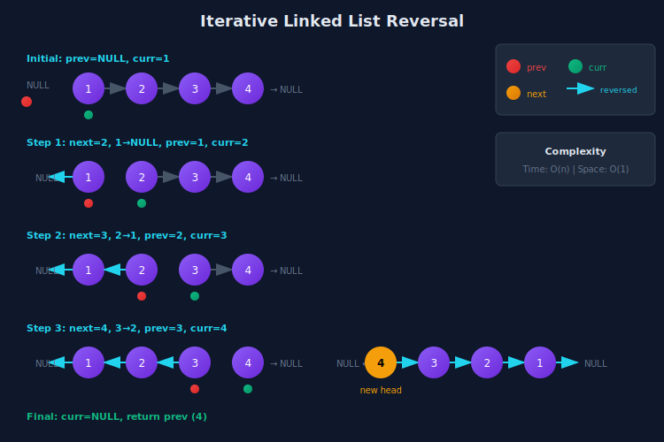

<div align="center">

# 🔄 Linked List Reversal

<p>
  
  
</p>

</div>

---

## 🧭 Navigation

| ⬅️ Previous | 📂 Current | ➡️ Next |
|:------------|:----------:|--------:|
| [← 01. Basic Operations](../01_basic_operations/README.md) | **02. Reversal** | [03. Merge & Sort →](../03_merge_sort/README.md) |

---

## 🎨 Visual Diagrams

<div align="center">

### Iterative Reversal Algorithm


</div>

---

## 📐 Mathematical Foundations

### 1️⃣ Reversal Invariant

**Loop Invariant for Iterative Reversal:**

After iteration $i$:

```math
\boxed{\text{null} \leftarrow node_0 \leftarrow node_1 \leftarrow \cdots \leftarrow node_i \quad | \quad node_{i+1} \to \cdots \to node_{n-1}}

```

Where:

- Left of `|`: Already reversed (prev points to $node\_i$)

- Right of `|`: Not yet processed (current points to $node\_{i+1}$)

**Initialization:** $i = 0$, prev = null, current = head

**Maintenance:** Each iteration reverses one more link

**Termination:** current = null, prev points to new head

---

### 2️⃣ Recursive Reversal Formula

**Recursive Definition:**

```math
\text{reverse}(head) = \begin{cases}
head & \text{if } head = \text{null or } head.next = \text{null} \\
\text{let } rest = \text{reverse}(head.next) & \\
\quad head.next.next = head & \\
\quad head.next = \text{null} & \\
\quad \text{return } rest
\end{cases}

```

**Recurrence Relation:**

```math
T(n) = T(n-1) + O(1)
\boxed{T(n) = O(n) \text{ time}, \; O(n) \text{ stack space}}

```

---

### 3️⃣ Reversal Complexity Analysis

**Iterative Approach:**

- **Time:** One pass through list = $O(n)$

- **Space:** Three pointers (prev, current, next) = $O(1)$

**Recursive Approach:**

- **Time:** One recursive call per node = $O(n)$

- **Space:** Call stack depth = $O(n)$

**Mathematical Proof of Space:**

Iterative uses fixed variables:

```math
S_{\text{iter}}(n) = 3 \text{ pointers} = O(1)

```

Recursive stacks n frames:

```math
S_{\text{rec}}(n) = \sum_{i=1}^{n} O(1) = O(n)

```

---

### 4️⃣ Partial Reversal Formula

**Reverse nodes from position left to right:**

Original: $n\_1 \to n\_2 \to \cdots \to n\_{left-1} \to n\_{left} \to \cdots \to n\_{right} \to n\_{right+1} \to \cdots$

Result: $n\_1 \to n\_2 \to \cdots \to n\_{left-1} \to n\_{right} \to \cdots \to n\_{left} \to n\_{right+1} \to \cdots$

**Number of link reversals needed:**

```math
\boxed{\text{reversals} = right - left}

```

---

### 5️⃣ K-Group Reversal Mathematics

**Given:** List of length $n$, reverse every $k$ nodes

**Number of complete groups:**

```math
\text{complete\_groups} = \left\lfloor \frac{n}{k} \right\rfloor

```

**Remaining nodes:**

```math
\text{remaining} = n \mod k

```

**Total reversals:**

```math
\text{total\_reversals} = \left\lfloor \frac{n}{k} \right\rfloor \times (k-1)

```

**Time Complexity:** $O(n)$ - each node visited once

---

## 🎨 Visual Algorithm Walkthroughs

### Iterative Reversal - Complete Trace

```
Original: 1 → 2 → 3 → 4 → null
Goal:     4 → 3 → 2 → 1 → null

+--------------------------------------------------------------------+

|  Initial State                                                      |
|  --------------------------------------------------------------    |
|  prev = null                                                        |
|  curr = 1                                                           |
|  next = undefined                                                   |
|                                                                    |
|  null    1 → 2 → 3 → 4 → null                                       |
|   ↑     ↑                                                          |
|  prev  curr                                                        |
+--------------------------------------------------------------------+

|  Iteration 1                                                        |
|  --------------------------------------------------------------    |
|  1. next = curr.next  (save reference: next = 2)                   |
|  2. curr.next = prev  (reverse link: 1 → null)                     |
|  3. prev = curr       (advance prev to 1)                          |
|  4. curr = next       (advance curr to 2)                          |
|                                                                    |
|  null ← 1    2 → 3 → 4 → null                                       |
|         ↑    ↑                                                      |
|       prev  curr                                                   |
+--------------------------------------------------------------------+

|  Iteration 2                                                        |
|  --------------------------------------------------------------    |
|  1. next = curr.next  (save: next = 3)                             |
|  2. curr.next = prev  (reverse: 2 → 1)                             |
|  3. prev = curr       (advance prev to 2)                          |
|  4. curr = next       (advance curr to 3)                          |
|                                                                    |
|  null ← 1 ← 2    3 → 4 → null                                       |
|              ↑   ↑                                                  |
|            prev curr                                               |
+--------------------------------------------------------------------+

|  Iteration 3                                                        |
|  --------------------------------------------------------------    |
|  1. next = curr.next  (save: next = 4)                             |
|  2. curr.next = prev  (reverse: 3 → 2)                             |
|  3. prev = curr       (advance prev to 3)                          |
|  4. curr = next       (advance curr to 4)                          |
|                                                                    |
|  null ← 1 ← 2 ← 3    4 → null                                       |
|                   ↑  ↑                                              |
|                 prev curr                                          |
+--------------------------------------------------------------------+

|  Iteration 4                                                        |
|  --------------------------------------------------------------    |
|  1. next = curr.next  (save: next = null)                          |
|  2. curr.next = prev  (reverse: 4 → 3)                             |
|  3. prev = curr       (advance prev to 4)                          |
|  4. curr = next       (advance curr to null)                       |
|                                                                    |
|  null ← 1 ← 2 ← 3 ← 4    null                                       |
|                      ↑    ↑                                         |
|                    prev  curr                                      |
+--------------------------------------------------------------------+

|  Termination                                                        |
|  --------------------------------------------------------------    |
|  curr == null, loop exits                                          |
|  Return prev (which points to node 4, the new head)                |
|                                                                    |
|  Result: 4 → 3 → 2 → 1 → null ✓                                    |
+--------------------------------------------------------------------+

```

---

### Recursive Reversal - Call Stack Visualization

```
reverse(1 → 2 → 3 → 4 → null)

+--------------------------------------------------------------------+

|  Call Stack Building Phase                                         |
+--------------------------------------------------------------------+
|                                                                    |
|  reverse(1 → 2 → 3 → 4 → null)                                     |
|    |                                                               |
|    +-► reverse(2 → 3 → 4 → null)                                  |
|          |                                                         |
|          +-► reverse(3 → 4 → null)                                |
|                |                                                   |
|                +-► reverse(4 → null)                              |
|                      |                                             |
|                      +-► Base case! Return 4                      |
+--------------------------------------------------------------------+

|  Unwinding Phase (where magic happens)                            |
+--------------------------------------------------------------------+
|                                                                    |
|  Level 4: reverse(4 → null)                                        |
|    Base case: return 4                                             |
|    4 → null                                                         |
|                                                                    |
|  Level 3: reverse(3 → 4 → null)                                    |
|    new_head = 4                                                    |
|    head.next.next = head  →  4.next = 3                           |
|    head.next = null       →  3.next = null                        |
|    4 → 3 → null                                                     |
|    return 4                                                        |
|                                                                    |
|  Level 2: reverse(2 → 3 → 4 → null)                                |
|    new_head = 4                                                    |
|    head.next.next = head  →  3.next = 2                           |
|    head.next = null       →  2.next = null                        |
|    4 → 3 → 2 → null                                                 |
|    return 4                                                        |
|                                                                    |
|  Level 1: reverse(1 → 2 → 3 → 4 → null)                            |
|    new_head = 4                                                    |
|    head.next.next = head  →  2.next = 1                           |
|    head.next = null       →  1.next = null                        |
|    4 → 3 → 2 → 1 → null ✓                                           |
|    return 4                                                        |
|                                                                    |
|  Final Result: 4 → 3 → 2 → 1 → null                                |
+--------------------------------------------------------------------+

Key Insight: 
  head.next.next = head  means "my next node should point back to me"
  head.next = null       means "I now point to nothing (will be updated)"

```

---

### Reverse Between Left and Right

```
Input: 1 → 2 → 3 → 4 → 5 → null, left=2, right=4
Goal:  1 → 4 → 3 → 2 → 5 → null

+--------------------------------------------------------------------+

|  Strategy: Move nodes one by one to front of section               |
+--------------------------------------------------------------------+
|  Initial Setup                                                      |
|  --------------------------------------------------------------    |
|  dummy → 1 → 2 → 3 → 4 → 5 → null                                   |
|                                                                    |
|  Step 1: Position prev before left (position 1)                   |
|  dummy → 1 → 2 → 3 → 4 → 5 → null                                   |
|           ↑   ↑                                                     |
|         prev curr                                                  |
+--------------------------------------------------------------------+

|  Move 1: Extract 3 and insert after prev                          |
|  --------------------------------------------------------------    |
|  Before:                                                           |
|  dummy → 1 → 2 → 3 → 4 → 5 → null                                   |
|           ↑   ↑   ↑                                                 |
|         prev curr next                                             |
|                                                                    |
|  Actions:                                                          |
|  1. curr.next = next.next    (2 → 4)                               |
|  2. next.next = prev.next    (3 → 2)                               |
|  3. prev.next = next         (1 → 3)                               |
|                                                                    |
|  After:                                                            |
|  dummy → 1 → 3 → 2 → 4 → 5 → null                                   |
|           ↑       ↑                                                 |
|         prev    curr                                               |
+--------------------------------------------------------------------+

|  Move 2: Extract 4 and insert after prev                          |
|  --------------------------------------------------------------    |
|  Before:                                                           |
|  dummy → 1 → 3 → 2 → 4 → 5 → null                                   |
|           ↑       ↑   ↑                                             |
|         prev    curr next                                          |
|                                                                    |
|  Actions:                                                          |
|  1. curr.next = next.next    (2 → 5)                               |
|  2. next.next = prev.next    (4 → 3)                               |
|  3. prev.next = next         (1 → 4)                               |
|                                                                    |
|  After:                                                            |
|  dummy → 1 → 4 → 3 → 2 → 5 → null ✓                                |
|           ↑           ↑                                             |
|         prev        curr                                           |
|                                                                    |
|  Total moves: right - left = 4 - 2 = 2 ✓                           |
+--------------------------------------------------------------------+

```

---

### Reverse in K-Groups

```
Input: 1 → 2 → 3 → 4 → 5 → 6 → 7 → 8 → null, k=3
Goal:  3 → 2 → 1 → 6 → 5 → 4 → 7 → 8 → null

+--------------------------------------------------------------------+

|  Group 1: Reverse first 3 nodes                                    |
|  --------------------------------------------------------------    |
|  Original:  1 → 2 → 3 → 4 → 5 → 6 → 7 → 8 → null                    |
|             +-----+                                                |
|            Group 1                                                 |
|                                                                    |
|  After reversing:                                                  |
|             3 → 2 → 1 → 4 → 5 → 6 → 7 → 8 → null                    |
|             +-----+                                                |
|           Reversed                                                 |
+--------------------------------------------------------------------+

|  Group 2: Reverse next 3 nodes                                    |
|  --------------------------------------------------------------    |
|  Current: 3 → 2 → 1 → 4 → 5 → 6 → 7 → 8 → null                      |
|                       +-----+                                      |
|                      Group 2                                       |
|                                                                    |
|  After reversing:                                                  |
|           3 → 2 → 1 → 6 → 5 → 4 → 7 → 8 → null                      |
|                       +-----+                                      |
|                     Reversed                                       |
+--------------------------------------------------------------------+

|  Group 3: Only 2 nodes left (< k), leave as is                    |
|  --------------------------------------------------------------    |
|  Final: 3 → 2 → 1 → 6 → 5 → 4 → 7 → 8 → null ✓                      |
|                                 +----+                             |
|                               Not reversed                         |
|                                                                    |
|  Algorithm:                                                        |
|  1. Check if k nodes available                                    |
|  2. If yes: reverse k nodes                                        |
|  3. Connect to recursively reversed rest                          |
|  4. If no: return head (don't reverse)                            |
+--------------------------------------------------------------------+

```

---

### Swap Nodes in Pairs

```
Input: 1 → 2 → 3 → 4 → 5 → null
Goal:  2 → 1 → 4 → 3 → 5 → null

+--------------------------------------------------------------------+

|  Swap Pattern (k=2 special case)                                   |
+--------------------------------------------------------------------+
|  Initial:                                                          |
|  dummy → 1 → 2 → 3 → 4 → 5 → null                                   |
|    ↑     ↑   ↑                                                      |
|  prev  first second                                                |
|                                                                    |
|  Swap 1 and 2:                                                     |
|  Step 1: first.next = second.next    (1 → 3)                       |
|  Step 2: second.next = first         (2 → 1)                       |
|  Step 3: prev.next = second          (dummy → 2)                   |
|                                                                    |
|  Result after swap 1:                                              |
|  dummy → 2 → 1 → 3 → 4 → 5 → null                                   |
|              ↑   ↑   ↑                                              |
|            prev first second                                       |
|                                                                    |
|  Advance: prev = first                                             |
|  dummy → 2 → 1 → 3 → 4 → 5 → null                                   |
|              ↑   ↑   ↑                                              |
|            prev first second                                       |
|                                                                    |
|  Swap 3 and 4:                                                     |
|  dummy → 2 → 1 → 4 → 3 → 5 → null                                   |
|                      ↑                                              |
|                    prev                                            |
|                                                                    |
|  Remaining: 5 (odd node, no pair)                                 |
|  Final: 2 → 1 → 4 → 3 → 5 → null ✓                                 |
+--------------------------------------------------------------------+

```

---

## 💻 Code Implementations

```python
class ListNode:
    """Definition for singly-linked list node."""
    def __init__(self, val=0, next=None):
        self.val = val
        self.next = next

def reverseList(head: ListNode) -> ListNode:
    """
    Iterative reversal of entire linked list.
    
    Three-pointer technique:
    - prev: points to reversed portion
    - current: node being processed
    - next: saved reference to rest of list
    
    Time: O(n), Space: O(1)
    """
    prev = None
    current = head
    
    while current:
        # Save next node
        next_node = current.next
        
        # Reverse the link
        current.next = prev
        
        # Move pointers forward
        prev = current
        current = next_node
    
    return prev  # New head

def reverseListRecursive(head: ListNode) -> ListNode:
    """
    Recursive reversal of linked list.
    
    Base case: Empty list or single node
    Recursive case: Reverse rest, then fix links
    
    Key insight: head.next.next = head makes next point back
    
    Time: O(n), Space: O(n) for call stack
    """
    # Base case
    if not head or not head.next:
        return head
    
    # Recursively reverse rest of list
    new_head = reverseListRecursive(head.next)
    
    # Fix the link: my next should point back to me
    head.next.next = head
    
    # I now point to nothing (end of list)
    head.next = None
    
    return new_head

def reverseBetween(head: ListNode, left: int, right: int) -> ListNode:
    """
    Reverse nodes from position left to right (1-indexed).
    
    Algorithm:
    1. Position prev just before left
    2. For (right-left) times:
       - Extract next node
       - Insert it after prev
    3. This moves nodes to front one by one
    
    Time: O(n), Space: O(1)
    """
    if not head or left == right:
        return head
    
    dummy = ListNode(0, head)
    prev = dummy
    
    # Position prev at node (left-1)
    for _ in range(left - 1):
        prev = prev.next
    
    # current will stay at original left position
    current = prev.next
    
    # Move (right-left) nodes to front
    for _ in range(right - left):
        next_node = current.next
        
        # Extract next_node
        current.next = next_node.next
        
        # Insert next_node after prev
        next_node.next = prev.next
        prev.next = next_node
    
    return dummy.next

def reverseKGroup(head: ListNode, k: int) -> ListNode:
    """
    Reverse nodes in k-group. If remaining < k, don't reverse.
    
    Algorithm:
    1. Check if k nodes available
    2. If yes: reverse k nodes
    3. Connect to recursively reversed rest
    4. If no: return head as is
    
    Time: O(n), Space: O(n/k) for recursion
    """
    # Check if k nodes available
    count = 0
    current = head
    while current and count < k:
        current = current.next
        count += 1
    
    if count < k:
        return head  # Not enough nodes, don't reverse
    
    # Reverse first k nodes
    prev = None
    current = head
    for _ in range(k):
        next_node = current.next
        current.next = prev
        prev = current
        current = next_node
    
    # prev is new head, head is now tail, current is (k+1)th node
    # Recursively reverse rest and connect
    head.next = reverseKGroup(current, k)
    
    return prev

def swapPairs(head: ListNode) -> ListNode:
    """
    Swap adjacent nodes in pairs.
    
    Special case of reverseKGroup with k=2.
    Can be done iteratively for O(1) space.
    
    Time: O(n), Space: O(1)
    """
    dummy = ListNode(0, head)
    prev = dummy
    
    while prev.next and prev.next.next:
        # Identify the pair
        first = prev.next
        second = prev.next.next
        
        # Swap the pair
        first.next = second.next
        second.next = first
        prev.next = second
        
        # Move to next pair
        prev = first
    
    return dummy.next

def reorderList(head: ListNode) -> None:
    """
    Reorder list: L0 → Ln → L1 → Ln-1 → L2 → Ln-2 → ...
    
    Algorithm:
    1. Find middle using fast-slow
    2. Reverse second half
    3. Merge two halves alternately
    
    Combines multiple techniques!
    
    Time: O(n), Space: O(1)
    """
    if not head or not head.next:
        return
    
    # Step 1: Find middle
    slow = fast = head
    while fast.next and fast.next.next:
        slow = slow.next
        fast = fast.next.next
    
    # Step 2: Reverse second half
    second = slow.next
    slow.next = None  # Break connection
    second = reverseList(second)
    
    # Step 3: Merge two halves
    first = head
    while second:
        # Save next pointers
        next1 = first.next
        next2 = second.next
        
        # Insert second node after first
        first.next = second
        second.next = next1
        
        # Move to next pair
        first = next1
        second = next2

def isPalindrome(head: ListNode) -> bool:
    """
    Check if linked list is palindrome using reversal.
    
    Algorithm:
    1. Find middle (slow pointer)
    2. Reverse second half
    3. Compare first and second halves
    4. (Optional) Restore original list
    
    Time: O(n), Space: O(1)
    """
    if not head or not head.next:
        return True
    
    # Find middle (slow will be at end of first half)
    slow = fast = head
    while fast.next and fast.next.next:
        slow = slow.next
        fast = fast.next.next
    
    # Reverse second half
    second = reverseList(slow.next)
    slow.next = None
    
    # Compare
    first = head
    result = True
    while second:
        if first.val != second.val:
            result = False
            break
        first = first.next
        second = second.next
    
    # (Optional) Restore list
    # slow.next = reverseList(second_head_saved)
    
    return result

```

---

## 🏆 LeetCode Problems

### 🟢 Easy

| # | Problem | Technique | Time | Space |
|:-:|---------|-----------|:----:|:-----:|
| 206 | [Reverse Linked List](https://leetcode.com/problems/reverse-linked-list/) | Iterative 3-pointer | O(n) | O(1) |
| 234 | [Palindrome Linked List](https://leetcode.com/problems/palindrome-linked-list/) | Find Mid + Reverse | O(n) | O(1) |

### 🟡 Medium

| # | Problem | Technique | Time | Space |
|:-:|---------|-----------|:----:|:-----:|
| 24 | [Swap Nodes in Pairs](https://leetcode.com/problems/swap-nodes-in-pairs/) | Pair Swap | O(n) | O(1) |
| 92 | [Reverse Linked List II](https://leetcode.com/problems/reverse-linked-list-ii/) | Partial Reverse | O(n) | O(1) |
| 143 | [Reorder List](https://leetcode.com/problems/reorder-list/) | Mid + Reverse + Merge | O(n) | O(1) |
| 2074 | [Reverse Nodes in Even Length Groups](https://leetcode.com/problems/reverse-nodes-in-even-length-groups/) | Group Reverse | O(n) | O(1) |
| 2130 | [Maximum Twin Sum](https://leetcode.com/problems/maximum-twin-sum-of-a-linked-list/) | Reverse + Compare | O(n) | O(1) |

### 🔴 Hard

| # | Problem | Technique | Time | Space |
|:-:|---------|-----------|:----:|:-----:|
| 25 | [Reverse Nodes in k-Group](https://leetcode.com/problems/reverse-nodes-in-k-group/) | K-Group Reverse | O(n) | O(1) iterative |

---

## 💡 Key Insights & Pro Tips

> **🎯 Three-Pointer Template**  
> Always maintain: `prev`, `current`, `next`. Save next before reversing link!

> **⚡ Iterative vs Recursive**  
> Iterative: O(1) space, preferred in interviews. Recursive: O(n) space but elegant code.

> **🔄 Palindrome O(1) Space Trick**  
> Find middle → reverse second half → compare → optionally restore. No extra space!

> **📊 Partial Reversal Pattern**  
> Use dummy node. Position prev before section. Move nodes to front one by one.

> **🔍 K-Group Critical Check**  
> Always verify k nodes available before reversing. Count first, then reverse.

> **💰 Swap Pairs Optimization**  
> Special case of k=2. Can be done iteratively without recursion for O(1) space.

---

## 🎓 Pattern Recognition Guide

### Identifying Reversal Problems

| Problem Says... | Pattern | Technique |
|----------------|---------|-----------|
| "reverse entire list" | Full reversal | 3-pointer iterative |
| "reverse from position m to n" | Partial reversal | Position + extract |
| "palindrome check" | Symmetry | Reverse half + compare |
| "swap adjacent" | Pair operations | Swap pairs (k=2) |
| "reverse every k nodes" | Group reversal | K-group algorithm |
| "reorder L0→Ln→L1→Ln-1" | Alternating merge | Split + reverse + merge |

---

## 🧮 Complexity Comparison

### Space-Time Tradeoffs

| Technique | Time | Space | When to Use |
|-----------|:----:|:-----:|-------------|
| **Iterative Full** | O(n) | **O(1)** | Always prefer in interviews |
| **Recursive Full** | O(n) | O(n) | Clean code, not space-critical |
| **Partial Reverse** | O(n) | **O(1)** | Reverse subsection |
| **K-Group Iterative** | O(n) | **O(1)** | Best solution |
| **K-Group Recursive** | O(n) | O(n/k) | Easier to understand |
| **Palindrome Check** | O(n) | **O(1)** | Reverse second half only |

---

## 📚 References & Learning Resources

### 📖 Core Concepts

| Resource | Description | Link |
|----------|-------------|------|
| **Reversal Techniques** | Complete iterative guide | [GeeksforGeeks](https://www.geeksforgeeks.org/reverse-a-linked-list/) |
| **Recursive Reversal** | Understanding recursion | [GeeksforGeeks](https://www.geeksforgeeks.org/recursively-reversing-a-linked-list-a-simple-implementation/) |
| **K-Group Reversal** | Advanced pattern | [LeetCode Solution](https://leetcode.com/problems/reverse-nodes-in-k-group/solution/) |
| **Palindrome O(1) Space** | Reverse half technique | [LeetCode Discuss](https://leetcode.com/problems/palindrome-linked-list/discuss/64501/Java-easy-to-understand) |

### 🎥 Video Tutorials

| Resource | Topic | Link |
|----------|-------|------|
| **NeetCode** | Reverse linked list | [YouTube](https://www.youtube.com/watch?v=G0_I-ZF0S38) |
| **NeetCode** | Reverse between positions | [YouTube](https://www.youtube.com/watch?v=RF_M9tX4Eag) |
| **NeetCode** | Reorder list | [YouTube](https://www.youtube.com/watch?v=S5bfdUTrKLM) |
| **Back To Back SWE** | Palindrome list explained | [YouTube](https://www.youtube.com/watch?v=-DtNInqFUXs) |
| **Tushar Roy** | Reverse in k-group | [YouTube](https://www.youtube.com/watch?v=BKr-WQL50NA) |
| **Abdul Bari** | Linked list reversal | [YouTube](https://www.youtube.com/watch?v=sYcOK51hl-A) |

### 📝 Interactive Practice

| Platform | Focus | Link |
|----------|-------|------|
| **VisuAlgo** | Visual reversal | [Website](https://visualgo.net/en/list) |
| **LeetCode Explore** | Reversal problems | [Card](https://leetcode.com/explore/learn/card/linked-list/) |

---

## 🎯 Practice Roadmap

### Foundation (Week 1)

1. **Reverse Linked List** (#206) - Master 3-pointer technique

2. **Palindrome List** (#234) - Combine mid-finding + reversal

3. **Swap Pairs** (#24) - Simple pair swapping

### Intermediate (Week 2)

4. **Reverse Between** (#92) - Partial reversal mastery

5. **Reorder List** (#143) - Multiple patterns combined

6. **Maximum Twin Sum** (#2130) - Application of reversal

### Advanced (Week 3)

7. **Reverse in K-Group** (#25) - Group operations

8. **Reverse Even Length Groups** (#2074) - Complex logic

### Mastery Challenge

- Implement all variants in < 15 minutes each

- Code iterative versions without bugs

- Explain recursive approach with call stack

- Optimize space to O(1) wherever possible

---

## 💭 Common Interview Questions

**Q: Why prefer iterative over recursive reversal?**  
A: Iterative uses O(1) space vs O(n) for recursive call stack. In production with large lists, stack overflow is a risk.

**Q: How to reverse only part of a linked list?**  
A: Position prev before the section, then repeatedly extract and insert nodes at the front. Takes (right-left) operations.

**Q: Can you check palindrome without extra space?**  
A: Yes! Find middle, reverse second half, compare with first half. Optionally restore afterwards. Total O(1) space.

**Q: What's the trick for k-group reversal?**  
A: First count if k nodes available. If not, return as-is. If yes, reverse k nodes, then recursively handle rest.

**Q: How to swap pairs without recursion?**  
A: Use dummy node, iterate through pairs. For each pair: extract second, insert it before first. O(1) space.

---

## 🧩 Common Pitfalls & Solutions

### Pitfall 1: Losing Reference

```python
# ❌ WRONG: Lost reference to rest of list
current.next = prev  # Oops, lost rest of list!

# ✅ CORRECT: Save next first
next_node = current.next  # Save reference
current.next = prev       # Now safe to reverse

```

### Pitfall 2: Not Handling Single Node

```python
# ❌ WRONG: Crashes on single node
def reverse(head):
    prev = None
    while head.next:  # Fails if only one node
        ...

# ✅ CORRECT: Check head first
def reverse(head):
    if not head or not head.next:
        return head
    ...

```

### Pitfall 3: Off-by-One in Partial Reversal

```python
# ❌ WRONG: Wrong number of iterations
for _ in range(right - left + 1):  # One too many!

# ✅ CORRECT: Exactly (right - left) swaps
for _ in range(right - left):
    # Move nodes to front

```

---

<div align="center">

### 🔄 Master Reversal: The Swiss Army Knife of Linked Lists

*One pattern, infinite applications. From palindromes to reordering to k-groups.*

**Made with ❤️ by [Gaurav Goswami](https://github.com/Gaurav14cs17)**

[⬅️ Basic Operations](../01_basic_operations/README.md) | [➡️ Merge & Sort](../03_merge_sort/README.md)

---

*"Draw the pointers, trace the links, understand the flow."*  
*Start with simple reversal (#206), master it completely!* 🚀

</div>

---

## 🧭 Navigation

| ⬅️ Previous | 📂 Current | ➡️ Next |
|:------------|:----------:|--------:|
| [← 01. Basic Operations](../01_basic_operations/README.md) | **02. Reversal** | [03. Merge & Sort →](../03_merge_sort/README.md) |
