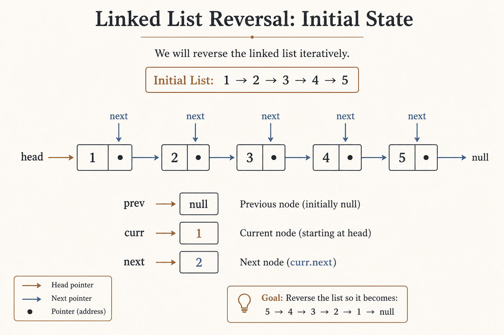
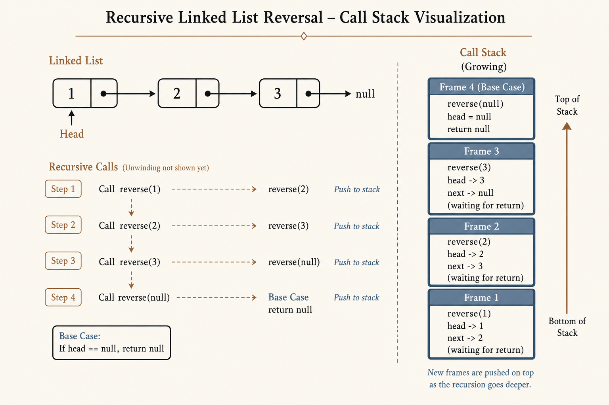
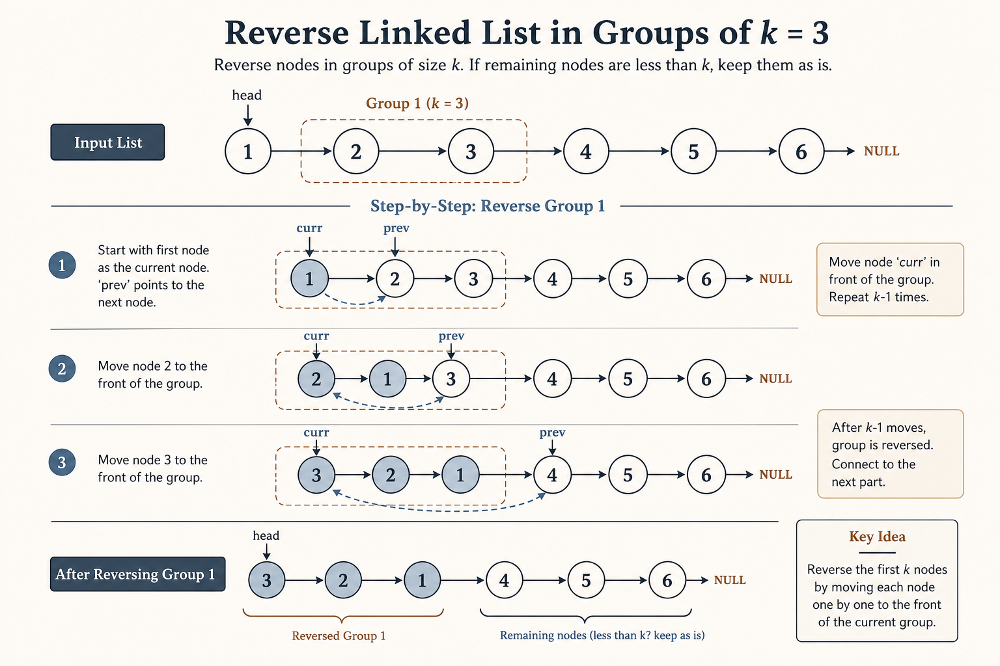
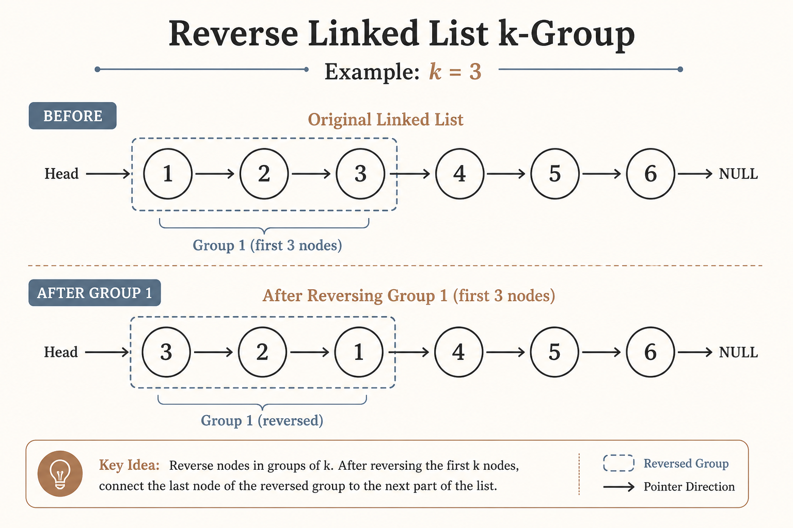
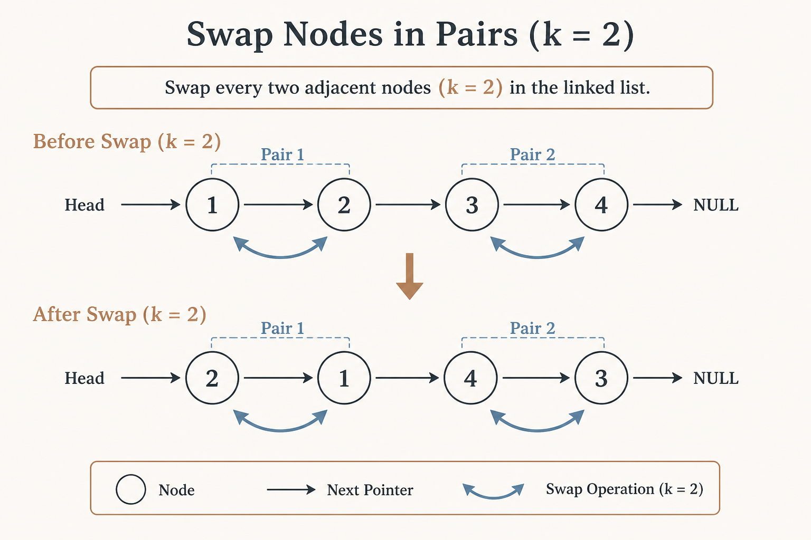
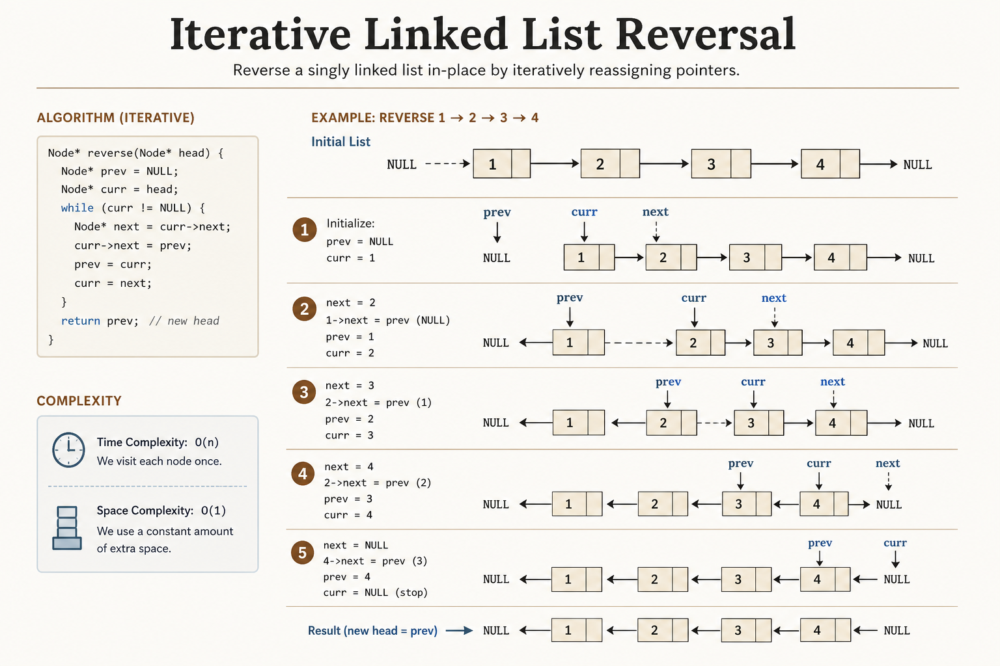
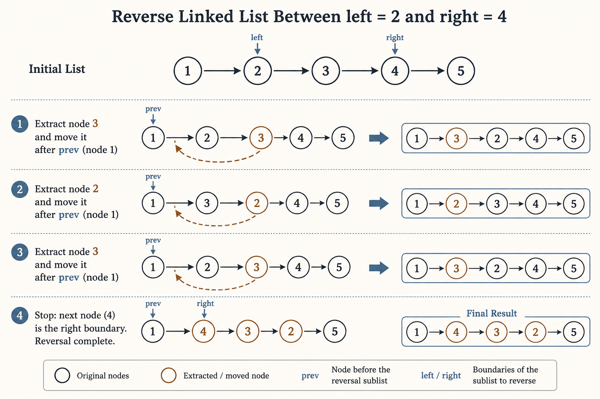
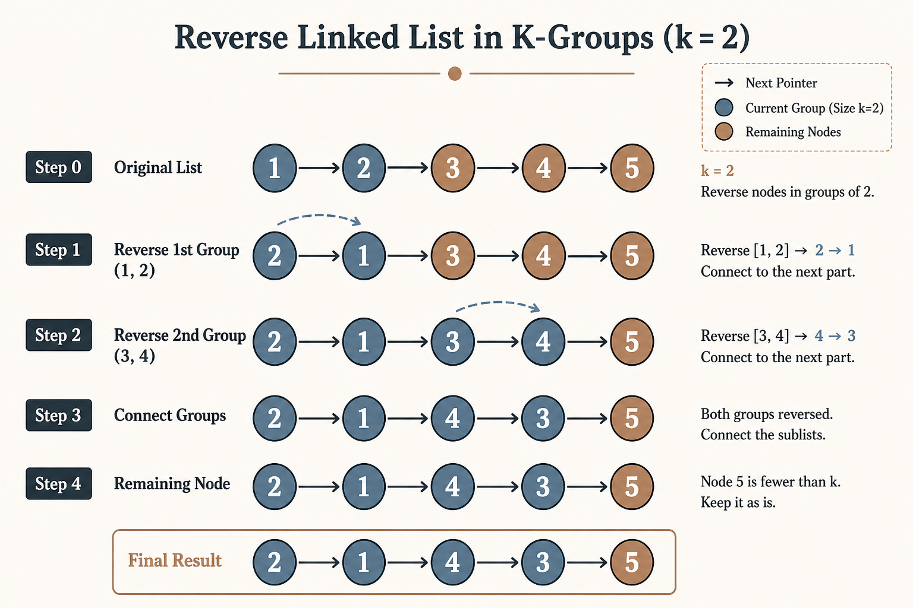
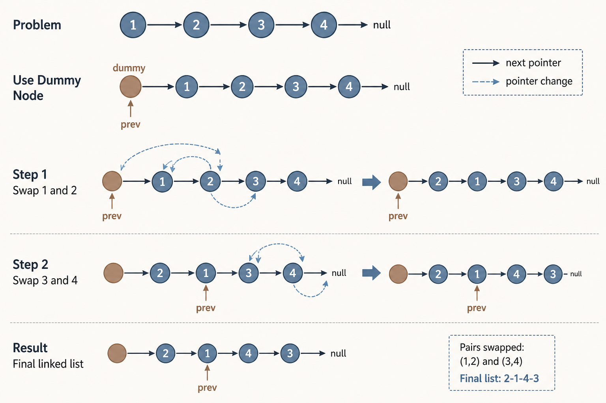

<div align="center">

# 🔄 Linked List Reversal

### *🔄 Linked List Reversal*


<p>
  
  
</p>

</div>

---

## 📊 Visual Overview

<div align="center">

### Initial State


### Call Stack Building Phase


### Strategy: Move nodes one by one to front of section


### Group 1: Reverse first 3 nodes


### Swap Pattern (k=2 special case)


</div>

---

### Iterative Reversal - Complete Trace



---

### Recursive Reversal - Call Stack Visualization

See **Call Stack Building Phase** in the visual overview — each recursive call pushes a frame until the tail is reached, then unwinds with pointer rewiring.

---

### Reverse Between Left and Right



---

### Reverse in K-Groups



---

### Swap Nodes in Pairs



## 🎯 At a Glance

| | |
|:---|:---|
| **Topic** | 🔄 Linked List Reversal |
| **Difficulty** | Easy to Hard |
| **Problems** | 12+ |

> **How to use this page:** Start with the visual overview, scan **At a Glance**, then work through theory → walkthroughs → code.


## 🧭 Navigation

| ⬅️ Previous | 📂 Current | ➡️ Next |
|:------------|:----------:|--------:|
| [← 01. Basic Operations](../01_basic_operations/README.md) | **02. Reversal** | [03. Merge & Sort →](../03_merge_sort/README.md) |


## 📐 Mathematical Foundation
### 1️⃣ Reversal Invariant

**Loop Invariant for Iterative Reversal:**

After iteration $i$:

$$\boxed{\text{null} \leftarrow node_0 \leftarrow node_1 \leftarrow \cdots \leftarrow node_i \quad | \quad node_{i+1} \to \cdots \to node_{n-1}}$$

Where:

- Left of `|`: Already reversed (prev points to $node_i$)

- Right of `|`: Not yet processed (current points to $node_{i+1}$)

**Initialization:** $i = 0$, prev = null, current = head

**Maintenance:** Each iteration reverses one more link

**Termination:** current = null, prev points to new head

---

### 2️⃣ Recursive Reversal Formula

**Recursive Definition:**

$$\text{reverse}(head) = \begin{cases}
head & \text{if } head = \text{null or } head.next = \text{null} \\
\text{let } rest = \text{reverse}(head.next) & \\
\quad head.next.next = head & \\
\quad head.next = \text{null} & \\
\quad \text{return } rest
\end{cases}$$

**Recurrence Relation:**

$$T(n) = T(n-1) + O(1)
\boxed{T(n) = O(n) \text{ time}, \; O(n) \text{ stack space}}$$

---

### 3️⃣ Reversal Complexity Analysis

**Iterative Approach:**

- **Time:** One pass through list = $O(n)$

- **Space:** Three pointers (prev, current, next) = $O(1)$

**Recursive Approach:**

- **Time:** One recursive call per node = $O(n)$

- **Space:** Call stack depth = $O(n)$

**Mathematical Proof of Space:**

Iterative uses fixed variables:

$$S_{\text{iter}}(n) = 3 \text{ pointers} = O(1)$$

Recursive stacks n frames:

$$S_{\text{rec}}(n) = \sum_{i=1}^{n} O(1) = O(n)$$

---

### 4️⃣ Partial Reversal Formula

**Reverse nodes from position left to right:**

Original: $n_1 \to n_2 \to \cdots \to n_{left-1} \to n_{left} \to \cdots \to n_{right} \to n_{right+1} \to \cdots$

Result: $n_1 \to n_2 \to \cdots \to n_{left-1} \to n_{right} \to \cdots \to n_{left} \to n_{right+1} \to \cdots$

**Number of link reversals needed:**

$$\boxed{\text{reversals} = right - left}$$

---

### 5️⃣ K-Group Reversal Mathematics

**Given:** List of length $n$, reverse every $k$ nodes

**Number of complete groups:**

$$\text{complete groups} = \left\lfloor \frac{n}{k} \right\rfloor$$

**Remaining nodes:**

$$\text{remaining} = n \mod k$$

**Total reversals:**

$$\text{total reversals} = \left\lfloor \frac{n}{k} \right\rfloor \times (k-1)$$

**Time Complexity:** $O(n)$ - each node visited once


## 💻 Code Implementations

```python
class ListNode:
    """Definition for singly-linked list node."""
    def __init__(self, val=0, next=None):
        self.val = val
        self.next = next

def reverseList(head: ListNode) -> ListNode:
    """
    Iterative reversal of entire linked list.
    
    Three-pointer technique:
    - prev: points to reversed portion
    - current: node being processed
    - next: saved reference to rest of list
    
    Time: O(n), Space: O(1)
    """
    prev = None
    current = head
    
    while current:
        # Save next node
        next_node = current.next
        
        # Reverse the link
        current.next = prev
        
        # Move pointers forward
        prev = current
        current = next_node
    
    return prev  # New head

def reverseListRecursive(head: ListNode) -> ListNode:
    """
    Recursive reversal of linked list.
    
    Base case: Empty list or single node
    Recursive case: Reverse rest, then fix links
    
    Key insight: head.next.next = head makes next point back
    
    Time: O(n), Space: O(n) for call stack
    """
    # Base case
    if not head or not head.next:
        return head
    
    # Recursively reverse rest of list
    new_head = reverseListRecursive(head.next)
    
    # Fix the link: my next should point back to me
    head.next.next = head
    
    # I now point to nothing (end of list)
    head.next = None
    
    return new_head

def reverseBetween(head: ListNode, left: int, right: int) -> ListNode:
    """
    Reverse nodes from position left to right (1-indexed).
    
    Algorithm:
    1. Position prev just before left
    2. For (right-left) times:
       - Extract next node
       - Insert it after prev
    3. This moves nodes to front one by one
    
    Time: O(n), Space: O(1)
    """
    if not head or left == right:
        return head
    
    dummy = ListNode(0, head)
    prev = dummy
    
    # Position prev at node (left-1)
    for _ in range(left - 1):
        prev = prev.next
    
    # current will stay at original left position
    current = prev.next
    
    # Move (right-left) nodes to front
    for _ in range(right - left):
        next_node = current.next
        
        # Extract next_node
        current.next = next_node.next
        
        # Insert next_node after prev
        next_node.next = prev.next
        prev.next = next_node
    
    return dummy.next

def reverseKGroup(head: ListNode, k: int) -> ListNode:
    """
    Reverse nodes in k-group. If remaining < k, don't reverse.
    
    Algorithm:
    1. Check if k nodes available
    2. If yes: reverse k nodes
    3. Connect to recursively reversed rest
    4. If no: return head as is
    
    Time: O(n), Space: O(n/k) for recursion
    """
    # Check if k nodes available
    count = 0
    current = head
    while current and count < k:
        current = current.next
        count += 1
    
    if count < k:
        return head  # Not enough nodes, don't reverse
    
    # Reverse first k nodes
    prev = None
    current = head
    for _ in range(k):
        next_node = current.next
        current.next = prev
        prev = current
        current = next_node
    
    # prev is new head, head is now tail, current is (k+1)th node
    # Recursively reverse rest and connect
    head.next = reverseKGroup(current, k)
    
    return prev

def swapPairs(head: ListNode) -> ListNode:
    """
    Swap adjacent nodes in pairs.
    
    Special case of reverseKGroup with k=2.
    Can be done iteratively for O(1) space.
    
    Time: O(n), Space: O(1)
    """
    dummy = ListNode(0, head)
    prev = dummy
    
    while prev.next and prev.next.next:
        # Identify the pair
        first = prev.next
        second = prev.next.next
        
        # Swap the pair
        first.next = second.next
        second.next = first
        prev.next = second
        
        # Move to next pair
        prev = first
    
    return dummy.next

def reorderList(head: ListNode) -> None:
    """
    Reorder list: L0 → Ln → L1 → Ln-1 → L2 → Ln-2 → ...
    
    Algorithm:
    1. Find middle using fast-slow
    2. Reverse second half
    3. Merge two halves alternately
    
    Combines multiple techniques!
    
    Time: O(n), Space: O(1)
    """
    if not head or not head.next:
        return
    
    # Step 1: Find middle
    slow = fast = head
    while fast.next and fast.next.next:
        slow = slow.next
        fast = fast.next.next
    
    # Step 2: Reverse second half
    second = slow.next
    slow.next = None  # Break connection
    second = reverseList(second)
    
    # Step 3: Merge two halves
    first = head
    while second:
        # Save next pointers
        next1 = first.next
        next2 = second.next
        
        # Insert second node after first
        first.next = second
        second.next = next1
        
        # Move to next pair
        first = next1
        second = next2

def isPalindrome(head: ListNode) -> bool:
    """
    Check if linked list is palindrome using reversal.
    
    Algorithm:
    1. Find middle (slow pointer)
    2. Reverse second half
    3. Compare first and second halves
    4. (Optional) Restore original list
    
    Time: O(n), Space: O(1)
    """
    if not head or not head.next:
        return True
    
    # Find middle (slow will be at end of first half)
    slow = fast = head
    while fast.next and fast.next.next:
        slow = slow.next
        fast = fast.next.next
    
    # Reverse second half
    second = reverseList(slow.next)
    slow.next = None
    
    # Compare
    first = head
    result = True
    while second:
        if first.val != second.val:
            result = False
            break
        first = first.next
        second = second.next
    
    # (Optional) Restore list
    # slow.next = reverseList(second_head_saved)
    
    return result
```


## 🧩 Common Pitfalls & Solutions

### Pitfall 1: Losing Next Reference

```python
# ❌ WRONG: Lost reference to rest of list
current.next = prev  # Oops, lost rest of list!

# ✅ CORRECT: Save next first
next_node = current.next  # Save reference
current.next = prev       # Now safe to reverse
```

### Pitfall 2: Not Handling Single Node

```python
# ❌ WRONG: Crashes on single node
def reverse(head):
    prev = None
    while head.next:  # Fails if only one node
        ...

# ✅ CORRECT: Check head first
def reverse(head):
    if not head or not head.next:
        return head
    ...
```

### Pitfall 3: Off-by-One in Partial Reversal

```python
# ❌ WRONG: Wrong number of iterations
for _ in range(right - left + 1):  # One too many!

# ✅ CORRECT: Exactly (right - left) swaps
for _ in range(right - left):
    # Move nodes to front
```


---

## 🏆 LeetCode Problems

### 🟢 Easy

| # | Problem | Pattern | Time | Space |
|:-:|---------|---------|:----:|:-----:|
| 206 | [Reverse Linked List](https://leetcode.com/problems/reverse-linked-list/) | Iterative Reverse | O(n) | O(1) |

### 🟡 Medium

| # | Problem | Pattern | Time | Space |
|:-:|---------|---------|:----:|:-----:|
| 92 | [Reverse Linked List II](https://leetcode.com/problems/reverse-linked-list-ii/) | Partial Reverse | O(n) | O(1) |
| 24 | [Swap Nodes in Pairs](https://leetcode.com/problems/swap-nodes-in-pairs/) | Swap | O(n) | O(1) |
| 143 | [Reorder List](https://leetcode.com/problems/reorder-list/) | Reverse + Merge | O(n) | O(1) |
| 234 | [Palindrome Linked List](https://leetcode.com/problems/palindrome-linked-list/) | Reverse Half | O(n) | O(1) |

### 🔴 Hard

| # | Problem | Pattern | Time | Space |
|:-:|---------|---------|:----:|:-----:|
| 25 | [Reverse Nodes in k-Group](https://leetcode.com/problems/reverse-nodes-in-k-group/) | K-Group Reverse | O(n) | O(1) |

---

## 📚 References & Learning Resources

### 📖 Core Concepts

| Resource | Description | Link |
|----------|-------------|------|
| **Linked List Reversal** | GeeksforGeeks | [Reverse a Linked List](https://www.geeksforgeeks.org/reverse-a-linked-list/) |
| **LeetCode Explore** | Linked list card | [Explore Card](https://leetcode.com/explore/learn/card/linked-list/) |

---

<div align="center">

### 🔄 Master Reversal: The Swiss Army Knife of Linked Lists

*One pattern, infinite applications. From palindromes to reordering to k-groups.*

**Made with ❤️ by [Gaurav Goswami](https://github.com/Gaurav14cs17)**

[⬅️ Basic Operations](../01_basic_operations/README.md) | [➡️ Merge & Sort](../03_merge_sort/README.md)

---

*"Draw the pointers, trace the links, understand the flow."*  
*Start with simple reversal (#206), master it completely!* 🚀

</div>

---
