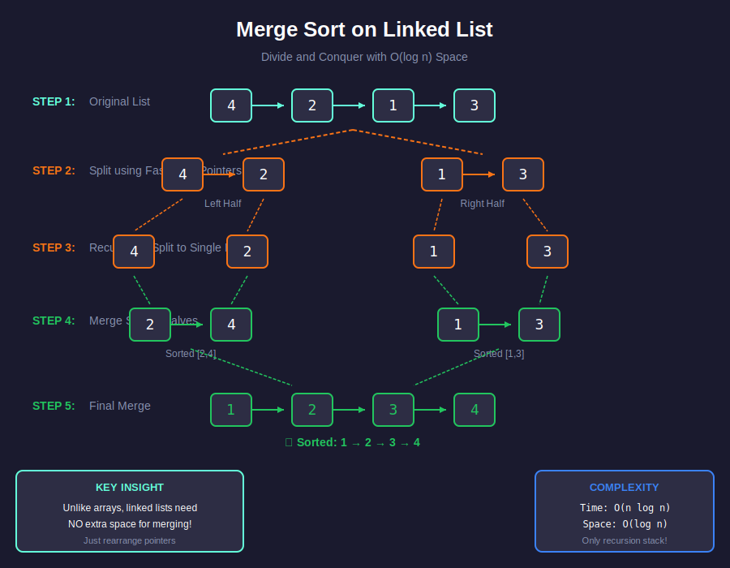
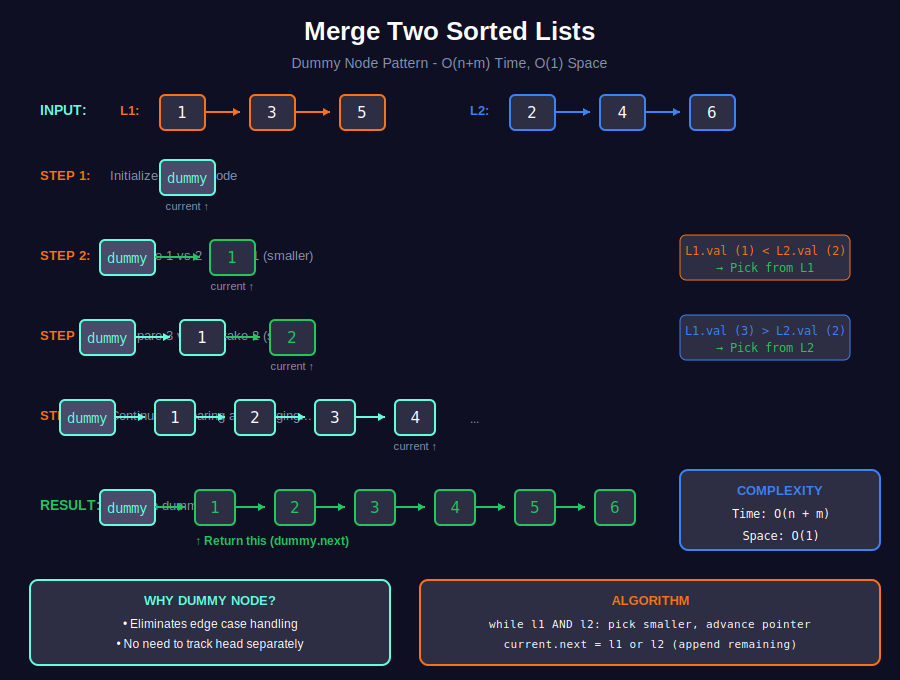
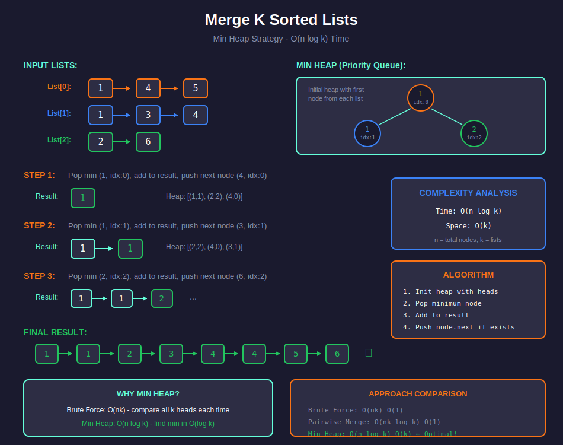

<div align="center">

# 🔀 Merge & Sort Linked Lists

<p>
  
  
</p>

</div>

---

## 🧭 Navigation

| ⬅️ Previous | 📂 Current | ➡️ Next Topic |
|:------------|:----------:|--------:|
| [← 02. Reversal](../02_reversal/README.md) | **03. Merge & Sort** | [🏠 Linked Lists Home](../README.md) → [Stacks](../../04_stacks/README.md) |

---

## 🎨 Visual Diagrams

<div align="center">

### Merge Sort on Linked List


### Merge Two Sorted Lists


### Merge K Sorted Lists


</div>

---

## 📐 Mathematical Foundations

### Merge Sort Recurrence

```math
T(n) = 2T(n/2) + O(n)
\boxed{T(n) = O(n \log n)}
```

**Space for Linked List:** $O(\log n)$ stack space (no auxiliary array needed)

---

### Merge Two Sorted Lists

**Invariant:** Result contains smaller of two current heads.

**Merge Formula:**

```math
\text{merge}(L_1, L_2) = \begin{cases}
L_2 & \text{if } L_1 = \text{null} \\
L_1 & \text{if } L_2 = \text{null} \\
L_1 \to \text{merge}(L_1.\text{next}, L_2) & \text{if } L_1.\text{val} < L_2.\text{val} \\
L_2 \to \text{merge}(L_1, L_2.\text{next}) & \text{otherwise}
\end{cases}
```

---

### Merge K Lists (Min Heap)

**Time Complexity:**

```math
O(n \log k)
```

Where $n$ = total elements, $k$ = number of lists.

---

## 💻 Code Implementations

```python
def mergeTwoLists(l1: ListNode, l2: ListNode) -> ListNode:
    """Merge two sorted lists. O(n+m) time, O(1) space."""
    dummy = ListNode(0)
    current = dummy
    
    while l1 and l2:
        if l1.val < l2.val:
            current.next = l1
            l1 = l1.next
        else:
            current.next = l2
            l2 = l2.next
        current = current.next
    
    current.next = l1 or l2
    return dummy.next

def sortList(head: ListNode) -> ListNode:
    """Merge sort for linked list. O(n log n) time."""
    if not head or not head.next:
        return head
    
    # Find middle
    slow = fast = head
    prev = None
    while fast and fast.next:
        prev = slow
        slow = slow.next
        fast = fast.next.next
    prev.next = None  # Split
    
    # Sort halves
    left = sortList(head)
    right = sortList(slow)
    
    # Merge
    return mergeTwoLists(left, right)

def mergeKLists(lists: list[ListNode]) -> ListNode:
    """Merge k sorted lists using min heap. O(n log k)."""
    import heapq
    
    heap = []
    for i, head in enumerate(lists):
        if head:
            heapq.heappush(heap, (head.val, i, head))
    
    dummy = ListNode(0)
    current = dummy
    
    while heap:
        val, i, node = heapq.heappop(heap)
        current.next = node
        current = current.next
        if node.next:
            heapq.heappush(heap, (node.next.val, i, node.next))
    
    return dummy.next
```

---

## 🏆 LeetCode Problems

### 🟢 Easy

| # | Problem | Technique | Time | Space |
|:-:|---------|-----------|:----:|:-----:|
| 21 | [Merge Two Sorted Lists](https://leetcode.com/problems/merge-two-sorted-lists/) | Two Pointers | O(n+m) | O(1) |

### 🟡 Medium

| # | Problem | Technique | Time | Space |
|:-:|---------|-----------|:----:|:-----:|
| 148 | [Sort List](https://leetcode.com/problems/sort-list/) | Merge Sort | O(n log n) | O(log n) |

### 🔴 Hard

| # | Problem | Technique | Time | Space |
|:-:|---------|-----------|:----:|:-----:|
| 23 | [Merge k Sorted Lists](https://leetcode.com/problems/merge-k-sorted-lists/) | Min Heap | O(n log k) | O(k) |

---

## 🎨 Visual Algorithm Walkthrough

### Merge Sort on Linked List

```
Original: 4 → 2 → 1 → 3

Step 1: Split using fast-slow pointers
        4 → 2 → 1 → 3
        ↓         ↓
     [4 → 2]   [1 → 3]

Step 2: Recursively split
     [4 → 2]     [1 → 3]
      ↓   ↓       ↓   ↓
     [4] [2]     [1] [3]

Step 3: Merge back up
     [4] [2]     [1] [3]
       ↓ ↓         ↓ ↓
     [2 → 4]   [1 → 3]

Step 4: Final merge
     [2 → 4]   [1 → 3]
          ↓ ↓
     [1 → 2 → 3 → 4] ✓

Time: O(n log n), Space: O(log n) for recursion
```

### Merge Two Sorted Lists - Dummy Node Pattern

```
L1: 1 → 3 → 5
L2: 2 → 4 → 6

dummy → ? (result will be dummy.next)
  ↓
 null

Step 1: Compare 1 vs 2, take 1
dummy → 1 → ?
        ↑
     current

Step 2: Compare 3 vs 2, take 2
dummy → 1 → 2 → ?
            ↑
         current

Continue until one list exhausted...

Final: dummy → 1 → 2 → 3 → 4 → 5 → 6
Return dummy.next ✓
```

### Merge K Lists - Min Heap Strategy

```
Lists: [1→4→5], [1→3→4], [2→6]

Heap initially: [(1,0), (1,1), (2,2)]
                 val,listIdx

Step 1: Pop (1,0), add 1 to result, push 4 from list 0
Step 2: Pop (1,1), add 1 to result, push 3 from list 1
Step 3: Pop (2,2), add 2 to result, push 6 from list 2
...continue...

Time: O(n log k) where n=total nodes, k=lists
```

---

## 💡 Key Insights & Pro Tips

> **🎯 Merge Sort Advantage**  
> Unlike arrays, linked lists don't need extra space for merge! Just rearrange pointers.

> **⚡ Dummy Node is Essential**  
> Eliminates edge case handling. Always return `dummy.next`.

> **🔄 Fast-Slow for Split**  
> Naturally finds middle. Don't forget to break the link!

> **📊 K Lists with Heap**  
> Comparing all k lists each time: O(nk). Heap reduces to O(n log k).

> **🔍 Merge Optimization**  
> For k lists: pairwise merging is O(nk log k). Heap is better: O(n log k).

---

## 🎓 Complexity Analysis

### Merge Sort Comparison

| Data Structure | Time | Space | Notes |
|---------------|:----:|:-----:|-------|
| **Array** | O(n log n) | O(n) | Needs auxiliary array |
| **Linked List** | O(n log n) | **O(log n)** | Only recursion stack! |

### K-Way Merge Approaches

| Approach | Time | Space | When to Use |
|----------|:----:|:-----:|-------------|
| **Brute Force** | O(nk) | O(1) | k small (k≤3) |
| **Pairwise Merge** | O(nk log k) | O(1) | Simple to code |
| **Min Heap** | **O(n log k)** | **O(k)** | Optimal for large k |
| **Divide & Conquer** | O(n log k) | O(log k) | Recursive approach |

---

## 🧮 Mathematical Proofs

### Merge Sort Time Complexity

**Recurrence:**

```math
T(n) = 2T(n/2) + O(n)
```

**Master Theorem:** $a=2, b=2, f(n)=O(n)$

```math
n^{\log_b a} = n^{\log_2 2} = n^1 = n
```

Case 2: $f(n) = \Theta(n^{\log\_b a})$

```math
\boxed{T(n) = \Theta(n \log n)}
```

### Why O(log n) Space for Linked List?

**Proof:**
- Recursion depth = $\log\_2 n$ levels
- Each level: O(1) space for pointers
- Total: $O(\log n)$ ✓

Array merge sort: O(n) for auxiliary array + O(log n) stack = O(n)

Linked list merge sort: O(log n) stack only! ∎

### Heap Merge Complexity

**Operations:**
- n total elements to process
- Each extraction: O(log k)
- Each insertion: O(log k)
- Total: $n \times O(\log k) = O(n \log k)$ ∎

---

## 📚 References & Learning Resources

### 📖 Core Concepts
| Resource | Description | Link |
|----------|-------------|------|
| **Merge Sort** | Complete analysis | [GeeksforGeeks](https://www.geeksforgeeks.org/merge-sort-for-linked-list/) |
| **K-Way Merge** | Heap-based approach | [LeetCode Solution](https://leetcode.com/problems/merge-k-sorted-lists/solution/) |
| **Sorting Algorithms** | Comparison | [Wikipedia](https://en.wikipedia.org/wiki/Sorting_algorithm) |

### 🎥 Video Tutorials
| Resource | Topic | Link |
|----------|-------|------|
| **NeetCode** | Merge two lists | [YouTube](https://www.youtube.com/watch?v=XIdigk956u0) |
| **NeetCode** | Merge k lists | [YouTube](https://www.youtube.com/watch?v=q5a5OiGbT6Q) |
| **Abdul Bari** | Merge sort explained | [YouTube](https://www.youtube.com/watch?v=JSceec-wEyw) |
| **Back To Back SWE** | Sort linked list | [YouTube](https://www.youtube.com/watch?v=WxZjMTe4k44) |
| **Tushar Roy** | K-way merge | [YouTube](https://www.youtube.com/watch?v=ptYUCjfNhJY) |

### 📝 Practice
| Platform | Problems | Link |
|----------|----------|------|
| **LeetCode** | Merge problems | [Filter](https://leetcode.com/tag/linked-list/) |
| **HackerRank** | Merge challenges | [Practice](https://www.hackerrank.com/domains/data-structures?filters%5Bsubdomains%5D%5B%5D=linked-lists) |

### 🔬 Advanced Topics
| Topic | Description | Link |
|-------|-------------|------|
| **Master Theorem** | Recurrence analysis | [Wikipedia](https://en.wikipedia.org/wiki/Master_theorem_(analysis_of_algorithms)) |
| **External Sorting** | Large data merge | [GeeksforGeeks](https://www.geeksforgeeks.org/external-sorting/) |
| **Priority Queue** | Heap implementation | [CP-Algorithms](https://cp-algorithms.com/data_structures/heap.html) |

---

## 🎯 Practice Roadmap

### Beginner
1. **Merge Two Lists** (#21) - Basic merge
2. **Add Two Numbers** (#2) - Carry propagation

### Intermediate
3. **Sort List** (#148) - Full merge sort
4. **Insertion Sort List** (#147) - Alternative sort

### Advanced
5. **Merge K Lists** (#23) - Heap optimization

### Pro Tips
- Always use dummy node for merge
- Test with lists of length 0, 1, 2
- Draw diagrams for pointer updates

---

<div align="center">

**Made with ❤️ by [Gaurav Goswami](https://github.com/Gaurav14cs17)**

[⬅️ Reversal](../02_reversal/README.md) | [🏠 Linked Lists Home](../README.md) | [➡️ Stacks](../../04_stacks/README.md)

*Merge sort on linked lists = O(1) extra space magic!* ✨

</div>

---

## 🧭 Navigation

| ⬅️ Previous | 📂 Current | ➡️ Next Topic |
|:------------|:----------:|--------:|
| [← 02. Reversal](../02_reversal/README.md) | **03. Merge & Sort** | [🏠 Linked Lists Home](../README.md) → [Stacks](../../04_stacks/README.md) |
