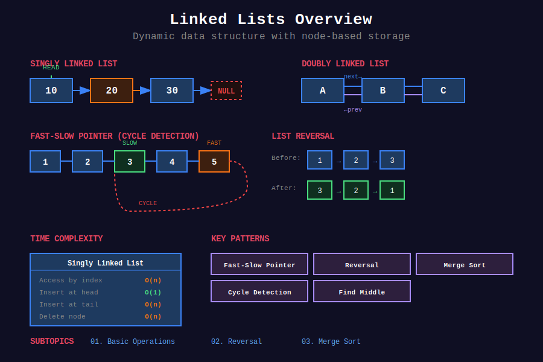

<div align="center">

# 🔗 Linked Lists



<p>
  
  
  
</p>

**Dynamic data structure with non-contiguous memory allocation**

[⬅️ Previous: Strings](../02_strings/README.md) | [🏠 Home](../README.md) | [Next: Stacks ➡️](../04_stacks/README.md)

</div>

---

## 📐 Mathematical Foundation

### 1️⃣ Node Structure

```
+---------+---------+

|  data   |  next   |------►  next node
+---------+---------+

```

**Memory:** Each node requires $O(1)$ extra space for pointer.

**Total Space:** $O(n)$ for $n$ nodes.

---

### 2️⃣ Complexity Analysis

| Operation | Array | Linked List |
|-----------|:-----:|:-----------:|
| Access $i$-th | O(1) | **O(n)** |
| Insert at head | O(n) | **O(1)** |
| Insert at tail | O(1)* | O(n) or **O(1)** |
| Delete at head | O(n) | **O(1)** |
| Search | O(n) | O(n) |

*Amortized for dynamic array

---

### 3️⃣ Floyd's Cycle Detection

**Theorem:** If a cycle exists, slow and fast pointers will meet.

**Proof:**

Let:

- $\mu$ = distance from head to cycle start

- $\lambda$ = cycle length

- Meeting point: $k$ steps into cycle

When they meet:

- Slow traveled: $\mu + k$

- Fast traveled: $\mu + k + m\lambda$ for some $m \geq 1$

Since fast = 2 × slow:

```math
2(\mu + k) = \mu + k + m\lambda
\mu + k = m\lambda

```

**Finding cycle start:**
- Reset one pointer to head

- Move both at same speed

- They meet at cycle start

**Proof:** From meeting point, $\lambda - k$ steps to cycle start.
From head, $\mu = m\lambda - k = (m-1)\lambda + (\lambda - k)$ steps to cycle start.

---

### 4️⃣ Reversal Mathematics

**Iterative Reversal Invariant:**

At each step: `prev → ... ← current`

**After reversal:**

```math
\text{new\_head} = \text{last\_node}
\text{original\_head.next} = \text{None}

```

---

### 5️⃣ Middle Element (Fast-Slow Pointer)

**When fast reaches end:**

```math
\text{slow position} = \lfloor n/2 \rfloor

```

**Proof:**
- Fast moves 2 steps per iteration

- Slow moves 1 step per iteration

- Fast reaches $n$, slow reaches $n/2$

---

## 📂 Subtopics Navigation

| # | Topic | Problems | Link |
|:-:|-------|:--------:|------|
| 1 | Basic Operations | 12+ | [📖 Go →](./01_basic_operations/README.md) |
| 2 | Reversal | 10+ | [📖 Go →](./02_reversal/README.md) |
| 3 | Merge & Sort | 8+ | [📖 Go →](./03_merge_sort/README.md) |

---

## 🎯 Key Techniques

### Fast-Slow Pointers

```python
def hasCycle(head: ListNode) -> bool:
    """
    Floyd's Cycle Detection.
    Time: O(n), Space: O(1)
    """
    slow = fast = head
    while fast and fast.next:
        slow = slow.next
        fast = fast.next.next
        if slow == fast:
            return True
    return False

```

### Reversal

```python
def reverseList(head: ListNode) -> ListNode:
    """
    Iterative reversal.
    Time: O(n), Space: O(1)
    """
    prev = None
    while head:
        next_node = head.next
        head.next = prev
        prev = head
        head = next_node
    return prev

```

### Dummy Node Pattern

```python
def mergeTwoLists(l1: ListNode, l2: ListNode) -> ListNode:
    """
    Merge two sorted lists.
    Dummy node simplifies edge cases.
    """
    dummy = ListNode(0)
    current = dummy
    
    while l1 and l2:
        if l1.val < l2.val:
            current.next = l1
            l1 = l1.next
        else:
            current.next = l2
            l2 = l2.next
        current = current.next
    
    current.next = l1 or l2
    return dummy.next

```

---

## 🏆 LeetCode Problems

### 🟢 Easy

| # | Problem | Technique | Time | Space |
|:-:|---------|-----------|:----:|:-----:|
| 21 | [Merge Two Sorted Lists](https://leetcode.com/problems/merge-two-sorted-lists/) | Dummy Node | O(n+m) | O(1) |
| 83 | [Remove Duplicates from Sorted List](https://leetcode.com/problems/remove-duplicates-from-sorted-list/) | Linear Scan | O(n) | O(1) |
| 141 | [Linked List Cycle](https://leetcode.com/problems/linked-list-cycle/) | Floyd's | O(n) | O(1) |
| 160 | [Intersection of Two Lists](https://leetcode.com/problems/intersection-of-two-linked-lists/) | Two Pointers | O(n+m) | O(1) |
| 203 | [Remove Linked List Elements](https://leetcode.com/problems/remove-linked-list-elements/) | Dummy Node | O(n) | O(1) |
| 206 | [Reverse Linked List](https://leetcode.com/problems/reverse-linked-list/) | Iterative | O(n) | O(1) |
| 234 | [Palindrome Linked List](https://leetcode.com/problems/palindrome-linked-list/) | Fast-Slow + Reverse | O(n) | O(1) |
| 876 | [Middle of the Linked List](https://leetcode.com/problems/middle-of-the-linked-list/) | Fast-Slow | O(n) | O(1) |

### 🟡 Medium

| # | Problem | Technique | Time | Space |
|:-:|---------|-----------|:----:|:-----:|
| 2 | [Add Two Numbers](https://leetcode.com/problems/add-two-numbers/) | Carry | O(n) | O(1) |
| 19 | [Remove Nth Node From End](https://leetcode.com/problems/remove-nth-node-from-end-of-list/) | Two Pointers | O(n) | O(1) |
| 24 | [Swap Nodes in Pairs](https://leetcode.com/problems/swap-nodes-in-pairs/) | Recursion | O(n) | O(n) |
| 61 | [Rotate List](https://leetcode.com/problems/rotate-list/) | Connect Tail | O(n) | O(1) |
| 82 | [Remove Duplicates II](https://leetcode.com/problems/remove-duplicates-from-sorted-list-ii/) | Dummy + Skip | O(n) | O(1) |
| 92 | [Reverse Linked List II](https://leetcode.com/problems/reverse-linked-list-ii/) | In-place | O(n) | O(1) |
| 142 | [Linked List Cycle II](https://leetcode.com/problems/linked-list-cycle-ii/) | Floyd's | O(n) | O(1) |
| 143 | [Reorder List](https://leetcode.com/problems/reorder-list/) | Split + Reverse | O(n) | O(1) |
| 148 | [Sort List](https://leetcode.com/problems/sort-list/) | Merge Sort | O(n log n) | O(log n) |
| 328 | [Odd Even Linked List](https://leetcode.com/problems/odd-even-linked-list/) | Two Lists | O(n) | O(1) |

### 🔴 Hard

| # | Problem | Technique | Time | Space |
|:-:|---------|-----------|:----:|:-----:|
| 23 | [Merge k Sorted Lists](https://leetcode.com/problems/merge-k-sorted-lists/) | Min Heap | O(n log k) | O(k) |
| 25 | [Reverse Nodes in k-Group](https://leetcode.com/problems/reverse-nodes-in-k-group/) | Group Reverse | O(n) | O(1) |

---

---

## 💡 Key Insights & Pro Tips

> **🎯 Dummy Node Magic**  
> Use dummy node to simplify edge cases. Return `dummy.next` instead of tracking head changes.

> **⚡ Fast-Slow Pointers**  
> Universal pattern: find middle, detect cycle, check palindrome. When fast reaches end, slow is at middle.

> **🔄 Reversal Template**  
> Three pointers: prev, current, next. Save next, reverse link, advance all three.

> **📊 Two Pointers for Distance**  
> Gap of k nodes: advance first pointer k steps, then move both together. First reaches end → second at target.

> **🔍 Cycle Detection Proof**  
> Meeting point mathematics: μ + k = mλ. From meeting to start = from head to start.

---

## 🧮 Quick Pattern Reference

| Pattern in Problem | Technique | Example |
|-------------------|-----------|---------|
| "middle of list" | Fast-Slow Pointers | #876 |
| "cycle detection" | Floyd's Algorithm | #141, #142 |
| "reverse" | Iterative 3-pointer | #206, #92 |
| "merge sorted" | Dummy Node | #21, #23 |
| "nth from end" | Two Pointers with gap | #19 |
| "palindrome" | Fast-Slow + Reverse | #234 |
| "intersection" | Length difference | #160 |
| "sort list" | Merge Sort | #148 |

---

## 🎯 Must-Solve Problems (Top 15)

| # | Problem | Category | Difficulty | Why Important |
|:-:|---------|----------|------------|---------------|
| 1 | [Reverse Linked List](https://leetcode.com/problems/reverse-linked-list/) | Reversal | 🟢 Easy | Foundation |
| 2 | [Linked List Cycle](https://leetcode.com/problems/linked-list-cycle/) | Cycle | 🟢 Easy | Floyd's basics |
| 3 | [Merge Two Sorted Lists](https://leetcode.com/problems/merge-two-sorted-lists/) | Merge | 🟢 Easy | Core pattern |
| 4 | [Remove Nth From End](https://leetcode.com/problems/remove-nth-node-from-end-of-list/) | Two Pointers | 🟡 Medium | Gap technique |
| 5 | [Middle of Linked List](https://leetcode.com/problems/middle-of-the-linked-list/) | Fast-Slow | 🟢 Easy | Essential |
| 6 | [Palindrome Linked List](https://leetcode.com/problems/palindrome-linked-list/) | Multiple | 🟢 Easy | Combines patterns |
| 7 | [Linked List Cycle II](https://leetcode.com/problems/linked-list-cycle-ii/) | Cycle | 🟡 Medium | Floyd's advanced |
| 8 | [Intersection of Lists](https://leetcode.com/problems/intersection-of-two-linked-lists/) | Two Pointers | 🟢 Easy | Length trick |
| 9 | [Reverse Linked List II](https://leetcode.com/problems/reverse-linked-list-ii/) | Reversal | 🟡 Medium | Partial reverse |
| 10 | [Reorder List](https://leetcode.com/problems/reorder-list/) | Multiple | 🟡 Medium | Split+Reverse+Merge |
| 11 | [Add Two Numbers](https://leetcode.com/problems/add-two-numbers/) | Math | 🟡 Medium | Carry handling |
| 12 | [Sort List](https://leetcode.com/problems/sort-list/) | Merge Sort | 🟡 Medium | O(n log n) |
| 13 | [Swap Nodes in Pairs](https://leetcode.com/problems/swap-nodes-in-pairs/) | Reversal | 🟡 Medium | Pair operations |
| 14 | [Merge k Sorted Lists](https://leetcode.com/problems/merge-k-sorted-lists/) | Heap | 🔴 Hard | Priority queue |
| 15 | [Reverse Nodes in k-Group](https://leetcode.com/problems/reverse-nodes-in-k-group/) | Reversal | 🔴 Hard | Group reverse |

---

## 📚 References & Learning Resources

### 📖 Books & Courses

| Resource | Description | Link |
|----------|-------------|------|
| **CLRS Chapter 10** | Linked lists fundamentals | [MIT Press](https://mitpress.mit.edu/books/introduction-algorithms) |
| **Algorithms 4th Edition** | Sedgewick & Wayne | [Book Site](https://algs4.cs.princeton.edu/) |
| **Competitive Programming 3** | Chapter 2.2 - Data structures | [Book](https://cpbook.net/) |

### 🌐 Online Tutorials

| Resource | Description | Link |
|----------|-------------|------|
| **GeeksforGeeks** | Complete linked list guide | [Tutorial](https://www.geeksforgeeks.org/data-structures/linked-list/) |
| **LeetCode Explore** | Linked list card | [Course](https://leetcode.com/explore/learn/card/linked-list/) |
| **VisuAlgo** | Interactive visualizations | [Website](https://visualgo.net/en/list) |
| **HackerRank** | Linked list challenges | [Practice](https://www.hackerrank.com/domains/data-structures?filters%5Bsubdomains%5D%5B%5D=linked-lists) |

### 📺 Video Resources

| Resource | Topic | Link |
|----------|-------|------|
| **NeetCode** | Linked list playlist | [YouTube](https://www.youtube.com/playlist?list=PLot-Xpze53leU0Ec0VkBhnf4npMRFiNcB) |
| **Abdul Bari** | Linked list lectures | [YouTube](https://www.youtube.com/watch?v=NobHlGUjV3g&list=PLDN4rrl48XKpZkf03iYFl-O29szjTrs_O&index=6) |
| **Back To Back SWE** | Linked list problems | [YouTube](https://www.youtube.com/playlist?list=PLiQ766zSC5jM2OKVr8sooOuGgZkvnOCTI) |
| **William Fiset** | Data structures series | [YouTube](https://www.youtube.com/watch?v=RBSGKlAvoiM) |
| **MIT OCW 6.006** | Lecture on pointers | [MIT](https://ocw.mit.edu/courses/6-006-introduction-to-algorithms-fall-2011/) |

### 📝 Practice Platforms

| Platform | Focus | Link |
|----------|-------|------|
| **LeetCode** | Interview problems | [Linked List Tag](https://leetcode.com/tag/linked-list/) |
| **HackerRank** | Data structures cert | [Practice](https://www.hackerrank.com/domains/data-structures?filters%5Bsubdomains%5D%5B%5D=linked-lists) |
| **Codeforces** | Competitive problems | [Problemset](https://codeforces.com/problemset) |
| **CodeChef** | Practice section | [Problems](https://www.codechef.com/practice) |

### 🔬 Advanced Topics

| Topic | Description | Link |
|-------|-------------|------|
| **Floyd's Cycle Detection** | Tortoise and hare | [Wikipedia](https://en.wikipedia.org/wiki/Cycle_detection) |
| **XOR Linked List** | Memory-efficient doubly linked | [GeeksforGeeks](https://www.geeksforgeeks.org/xor-linked-list-a-memory-efficient-doubly-linked-list-set-1/) |
| **Skip List** | Probabilistic data structure | [Wikipedia](https://en.wikipedia.org/wiki/Skip_list) |
| **Unrolled Linked List** | Cache-friendly variant | [Wikipedia](https://en.wikipedia.org/wiki/Unrolled_linked_list) |

### 🎯 Problem Collections

| Collection | Focus | Link |
|-----------|-------|------|
| **NeetCode 150** | Essential problems | [List](https://neetcode.io/practice) |
| **Blind 75** | Core interview questions | [List](https://www.teamblind.com/post/New-Year-Gift---Curated-List-of-Top-75-LeetCode-Questions-to-Save-Your-Time-OaM1orEU) |
| **Grind 75** | Structured preparation | [Guide](https://www.techinterviewhandbook.org/grind75) |
| **Striver's SDE Sheet** | Must-do problems | [Sheet](https://takeuforward.org/interviews/strivers-sde-sheet-top-coding-interview-problems/) |

### 📊 Visualization Tools

| Tool | Purpose | Link |
|------|---------|------|
| **VisuAlgo** | Interactive linked list ops | [Website](https://visualgo.net/en/list) |
| **Algorithm Visualizer** | Step-by-step execution | [Website](https://algorithm-visualizer.org/) |
| **CS Animations** | Data structure animations | [Website](https://www.cs.usfca.edu/~galles/visualization/Algorithms.html) |

### 🏆 Competition Resources

| Resource | Topic | Link |
|----------|-------|------|
| **USACO Guide** | Data structures guide | [Guide](https://usaco.guide/) |
| **TopCoder Tutorials** | Advanced techniques | [Tutorials](https://www.topcoder.com/thrive/articles/) |
| **Codeforces EDU** | Educational courses | [Course](https://codeforces.com/edu/course/2) |

---

## 🎖️ Interview Success Tips

### Common Mistakes to Avoid

❌ **Don't:**
- Forget to check for null pointers

- Lose reference to head when modifying

- Forget dummy node for edge cases

- Modify list while iterating without saving next

- Skip drawing diagrams

✅ **Do:**
- Always check `if not head` or `if not head.next`
- Use dummy node for insertions/deletions

- Draw small examples (3-5 nodes)

- Test with empty list, single node, two nodes

- Verify pointer updates carefully

### Optimization Checklist

```
[ ] Can I use dummy node to simplify?
[ ] Is fast-slow pointers applicable?
[ ] Should I use two pointers with gap?
[ ] Can I reverse in-place?
[ ] Do I need to restore the list after?
[ ] Am I handling all null pointer cases?

```

---

## 🌟 Motivational Corner

> "Linked lists teach you pointer manipulation - a fundamental skill for all advanced data structures."

**Progress Tracker:**
- 🥉 **Bronze:** Solve 15 linked list problems

- 🥈 **Silver:** Solve 30 linked list problems

- 🥇 **Gold:** Solve 50 linked list problems

- 💎 **Platinum:** Master Floyd's algorithm and merge sort

**Remember:** Draw diagrams! Visual understanding > memorization 📝

---

<div align="center">

### 🌟 If this helped you, give it a ⭐ on GitHub! 🌟

**Made with ❤️ for the coding community by [Gaurav Goswami](https://github.com/Gaurav14cs17)**

[⬅️ Previous: Strings](../02_strings/README.md) | [🏠 Home](../README.md) | [Next: Stacks ➡️](../04_stacks/README.md)

---

*Last Updated: December 2025*  
*Licensed under MIT*  
*Happy Coding! 💻✨*

</div>
