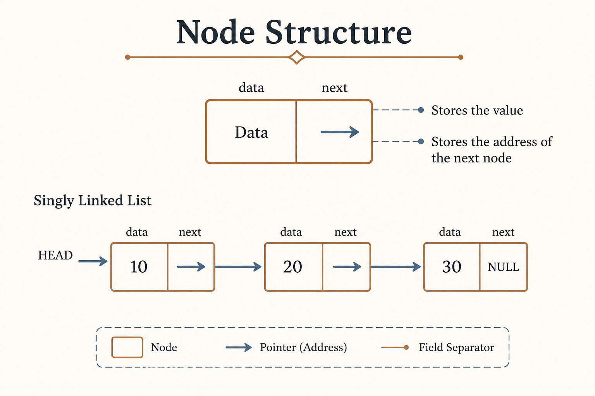

<div align="center">

# 🔗 Linked Lists

### *Dynamic data structure with non-contiguous memory allocation*


<p>
  
  
  
</p>

**Dynamic data structure with non-contiguous memory allocation**

[⬅️ Previous: Strings](../02_strings/README.md) | [🏠 Home](../README.md) | [Next: Stacks ➡️](../04_stacks/README.md)

</div>

---

## 📊 Visual Overview

<div align="center">

### Node Structure


</div>

---

## 🎯 At a Glance

| | |
|:---|:---|
| **In one line** | Dynamic data structure with non-contiguous memory allocation |
| **Difficulty** | Easy to Medium |
| **Subtopics** | 3 |
| **Problems** | 40+ |

{: .highlight }
> **How to use this page:** Start with the visual overview, scan **At a Glance**, then work through theory → walkthroughs → code.

---

## 📂 Subtopics Navigation

| # | Topic | Problems | Link |
|:-:|-------|:--------:|------|
| 1 | Basic Operations | 12+ | [📖 Go →](./01_basic_operations/README.md) |
| 2 | Reversal | 10+ | [📖 Go →](./02_reversal/README.md) |
| 3 | Merge & Sort | 8+ | [📖 Go →](./03_merge_sort/README.md) |

---

## 📐 Mathematical Foundation

### 1️⃣ Node Structure


**Memory:** Each node requires $O(1)$ extra space for pointer.

**Total Space:** $O(n)$ for $n$ nodes.

---

### 2️⃣ Complexity Analysis

| Operation | Array | Linked List |
|-----------|:-----:|:-----------:|
| Access $i$-th | O(1) | **O(n)** |
| Insert at head | O(n) | **O(1)** |
| Insert at tail | O(1)* | O(n) or **O(1)** |
| Delete at head | O(n) | **O(1)** |
| Search | O(n) | O(n) |

*Amortized for dynamic array

---

### 3️⃣ Floyd's Cycle Detection

**Theorem:** If a cycle exists, slow and fast pointers will meet.

**Proof:**

Let:

- $\mu$ = distance from head to cycle start

- $\lambda$ = cycle length

- Meeting point: $k$ steps into cycle

When they meet:

- Slow traveled: $\mu + k$

- Fast traveled: $\mu + k + m\lambda$ for some $m \geq 1$

Since fast = 2 × slow:

$$2(\mu + k) = \mu + k + m\lambda
\mu + k = m\lambda$$

**Finding cycle start:**

- Reset one pointer to head

- Move both at same speed

- They meet at cycle start

**Proof:** From meeting point, $\lambda - k$ steps to cycle start.
From head, $\mu = m\lambda - k = (m-1)\lambda + (\lambda - k)$ steps to cycle start.

---

### 4️⃣ Reversal Mathematics

**Iterative Reversal Invariant:**

At each step: `prev → ... ← current`

**After reversal:**

$$\text{new head} = \text{last node}
\text{original head.next} = \text{None}$$

---

### 5️⃣ Middle Element (Fast-Slow Pointer)

**When fast reaches end:**

$$\text{slow position} = \lfloor n/2 \rfloor$$

**Proof:**

- Fast moves 2 steps per iteration

- Slow moves 1 step per iteration

- Fast reaches $n$, slow reaches $n/2$

---

## 🎯 Key Techniques

### Fast-Slow Pointers

```python
def hasCycle(head: ListNode) -> bool:
    """
    Floyd's Cycle Detection.
    Time: O(n), Space: O(1)
    """
    slow = fast = head
    while fast and fast.next:
        slow = slow.next
        fast = fast.next.next
        if slow == fast:
            return True
    return False
```

### Reversal

```python
def reverseList(head: ListNode) -> ListNode:
    """
    Iterative reversal.
    Time: O(n), Space: O(1)
    """
    prev = None
    while head:
        next_node = head.next
        head.next = prev
        prev = head
        head = next_node
    return prev
```

### Dummy Node Pattern

```python
def mergeTwoLists(l1: ListNode, l2: ListNode) -> ListNode:
    """
    Merge two sorted lists.
    Dummy node simplifies edge cases.
    """
    dummy = ListNode(0)
    current = dummy
    
    while l1 and l2:
        if l1.val < l2.val:
            current.next = l1
            l1 = l1.next
        else:
            current.next = l2
            l2 = l2.next
        current = current.next
    
    current.next = l1 or l2
    return dummy.next
```


### Pattern Checklist

- [ ] Can I use dummy node to simplify?
- [ ] Is fast-slow pointers applicable?
- [ ] Should I use two pointers with gap?
- [ ] Can I reverse in-place?
- [ ] Do I need to restore the list after?
- [ ] Am I handling all null pointer cases?


---

## 🏆 LeetCode Problems

### 🟢 Easy

| # | Problem | Pattern | Time | Space |
|:-:|---------|---------|:----:|:-----:|
| 206 | [Reverse Linked List](https://leetcode.com/problems/reverse-linked-list/) | Reversal | O(n) | O(1) |
| 141 | [Linked List Cycle](https://leetcode.com/problems/linked-list-cycle/) | Floyd's | O(n) | O(1) |
| 876 | [Middle of Linked List](https://leetcode.com/problems/middle-of-the-linked-list/) | Fast-Slow | O(n) | O(1) |
| 21 | [Merge Two Sorted Lists](https://leetcode.com/problems/merge-two-sorted-lists/) | Merge | O(n) | O(1) |

### 🟡 Medium

| # | Problem | Pattern | Time | Space |
|:-:|---------|---------|:----:|:-----:|
| 92 | [Reverse Linked List II](https://leetcode.com/problems/reverse-linked-list-ii/) | Partial Reverse | O(n) | O(1) |
| 143 | [Reorder List](https://leetcode.com/problems/reorder-list/) | Reverse + Merge | O(n) | O(1) |
| 234 | [Palindrome Linked List](https://leetcode.com/problems/palindrome-linked-list/) | Reverse Half | O(n) | O(1) |
| 142 | [Linked List Cycle II](https://leetcode.com/problems/linked-list-cycle-ii/) | Floyd's | O(n) | O(1) |

### 🔴 Hard

| # | Problem | Pattern | Time | Space |
|:-:|---------|---------|:----:|:-----:|
| 25 | [Reverse Nodes in k-Group](https://leetcode.com/problems/reverse-nodes-in-k-group/) | K-Group Reverse | O(n) | O(1) |
| 23 | [Merge K Sorted Lists](https://leetcode.com/problems/merge-k-sorted-lists/) | Merge | O(n log k) | O(k) |

---

## 📚 References & Learning Resources

### 📖 Core Concepts

| Resource | Description | Link |
|----------|-------------|------|
| **Linked List** | Wikipedia | [Linked list](https://en.wikipedia.org/wiki/Linked_list) |
| **Floyd's Cycle** | Cycle detection | [Wikipedia](https://en.wikipedia.org/wiki/Cycle_detection) |
| **LeetCode Explore** | Linked list card | [Explore Card](https://leetcode.com/explore/learn/card/linked-list/) |

### 📝 Practice

| Platform | Focus | Link |
|----------|-------|------|
| **LeetCode** | Linked list tag | [Problems](https://leetcode.com/tag/linked-list/) |

---

## 🌟 Motivational Corner

> "Linked lists teach you pointer manipulation - a fundamental skill for all advanced data structures."

**Progress Tracker:**

- 🥉 **Bronze:** Solve 15 linked list problems

- 🥈 **Silver:** Solve 30 linked list problems

- 🥇 **Gold:** Solve 50 linked list problems

- 💎 **Platinum:** Master Floyd's algorithm and merge sort

**Remember:** Draw diagrams! Visual understanding > memorization 📝

---

<div align="center">

### 🌟 If this helped you, give it a ⭐ on GitHub! 🌟

**Made with ❤️ for the coding community by [Gaurav Goswami](https://github.com/Gaurav14cs17)**

[⬅️ Previous: Strings](../02_strings/README.md) | [🏠 Home](../README.md) | [Next: Stacks ➡️](../04_stacks/README.md)

---

*Last Updated: December 2025*  
*Licensed under MIT*  
*Happy Coding! 💻✨*

</div>
