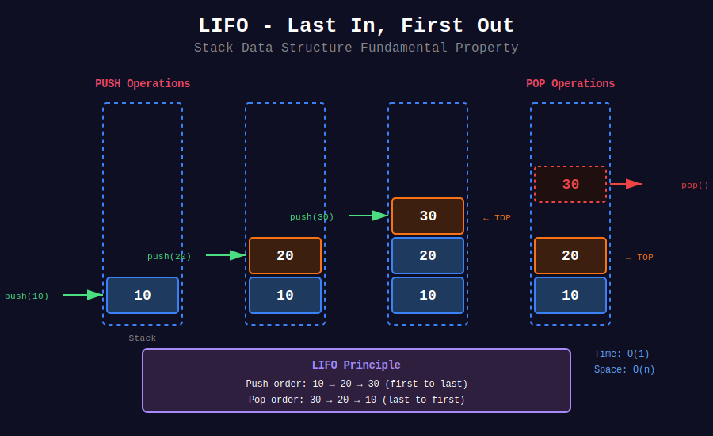
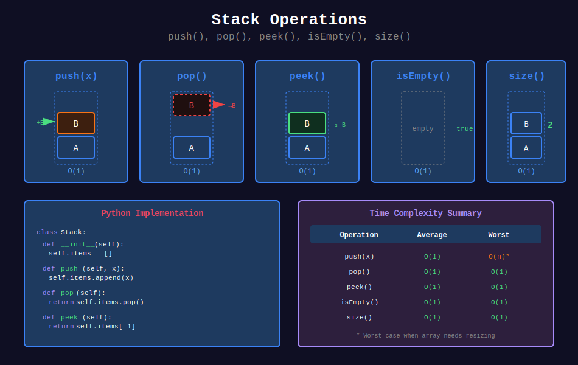
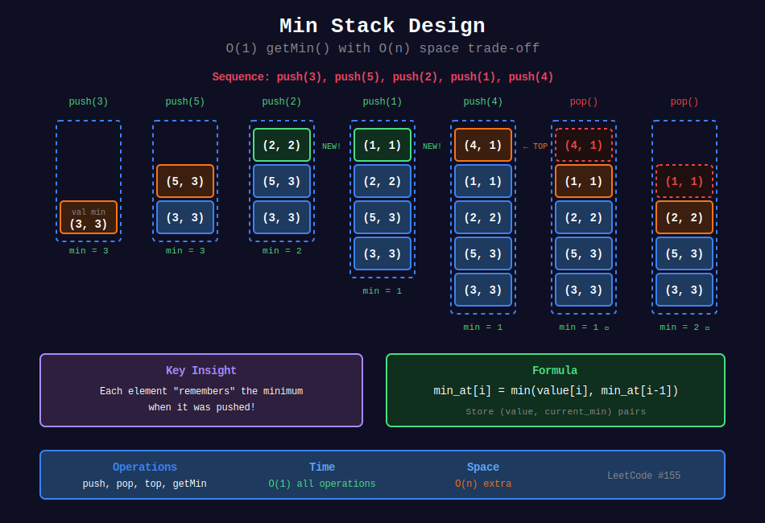
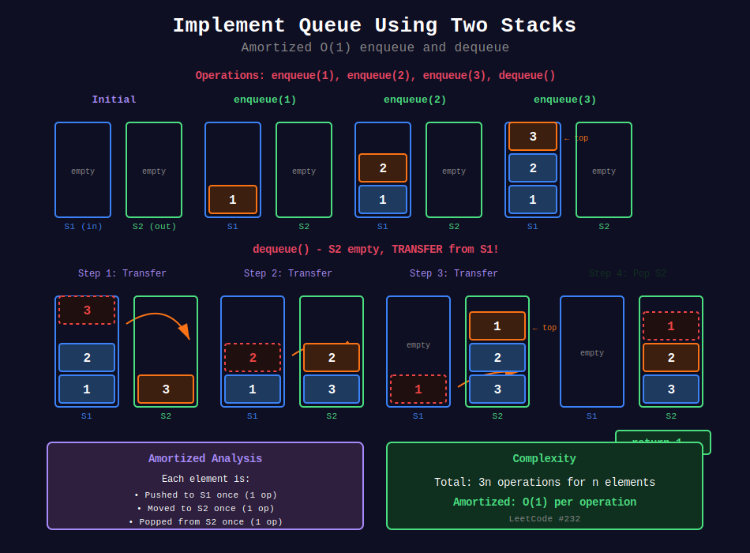

<div align="center">

# 📚 Basic Stack Operations

<p>
  
  
</p>

</div>

---

## 🎨 Visual Diagrams

<div align="center">

### 📥 LIFO - Last In, First Out



*The fundamental property of stacks: elements are removed in reverse order of insertion*

---

### ⚙️ Stack Operations



*All core operations: push(), pop(), peek(), isEmpty(), size() - each O(1)*

---

### 📊 Min Stack Design



*O(1) getMin() by storing (value, min) pairs - LeetCode #155*

---

### 🔄 Queue Using Two Stacks



*Amortized O(1) enqueue/dequeue using input and output stacks - LeetCode #232*

</div>

---

## 🧭 Navigation

| ⬅️ Previous | 📂 Current | ➡️ Next |
|:------------|:----------:|--------:|
| [🏠 Stacks Home](../README.md) | **01. Basic Stack** | [02. Parentheses →](../02_parentheses/README.md) |

---

## 📐 Mathematical Foundations

### 1️⃣ Stack as Abstract Data Type (ADT)

**Formal Definition:**

$$\boxed{S = (D, \Omega)}$$

Where:

- $D$ = domain (set of elements)

- $\Omega = \{push, pop, peek, isEmpty, size\}$ = operations

**Axioms:**

$$\begin{aligned}
pop(push(S, x)) &= S \\
peek(push(S, x)) &= x \\
isEmpty(\emptyset) &= true \\
isEmpty(push(S, x)) &= false \\
size(\emptyset) &= 0 \\
size(push(S, x)) &= size(S) + 1
\end{aligned}$$

---

### 2️⃣ LIFO Property - Mathematical Proof

**Theorem:** Stack maintains Last-In-First-Out order.

**Proof by Strong Induction:**

**Base Case:** Empty stack $\emptyset$ trivially satisfies LIFO.

**Inductive Hypothesis:** Assume stack $S$ of size $n$ maintains LIFO.

**Inductive Step:** For stack $S' = push(S, x)$:

- $x$ becomes new top element

- $pop(S')$ removes $x$ → returns to $S$

- $S$ maintains LIFO by hypothesis

- Therefore $S'$ maintains LIFO ∎

---

### 3️⃣ Time Complexity Analysis

**Array-Based Implementation:**

| Operation | Average | Worst | Amortized | Space |
|-----------|:-------:|:-----:|:---------:|:-----:|
| push(x) | **O(1)** | O(n)* | **O(1)** | O(1) |
| pop() | **O(1)** | O(1) | **O(1)** | O(1) |
| peek() | **O(1)** | O(1) | **O(1)** | O(1) |
| isEmpty() | **O(1)** | O(1) | **O(1)** | O(1) |
| size() | **O(1)** | O(1) | **O(1)** | O(1) |

*Worst case when array needs resizing

**Linked List Implementation:**

| Operation | Time | Space |
|-----------|:----:|:-----:|
| push(x) | **O(1)** | O(1) |
| pop() | **O(1)** | O(1) |
| peek() | **O(1)** | O(1) |

**Space Complexity:** $O(n)$ for $n$ elements

---

### 4️⃣ Dynamic Array Amortized Analysis

**Theorem:** Sequence of $n$ push operations has amortized cost $O(1)$ per operation.

**Proof using Accounting Method:**

Cost of operations:

- Normal push: 1 unit

- Push with resize: $1 + k$ units (where $k$ = current size)

Charge 3 units per push:

- 1 unit for actual push

- 2 units saved for future resize

When resizing from size $k$ to $2k$:

- Cost: $k$ (copy all elements)

- Saved credit: $2k$ (2 units × $k$ elements)

- Sufficient to pay for resize!

**Total cost for $n$ pushes:**

$$\sum_{i=0}^{\log n} 2^i = 2^{\log n + 1} - 1 < 2n$$

**Amortized cost:** $\frac{3n}{n} = O(1)$ ∎

---

### 5️⃣ Min Stack Design - Mathematical Insight

**Problem:** Support getMin() in O(1) along with push/pop in O(1).

**Solution 1: Store (value, min) pairs**

$$\boxed{min_at[i] = \min(value[i], min_at[i-1])}$$

**Space:** $O(n)$ extra

**Solution 2: Store differences**

Store $difference = value - current_min$ instead of value.

$$\boxed{stored[i] = value[i] - min_at[i]}$$

When $stored[i] < 0$: new minimum found!

**Space:** $O(1)$ extra (just track one min variable)

---

### 6️⃣ Two Stacks for Queue - Amortized Analysis

**Setup:** Two stacks $S_1$ (input) and $S_2$ (output)

**Operations:**

- enqueue: push to $S_1$

- dequeue: pop from $S_2$ (transfer from $S_1$ if $S_2$ empty)

**Amortized Cost Proof:**

Each element:

1. Pushed to $S_1$ once: 1 operation

2. Moved to $S_2$ once: 1 operation  

3. Popped from $S_2$ once: 1 operation

Total: 3 operations per element

**Amortized cost per operation:** $\frac{3n}{n} = O(1)$ ∎

---

## 🎨 Visual Algorithm Walkthroughs

### Stack Operations - Complete Trace

```
+--------------------------------------------------------------------+
|  Array-Based Stack Implementation                                  |
|  Capacity: 4, Size: 0                                              |
+--------------------------------------------------------------------+

|  Initial State                                                      |
|  +----+----+----+----+                                             |
|  | __ | __ | __ | __ |  capacity = 4                               |
|  +----+----+----+----+  size = 0                                   |
|   ↑                     top = -1                                    |
|  (empty)                                                           |
+--------------------------------------------------------------------+

|  push(10)                                                          |
|  +----+----+----+----+                                             |
|  | 10 | __ | __ | __ |  size = 1                                   |
|  +----+----+----+----+  top = 0                                    |
|   ↑                                                                |
|  top                                                               |
+--------------------------------------------------------------------+

|  push(20)                                                          |
|  +----+----+----+----+                                             |
|  | 10 | 20 | __ | __ |  size = 2                                   |
|  +----+----+----+----+  top = 1                                    |
|        ↑                                                           |
|       top                                                          |
+--------------------------------------------------------------------+

|  push(30)                                                          |
|  +----+----+----+----+                                             |
|  | 10 | 20 | 30 | __ |  size = 3                                   |
|  +----+----+----+----+  top = 2                                    |
|             ↑                                                      |
|            top                                                     |
+--------------------------------------------------------------------+

|  push(40)                                                          |
|  +----+----+----+----+                                             |
|  | 10 | 20 | 30 | 40 |  size = 4 (FULL!)                           |
|  +----+----+----+----+  top = 3                                    |
|                  ↑                                                 |
|                 top                                                |
+--------------------------------------------------------------------+

|  push(50) - RESIZE NEEDED!                                         |
|                                                                    |
|  Step 1: Allocate new array (double capacity)                     |
|  +----+----+----+----+----+----+----+----+                         |
|  | __ | __ | __ | __ | __ | __ | __ | __ |  new capacity = 8       |
|  +----+----+----+----+----+----+----+----+                         |
|                                                                    |
|  Step 2: Copy existing elements                                   |
|  +----+----+----+----+----+----+----+----+                         |
|  | 10 | 20 | 30 | 40 | __ | __ | __ | __ |                         |
|  +----+----+----+----+----+----+----+----+                         |
|                                                                    |
|  Step 3: Add new element                                          |
|  +----+----+----+----+----+----+----+----+                         |
|  | 10 | 20 | 30 | 40 | 50 | __ | __ | __ |  size = 5               |
|  +----+----+----+----+----+----+----+----+  top = 4                |
|                       ↑                                            |
|                      top                                           |
+--------------------------------------------------------------------+

|  pop() → returns 50                                                |
|  +----+----+----+----+----+----+----+----+                         |
|  | 10 | 20 | 30 | 40 | __ | __ | __ | __ |  size = 4               |
|  +----+----+----+----+----+----+----+----+  top = 3                |
|                  ↑                                                 |
|                 top                                                |
+--------------------------------------------------------------------+

|  peek() → returns 40 (doesn't remove)                              |
|  +----+----+----+----+----+----+----+----+                         |
|  | 10 | 20 | 30 | 40 | __ | __ | __ | __ |  size = 4               |
|  +----+----+----+----+----+----+----+----+  top = 3 (unchanged)    |
|                  ↑                                                 |
|                 top                                                |
+--------------------------------------------------------------------+

```

---

### Min Stack - Detailed Visualization

```
Problem: Design stack with O(1) getMin(), push(), pop()

Solution: Store (value, min_so_far) pairs

+--------------------------------------------------------------------+

|  Sequence: push(3), push(5), push(2), push(1), push(4)             |
+--------------------------------------------------------------------+
|  After push(3):                                                     |
|  +--------------+                                                  |
|  |  (3, 3)      |  ← top                                           |
|  +--------------+                                                  |
|   value=3, min=3                                                   |
|                                                                    |
|  getMin() = 3 ✓                                                    |
+--------------------------------------------------------------------+

|  After push(5):                                                     |
|  +--------------+                                                  |
|  |  (5, 3)      |  ← top                                           |
|  +--------------+                                                  |
|  |  (3, 3)      |                                                  |
|  +--------------+                                                  |
|   min(5, 3) = 3                                                    |
|                                                                    |
|  getMin() = 3 ✓                                                    |
+--------------------------------------------------------------------+

|  After push(2):                                                     |
|  +--------------+                                                  |
|  |  (2, 2)      |  ← top (NEW MINIMUM!)                            |
|  +--------------+                                                  |
|  |  (5, 3)      |                                                  |
|  +--------------+                                                  |
|  |  (3, 3)      |                                                  |
|  +--------------+                                                  |
|   min(2, 3) = 2                                                    |
|                                                                    |
|  getMin() = 2 ✓                                                    |
+--------------------------------------------------------------------+

|  After push(1):                                                     |
|  +--------------+                                                  |
|  |  (1, 1)      |  ← top (NEW MINIMUM!)                            |
|  +--------------+                                                  |
|  |  (2, 2)      |                                                  |
|  +--------------+                                                  |
|  |  (5, 3)      |                                                  |
|  +--------------+                                                  |
|  |  (3, 3)      |                                                  |
|  +--------------+                                                  |
|   min(1, 2) = 1                                                    |
|                                                                    |
|  getMin() = 1 ✓                                                    |
+--------------------------------------------------------------------+

|  After push(4):                                                     |
|  +--------------+                                                  |
|  |  (4, 1)      |  ← top                                           |
|  +--------------+                                                  |
|  |  (1, 1)      |                                                  |
|  +--------------+                                                  |
|  |  (2, 2)      |                                                  |
|  +--------------+                                                  |
|  |  (5, 3)      |                                                  |
|  +--------------+                                                  |
|  |  (3, 3)      |                                                  |
|  +--------------+                                                  |
|   min(4, 1) = 1                                                    |
|                                                                    |
|  getMin() = 1 ✓                                                    |
+--------------------------------------------------------------------+

|  After pop():                                                       |
|  +--------------+                                                  |
|  |  (1, 1)      |  ← top                                           |
|  +--------------+                                                  |
|  |  (2, 2)      |                                                  |
|  +--------------+                                                  |
|  |  (5, 3)      |                                                  |
|  +--------------+                                                  |
|  |  (3, 3)      |                                                  |
|  +--------------+                                                  |
|  Removed (4, 1)                                                    |
|  getMin() = 1 ✓ (still correct!)                                  |
+--------------------------------------------------------------------+

|  After pop():                                                       |
|  +--------------+                                                  |
|  |  (2, 2)      |  ← top                                           |
|  +--------------+                                                  |
|  |  (5, 3)      |                                                  |
|  +--------------+                                                  |
|  |  (3, 3)      |                                                  |
|  +--------------+                                                  |
|  Removed (1, 1)                                                    |
|  getMin() = 2 ✓ (minimum updated automatically!)                  |
|                                                                    |
|  Key Insight: Each element "remembers" what the minimum was        |
|  when it was pushed. Popping automatically restores correct min!   |
+--------------------------------------------------------------------+

```

---

### Two Stacks for Queue - Amortized Analysis

```
Implement Queue using two stacks: S1 (input) and S2 (output)

+--------------------------------------------------------------------+

|  Operations: enqueue(1), enqueue(2), enqueue(3), dequeue()         |
+--------------------------------------------------------------------+
|  Initial State                                                      |
|  S1 (input): []          S2 (output): []                           |
|  (empty)                 (empty)                                   |
+--------------------------------------------------------------------+

|  enqueue(1) - Push to S1                                           |
|  +----+                                                            |
|  | 1  | ← S1 top         S2: []                                    |
|  +----+                                                            |
|  Cost: O(1)                                                        |
+--------------------------------------------------------------------+

|  enqueue(2) - Push to S1                                           |
|  +----+                                                            |
|  | 2  | ← S1 top         S2: []                                    |
|  +----+                                                            |
|  | 1  |                                                            |
|  +----+                                                            |
|  Cost: O(1)                                                        |
+--------------------------------------------------------------------+

|  enqueue(3) - Push to S1                                           |
|  +----+                                                            |
|  | 3  | ← S1 top         S2: []                                    |
|  +----+                                                            |
|  | 2  |                                                            |
|  +----+                                                            |
|  | 1  |                                                            |
|  +----+                                                            |
|  Cost: O(1)                                                        |
+--------------------------------------------------------------------+

|  dequeue() - S2 empty, transfer from S1!                           |
|                                                                    |
|  Step 1: Transfer S1 → S2                                          |
|  Pop 3 from S1, push to S2                                         |
|  +----+             +----+                                         |
|  | 2  | ← S1        | 3  | ← S2                                    |
|  +----+             +----+                                         |
|  | 1  |                                                            |
|  +----+                                                            |
|                                                                    |
|  Pop 2 from S1, push to S2                                         |
|  +----+             +----+                                         |
|  | 1  | ← S1        | 2  | ← S2                                    |
|  +----+             +----+                                         |
|                     | 3  |                                         |
|                     +----+                                         |
|                                                                    |
|  Pop 1 from S1, push to S2                                         |
|  S1: []             +----+                                         |
|  (empty)            | 1  | ← S2 top                                |
|                     +----+                                         |
|                     | 2  |                                         |
|                     +----+                                         |
|                     | 3  |                                         |
|                     +----+                                         |
|                                                                    |
|  Step 2: Pop from S2                                               |
|  S1: []             +----+                                         |
|  (empty)            | 2  | ← S2 top                                |
|                     +----+                                         |
|                     | 3  |                                         |
|                     +----+                                         |
|  Returned: 1 ✓                                                     |
|  Cost: O(3) for this operation                                    |
+--------------------------------------------------------------------+

|  enqueue(4) - Push to S1                                           |
|  +----+             +----+                                         |
|  | 4  | ← S1        | 2  | ← S2                                    |
|  +----+             +----+                                         |
|                     | 3  |                                         |
|                     +----+                                         |
|  Cost: O(1)                                                        |
+--------------------------------------------------------------------+

|  dequeue() - S2 not empty, just pop!                               |
|  +----+             +----+                                         |
|  | 4  | ← S1        | 3  | ← S2 top                                |
|  +----+             +----+                                         |
|  Returned: 2 ✓                                                     |
|  Cost: O(1) ← Cheap because no transfer needed!                   |
|                                                                    |
|  Key Insight: Element 2 was already transferred in previous        |
|  dequeue. We reuse that work! Amortized O(1).                     |
+--------------------------------------------------------------------+

Amortized Analysis:

- Each element: pushed to S1 once, moved to S2 once, popped once

- Total: 3 operations per element

- Amortized: O(1) per enqueue/dequeue ✓

```

---

## 💻 Code Implementations

```python
class Stack:
    """
    Basic stack implementation using Python list.
    
    All operations are O(1) average case.
    Python list handles dynamic resizing automatically.
    """
    def __init__(self):
        self.items = []
    
    def push(self, x: int) -> None:
        """Add element to top of stack."""
        self.items.append(x)
    
    def pop(self) -> int:
        """Remove and return top element."""
        if self.is_empty():
            raise IndexError("pop from empty stack")
        return self.items.pop()
    
    def peek(self) -> int:
        """Return top element without removing."""
        if self.is_empty():
            raise IndexError("peek from empty stack")
        return self.items[-1]
    
    def is_empty(self) -> bool:
        """Check if stack is empty."""
        return len(self.items) == 0
    
    def size(self) -> int:
        """Return number of elements."""
        return len(self.items)
    
    def __str__(self) -> str:
        """String representation (top at right)."""
        return " <- ".join(map(str, self.items)) + " <- TOP"

class MinStack:
    """
    Stack with O(1) getMin operation.
    
    Strategy: Each element stores (value, current_minimum).
    When we pop, the previous minimum is automatically restored.
    
    Space: O(n) - stores 2 integers per element
    Time: O(1) for all operations
    """
    def __init__(self):
        self.stack = []  # Stores (value, min_so_far) tuples
    
    def push(self, val: int) -> None:
        """
        Push value and update minimum.
        
        Mathematical formula:
        min_at[i] = min(val, min_at[i-1])
        """
        if not self.stack:
            current_min = val
        else:
            current_min = min(val, self.stack[-1][1])
        
        self.stack.append((val, current_min))
    
    def pop(self) -> None:
        """Remove top element."""
        if not self.stack:
            raise IndexError("pop from empty stack")
        self.stack.pop()
    
    def top(self) -> int:
        """Get top value (not the minimum)."""
        if not self.stack:
            raise IndexError("top from empty stack")
        return self.stack[-1][0]
    
    def getMin(self) -> int:
        """
        Get current minimum in O(1).
        
        Key insight: Top element "remembers" what min was when pushed.
        """
        if not self.stack:
            raise IndexError("getMin from empty stack")
        return self.stack[-1][1]

class MinStackOptimized:
    """
    Space-optimized Min Stack using difference method.
    
    Store difference from minimum instead of (value, min) pairs.
    When difference < 0, we found a new minimum!
    
    Space: O(1) extra (only one min variable)
    """
    def __init__(self):
        self.stack = []
        self.min_val = None
    
    def push(self, val: int) -> None:
        if not self.stack:
            self.stack.append(0)
            self.min_val = val
        else:
            # Store difference from current min
            diff = val - self.min_val
            self.stack.append(diff)
            
            # If diff < 0, val is new minimum
            if diff < 0:
                self.min_val = val
    
    def pop(self) -> None:
        if not self.stack:
            raise IndexError("pop from empty stack")
        
        diff = self.stack.pop()
        
        # If we're popping the minimum, restore previous min
        if diff < 0:
            self.min_val = self.min_val - diff
    
    def top(self) -> int:
        if not self.stack:
            raise IndexError("top from empty stack")
        
        diff = self.stack[-1]
        
        # If diff < 0, top is the current minimum
        if diff < 0:
            return self.min_val
        else:
            return self.min_val + diff
    
    def getMin(self) -> int:
        if self.min_val is None:
            raise IndexError("getMin from empty stack")
        return self.min_val

class MyQueue:
    """
    Queue implementation using two stacks.
    
    Amortized O(1) for all operations.
    
    Strategy:
    - S1 (input): receives all enqueue operations
    - S2 (output): handles all dequeue operations
    - Transfer from S1 to S2 only when S2 is empty
    
    Key insight: Each element moves at most once from S1 to S2.
    """
    def __init__(self):
        self.s1 = []  # Input stack
        self.s2 = []  # Output stack
    
    def push(self, x: int) -> None:
        """Enqueue: O(1)"""
        self.s1.append(x)
    
    def pop(self) -> int:
        """
        Dequeue: Amortized O(1)
        
        Worst case: O(n) when transferring all elements
        But this happens rarely, amortized is O(1)
        """
        self._ensure_output()
        return self.s2.pop()
    
    def peek(self) -> int:
        """Front of queue: Amortized O(1)"""
        self._ensure_output()
        return self.s2[-1]
    
    def empty(self) -> bool:
        """Check if queue is empty: O(1)"""
        return not self.s1 and not self.s2
    
    def _ensure_output(self):
        """
        Transfer elements from S1 to S2 if S2 is empty.
        
        This reverses the order, giving us FIFO behavior.
        """
        if not self.s2:
            while self.s1:
                self.s2.append(self.s1.pop())

def remove_adjacent_duplicates(s: str) -> str:
    """
    Remove all adjacent duplicate characters.
    
    Example: "abbaca" → "ca"
    
    Stack-based approach:
    - Push character if stack empty or different from top
    - Pop if same as top (duplicate found)
    
    Time: O(n), Space: O(n)
    """
    stack = []
    
    for char in s:
        if stack and stack[-1] == char:
            stack.pop()  # Remove duplicate
        else:
            stack.append(char)
    
    return ''.join(stack)

def simplify_path(path: str) -> str:
    """
    Simplify Unix file path.
    
    Examples:
    "/home/" → "/home"
    "/a/./b/../../c/" → "/c"
    "/../" → "/"
    
    Algorithm:
    - Split by '/'
    - '..' → pop from stack (go up)
    - '.' or empty → skip
    - valid name → push to stack
    
    Time: O(n), Space: O(n)
    """
    stack = []
    
    for part in path.split('/'):
        if part == '..' and stack:
            stack.pop()  # Go up one directory
        elif part and part != '.' and part != '..':
            stack.append(part)  # Valid directory name
    
    return '/' + '/'.join(stack)

def baseball_game(operations: list[str]) -> int:
    """
    Calculate score in baseball game.
    
    Rules:
    - Integer: Add this score
    - '+': Add sum of last two scores
    - 'D': Add double of last score
    - 'C': Remove last score
    
    Time: O(n), Space: O(n)
    """
    stack = []
    
    for op in operations:
        if op == '+':
            stack.append(stack[-1] + stack[-2])
        elif op == 'D':
            stack.append(2 * stack[-1])
        elif op == 'C':
            stack.pop()
        else:
            stack.append(int(op))
    
    return sum(stack)

```

---

## 🏆 LeetCode Problems

### 🟢 Easy

| # | Problem | Pattern | Time | Space |
|:-:|---------|---------|:----:|:-----:|
| 20 | [Valid Parentheses](https://leetcode.com/problems/valid-parentheses/) | Stack Matching | O(n) | O(n) |
| 155 | [Min Stack](https://leetcode.com/problems/min-stack/) | Auxiliary Data | O(1) all ops | O(n) |
| 225 | [Implement Stack using Queues](https://leetcode.com/problems/implement-stack-using-queues/) | Two Queues | O(n) push | O(n) |
| 232 | [Implement Queue using Stacks](https://leetcode.com/problems/implement-queue-using-stacks/) | Two Stacks | O(1)* | O(n) |
| 496 | [Next Greater Element I](https://leetcode.com/problems/next-greater-element-i/) | Monotonic Stack | O(n) | O(n) |
| 682 | [Baseball Game](https://leetcode.com/problems/baseball-game/) | Stack Simulation | O(n) | O(n) |
| 844 | [Backspace String Compare](https://leetcode.com/problems/backspace-string-compare/) | Stack | O(n) | O(n) |
| 1047 | [Remove All Adjacent Duplicates](https://leetcode.com/problems/remove-all-adjacent-duplicates-in-string/) | Stack | O(n) | O(n) |
| 1441 | [Build Array With Stack Operations](https://leetcode.com/problems/build-an-array-with-stack-operations/) | Simulation | O(n) | O(1) |

### 🟡 Medium

| # | Problem | Pattern | Time | Space |
|:-:|---------|---------|:----:|:-----:|
| 71 | [Simplify Path](https://leetcode.com/problems/simplify-path/) | Stack | O(n) | O(n) |
| 150 | [Evaluate RPN](https://leetcode.com/problems/evaluate-reverse-polish-notation/) | Stack | O(n) | O(n) |
| 341 | [Flatten Nested List Iterator](https://leetcode.com/problems/flatten-nested-list-iterator/) | Stack | O(n) | O(n) |
| 385 | [Mini Parser](https://leetcode.com/problems/mini-parser/) | Stack | O(n) | O(n) |
| 636 | [Exclusive Time of Functions](https://leetcode.com/problems/exclusive-time-of-functions/) | Call Stack | O(n) | O(n) |
| 1209 | [Remove All Adjacent Duplicates II](https://leetcode.com/problems/remove-all-adjacent-duplicates-in-string-ii/) | Stack with Count | O(n) | O(n) |

### 🔴 Hard

| # | Problem | Pattern | Time | Space |
|:-:|---------|---------|:----:|:-----:|
| 895 | [Maximum Frequency Stack](https://leetcode.com/problems/maximum-frequency-stack/) | Freq + Stacks | O(1) | O(n) |

---

## 💡 Key Insights & Pro Tips

> **🎯 LIFO = Undo Mechanism**  
> Stack is perfect for operations that need to be reversed: undo/redo, backtracking, parsing with nesting.

> **⚡ Min Stack Trick**  
> Store (value, min) pairs. Each element "remembers" the minimum at that point in time. Elegant!

> **🔄 Two Stacks for Queue**  
> Amortized O(1)! Each element crosses the bridge (from input to output stack) exactly once.

> **📊 When to Use Stack**  
> Keywords: "matching", "nested", "most recent", "undo", "backtrack", "reverse order", "valid pairs".

> **🔍 Stack vs Recursion**  
> Recursion uses implicit call stack. Iterative with explicit stack = same power, more control!

> **💰 Space-Time Trade-off**  
> Min Stack: Pay O(n) space to get O(1) getMin(). Worth it if min queries are frequent!

---

## 🎓 Pattern Recognition Guide

### Identifying Stack Problems

| Problem Contains... | Pattern | Example |
|-------------------|---------|---------|
| "undo/redo" | Stack as history | Text editor |
| "most recent" | LIFO access | Min stack |
| "backspace" | Remove last | #844 |
| "simplify path" | Process tokens | #71 |
| "adjacent duplicates" | Match & remove | #1047 |
| "two data structures" | Convert ADT | #232 |
| "call/return" | Simulate calls | #636 |
| "baseball rounds" | Stateful simulation | #682 |

---

## 🧮 Complexity Comparison

### Stack Implementations

| Implementation | push | pop | peek | Space |
|---------------|:----:|:---:|:----:|:-----:|
| **Array (Fixed)** | O(1) | O(1) | O(1) | O(n) |
| **Array (Dynamic)** | O(1)* | O(1) | O(1) | O(n) |
| **Linked List** | O(1) | O(1) | O(1) | O(n) + pointers |

*Amortized for dynamic array

### Design Trade-offs

| Design | Benefit | Cost | When to Use |
|--------|---------|------|-------------|
| **Basic Stack** | Simple, fast | No extras | General purpose |
| **Min Stack (pairs)** | O(1) getMin | 2x space | Frequent min queries |
| **Min Stack (diff)** | O(1) space overhead | Complex logic | Space-critical |
| **Two Stacks Queue** | Amortized O(1) | Occasional O(n) | Queue from stacks |

---

## 📚 References & Learning Resources

### 📖 Core Concepts

| Resource | Topic | Link |
|----------|-------|------|
| **CLRS Chapter 10** | Stack & Queue ADTs | [MIT Press](https://mitpress.mit.edu/books/introduction-algorithms) |
| **GeeksforGeeks** | Stack implementation | [Tutorial](https://www.geeksforgeeks.org/stack-data-structure/) |
| **Wikipedia** | Stack ADT theory | [Article](https://en.wikipedia.org/wiki/Stack_(abstract_data_type)) |
| **CP Algorithms** | Advanced stack | [Guide](https://cp-algorithms.com/data_structures/stack_queue_modification.html) |

### 🎥 Video Tutorials

| Creator | Topic | Link |
|---------|-------|------|
| **MIT OCW 6.006** | Stack implementation | [Lecture](https://ocw.mit.edu/courses/6-006-introduction-to-algorithms-fall-2011/) |
| **Abdul Bari** | Stack data structure | [YouTube](https://www.youtube.com/watch?v=F1F2imiOJfk) |
| **NeetCode** | Min Stack explained | [YouTube](https://www.youtube.com/watch?v=qkLl7nAwDPo) |
| **William Fiset** | Stack applications | [YouTube](https://www.youtube.com/watch?v=wjI1WNcIntg) |

### 📝 Interactive Learning

| Platform | Focus | Link |
|----------|-------|------|
| **VisuAlgo** | Visual stack operations | [Website](https://visualgo.net/en/list) |
| **CS Animations** | Stack visualization | [Website](https://www.cs.usfca.edu/~galles/visualization/StackArray.html) |
| **Algorithm Visualizer** | Step-by-step execution | [Website](https://algorithm-visualizer.org/) |

---

## 🎯 Practice Roadmap

### Week 1: Fundamentals

1. **Implement basic stack** - Array & linked list versions

2. **Min Stack** (#155) - Learn the technique

3. **Valid Parentheses** (#20) - Basic matching

### Week 2: Applications

4. **Queue using Stacks** (#232) - Understand amortized analysis

5. **Remove Adjacent Duplicates** (#1047) - Pattern matching

6. **Baseball Game** (#682) - Simulation practice

### Week 3: Advanced

7. **Simplify Path** (#71) - String parsing

8. **Exclusive Time** (#636) - Call stack simulation

9. **Max Frequency Stack** (#895) - Complex design

---

## 💭 Common Interview Questions

**Q: Why use stack instead of array?**  
A: Stack enforces LIFO discipline. Makes intent clear, prevents misuse, and enables optimizations.

**Q: How to get min in O(1) without extra space?**  
A: Store differences from minimum. When diff < 0, we found new min. Requires careful implementation.

**Q: When to use array vs linked list for stack?**  
A: Array: better cache locality, simpler. Linked list: no resize cost, each operation truly O(1).

**Q: Why is two-stack queue amortized O(1)?**  
A: Each element transferred exactly once. Total work = 3n operations for n elements = O(1) amortized.

**Q: Can we make min stack truly O(1) space?**  
A: Yes, using bit manipulation to store both value and min in one integer. But not recommended for interviews.

---

## 🧩 Common Pitfalls & Solutions

### Pitfall 1: Not Checking Empty

```python
# ❌ WRONG: May crash
def pop(self):
    return self.items.pop()

# ✅ CORRECT: Check first
def pop(self):
    if not self.items:
        raise IndexError("pop from empty stack")
    return self.items.pop()

```

### Pitfall 2: Forgetting Min Update

```python
# ❌ WRONG: Min not updated on pop
class MinStack:
    def __init__(self):
        self.stack = []
        self.min = float('inf')
    
    def pop(self):
        self.stack.pop()  # Oops! Min might be wrong now!

# ✅ CORRECT: Store min with each element
class MinStack:
    def push(self, val):
        current_min = min(val, self.stack[-1][1]) if self.stack else val
        self.stack.append((val, current_min))

```

### Pitfall 3: Inefficient Queue from Stacks

```python
# ❌ WRONG: Transfer on every dequeue
def dequeue(self):
    while self.s1:  # Transfer every time!
        self.s2.append(self.s1.pop())
    return self.s2.pop()

# ✅ CORRECT: Only transfer when s2 is empty
def dequeue(self):
    if not self.s2:  # Transfer only if needed
        while self.s1:
            self.s2.append(self.s1.pop())
    return self.s2.pop()

```

---

<div align="center">

### 📚 Master the Stack: Foundation of Computer Science

*From function calls to expression parsing, stacks power countless algorithms*

**Made with ❤️ by [Gaurav Goswami](https://github.com/Gaurav14cs17)**

[⬅️ Stacks Home](../README.md) | [➡️ Parentheses Problems](../02_parentheses/README.md)

---

*"LIFO: Last In, First Out. Simple concept, infinite applications."*  
*Start with Min Stack (#155) today!* 🚀

</div>

---

## 🧭 Navigation

| ⬅️ Previous | 📂 Current | ➡️ Next |
|:------------|:----------:|--------:|
| [🏠 Stacks Home](../README.md) | **01. Basic Stack** | [02. Parentheses →](../02_parentheses/README.md) |
