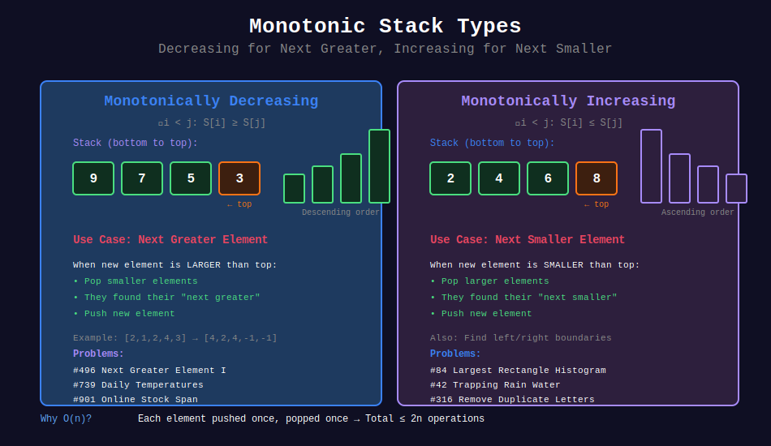
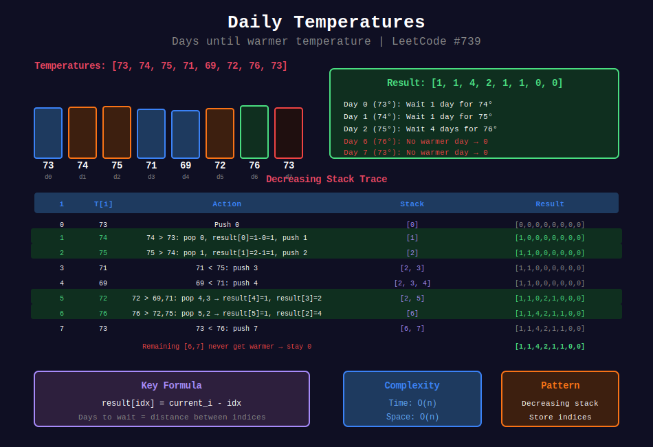
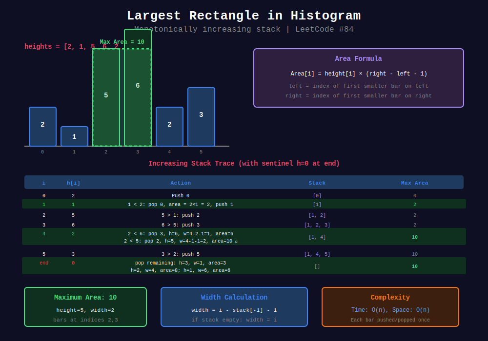

<div align="center">

# 📈 Monotonic Stack

<p>
  
  
</p>

</div>

---

## 🎨 Visual Diagrams

<div align="center">

### 📈 Monotonic Stack Types



*Decreasing for Next Greater, Increasing for Next Smaller*

---

### ➡️ Next Greater Element


*O(n) using decreasing stack - LeetCode #496, #503*

---

### 🌡️ Daily Temperatures



*Days until warmer temperature - LeetCode #739*

---

### 📊 Largest Rectangle in Histogram



*Find left/right boundaries using increasing stack - LeetCode #84*

</div>

---

## 🧭 Navigation

| ⬅️ Previous | 📂 Current | ➡️ Next |
|:------------|:----------:|--------:|
| [← 02. Parentheses](../02_parentheses/README.md) | **03. Monotonic Stack** | [04. Expression Evaluation →](../04_expression_evaluation/README.md) |

---

## 📐 Mathematical Foundations

### 1️⃣ Monotonic Stack Definition

**Monotonically Decreasing Stack:**

$$\forall i < j: S[i] \geq S[j]$$

**Monotonically Increasing Stack:**

$$\forall i < j: S[i] \leq S[j]$$

---

### 2️⃣ Next Greater Element (NGE)

**Definition:**

$$\text{NGE}(i) = \min\{j : j > i \land A[j] > A[i]\}$$

**Visual:**

```
Array:  [2, 1, 2, 4, 3]
NGE:    [4, 2, 4, -1, -1]

Index 0: A[0]=2, first greater is A[3]=4
Index 1: A[1]=1, first greater is A[2]=2
Index 2: A[2]=2, first greater is A[3]=4
Index 3: A[3]=4, no greater element
Index 4: A[4]=3, no greater element

```

---

### 3️⃣ Why O(n) Complexity?

**Theorem:** Monotonic stack processes $n$ elements in O(n).

**Proof:**

- Each element pushed at most once: $n$ pushes

- Each element popped at most once: $\leq n$ pops

- Total operations: $\leq 2n = O(n)$ ∎

---

### 4️⃣ Largest Rectangle in Histogram

**Area Formula:**

$$\text{Area}(i) = h[i] \times (R[i] - L[i] - 1)$$

Where:

- $L[i]$ = index of first smaller bar on left (or -1)

- $R[i]$ = index of first smaller bar on right (or n)

**Visual:**

```
Heights: [2, 1, 5, 6, 2, 3]

For h[2]=5:
L[2] = 1 (h[1]=1 < 5)
R[2] = 4 (h[4]=2 < 5)
Width = 4 - 1 - 1 = 2
Area = 5 × 2 = 10

Maximum rectangle: h[2]=5, h[3]=6
Width=2, Height=5, Area=10

```

---

### 5️⃣ Daily Temperatures

**Problem:** Days until warmer temperature.

$$\text{answer}[i] = \text{NGE_index}(i) - i$$

---

### 6️⃣ Sum of Subarray Minimums

**Contribution Technique:**

$$\text{contribution}(i) = A[i] \times \text{left_count} \times \text{right_count}$$

Where:

- $\text{left_count}$ = subarrays where $A[i]$ is rightmost minimum

- $\text{right_count}$ = subarrays where $A[i]$ is leftmost minimum

---

### 7️⃣ Trapping Rain Water

**Water at position $i$:**

$$\text{water}[i] = \min(\max_{j \leq i} h[j], \max_{j \geq i} h[j]) - h[i]$$

**Stack approach:** Find bounded regions.

---

## 💻 Code Implementations

```python
def nextGreaterElement(nums: list[int]) -> list[int]:
    """
    Find next greater element for each position.
    
    Monotonically decreasing stack.
    When we see larger element, pop and record.
    
    Time: O(n), Space: O(n)
    """
    n = len(nums)
    result = [-1] * n
    stack = []  # Stores indices
    
    for i in range(n):
        while stack and nums[stack[-1]] < nums[i]:
            idx = stack.pop()
            result[idx] = nums[i]
        stack.append(i)
    
    return result

def dailyTemperatures(temperatures: list[int]) -> list[int]:
    """
    Days until warmer temperature.
    
    Same as NGE but return index difference.
    
    Time: O(n), Space: O(n)
    """
    n = len(temperatures)
    result = [0] * n
    stack = []  # Stores indices
    
    for i in range(n):
        while stack and temperatures[stack[-1]] < temperatures[i]:
            idx = stack.pop()
            result[idx] = i - idx
        stack.append(i)
    
    return result

def largestRectangleArea(heights: list[int]) -> int:
    """
    Largest rectangle in histogram.
    
    For each bar, find left and right boundaries.
    Monotonically increasing stack.
    
    Time: O(n), Space: O(n)
    """
    n = len(heights)
    stack = []  # Stores indices
    max_area = 0
    
    for i in range(n + 1):
        h = heights[i] if i < n else 0
        
        while stack and heights[stack[-1]] > h:
            height = heights[stack.pop()]
            width = i if not stack else i - stack[-1] - 1
            max_area = max(max_area, height * width)
        
        stack.append(i)
    
    return max_area

def trap(height: list[int]) -> int:
    """
    Trapping rain water.
    
    Stack stores indices of bars.
    When we find higher bar, calculate trapped water.
    
    Time: O(n), Space: O(n)
    """
    stack = []
    water = 0
    
    for i, h in enumerate(height):
        while stack and height[stack[-1]] < h:
            bottom = height[stack.pop()]
            if stack:
                bounded_height = min(h, height[stack[-1]]) - bottom
                width = i - stack[-1] - 1
                water += bounded_height * width
        stack.append(i)
    
    return water

def sumSubarrayMins(arr: list[int]) -> int:
    """
    Sum of minimum of all subarrays.
    
    For each element, count subarrays where it's minimum.
    Use left/right smaller element positions.
    
    Time: O(n), Space: O(n)
    """
    MOD = 10**9 + 7
    n = len(arr)
    
    # Previous smaller element
    left = [-1] * n
    stack = []
    for i in range(n):
        while stack and arr[stack[-1]] >= arr[i]:
            stack.pop()
        left[i] = stack[-1] if stack else -1
        stack.append(i)
    
    # Next smaller element
    right = [n] * n
    stack = []
    for i in range(n - 1, -1, -1):
        while stack and arr[stack[-1]] > arr[i]:
            stack.pop()
        right[i] = stack[-1] if stack else n
        stack.append(i)
    
    # Calculate contribution
    result = 0
    for i in range(n):
        left_count = i - left[i]
        right_count = right[i] - i
        result = (result + arr[i] * left_count * right_count) % MOD
    
    return result

```

---

## 🏆 LeetCode Problems

### 🟢 Easy

| # | Problem | Pattern | Time | Space |
|:-:|---------|---------|:----:|:-----:|
| 496 | [Next Greater Element I](https://leetcode.com/problems/next-greater-element-i/) | Monotonic Dec | O(n) | O(n) |

### 🟡 Medium

| # | Problem | Pattern | Time | Space |
|:-:|---------|---------|:----:|:-----:|
| 456 | [132 Pattern](https://leetcode.com/problems/132-pattern/) | Monotonic + Track | O(n) | O(n) |
| 503 | [Next Greater Element II](https://leetcode.com/problems/next-greater-element-ii/) | Circular | O(n) | O(n) |
| 739 | [Daily Temperatures](https://leetcode.com/problems/daily-temperatures/) | NGE Index | O(n) | O(n) |
| 901 | [Online Stock Span](https://leetcode.com/problems/online-stock-span/) | Monotonic Dec | O(1)* | O(n) |
| 907 | [Sum of Subarray Minimums](https://leetcode.com/problems/sum-of-subarray-minimums/) | Contribution | O(n) | O(n) |
| 1019 | [Next Greater Node In Linked List](https://leetcode.com/problems/next-greater-node-in-linked-list/) | NGE | O(n) | O(n) |

### 🔴 Hard

| # | Problem | Pattern | Time | Space |
|:-:|---------|---------|:----:|:-----:|
| 42 | [Trapping Rain Water](https://leetcode.com/problems/trapping-rain-water/) | Bounded Regions | O(n) | O(n) |
| 84 | [Largest Rectangle in Histogram](https://leetcode.com/problems/largest-rectangle-in-histogram/) | Left/Right Bound | O(n) | O(n) |
| 85 | [Maximal Rectangle](https://leetcode.com/problems/maximal-rectangle/) | Row Histogram | O(mn) | O(n) |
| 316 | [Remove Duplicate Letters](https://leetcode.com/problems/remove-duplicate-letters/) | Monotonic Inc | O(n) | O(1) |
| 402 | [Remove K Digits](https://leetcode.com/problems/remove-k-digits/) | Monotonic Inc | O(n) | O(n) |

---

---

## 🎨 Visual Algorithm Walkthrough

### Next Greater Element (#496)

```
Array: [2, 1, 2, 4, 3]

Step-by-step (Decreasing Stack):
i   nums[i]  Action          Stack      Result
0     2      Push            [0]        [-1,-1,-1,-1,-1]
1     1      Push (1<2)      [0,1]      [-1,-1,-1,-1,-1]
2     2      Pop 1, Push     [0,2]      [-1,2,-1,-1,-1]
3     4      Pop 2,0, Push   [3]        [4,2,4,-1,-1]
4     3      Push (3<4)      [3,4]      [4,2,4,-1,-1]

Final: [4, 2, 4, -1, -1]

```

### Daily Temperatures (#739)

```
Temps: [73, 74, 75, 71, 69, 72, 76, 73]

Decreasing stack (indices):
i  T[i]  Stack       Action              Result
0   73   [0]         Push                [0,0,0,0,0,0,0,0]
1   74   [1]         Pop 0 (73<74)       [1,0,0,0,0,0,0,0]
2   75   [2]         Pop 1 (74<75)       [1,1,0,0,0,0,0,0]
3   71   [2,3]       Push (71<75)        [1,1,0,0,0,0,0,0]
4   69   [2,3,4]     Push (69<71)        [1,1,0,0,0,0,0,0]
5   72   [2,5]       Pop 4,3 (71<72)     [1,1,0,2,1,0,0,0]
6   76   [6]         Pop all (72,75<76)  [1,1,4,2,1,1,0,0]
7   73   [6,7]       Push (73<76)        [1,1,4,2,1,1,0,0]

Final: [1, 1, 4, 2, 1, 1, 0, 0]

```

### Largest Rectangle (#84)

```
Heights: [2, 1, 5, 6, 2, 3]

Increasing stack approach:
i  h[i]  Stack       Action              Max Area
0   2    [0]         Push                0
1   1    [1]         Pop 0, Push         2×1=2
2   5    [1,2]       Push                2
3   6    [1,2,3]     Push                2
4   2    [1,4]       Pop 3,2, Push       10
                     h=6, w=1 → 6
                     h=5, w=2 → 10 ✓
5   3    [1,4,5]     Push                10
End      []          Pop all             10
                     h=3, w=1 → 3
                     h=2, w=4 → 8
                     h=1, w=6 → 6

Maximum: 10

```

---

## 📊 Pattern Selection Guide

```
Finding next/prev greater/smaller?
         |
         +-- Next Greater → Decreasing Stack
         +-- Next Smaller → Increasing Stack
         +-- Prev Greater → Decreasing (right to left)
         +-- Prev Smaller → Increasing (right to left)

Area/Water problems?
         |
         +-- Find boundaries using monotonic stack

```

### Quick Reference Table

| Goal | Stack Type | Store | Direction |
|------|-----------|-------|-----------|
| Next Greater | Decreasing | Indices | Left → Right |
| Next Smaller | Increasing | Indices | Left → Right |
| Prev Greater | Decreasing | Indices | Right → Left |
| Prev Smaller | Increasing | Indices | Right → Left |

---

## 💡 Pattern Recognition Guide

| Problem Keywords | Pattern | Stack Type | Example |
|-----------------|---------|------------|---------|
| "next greater" | NGE | Decreasing | #496, #503 |
| "next smaller" | NSE | Increasing | #84 |
| "warmer temperature" | NGE index | Decreasing | #739 |
| "largest rectangle" | Boundaries | Increasing | #84, #85 |
| "trapping water" | Bounded regions | Increasing | #42 |
| "sum of minimums" | Contribution | Both | #907 |
| "remove k digits" | Keep small | Increasing | #402 |
| "remove duplicates" | Lexicographic | Increasing | #316 |

---

## 📚 References & Learning Resources

### 📖 Core Concepts

| Resource | Topic | Link |
|----------|-------|------|
| **LeetCode Discuss** | Complete monotonic stack guide | [Article](https://leetcode.com/discuss/study-guide/2347639/A-Comprehensive-Guide-and-Template-for-Monotonic-Stack-based-Problems) |
| **CP Algorithms** | Stack modifications | [Tutorial](https://cp-algorithms.com/data_structures/stack_queue_modification.html) |
| **GeeksforGeeks** | Next greater element | [Tutorial](https://www.geeksforgeeks.org/next-greater-element/) |

### 📺 Video Tutorials

| Creator | Topic | Link |
|---------|-------|------|
| **NeetCode** | Daily Temperatures | [YouTube](https://www.youtube.com/watch?v=cTBiBSnjO3c) |
| **NeetCode** | Largest Rectangle | [YouTube](https://www.youtube.com/watch?v=zx5Sw9130L0) |
| **NeetCode** | Trapping Rain Water | [YouTube](https://www.youtube.com/watch?v=ZI2z5pq0TqA) |
| **William Fiset** | Monotonic stack theory | [YouTube](https://www.youtube.com/watch?v=oUznYEjck1M) |
| **Back To Back SWE** | Next greater element | [YouTube](https://www.youtube.com/watch?v=Dq_ObZwTY_Q) |
| **Tech Dose** | Largest rectangle | [YouTube](https://www.youtube.com/watch?v=jC_cWLy7jSI) |

### 🎯 Practice Collections

| Platform | Focus | Link |
|----------|-------|------|
| **LeetCode** | Monotonic stack tag | [Problems](https://leetcode.com/tag/monotonic-stack/) |
| **Codeforces** | Stack problems | [Problemset](https://codeforces.com/problemset?tags=data+structures) |

### 🔬 Advanced Topics

| Topic | Description | Link |
|-------|-------------|------|
| **Histogram Problems** | Rectangle area variations | [GeeksforGeeks](https://www.geeksforgeeks.org/largest-rectangle-under-histogram/) |
| **Contribution Technique** | Sum of subarray mins/maxs | [LeetCode Discuss](https://leetcode.com/problems/sum-of-subarray-minimums/discuss/) |
| **132 Pattern** | Complex monotonic use | [Tutorial](https://leetcode.com/problems/132-pattern/discuss/) |
| **Maximal Rectangle** | 2D histogram extension | [Article](https://www.geeksforgeeks.org/maximum-size-rectangle-binary-sub-matrix-1s/) |

### 📊 Visualization Tools

| Tool | Purpose | Link |
|------|---------|------|
| **VisuAlgo** | Stack operations | [Website](https://visualgo.net/en/list) |
| **Algorithm Visualizer** | Histogram problems | [Website](https://algorithm-visualizer.org/) |

### 📐 Mathematical Deep Dive

| Topic | Description | Link |
|-------|-------------|------|
| **Amortized Analysis** | Why monotonic stack is O(n) | [Wikipedia](https://en.wikipedia.org/wiki/Amortized_analysis) |
| **Contribution Technique** | Counting subarrays efficiently | [Tutorial](https://leetcode.com/problems/sum-of-subarray-minimums/discuss/178876/stack-solution-with-very-detailed-explanation-step-by-step) |

---

## 💡 Pro Tips

> **🎯 Monotonic Stack Rule:** Decreasing for "next greater", increasing for "next smaller". Opposite for "previous".

> **⚡ O(n) Magic:** Each element pushed once, popped once. Total = 2n operations = O(n)!

> **🔍 Store Indices, Not Values:** Indices let you calculate distances and access original values. More flexible!

> **📊 Histogram Trick:** For each bar, find left/right boundaries where height drops. That's your rectangle width!

> **🌊 Water Trapping:** When you find higher bar, water gets trapped between current and stack top. Calculate immediately!

---

## 🎖️ Practice Roadmap

**Week 1: Fundamentals**

1. Solve #496 (Next Greater Element I) - Master the template

2. Solve #739 (Daily Temperatures) - Apply to real problem

3. Solve #503 (Next Greater II) - Handle circular array

**Week 2: Histogram & Water**

4. Solve #84 (Largest Rectangle) - Classic problem

5. Solve #42 (Trapping Rain Water) - Area calculation

6. Solve #85 (Maximal Rectangle) - 2D extension

**Week 3: Advanced**

7. Solve #907 (Sum of Subarray Minimums) - Contribution technique

8. Solve #316 (Remove Duplicate Letters) - Creative use

9. Solve #402 (Remove K Digits) - Greedy + monotonic

10. Solve #456 (132 Pattern) - Complex pattern

---

## ❓ Interview Q&A

**Q: When to use decreasing vs increasing stack?**  
A: Decreasing for "next greater", increasing for "next smaller". Think: what breaks the monotonic property?

**Q: Why is monotonic stack O(n)?**  
A: Each element pushed once, popped once. Even with nested loop, total operations ≤ 2n.

**Q: How to handle circular arrays?**  
A: Process array twice (or use modulo). Element can find answer in second pass.

**Q: What's the contribution technique?**  
A: For each element, count how many subarrays it affects. Multiply element × left_count × right_count.

**Q: Can two pointers replace monotonic stack?**  
A: Sometimes! For trapping water, two pointers is O(1) space. But stack is more intuitive.

---

## 🔥 Key Insights

- **Monotonic Property:** Maintain decreasing/increasing order → O(n) guarantee

- **When Popped:** Element found its answer (next greater/smaller)

- **Store Indices:** More flexible than storing values directly

- **Area Problems:** Find left/right boundaries efficiently

- **Template Power:** Same pattern solves 20+ problems!

---

<div align="center">

**Made with ❤️ for the coding community by [Gaurav Goswami](https://github.com/Gaurav14cs17)**

</div>

---

## 🧭 Navigation

| ⬅️ Previous | 📂 Current | ➡️ Next |
|:------------|:----------:|--------:|
| [← 02. Parentheses](../02_parentheses/README.md) | **03. Monotonic Stack** | [04. Expression Evaluation →](../04_expression_evaluation/README.md) |
