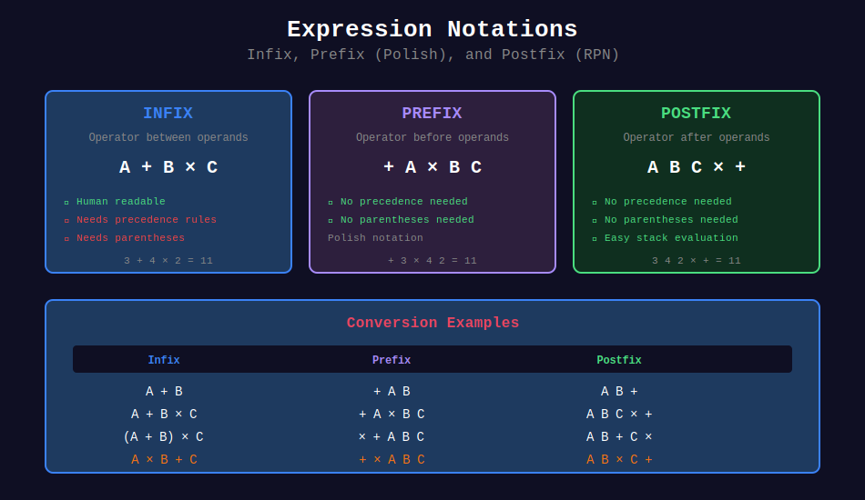
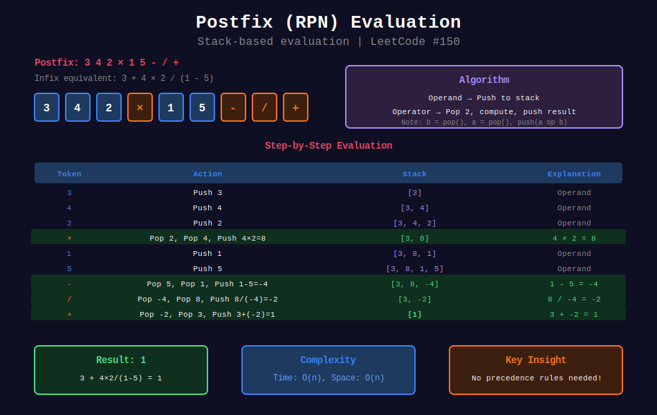
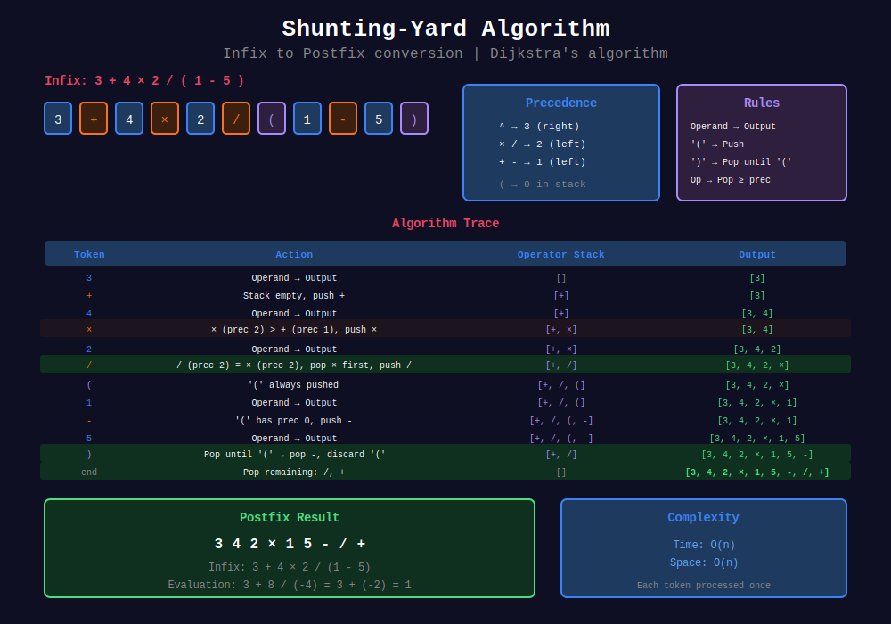
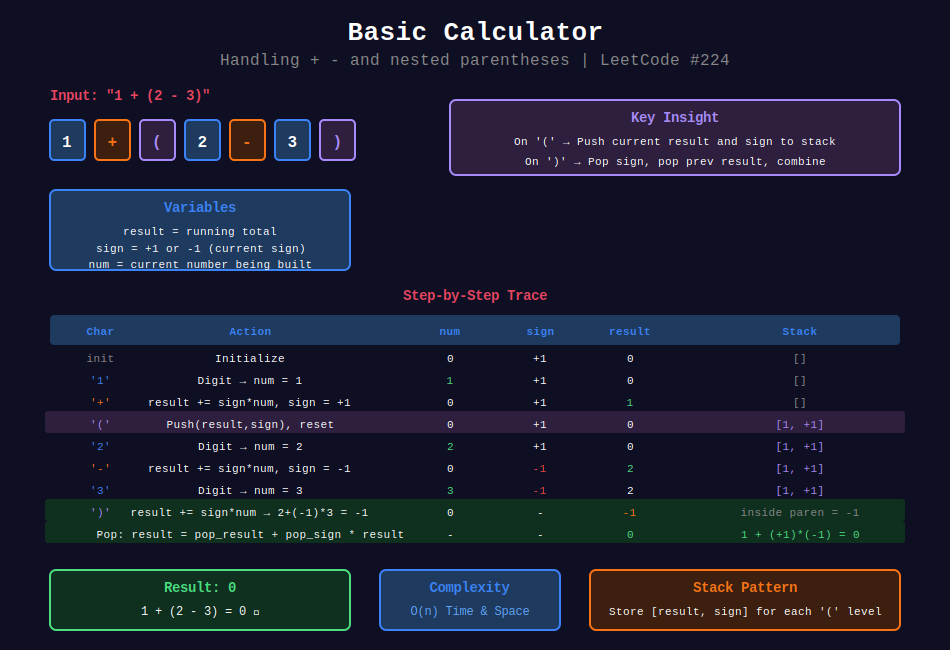

<div align="center">

# 🧮 Expression Evaluation

<p>
  
  
</p>

</div>

---

## 🎨 Visual Diagrams

<div align="center">

### 📝 Expression Notations



*Infix, Prefix (Polish), and Postfix (RPN) comparison*

---

### 🔢 Postfix (RPN) Evaluation



*Stack-based evaluation without precedence rules - LeetCode #150*

---

### 🔀 Shunting-Yard Algorithm



*Dijkstra's algorithm: Infix → Postfix conversion*

---

### 🧮 Basic Calculator



*Handling +, - and nested parentheses - LeetCode #224*

</div>

---

## 🧭 Navigation

| ⬅️ Previous | 📂 Current | ➡️ Next Topic |
|:------------|:----------:|--------:|
| [← 03. Monotonic Stack](../03_monotonic_stack/README.md) | **04. Expression Evaluation** | [🏠 Stacks Home](../README.md) → [Queues](../../05_queues/README.md) |

---

## 📐 Mathematical Foundations

### 1️⃣ Expression Notations

| Notation | Example | Description |
|----------|---------|-------------|
| **Infix** | `a + b * c` | Operators between operands |
| **Prefix** (Polish) | `+ a * b c` | Operators before operands |
| **Postfix** (RPN) | `a b c * +` | Operators after operands |

---

### 2️⃣ Operator Precedence

| Priority | Operators | Associativity |
|:--------:|:---------:|:-------------:|
| 3 | `^` | Right to Left |
| 2 | `*`, `/` | Left to Right |
| 1 | `+`, `-` | Left to Right |
| 0 | `(` (in stack) | - |

---

### 3️⃣ Shunting-Yard Algorithm (Infix → Postfix)

**Rules:**

1. **Operand** → Output directly
2. **`(`** → Push to stack
3. **`)`** → Pop to output until `(`
4. **Operator** → Pop higher/equal precedence, then push

**Example:**

```
Infix: 3 + 4 * 2 / ( 1 - 5 )

Step-by-step:
Token  Action          Stack    Output
3      Output          []       3
+      Push            [+]      3
4      Output          [+]      3 4
*      Push (> +)      [+ *]    3 4
2      Output          [+ *]    3 4 2
/      Pop *, push /   [+ /]    3 4 2 *
(      Push            [+ / (]  3 4 2 *
1      Output          [+ / (]  3 4 2 * 1
-      Push            [+ / ( -] 3 4 2 * 1
5      Output          [+ / ( -] 3 4 2 * 1 5
)      Pop until (     [+ /]    3 4 2 * 1 5 -
End    Pop all         []       3 4 2 * 1 5 - / +

Postfix: 3 4 2 * 1 5 - / +
```

---

### 4️⃣ Postfix Evaluation

**Algorithm:**

1. Operand → Push to stack
2. Operator → Pop two operands, compute, push result

**Example:**

```
Postfix: 3 4 2 * 1 5 - / +

Stack trace:
3      → [3]
4      → [3, 4]
2      → [3, 4, 2]
*      → [3, 8]      (4 * 2 = 8)
1      → [3, 8, 1]
5      → [3, 8, 1, 5]
-      → [3, 8, -4]   (1 - 5 = -4)
/      → [3, -2]      (8 / -4 = -2)
+      → [1]          (3 + -2 = 1)

Result: 1
```

---

### 5️⃣ Handling Unary Operators

**Unary minus detection:**

- At start of expression
- After `(`
- After another operator

**Solution:** Convert `-x` to `(0 - x)` or treat specially.

---

## 💻 Code Implementations

```python
def evalRPN(tokens: list[str]) -> int:
    """
    Evaluate Reverse Polish Notation.
    
    Time: O(n), Space: O(n)
    """
    stack = []
    operators = {
        '+': lambda a, b: a + b,
        '-': lambda a, b: a - b,
        '*': lambda a, b: a * b,
        '/': lambda a, b: int(a / b)  # Truncate toward zero
    }
    
    for token in tokens:
        if token in operators:
            b, a = stack.pop(), stack.pop()
            stack.append(operators[token](a, b))
        else:
            stack.append(int(token))
    
    return stack[0]

def calculate(s: str) -> int:
    """
    Basic Calculator (with +, -, parentheses).
    
    Use stack to handle nested expressions.
    
    Time: O(n), Space: O(n)
    """
    stack = []
    num = 0
    sign = 1
    result = 0
    
    for char in s:
        if char.isdigit():
            num = num * 10 + int(char)
        elif char == '+':
            result += sign * num
            num = 0
            sign = 1
        elif char == '-':
            result += sign * num
            num = 0
            sign = -1
        elif char == '(':
            stack.append(result)
            stack.append(sign)
            result = 0
            sign = 1
        elif char == ')':
            result += sign * num
            num = 0
            result *= stack.pop()  # sign before (
            result += stack.pop()  # result before (
    
    return result + sign * num

def calculateII(s: str) -> int:
    """
    Basic Calculator II (with +, -, *, /).
    
    Process * and / immediately, defer + and -.
    
    Time: O(n), Space: O(n)
    """
    stack = []
    num = 0
    prev_op = '+'
    s += '+'  # Trigger final operation
    
    for char in s:
        if char.isdigit():
            num = num * 10 + int(char)
        elif char in '+-*/':
            if prev_op == '+':
                stack.append(num)
            elif prev_op == '-':
                stack.append(-num)
            elif prev_op == '*':
                stack.append(stack.pop() * num)
            elif prev_op == '/':
                stack.append(int(stack.pop() / num))
            
            num = 0
            prev_op = char
    
    return sum(stack)

def infixToPostfix(expression: str) -> str:
    """
    Shunting-Yard Algorithm.
    
    Convert infix to postfix notation.
    
    Time: O(n), Space: O(n)
    """
    precedence = {'+': 1, '-': 1, '*': 2, '/': 2, '^': 3}
    right_assoc = {'^'}
    output = []
    operator_stack = []
    
    i = 0
    while i < len(expression):
        char = expression[i]
        
        if char.isdigit():

            # Read full number
            num = ''
            while i < len(expression) and expression[i].isdigit():
                num += expression[i]
                i += 1
            output.append(num)
            continue
        
        elif char in precedence:
            while (operator_stack and 
                   operator_stack[-1] != '(' and
                   operator_stack[-1] in precedence and
                   (precedence[operator_stack[-1]] > precedence[char] or
                    (precedence[operator_stack[-1]] == precedence[char] and
                     char not in right_assoc))):
                output.append(operator_stack.pop())
            operator_stack.append(char)
        
        elif char == '(':
            operator_stack.append(char)
        
        elif char == ')':
            while operator_stack and operator_stack[-1] != '(':
                output.append(operator_stack.pop())
            operator_stack.pop()  # Remove '('
        
        i += 1
    
    while operator_stack:
        output.append(operator_stack.pop())
    
    return ' '.join(output)
```

---

## 🏆 LeetCode Problems

### 🟡 Medium

| # | Problem | Pattern | Time | Space |
|:-:|---------|---------|:----:|:-----:|
| 150 | [Evaluate Reverse Polish Notation](https://leetcode.com/problems/evaluate-reverse-polish-notation/) | Postfix Eval | O(n) | O(n) |
| 227 | [Basic Calculator II](https://leetcode.com/problems/basic-calculator-ii/) | Precedence | O(n) | O(n) |
| 394 | [Decode String](https://leetcode.com/problems/decode-string/) | Nested Stack | O(n) | O(n) |
| 770 | [Basic Calculator IV](https://leetcode.com/problems/basic-calculator-iv/) | Polynomial | O(n) | O(n) |

### 🔴 Hard

| # | Problem | Pattern | Time | Space |
|:-:|---------|---------|:----:|:-----:|
| 224 | [Basic Calculator](https://leetcode.com/problems/basic-calculator/) | Parentheses | O(n) | O(n) |
| 726 | [Number of Atoms](https://leetcode.com/problems/number-of-atoms/) | Nested Parse | O(n²) | O(n) |
| 772 | [Basic Calculator III](https://leetcode.com/problems/basic-calculator-iii/) | Full Expression | O(n) | O(n) |

---

---

## 🎨 Visual Algorithm Walkthrough

### Evaluate RPN (#150)

```
Input: ["2", "1", "+", "3", "*"]

Stack trace:
Token   Action              Stack       Explanation
"2"     Push 2              [2]         Operand
"1"     Push 1              [2, 1]      Operand
"+"     Pop 1,2, Push 3     [3]         2 + 1 = 3
"3"     Push 3              [3, 3]      Operand
"*"     Pop 3,3, Push 9     [9]         3 * 3 = 9

Result: 9
```

### Basic Calculator II (#227)

```
Input: "3+2*2"

Process with precedence:
Char   Prev_op  Num   Stack       Action
'3'    +        3     []          Building num
'+'    +        3     [3]         Push 3, op='+'
'2'    +        2     [3]         Building num
'*'    +        2     [3, 2]      Push 2, op='*'
'2'    *        2     [3, 2]      Building num
End    *        2     [3, 4]      Pop 2, calc 2*2=4
                      [7]         Sum all

Result: 7
```

### Shunting-Yard Visualization

```
Infix: A + B * C

Token  Action              Op Stack    Output
A      Operand             []          [A]
+      Push                [+]         [A]
B      Operand             [+]         [A, B]
*      Push (* > +)        [+, *]      [A, B]
C      Operand             [+, *]      [A, B, C]
End    Pop all             []          [A, B, C, *, +]

Postfix: A B C * +
```

---

## 📊 Expression Problem Decision

```
Expression Problem
       |
       +-- Only +, - → Simple accumulator
       |
       +-- +, -, *, / → Precedence stack
       |
       +-- With ( ) → Recursive or nested stack
       |
       +-- Full expression → Shunting-yard
```

### Complexity Comparison

| Approach | Time | Space | Use When |
|----------|------|-------|----------|
| Simple scan | O(n) | O(1) | Only +, - |
| Single stack | O(n) | O(n) | +, -, *, / |
| Two stacks | O(n) | O(n) | With parentheses |
| Recursion | O(n) | O(n) | Nested expressions |
| Shunting-Yard | O(n) | O(n) | Full parsing |

---

## 💡 Pattern Recognition Guide

| Problem Keywords | Pattern | Example |
|-----------------|---------|---------|
| "reverse polish notation" | Postfix eval | #150 |
| "basic calculator" | Infix parsing | #224, #227 |
| "with parentheses" | Nested stack | #224, #394 |
| "operator precedence" | Precedence stack | #227 |
| "decode string" | Nested decoding | #394 |
| "number of atoms" | Recursive parse | #726 |

---

## 📚 References & Learning Resources

### 📖 Core Concepts
| Resource | Topic | Link |
|----------|-------|------|
| **Wikipedia** | Shunting-yard algorithm | [Article](https://en.wikipedia.org/wiki/Shunting-yard_algorithm) |
| **Wikipedia** | Reverse Polish notation | [Article](https://en.wikipedia.org/wiki/Reverse_Polish_notation) |
| **GeeksforGeeks** | Expression evaluation | [Tutorial](https://www.geeksforgeeks.org/expression-evaluation/) |
| **GeeksforGeeks** | Infix to postfix | [Tutorial](https://www.geeksforgeeks.org/stack-set-2-infix-to-postfix/) |
| **CP Algorithms** | Parsing expressions | [Guide](https://cp-algorithms.com/string/expression_parsing.html) |

### 📺 Video Tutorials
| Creator | Topic | Link |
|---------|-------|------|
| **NeetCode** | Basic Calculator | [YouTube](https://www.youtube.com/watch?v=081AqOuasw0) |
| **NeetCode** | Basic Calculator II | [YouTube](https://www.youtube.com/watch?v=7eh2TsOwRPY) |
| **Abdul Bari** | Infix/Prefix/Postfix | [YouTube](https://www.youtube.com/watch?v=WHs-wSo33MM) |
| **Back To Back SWE** | Expression parsing | [YouTube](https://www.youtube.com/watch?v=Nz8zHfrOHT0) |
| **Tushar Roy** | Evaluate RPN | [YouTube](https://www.youtube.com/watch?v=MeRb_1bddWg) |

### 🎯 Practice Collections
| Platform | Focus | Link |
|----------|-------|------|
| **LeetCode** | Expression problems | [Tag](https://leetcode.com/tag/math/) |
| **HackerRank** | Stack challenges | [Practice](https://www.hackerrank.com/domains/data-structures?filters%5Bsubdomains%5D%5B%5D=stacks) |

### 🔬 Advanced Topics
| Topic | Description | Link |
|-------|-------------|------|
| **Operator Precedence** | Parsing theory | [Wikipedia](https://en.wikipedia.org/wiki/Operator-precedence_parser) |
| **Recursive Descent** | Alternative approach | [Wikipedia](https://en.wikipedia.org/wiki/Recursive_descent_parser) |
| **Pratt Parsing** | Modern technique | [Article](https://journal.stuffwithstuff.com/2011/03/19/pratt-parsers-expression-parsing-made-easy/) |
| **AST Construction** | Building parse trees | [Tutorial](https://en.wikipedia.org/wiki/Abstract_syntax_tree) |

### 📊 Visualization Tools
| Tool | Purpose | Link |
|------|---------|------|
| **CS Animations** | Expression evaluation | [Website](https://www.cs.usfca.edu/~galles/visualization/SimpleStack.html) |
| **Algorithm Visualizer** | Shunting-yard | [Website](https://algorithm-visualizer.org/) |

### 📐 Mathematical Background
| Topic | Description | Link |
|-------|-------------|------|
| **Operator Associativity** | Left vs right | [Wikipedia](https://en.wikipedia.org/wiki/Operator_associativity) |
| **Context-Free Grammars** | Expression grammar | [Wikipedia](https://en.wikipedia.org/wiki/Context-free_grammar) |
| **BNF Notation** | Formal expression syntax | [Wikipedia](https://en.wikipedia.org/wiki/Backus%E2%80%93Naur_form) |

### 📚 Books
| Book | Chapter | Topic |
|------|---------|-------|
| **Dragon Book** | Chapter 4 | Syntax Analysis |
| **CLRS** | Chapter 10 | Stack applications |
| **Algorithms 4th** | Section 1.3 | Expression evaluation |

---

## 💡 Pro Tips

> **🎯 Postfix > Infix:** Postfix (RPN) has no ambiguity, no parentheses needed. Easier to evaluate!

> **⚡ Two-Stack Template:** One for operators, one for operands. Classic approach for infix evaluation.

> **🔍 Precedence Rule:** Pop operators with higher OR EQUAL precedence (except right-associative like ^).

> **📊 Handle Spaces:** Always skip spaces in parsing. Use `.strip()` or check `char.isspace()`.

> **🌊 Unary Operators:** Detect by position (start, after '(', after operator). Convert to binary: `-x` → `0-x`.

---

## 🎖️ Practice Roadmap

**Week 1: Fundamentals**
1. Solve #150 (Evaluate RPN) - Master postfix evaluation
2. Implement infix to postfix converter
3. Study operator precedence rules

**Week 2: Basic Calculators**
4. Solve #227 (Basic Calculator II) - Handle *, /
5. Solve #224 (Basic Calculator) - Handle parentheses
6. Solve #394 (Decode String) - Nested decoding

**Week 3: Advanced**
7. Solve #772 (Basic Calculator III) - Full expression
8. Solve #726 (Number of Atoms) - Chemical formulas
9. Implement your own expression parser

---

## ❓ Interview Q&A

**Q: Why is postfix better than infix for computers?**  
A: No ambiguity, no parentheses needed, simple stack evaluation. Infix needs precedence rules.

**Q: How to handle unary minus?**  
A: Detect by context (start, after '(', after operator). Convert to `(0 - x)` or handle specially.

**Q: What's the difference between Basic Calculator I, II, III?**  
A: I: +, -, ( ). II: +, -, *, /. III: All of above. Each adds complexity!

**Q: How to handle nested parentheses?**  
A: Stack! Each '(' pushes current state, ')' pops and combines.

**Q: Can we evaluate infix without converting to postfix?**  
A: Yes! Use two stacks (operator and operand) with precedence rules. Or recursive descent.

---

## 🔥 Key Insights

- **RPN Elegance:** Stack-based evaluation without precedence worries
- **Shunting-Yard Power:** Single pass infix → postfix conversion
- **Precedence Handling:** Pop higher/equal precedence before pushing
- **Nested Expressions:** Stack naturally handles parentheses nesting
- **Template Reusability:** Same pattern for many expression problems

---

## 🧮 Notation Conversion Cheatsheet

### Infix to Postfix Examples

| Infix | Postfix | Prefix |
|-------|---------|--------|
| A + B | A B + | + A B |
| A + B * C | A B C * + | + A * B C |
| (A + B) * C | A B + C * | * + A B C |
| A * B + C | A B * C + | + * A B C |

### Evaluation Order

```
Infix:    3 + 4 * 2
Postfix:  3 4 2 * +
Steps:    3 4 2  →  3 8  →  11

Infix:    (3 + 4) * 2
Postfix:  3 4 + 2 *
Steps:    3 4  →  7 2  →  14
```

---

<div align="center">

**Made with ❤️ for the coding community by [Gaurav Goswami](https://github.com/Gaurav14cs17)**

</div>

---

## 🧭 Navigation

| ⬅️ Previous | 📂 Current | ➡️ Next Topic |
|:------------|:----------:|--------:|
| [← 03. Monotonic Stack](../03_monotonic_stack/README.md) | **04. Expression Evaluation** | [🏠 Stacks Home](../README.md) → [Queues](../../05_queues/README.md) |
