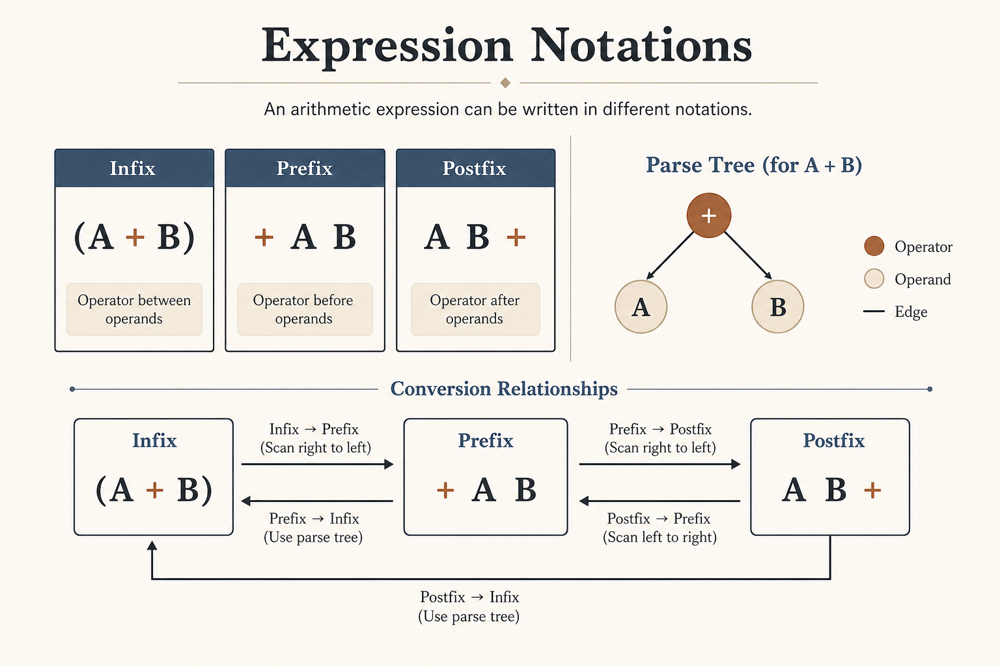
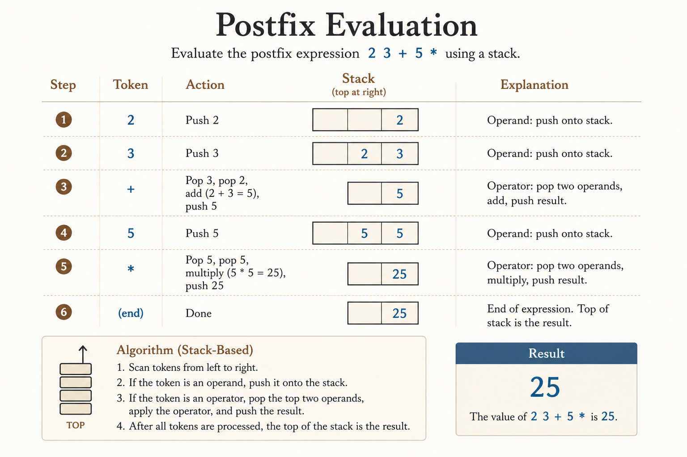
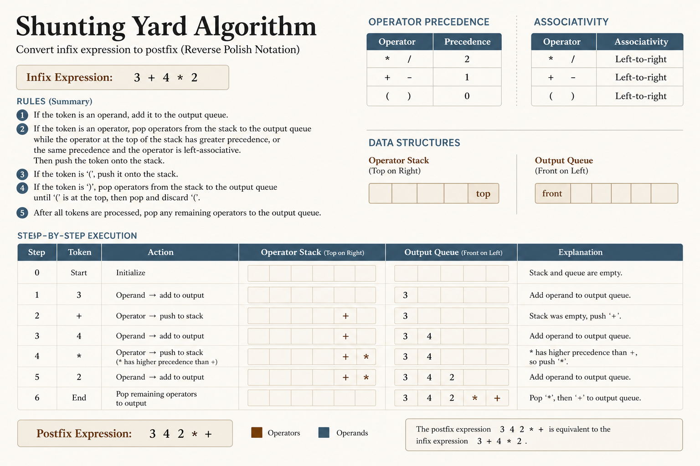
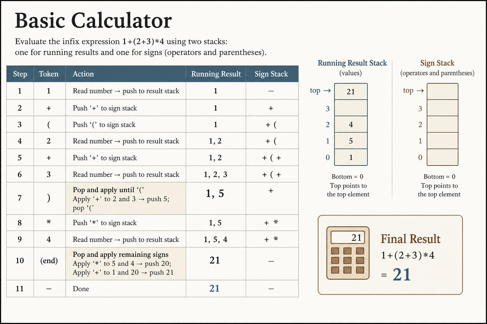

<div align="center">

# 🧮 Expression Evaluation

### *🧮 Expression Evaluation*


<p>
  
  
</p>

</div>

---

## 📊 Visual Overview

<div align="center">

### 📝 Expression Notations


*Infix, Prefix (Polish), and Postfix (RPN) comparison*

---

### 🔢 Postfix (RPN) Evaluation


*Stack-based evaluation without precedence rules - LeetCode #150*

---

### 🔀 Shunting-Yard Algorithm


*Dijkstra's algorithm: Infix → Postfix conversion*

---

### 🧮 Basic Calculator


*Handling +, - and nested parentheses - LeetCode #224*

</div>

---

### Evaluate RPN (#150)
Input: ["2", "1", "+", "3", "*"]

Stack trace:
Token   Action              Stack       Explanation
"2"     Push 2              [2]         Operand
"1"     Push 1              [2, 1]      Operand
"+"     Pop 1,2, Push 3     [3]         2 + 1 = 3
"3"     Push 3              [3, 3]      Operand
"*"     Pop 3,3, Push 9     [9]         3 * 3 = 9

Result: 9


### Basic Calculator II (#227)


### Shunting-Yard Visualization


## 🎯 At a Glance

| | |
|:---|:---|
| **Topic** | 🧮 Expression Evaluation |
| **Difficulty** | Medium to Hard |
| **Problems** | 8+ |

> **How to use this page:** Start with the visual overview, scan **At a Glance**, then work through theory → walkthroughs → code.


## 🧭 Navigation

| ⬅️ Previous | 📂 Current | ➡️ Next Topic |
|:------------|:----------:|--------:|
| [← 03. Monotonic Stack](../03_monotonic_stack/README.md) | **04. Expression Evaluation** | [🏠 Stacks Home](../README.md) → [Queues](../../05_queues/README.md) |


## 📐 Mathematical Foundation
### 1️⃣ Expression Notations

| Notation | Example | Description |
|----------|---------|-------------|
| **Infix** | `a + b * c` | Operators between operands |
| **Prefix** (Polish) | `+ a * b c` | Operators before operands |
| **Postfix** (RPN) | `a b c * +` | Operators after operands |

---

### 2️⃣ Operator Precedence

| Priority | Operators | Associativity |
|:--------:|:---------:|:-------------:|
| 3 | `^` | Right to Left |
| 2 | `*`, `/` | Left to Right |
| 1 | `+`, `-` | Left to Right |
| 0 | `(` (in stack) | - |

---

### 3️⃣ Shunting-Yard Algorithm (Infix → Postfix)

**Rules:**

1. **Operand** → Output directly

2. **`(`** → Push to stack

3. **`)`** → Pop to output until `(`
4. **Operator** → Pop higher/equal precedence, then push

**Example:**


---

### 4️⃣ Postfix Evaluation

**Algorithm:**

1. Operand → Push to stack

2. Operator → Pop two operands, compute, push result

**Example:**


---

### 5️⃣ Handling Unary Operators

**Unary minus detection:**

- At start of expression

- After `(`
- After another operator

**Solution:** Convert `-x` to `(0 - x)` or treat specially.


## 💻 Code Implementations

```python
def evalRPN(tokens: list[str]) -> int:
    """
    Evaluate Reverse Polish Notation.
    
    Time: O(n), Space: O(n)
    """
    stack = []
    operators = {
        '+': lambda a, b: a + b,
        '-': lambda a, b: a - b,
        '*': lambda a, b: a * b,
        '/': lambda a, b: int(a / b)  # Truncate toward zero
    }
    
    for token in tokens:
        if token in operators:
            b, a = stack.pop(), stack.pop()
            stack.append(operators[token](a, b))
        else:
            stack.append(int(token))
    
    return stack[0]

def calculate(s: str) -> int:
    """
    Basic Calculator (with +, -, parentheses).
    
    Use stack to handle nested expressions.
    
    Time: O(n), Space: O(n)
    """
    stack = []
    num = 0
    sign = 1
    result = 0
    
    for char in s:
        if char.isdigit():
            num = num * 10 + int(char)
        elif char == '+':
            result += sign * num
            num = 0
            sign = 1
        elif char == '-':
            result += sign * num
            num = 0
            sign = -1
        elif char == '(':
            stack.append(result)
            stack.append(sign)
            result = 0
            sign = 1
        elif char == ')':
            result += sign * num
            num = 0
            result *= stack.pop()  # sign before (
            result += stack.pop()  # result before (
    
    return result + sign * num

def calculateII(s: str) -> int:
    """
    Basic Calculator II (with +, -, *, /).
    
    Process * and / immediately, defer + and -.
    
    Time: O(n), Space: O(n)
    """
    stack = []
    num = 0
    prev_op = '+'
    s += '+'  # Trigger final operation
    
    for char in s:
        if char.isdigit():
            num = num * 10 + int(char)
        elif char in '+-*/':
            if prev_op == '+':
                stack.append(num)
            elif prev_op == '-':
                stack.append(-num)
            elif prev_op == '*':
                stack.append(stack.pop() * num)
            elif prev_op == '/':
                stack.append(int(stack.pop() / num))
            
            num = 0
            prev_op = char
    
    return sum(stack)

def infixToPostfix(expression: str) -> str:
    """
    Shunting-Yard Algorithm.
    
    Convert infix to postfix notation.
    
    Time: O(n), Space: O(n)
    """
    precedence = {'+': 1, '-': 1, '*': 2, '/': 2, '^': 3}
    right_assoc = {'^'}
    output = []
    operator_stack = []
    
    i = 0
    while i < len(expression):
        char = expression[i]
        
        if char.isdigit():
            # Read full number
            num = ''
            while i < len(expression) and expression[i].isdigit():
                num += expression[i]
                i += 1
            output.append(num)
            continue
        
        elif char in precedence:
            while (operator_stack and 
                   operator_stack[-1] != '(' and
                   operator_stack[-1] in precedence and
                   (precedence[operator_stack[-1]] > precedence[char] or
                    (precedence[operator_stack[-1]] == precedence[char] and
                     char not in right_assoc))):
                output.append(operator_stack.pop())
            operator_stack.append(char)
        
        elif char == '(':
            operator_stack.append(char)
        
        elif char == ')':
            while operator_stack and operator_stack[-1] != '(':
                output.append(operator_stack.pop())
            operator_stack.pop()  # Remove '('
        
        i += 1
    
    while operator_stack:
        output.append(operator_stack.pop())
    
    return ' '.join(output)

```

---

## 🏆 LeetCode Problems

### 🟡 Medium

| # | Problem | Pattern | Time | Space |
|:-:|---------|---------|:----:|:-----:|
| 150 | [Evaluate Reverse Polish Notation](https://leetcode.com/problems/evaluate-reverse-polish-notation/) | Postfix Eval | O(n) | O(n) |
| 227 | [Basic Calculator II](https://leetcode.com/problems/basic-calculator-ii/) | Precedence | O(n) | O(n) |
| 394 | [Decode String](https://leetcode.com/problems/decode-string/) | Nested Stack | O(n) | O(n) |
| 770 | [Basic Calculator IV](https://leetcode.com/problems/basic-calculator-iv/) | Polynomial | O(n) | O(n) |

### 🔴 Hard

| # | Problem | Pattern | Time | Space |
|:-:|---------|---------|:----:|:-----:|
| 224 | [Basic Calculator](https://leetcode.com/problems/basic-calculator/) | Parentheses | O(n) | O(n) |
| 726 | [Number of Atoms](https://leetcode.com/problems/number-of-atoms/) | Nested Parse | O(n²) | O(n) |
| 772 | [Basic Calculator III](https://leetcode.com/problems/basic-calculator-iii/) | Full Expression | O(n) | O(n) |

---

## 📊 Expression Problem Decision


---

## 📚 References & Learning Resources

### 📖 Core Concepts

| Resource | Description | Link |
|----------|-------------|------|
| **Shunting-Yard** | Wikipedia | [Algorithm](https://en.wikipedia.org/wiki/Shunting_yard_algorithm) |
| **RPN Evaluation** | GeeksforGeeks | [Postfix](https://www.geeksforgeeks.org/stack-set-4-evaluation-postfix-expression/) |

### 📝 Practice

| Platform | Focus | Link |
|----------|-------|------|
| **LeetCode** | Stack tag | [Problems](https://leetcode.com/tag/stack/) |

---

<div align="center">

**Made with ❤️ for the coding community by [Gaurav Goswami](https://github.com/Gaurav14cs17)**

</div>

---
