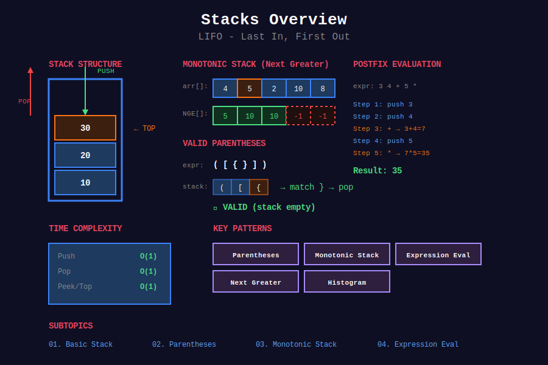

<div align="center">

# 📚 Stacks



<p>
  
  
  
</p>

**Last In, First Out (LIFO) - Essential for recursion, parsing, and backtracking**

[⬅️ Previous: Linked Lists](../03_linked_lists/README.md) | [🏠 Home](../README.md) | [Next: Queues ➡️](../05_queues/README.md)

</div>

---

## 📐 Mathematical Foundation

### 1️⃣ Stack Definition (Abstract Data Type)

A stack $S$ is a collection supporting:

$$\text{push}(x): S \to S \cup \{x\}
\text{pop}(): S \to S \setminus \{\text{top}\}, \text{ returns top}
\text{peek}(): \text{returns top without removal}$$

**LIFO Property:** Last element pushed is first element popped.

---

### 2️⃣ Time Complexity

| Operation | Time | Space |
|-----------|:----:|:-----:|
| push(x) | O(1) | O(1) |
| pop() | O(1) | O(1) |
| peek() | O(1) | O(1) |
| isEmpty() | O(1) | O(1) |

**Space for n elements:** O(n)

---

### 3️⃣ Parentheses Matching

**Valid Condition:**

For string $S$ with brackets $\{(, ), [, ], \{, \}\}$:

$$\text{Valid} \iff \forall i: \text{count}_{open}(0..i) \geq \text{count}_{close}(0..i)
\text{AND } \text{count}_{open}(S) = \text{count}_{close}(S)$$

**Stack Invariant:** Stack contains only unmatched opening brackets.

---

### 4️⃣ Monotonic Stack Property

**Monotonically Increasing Stack:**

$$\forall i < j: S[i] \leq S[j]$$

**Monotonically Decreasing Stack:**

$$\forall i < j: S[i] \geq S[j]$$

**Key Insight:** When element $x$ is pushed:

- Pop all elements violating monotonic property

- Each popped element found its "next greater/smaller"

---

### 5️⃣ Next Greater Element (NGE)

**Definition:** For $A[i]$, NGE is first element $A[j]$ where $j > i$ and $A[j] > A[i]$.

**Monotonic Stack Approach:**

$$\text{NGE}[i] = \begin{cases}
A[j] & \text{first } j > i \text{ where } A[j] > A[i] \\
-1 & \text{if no such } j \text{ exists}
\end{cases}$$

**Time Complexity:** O(n) - each element pushed and popped at most once.

---

### 6️⃣ Expression Evaluation

**Shunting-Yard Algorithm (Infix to Postfix):**

**Operator Precedence:**

| Operator | Precedence |
|:--------:|:----------:|
| +, - | 1 |
| *, / | 2 |
| ^ | 3 |
| ( | 0 (in stack) |

**Rule:** Pop operators with higher or equal precedence before pushing.

---

### 7️⃣ Largest Rectangle in Histogram

**Area Formula:**

$$\text{Area}[i] = h[i] \times (\text{right\_bound}[i] - \text{left\_bound}[i] - 1)$$

Where:

- $\text{left\_bound}[i]$ = index of first smaller bar on left

- $\text{right\_bound}[i]$ = index of first smaller bar on right

**Using Monotonic Stack:** Find both bounds in O(n).

---

### 8️⃣ Min Stack Amortized Analysis

**Challenge:** Get minimum in O(1).

**Solution:** Store $(value, current_min)$ pairs.

$$\text{min\_at}[i] = \min(value[i], \text{min\_at}[i-1])$$

**Space Trade-off:** O(n) extra space for O(1) getMin().

---

## 📂 Subtopics Navigation

| # | Topic | Problems | Link |
|:-:|-------|:--------:|------|
| 1 | Basic Stack | 8+ | [📖 Go →](./01_basic_stack/README.md) |
| 2 | Parentheses | 10+ | [📖 Go →](./02_parentheses/README.md) |
| 3 | Monotonic Stack | 12+ | [📖 Go →](./03_monotonic_stack/README.md) |
| 4 | Expression Evaluation | 8+ | [📖 Go →](./04_expression_evaluation/README.md) |

---

## 🎯 Key Patterns

### Basic Stack Operations

```python
class Stack:
    def __init__(self):
        self.items = []
    
    def push(self, x):
        self.items.append(x)
    
    def pop(self):
        return self.items.pop() if self.items else None
    
    def peek(self):
        return self.items[-1] if self.items else None
    
    def is_empty(self):
        return len(self.items) == 0

```

### Monotonic Stack Template

```python
def next_greater_element(nums: list[int]) -> list[int]:
    """
    Find next greater element for each position.
    Monotonically decreasing stack.
    Time: O(n), Space: O(n)
    """
    n = len(nums)
    result = [-1] * n
    stack = []  # Stores indices
    
    for i in range(n):
        # Pop elements smaller than current
        while stack and nums[stack[-1]] < nums[i]:
            idx = stack.pop()
            result[idx] = nums[i]
        stack.append(i)
    
    return result

```

---

## 🏆 LeetCode Problems

### 🟢 Easy

| # | Problem | Pattern | Time | Space |
|:-:|---------|---------|:----:|:-----:|
| 20 | [Valid Parentheses](https://leetcode.com/problems/valid-parentheses/) | Stack Matching | O(n) | O(n) |
| 155 | [Min Stack](https://leetcode.com/problems/min-stack/) | Auxiliary Stack | O(1) | O(n) |
| 225 | [Implement Stack using Queues](https://leetcode.com/problems/implement-stack-using-queues/) | Design | O(n) push | O(n) |
| 232 | [Implement Queue using Stacks](https://leetcode.com/problems/implement-queue-using-stacks/) | Two Stacks | O(1)* | O(n) |
| 496 | [Next Greater Element I](https://leetcode.com/problems/next-greater-element-i/) | Monotonic | O(n) | O(n) |
| 682 | [Baseball Game](https://leetcode.com/problems/baseball-game/) | Simulation | O(n) | O(n) |
| 844 | [Backspace String Compare](https://leetcode.com/problems/backspace-string-compare/) | Stack | O(n) | O(n) |
| 1047 | [Remove All Adjacent Duplicates](https://leetcode.com/problems/remove-all-adjacent-duplicates-in-string/) | Stack | O(n) | O(n) |

### 🟡 Medium

| # | Problem | Pattern | Time | Space |
|:-:|---------|---------|:----:|:-----:|
| 71 | [Simplify Path](https://leetcode.com/problems/simplify-path/) | Stack | O(n) | O(n) |
| 150 | [Evaluate Reverse Polish Notation](https://leetcode.com/problems/evaluate-reverse-polish-notation/) | Postfix Eval | O(n) | O(n) |
| 394 | [Decode String](https://leetcode.com/problems/decode-string/) | Nested Stack | O(n) | O(n) |
| 456 | [132 Pattern](https://leetcode.com/problems/132-pattern/) | Monotonic | O(n) | O(n) |
| 503 | [Next Greater Element II](https://leetcode.com/problems/next-greater-element-ii/) | Circular Mono | O(n) | O(n) |
| 636 | [Exclusive Time of Functions](https://leetcode.com/problems/exclusive-time-of-functions/) | Call Stack | O(n) | O(n) |
| 739 | [Daily Temperatures](https://leetcode.com/problems/daily-temperatures/) | Monotonic | O(n) | O(n) |
| 853 | [Car Fleet](https://leetcode.com/problems/car-fleet/) | Sort + Stack | O(n log n) | O(n) |
| 901 | [Online Stock Span](https://leetcode.com/problems/online-stock-span/) | Monotonic | O(1)* | O(n) |
| 907 | [Sum of Subarray Minimums](https://leetcode.com/problems/sum-of-subarray-minimums/) | Monotonic | O(n) | O(n) |
| 921 | [Minimum Add to Make Valid](https://leetcode.com/problems/minimum-add-to-make-parentheses-valid/) | Counter | O(n) | O(1) |
| 1249 | [Minimum Remove to Make Valid](https://leetcode.com/problems/minimum-remove-to-make-valid-parentheses/) | Two Pass | O(n) | O(n) |

### 🔴 Hard

| # | Problem | Pattern | Time | Space |
|:-:|---------|---------|:----:|:-----:|
| 32 | [Longest Valid Parentheses](https://leetcode.com/problems/longest-valid-parentheses/) | Stack/DP | O(n) | O(n) |
| 42 | [Trapping Rain Water](https://leetcode.com/problems/trapping-rain-water/) | Monotonic | O(n) | O(n) |
| 84 | [Largest Rectangle in Histogram](https://leetcode.com/problems/largest-rectangle-in-histogram/) | Monotonic | O(n) | O(n) |
| 85 | [Maximal Rectangle](https://leetcode.com/problems/maximal-rectangle/) | Histogram | O(mn) | O(n) |
| 224 | [Basic Calculator](https://leetcode.com/problems/basic-calculator/) | Expression | O(n) | O(n) |
| 227 | [Basic Calculator II](https://leetcode.com/problems/basic-calculator-ii/) | Expression | O(n) | O(n) |
| 316 | [Remove Duplicate Letters](https://leetcode.com/problems/remove-duplicate-letters/) | Monotonic | O(n) | O(1) |
| 402 | [Remove K Digits](https://leetcode.com/problems/remove-k-digits/) | Monotonic | O(n) | O(n) |
| 726 | [Number of Atoms](https://leetcode.com/problems/number-of-atoms/) | Nested Parse | O(n²) | O(n) |
| 895 | [Maximum Frequency Stack](https://leetcode.com/problems/maximum-frequency-stack/) | Freq + Stacks | O(1) | O(n) |

---

## 📊 Pattern Decision Tree

```
              Stack Problem
                   |
    +--------------+--------------+
    |              |              |
Matching?    Next Greater/     Expression?
    |           Smaller?           |
Parentheses   Monotonic Stack   Shunting-Yard
    |              |              |
 Push open    Dec for NGE    Operator stack
 Pop to match  Inc for NSE    + operand stack

```

---

---

## 💡 Key Insights & Pro Tips

> **🎯 Stack = Undo Mechanism**  
> Think of stack as undo history. Last action pushed can be undone first (popped).

> **⚡ Monotonic Stack Magic**  
> Decreasing stack for "next greater". Increasing stack for "next smaller". Each element pushed/popped once → O(n)!

> **🔄 Parentheses = Balance**  
> Valid if: running count never negative AND ends at zero. Stack tracks unmatched opens.

> **📊 When to Use Stack**  
> Keywords: "nested", "matching", "next greater/smaller", "valid parentheses", "evaluate expression", "backtrack".

> **🔍 Space-Time Trade-off**  
> Min stack: O(n) extra space for O(1) getMin(). Worth it for frequent min queries.

---

## 🧮 Quick Pattern Reference

| Pattern in Problem | Technique | Example |
|-------------------|-----------|---------|
| "valid parentheses" | Stack matching | #20, #921 |
| "next greater/smaller" | Monotonic stack | #496, #503, #739 |
| "largest rectangle" | Monotonic stack | #84, #85 |
| "evaluate expression" | Two stacks | #224, #227 |
| "decode string" | Stack for nesting | #394 |
| "min/max in O(1)" | Auxiliary stack | #155 |
| "trapping water" | Monotonic stack | #42 |
| "daily temperatures" | Monotonic stack | #739 |

---

## 🎯 Must-Solve Problems (Top 15)

| # | Problem | Category | Difficulty | Why Important |
|:-:|---------|----------|------------|---------------|
| 1 | [Valid Parentheses](https://leetcode.com/problems/valid-parentheses/) | Matching | 🟢 Easy | Stack foundation |
| 2 | [Min Stack](https://leetcode.com/problems/min-stack/) | Design | 🟢 Easy | O(1) operations |
| 3 | [Daily Temperatures](https://leetcode.com/problems/daily-temperatures/) | Monotonic | 🟡 Medium | NGE pattern |
| 4 | [Next Greater Element I](https://leetcode.com/problems/next-greater-element-i/) | Monotonic | 🟢 Easy | Learn template |
| 5 | [Evaluate RPN](https://leetcode.com/problems/evaluate-reverse-polish-notation/) | Expression | 🟡 Medium | Postfix eval |
| 6 | [Decode String](https://leetcode.com/problems/decode-string/) | Nested | 🟡 Medium | Stack nesting |
| 7 | [Remove All Adjacent Duplicates](https://leetcode.com/problems/remove-all-adjacent-duplicates-in-string/) | Stack | 🟢 Easy | Pattern match |
| 8 | [Simplify Path](https://leetcode.com/problems/simplify-path/) | Stack | 🟡 Medium | String parsing |
| 9 | [Largest Rectangle](https://leetcode.com/problems/largest-rectangle-in-histogram/) | Monotonic | 🔴 Hard | Classic |
| 10 | [Trapping Rain Water](https://leetcode.com/problems/trapping-rain-water/) | Monotonic | 🔴 Hard | Area calculation |
| 11 | [Basic Calculator](https://leetcode.com/problems/basic-calculator/) | Expression | 🔴 Hard | Full parsing |
| 12 | [Longest Valid Parentheses](https://leetcode.com/problems/longest-valid-parentheses/) | Stack/DP | 🔴 Hard | Advanced |
| 13 | [Car Fleet](https://leetcode.com/problems/car-fleet/) | Stack | 🟡 Medium | Creative use |
| 14 | [Sum of Subarray Minimums](https://leetcode.com/problems/sum-of-subarray-minimums/) | Monotonic | 🟡 Medium | Contribution |
| 15 | [Maximal Rectangle](https://leetcode.com/problems/maximal-rectangle/) | Histogram | 🔴 Hard | 2D extension |

---

## 📚 References & Learning Resources

### 📖 Books & Courses

| Resource | Description | Link |
|----------|-------------|------|
| **CLRS Chapter 10** | Stack implementation | [MIT Press](https://mitpress.mit.edu/books/introduction-algorithms) |
| **Algorithms 4th Edition** | Stack applications | [Book Site](https://algs4.cs.princeton.edu/) |
| **Competitive Programming 3** | Chapter 2.3 - Data structures | [Book](https://cpbook.net/) |

### 🌐 Online Tutorials

| Resource | Description | Link |
|----------|-------------|------|
| **GeeksforGeeks** | Stack complete guide | [Tutorial](https://www.geeksforgeeks.org/stack-data-structure/) |
| **LeetCode Explore** | Stack problems card | [Course](https://leetcode.com/explore/learn/card/queue-stack/) |
| **VisuAlgo** | Interactive visualizations | [Website](https://visualgo.net/en/list) |
| **HackerRank** | Stack challenges | [Practice](https://www.hackerrank.com/domains/data-structures?filters%5Bsubdomains%5D%5B%5D=stacks) |

### 📺 Video Resources

| Resource | Topic | Link |
|----------|-------|------|
| **NeetCode** | Stack playlist | [YouTube](https://www.youtube.com/playlist?list=PLot-Xpze53lfxD6l5pAGvCD4nPvWKU8Qo) |
| **Abdul Bari** | Stack lectures | [YouTube](https://www.youtube.com/watch?v=F1F2imiOJfk) |
| **Back To Back SWE** | Stack problems | [YouTube](https://www.youtube.com/playlist?list=PLiQ766zSC5jM2OKVr8sooOuGgZkvnOCTI) |
| **William Fiset** | Monotonic stack | [YouTube](https://www.youtube.com/watch?v=oUznYEjck1M) |
| **Tech Dose** | Stack problems series | [YouTube](https://www.youtube.com/watch?v=T3o8vvLe2Xk) |

### 📝 Practice Platforms

| Platform | Focus | Link |
|----------|-------|------|
| **LeetCode** | Interview problems | [Stack Tag](https://leetcode.com/tag/stack/) |
| **HackerRank** | Data structures cert | [Practice](https://www.hackerrank.com/domains/data-structures?filters%5Bsubdomains%5D%5B%5D=stacks) |
| **Codeforces** | Competitive problems | [Problemset](https://codeforces.com/problemset) |
| **CodeChef** | Stack problems | [Practice](https://www.codechef.com/practice) |

### 🔬 Advanced Topics

| Topic | Description | Link |
|-------|-------------|------|
| **Monotonic Stack** | Complete guide | [LeetCode Discuss](https://leetcode.com/discuss/study-guide/2347639/) |
| **Shunting-Yard Algorithm** | Infix to postfix | [Wikipedia](https://en.wikipedia.org/wiki/Shunting-yard_algorithm) |
| **Expression Parsing** | Complete tutorial | [GeeksforGeeks](https://www.geeksforgeeks.org/expression-evaluation/) |
| **Catalan Numbers** | Valid parentheses count | [Wikipedia](https://en.wikipedia.org/wiki/Catalan_number) |

### 🎯 Problem Collections

| Collection | Focus | Link |
|-----------|-------|------|
| **NeetCode 150** | Essential problems | [List](https://neetcode.io/practice) |
| **Blind 75** | Core interview | [List](https://www.teamblind.com/post/New-Year-Gift---Curated-List-of-Top-75-LeetCode-Questions-to-Save-Your-Time-OaM1orEU) |
| **Grind 75** | Structured prep | [Guide](https://www.techinterviewhandbook.org/grind75) |
| **Striver's SDE Sheet** | Must-do problems | [Sheet](https://takeuforward.org/interviews/strivers-sde-sheet-top-coding-interview-problems/) |

### 📊 Visualization Tools

| Tool | Purpose | Link |
|------|---------|------|
| **VisuAlgo** | Interactive stack ops | [Website](https://visualgo.net/en/list) |
| **Algorithm Visualizer** | Step-by-step execution | [Website](https://algorithm-visualizer.org/) |
| **CS Animations** | Data structure animations | [Website](https://www.cs.usfca.edu/~galles/visualization/Algorithms.html) |

### 🏆 Competition Resources

| Resource | Topic | Link |
|----------|-------|------|
| **USACO Guide** | Data structures guide | [Guide](https://usaco.guide/) |
| **TopCoder** | Stack tutorials | [Tutorials](https://www.topcoder.com/thrive/articles/) |
| **Codeforces EDU** | Educational courses | [Course](https://codeforces.com/edu/course/2) |

---

## 🎖️ Interview Success Tips

### Common Mistakes to Avoid

❌ **Don't:**

- Forget to check `if stack` before pop/peek

- Use stack when simpler solution exists

- Ignore the monotonic property maintenance

- Forget to handle edge cases (empty string, single char)

- Pop without using the value when needed

✅ **Do:**

- Always validate stack is not empty

- Draw small examples (3-5 elements)

- Understand WHEN each element gets popped

- Test with nested cases for parentheses

- Consider both increasing and decreasing monotonic stacks

### Optimization Checklist

```
[ ] Can I use monotonic stack for O(n)?
[ ] Do I need auxiliary stack for min/max?
[ ] Should I store indices or values?
[ ] Is this a matching/nesting problem?
[ ] Can I solve without stack (two pointers)?
[ ] Do I need to process in reverse?

```

---

## 🌟 Motivational Corner

> "Stacks are the backbone of recursion, parsing, and backtracking - fundamental to computer science."

**Progress Tracker:**

- 🥉 **Bronze:** Solve 10 stack problems

- 🥈 **Silver:** Solve 25 stack problems

- 🥇 **Gold:** Solve 40 stack problems

- 💎 **Platinum:** Master monotonic stack pattern

**Remember:** Once you understand monotonic stack, a whole class of problems becomes O(n)! 🚀

---

<div align="center">

### 🌟 If this helped you, give it a ⭐ on GitHub! 🌟

**Made with ❤️ for the coding community by [Gaurav Goswami](https://github.com/Gaurav14cs17)**

[⬅️ Previous: Linked Lists](../03_linked_lists/README.md) | [🏠 Home](../README.md) | [Next: Queues ➡️](../05_queues/README.md)

---

*Last Updated: December 2025*  
*Licensed under MIT*  
*Happy Coding! 💻✨*

</div>
