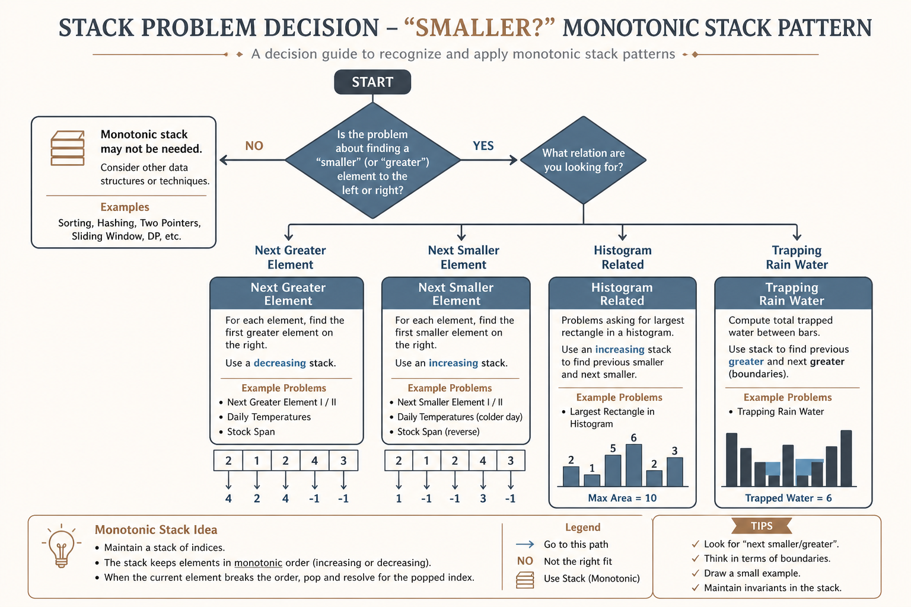
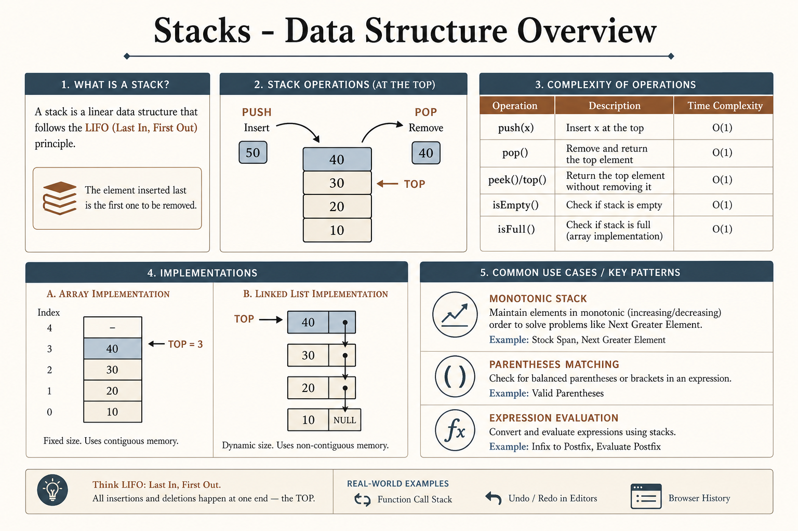

<div align="center">

# 📚 Stacks

### *Last In, First Out (LIFO) - Essential for recursion, parsing, and backtracking*


<p>
  
  
  
</p>

**Last In, First Out (LIFO) - Essential for recursion, parsing, and backtracking**

[⬅️ Previous: Linked Lists](../03_linked_lists/README.md) | [🏠 Home](../README.md) | [Next: Queues ➡️](../05_queues/README.md)

</div>

---

## 🎯 At a Glance

| | |
|:---|:---|
| **In one line** | Last In, First Out (LIFO) - Essential for recursion, parsing, and backtracking |
| **Difficulty** | Medium |
| **Subtopics** | 4 |
| **Problems** | 35+ |

> **How to use this page:** Scan **At a Glance**, then work through theory → visuals → code.

---

## 📂 Subtopics Navigation

| # | Topic | Problems | Link |
|:-:|-------|:--------:|------|
| 1 | Basic Stack | 8+ | [📖 Go →](./01_basic_stack/README.md) |
| 2 | Parentheses | 10+ | [📖 Go →](./02_parentheses/README.md) |
| 3 | Monotonic Stack | 12+ | [📖 Go →](./03_monotonic_stack/README.md) |
| 4 | Expression Evaluation | 8+ | [📖 Go →](./04_expression_evaluation/README.md) |

---

## 📐 Mathematical Foundation

### 1️⃣ Stack Definition (Abstract Data Type)

A stack $S$ is a collection supporting:

$$\text{push}(x): S \to S \cup \{x\}
\text{pop}(): S \to S \setminus \{\text{top}\}, \text{ returns top}
\text{peek}(): \text{returns top without removal}$$

**LIFO Property:** Last element pushed is first element popped.

---

### 2️⃣ Time Complexity

| Operation | Time | Space |
|-----------|:----:|:-----:|
| push(x) | O(1) | O(1) |
| pop() | O(1) | O(1) |
| peek() | O(1) | O(1) |
| isEmpty() | O(1) | O(1) |

**Space for n elements:** O(n)

---

### 3️⃣ Parentheses Matching

**Valid Condition:**

For string $S$ with brackets $\{(, ), [, ], \{, \}\}$:

$$\text{Valid} \iff \forall i: \text{count}_{open}(0..i) \geq \text{count}_{close}(0..i)
\text{AND } \text{count}_{open}(S) = \text{count}_{close}(S)$$

**Stack Invariant:** Stack contains only unmatched opening brackets.

---

### 4️⃣ Monotonic Stack Property

**Monotonically Increasing Stack:**

$$\forall i < j: S[i] \leq S[j]$$

**Monotonically Decreasing Stack:**

$$\forall i < j: S[i] \geq S[j]$$

**Key Insight:** When element $x$ is pushed:

- Pop all elements violating monotonic property

- Each popped element found its "next greater/smaller"

---

### 5️⃣ Next Greater Element (NGE)

**Definition:** For $A[i]$, NGE is first element $A[j]$ where $j > i$ and $A[j] > A[i]$.

**Monotonic Stack Approach:**

$$\text{NGE}[i] = \begin{cases}
A[j] & \text{first } j > i \text{ where } A[j] > A[i] \\
-1 & \text{if no such } j \text{ exists}
\end{cases}$$

**Time Complexity:** O(n) - each element pushed and popped at most once.

---

### 6️⃣ Expression Evaluation

**Shunting-Yard Algorithm (Infix to Postfix):**

**Operator Precedence:**

| Operator | Precedence |
|:--------:|:----------:|
| +, - | 1 |
| *, / | 2 |
| ^ | 3 |
| ( | 0 (in stack) |

**Rule:** Pop operators with higher or equal precedence before pushing.

---

### 7️⃣ Largest Rectangle in Histogram

**Area Formula:**

$$\text{Area}[i] = h[i] \times (\text{right bound}[i] - \text{left bound}[i] - 1)$$

Where:

- $\text{left bound}[i]$ = index of first smaller bar on left

- $\text{right bound}[i]$ = index of first smaller bar on right

**Using Monotonic Stack:** Find both bounds in O(n).

---

### 8️⃣ Min Stack Amortized Analysis

**Challenge:** Get minimum in O(1).

**Solution:** Store $(value, current_min)$ pairs.

$$\text{min at}[i] = \min(value[i], \text{min at}[i-1])$$

**Space Trade-off:** O(n) extra space for O(1) getMin().

---

## 📊 Visual Overview

<div align="center">

### Smaller?


</div>

---

## 🎯 Key Patterns

### Basic Stack Operations
```python
class Stack:
    def __init__(self):
        self.items = []
    
    def push(self, x):
        self.items.append(x)
    
    def pop(self):
        return self.items.pop() if self.items else None
    
    def peek(self):
        return self.items[-1] if self.items else None
    
    def is_empty(self):
        return len(self.items) == 0
```

### Monotonic Stack Template
```python
def next_greater_element(nums: list[int]) -> list[int]:
    """
    Find next greater element for each position.
    Monotonically decreasing stack.
    Time: O(n), Space: O(n)
    """
    n = len(nums)
    result = [-1] * n
    stack = []  # Stores indices
    
    for i in range(n):
        # Pop elements smaller than current
        while stack and nums[stack[-1]] < nums[i]:
            idx = stack.pop()
            result[idx] = nums[i]
        stack.append(i)
    
    return result
```



### Pattern Decision Tree

```text
              Stack Problem
                   |
Parentheses   Monotonic Stack   Shunting-Yard
    |              |              |
 Push open    Dec for NGE    Operator stack
 Pop to match  Inc for NSE    + operand stack
```


### Pattern Checklist
- [ ] Can I use monotonic stack for O(n)?
- [ ] Do I need auxiliary stack for min/max?
- [ ] Should I store indices or values?
- [ ] Is this a matching/nesting problem?
- [ ] Can I solve without stack (two pointers)?
- [ ] Do I need to process in reverse?


---

## 🏆 LeetCode Problems

### 🟢 Easy
| # | Problem | Pattern | Time | Space |
|:-:|---------|---------|:----:|:-----:|
| 20 | [Valid Parentheses](https://leetcode.com/problems/valid-parentheses/) | Stack Matching | O(n) | O(n) |
| 155 | [Min Stack](https://leetcode.com/problems/min-stack/) | Auxiliary Stack | O(1) | O(n) |
| 232 | [Implement Queue using Stacks](https://leetcode.com/problems/implement-queue-using-stacks/) | Two Stacks | O(1)* | O(n) |
| 496 | [Next Greater Element I](https://leetcode.com/problems/next-greater-element-i/) | Monotonic Stack | O(n) | O(n) |
| 844 | [Backspace String Compare](https://leetcode.com/problems/backspace-string-compare/) | Stack | O(n) | O(n) |

### 🟡 Medium
| # | Problem | Pattern | Time | Space |
|:-:|---------|---------|:----:|:-----:|
| 71 | [Simplify Path](https://leetcode.com/problems/simplify-path/) | Stack | O(n) | O(n) |
| 150 | [Evaluate RPN](https://leetcode.com/problems/evaluate-reverse-polish-notation/) | Stack | O(n) | O(n) |
| 227 | [Basic Calculator II](https://leetcode.com/problems/basic-calculator-ii/) | Stack | O(n) | O(n) |
| 739 | [Daily Temperatures](https://leetcode.com/problems/daily-temperatures/) | Monotonic Stack | O(n) | O(n) |
| 901 | [Online Stock Span](https://leetcode.com/problems/online-stock-span/) | Monotonic Stack | O(1)* | O(n) |

### 🔴 Hard
| # | Problem | Pattern | Time | Space |
|:-:|---------|---------|:----:|:-----:|
| 84 | [Largest Rectangle in Histogram](https://leetcode.com/problems/largest-rectangle-in-histogram/) | Monotonic Stack | O(n) | O(n) |
| 224 | [Basic Calculator](https://leetcode.com/problems/basic-calculator/) | Stack + Parsing | O(n) | O(n) |
| 895 | [Maximum Frequency Stack](https://leetcode.com/problems/maximum-frequency-stack/) | Freq Stacks | O(1)* | O(n) |

---

## 📚 References & Learning Resources

### 📖 Core Concepts
| Resource | Description | Link |
|----------|-------------|------|
| **Stack ADT** | Wikipedia overview | [Stack (abstract data type)](https://en.wikipedia.org/wiki/Stack_(abstract_data_type)) |
| **Monotonic Stack** | Pattern guide | [GeeksforGeeks](https://www.geeksforgeeks.org/monotonic-stack/) |
| **LeetCode Explore** | Stack & queue card | [Explore Card](https://leetcode.com/explore/learn/card/queue-stack/) |

### 📝 Practice
| Platform | Focus | Link |
|----------|-------|------|
| **LeetCode** | Stack tag | [Problems](https://leetcode.com/tag/stack/) |

---

## 🌟 Motivational Corner

> "Stacks are the backbone of recursion, parsing, and backtracking - fundamental to computer science."

**Progress Tracker:**

- 🥉 **Bronze:** Solve 10 stack problems

- 🥈 **Silver:** Solve 25 stack problems

- 🥇 **Gold:** Solve 40 stack problems

- 💎 **Platinum:** Master monotonic stack pattern

**Remember:** Once you understand monotonic stack, a whole class of problems becomes O(n)! 🚀

---

<div align="center">

### 🌟 If this helped you, give it a ⭐ on GitHub! 🌟
**Made with ❤️ for the coding community by [Gaurav Goswami](https://github.com/Gaurav14cs17)**

[⬅️ Previous: Linked Lists](../03_linked_lists/README.md) | [🏠 Home](../README.md) | [Next: Queues ➡️](../05_queues/README.md)

---

*Last Updated: December 2025*  
*Licensed under MIT*  
*Happy Coding! 💻✨*

</div>
