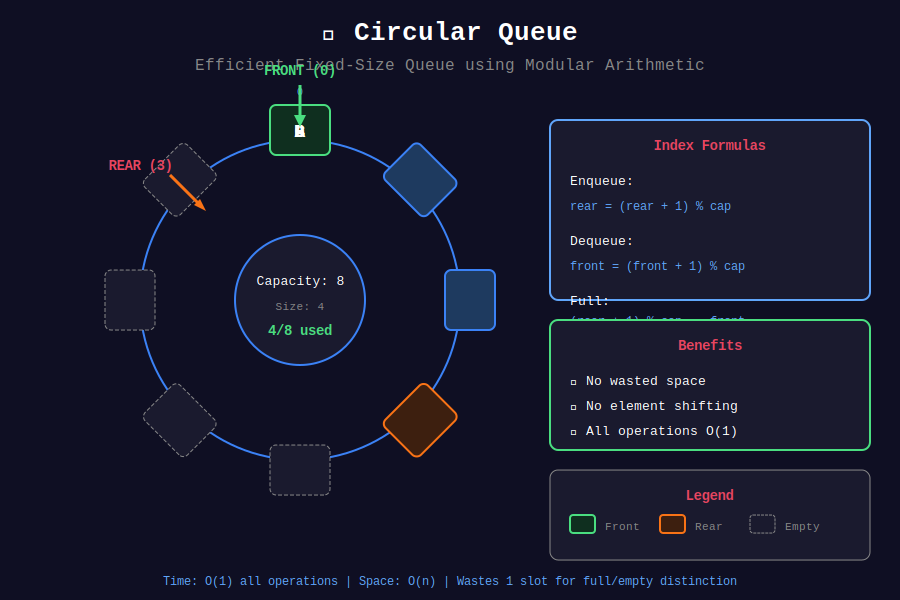
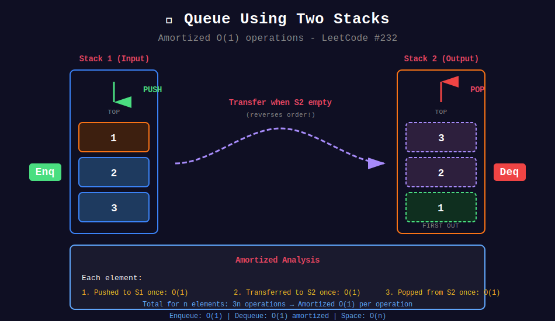

<div align="center">

# 📬 Basic Queue Operations

<p>
  
  
</p>

</div>

---

## 🧭 Navigation

| ⬅️ Previous | 📂 Current | ➡️ Next |
|:------------|:----------:|--------:|
| [🏠 Queues Home](../README.md) | **01. Basic Queue** | [02. BFS Queue →](../02_bfs_queue/README.md) |

---

## 🎨 Visual Diagrams

<div align="center">

### Queue Operations


### Circular Queue


### Queue Using Two Stacks


</div>

---

## 📐 Mathematical Foundations

### 1️⃣ FIFO Property

```math
\text{dequeue order} = \text{enqueue order}
```

**Proof:** Elements are added to rear and removed from front. First added → first removed. ∎

---

### 2️⃣ Circular Queue Index Formula

For queue with capacity $n$:

```math
\text{next}(i) = (i + 1) \mod n
\text{prev}(i) = (i - 1 + n) \mod n
```

**Size Calculation:**

```math
\text{size} = \begin{cases}
\text{rear} - \text{front} & \text{if } \text{rear} \geq \text{front} \\
n - \text{front} + \text{rear} & \text{otherwise}
\end{cases}
```

Or unified: $\text{size} = (\text{rear} - \text{front} + n) \mod n$

---

### 3️⃣ Queue using Two Stacks

**Amortized Analysis:**

Each element:
1. Pushed to $S\_1$ once: O(1)
2. Transferred to $S\_2$ once: O(1)
3. Popped from $S\_2$ once: O(1)

```math
\text{Amortized cost per operation} = \frac{3n}{n} = O(1)
```

---

### 4️⃣ Moving Average Formula

```math
\text{avg}[i] = \frac{1}{k} \sum_{j=i-k+1}^{i} x[j]
```

**Sliding Window Update:**

```math
\text{avg}[i] = \text{avg}[i-1] + \frac{x[i] - x[i-k]}{k}
```

---

## 💻 Code Implementations

```python
class MyCircularQueue:
    """
    Circular Queue using array.
    
    Use (rear + 1) % capacity == front for full check.
    Wastes one slot to distinguish full from empty.
    
    Time: O(1) all operations
    Space: O(k)
    """
    def __init__(self, k: int):
        self.capacity = k + 1  # One extra for full/empty distinction
        self.queue = [0] * self.capacity
        self.front = 0
        self.rear = 0
    
    def enQueue(self, value: int) -> bool:
        if self.isFull():
            return False
        self.queue[self.rear] = value
        self.rear = (self.rear + 1) % self.capacity
        return True
    
    def deQueue(self) -> bool:
        if self.isEmpty():
            return False
        self.front = (self.front + 1) % self.capacity
        return True
    
    def Front(self) -> int:
        return -1 if self.isEmpty() else self.queue[self.front]
    
    def Rear(self) -> int:
        return -1 if self.isEmpty() else self.queue[(self.rear - 1) % self.capacity]
    
    def isEmpty(self) -> bool:
        return self.front == self.rear
    
    def isFull(self) -> bool:
        return (self.rear + 1) % self.capacity == self.front

class MovingAverage:
    """
    Moving average from data stream.
    
    Maintain running sum and circular buffer.
    
    Time: O(1), Space: O(size)
    """
    def __init__(self, size: int):
        self.size = size
        self.queue = []
        self.sum = 0
    
    def next(self, val: int) -> float:
        self.queue.append(val)
        self.sum += val
        
        if len(self.queue) > self.size:
            self.sum -= self.queue.pop(0)
        
        return self.sum / len(self.queue)

class MyStack:
    """
    Stack using two queues.
    
    Push: O(n), Pop: O(1)
    Alternative: Push O(1), Pop O(n)
    """
    def __init__(self):
        from collections import deque
        self.queue = deque()
    
    def push(self, x: int) -> None:
        self.queue.append(x)
        # Rotate to make new element at front
        for _ in range(len(self.queue) - 1):
            self.queue.append(self.queue.popleft())
    
    def pop(self) -> int:
        return self.queue.popleft()
    
    def top(self) -> int:
        return self.queue[0]
    
    def empty(self) -> bool:
        return len(self.queue) == 0
```

---

## 🏆 LeetCode Problems

### 🟢 Easy

| # | Problem | Pattern | Time | Space |
|:-:|---------|---------|:----:|:-----:|
| 225 | [Implement Stack using Queues](https://leetcode.com/problems/implement-stack-using-queues/) | Rotation | O(n) push | O(n) |
| 232 | [Implement Queue using Stacks](https://leetcode.com/problems/implement-queue-using-stacks/) | Two Stacks | O(1)* | O(n) |
| 346 | [Moving Average from Data Stream](https://leetcode.com/problems/moving-average-from-data-stream/) | Sliding Sum | O(1) | O(k) |
| 933 | [Number of Recent Calls](https://leetcode.com/problems/number-of-recent-calls/) | Time Window | O(1)* | O(n) |

### 🟡 Medium

| # | Problem | Pattern | Time | Space |
|:-:|---------|---------|:----:|:-----:|
| 622 | [Design Circular Queue](https://leetcode.com/problems/design-circular-queue/) | Modular Index | O(1) | O(k) |
| 641 | [Design Circular Deque](https://leetcode.com/problems/design-circular-deque/) | Double-ended | O(1) | O(k) |

---

---

## 🎨 Visual Algorithm Walkthrough

### Circular Queue Operations (#622)

```
Capacity = 3 (array size = 4 for full/empty distinction)

Initial: front=0, rear=0, array=[_, _, _, _]
isEmpty: front == rear → True

EnQueue(1):
  array[0] = 1, rear = (0+1)%4 = 1
  [1, _, _, _], front=0, rear=1

EnQueue(2):
  array[1] = 2, rear = (1+1)%4 = 2
  [1, 2, _, _], front=0, rear=2

EnQueue(3):
  array[2] = 3, rear = (2+1)%4 = 3
  [1, 2, 3, _], front=0, rear=3
  isFull: (rear+1)%4 == front → (3+1)%4 == 0 → True

DeQueue():
  front = (0+1)%4 = 1
  [1, 2, 3, _], front=1, rear=3

EnQueue(4):
  array[3] = 4, rear = (3+1)%4 = 0
  [1, 2, 3, 4], front=1, rear=0 (wrapped around!)
```

### Queue using Two Stacks (#232)

```
Amortized O(1) analysis:

s1 (input): [1, 2, 3]  ← push here
s2 (output): []

Enqueue(4): s1 = [1, 2, 3, 4]

Dequeue():
  Transfer s1 → s2:
    s1 = []
    s2 = [3, 2, 1]  (reversed!)
  Pop from s2: return 1
  s2 = [3, 2]

Dequeue():
  s2 not empty, just pop
  return 2
  s2 = [3]

Each element: pushed once, transferred once, popped once = 3 operations
Amortized: 3n/n = O(1) per operation
```

### Moving Average (#346)

```
size = 3

next(1): queue=[1], sum=1, avg=1/1=1.0
next(10): queue=[1,10], sum=11, avg=11/2=5.5
next(3): queue=[1,10,3], sum=14, avg=14/3=4.67
next(5): queue=[10,3,5], sum=18, avg=18/3=6.0
         (removed 1, added 5)
```

---

## 💡 Pattern Recognition Guide

| Problem Keywords | Pattern | Example |
|-----------------|---------|---------|
| "circular queue" | Modular arithmetic | #622 |
| "moving average" | Sliding sum | #346 |
| "queue using stacks" | Two stacks | #232 |
| "stack using queues" | Rotation trick | #225 |
| "recent calls" | Time window | #933 |

---

## 📚 References & Learning Resources

### 📖 Core Concepts
| Resource | Topic | Link |
|----------|-------|------|
| **GeeksforGeeks** | Queue implementation | [Tutorial](https://www.geeksforgeeks.org/queue-data-structure/) |
| **GeeksforGeeks** | Circular queue | [Tutorial](https://www.geeksforgeeks.org/circular-queue-set-1-introduction-array-implementation/) |
| **CP Algorithms** | Queue modifications | [Guide](https://cp-algorithms.com/data_structures/stack_queue_modification.html) |
| **Wikipedia** | Queue ADT | [Article](https://en.wikipedia.org/wiki/Queue_(abstract_data_type)) |

### 📺 Video Tutorials
| Creator | Topic | Link |
|---------|-------|------|
| **Abdul Bari** | Queue data structure | [YouTube](https://www.youtube.com/watch?v=A3ZUpyrnCbM) |
| **NeetCode** | Queue using stacks | [YouTube](https://www.youtube.com/watch?v=rW4vm0-DLYc) |
| **MIT OCW** | Queue implementation | [Lecture](https://ocw.mit.edu/courses/6-006-introduction-to-algorithms-fall-2011/) |

### 🎯 Practice Problems
| Platform | Collection | Link |
|----------|-----------|------|
| **LeetCode** | Queue tag | [Problems](https://leetcode.com/tag/queue/) |
| **HackerRank** | Queue challenges | [Practice](https://www.hackerrank.com/domains/data-structures?filters%5Bsubdomains%5D%5B%5D=queues) |

### 🔬 Advanced Topics
| Topic | Description | Link |
|-------|-------------|------|
| **Circular Buffer** | Ring buffer applications | [Wikipedia](https://en.wikipedia.org/wiki/Circular_buffer) |
| **Amortized Analysis** | Queue from stacks | [Tutorial](https://www.geeksforgeeks.org/amortized-analysis-introduction/) |
| **Priority Queue** | Heap-based queue | [Tutorial](https://www.geeksforgeeks.org/priority-queue-set-1-introduction/) |

### 📊 Visualization
| Tool | Purpose | Link |
|------|---------|------|
| **VisuAlgo** | Interactive queue | [Website](https://visualgo.net/en/list) |
| **CS Animations** | Queue operations | [Website](https://www.cs.usfca.edu/~galles/visualization/QueueArray.html) |

---

## 💡 Pro Tips

> **🎯 Circular Queue Trick:** Use capacity+1 array size. One wasted slot distinguishes full from empty!

> **⚡ Two-Stack Queue:** Only transfer when output stack empty. Amortized O(1) magic!

> **🔍 Moving Average:** Maintain running sum. Update: `sum = sum - old + new`. O(1) per operation!

> **📊 When to Use Queue:** FIFO order needed, BFS, level-order, task scheduling, buffering.

---

## 🎖️ Practice Roadmap

**Week 1: Fundamentals**
1. Implement basic queue (array & linked list)
2. Solve #622 (Design Circular Queue)
3. Solve #232 (Queue using Stacks)

**Week 2: Applications**
4. Solve #225 (Stack using Queues)
5. Solve #346 (Moving Average)
6. Solve #933 (Number of Recent Calls)

**Week 3: Advanced**
7. Solve #641 (Design Circular Deque)
8. Implement priority queue from scratch

---

## ❓ Interview Q&A

**Q: Why use circular queue instead of linear queue?**  
A: Avoids wasted space. Linear queue needs shifting or wastes front space. Circular reuses space efficiently.

**Q: How to distinguish full from empty in circular queue?**  
A: Three methods: 1) Waste one slot, 2) Use count variable, 3) Use flag. Wasting one slot is simplest!

**Q: Why is queue-from-stacks amortized O(1)?**  
A: Each element pushed once, transferred once, popped once. Total 3n operations for n elements = O(1) per op.

**Q: When to use array vs linked list for queue?**  
A: Array (circular) for fixed max size and cache locality. Linked list for unbounded size.

---

<div align="center">

**Made with ❤️ for the coding community by [Gaurav Goswami](https://github.com/Gaurav14cs17)**

</div>

---

## 🧭 Navigation

| ⬅️ Previous | 📂 Current | ➡️ Next |
|:------------|:----------:|--------:|
| [🏠 Queues Home](../README.md) | **01. Basic Queue** | [02. BFS Queue →](../02_bfs_queue/README.md) |
