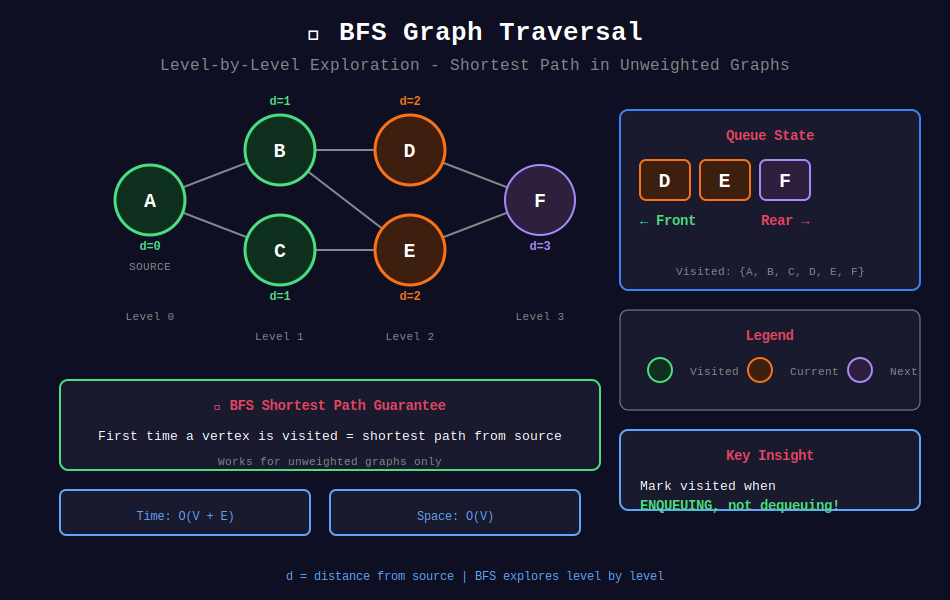
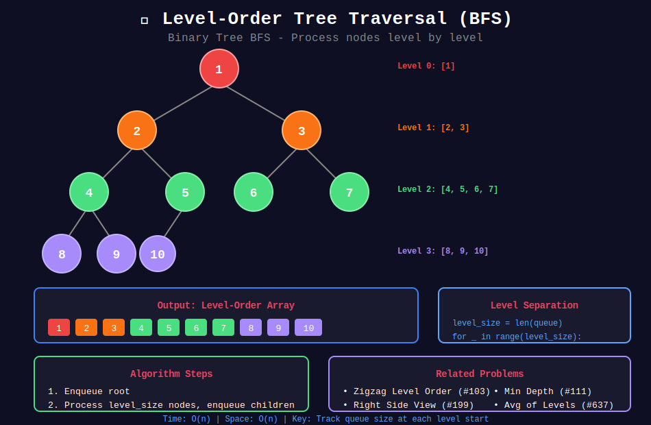

<div align="center">

# 🌊 BFS Queue Problems

<p>
  
  
</p>

</div>

---

## 🧭 Navigation

| ⬅️ Previous | 📂 Current | ➡️ Next |
|:------------|:----------:|--------:|
| [← 01. Basic Queue](../01_basic_queue/README.md) | **02. BFS Queue** | [03. Deque Problems →](../03_deque_problems/README.md) |

---

## 🎨 Visual Diagrams

<div align="center">

### BFS Graph Traversal


### Level Order Tree Traversal


</div>

---

## 📐 Mathematical Foundations

### 1️⃣ BFS Correctness for Shortest Path

**Theorem:** BFS finds shortest path in unweighted graph.

**Proof by Induction:**

**Invariant:** When vertex $v$ is dequeued, $d[v]$ = shortest distance from source.

**Base:** Source $s$ has $d[s] = 0$ (correct).

**Inductive:** Assume true for all vertices at distance $\leq k$.
- Vertices at distance $k+1$ are discovered from vertices at distance $k$
- They're assigned distance $k+1$ when first seen
- BFS processes in order → first discovery = shortest path ∎

---

### 2️⃣ BFS Complexity Analysis

$$T(V, E) = O(V + E)$$

**Breakdown:**
- Queue operations: Each vertex enqueued/dequeued once → $O(V)$
- Edge examination: Each edge checked once (directed) or twice (undirected) → $O(E)$

**Space:** $O(V)$ for visited set and queue.

---

### 3️⃣ Level-Order Traversal

**Tree Levels:**

$$\text{Level } k = \{v : \text{dist}(root, v) = k\}$$

**Processing:** Separate levels by tracking queue size.

```
Level 0: [root]
Level 1: [children of root]
Level 2: [grandchildren]
...
```

---

### 4️⃣ Multi-Source BFS

**Problem:** Find shortest distance to nearest source.

**Initialization:** Enqueue all sources with distance 0.

**Formula:**

$$d[v] = \min_{s \in \text{sources}} \text{dist}(s, v)$$

---

### 5️⃣ Grid BFS

**4-directional movement:**

$$\text{neighbors}(x, y) = \{(x±1, y), (x, y±1)\}$$

**8-directional movement:**

$$\text{neighbors}(x, y) = \{(x+dx, y+dy) : dx, dy \in \{-1, 0, 1\}, (dx, dy) \neq (0, 0)\}$$

---

### 6️⃣ Shortest Path with State

For problems with additional state (e.g., keys collected):

$$\text{state} = (\text{position}, \text{extra\_info})$$

$$d[(x, y, state)] = \text{shortest path to } (x, y) \text{ with given state}$$

---

## 💻 Code Implementations

```python
from collections import deque

def levelOrder(root) -> list[list[int]]:
    """
    Level-order traversal of binary tree.
    
    Separate levels by processing queue size.
    
    Time: O(n), Space: O(n)
    """
    if not root:
        return []
    
    result = []
    queue = deque([root])
    
    while queue:
        level_size = len(queue)
        level = []
        
        for _ in range(level_size):
            node = queue.popleft()
            level.append(node.val)
            
            if node.left:
                queue.append(node.left)
            if node.right:
                queue.append(node.right)
        
        result.append(level)
    
    return result


def numIslands(grid: list[list[str]]) -> int:
    """
    Count number of islands using BFS.
    
    Time: O(m*n), Space: O(min(m, n))
    """
    if not grid:
        return 0
    
    m, n = len(grid), len(grid[0])
    count = 0
    
    def bfs(start_i: int, start_j: int):
        queue = deque([(start_i, start_j)])
        grid[start_i][start_j] = '0'  # Mark visited
        
        while queue:
            i, j = queue.popleft()
            for di, dj in [(0, 1), (0, -1), (1, 0), (-1, 0)]:
                ni, nj = i + di, j + dj
                if 0 <= ni < m and 0 <= nj < n and grid[ni][nj] == '1':
                    grid[ni][nj] = '0'
                    queue.append((ni, nj))
    
    for i in range(m):
        for j in range(n):
            if grid[i][j] == '1':
                bfs(i, j)
                count += 1
    
    return count


def orangesRotting(grid: list[list[int]]) -> int:
    """
    Rotting Oranges - Multi-source BFS.
    
    Time: O(m*n), Space: O(m*n)
    """
    m, n = len(grid), len(grid[0])
    queue = deque()
    fresh = 0
    
    # Initialize with all rotten oranges
    for i in range(m):
        for j in range(n):
            if grid[i][j] == 2:
                queue.append((i, j, 0))  # (row, col, time)
            elif grid[i][j] == 1:
                fresh += 1
    
    if fresh == 0:
        return 0
    
    max_time = 0
    while queue:
        i, j, time = queue.popleft()
        
        for di, dj in [(0, 1), (0, -1), (1, 0), (-1, 0)]:
            ni, nj = i + di, j + dj
            if 0 <= ni < m and 0 <= nj < n and grid[ni][nj] == 1:
                grid[ni][nj] = 2
                fresh -= 1
                max_time = time + 1
                queue.append((ni, nj, time + 1))
    
    return max_time if fresh == 0 else -1


def shortestPathBinaryMatrix(grid: list[list[int]]) -> int:
    """
    Shortest path in binary matrix (8-directional).
    
    Time: O(n²), Space: O(n²)
    """
    n = len(grid)
    if grid[0][0] == 1 or grid[n-1][n-1] == 1:
        return -1
    
    directions = [(-1,-1),(-1,0),(-1,1),(0,-1),(0,1),(1,-1),(1,0),(1,1)]
    queue = deque([(0, 0, 1)])  # (row, col, distance)
    grid[0][0] = 1  # Mark visited
    
    while queue:
        i, j, dist = queue.popleft()
        
        if i == n - 1 and j == n - 1:
            return dist
        
        for di, dj in directions:
            ni, nj = i + di, j + dj
            if 0 <= ni < n and 0 <= nj < n and grid[ni][nj] == 0:
                grid[ni][nj] = 1
                queue.append((ni, nj, dist + 1))
    
    return -1


def openLock(deadends: list[str], target: str) -> int:
    """
    Open the lock - BFS on state space.
    
    State: current 4-digit combination
    Transitions: rotate any wheel ±1
    
    Time: O(10⁴), Space: O(10⁴)
    """
    dead = set(deadends)
    if "0000" in dead:
        return -1
    
    queue = deque([("0000", 0)])
    visited = {"0000"}
    
    while queue:
        combo, turns = queue.popleft()
        
        if combo == target:
            return turns
        
        for i in range(4):
            for d in [-1, 1]:
                new_digit = (int(combo[i]) + d) % 10
                new_combo = combo[:i] + str(new_digit) + combo[i+1:]
                
                if new_combo not in visited and new_combo not in dead:
                    visited.add(new_combo)
                    queue.append((new_combo, turns + 1))
    
    return -1
```

---

## 🏆 LeetCode Problems

### 🟢 Easy

| # | Problem | Pattern | Time | Space |
|:-:|---------|---------|:----:|:-----:|
| 111 | [Minimum Depth of Binary Tree](https://leetcode.com/problems/minimum-depth-of-binary-tree/) | Level BFS | O(n) | O(n) |
| 559 | [Maximum Depth of N-ary Tree](https://leetcode.com/problems/maximum-depth-of-n-ary-tree/) | Level BFS | O(n) | O(n) |
| 733 | [Flood Fill](https://leetcode.com/problems/flood-fill/) | Grid BFS | O(mn) | O(mn) |

### 🟡 Medium

| # | Problem | Pattern | Time | Space |
|:-:|---------|---------|:----:|:-----:|
| 102 | [Binary Tree Level Order Traversal](https://leetcode.com/problems/binary-tree-level-order-traversal/) | Level BFS | O(n) | O(n) |
| 103 | [Zigzag Level Order](https://leetcode.com/problems/binary-tree-zigzag-level-order-traversal/) | Level + Flag | O(n) | O(n) |
| 130 | [Surrounded Regions](https://leetcode.com/problems/surrounded-regions/) | Border BFS | O(mn) | O(mn) |
| 199 | [Binary Tree Right Side View](https://leetcode.com/problems/binary-tree-right-side-view/) | Level Last | O(n) | O(n) |
| 200 | [Number of Islands](https://leetcode.com/problems/number-of-islands/) | Grid BFS | O(mn) | O(mn) |
| 286 | [Walls and Gates](https://leetcode.com/problems/walls-and-gates/) | Multi-BFS | O(mn) | O(mn) |
| 417 | [Pacific Atlantic Water Flow](https://leetcode.com/problems/pacific-atlantic-water-flow/) | Dual BFS | O(mn) | O(mn) |
| 542 | [01 Matrix](https://leetcode.com/problems/01-matrix/) | Multi-BFS | O(mn) | O(mn) |
| 752 | [Open the Lock](https://leetcode.com/problems/open-the-lock/) | State BFS | O(10⁴) | O(10⁴) |
| 994 | [Rotting Oranges](https://leetcode.com/problems/rotting-oranges/) | Multi-BFS | O(mn) | O(mn) |
| 1091 | [Shortest Path in Binary Matrix](https://leetcode.com/problems/shortest-path-in-binary-matrix/) | 8-dir BFS | O(n²) | O(n²) |

### 🔴 Hard

| # | Problem | Pattern | Time | Space |
|:-:|---------|---------|:----:|:-----:|
| 127 | [Word Ladder](https://leetcode.com/problems/word-ladder/) | Graph BFS | O(M²×N) | O(M×N) |
| 317 | [Shortest Distance from All Buildings](https://leetcode.com/problems/shortest-distance-from-all-buildings/) | Multi-BFS | O(m²n²) | O(mn) |
| 815 | [Bus Routes](https://leetcode.com/problems/bus-routes/) | Route BFS | O(N²) | O(N) |

---

---

## 🎨 Visual Algorithm Walkthrough

### Level-Order Traversal (#102)

```
Tree:
       3
      / \
     9  20
       /  \
      15   7

BFS with level tracking:

Initial: queue = [3], result = []

Level 0:
  size = 1
  Process: 3 → level = [3]
  Add children: 9, 20
  queue = [9, 20]
  result = [[3]]

Level 1:
  size = 2
  Process: 9 → level = [9]
  Process: 20 → level = [9, 20]
  Add children: 15, 7
  queue = [15, 7]
  result = [[3], [9, 20]]

Level 2:
  size = 2
  Process: 15 → level = [15]
  Process: 7 → level = [15, 7]
  queue = []
  result = [[3], [9, 20], [15, 7]]
```

### Number of Islands (#200)

```
Grid:
1 1 0
0 1 0
0 0 1

BFS from each unvisited '1':

Island 1: Start (0,0)
  Queue: [(0,0)]
  Visit (0,0) → mark 0, add neighbors
  Queue: [(0,1), (1,0)]
  Visit (0,1) → mark 0, add (1,1)
  Visit (1,0) → already 0
  Visit (1,1) → mark 0
  Count = 1

Island 2: Start (2,2)
  Queue: [(2,2)]
  Visit (2,2) → mark 0
  Count = 2

Result: 2 islands
```

### Rotting Oranges (#994)

```
Grid (2=rotten, 1=fresh):
2 1 1
1 1 0
0 1 1

Multi-source BFS:

Time 0: Queue = [(0,0)]
  Fresh count = 6

Time 1: Process (0,0)
  Rot (0,1) and (1,0)
  Queue = [(0,1,1), (1,0,1)]
  Fresh = 4

Time 2: Process (0,1) and (1,0)
  Rot (0,2), (1,1)
  Queue = [(0,2,2), (1,1,2)]
  Fresh = 2

Time 3: Process (0,2) and (1,1)
  Rot (1,2)
  Queue = [(1,2,3)]
  Fresh = 1

Time 4: Process (1,2)
  Rot (2,2)
  Queue = [(2,2,4)]
  Fresh = 0

Result: 4 minutes
```

### Open the Lock (#752)

```
Start: "0000", Target: "0202", Deadends: ["0201"]

BFS on state space:

Turn 0: Queue = [("0000", 0)]

Turn 1: From "0000", generate 8 neighbors:
  "1000", "9000", "0100", "0900", ...
  Queue = [("1000",1), ("9000",1), ...]

Turn 2-5: Continue exploring...

Turn 6: Reach "0202"
  Path: 0000 → 1000 → 1100 → 1200 → 1201 → 1202 → 0202
  Result: 6 turns
```

---

## 💡 Pattern Recognition Guide

| Problem Keywords | Pattern | Example |
|-----------------|---------|---------|
| "level order" | Level-by-level BFS | #102, #103 |
| "shortest path unweighted" | Standard BFS | #1091, #752 |
| "number of islands" | Grid BFS | #200 |
| "distance from all X" | Multi-source BFS | #542, #994 |
| "right side view" | Level last element | #199 |
| "zigzag" | Level with direction flag | #103 |
| "minimum depth" | BFS early termination | #111 |
| "word ladder" | Graph transformation BFS | #127 |

---

## 📚 References & Learning Resources

### 📖 Core Concepts
| Resource | Topic | Link |
|----------|-------|------|
| **Wikipedia** | BFS algorithm | [Article](https://en.wikipedia.org/wiki/Breadth-first_search) |
| **GeeksforGeeks** | BFS complete guide | [Tutorial](https://www.geeksforgeeks.org/breadth-first-search-or-bfs-for-a-graph/) |
| **GeeksforGeeks** | Grid BFS | [Tutorial](https://www.geeksforgeeks.org/shortest-path-in-a-binary-maze/) |
| **CP Algorithms** | BFS applications | [Guide](https://cp-algorithms.com/graph/breadth-first-search.html) |

### 📺 Video Tutorials
| Creator | Topic | Link |
|---------|-------|------|
| **NeetCode** | BFS problems playlist | [YouTube](https://www.youtube.com/playlist?list=PLot-Xpze53leU0Ec0VkBhnf4npMRFiNcB) |
| **NeetCode** | Number of Islands | [YouTube](https://www.youtube.com/watch?v=pV2kpPD66nE) |
| **NeetCode** | Rotting Oranges | [YouTube](https://www.youtube.com/watch?v=y704fEOx0s0) |
| **Abdul Bari** | BFS algorithm | [YouTube](https://www.youtube.com/watch?v=oDqjPvD54Ss) |
| **William Fiset** | BFS grid traversal | [YouTube](https://www.youtube.com/watch?v=KiCBXu4P-2Y) |
| **Back To Back SWE** | BFS problems | [YouTube](https://www.youtube.com/watch?v=xlVX7dXLS64) |

### 🎯 Practice Collections
| Platform | Focus | Link |
|----------|-------|------|
| **LeetCode** | BFS tag | [Problems](https://leetcode.com/tag/breadth-first-search/) |
| **Codeforces** | Graph traversal | [Problemset](https://codeforces.com/problemset?tags=graphs) |
| **HackerRank** | BFS challenges | [Practice](https://www.hackerrank.com/domains/algorithms?filters%5Bsubdomains%5D%5B%5D=graph-theory) |

### 🔬 Advanced Topics
| Topic | Description | Link |
|-------|-------------|------|
| **Multi-Source BFS** | Simultaneous BFS from multiple sources | [Tutorial](https://www.geeksforgeeks.org/multi-source-shortest-path-in-unweighted-graph/) |
| **Bidirectional BFS** | Meet in the middle | [GeeksforGeeks](https://www.geeksforgeeks.org/bidirectional-search/) |
| **BFS on Implicit Graphs** | State space exploration | [Tutorial](https://www.geeksforgeeks.org/water-jug-problem-using-bfs/) |
| **BFS Tree Properties** | Level, parent tracking | [Article](https://en.wikipedia.org/wiki/Breadth-first_search#Analysis) |

### 📊 Visualization Tools
| Tool | Purpose | Link |
|------|---------|------|
| **VisuAlgo** | BFS visualization | [Website](https://visualgo.net/en/dfsbfs) |
| **Algorithm Visualizer** | Graph BFS | [Website](https://algorithm-visualizer.org/brute-force/breadth-first-search) |
| **CS Animations** | BFS step-by-step | [Website](https://www.cs.usfca.edu/~galles/visualization/BFS.html) |

### 📐 Mathematical Proofs
| Topic | Description | Link |
|-------|-------------|------|
| **BFS Correctness** | Shortest path proof | [MIT OCW](https://ocw.mit.edu/courses/6-006-introduction-to-algorithms-fall-2011/) |
| **Complexity Analysis** | O(V+E) derivation | [CLRS](https://mitpress.mit.edu/books/introduction-algorithms) |

---

## 💡 Pro Tips

> **🎯 Mark Visited When Enqueuing:** Not when dequeuing! Prevents duplicate entries in queue.

> **⚡ Level Separation:** Use `len(queue)` at start of each iteration to process one level at a time.

> **🔍 Multi-Source BFS:** Initialize queue with ALL sources at distance 0. Finds nearest source for each cell!

> **📊 Grid BFS:** Always check boundaries: `0 <= x < m and 0 <= y < n`. Mark visited to avoid cycles.

> **🌊 Early Termination:** For "minimum depth" problems, return as soon as target found. BFS guarantees shortest!

---

## 🎖️ Practice Roadmap

**Week 1: Tree BFS**
1. Solve #102 (Level Order Traversal) - Master level tracking
2. Solve #103 (Zigzag Level Order) - Add direction flag
3. Solve #199 (Right Side View) - Last element per level
4. Solve #111 (Minimum Depth) - Early termination

**Week 2: Grid BFS**
5. Solve #733 (Flood Fill) - Basic grid BFS
6. Solve #200 (Number of Islands) - Connected components
7. Solve #994 (Rotting Oranges) - Multi-source BFS
8. Solve #542 (01 Matrix) - Distance to nearest
9. Solve #1091 (Shortest Path Binary Matrix) - 8-directional

**Week 3: Advanced BFS**
10. Solve #752 (Open the Lock) - State space BFS
11. Solve #127 (Word Ladder) - Graph transformation
12. Solve #286 (Walls and Gates) - Multi-source distance
13. Solve #417 (Pacific Atlantic) - Dual BFS

---

## ❓ Interview Q&A

**Q: Why BFS for shortest path, not DFS?**  
A: BFS explores level by level. First time we reach a node = shortest path. DFS explores deeply first, may find longer paths first.

**Q: How to handle level-order traversal?**  
A: Capture `size = len(queue)` before processing level. Process exactly `size` nodes for that level.

**Q: When to use multi-source BFS?**  
A: When finding "distance to nearest X" for all cells. Initialize queue with all X positions at distance 0.

**Q: BFS vs DFS for islands?**  
A: Both work! BFS uses queue, DFS uses recursion/stack. BFS better for shortest path, DFS simpler code.

**Q: How to avoid revisiting in grid BFS?**  
A: Mark visited when adding to queue (not when processing). Can modify grid or use separate visited set.

---

## 🔥 Key Insights

- **BFS Guarantee:** First visit = shortest path in unweighted graphs
- **Level Processing:** Track queue size to separate levels
- **Multi-Source:** Start from ALL sources simultaneously
- **Grid = Graph:** 4/8 neighbors = edges, cells = vertices
- **State Space BFS:** Each state is a node, transitions are edges

---

<div align="center">

**Made with ❤️ for the coding community by [Gaurav Goswami](https://github.com/Gaurav14cs17)**

</div>

---

## 🧭 Navigation

| ⬅️ Previous | 📂 Current | ➡️ Next |
|:------------|:----------:|--------:|
| [← 01. Basic Queue](../01_basic_queue/README.md) | **02. BFS Queue** | [03. Deque Problems →](../03_deque_problems/README.md) |
