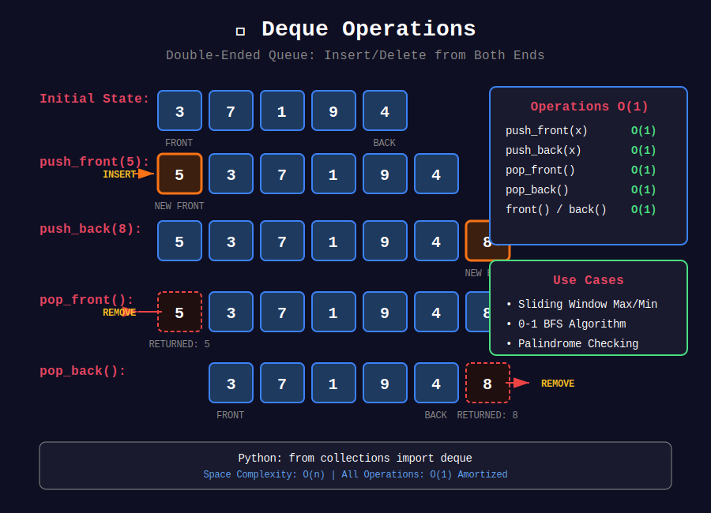
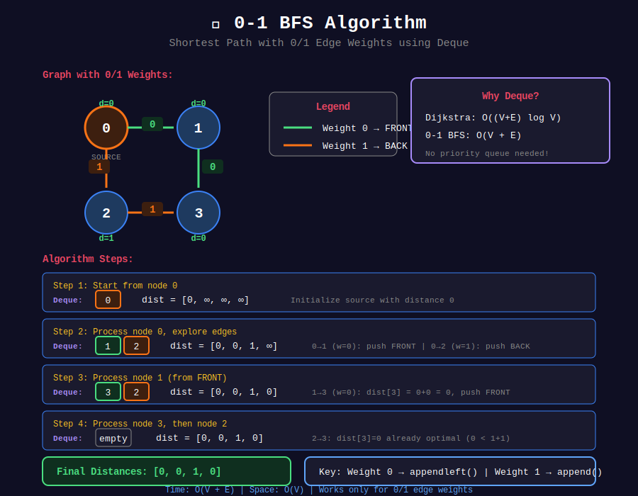

<div align="center">

# 🔄 Deque Problems

<p>
  
  
</p>

</div>

---

## 🧭 Navigation

| ⬅️ Previous | 📂 Current | ➡️ Next Topic |
|:------------|:----------:|--------:|
| [← 02. BFS Queue](../02_bfs_queue/README.md) | **03. Deque Problems** | [🏠 Queues Home](../README.md) → [Hash Tables](../../06_hash_tables/README.md) |

---

## 🎨 Visual Diagrams

<div align="center">

### Deque Operations


### Sliding Window Maximum


### 0-1 BFS


</div>

---

## 📐 Mathematical Foundations

### 1️⃣ Deque Definition

**Double-Ended Queue:** Insert/delete from both ends.

| Operation | Complexity |
|-----------|:----------:|
| push_front(x) | O(1) |
| push_back(x) | O(1) |
| pop_front() | O(1) |
| pop_back() | O(1) |
| front() | O(1) |
| back() | O(1) |

---

### 2️⃣ Monotonic Deque for Sliding Window

**Problem:** Find max/min in every window of size $k$.

**Invariant:** Deque stores indices in decreasing order of values.

**Property:**

```math
\text{front of deque} = \text{index of maximum in current window}

```

**Why O(n)?**

- Each element added once, removed once

- Total operations: $2n = O(n)$ ∎

---

### 3️⃣ Sliding Window Maximum

**Formal:**

```math
\text{result}[i] = \max_{j=i}^{i+k-1} nums[j]

```

**Monotonic Deque Approach:**

1. Remove indices outside window from front

2. Remove indices with smaller values from back

3. Front is always the maximum

---

### 4️⃣ Shortest Subarray with Sum ≥ K

**Challenge:** Array may have negative numbers.

**Key Insight:** Use monotonic deque on prefix sums.

```math
\text{sum}(i, j) = P[j] - P[i-1] \geq k
P[i-1] \leq P[j] - k

```

Find smallest $j - i$ where condition holds.

---

### 5️⃣ 0-1 BFS

**Problem:** Shortest path with edge weights 0 or 1.

**Solution:** Use deque instead of priority queue.

- Weight 0: push to front

- Weight 1: push to back

**Time:** O(V + E) instead of O((V+E) log V)

---

## 💻 Code Implementations

```python
from collections import deque

def maxSlidingWindow(nums: list[int], k: int) -> list[int]:
    """
    Sliding window maximum using monotonic deque.
    
    Deque stores indices in decreasing order of values.
    Front is always the maximum of current window.
    
    Time: O(n), Space: O(k)
    """
    result = []
    dq = deque()  # Stores indices
    
    for i, num in enumerate(nums):
        # Remove indices outside window
        while dq and dq[0] <= i - k:
            dq.popleft()
        
        # Remove smaller elements (they'll never be max)
        while dq and nums[dq[-1]] < num:
            dq.pop()
        
        dq.append(i)
        
        # Start adding results once window is complete
        if i >= k - 1:
            result.append(nums[dq[0]])
    
    return result

def minSlidingWindow(nums: list[int], k: int) -> list[int]:
    """
    Sliding window minimum using monotonic deque.
    
    Same as max but maintain increasing order.
    
    Time: O(n), Space: O(k)
    """
    result = []
    dq = deque()
    
    for i, num in enumerate(nums):
        while dq and dq[0] <= i - k:
            dq.popleft()
        
        while dq and nums[dq[-1]] > num:  # Changed: > instead of <
            dq.pop()
        
        dq.append(i)
        
        if i >= k - 1:
            result.append(nums[dq[0]])
    
    return result

def shortestSubarray(nums: list[int], k: int) -> int:
    """
    Shortest subarray with sum at least k.
    
    Use prefix sums and monotonic deque.
    Find j - i minimum where P[j] - P[i] >= k.
    
    Time: O(n), Space: O(n)
    """
    n = len(nums)
    
    # Build prefix sums
    prefix = [0] * (n + 1)
    for i in range(n):
        prefix[i + 1] = prefix[i] + nums[i]
    
    result = float('inf')
    dq = deque()  # Stores indices with increasing prefix values
    
    for j in range(n + 1):
        # Check if we can form valid subarray
        while dq and prefix[j] - prefix[dq[0]] >= k:
            result = min(result, j - dq.popleft())
        
        # Maintain monotonicity
        while dq and prefix[j] <= prefix[dq[-1]]:
            dq.pop()
        
        dq.append(j)
    
    return result if result != float('inf') else -1

def constrainedSubsetSum(nums: list[int], k: int) -> int:
    """
    Constrained Subsequence Sum.
    
    dp[i] = max sum ending at i with gap at most k.
    dp[i] = nums[i] + max(0, max(dp[i-k:i]))
    
    Use monotonic deque to find max in window.
    
    Time: O(n), Space: O(n)
    """
    n = len(nums)
    dp = nums.copy()
    dq = deque([0])  # Stores indices with decreasing dp values
    
    for i in range(1, n):
        # Remove indices outside window
        while dq and dq[0] < i - k:
            dq.popleft()
        
        # dp[i] = nums[i] + max(0, dp[dq[0]])
        dp[i] = nums[i] + max(0, dp[dq[0]])
        
        # Maintain decreasing order
        while dq and dp[dq[-1]] <= dp[i]:
            dq.pop()
        
        dq.append(i)
    
    return max(dp)

def zeroOneBFS(graph: list[list[tuple]], n: int, start: int) -> list[int]:
    """
    0-1 BFS: Shortest path with edge weights 0 or 1.
    
    Use deque: weight 0 → front, weight 1 → back.
    
    Time: O(V + E), Space: O(V)
    """
    dist = [float('inf')] * n
    dist[start] = 0
    dq = deque([start])
    
    while dq:
        u = dq.popleft()
        
        for v, weight in graph[u]:
            if dist[u] + weight < dist[v]:
                dist[v] = dist[u] + weight
                if weight == 0:
                    dq.appendleft(v)
                else:
                    dq.append(v)
    
    return dist

```

---

## 🏆 LeetCode Problems

### 🟡 Medium

| # | Problem | Pattern | Time | Space |
|:-:|---------|---------|:----:|:-----:|
| 641 | [Design Circular Deque](https://leetcode.com/problems/design-circular-deque/) | Implementation | O(1) | O(k) |
| 1696 | [Jump Game VI](https://leetcode.com/problems/jump-game-vi/) | Monotonic Deque | O(n) | O(k) |

### 🔴 Hard

| # | Problem | Pattern | Time | Space |
|:-:|---------|---------|:----:|:-----:|
| 239 | [Sliding Window Maximum](https://leetcode.com/problems/sliding-window-maximum/) | Monotonic Deque | O(n) | O(k) |
| 862 | [Shortest Subarray with Sum ≥ K](https://leetcode.com/problems/shortest-subarray-with-sum-at-least-k/) | Prefix + Deque | O(n) | O(n) |
| 1425 | [Constrained Subsequence Sum](https://leetcode.com/problems/constrained-subsequence-sum/) | DP + Deque | O(n) | O(n) |
| 1499 | [Max Value of Equation](https://leetcode.com/problems/max-value-of-equation/) | Monotonic Deque | O(n) | O(n) |

---

---

## 🎨 Visual Algorithm Walkthrough

### Sliding Window Maximum (#239)

```
nums = [1, 3, -1, -3, 5, 3, 6, 7], k = 3

Monotonic decreasing deque (stores indices):

i=0, num=1:
  deque = [0]
  (window not complete yet)

i=1, num=3:
  Pop 0 (nums[0]=1 < 3)
  deque = [1]

i=2, num=-1:
  deque = [1, 2]  (3 > -1, keep both)
  Window [1,3,-1]: max = nums[1] = 3
  result = [3]

i=3, num=-3:
  deque = [1, 2, 3]
  Window [3,-1,-3]: max = nums[1] = 3
  result = [3, 3]

i=4, num=5:
  Remove 1 (outside window)
  Pop 2, 3 (smaller than 5)
  deque = [4]
  Window [-1,-3,5]: max = nums[4] = 5
  result = [3, 3, 5]

i=5, num=3:
  deque = [4, 5]  (5 > 3)
  Window [-3,5,3]: max = nums[4] = 5
  result = [3, 3, 5, 5]

i=6, num=6:
  Remove 4 (outside window)
  Pop 5 (3 < 6)
  deque = [6]
  Window [5,3,6]: max = nums[6] = 6
  result = [3, 3, 5, 5, 6]

i=7, num=7:
  Pop 6 (6 < 7)
  deque = [7]
  Window [3,6,7]: max = nums[7] = 7
  result = [3, 3, 5, 5, 6, 7]

```

### Shortest Subarray Sum ≥ K (#862)

```
nums = [2, -1, 2], k = 3

Prefix sums: P = [0, 2, 1, 3]

Monotonic increasing deque on prefix sums:

j=0: P[0]=0
  deque = [0]

j=1: P[1]=2
  Check: P[1]-P[0] = 2 < 3 (not valid)
  deque = [0, 1]  (2 > 0, add)

j=2: P[2]=1
  Check: P[2]-P[0] = 1 < 3 (not valid)
  Pop 1 (P[1]=2 > P[2]=1, violates monotonicity)
  deque = [0, 2]

j=3: P[3]=3
  Check: P[3]-P[0] = 3 ≥ 3 ✓
    result = min(inf, 3-0) = 3
    Remove 0
  Check: P[3]-P[2] = 2 < 3 (not valid)
  deque = [2, 3]

Result: 3 (subarray [2, -1, 2])

```

### 0-1 BFS Example

```
Graph with 0/1 edge weights:
0 --0--> 1

|        |
1        0
|        |
v        v
2 --1--> 3

Start from 0:

Initial: deque = [0], dist = [0, ∞, ∞, ∞]

Process 0:
  Edge 0→1 (weight 0): dist[1] = 0, add to FRONT
  Edge 0→2 (weight 1): dist[2] = 1, add to BACK
  deque = [1, 2]

Process 1 (from front):
  Edge 1→3 (weight 0): dist[3] = 0, add to FRONT
  deque = [3, 2]

Process 3:
  No updates
  deque = [2]

Process 2:
  Edge 2→3 (weight 1): dist[3] = min(0, 2) = 0 (no update)
  deque = []

Final distances: [0, 0, 1, 0]

```

---

## 📊 When to Use Deque

```
Sliding Window Optimization?
          |
          +-- Need max/min in window → Monotonic Deque
          |
          +-- 0-1 weighted graph → 0-1 BFS with Deque
          |
          +-- DP with sliding window max → Deque DP

```

### Pattern Decision Table

| Problem Type | Deque Type | Store | Maintain |
|-------------|-----------|-------|----------|
| Sliding window max | Decreasing | Indices | Front = max |
| Sliding window min | Increasing | Indices | Front = min |
| Shortest subarray sum | Increasing | Indices | Prefix sums |
| 0-1 BFS | Regular | Nodes | Weight 0 front, 1 back |
| DP sliding max | Decreasing | Indices | Window maximum |

---

## 💡 Pattern Recognition Guide

| Problem Keywords | Pattern | Example |
|-----------------|---------|---------|
| "sliding window maximum" | Monotonic deque | #239 |
| "shortest subarray sum ≥ k" | Prefix + deque | #862 |
| "0-1 weighted graph" | 0-1 BFS | Advanced |
| "jump game" + "constraint" | DP + deque | #1696 |
| "constrained subsequence" | DP + deque | #1425 |
| "max value equation" | Monotonic deque | #1499 |

---

## 📚 References & Learning Resources

### 📖 Core Concepts

| Resource | Topic | Link |
|----------|-------|------|
| **Python Docs** | collections.deque | [Documentation](https://docs.python.org/3/library/collections.html#collections.deque) |
| **CP Algorithms** | Monotonic deque | [Tutorial](https://cp-algorithms.com/data_structures/stack_queue_modification.html) |
| **GeeksforGeeks** | Deque implementation | [Tutorial](https://www.geeksforgeeks.org/deque-set-1-introduction-applications/) |

### 📺 Video Tutorials

| Creator | Topic | Link |
|---------|-------|------|
| **NeetCode** | Sliding Window Maximum | [YouTube](https://www.youtube.com/watch?v=DfljaUwZsOk) |
| **William Fiset** | Monotonic deque | [YouTube](https://www.youtube.com/watch?v=oUznYEjck1M) |
| **Back To Back SWE** | Deque problems | [YouTube](https://www.youtube.com/watch?v=2SXqBsTR6a8) |

### 🎯 Practice Collections

| Platform | Focus | Link |
|----------|-------|------|
| **LeetCode** | Deque tag | [Problems](https://leetcode.com/tag/monotonic-queue/) |
| **Codeforces** | Deque problems | [Problemset](https://codeforces.com/problemset) |

### 🔬 Advanced Topics

| Topic | Description | Link |
|-------|-------------|------|
| **0-1 BFS** | Deque for 0/1 weights | [Codeforces Blog](https://codeforces.com/blog/entry/22276) |
| **Monotonic Deque** | Complete guide | [Tutorial](https://medium.com/algorithms-and-leetcode/monotonic-queue-explained-with-leetcode-problems-7db7c530c1d6) |
| **Deque DP Optimization** | Sliding window DP | [Tutorial](https://www.geeksforgeeks.org/sliding-window-maximum-maximum-of-all-subarrays-of-size-k/) |

### 📊 Visualization Tools

| Tool | Purpose | Link |
|------|---------|------|
| **VisuAlgo** | Deque operations | [Website](https://visualgo.net/en/list) |
| **Algorithm Visualizer** | Monotonic deque | [Website](https://algorithm-visualizer.org/) |

### 📐 Mathematical Analysis

| Topic | Description | Link |
|-------|-------------|------|
| **Amortized O(n)** | Why monotonic deque is O(n) | [Analysis](https://en.wikipedia.org/wiki/Amortized_analysis) |
| **0-1 BFS Correctness** | Proof of optimality | [Paper](https://codeforces.com/blog/entry/22276) |

---

## 💡 Pro Tips

> **🎯 Monotonic Deque Rule:** Decreasing for max, increasing for min. Front always has answer!

> **⚡ O(n) Magic:** Each element added once, removed once. Total = 2n = O(n)!

> **🔍 0-1 BFS:** Weight 0 → front (priority), weight 1 → back. Maintains sorted distances!

> **📊 DP Optimization:** If DP needs max/min of last k values, use monotonic deque to reduce from O(nk) to O(n)!

> **🌊 Prefix Sum Trick:** For subarray sum problems with negatives, use prefix sums + monotonic deque.

---

## 🎖️ Practice Roadmap

**Week 1: Monotonic Deque Basics**

1. Solve #239 (Sliding Window Maximum) - Master the template

2. Implement sliding window minimum

3. Solve #641 (Design Circular Deque) - Implementation

**Week 2: Advanced Deque**

4. Solve #862 (Shortest Subarray Sum ≥ K) - Prefix + deque

5. Solve #1696 (Jump Game VI) - DP + deque

6. Solve #1425 (Constrained Subsequence Sum) - DP optimization

**Week 3: Expert Level**

7. Solve #1499 (Max Value of Equation) - Creative deque use

8. Implement 0-1 BFS

9. Solve problems with 0-1 weighted graphs

---

## ❓ Interview Q&A

**Q: When to use deque vs priority queue for sliding window?**  
A: Deque for max/min in O(n). Priority queue if you need more complex operations (but O(n log k)).

**Q: Why is monotonic deque O(n)?**  
A: Each element pushed once, popped once. Even with nested loop, total operations ≤ 2n.

**Q: How does 0-1 BFS work?**  
A: Weight 0 edges go to front (higher priority), weight 1 to back. Maintains sorted distances without heap!

**Q: When to use monotonic deque vs stack?**  
A: Stack for "next greater/smaller". Deque for "max/min in sliding window".

**Q: Can we use deque for weighted graphs with weights > 1?**  
A: No! Only for 0-1 weights. For general weights, use Dijkstra with priority queue.

---

## 🔥 Key Insights

- **Monotonic Property:** Maintain decreasing/increasing order → O(1) max/min access

- **Amortized O(n):** Each element in/out once across entire algorithm

- **0-1 BFS:** Deque replaces priority queue for 0/1 weights

- **DP Optimization:** Sliding window max/min in DP transitions

- **Prefix Sum Combo:** Powerful for subarray sum problems with negatives

---

<div align="center">

**Made with ❤️ for the coding community by [Gaurav Goswami](https://github.com/Gaurav14cs17)**

</div>

---

## 🧭 Navigation

| ⬅️ Previous | 📂 Current | ➡️ Next Topic |
|:------------|:----------:|--------:|
| [← 02. BFS Queue](../02_bfs_queue/README.md) | **03. Deque Problems** | [🏠 Queues Home](../README.md) → [Hash Tables](../../06_hash_tables/README.md) |
