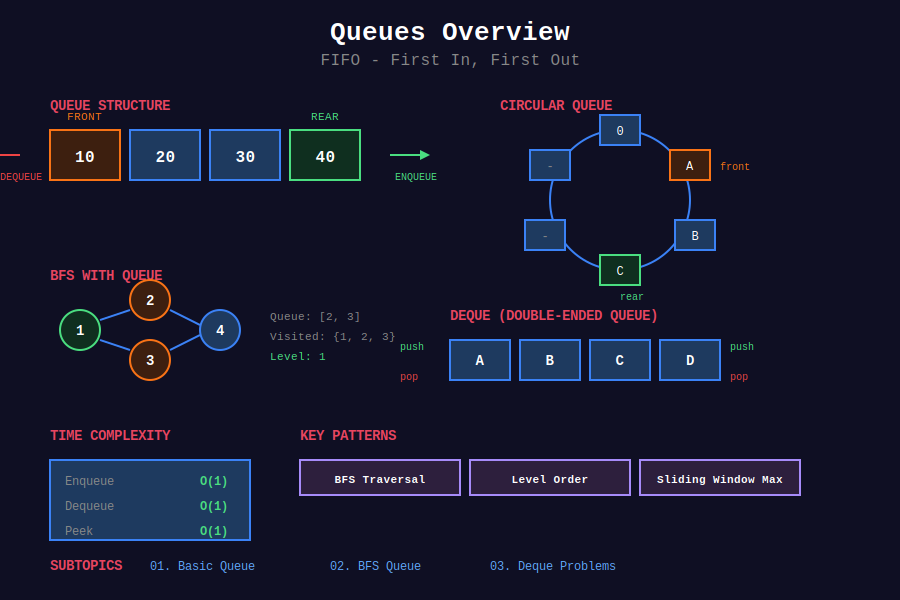

<div align="center">

# 📬 Queues



<p>
  
  
  
</p>

**First In, First Out (FIFO) - Essential for BFS and level-order traversal**

[⬅️ Previous: Stacks](../04_stacks/README.md) | [🏠 Home](../README.md) | [Next: Hash Tables ➡️](../06_hash_tables/README.md)

</div>

---

## 📐 Mathematical Foundation

### 1️⃣ Queue Definition (Abstract Data Type)

A queue $Q$ is a collection supporting:

$$
\text{enqueue}(x): Q \to Q \cup \{x\} \text{ (add to rear)}
\text{dequeue}(): Q \to Q \setminus \{\text{front}\} \text{ (remove from front)}
$$

**FIFO Property:** First element enqueued is first element dequeued.

---

### 2️⃣ Time Complexity

| Operation | Array Queue | Linked Queue | Circular Array |
|-----------|:-----------:|:------------:|:--------------:|
| enqueue | O(1)* | O(1) | O(1) |
| dequeue | O(n) | O(1) | O(1) |
| peek | O(1) | O(1) | O(1) |
| isEmpty | O(1) | O(1) | O(1) |

*Amortized for dynamic array

---

### 3️⃣ Circular Queue Mathematics

**Index Mapping:**

$$
\text{rear} = (\text{rear} + 1) \mod \text{capacity}
\text{front} = (\text{front} + 1) \mod \text{capacity}
$$

**Size Calculation:**

$$
\text{size} = (\text{rear} - \text{front} + \text{capacity}) \mod \text{capacity}
$$

**Full Condition:**

$$
(\text{rear} + 1) \mod \text{capacity} = \text{front}
$$

---

### 4️⃣ BFS Time Complexity

For graph with $V$ vertices and $E$ edges:

$$
\boxed{T(V, E) = O(V + E)}
$$

**Proof:**
- Each vertex enqueued at most once: $O(V)$
- Each edge examined at most twice (undirected): $O(E)$
- Total: $O(V + E)$ ∎

---

### 5️⃣ Shortest Path in Unweighted Graph

**BFS Guarantee:** First time a vertex is visited, it's via shortest path.

**Proof (by induction on distance):**

Base: Source vertex has distance 0 (correct).

Inductive: If all vertices at distance $d$ are correctly computed, then vertices discovered from them have distance $d + 1$ (correct). ∎

---

### 6️⃣ Deque (Double-Ended Queue)

**Operations:**

| Operation | Complexity |
|-----------|:----------:|
| push_front | O(1) |
| push_back | O(1) |
| pop_front | O(1) |
| pop_back | O(1) |

**Sliding Window Maximum:** Use monotonic deque.

---

### 7️⃣ Priority Queue (Heap-based)

| Operation | Complexity |
|-----------|:----------:|
| insert | O(log n) |
| extract_min/max | O(log n) |
| peek | O(1) |

**Used in:** Dijkstra's algorithm, Huffman coding, task scheduling.

---

### 8️⃣ Multi-source BFS

**Theorem:** Starting BFS from multiple sources simultaneously finds shortest distance to nearest source.

**Implementation:** Initialize queue with all sources at distance 0.

---

## 📂 Subtopics Navigation

| # | Topic | Problems | Link |
|:-:|-------|:--------:|------|
| 1 | Basic Queue | 8+ | [📖 Go →](./01_basic_queue/README.md) |
| 2 | BFS Queue | 15+ | [📖 Go →](./02_bfs_queue/README.md) |
| 3 | Deque Problems | 8+ | [📖 Go →](./03_deque_problems/README.md) |

---

## 🎯 Key Patterns

### Basic Queue Implementation

```python
from collections import deque

class Queue:
    def __init__(self):
        self.items = deque()
    
    def enqueue(self, x):
        self.items.append(x)
    
    def dequeue(self):
        return self.items.popleft() if self.items else None
    
    def peek(self):
        return self.items[0] if self.items else None
    
    def is_empty(self):
        return len(self.items) == 0
```

### BFS Template

```python
from collections import deque

def bfs(graph, start):
    """
    BFS traversal template.
    Time: O(V + E), Space: O(V)
    """
    visited = {start}
    queue = deque([start])
    distance = {start: 0}
    
    while queue:
        node = queue.popleft()
        
        for neighbor in graph[node]:
            if neighbor not in visited:
                visited.add(neighbor)
                queue.append(neighbor)
                distance[neighbor] = distance[node] + 1
    
    return distance
```

### Multi-source BFS

```python
def multi_source_bfs(grid, sources):
    """
    BFS from multiple sources simultaneously.
    Time: O(m*n), Space: O(m*n)
    """
    from collections import deque
    
    m, n = len(grid), len(grid[0])
    queue = deque(sources)
    distance = {src: 0 for src in sources}
    
    while queue:
        x, y = queue.popleft()
        for dx, dy in [(0, 1), (0, -1), (1, 0), (-1, 0)]:
            nx, ny = x + dx, y + dy
            if 0 <= nx < m and 0 <= ny < n and (nx, ny) not in distance:
                distance[(nx, ny)] = distance[(x, y)] + 1
                queue.append((nx, ny))
    
    return distance
```

---

## 🏆 LeetCode Problems

### 🟢 Easy

| # | Problem | Pattern | Time | Space |
|:-:|---------|---------|:----:|:-----:|
| 225 | [Implement Stack using Queues](https://leetcode.com/problems/implement-stack-using-queues/) | Design | O(n) | O(n) |
| 232 | [Implement Queue using Stacks](https://leetcode.com/problems/implement-queue-using-stacks/) | Two Stacks | O(1)* | O(n) |
| 346 | [Moving Average from Data Stream](https://leetcode.com/problems/moving-average-from-data-stream/) | Circular | O(1) | O(k) |
| 387 | [First Unique Character](https://leetcode.com/problems/first-unique-character-in-a-string/) | Queue + Hash | O(n) | O(1) |
| 933 | [Number of Recent Calls](https://leetcode.com/problems/number-of-recent-calls/) | Sliding Window | O(1)* | O(n) |

### 🟡 Medium

| # | Problem | Pattern | Time | Space |
|:-:|---------|---------|:----:|:-----:|
| 102 | [Binary Tree Level Order](https://leetcode.com/problems/binary-tree-level-order-traversal/) | BFS | O(n) | O(n) |
| 103 | [Zigzag Level Order](https://leetcode.com/problems/binary-tree-zigzag-level-order-traversal/) | BFS + Flag | O(n) | O(n) |
| 116 | [Populating Next Right Pointers](https://leetcode.com/problems/populating-next-right-pointers-in-each-node/) | Level BFS | O(n) | O(1) |
| 199 | [Binary Tree Right Side View](https://leetcode.com/problems/binary-tree-right-side-view/) | BFS | O(n) | O(n) |
| 200 | [Number of Islands](https://leetcode.com/problems/number-of-islands/) | BFS/DFS | O(mn) | O(mn) |
| 286 | [Walls and Gates](https://leetcode.com/problems/walls-and-gates/) | Multi-BFS | O(mn) | O(mn) |
| 542 | [01 Matrix](https://leetcode.com/problems/01-matrix/) | Multi-BFS | O(mn) | O(mn) |
| 622 | [Design Circular Queue](https://leetcode.com/problems/design-circular-queue/) | Circular Array | O(1) | O(k) |
| 641 | [Design Circular Deque](https://leetcode.com/problems/design-circular-deque/) | Circular Array | O(1) | O(k) |
| 752 | [Open the Lock](https://leetcode.com/problems/open-the-lock/) | BFS | O(10⁴) | O(10⁴) |
| 994 | [Rotting Oranges](https://leetcode.com/problems/rotting-oranges/) | Multi-BFS | O(mn) | O(mn) |
| 1091 | [Shortest Path in Binary Matrix](https://leetcode.com/problems/shortest-path-in-binary-matrix/) | BFS | O(n²) | O(n²) |

### 🔴 Hard

| # | Problem | Pattern | Time | Space |
|:-:|---------|---------|:----:|:-----:|
| 239 | [Sliding Window Maximum](https://leetcode.com/problems/sliding-window-maximum/) | Monotonic Deque | O(n) | O(k) |
| 297 | [Serialize and Deserialize Binary Tree](https://leetcode.com/problems/serialize-and-deserialize-binary-tree/) | BFS | O(n) | O(n) |
| 317 | [Shortest Distance from All Buildings](https://leetcode.com/problems/shortest-distance-from-all-buildings/) | Multi-BFS | O(m²n²) | O(mn) |
| 862 | [Shortest Subarray with Sum ≥ K](https://leetcode.com/problems/shortest-subarray-with-sum-at-least-k/) | Monotonic Deque | O(n) | O(n) |

---

## 📊 Pattern Decision Tree

```
              Queue Problem
                   |
    +--------------+--------------+
    |              |              |
Level Order?   Shortest Path?   Sliding Window?
    |              |              |
Tree BFS      Graph BFS       Monotonic Deque
    |              |              |
 Zigzag?      Multi-source?   Max/Min tracking
```

---

---

## 💡 Key Insights & Pro Tips

> **🎯 Queue = Level-by-Level Processing**  
> Think of queue as processing in waves. Perfect for BFS, level-order, and shortest path!

> **⚡ BFS Guarantee**  
> In unweighted graphs, BFS finds shortest path. First visit = shortest distance!

> **🔄 Deque Power**  
> Monotonic deque turns O(nk) sliding window into O(n). Each element in/out once!

> **📊 Multi-Source BFS**  
> Start from ALL sources simultaneously. Finds nearest source for each cell!

> **🌊 0-1 BFS Trick**  
> For graphs with 0/1 weights, use deque instead of priority queue. O(V+E) vs O((V+E)logV)!

---

## 🧮 Quick Pattern Reference

| Pattern in Problem | Technique | Example |
|-------------------|-----------|---------|
| "level order traversal" | BFS with level tracking | #102, #103 |
| "shortest path unweighted" | Standard BFS | #1091, #752 |
| "number of islands" | Grid BFS/DFS | #200 |
| "multi-source distance" | Multi-source BFS | #542, #994 |
| "sliding window max/min" | Monotonic deque | #239 |
| "circular queue" | Modular arithmetic | #622 |
| "0-1 weighted graph" | 0-1 BFS with deque | Advanced |
| "DP + sliding max" | Deque optimization | #1425, #1696 |

---

## 🎯 Must-Solve Problems (Top 15)

| # | Problem | Category | Difficulty | Why Important |
|:-:|---------|----------|------------|---------------|
| 1 | [Binary Tree Level Order](https://leetcode.com/problems/binary-tree-level-order-traversal/) | Tree BFS | 🟡 Medium | BFS foundation |
| 2 | [Number of Islands](https://leetcode.com/problems/number-of-islands/) | Grid BFS | 🟡 Medium | Grid traversal |
| 3 | [Rotting Oranges](https://leetcode.com/problems/rotting-oranges/) | Multi-BFS | 🟡 Medium | Multi-source |
| 4 | [01 Matrix](https://leetcode.com/problems/01-matrix/) | Multi-BFS | 🟡 Medium | Distance to nearest |
| 5 | [Open the Lock](https://leetcode.com/problems/open-the-lock/) | State BFS | 🟡 Medium | State space |
| 6 | [Sliding Window Maximum](https://leetcode.com/problems/sliding-window-maximum/) | Monotonic Deque | 🔴 Hard | Deque pattern |
| 7 | [Design Circular Queue](https://leetcode.com/problems/design-circular-queue/) | Design | 🟡 Medium | Implementation |
| 8 | [Shortest Path Binary Matrix](https://leetcode.com/problems/shortest-path-in-binary-matrix/) | 8-dir BFS | 🟡 Medium | Path finding |
| 9 | [Binary Tree Right Side View](https://leetcode.com/problems/binary-tree-right-side-view/) | Level BFS | 🟡 Medium | Level last element |
| 10 | [Zigzag Level Order](https://leetcode.com/problems/binary-tree-zigzag-level-order-traversal/) | BFS + Flag | 🟡 Medium | Level manipulation |
| 11 | [Word Ladder](https://leetcode.com/problems/word-ladder/) | Graph BFS | 🔴 Hard | Transformation |
| 12 | [Shortest Subarray Sum ≥ K](https://leetcode.com/problems/shortest-subarray-with-sum-at-least-k/) | Prefix + Deque | 🔴 Hard | Advanced deque |
| 13 | [Walls and Gates](https://leetcode.com/problems/walls-and-gates/) | Multi-BFS | 🟡 Medium | Distance fill |
| 14 | [Jump Game VI](https://leetcode.com/problems/jump-game-vi/) | DP + Deque | 🟡 Medium | Deque optimization |
| 15 | [Serialize Binary Tree](https://leetcode.com/problems/serialize-and-deserialize-binary-tree/) | BFS | 🔴 Hard | Tree serialization |

---

## 📚 References & Learning Resources

### 📖 Books & Courses
| Resource | Description | Link |
|----------|-------------|------|
| **CLRS Chapter 22** | BFS algorithm | [MIT Press](https://mitpress.mit.edu/books/introduction-algorithms) |
| **Algorithms 4th Edition** | Queue & BFS | [Book Site](https://algs4.cs.princeton.edu/) |
| **Competitive Programming 3** | Chapter 4 - Graph traversal | [Book](https://cpbook.net/) |

### 🌐 Online Tutorials
| Resource | Description | Link |
|----------|-------------|------|
| **GeeksforGeeks** | Queue complete guide | [Tutorial](https://www.geeksforgeeks.org/queue-data-structure/) |
| **LeetCode Explore** | Queue & BFS card | [Course](https://leetcode.com/explore/learn/card/queue-stack/) |
| **VisuAlgo** | Interactive BFS | [Website](https://visualgo.net/en/dfsbfs) |
| **HackerRank** | Queue challenges | [Practice](https://www.hackerrank.com/domains/data-structures?filters%5Bsubdomains%5D%5B%5D=queues) |

### 📺 Video Resources
| Resource | Topic | Link |
|----------|-------|------|
| **NeetCode** | BFS playlist | [YouTube](https://www.youtube.com/playlist?list=PLot-Xpze53leU0Ec0VkBhnf4npMRFiNcB) |
| **Abdul Bari** | BFS lectures | [YouTube](https://www.youtube.com/watch?v=oDqjPvD54Ss) |
| **William Fiset** | BFS & grid problems | [YouTube](https://www.youtube.com/watch?v=KiCBXu4P-2Y) |
| **Back To Back SWE** | Queue problems | [YouTube](https://www.youtube.com/playlist?list=PLiQ766zSC5jM2OKVr8sooOuGgZkvnOCTI) |
| **Tech Dose** | BFS problems series | [YouTube](https://www.youtube.com/watch?v=xlVX7dXLS64) |

### 📝 Practice Platforms
| Platform | Focus | Link |
|----------|-------|------|
| **LeetCode** | BFS tag | [Problems](https://leetcode.com/tag/breadth-first-search/) |
| **HackerRank** | Queue challenges | [Practice](https://www.hackerrank.com/domains/data-structures?filters%5Bsubdomains%5D%5B%5D=queues) |
| **Codeforces** | Graph problems | [Problemset](https://codeforces.com/problemset?tags=graphs) |
| **CodeChef** | BFS problems | [Practice](https://www.codechef.com/practice) |

### 🔬 Advanced Topics
| Topic | Description | Link |
|-------|-------------|------|
| **Multi-Source BFS** | Simultaneous BFS | [Tutorial](https://www.geeksforgeeks.org/multi-source-shortest-path-in-unweighted-graph/) |
| **0-1 BFS** | Deque for 0/1 weights | [Codeforces](https://codeforces.com/blog/entry/22276) |
| **Bidirectional BFS** | Meet in middle | [GeeksforGeeks](https://www.geeksforgeeks.org/bidirectional-search/) |
| **Monotonic Deque** | Sliding window optimization | [CP-Algorithms](https://cp-algorithms.com/data_structures/stack_queue_modification.html) |
| **A* Search** | Heuristic BFS | [Wikipedia](https://en.wikipedia.org/wiki/A*_search_algorithm) |

### 🎯 Problem Collections
| Collection | Focus | Link |
|-----------|-------|------|
| **NeetCode 150** | Essential BFS | [List](https://neetcode.io/practice) |
| **Blind 75** | Core interview | [List](https://www.teamblind.com/post/New-Year-Gift---Curated-List-of-Top-75-LeetCode-Questions-to-Save-Your-Time-OaM1orEU) |
| **Grind 75** | Structured prep | [Guide](https://www.techinterviewhandbook.org/grind75) |
| **Striver's SDE Sheet** | Must-do BFS | [Sheet](https://takeuforward.org/interviews/strivers-sde-sheet-top-coding-interview-problems/) |

### 📊 Visualization Tools
| Tool | Purpose | Link |
|------|---------|------|
| **VisuAlgo** | BFS visualization | [Website](https://visualgo.net/en/dfsbfs) |
| **Algorithm Visualizer** | Queue & BFS | [Website](https://algorithm-visualizer.org/) |
| **CS Animations** | Data structure animations | [Website](https://www.cs.usfca.edu/~galles/visualization/Algorithms.html) |

### 🏆 Competition Resources
| Resource | Topic | Link |
|----------|-------|------|
| **USACO Guide** | BFS guide | [Guide](https://usaco.guide/silver/graph-traversal) |
| **TopCoder** | BFS tutorials | [Tutorials](https://www.topcoder.com/thrive/articles/) |
| **Codeforces EDU** | Graph courses | [Course](https://codeforces.com/edu/course/2) |

---

## 🎖️ Interview Success Tips

### Common Mistakes to Avoid

❌ **Don't:**
- Forget to mark nodes as visited WHEN ENQUEUING (not when dequeuing)
- Use BFS for problems requiring all paths (use DFS)
- Forget to check boundaries in grid problems
- Use regular queue for sliding window max (use monotonic deque)
- Forget level separation in tree level-order

✅ **Do:**
- Mark visited when adding to queue (prevents duplicates)
- Track level/distance explicitly if needed
- Use multi-source BFS for "nearest" problems
- Consider 0-1 BFS for 0/1 weighted graphs
- Test with small grids (2x2, 3x3)

### Optimization Checklist

```
[ ] Can I use multi-source BFS instead of multiple single-source?
[ ] Do I need to track levels separately?
[ ] Is this a 0-1 weighted graph (use deque)?
[ ] Can monotonic deque optimize sliding window?
[ ] Should I mark visited when enqueuing or dequeuing?
[ ] Do I need bidirectional BFS for large state space?
```

---

## 🌟 Motivational Corner

> "BFS is the Swiss Army knife of graph algorithms - simple, elegant, and powerful."

**Progress Tracker:**
- 🥉 **Bronze:** Solve 10 BFS problems
- 🥈 **Silver:** Solve 20 BFS problems + master monotonic deque
- 🥇 **Gold:** Solve 35 BFS problems + multi-source patterns
- 💎 **Platinum:** Master 0-1 BFS and bidirectional search

**Remember:** BFS guarantees shortest path in unweighted graphs. That's its superpower! 🚀

---

<div align="center">

### 🌟 If this helped you, give it a ⭐ on GitHub! 🌟

**Made with ❤️ for the coding community by [Gaurav Goswami](https://github.com/Gaurav14cs17)**

[⬅️ Previous: Stacks](../04_stacks/README.md) | [🏠 Home](../README.md) | [Next: Hash Tables ➡️](../06_hash_tables/README.md)

---

*Last Updated: December 2025*  
*Licensed under MIT*  
*Happy Coding! 💻✨*

</div>
