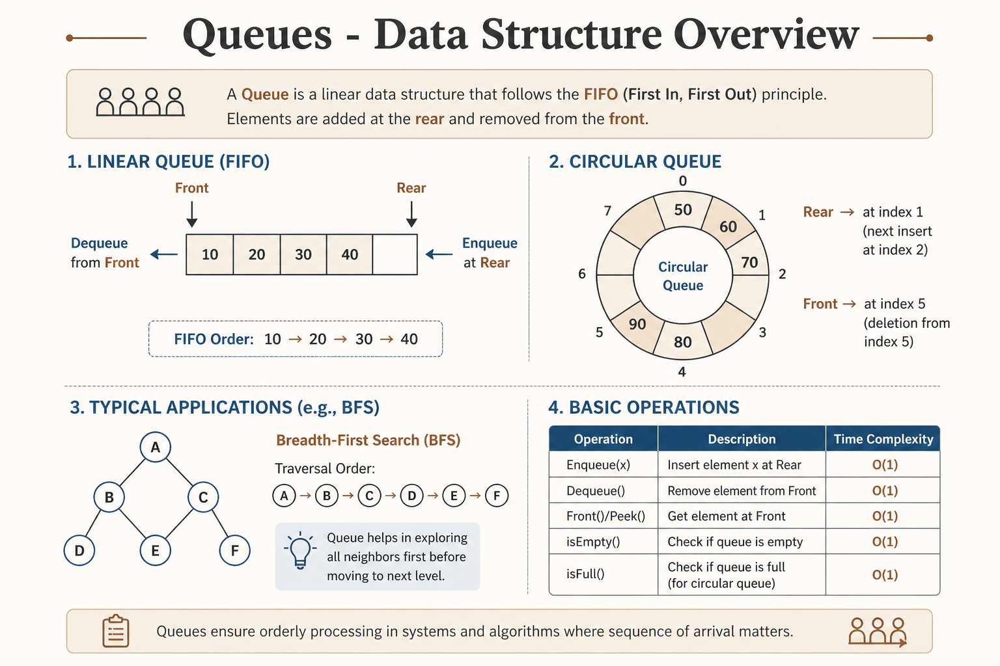

<div align="center">

# 📬 Queues

### *First In, First Out (FIFO) - Essential for BFS and level-order traversal*


<p>
  
  
  
</p>

**First In, First Out (FIFO) - Essential for BFS and level-order traversal**

[⬅️ Previous: Stacks](../04_stacks/README.md) | [🏠 Home](../README.md) | [Next: Hash Tables ➡️](../06_hash_tables/README.md)

</div>

---

## 🎯 At a Glance

| | |
|:---|:---|
| **In one line** | First In, First Out (FIFO) - Essential for BFS and level-order traversal |
| **Difficulty** | Medium |
| **Subtopics** | 3 |
| **Problems** | 25+ |

> **How to use this page:** Scan **At a Glance**, then work through theory → visuals → code.

---

## 📂 Subtopics Navigation

| # | Topic | Problems | Link |
|:-:|-------|:--------:|------|
| 1 | Basic Queue | 8+ | [📖 Go →](./01_basic_queue/README.md) |
| 2 | BFS Queue | 15+ | [📖 Go →](./02_bfs_queue/README.md) |
| 3 | Deque Problems | 8+ | [📖 Go →](./03_deque_problems/README.md) |

---

## 📐 Mathematical Foundation

### 1️⃣ Queue Definition (Abstract Data Type)

A queue $Q$ is a collection supporting:

$$\text{enqueue}(x): Q \to Q \cup \{x\} \text{ (add to rear)}
\text{dequeue}(): Q \to Q \setminus \{\text{front}\} \text{ (remove from front)}$$

**FIFO Property:** First element enqueued is first element dequeued.

---

### 2️⃣ Time Complexity

| Operation | Array Queue | Linked Queue | Circular Array |
|-----------|:-----------:|:------------:|:--------------:|
| enqueue | O(1)* | O(1) | O(1) |
| dequeue | O(n) | O(1) | O(1) |
| peek | O(1) | O(1) | O(1) |
| isEmpty | O(1) | O(1) | O(1) |

*Amortized for dynamic array

---

### 3️⃣ Circular Queue Mathematics

**Index Mapping:**

$$\text{rear} = (\text{rear} + 1) \mod \text{capacity}
\text{front} = (\text{front} + 1) \mod \text{capacity}$$

**Size Calculation:**

$$\text{size} = (\text{rear} - \text{front} + \text{capacity}) \mod \text{capacity}$$

**Full Condition:**

$$(\text{rear} + 1) \mod \text{capacity} = \text{front}$$

---

### 4️⃣ BFS Time Complexity

For graph with $V$ vertices and $E$ edges:

$$\boxed{T(V, E) = O(V + E)}$$

**Proof:**

- Each vertex enqueued at most once: $O(V)$

- Each edge examined at most twice (undirected): $O(E)$

- Total: $O(V + E)$ ∎

---

### 5️⃣ Shortest Path in Unweighted Graph

**BFS Guarantee:** First time a vertex is visited, it's via shortest path.

**Proof (by induction on distance):**

Base: Source vertex has distance 0 (correct).

Inductive: If all vertices at distance $d$ are correctly computed, then vertices discovered from them have distance $d + 1$ (correct). ∎

---

### 6️⃣ Deque (Double-Ended Queue)

**Operations:**

| Operation | Complexity |
|-----------|:----------:|
| push_front | O(1) |
| push_back | O(1) |
| pop_front | O(1) |
| pop_back | O(1) |

**Sliding Window Maximum:** Use monotonic deque.

---

### 7️⃣ Priority Queue (Heap-based)

| Operation | Complexity |
|-----------|:----------:|
| insert | O(log n) |
| extract_min/max | O(log n) |
| peek | O(1) |

**Used in:** Dijkstra's algorithm, Huffman coding, task scheduling.

---

### 8️⃣ Multi-source BFS

**Theorem:** Starting BFS from multiple sources simultaneously finds shortest distance to nearest source.

**Implementation:** Initialize queue with all sources at distance 0.

---

## 📊 Visual Overview

<div align="center">



*Queues Overview*

</div>

---

## 🎯 Key Patterns

### Basic Queue Implementation
```python
from collections import deque

class Queue:
    def __init__(self):
        self.items = deque()
    
    def enqueue(self, x):
        self.items.append(x)
    
    def dequeue(self):
        return self.items.popleft() if self.items else None
    
    def peek(self):
        return self.items[0] if self.items else None
    
    def is_empty(self):
        return len(self.items) == 0
```

### BFS Template
```python
from collections import deque

def bfs(graph, start):
    """
    BFS traversal template.
    Time: O(V + E), Space: O(V)
    """
    visited = {start}
    queue = deque([start])
    distance = {start: 0}
    
    while queue:
        node = queue.popleft()
        
        for neighbor in graph[node]:
            if neighbor not in visited:
                visited.add(neighbor)
                queue.append(neighbor)
                distance[neighbor] = distance[node] + 1
    
    return distance
```

### Multi-source BFS
```python
def multi_source_bfs(grid, sources):
    """
    BFS from multiple sources simultaneously.
    Time: O(m*n), Space: O(m*n)
    """
    from collections import deque
    
    m, n = len(grid), len(grid[0])
    queue = deque(sources)
    distance = {src: 0 for src in sources}
    
    while queue:
        x, y = queue.popleft()
        for dx, dy in [(0, 1), (0, -1), (1, 0), (-1, 0)]:
            nx, ny = x + dx, y + dy
            if 0 <= nx < m and 0 <= ny < n and (nx, ny) not in distance:
                distance[(nx, ny)] = distance[(x, y)] + 1
                queue.append((nx, ny))
    
    return distance
```

### Pattern Decision Tree

```text
              Queue Problem
                   |
Tree BFS      Graph BFS       Monotonic Deque
    |              |              |
 Zigzag?      Multi-source?   Max/Min tracking
```


### Pattern Checklist
- [ ] Can I use multi-source BFS instead of multiple single-source?
- [ ] Do I need to track levels separately?
- [ ] Is this a 0-1 weighted graph (use deque)?
- [ ] Can monotonic deque optimize sliding window?
- [ ] Should I mark visited when enqueuing or dequeuing?
- [ ] Do I need bidirectional BFS for large state space?


---

## 🏆 LeetCode Problems

### 🟢 Easy
| # | Problem | Pattern | Time | Space |
|:-:|---------|---------|:----:|:-----:|
| 225 | [Implement Stack using Queues](https://leetcode.com/problems/implement-stack-using-queues/) | Queue Rotation | O(n) push | O(n) |
| 232 | [Implement Queue using Stacks](https://leetcode.com/problems/implement-queue-using-stacks/) | Two Stacks | O(1)* | O(n) |
| 346 | [Moving Average from Data Stream](https://leetcode.com/problems/moving-average-from-data-stream/) | Sliding Sum | O(1) | O(k) |
| 933 | [Number of Recent Calls](https://leetcode.com/problems/number-of-recent-calls/) | Time Window | O(1)* | O(n) |

### 🟡 Medium
| # | Problem | Pattern | Time | Space |
|:-:|---------|---------|:----:|:-----:|
| 102 | [Binary Tree Level Order Traversal](https://leetcode.com/problems/binary-tree-level-order-traversal/) | BFS | O(n) | O(n) |
| 622 | [Design Circular Queue](https://leetcode.com/problems/design-circular-queue/) | Circular Array | O(1) | O(k) |
| 994 | [Rotting Oranges](https://leetcode.com/problems/rotting-oranges/) | Multi-source BFS | O(mn) | O(mn) |
| 239 | [Sliding Window Maximum](https://leetcode.com/problems/sliding-window-maximum/) | Monotonic Deque | O(n) | O(k) |

### 🔴 Hard
| # | Problem | Pattern | Time | Space |
|:-:|---------|---------|:----:|:-----:|
| 862 | [Shortest Subarray Sum ≥ K](https://leetcode.com/problems/shortest-subarray-with-sum-at-least-k/) | Deque + Prefix | O(n) | O(n) |

---

## 📚 References & Learning Resources

### 📖 Core Concepts
| Resource | Description | Link |
|----------|-------------|------|
| **Queue ADT** | Wikipedia overview | [Queue (abstract data type)](https://en.wikipedia.org/wiki/Queue_(abstract_data_type)) |
| **BFS** | Graph traversal | [GeeksforGeeks BFS](https://www.geeksforgeeks.org/breadth-first-search-or-bfs-for-a-graph/) |
| **LeetCode Explore** | Queue & stack card | [Explore Card](https://leetcode.com/explore/learn/card/queue-stack/) |

### 📝 Practice
| Platform | Focus | Link |
|----------|-------|------|
| **LeetCode** | BFS tag | [Problems](https://leetcode.com/tag/breadth-first-search/) |

---

## 🌟 Motivational Corner

> "BFS is the Swiss Army knife of graph algorithms - simple, elegant, and powerful."

**Progress Tracker:**

- 🥉 **Bronze:** Solve 10 BFS problems

- 🥈 **Silver:** Solve 20 BFS problems + master monotonic deque

- 🥇 **Gold:** Solve 35 BFS problems + multi-source patterns

- 💎 **Platinum:** Master 0-1 BFS and bidirectional search

**Remember:** BFS guarantees shortest path in unweighted graphs. That's its superpower! 🚀

---

<div align="center">

### 🌟 If this helped you, give it a ⭐ on GitHub! 🌟
**Made with ❤️ for the coding community by [Gaurav Goswami](https://github.com/Gaurav14cs17)**

[⬅️ Previous: Stacks](../04_stacks/README.md) | [🏠 Home](../README.md) | [Next: Hash Tables ➡️](../06_hash_tables/README.md)

---

*Last Updated: December 2025*  
*Licensed under MIT*  
*Happy Coding! 💻✨*

</div>
