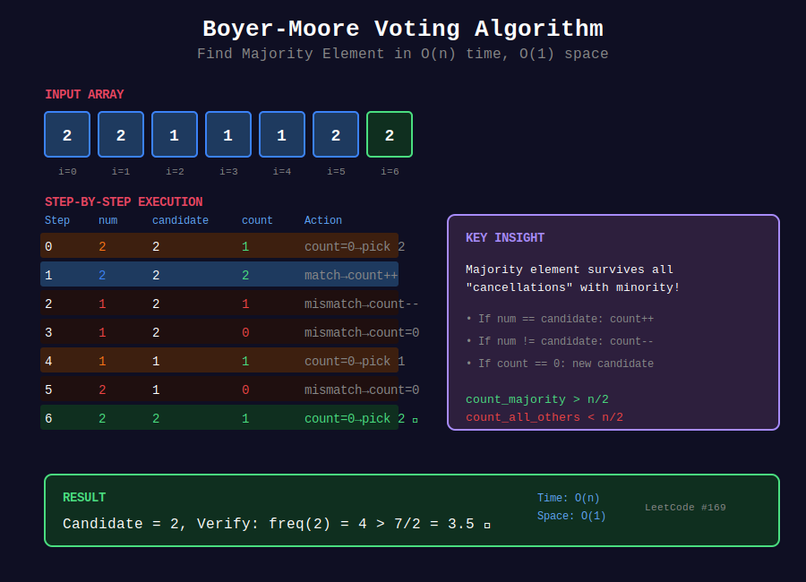
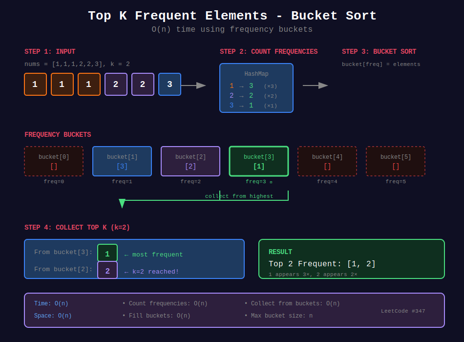

<div align="center">

# 📊 Frequency Counting

<p>
  
  
</p>

</div>

---

## 🧭 Navigation

| ⬅️ Previous | 📂 Current | ➡️ Next |
|:------------|:----------:|--------:|
| [🏠 Hash Tables Home](../README.md) | **01. Frequency Counting** | [02. Two Sum Pattern →](../02_two_sum_pattern/README.md) |

---

## 🎨 Visual Diagrams

<div align="center">

### Boyer-Moore Voting Algorithm


### Top K Frequent Elements - Bucket Sort


</div>

---

## 📐 Mathematical Foundations

### 1️⃣ Frequency Definition

```math
\text{freq}(x, A) = |\{i : A[i] = x\}|
```

**Total elements:**

```math
\sum_{x \in \text{unique}(A)} \text{freq}(x) = n
```

---

### 2️⃣ Majority Element

**Definition:** Element appearing more than $\lfloor n/2 \rfloor$ times.

**Boyer-Moore Voting Algorithm:**

Maintain candidate and count. If element matches, increment; otherwise decrement.

**Proof:** If majority exists, it survives all cancellations.

```math
\text{count}_{majority} > \frac{n}{2} > \text{count}_{all\_others}
```

---

### 3️⃣ Anagram Condition

Two strings are anagrams if:

```math
\forall c \in \Sigma: \text{freq}_s(c) = \text{freq}_t(c)
```

---

### 4️⃣ Top-K Elements

**Bucket Sort Approach:**

Create buckets by frequency: $\text{bucket}[f] = \{x : \text{freq}(x) = f\}$

Collect from highest frequency buckets.

**Time:** O(n), **Space:** O(n)

---

## 💻 Code Implementations

```python
from collections import Counter

def majorityElement(nums: list[int]) -> int:
    """
    Boyer-Moore Voting Algorithm.
    
    Intuition: Majority element survives all "cancellations"
    with non-majority elements.
    
    Time: O(n), Space: O(1)
    """
    candidate = None
    count = 0
    
    for num in nums:
        if count == 0:
            candidate = num
        count += 1 if num == candidate else -1
    
    return candidate

def topKFrequent(nums: list[int], k: int) -> list[int]:
    """
    Find k most frequent elements using bucket sort.
    
    Bucket[i] = elements with frequency i
    
    Time: O(n), Space: O(n)
    """
    freq = Counter(nums)
    buckets = [[] for _ in range(len(nums) + 1)]
    
    for num, count in freq.items():
        buckets[count].append(num)
    
    result = []
    for i in range(len(buckets) - 1, -1, -1):
        for num in buckets[i]:
            result.append(num)
            if len(result) == k:
                return result
    
    return result

def isAnagram(s: str, t: str) -> bool:
    """
    Check if t is anagram of s.
    
    Anagram: same frequency for all characters.
    
    Time: O(n), Space: O(1) for fixed alphabet
    """
    return Counter(s) == Counter(t)

def firstUniqChar(s: str) -> int:
    """
    Find first unique character.
    
    Two passes: count frequencies, find first with freq=1.
    
    Time: O(n), Space: O(1)
    """
    freq = Counter(s)
    
    for i, c in enumerate(s):
        if freq[c] == 1:
            return i
    
    return -1

def longestPalindrome(s: str) -> int:
    """
    Longest palindrome that can be built.
    
    Use all even counts + all odd counts - 1 + 1 center.
    
    Time: O(n), Space: O(1)
    """
    freq = Counter(s)
    length = 0
    has_odd = False
    
    for count in freq.values():
        length += count // 2 * 2
        if count % 2 == 1:
            has_odd = True
    
    return length + (1 if has_odd else 0)
```

---

## 🏆 LeetCode Problems

### 🟢 Easy

| # | Problem | Pattern | Time | Space |
|:-:|---------|---------|:----:|:-----:|
| 169 | [Majority Element](https://leetcode.com/problems/majority-element/) | Boyer-Moore | O(n) | O(1) |
| 242 | [Valid Anagram](https://leetcode.com/problems/valid-anagram/) | Counter Compare | O(n) | O(1) |
| 383 | [Ransom Note](https://leetcode.com/problems/ransom-note/) | Counter | O(n) | O(1) |
| 387 | [First Unique Character](https://leetcode.com/problems/first-unique-character-in-a-string/) | Frequency | O(n) | O(1) |
| 389 | [Find the Difference](https://leetcode.com/problems/find-the-difference/) | Counter/XOR | O(n) | O(1) |
| 409 | [Longest Palindrome](https://leetcode.com/problems/longest-palindrome/) | Even/Odd Count | O(n) | O(1) |
| 451 | [Sort Characters By Frequency](https://leetcode.com/problems/sort-characters-by-frequency/) | Bucket Sort | O(n) | O(n) |

### 🟡 Medium

| # | Problem | Pattern | Time | Space |
|:-:|---------|---------|:----:|:-----:|
| 49 | [Group Anagrams](https://leetcode.com/problems/group-anagrams/) | Hash Grouping | O(nk log k) | O(nk) |
| 229 | [Majority Element II](https://leetcode.com/problems/majority-element-ii/) | Extended Boyer-Moore | O(n) | O(1) |
| 347 | [Top K Frequent Elements](https://leetcode.com/problems/top-k-frequent-elements/) | Bucket Sort | O(n) | O(n) |
| 438 | [Find All Anagrams](https://leetcode.com/problems/find-all-anagrams-in-a-string/) | Sliding Window | O(n) | O(1) |
| 567 | [Permutation in String](https://leetcode.com/problems/permutation-in-string/) | Sliding Window | O(n) | O(1) |
| 692 | [Top K Frequent Words](https://leetcode.com/problems/top-k-frequent-words/) | Heap | O(n log k) | O(n) |

---

---

## 🎨 Visual Algorithm Walkthrough

### Boyer-Moore Majority Element (#169)

```
Array: [2, 2, 1, 1, 1, 2, 2]

Step-by-step:
i   num   candidate  count   Action
0    2       2        1      Initialize
1    2       2        2      Match, increment
2    1       2        1      Mismatch, decrement
3    1       2        0      Mismatch, count=0
4    1       1        1      New candidate
5    2       1        0      Mismatch, count=0
6    2       2        1      New candidate

Final candidate: 2
Verify: freq(2) = 4 > 7/2 ✓

Why it works: Majority element survives all cancellations!
```

### Top K Frequent Elements (#347)

```
nums = [1,1,1,2,2,3], k = 2

Step 1: Count frequencies
  freq = {1: 3, 2: 2, 3: 1}

Step 2: Bucket sort by frequency
  buckets[0] = []
  buckets[1] = [3]
  buckets[2] = [2]
  buckets[3] = [1]

Step 3: Collect from highest frequency
  From bucket[3]: add 1
  From bucket[2]: add 2
  result = [1, 2]

Time: O(n), Space: O(n)
```

### Group Anagrams (#49)

```
strs = ["eat", "tea", "tan", "ate", "nat", "bat"]

Group by sorted string:
  "eat" → "aet" → group1
  "tea" → "aet" → group1
  "tan" → "ant" → group2
  "ate" → "aet" → group1
  "nat" → "ant" → group2
  "bat" → "abt" → group3

Result: [["eat","tea","ate"], ["tan","nat"], ["bat"]]

Alternative key: frequency tuple (26 counts)
```

### First Unique Character (#387)

```
s = "leetcode"

Pass 1: Count frequencies
  freq = {l:1, e:3, t:1, c:1, o:1, d:1}

Pass 2: Find first with freq=1
  s[0]='l': freq=1 ✓
  return 0

Time: O(n), Space: O(1) for fixed alphabet
```

---

## 💡 Pattern Recognition Guide

| Problem Keywords | Pattern | Example |
|-----------------|---------|---------|
| "majority element" | Boyer-Moore | #169, #229 |
| "top k frequent" | Bucket sort / heap | #347, #692 |
| "valid anagram" | Frequency compare | #242, #438 |
| "group by property" | Hash grouping | #49 |
| "first unique" | Frequency + scan | #387 |
| "longest palindrome" | Even/odd counts | #409 |
| "sort by frequency" | Bucket sort | #451 |

---

## 📚 References & Learning Resources

### 📖 Core Concepts
| Resource | Topic | Link |
|----------|-------|------|
| **Wikipedia** | Boyer-Moore algorithm | [Article](https://en.wikipedia.org/wiki/Boyer%E2%80%93Moore_majority_vote_algorithm) |
| **Python Docs** | collections.Counter | [Documentation](https://docs.python.org/3/library/collections.html#collections.Counter) |
| **GeeksforGeeks** | Frequency counting | [Tutorial](https://www.geeksforgeeks.org/counting-frequencies-of-array-elements/) |
| **CP Algorithms** | Frequency techniques | [Guide](https://cp-algorithms.com/) |

### 📺 Video Tutorials
| Creator | Topic | Link |
|---------|-------|------|
| **NeetCode** | Top K Frequent | [YouTube](https://www.youtube.com/watch?v=YPTqKIgVk-k) |
| **NeetCode** | Group Anagrams | [YouTube](https://www.youtube.com/watch?v=vzdNOK2oB2E) |
| **Back To Back SWE** | Boyer-Moore | [YouTube](https://www.youtube.com/watch?v=6sBN7eJGrts) |
| **Abdul Bari** | Hashing applications | [YouTube](https://www.youtube.com/watch?v=KyUTuwz_b7Q) |

### 🎯 Practice Collections
| Platform | Focus | Link |
|----------|-------|------|
| **LeetCode** | Frequency tag | [Problems](https://leetcode.com/tag/counting/) |
| **HackerRank** | Hash challenges | [Practice](https://www.hackerrank.com/domains/data-structures?filters%5Bsubdomains%5D%5B%5D=hash-tables) |

### 🔬 Advanced Topics
| Topic | Description | Link |
|-------|-------------|------|
| **Bucket Sort** | O(n) sorting by frequency | [Tutorial](https://www.geeksforgeeks.org/bucket-sort-2/) |
| **Extended Boyer-Moore** | Find all elements > n/k | [Article](https://www.geeksforgeeks.org/given-an-array-of-of-size-n-finds-all-the-elements-that-appear-more-than-nk-times/) |
| **Anagram Hashing** | Efficient anagram detection | [Tutorial](https://www.geeksforgeeks.org/check-whether-two-strings-are-anagram-of-each-other/) |

### 📊 Visualization
| Tool | Purpose | Link |
|------|---------|------|
| **VisuAlgo** | Hash table operations | [Website](https://visualgo.net/en/hashtable) |
| **Algorithm Visualizer** | Frequency counting | [Website](https://algorithm-visualizer.org/) |

---

## 💡 Pro Tips

> **🎯 Counter is Your Friend:** Use `Counter` from collections. It's optimized and handles edge cases!

> **⚡ Bucket Sort for Top-K:** O(n) time! Create buckets by frequency, collect from highest.

> **🔍 Anagram Key:** Sorted string or frequency tuple. Both work, tuple is O(n) vs O(n log n).

> **📊 Boyer-Moore Magic:** O(1) space for majority element. Cancellation principle!

> **🌊 Fixed Alphabet:** For strings with fixed alphabet (26 letters), space is O(1) not O(n)!

---

## 🎖️ Practice Roadmap

**Week 1: Fundamentals**
1. Solve #242 (Valid Anagram) - Master Counter
2. Solve #169 (Majority Element) - Learn Boyer-Moore
3. Solve #387 (First Unique Character) - Frequency scan
4. Solve #409 (Longest Palindrome) - Even/odd counts

**Week 2: Intermediate**
5. Solve #49 (Group Anagrams) - Hash grouping
6. Solve #347 (Top K Frequent) - Bucket sort
7. Solve #451 (Sort by Frequency) - Frequency sorting
8. Solve #438 (Find All Anagrams) - Sliding window + freq

**Week 3: Advanced**
9. Solve #229 (Majority Element II) - Extended Boyer-Moore
10. Solve #692 (Top K Frequent Words) - Heap + tiebreaker
11. Solve #567 (Permutation in String) - Advanced sliding

---

## ❓ Interview Q&A

**Q: Why use Counter instead of regular dict?**  
A: Counter handles missing keys (returns 0), has convenient methods like `most_common()`, and is optimized for counting.

**Q: How does Boyer-Moore work?**  
A: Maintain candidate and count. If element matches, increment; else decrement. When count=0, pick new candidate. Majority survives!

**Q: Bucket sort vs heap for top-k?**  
A: Bucket sort is O(n) but uses O(n) space. Heap is O(n log k) with O(k) space. Bucket sort better for small k.

**Q: How to detect anagrams efficiently?**  
A: Two methods: 1) Sort both strings O(n log n), 2) Compare frequency maps O(n). Frequency is faster!

**Q: When is space O(1) for frequency counting?**  
A: When alphabet is fixed (e.g., 26 lowercase letters). Array of size 26 is O(1), not O(n).

---

## 🔥 Key Insights

- **Frequency = HashMap:** Count occurrences in O(n) time
- **Anagram = Same Frequency:** Two strings are anagrams iff frequency maps match
- **Top-K = Bucket Sort:** O(n) solution using frequency buckets
- **Majority = Boyer-Moore:** O(1) space using cancellation principle
- **Fixed Alphabet = O(1) Space:** Array instead of hash for small alphabets

---

<div align="center">

**Made with ❤️ for the coding community by [Gaurav Goswami](https://github.com/Gaurav14cs17)**

</div>

---

## 🧭 Navigation

| ⬅️ Previous | 📂 Current | ➡️ Next |
|:------------|:----------:|--------:|
| [🏠 Hash Tables Home](../README.md) | **01. Frequency Counting** | [02. Two Sum Pattern →](../02_two_sum_pattern/README.md) |
