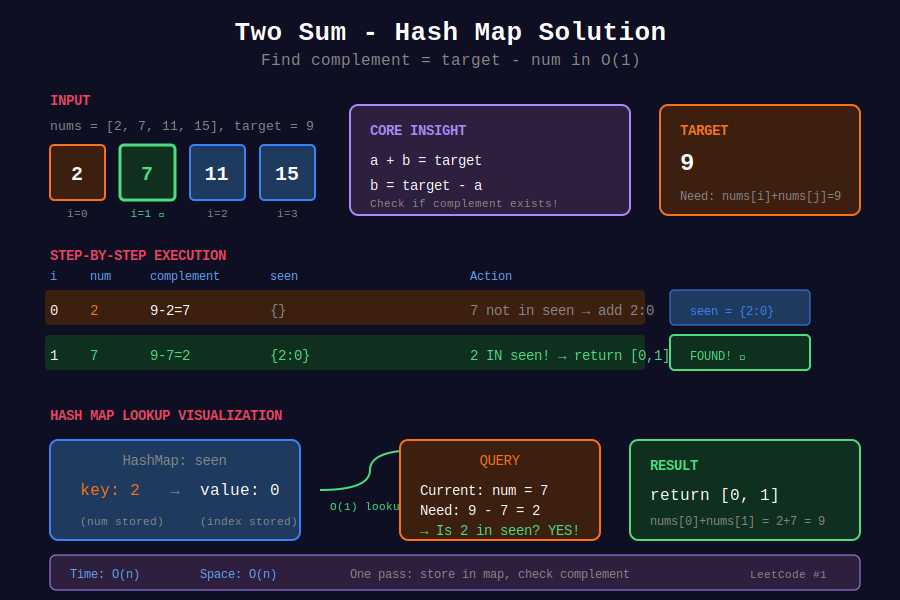
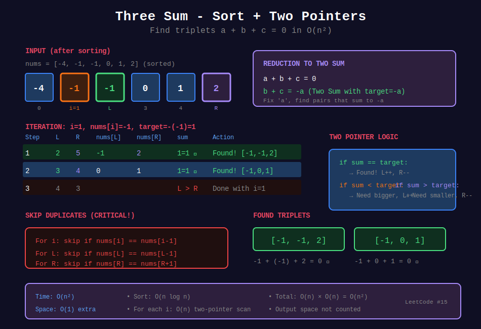
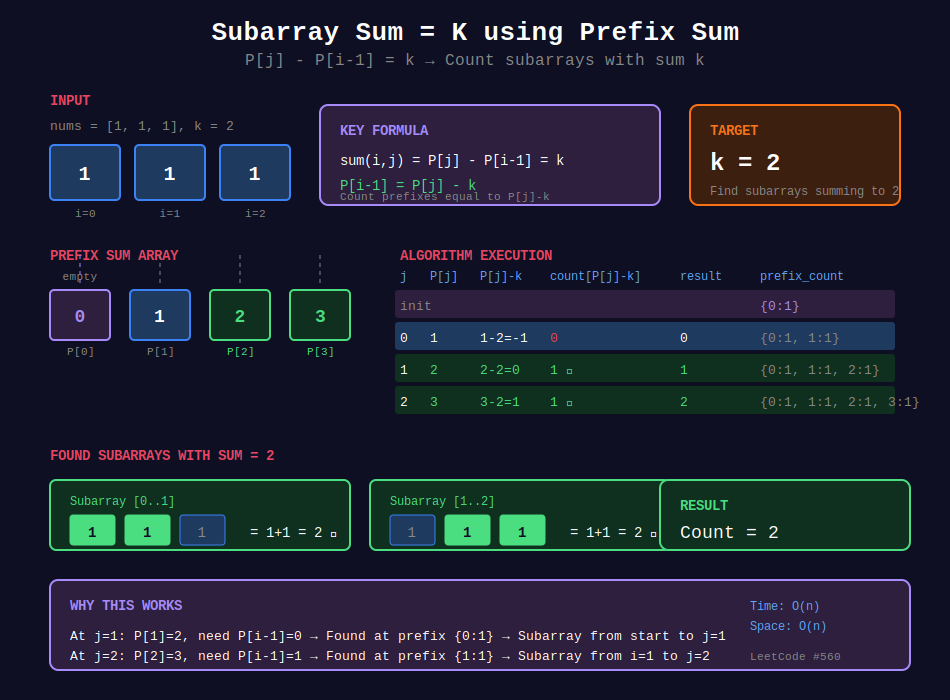

<div align="center">

# 🎯 Two Sum Pattern

<p>
  
  
</p>

</div>

---

## 🧭 Navigation

| ⬅️ Previous | 📂 Current | ➡️ Next |
|:------------|:----------:|--------:|
| [← 01. Frequency Counting](../01_frequency_counting/README.md) | **02. Two Sum Pattern** | [03. Set Operations →](../03_set_operations/README.md) |

---

## 🎨 Visual Diagrams

<div align="center">

### Two Sum - Hash Map Solution


### Three Sum - Two Pointers


### Subarray Sum = K - Prefix Sum


</div>

---

## 📐 Mathematical Foundations

### 1️⃣ Two Sum Core Insight

**Problem:** Find $i, j$ where $a[i] + a[j] = target$

**Rearrangement:**

$$a[j] = target - a[i]$$

**Algorithm:** For each $a[i]$, check if $target - a[i]$ exists in hash map.

---

### 2️⃣ Time-Space Tradeoff

| Approach | Time | Space |
|----------|:----:|:-----:|
| Brute Force (nested loops) | O(n²) | O(1) |
| Hash Map | O(n) | O(n) |
| Sort + Two Pointers | O(n log n) | O(1) |

---

### 3️⃣ Three Sum Reduction

**Problem:** Find triplets $a + b + c = 0$

**Reduction:** For each $a$, find pairs where $b + c = -a$

$$\text{Two Sum with target} = -a$$

**Time:** O(n²) with hash or two pointers after sorting.

---

### 4️⃣ Four Sum II

**Problem:** Count tuples $(i, j, k, l)$ where $A[i] + B[j] + C[k] + D[l] = 0$

**Split into two pairs:**

$$A[i] + B[j] = -(C[k] + D[l])$$

Store all $A[i] + B[j]$ sums, then count matches with $-(C[k] + D[l])$.

**Time:** O(n²), **Space:** O(n²)

---

### 5️⃣ Subarray Sum Equals K

**Prefix Sum Identity:**

$$\text{sum}(i, j) = P[j] - P[i-1] = k
P[i-1] = P[j] - k$$

Count previous prefixes that equal $P[j] - k$.

---

## 💻 Code Implementations

```python
def twoSum(nums: list[int], target: int) -> list[int]:
    """
    Classic Two Sum with hash map.
    
    Key insight: complement = target - num
    
    Time: O(n), Space: O(n)
    """
    seen = {}
    
    for i, num in enumerate(nums):
        complement = target - num
        if complement in seen:
            return [seen[complement], i]
        seen[num] = i
    
    return []

def threeSum(nums: list[int]) -> list[list[int]]:
    """
    Find all unique triplets that sum to zero.
    
    For each a, find pairs b + c = -a using two pointers.
    
    Time: O(n²), Space: O(1) extra
    """
    nums.sort()
    result = []
    n = len(nums)
    
    for i in range(n - 2):
        # Skip duplicates
        if i > 0 and nums[i] == nums[i - 1]:
            continue
        
        target = -nums[i]
        left, right = i + 1, n - 1
        
        while left < right:
            current_sum = nums[left] + nums[right]
            
            if current_sum == target:
                result.append([nums[i], nums[left], nums[right]])
                left += 1
                right -= 1
                
                # Skip duplicates
                while left < right and nums[left] == nums[left - 1]:
                    left += 1
                while left < right and nums[right] == nums[right + 1]:
                    right -= 1
            elif current_sum < target:
                left += 1
            else:
                right -= 1
    
    return result

def fourSumCount(A: list, B: list, C: list, D: list) -> int:
    """
    Count tuples where A[i] + B[j] + C[k] + D[l] = 0.
    
    Split: (A+B) + (C+D) = 0
    
    Time: O(n²), Space: O(n²)
    """
    from collections import Counter
    
    # All sums of A[i] + B[j]
    ab_sums = Counter(a + b for a in A for b in B)
    
    # Count matching -(C[k] + D[l])
    count = 0
    for c in C:
        for d in D:
            count += ab_sums[-(c + d)]
    
    return count

def subarraySum(nums: list[int], k: int) -> int:
    """
    Count subarrays with sum equals k.
    
    P[j] - P[i-1] = k ⟹ P[i-1] = P[j] - k
    
    Time: O(n), Space: O(n)
    """
    from collections import defaultdict
    
    count = 0
    prefix_sum = 0
    prefix_count = defaultdict(int)
    prefix_count[0] = 1  # Empty prefix
    
    for num in nums:
        prefix_sum += num
        count += prefix_count[prefix_sum - k]
        prefix_count[prefix_sum] += 1
    
    return count

def twoSumLessThanK(nums: list[int], k: int) -> int:
    """
    Find max sum of pair less than k.
    
    Sort + two pointers.
    
    Time: O(n log n), Space: O(1)
    """
    nums.sort()
    left, right = 0, len(nums) - 1
    max_sum = -1
    
    while left < right:
        current_sum = nums[left] + nums[right]
        if current_sum < k:
            max_sum = max(max_sum, current_sum)
            left += 1
        else:
            right -= 1
    
    return max_sum

```

---

## 🏆 LeetCode Problems

### 🟢 Easy

| # | Problem | Pattern | Time | Space |
|:-:|---------|---------|:----:|:-----:|
| 1 | [Two Sum](https://leetcode.com/problems/two-sum/) | Hash Map | O(n) | O(n) |
| 167 | [Two Sum II - Sorted](https://leetcode.com/problems/two-sum-ii-input-array-is-sorted/) | Two Pointers | O(n) | O(1) |
| 653 | [Two Sum IV - BST](https://leetcode.com/problems/two-sum-iv-input-is-a-bst/) | Hash + DFS | O(n) | O(n) |
| 1099 | [Two Sum Less Than K](https://leetcode.com/problems/two-sum-less-than-k/) | Sort + Pointers | O(n log n) | O(1) |

### 🟡 Medium

| # | Problem | Pattern | Time | Space |
|:-:|---------|---------|:----:|:-----:|
| 15 | [3Sum](https://leetcode.com/problems/3sum/) | Sort + Two Pointers | O(n²) | O(1) |
| 16 | [3Sum Closest](https://leetcode.com/problems/3sum-closest/) | Sort + Two Pointers | O(n²) | O(1) |
| 18 | [4Sum](https://leetcode.com/problems/4sum/) | Sort + Nested | O(n³) | O(1) |
| 454 | [4Sum II](https://leetcode.com/problems/4sum-ii/) | Two-pair Hash | O(n²) | O(n²) |
| 523 | [Continuous Subarray Sum](https://leetcode.com/problems/continuous-subarray-sum/) | Prefix + Mod | O(n) | O(min(n,k)) |
| 560 | [Subarray Sum Equals K](https://leetcode.com/problems/subarray-sum-equals-k/) | Prefix + Hash | O(n) | O(n) |

---

---

## 🎨 Visual Algorithm Walkthrough

### Two Sum (#1)

```
nums = [2, 7, 11, 15], target = 9

Step-by-step:
i   num   complement   seen         Action
0    2        7        {}           Add 2→0
1    7        2        {2:0}        Found! Return [0,1]

Time: O(n), Space: O(n)

```

### Three Sum (#15)

```
nums = [-1, 0, 1, 2, -1, -4], target = 0

Step 1: Sort → [-4, -1, -1, 0, 1, 2]

Step 2: For each i, two-pointer on remaining:

i=0, nums[i]=-4, target=-(-4)=4
  L=1, R=5: -1+2=1 < 4, L++
  L=2, R=5: -1+2=1 < 4, L++
  L=3, R=5: 0+2=2 < 4, L++
  L=4, R=5: 1+2=3 < 4, L++
  No triplet

i=1, nums[i]=-1, target=1
  L=2, R=5: -1+2=1 ✓ → [-1,-1,2]
  L++, R--
  L=3, R=4: 0+1=1 ✓ → [-1,0,1]
  L++, R--

Result: [[-1,-1,2], [-1,0,1]]

```

### Four Sum II (#454)

```
A=[1,2], B=[-2,-1], C=[-1,2], D=[0,2]

Step 1: All A+B sums
  1+(-2)=-1 → count[-1]=1
  1+(-1)=0  → count[0]=1
  2+(-2)=0  → count[0]=2
  2+(-1)=1  → count[1]=1

Step 2: Count matching -(C+D)
  C=-1, D=0: -(−1+0)=1 → count[1]=1 ✓
  C=-1, D=2: -(−1+2)=-1 → count[-1]=1 ✓
  C=2, D=0: -(2+0)=-2 → count[-2]=0
  C=2, D=2: -(2+2)=-4 → count[-4]=0

Total: 2 tuples

```

### Subarray Sum = K (#560)

```
nums = [1, 1, 1], k = 2

Prefix sums: [0, 1, 2, 3]

For sum(i,j) = k:
  P[j] - P[i-1] = k
  P[i-1] = P[j] - k

j   P[j]  P[j]-k  count[P[j]-k]  Result
0    0      -2          0           0
1    1      -1          0           0
2    2       0          1           1 (subarray [0,1])
3    3       1          1           2 (subarray [1,2])

Total: 2 subarrays

```

---

## 💡 Pattern Recognition Guide

| Problem Keywords | Pattern | Example |
|-----------------|---------|---------|
| "two numbers sum to target" | Complement hash | #1, #167 |
| "three numbers sum to zero" | Sort + two pointers | #15, #16 |
| "four numbers sum" | Two-pair hash | #454 |
| "subarray sum = k" | Prefix sum + hash | #560 |
| "continuous subarray sum" | Prefix mod + hash | #523 |
| "k-sum problem" | Reduce to (k-1)-sum | #18 |

---

## 📚 References & Learning Resources

### 📖 Core Concepts

| Resource | Topic | Link |
|----------|-------|------|
| **LeetCode** | Two Sum problem | [Problem](https://leetcode.com/problems/two-sum/) |
| **GeeksforGeeks** | K-Sum problems | [Tutorial](https://www.geeksforgeeks.org/find-four-numbers-with-sum-equal-to-given-sum/) |
| **GeeksforGeeks** | Subarray sum | [Tutorial](https://www.geeksforgeeks.org/find-subarray-with-given-sum/) |
| **CP Algorithms** | Two pointers | [Guide](https://cp-algorithms.com/data_structures/stack_queue_modification.html) |

### 📺 Video Tutorials

| Creator | Topic | Link |
|---------|-------|------|
| **NeetCode** | Two Sum | [YouTube](https://www.youtube.com/watch?v=KLlXCFG5TnA) |
| **NeetCode** | Three Sum | [YouTube](https://www.youtube.com/watch?v=jzZsG8n2R9A) |
| **NeetCode** | Subarray Sum = K | [YouTube](https://www.youtube.com/watch?v=fFVZt-6sgyo) |
| **Back To Back SWE** | K-Sum pattern | [YouTube](https://www.youtube.com/watch?v=EYeR-_1NRlQ) |
| **Abdul Bari** | Two pointer technique | [YouTube](https://www.youtube.com/watch?v=YXZgxAh3iyE) |

### 🎯 Practice Collections

| Platform | Focus | Link |
|----------|-------|------|
| **LeetCode** | Two Sum variations | [Tag](https://leetcode.com/tag/two-pointers/) |
| **HackerRank** | Array problems | [Practice](https://www.hackerrank.com/domains/algorithms?filters%5Bsubdomains%5D%5B%5D=arrays) |

### 🔬 Advanced Topics

| Topic | Description | Link |
|-------|-------------|------|
| **Prefix Sum** | Cumulative sum technique | [Tutorial](https://www.geeksforgeeks.org/prefix-sum-array-implementation-applications-competitive-programming/) |
| **K-Sum Reduction** | Reduce k-sum to (k-1)-sum | [Article](https://leetcode.com/problems/4sum/discuss/8545/Python-140ms-beats-100-and-works-for-N-sum-(Ngreater2)) |
| **Two Pointers** | Sorted array technique | [Guide](https://www.geeksforgeeks.org/two-pointers-technique/) |

### 📊 Visualization

| Tool | Purpose | Link |
|------|---------|------|
| **VisuAlgo** | Two pointers | [Website](https://visualgo.net/en) |
| **Algorithm Visualizer** | Array problems | [Website](https://algorithm-visualizer.org/) |

---

## 💡 Pro Tips

> **🎯 Complement Pattern:** For each `num`, check if `target - num` exists. O(n) with hash!

> **⚡ Sort for K-Sum:** For 3-sum, 4-sum, etc., sort first then use two pointers. Avoids duplicates easily!

> **🔍 Prefix Sum Magic:** `sum(i,j) = P[j] - P[i-1]`. Rearrange to `P[i-1] = P[j] - k`. Store prefixes in hash!

> **📊 Two-Pair Split:** For 4-sum II, split into two pairs: `(A+B) + (C+D) = 0`. O(n²) instead of O(n⁴)!

> **🌊 Skip Duplicates:** After finding triplet, skip duplicates: `while nums[L] == nums[L-1]: L++`

---

## 🎖️ Practice Roadmap

**Week 1: Fundamentals**

1. Solve #1 (Two Sum) - Master complement pattern

2. Solve #167 (Two Sum II) - Two pointers on sorted

3. Solve #653 (Two Sum IV BST) - Hash + tree traversal

4. Solve #1099 (Two Sum Less Than K) - Sort + pointers

**Week 2: K-Sum Problems**

5. Solve #15 (3Sum) - Sort + two pointers

6. Solve #16 (3Sum Closest) - Similar to 3Sum

7. Solve #18 (4Sum) - Nested reduction

8. Solve #454 (4Sum II) - Two-pair hash

**Week 3: Subarray Problems**

9. Solve #560 (Subarray Sum = K) - Prefix + hash

10. Solve #523 (Continuous Subarray Sum) - Prefix mod

11. Solve #974 (Subarray Sums Divisible by K) - Modulo trick

---

## ❓ Interview Q&A

**Q: Why hash map for Two Sum instead of two pointers?**  
A: Two pointers needs sorted array (O(n log n)). Hash map works on unsorted in O(n)!

**Q: How to avoid duplicates in 3Sum?**  
A: Sort first, then skip duplicates: `if i > 0 and nums[i] == nums[i-1]: continue`

**Q: Why split 4Sum II into two pairs?**  
A: Brute force is O(n⁴). Two pairs reduces to O(n²) - compute all A+B, then match with -(C+D).

**Q: How does prefix sum help with subarray sum?**  
A: `sum(i,j) = P[j] - P[i-1] = k` → `P[i-1] = P[j] - k`. Count how many previous prefixes equal `P[j]-k`!

**Q: When to use hash vs two pointers?**  
A: Hash for unsorted or when need indices. Two pointers for sorted or when order doesn't matter.

---

## 🔥 Key Insights

- **Complement Trick:** `target - current` reduces O(n²) to O(n)

- **K-Sum Reduction:** K-sum → (K-1)-sum → ... → 2-sum

- **Prefix Sum:** Transforms subarray sum to difference of prefixes

- **Two-Pair Split:** Splits O(n⁴) to O(n²) for 4-sum

- **Sort for Deduplication:** Sorted array makes skipping duplicates easy

---

<div align="center">

**Made with ❤️ for the coding community by [Gaurav Goswami](https://github.com/Gaurav14cs17)**

</div>

---

## 🧭 Navigation

| ⬅️ Previous | 📂 Current | ➡️ Next |
|:------------|:----------:|--------:|
| [← 01. Frequency Counting](../01_frequency_counting/README.md) | **02. Two Sum Pattern** | [03. Set Operations →](../03_set_operations/README.md) |
