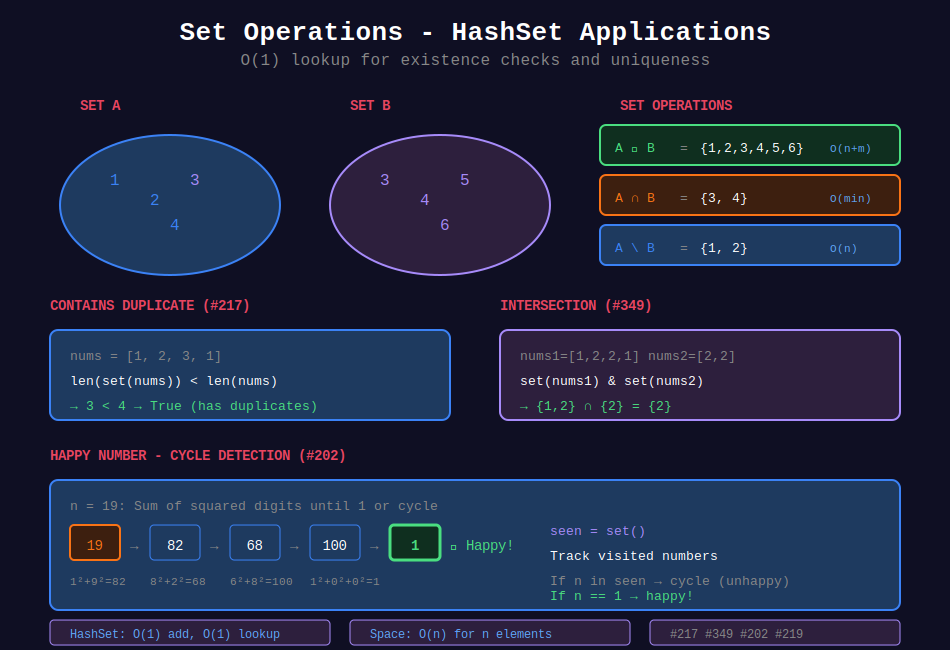
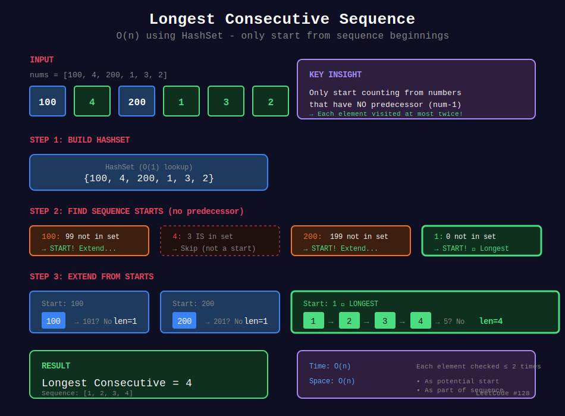
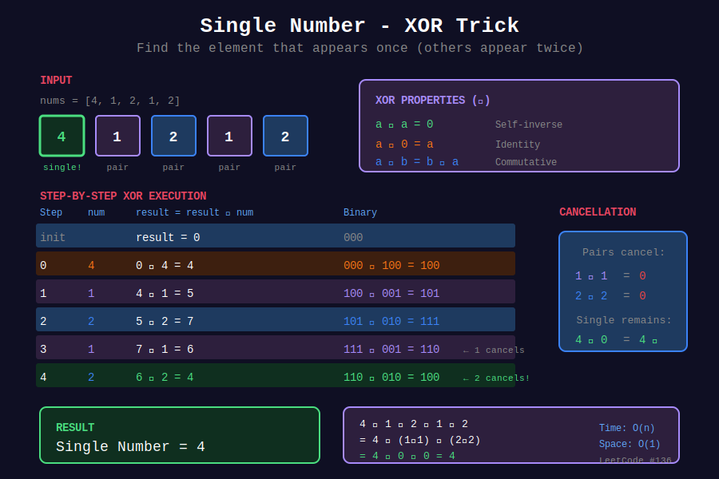

<div align="center">

# 🔗 Set Operations

<p>
  
  
</p>

</div>

---

## 🧭 Navigation

| ⬅️ Previous | 📂 Current | ➡️ Next Topic |
|:------------|:----------:|--------:|
| [← 02. Two Sum Pattern](../02_two_sum_pattern/README.md) | **03. Set Operations** | [🏠 Hash Tables Home](../README.md) → [Trees](../../07_trees/README.md) |

---

## 🎨 Visual Diagrams

<div align="center">

### Set Operations Overview


### Longest Consecutive Sequence


### Single Number - XOR Trick


</div>

---

## 📐 Mathematical Foundations

### 1️⃣ Set Definition

```math
S = \{x : x \text{ is unique}\}
```

**Hash Set Property:** No duplicates, O(1) lookup.

---

### 2️⃣ Set Operations Complexity

| Operation | Formula | Time |
|-----------|---------|:----:|
| Union | $A \cup B$ | O(n + m) |
| Intersection | $A \cap B$ | O(min(n, m)) |
| Difference | $A \setminus B$ | O(n) |
| Symmetric Diff | $A \triangle B = (A \cup B) \setminus (A \cap B)$ | O(n + m) |
| Subset | $A \subseteq B$ | O(n) |

---

### 3️⃣ Contains Duplicate

**Problem:** Check if any element appears more than once.

```math
\exists i \neq j: a[i] = a[j]
```

**Set Solution:** If $|set(a)| < n$, duplicates exist.

---

### 4️⃣ Intersection of Arrays

```math
A \cap B = \{x : x \in A \land x \in B\}
```

**Multiplicity (for multisets):**

```math
\text{count}_{A \cap B}(x) = \min(\text{count}_A(x), \text{count}_B(x))
```

---

### 5️⃣ Longest Consecutive Sequence

**Problem:** Find longest consecutive sequence in unsorted array.

**Set Approach:**
1. Build set of all elements
2. For each potential sequence start (no predecessor), extend

**Time:** O(n) - each element visited at most twice.

---

## 💻 Code Implementations

```python
def containsDuplicate(nums: list[int]) -> bool:
    """
    Check for duplicates.
    
    If set size < array size, duplicates exist.
    
    Time: O(n), Space: O(n)
    """
    return len(set(nums)) < len(nums)

def intersection(nums1: list[int], nums2: list[int]) -> list[int]:
    """
    Find intersection (unique elements).
    
    Set intersection.
    
    Time: O(n + m), Space: O(n)
    """
    return list(set(nums1) & set(nums2))

def intersectionWithDuplicates(nums1: list[int], nums2: list[int]) -> list[int]:
    """
    Find intersection with duplicates (multiset).
    
    Use Counter for frequency tracking.
    
    Time: O(n + m), Space: O(n)
    """
    from collections import Counter
    
    count1 = Counter(nums1)
    result = []
    
    for num in nums2:
        if count1[num] > 0:
            result.append(num)
            count1[num] -= 1
    
    return result

def longestConsecutive(nums: list[int]) -> int:
    """
    Find longest consecutive sequence.
    
    For each sequence start (no predecessor), extend.
    Each element processed at most twice.
    
    Time: O(n), Space: O(n)
    """
    num_set = set(nums)
    max_length = 0
    
    for num in num_set:
        # Only start from sequence beginning
        if num - 1 not in num_set:
            current = num
            length = 1
            
            while current + 1 in num_set:
                current += 1
                length += 1
            
            max_length = max(max_length, length)
    
    return max_length

def isHappy(n: int) -> bool:
    """
    Happy number - detect cycle using set.
    
    Sum of squared digits eventually reaches 1 or cycles.
    
    Time: O(log n), Space: O(log n)
    """
    def digit_square_sum(num):
        total = 0
        while num:
            digit = num % 10
            total += digit * digit
            num //= 10
        return total
    
    seen = set()
    
    while n != 1 and n not in seen:
        seen.add(n)
        n = digit_square_sum(n)
    
    return n == 1

def singleNumber(nums: list[int]) -> int:
    """
    Find single number (others appear twice).
    
    XOR: a ^ a = 0, a ^ 0 = a
    
    Time: O(n), Space: O(1)
    """
    result = 0
    for num in nums:
        result ^= num
    return result

def missingNumber(nums: list[int]) -> int:
    """
    Find missing number in [0, n].
    
    Expected sum - actual sum, or XOR approach.
    
    Time: O(n), Space: O(1)
    """
    n = len(nums)
    expected_sum = n * (n + 1) // 2
    return expected_sum - sum(nums)
```

---

## 🏆 LeetCode Problems

### 🟢 Easy

| # | Problem | Pattern | Time | Space |
|:-:|---------|---------|:----:|:-----:|
| 136 | [Single Number](https://leetcode.com/problems/single-number/) | XOR | O(n) | O(1) |
| 202 | [Happy Number](https://leetcode.com/problems/happy-number/) | Cycle Detection | O(log n) | O(log n) |
| 217 | [Contains Duplicate](https://leetcode.com/problems/contains-duplicate/) | Set | O(n) | O(n) |
| 219 | [Contains Duplicate II](https://leetcode.com/problems/contains-duplicate-ii/) | Sliding Set | O(n) | O(k) |
| 268 | [Missing Number](https://leetcode.com/problems/missing-number/) | Math/XOR | O(n) | O(1) |
| 349 | [Intersection of Two Arrays](https://leetcode.com/problems/intersection-of-two-arrays/) | Set | O(n + m) | O(n) |
| 350 | [Intersection of Two Arrays II](https://leetcode.com/problems/intersection-of-two-arrays-ii/) | Counter | O(n + m) | O(n) |
| 771 | [Jewels and Stones](https://leetcode.com/problems/jewels-and-stones/) | Set | O(n + m) | O(n) |

### 🟡 Medium

| # | Problem | Pattern | Time | Space |
|:-:|---------|---------|:----:|:-----:|
| 128 | [Longest Consecutive Sequence](https://leetcode.com/problems/longest-consecutive-sequence/) | Set | O(n) | O(n) |
| 220 | [Contains Duplicate III](https://leetcode.com/problems/contains-duplicate-iii/) | Bucket | O(n) | O(k) |
| 287 | [Find the Duplicate Number](https://leetcode.com/problems/find-the-duplicate-number/) | Floyd's | O(n) | O(1) |
| 442 | [Find All Duplicates](https://leetcode.com/problems/find-all-duplicates-in-an-array/) | Index as Hash | O(n) | O(1) |
| 448 | [Find Disappeared Numbers](https://leetcode.com/problems/find-all-numbers-disappeared-in-an-array/) | Index as Hash | O(n) | O(1) |

### 🔴 Hard

| # | Problem | Pattern | Time | Space |
|:-:|---------|---------|:----:|:-----:|
| 41 | [First Missing Positive](https://leetcode.com/problems/first-missing-positive/) | Index as Hash | O(n) | O(1) |

---

---

## 🎨 Visual Algorithm Walkthrough

### Longest Consecutive Sequence (#128)

```
nums = [100, 4, 200, 1, 3, 2]

Step 1: Build set
  num_set = {100, 4, 200, 1, 3, 2}

Step 2: Find sequence starts (no predecessor)
  100: 99 not in set → start
    100 → no 101 → length 1
  
  4: 3 in set → skip (not a start)
  
  200: 199 not in set → start
    200 → no 201 → length 1
  
  1: 0 not in set → start ✓
    1 → 2 in set
    2 → 3 in set
    3 → 4 in set
    4 → no 5 → length 4

Max length: 4 (sequence: 1,2,3,4)

Time: O(n) - each element checked at most twice
```

### Intersection of Arrays (#349, #350)

```
nums1 = [1, 2, 2, 1], nums2 = [2, 2]

Unique intersection (#349):
  set1 = {1, 2}
  set2 = {2}
  intersection = {2}
  result = [2]

With duplicates (#350):
  count1 = {1:2, 2:2}
  For each in nums2:
    2: count1[2]=2 > 0 → add, decrement
    2: count1[2]=1 > 0 → add, decrement
  result = [2, 2]
```

### Happy Number (#202)

```
n = 19

Iteration 1: 1² + 9² = 1 + 81 = 82
Iteration 2: 8² + 2² = 64 + 4 = 68
Iteration 3: 6² + 8² = 36 + 64 = 100
Iteration 4: 1² + 0² + 0² = 1 ✓

seen = {19, 82, 68, 100}
Result: True (reached 1)

Unhappy example: n = 2
2 → 4 → 16 → 37 → 58 → 89 → 145 → 42 → 20 → 4 (cycle!)
```

### Single Number (#136)

```
nums = [4, 1, 2, 1, 2]

XOR properties:
  a ^ a = 0
  a ^ 0 = a
  XOR is commutative

Process:
  0 ^ 4 = 4
  4 ^ 1 = 5
  5 ^ 2 = 7
  7 ^ 1 = 6
  6 ^ 2 = 4

Result: 4 (the single number)

Why: All pairs cancel out (a ^ a = 0)
```

---

## 📊 Pattern Selection

```
Unique elements needed?
         |
         +-- Check existence → HashSet
         |
         +-- Count occurrences → Counter/HashMap
         |
         +-- Find missing/duplicate → 
                 |
                 +-- O(1) space needed → XOR or Index trick
                 |
                 +-- O(n) space OK → HashSet
```

### Pattern Decision Table

| Problem Type | Technique | Space | Example |
|-------------|-----------|-------|---------|
| Check duplicates | HashSet | O(n) | #217 |
| Find intersection | Set operations | O(n) | #349 |
| Longest consecutive | Set + smart iteration | O(n) | #128 |
| Single number | XOR | O(1) | #136 |
| Missing number | Math/XOR | O(1) | #268 |
| Cycle detection | HashSet | O(n) | #202 |

---

## 💡 Pattern Recognition Guide

| Problem Keywords | Pattern | Example |
|-----------------|---------|---------|
| "contains duplicate" | HashSet | #217, #219 |
| "intersection" | Set operations | #349, #350 |
| "longest consecutive" | Set + iteration | #128 |
| "single number" | XOR trick | #136, #137 |
| "missing number" | Math/XOR | #268 |
| "happy number" | Cycle detection | #202 |
| "find duplicates" | Index as hash | #442, #448 |

---

## 📚 References & Learning Resources

### 📖 Core Concepts
| Resource | Topic | Link |
|----------|-------|------|
| **Wikipedia** | Set theory | [Article](https://en.wikipedia.org/wiki/Set_(mathematics)) |
| **Python Docs** | Set types | [Documentation](https://docs.python.org/3/library/stdtypes.html#set-types-set-frozenset) |
| **GeeksforGeeks** | Set operations | [Tutorial](https://www.geeksforgeeks.org/python-set-operations-union-intersection-difference-symmetric-difference/) |
| **GeeksforGeeks** | XOR tricks | [Tutorial](https://www.geeksforgeeks.org/xor-of-all-elements-in-an-array/) |

### 📺 Video Tutorials
| Creator | Topic | Link |
|---------|-------|------|
| **NeetCode** | Longest Consecutive | [YouTube](https://www.youtube.com/watch?v=P6RZZMu_maU) |
| **NeetCode** | Contains Duplicate | [YouTube](https://www.youtube.com/watch?v=3OamzN90kPg) |
| **Back To Back SWE** | Set operations | [YouTube](https://www.youtube.com/watch?v=Pu5vFOh9QE4) |
| **Abdul Bari** | Hashing applications | [YouTube](https://www.youtube.com/watch?v=KyUTuwz_b7Q) |

### 🎯 Practice Collections
| Platform | Focus | Link |
|----------|-------|------|
| **LeetCode** | Hash set tag | [Problems](https://leetcode.com/tag/hash-table/) |
| **HackerRank** | Set problems | [Practice](https://www.hackerrank.com/domains/python?filters%5Bsubdomains%5D%5B%5D=py-sets) |

### 🔬 Advanced Topics
| Topic | Description | Link |
|-------|-------------|------|
| **XOR Properties** | Bit manipulation tricks | [Tutorial](https://www.geeksforgeeks.org/bitwise-operators-in-c-cpp/) |
| **Floyd's Cycle Detection** | Fast-slow pointers | [Article](https://en.wikipedia.org/wiki/Cycle_detection#Floyd's_Tortoise_and_Hare) |
| **Index as Hash** | O(1) space techniques | [Tutorial](https://www.geeksforgeeks.org/find-duplicates-in-on-time-and-constant-extra-space/) |
| **Bloom Filters** | Probabilistic sets | [Wikipedia](https://en.wikipedia.org/wiki/Bloom_filter) |

### 📊 Visualization
| Tool | Purpose | Link |
|------|---------|------|
| **VisuAlgo** | Set operations | [Website](https://visualgo.net/en/hashtable) |
| **Algorithm Visualizer** | Hash problems | [Website](https://algorithm-visualizer.org/) |

### 📐 Mathematical Background
| Topic | Description | Link |
|-------|-------------|------|
| **Set Theory** | Union, intersection, difference | [Wikipedia](https://en.wikipedia.org/wiki/Set_theory) |
| **XOR Algebra** | Properties and proofs | [Tutorial](https://en.wikipedia.org/wiki/Exclusive_or) |

---

## 💡 Pro Tips

> **🎯 Set for Uniqueness:** Need unique elements or check existence? Use HashSet!

> **⚡ XOR for Single Element:** `a ^ a = 0`, `a ^ 0 = a`. All pairs cancel, single remains!

> **🔍 Longest Consecutive Trick:** Only start from sequence beginning (no predecessor). Each element visited ≤ 2 times → O(n)!

> **📊 Index as Hash:** For array [1..n], use indices as hash. Mark visited by negating: `nums[abs(num)-1] *= -1`

> **🌊 Cycle Detection:** Use set to detect cycles. If seen before, cycle exists!

---

## 🎖️ Practice Roadmap

**Week 1: Fundamentals**
1. Solve #217 (Contains Duplicate) - Basic set usage
2. Solve #349 (Intersection) - Set operations
3. Solve #136 (Single Number) - XOR trick
4. Solve #268 (Missing Number) - Math formula

**Week 2: Intermediate**
5. Solve #128 (Longest Consecutive) - Set + smart iteration
6. Solve #202 (Happy Number) - Cycle detection
7. Solve #350 (Intersection II) - Counter for multiset
8. Solve #219 (Contains Duplicate II) - Sliding window set

**Week 3: Advanced**
9. Solve #287 (Find Duplicate) - Floyd's cycle
10. Solve #442 (Find All Duplicates) - Index as hash
11. Solve #448 (Find Disappeared) - Index marking
12. Solve #41 (First Missing Positive) - Index hash O(1) space

---

## ❓ Interview Q&A

**Q: When to use set vs hash map?**  
A: Set for existence/uniqueness checks. Hash map when you need to store associated values (key-value pairs).

**Q: How does longest consecutive achieve O(n)?**  
A: Only start sequences from elements with no predecessor. Each element checked at most twice (once as start, once as continuation).

**Q: Why does XOR work for single number?**  
A: XOR properties: `a ^ a = 0` (pairs cancel), `a ^ 0 = a` (identity). All pairs cancel, single number remains!

**Q: What's the index-as-hash trick?**  
A: For array with values in [1..n], use `nums[value-1]` as "hash slot". Mark visited by negating or adding n.

**Q: How to detect cycles without extra space?**  
A: Floyd's tortoise and hare (fast-slow pointers). Fast moves 2x speed, if cycle exists they meet!

---

## 🔥 Key Insights

- **Set = O(1) Lookup:** Perfect for existence checks and uniqueness
- **XOR Cancellation:** Pairs cancel, single element survives
- **Smart Iteration:** Longest consecutive only starts from sequence beginnings
- **Index as Hash:** Use array indices as hash table for O(1) space
- **Cycle Detection:** Set tracks visited states, detects cycles

---

<div align="center">

**Made with ❤️ for the coding community by [Gaurav Goswami](https://github.com/Gaurav14cs17)**

</div>

---

## 🧭 Navigation

| ⬅️ Previous | 📂 Current | ➡️ Next Topic |
|:------------|:----------:|--------:|
| [← 02. Two Sum Pattern](../02_two_sum_pattern/README.md) | **03. Set Operations** | [🏠 Hash Tables Home](../README.md) → [Trees](../../07_trees/README.md) |
