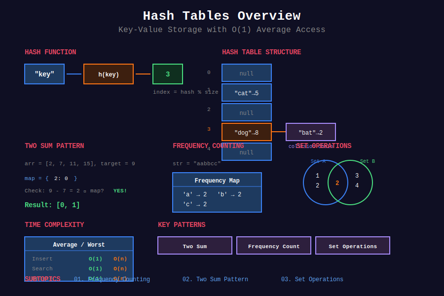

<div align="center">

# #️⃣ Hash Tables



<p>
  
  
  
</p>

**O(1) average-case lookup - The backbone of efficient algorithms**

[⬅️ Previous: Queues](../05_queues/README.md) | [🏠 Home](../README.md) | [Next: Trees ➡️](../07_trees/README.md)

</div>

---

## 📐 Mathematical Foundation

### 1️⃣ Hash Function Definition

A hash function $h: U \to \{0, 1, \ldots, m-1\}$ maps keys from universe $U$ to table indices.

**Properties of Good Hash Functions:**
1. **Deterministic:** Same key → same hash
2. **Uniform Distribution:** $P(h(k) = i) \approx \frac{1}{m}$ for random $k$
3. **Efficient:** O(1) computation

---

### 2️⃣ Common Hash Functions

**Division Method:**

```math
h(k) = k \mod m
```

Choose $m$ as prime not close to power of 2.

**Multiplication Method:**

```math
h(k) = \lfloor m \cdot (kA \mod 1) \rfloor
```

Where $A \approx \frac{\sqrt{5} - 1}{2} \approx 0.618$ (golden ratio).

**Polynomial Rolling Hash (for strings):**

```math
h(s) = \sum_{i=0}^{n-1} s[i] \cdot p^i \mod m
```

---

### 3️⃣ Collision Resolution

**Chaining:** Each slot contains a linked list.

```math
\text{Expected chain length} = \alpha = \frac{n}{m}
```

Where $\alpha$ is the load factor.

**Open Addressing:**

```math
h(k, i) = (h'(k) + f(i)) \mod m
```

| Method | $f(i)$ |
|--------|--------|
| Linear Probing | $i$ |
| Quadratic Probing | $c\_1 i + c\_2 i^2$ |
| Double Hashing | $i \cdot h''(k)$ |

---

### 4️⃣ Time Complexity Analysis

**With good hash function and $\alpha < 1$:**

| Operation | Average | Worst (with chaining) |
|-----------|:-------:|:---------------------:|
| Search | O(1) | O(n) |
| Insert | O(1) | O(n) |
| Delete | O(1) | O(n) |

**Expected Operations (Chaining):**

```math
E[\text{comparisons}] = 1 + \frac{\alpha}{2} \text{ (successful search)}
E[\text{comparisons}] = \alpha \text{ (unsuccessful search)}
```

---

### 5️⃣ Load Factor and Resizing

**Load Factor:**

```math
\alpha = \frac{n}{m}
```

**Resize Trigger:** When $\alpha > \text{threshold}$ (typically 0.75)

**Amortized Insert Cost:**

After doubling at capacities $1, 2, 4, \ldots, n$:

```math
\text{Total cost} = n + \sum_{i=0}^{\log n} 2^i = n + (2n - 1) = O(n)
\text{Amortized per insert} = O(1)
```

---

### 6️⃣ Two Sum Pattern

**Problem:** Find indices $i, j$ where $a[i] + a[j] = target$.

**Hash Map Insight:**

```math
a[j] = target - a[i]
```

Store seen values, check for complement.

**Time:** O(n), **Space:** O(n)

---

### 7️⃣ Frequency Counting

**Counter Definition:**

```math
\text{freq}[x] = |\{i : a[i] = x\}|
```

**Applications:**
- Anagram detection: $\text{freq}\_s = \text{freq}\_t$
- Majority element: $\text{freq}[x] > n/2$
- K most frequent: Top-k by frequency

---

### 8️⃣ Set Operations

| Operation | Time | Description |
|-----------|:----:|-------------|
| Union | O(n+m) | $A \cup B$ |
| Intersection | O(min(n,m)) | $A \cap B$ |
| Difference | O(n) | $A \setminus B$ |
| Subset Check | O(n) | $A \subseteq B$ |

---

## 📂 Subtopics Navigation

| # | Topic | Problems | Link |
|:-:|-------|:--------:|------|
| 1 | Frequency Counting | 15+ | [📖 Go →](./01_frequency_counting/README.md) |
| 2 | Two Sum Pattern | 12+ | [📖 Go →](./02_two_sum_pattern/README.md) |
| 3 | Set Operations | 10+ | [📖 Go →](./03_set_operations/README.md) |

---

## 🎯 Key Patterns

### Two Sum Template

```python
def twoSum(nums: list[int], target: int) -> list[int]:
    """
    Find two indices that sum to target.
    
    Key: complement = target - current
    Store index of each number seen.
    
    Time: O(n), Space: O(n)
    """
    seen = {}  # value -> index
    
    for i, num in enumerate(nums):
        complement = target - num
        if complement in seen:
            return [seen[complement], i]
        seen[num] = i
    
    return []
```

### Frequency Counter

```python
from collections import Counter

def topKFrequent(nums: list[int], k: int) -> list[int]:
    """
    Find k most frequent elements.
    
    Time: O(n log k) with heap, O(n) with bucket sort
    """
    freq = Counter(nums)
    return [x for x, _ in freq.most_common(k)]
```

### Group Anagrams

```python
def groupAnagrams(strs: list[str]) -> list[list[str]]:
    """
    Group strings by anagram equivalence.
    
    Key: sorted string or frequency tuple
    
    Time: O(n * k log k), Space: O(n * k)
    """
    from collections import defaultdict
    
    groups = defaultdict(list)
    for s in strs:
        key = tuple(sorted(s))
        groups[key].append(s)
    
    return list(groups.values())
```

---

## 🏆 LeetCode Problems

### 🟢 Easy

| # | Problem | Pattern | Time | Space |
|:-:|---------|---------|:----:|:-----:|
| 1 | [Two Sum](https://leetcode.com/problems/two-sum/) | Complement Map | O(n) | O(n) |
| 136 | [Single Number](https://leetcode.com/problems/single-number/) | XOR / Hash | O(n) | O(1) |
| 169 | [Majority Element](https://leetcode.com/problems/majority-element/) | Boyer-Moore | O(n) | O(1) |
| 202 | [Happy Number](https://leetcode.com/problems/happy-number/) | Cycle Detection | O(log n) | O(log n) |
| 217 | [Contains Duplicate](https://leetcode.com/problems/contains-duplicate/) | Set | O(n) | O(n) |
| 242 | [Valid Anagram](https://leetcode.com/problems/valid-anagram/) | Frequency | O(n) | O(1) |
| 290 | [Word Pattern](https://leetcode.com/problems/word-pattern/) | Bijection | O(n) | O(n) |
| 349 | [Intersection of Two Arrays](https://leetcode.com/problems/intersection-of-two-arrays/) | Set | O(n+m) | O(n) |
| 350 | [Intersection of Two Arrays II](https://leetcode.com/problems/intersection-of-two-arrays-ii/) | Counter | O(n+m) | O(n) |
| 383 | [Ransom Note](https://leetcode.com/problems/ransom-note/) | Counter | O(n) | O(1) |
| 387 | [First Unique Character](https://leetcode.com/problems/first-unique-character-in-a-string/) | Frequency | O(n) | O(1) |
| 389 | [Find the Difference](https://leetcode.com/problems/find-the-difference/) | XOR / Count | O(n) | O(1) |
| 409 | [Longest Palindrome](https://leetcode.com/problems/longest-palindrome/) | Frequency | O(n) | O(1) |
| 771 | [Jewels and Stones](https://leetcode.com/problems/jewels-and-stones/) | Set | O(n+m) | O(n) |

### 🟡 Medium

| # | Problem | Pattern | Time | Space |
|:-:|---------|---------|:----:|:-----:|
| 3 | [Longest Substring Without Repeating](https://leetcode.com/problems/longest-substring-without-repeating-characters/) | Sliding + Hash | O(n) | O(k) |
| 36 | [Valid Sudoku](https://leetcode.com/problems/valid-sudoku/) | Set per Row/Col/Box | O(1) | O(1) |
| 49 | [Group Anagrams](https://leetcode.com/problems/group-anagrams/) | Hash Grouping | O(nk log k) | O(nk) |
| 128 | [Longest Consecutive Sequence](https://leetcode.com/problems/longest-consecutive-sequence/) | Set | O(n) | O(n) |
| 138 | [Copy List with Random Pointer](https://leetcode.com/problems/copy-list-with-random-pointer/) | Node Map | O(n) | O(n) |
| 146 | [LRU Cache](https://leetcode.com/problems/lru-cache/) | Hash + DLL | O(1) | O(n) |
| 347 | [Top K Frequent Elements](https://leetcode.com/problems/top-k-frequent-elements/) | Bucket Sort | O(n) | O(n) |
| 380 | [Insert Delete GetRandom O(1)](https://leetcode.com/problems/insert-delete-getrandom-o1/) | Hash + Array | O(1) | O(n) |
| 438 | [Find All Anagrams](https://leetcode.com/problems/find-all-anagrams-in-a-string/) | Sliding Window | O(n) | O(1) |
| 454 | [4Sum II](https://leetcode.com/problems/4sum-ii/) | Two-pair Hash | O(n²) | O(n²) |
| 523 | [Continuous Subarray Sum](https://leetcode.com/problems/continuous-subarray-sum/) | Prefix + Mod | O(n) | O(min(n,k)) |
| 560 | [Subarray Sum Equals K](https://leetcode.com/problems/subarray-sum-equals-k/) | Prefix + Hash | O(n) | O(n) |
| 567 | [Permutation in String](https://leetcode.com/problems/permutation-in-string/) | Sliding Window | O(n) | O(1) |
| 739 | [Daily Temperatures](https://leetcode.com/problems/daily-temperatures/) | Monotonic Stack | O(n) | O(n) |

### 🔴 Hard

| # | Problem | Pattern | Time | Space |
|:-:|---------|---------|:----:|:-----:|
| 41 | [First Missing Positive](https://leetcode.com/problems/first-missing-positive/) | Index as Hash | O(n) | O(1) |
| 76 | [Minimum Window Substring](https://leetcode.com/problems/minimum-window-substring/) | Sliding + Hash | O(n) | O(k) |
| 460 | [LFU Cache](https://leetcode.com/problems/lfu-cache/) | Hash + DLL | O(1) | O(n) |

---

## 📊 Pattern Decision Tree

```
              Hash Table Problem
                     |
      +--------------+--------------+
      |              |              |
 Find pair?     Frequency?    Unique check?
      |              |              |
   Two Sum     Counter/Map      HashSet
      |              |              |
 Complement   Top-K, Anagram   Duplicates
```

---

---

## 💡 Key Insights & Pro Tips

> **🎯 Hash Table = O(1) Magic**  
> Average O(1) lookup, insert, delete. The backbone of efficient algorithms!

> **⚡ Two Sum Pattern**  
> For each element, check if complement exists in hash. Reduces O(n²) to O(n)!

> **🔄 Frequency Counting**  
> Counter/HashMap for frequency. Enables anagram detection, top-k, majority element in O(n)!

> **📊 Set Operations**  
> Use HashSet for uniqueness, duplicates, intersection. O(1) membership test!

> **🌊 Prefix Sum + Hash**  
> For subarray sum problems: `P[j] - P[i] = k` → `P[i] = P[j] - k`. Store prefix sums in hash!

---

## 🧮 Quick Pattern Reference

| Pattern in Problem | Technique | Example |
|-------------------|-----------|---------|
| "find pair sum to target" | Complement hash | #1, #167 |
| "count frequency" | Counter/HashMap | #347, #451 |
| "group by property" | Hash grouping | #49 |
| "check duplicates" | HashSet | #217, #219 |
| "subarray sum = k" | Prefix + hash | #560, #523 |
| "anagram detection" | Frequency map | #242, #438 |
| "longest consecutive" | Set | #128 |
| "intersection" | Set operations | #349, #350 |

---

## 🎯 Must-Solve Problems (Top 15)

| # | Problem | Category | Difficulty | Why Important |
|:-:|---------|----------|------------|---------------|
| 1 | [Two Sum](https://leetcode.com/problems/two-sum/) | Complement | 🟢 Easy | Hash foundation |
| 2 | [Group Anagrams](https://leetcode.com/problems/group-anagrams/) | Grouping | 🟡 Medium | Hash grouping |
| 3 | [Top K Frequent](https://leetcode.com/problems/top-k-frequent-elements/) | Frequency | 🟡 Medium | Bucket sort |
| 4 | [Longest Consecutive](https://leetcode.com/problems/longest-consecutive-sequence/) | Set | 🟡 Medium | O(n) with set |
| 5 | [Subarray Sum = K](https://leetcode.com/problems/subarray-sum-equals-k/) | Prefix sum | 🟡 Medium | Prefix + hash |
| 6 | [LRU Cache](https://leetcode.com/problems/lru-cache/) | Design | 🟡 Medium | Hash + DLL |
| 7 | [Valid Anagram](https://leetcode.com/problems/valid-anagram/) | Frequency | 🟢 Easy | Counter pattern |
| 8 | [Contains Duplicate](https://leetcode.com/problems/contains-duplicate/) | Set | 🟢 Easy | Basic set usage |
| 9 | [4Sum II](https://leetcode.com/problems/4sum-ii/) | Two-pair | 🟡 Medium | Split technique |
| 10 | [Longest Substring No Repeat](https://leetcode.com/problems/longest-substring-without-repeating-characters/) | Sliding + hash | 🟡 Medium | Window tracking |
| 11 | [Majority Element](https://leetcode.com/problems/majority-element/) | Frequency | 🟢 Easy | Boyer-Moore |
| 12 | [Find All Anagrams](https://leetcode.com/problems/find-all-anagrams-in-a-string/) | Sliding window | 🟡 Medium | Window + freq |
| 13 | [First Missing Positive](https://leetcode.com/problems/first-missing-positive/) | Index hash | 🔴 Hard | O(1) space trick |
| 14 | [Minimum Window Substring](https://leetcode.com/problems/minimum-window-substring/) | Sliding + hash | 🔴 Hard | Advanced window |
| 15 | [Insert Delete GetRandom](https://leetcode.com/problems/insert-delete-getrandom-o1/) | Design | 🟡 Medium | Hash + array |

---

## 📚 References & Learning Resources

### 📖 Books & Courses
| Resource | Description | Link |
|----------|-------------|------|
| **CLRS Chapter 11** | Hash tables theory | [MIT Press](https://mitpress.mit.edu/books/introduction-algorithms) |
| **Algorithms 4th Edition** | Hash table implementations | [Book Site](https://algs4.cs.princeton.edu/) |
| **Competitive Programming 3** | Chapter 2.2 - Data structures | [Book](https://cpbook.net/) |

### 🌐 Online Tutorials
| Resource | Description | Link |
|----------|-------------|------|
| **GeeksforGeeks** | Hash table complete guide | [Tutorial](https://www.geeksforgeeks.org/hashing-data-structure/) |
| **LeetCode Explore** | Hash table card | [Course](https://leetcode.com/explore/learn/card/hash-table/) |
| **VisuAlgo** | Interactive hash visualization | [Website](https://visualgo.net/en/hashtable) |
| **HackerRank** | Hash challenges | [Practice](https://www.hackerrank.com/domains/data-structures?filters%5Bsubdomains%5D%5B%5D=hash-tables) |

### 📺 Video Resources
| Resource | Topic | Link |
|----------|-------|------|
| **NeetCode** | Hash table playlist | [YouTube](https://www.youtube.com/playlist?list=PLot-Xpze53lf0yCpSXBhXRCLu1ibZUGBU) |
| **Abdul Bari** | Hashing lectures | [YouTube](https://www.youtube.com/watch?v=KyUTuwz_b7Q) |
| **MIT OCW** | Hash functions | [Lecture](https://ocw.mit.edu/courses/6-006-introduction-to-algorithms-fall-2011/) |
| **Back To Back SWE** | Hash problems | [YouTube](https://www.youtube.com/playlist?list=PLiQ766zSC5jM2OKVr8sooOuGgZkvnOCTI) |
| **William Fiset** | Hash table theory | [YouTube](https://www.youtube.com/watch?v=2E54GqF0H4s) |

### 📝 Practice Platforms
| Platform | Focus | Link |
|----------|-------|------|
| **LeetCode** | Hash table tag | [Problems](https://leetcode.com/tag/hash-table/) |
| **HackerRank** | Hash challenges | [Practice](https://www.hackerrank.com/domains/data-structures?filters%5Bsubdomains%5D%5B%5D=hash-tables) |
| **Codeforces** | Hash problems | [Problemset](https://codeforces.com/problemset) |
| **CodeChef** | Hash practice | [Practice](https://www.codechef.com/practice) |

### 🔬 Advanced Topics
| Topic | Description | Link |
|-------|-------------|------|
| **Collision Resolution** | Chaining vs open addressing | [Tutorial](https://www.geeksforgeeks.org/hashing-set-2-separate-chaining/) |
| **Perfect Hashing** | Zero collisions | [Wikipedia](https://en.wikipedia.org/wiki/Perfect_hash_function) |
| **Rolling Hash** | String hashing | [CP-Algorithms](https://cp-algorithms.com/string/string-hashing.html) |
| **Bloom Filters** | Probabilistic set | [Wikipedia](https://en.wikipedia.org/wiki/Bloom_filter) |
| **Consistent Hashing** | Distributed systems | [Article](https://www.toptal.com/big-data/consistent-hashing) |

### 🎯 Problem Collections
| Collection | Focus | Link |
|-----------|-------|------|
| **NeetCode 150** | Essential hash problems | [List](https://neetcode.io/practice) |
| **Blind 75** | Core interview | [List](https://www.teamblind.com/post/New-Year-Gift---Curated-List-of-Top-75-LeetCode-Questions-to-Save-Your-Time-OaM1orEU) |
| **Grind 75** | Structured prep | [Guide](https://www.techinterviewhandbook.org/grind75) |
| **Striver's SDE Sheet** | Must-do hash | [Sheet](https://takeuforward.org/interviews/strivers-sde-sheet-top-coding-interview-problems/) |

### 📊 Visualization Tools
| Tool | Purpose | Link |
|------|---------|------|
| **VisuAlgo** | Hash table operations | [Website](https://visualgo.net/en/hashtable) |
| **Algorithm Visualizer** | Hash functions | [Website](https://algorithm-visualizer.org/) |
| **CS Animations** | Collision resolution | [Website](https://www.cs.usfca.edu/~galles/visualization/OpenHash.html) |

### 🏆 Competition Resources
| Resource | Topic | Link |
|----------|-------|------|
| **USACO Guide** | Hash maps guide | [Guide](https://usaco.guide/bronze/intro-sets) |
| **TopCoder** | Hash tutorials | [Tutorials](https://www.topcoder.com/thrive/articles/) |
| **Codeforces EDU** | Data structures | [Course](https://codeforces.com/edu/course/2) |

---

## 🎖️ Interview Success Tips

### Common Mistakes to Avoid

❌ **Don't:**
- Forget to check if key exists before accessing (use `.get()` or `in`)
- Use hash when order matters (use OrderedDict or list)
- Ignore hash collision worst case (O(n) in pathological cases)
- Forget that Python dict is ordered (since 3.7+)
- Use mutable objects as keys (lists, sets - use tuples instead)

✅ **Do:**
- Use `defaultdict` to avoid key existence checks
- Use `Counter` for frequency counting
- Consider space-time tradeoff (hash uses O(n) space)
- Test with duplicate keys
- Use tuple for multi-dimensional keys: `(row, col)`

### Optimization Checklist

```
[ ] Can I use complement/difference to avoid nested loops?
[ ] Do I need frequency counting (use Counter)?
[ ] Is this a grouping problem (use defaultdict)?
[ ] Can prefix sum + hash solve subarray problem?
[ ] Should I use set for uniqueness check?
[ ] Do I need to track indices (use dict) or just existence (use set)?
```

---

## 🌟 Motivational Corner

> "Hash tables are the Swiss Army knife of data structures - versatile, efficient, and essential."

**Progress Tracker:**
- 🥉 **Bronze:** Solve 15 hash problems
- 🥈 **Silver:** Solve 30 hash problems + master Two Sum pattern
- 🥇 **Gold:** Solve 50 hash problems + frequency patterns
- 💎 **Platinum:** Master all patterns + design problems (LRU, LFU)

**Remember:** Hash tables turn O(n²) into O(n) for many problems. That's their superpower! 🚀

---

<div align="center">

### 🌟 If this helped you, give it a ⭐ on GitHub! 🌟

**Made with ❤️ for the coding community by [Gaurav Goswami](https://github.com/Gaurav14cs17)**

[⬅️ Previous: Queues](../05_queues/README.md) | [🏠 Home](../README.md) | [Next: Trees ➡️](../07_trees/README.md)

---

*Last Updated: December 2025*  
*Licensed under MIT*  
*Happy Coding! 💻✨*

</div>
