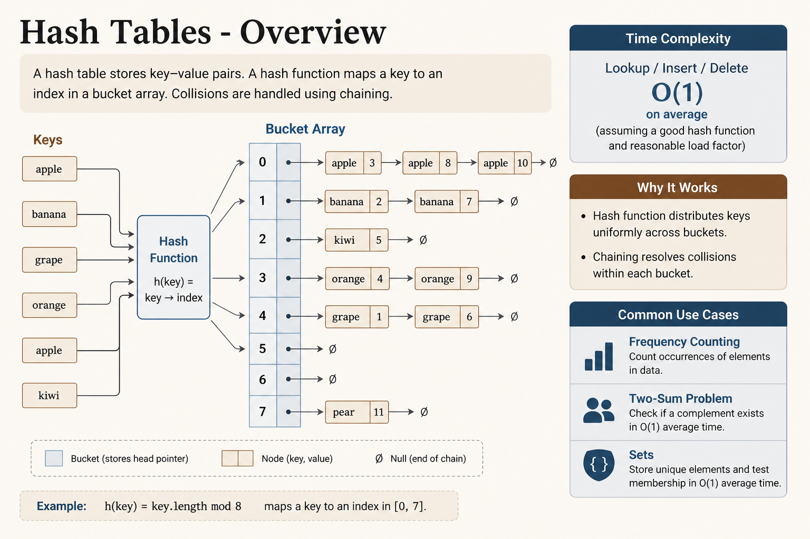

<div align="center">

# #️⃣ Hash Tables

### *O(1) average-case lookup - The backbone of efficient algorithms*


<p>
  
  
  
</p>

**O(1) average-case lookup - The backbone of efficient algorithms**

[⬅️ Previous: Queues](../05_queues/README.md) | [🏠 Home](../README.md) | [Next: Trees ➡️](../07_trees/README.md)

</div>

---

## 🎯 At a Glance

| | |
|:---|:---|
| **In one line** | O(1) average-case lookup - The backbone of efficient algorithms |
| **Difficulty** | Easy to Medium |
| **Subtopics** | 3 |
| **Problems** | 40+ |

> **How to use this page:** Start with the visual overview, scan **At a Glance**, then work through theory → walkthroughs → code.

---

## 📂 Subtopics Navigation

| # | Topic | Problems | Link |
|:-:|-------|:--------:|------|
| 1 | Frequency Counting | 15+ | [📖 Go →](./01_frequency_counting/README.md) |
| 2 | Two Sum Pattern | 12+ | [📖 Go →](./02_two_sum_pattern/README.md) |
| 3 | Set Operations | 10+ | [📖 Go →](./03_set_operations/README.md) |

---

## 📐 Mathematical Foundation

### 1️⃣ Hash Function Definition

A hash function $h: U \to \{0, 1, \ldots, m-1\}$ maps keys from universe $U$ to table indices.

**Properties of Good Hash Functions:**

1. **Deterministic:** Same key → same hash

2. **Uniform Distribution:** $P(h(k) = i) \approx \frac{1}{m}$ for random $k$

3. **Efficient:** O(1) computation

---

### 2️⃣ Common Hash Functions

**Division Method:**

$$h(k) = k \mod m$$

Choose $m$ as prime not close to power of 2.

**Multiplication Method:**

$$h(k) = \lfloor m \cdot (kA \mod 1) \rfloor$$

Where $A \approx \frac{\sqrt{5} - 1}{2} \approx 0.618$ (golden ratio).

**Polynomial Rolling Hash (for strings):**

$$h(s) = \sum_{i=0}^{n-1} s[i] \cdot p^i \mod m$$

---

### 3️⃣ Collision Resolution

**Chaining:** Each slot contains a linked list.

$$\text{Expected chain length} = \alpha = \frac{n}{m}$$

Where $\alpha$ is the load factor.

**Open Addressing:**

$$h(k, i) = (h'(k) + f(i)) \mod m$$

| Method | $f(i)$ |
|--------|--------|
| Linear Probing | $i$ |
| Quadratic Probing | $c_1 i + c_2 i^2$ |
| Double Hashing | $i \cdot h''(k)$ |

---

### 4️⃣ Time Complexity Analysis

**With good hash function and $\alpha < 1$:**

| Operation | Average | Worst (with chaining) |
|-----------|:-------:|:---------------------:|
| Search | O(1) | O(n) |
| Insert | O(1) | O(n) |
| Delete | O(1) | O(n) |

**Expected Operations (Chaining):**

$$E[\text{comparisons}] = 1 + \frac{\alpha}{2} \text{ (successful search)}
E[\text{comparisons}] = \alpha \text{ (unsuccessful search)}$$

---

### 5️⃣ Load Factor and Resizing

**Load Factor:**

$$\alpha = \frac{n}{m}$$

**Resize Trigger:** When $\alpha > \text{threshold}$ (typically 0.75)

**Amortized Insert Cost:**

After doubling at capacities $1, 2, 4, \ldots, n$:

$$\text{Total cost} = n + \sum_{i=0}^{\log n} 2^i = n + (2n - 1) = O(n)
\text{Amortized per insert} = O(1)$$

---

### 6️⃣ Two Sum Pattern

**Problem:** Find indices $i, j$ where $a[i] + a[j] = target$.

**Hash Map Insight:**

$$a[j] = target - a[i]$$

Store seen values, check for complement.

**Time:** O(n), **Space:** O(n)

---

### 7️⃣ Frequency Counting

**Counter Definition:**

$$\text{freq}[x] = |\{i : a[i] = x\}|$$

**Applications:**

- Anagram detection: $\text{freq}_s = \text{freq}_t$

- Majority element: $\text{freq}[x] > n/2$

- K most frequent: Top-k by frequency

---

### 8️⃣ Set Operations

| Operation | Time | Description |
|-----------|:----:|-------------|
| Union | O(n+m) | $A \cup B$ |
| Intersection | O(min(n,m)) | $A \cap B$ |
| Difference | O(n) | $A \setminus B$ |
| Subset Check | O(n) | $A \subseteq B$ |

---

## 📊 Visual Overview

<div align="center">



*Hash Tables Overview*

</div>

---

## 🎯 Key Patterns

### Two Sum Template
```python
def twoSum(nums: list[int], target: int) -> list[int]:
    """
    Find two indices that sum to target.
    
    Key: complement = target - current
    Store index of each number seen.
    
    Time: O(n), Space: O(n)
    """
    seen = {}  # value -> index
    
    for i, num in enumerate(nums):
        complement = target - num
        if complement in seen:
            return [seen[complement], i]
        seen[num] = i
    
    return []
```

### Frequency Counter
```python
from collections import Counter

def topKFrequent(nums: list[int], k: int) -> list[int]:
    """
    Find k most frequent elements.
    
    Time: O(n log k) with heap, O(n) with bucket sort
    """
    freq = Counter(nums)
    return [x for x, _ in freq.most_common(k)]
```

### Group Anagrams
```python
def groupAnagrams(strs: list[str]) -> list[list[str]]:
    """
    Group strings by anagram equivalence.
    
    Key: sorted string or frequency tuple
    
    Time: O(n * k log k), Space: O(n * k)
    """
    from collections import defaultdict
    
    groups = defaultdict(list)
    for s in strs:
        key = tuple(sorted(s))
        groups[key].append(s)
    
    return list(groups.values())
```

### Pattern Decision Tree

```text
              Hash Table Problem
                     |
   Two Sum     Counter/Map      HashSet
      |              |              |
 Complement   Top-K, Anagram   Duplicates
```


### Pattern Checklist
- [ ] Can I use complement/difference to avoid nested loops?
- [ ] Do I need frequency counting (use Counter)?
- [ ] Is this a grouping problem (use defaultdict)?
- [ ] Can prefix sum + hash solve subarray problem?
- [ ] Should I use set for uniqueness check?
- [ ] Do I need to track indices (use dict) or just existence (use set)?


---

## 🏆 LeetCode Problems

### 🟢 Easy
| # | Problem | Pattern | Time | Space |
|:-:|---------|---------|:----:|:-----:|
| 1 | [Two Sum](https://leetcode.com/problems/two-sum/) | Hash Map | O(n) | O(n) |
| 217 | [Contains Duplicate](https://leetcode.com/problems/contains-duplicate/) | Hash Set | O(n) | O(n) |
| 242 | [Valid Anagram](https://leetcode.com/problems/valid-anagram/) | Frequency | O(n) | O(1) |
| 387 | [First Unique Character](https://leetcode.com/problems/first-unique-character-in-a-string/) | Frequency | O(n) | O(1) |

### 🟡 Medium
| # | Problem | Pattern | Time | Space |
|:-:|---------|---------|:----:|:-----:|
| 49 | [Group Anagrams](https://leetcode.com/problems/group-anagrams/) | Hash Grouping | O(nk log k) | O(nk) |
| 347 | [Top K Frequent Elements](https://leetcode.com/problems/top-k-frequent-elements/) | Bucket/Heap | O(n) | O(n) |
| 560 | [Subarray Sum Equals K](https://leetcode.com/problems/subarray-sum-equals-k/) | Prefix + Hash | O(n) | O(n) |
| 128 | [Longest Consecutive Sequence](https://leetcode.com/problems/longest-consecutive-sequence/) | Hash Set | O(n) | O(n) |

### 🔴 Hard
| # | Problem | Pattern | Time | Space |
|:-:|---------|---------|:----:|:-----:|
| 76 | [Minimum Window Substring](https://leetcode.com/problems/minimum-window-substring/) | Sliding Window + Map | O(n) | O(1) |

---

## 📚 References & Learning Resources

### 📖 Core Concepts
| Resource | Description | Link |
|----------|-------------|------|
| **Hash Table** | Wikipedia overview | [Hash table](https://en.wikipedia.org/wiki/Hash_table) |
| **Hash Functions** | GeeksforGeeks | [Hashing](https://www.geeksforgeeks.org/hashing-data-structure/) |
| **LeetCode Explore** | Hash table card | [Explore Card](https://leetcode.com/explore/learn/card/hash-table/) |

### 📝 Practice
| Platform | Focus | Link |
|----------|-------|------|
| **LeetCode** | Hash table tag | [Problems](https://leetcode.com/tag/hash-table/) |

---

## 🌟 Motivational Corner

> "Hash tables are the Swiss Army knife of data structures - versatile, efficient, and essential."

**Progress Tracker:**

- 🥉 **Bronze:** Solve 15 hash problems

- 🥈 **Silver:** Solve 30 hash problems + master Two Sum pattern

- 🥇 **Gold:** Solve 50 hash problems + frequency patterns

- 💎 **Platinum:** Master all patterns + design problems (LRU, LFU)

**Remember:** Hash tables turn O(n²) into O(n) for many problems. That's their superpower! 🚀

---

<div align="center">

### 🌟 If this helped you, give it a ⭐ on GitHub! 🌟
**Made with ❤️ for the coding community by [Gaurav Goswami](https://github.com/Gaurav14cs17)**

[⬅️ Previous: Queues](../05_queues/README.md) | [🏠 Home](../README.md) | [Next: Trees ➡️](../07_trees/README.md)

---

*Last Updated: December 2025*  
*Licensed under MIT*  
*Happy Coding! 💻✨*

</div>
