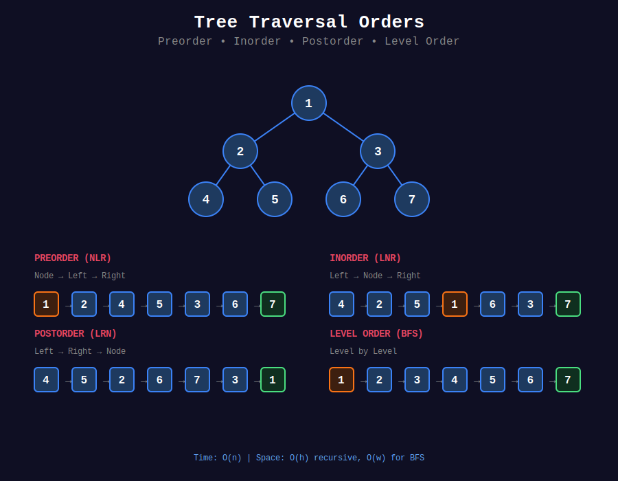

<div align="center">

# 🚶 Tree Traversal



<p>
  
  
</p>

</div>

---

## 🧭 Navigation

| ⬅️ Previous | 📂 Current | ➡️ Next |
|:------------|:----------:|--------:|
| [🏠 Trees Home](../README.md) | **01. Tree Traversal** | [02. Tree Construction →](../02_tree_construction/README.md) |

---

## 📐 Mathematical Foundations

### 1️⃣ Traversal Definitions

**Preorder (NLR):** Visit Node → Left subtree → Right subtree

```math
\text{preorder}(T) = [root] + \text{preorder}(T_L) + \text{preorder}(T_R)
```

**Inorder (LNR):** Left subtree → Visit Node → Right subtree

```math
\text{inorder}(T) = \text{inorder}(T_L) + [root] + \text{inorder}(T_R)
```

**Postorder (LRN):** Left subtree → Right subtree → Visit Node

```math
\text{postorder}(T) = \text{postorder}(T_L) + \text{postorder}(T_R) + [root]
```

**Level Order (BFS):** Level by level, left to right

---

### 2️⃣ Key Property

**Theorem:** Inorder traversal of BST gives sorted sequence.

**Proof:** By BST property:
- All nodes in left subtree < root
- All nodes in right subtree > root
- Inorder visits left → root → right
- Therefore: sorted order ∎

---

### 3️⃣ Time & Space Complexity

| Traversal | Time | Space (Recursive) | Space (Iterative) |
|-----------|:----:|:-----------------:|:-----------------:|
| Preorder | O(n) | O(h) | O(h) |
| Inorder | O(n) | O(h) | O(h) |
| Postorder | O(n) | O(h) | O(h) |
| Level Order | O(n) | - | O(w) |

Where $h$ = height, $w$ = max width.

---

### 4️⃣ Morris Traversal (O(1) Space)

**Key Insight:** Use empty right pointers as temporary links.

**Predecessor Threading:**

For node $x$, predecessor = rightmost node in left subtree.

```math
\text{pred}(x) = \max\{y \in T_L(x)\}
```

---

## 💻 Code Implementations

```python
class TreeNode:
    def __init__(self, val=0, left=None, right=None):
        self.val = val
        self.left = left
        self.right = right

def preorderTraversal(root: TreeNode) -> list[int]:
    """
    Preorder: Node → Left → Right
    
    Iterative with stack.
    
    Time: O(n), Space: O(h)
    """
    if not root:
        return []
    
    result = []
    stack = [root]
    
    while stack:
        node = stack.pop()
        result.append(node.val)
        
        # Push right first (so left is processed first)
        if node.right:
            stack.append(node.right)
        if node.left:
            stack.append(node.left)
    
    return result

def inorderTraversal(root: TreeNode) -> list[int]:
    """
    Inorder: Left → Node → Right
    
    Iterative: go left as far as possible, then process.
    
    Time: O(n), Space: O(h)
    """
    result = []
    stack = []
    current = root
    
    while current or stack:

        # Go left
        while current:
            stack.append(current)
            current = current.left
        
        # Process node
        current = stack.pop()
        result.append(current.val)
        
        # Go right
        current = current.right
    
    return result

def postorderTraversal(root: TreeNode) -> list[int]:
    """
    Postorder: Left → Right → Node
    
    Modified preorder (Node → Right → Left), then reverse.
    
    Time: O(n), Space: O(h)
    """
    if not root:
        return []
    
    result = []
    stack = [root]
    
    while stack:
        node = stack.pop()
        result.append(node.val)
        
        # Push left first (reverse of normal)
        if node.left:
            stack.append(node.left)
        if node.right:
            stack.append(node.right)
    
    return result[::-1]

def levelOrder(root: TreeNode) -> list[list[int]]:
    """
    Level Order: BFS, level by level.
    
    Track level size to separate levels.
    
    Time: O(n), Space: O(w)
    """
    if not root:
        return []
    
    from collections import deque
    
    result = []
    queue = deque([root])
    
    while queue:
        level_size = len(queue)
        level = []
        
        for _ in range(level_size):
            node = queue.popleft()
            level.append(node.val)
            
            if node.left:
                queue.append(node.left)
            if node.right:
                queue.append(node.right)
        
        result.append(level)
    
    return result

def morrisInorder(root: TreeNode) -> list[int]:
    """
    Morris Inorder Traversal - O(1) space.
    
    Use threading: predecessor's right points to current.
    
    Time: O(n), Space: O(1)
    """
    result = []
    current = root
    
    while current:
        if not current.left:
            result.append(current.val)
            current = current.right
        else:

            # Find predecessor
            predecessor = current.left
            while predecessor.right and predecessor.right != current:
                predecessor = predecessor.right
            
            if not predecessor.right:

                # Create thread
                predecessor.right = current
                current = current.left
            else:

                # Remove thread, process node
                predecessor.right = None
                result.append(current.val)
                current = current.right
    
    return result
```

---

## 🏆 LeetCode Problems

### 🟢 Easy

| # | Problem | Pattern | Time | Space |
|:-:|---------|---------|:----:|:-----:|
| 94 | [Binary Tree Inorder Traversal](https://leetcode.com/problems/binary-tree-inorder-traversal/) | Stack | O(n) | O(h) |
| 100 | [Same Tree](https://leetcode.com/problems/same-tree/) | DFS | O(n) | O(h) |
| 101 | [Symmetric Tree](https://leetcode.com/problems/symmetric-tree/) | DFS | O(n) | O(h) |
| 144 | [Preorder Traversal](https://leetcode.com/problems/binary-tree-preorder-traversal/) | Stack | O(n) | O(h) |
| 145 | [Postorder Traversal](https://leetcode.com/problems/binary-tree-postorder-traversal/) | Stack | O(n) | O(h) |
| 226 | [Invert Binary Tree](https://leetcode.com/problems/invert-binary-tree/) | DFS | O(n) | O(h) |
| 572 | [Subtree of Another Tree](https://leetcode.com/problems/subtree-of-another-tree/) | DFS | O(mn) | O(h) |
| 617 | [Merge Two Binary Trees](https://leetcode.com/problems/merge-two-binary-trees/) | DFS | O(n) | O(h) |

### 🟡 Medium

| # | Problem | Pattern | Time | Space |
|:-:|---------|---------|:----:|:-----:|
| 102 | [Level Order Traversal](https://leetcode.com/problems/binary-tree-level-order-traversal/) | BFS | O(n) | O(w) |
| 103 | [Zigzag Level Order](https://leetcode.com/problems/binary-tree-zigzag-level-order-traversal/) | BFS + Flag | O(n) | O(w) |
| 107 | [Level Order II (Bottom-up)](https://leetcode.com/problems/binary-tree-level-order-traversal-ii/) | BFS | O(n) | O(w) |
| 199 | [Right Side View](https://leetcode.com/problems/binary-tree-right-side-view/) | BFS/DFS | O(n) | O(h) |
| 314 | [Vertical Order Traversal](https://leetcode.com/problems/binary-tree-vertical-order-traversal/) | BFS + Column | O(n) | O(n) |
| 429 | [N-ary Tree Level Order](https://leetcode.com/problems/n-ary-tree-level-order-traversal/) | BFS | O(n) | O(w) |
| 987 | [Vertical Order Traversal](https://leetcode.com/problems/vertical-order-traversal-of-a-binary-tree/) | DFS + Sort | O(n log n) | O(n) |

---

---

## 🎨 Visual Algorithm Walkthrough

### Inorder Traversal (Iterative)

```
Tree:
      1
       \
        2
       /
      3

Inorder (Left → Node → Right): [1, 3, 2]

Step-by-step with stack:
current=1, stack=[]
  Go left: current=null, stack=[1]
  Pop 1, visit 1, go right
  current=2, stack=[]
  
  Go left: current=3, stack=[2]
  Go left: current=null, stack=[2, 3]
  Pop 3, visit 3, go right
  current=null, stack=[2]
  
  Pop 2, visit 2, go right
  current=null, stack=[]

Result: [1, 3, 2]
```

### Level Order Traversal

```
Tree:
       3
      / \
     9  20
       /  \
      15   7

Level 0: [3]
Level 1: [9, 20]
Level 2: [15, 7]

Queue processing:
queue = [3]
  Process 3, add children → queue = [9, 20]
  
level_size = 2
  Process 9 → queue = [20]
  Process 20, add children → queue = [15, 7]
  
level_size = 2
  Process 15 → queue = [7]
  Process 7 → queue = []

Result: [[3], [9, 20], [15, 7]]
```

### Morris Inorder (O(1) Space)

```
Tree:
      4
     / \
    2   6
   / \
  1   3

Threading process:
Current=4, has left
  Predecessor of 4 = 3 (rightmost in left subtree)
  Create thread: 3.right = 4
  Move to left: current=2

Current=2, has left
  Predecessor of 2 = 1
  Create thread: 1.right = 2
  Move to left: current=1

Current=1, no left
  Visit 1
  Follow thread: current=2

Current=2, has left
  Predecessor=1, thread exists
  Remove thread: 1.right = null
  Visit 2
  Move right: current=3

Current=3, no left
  Visit 3
  Follow thread: current=4

Current=4, has left
  Predecessor=3, thread exists
  Remove thread: 3.right = null
  Visit 4
  Move right: current=6

Current=6, no left
  Visit 6
  current=null

Result: [1, 2, 3, 4, 6]
```

---

## 📊 Traversal Selection

```
Need order?
     |
     +-- Sorted (BST) → Inorder
     |
     +-- Root first → Preorder
     |
     +-- Children first → Postorder
     |
     +-- Level by level → Level Order (BFS)
```

### When to Use Each Traversal

| Traversal | Use Case | Pattern |
|-----------|----------|---------|
| **Inorder** | BST sorted order, validation | Left → Node → Right |
| **Preorder** | Copy tree, serialize, prefix notation | Node → Left → Right |
| **Postorder** | Delete tree, calculate, postfix notation | Left → Right → Node |
| **Level Order** | Shortest path, level-by-level | BFS with queue |

---

## 💡 Pattern Recognition Guide

| Problem Keywords | Pattern | Example |
|-----------------|---------|---------|
| "sorted order from BST" | Inorder | #94 |
| "level by level" | BFS | #102, #103 |
| "serialize tree" | Preorder + nulls | #297 |
| "right side view" | Level last element | #199 |
| "zigzag order" | BFS with direction flag | #103 |
| "vertical order" | BFS with column tracking | #314 |
| "same tree" | Simultaneous DFS | #100 |
| "symmetric tree" | Mirror check | #101 |

---

## 📚 References & Learning Resources

### 📖 Core Concepts
| Resource | Topic | Link |
|----------|-------|------|
| **GeeksforGeeks** | Tree traversals | [Tutorial](https://www.geeksforgeeks.org/tree-traversals-inorder-preorder-and-postorder/) |
| **GeeksforGeeks** | Morris traversal | [Tutorial](https://www.geeksforgeeks.org/inorder-tree-traversal-without-recursion-and-without-stack/) |
| **Wikipedia** | Threaded binary tree | [Article](https://en.wikipedia.org/wiki/Threaded_binary_tree) |
| **CP Algorithms** | DFS and BFS | [Guide](https://cp-algorithms.com/graph/depth-first-search.html) |

### 📺 Video Tutorials
| Creator | Topic | Link |
|---------|-------|------|
| **NeetCode** | Inorder Traversal | [YouTube](https://www.youtube.com/watch?v=g_S5WuasWUE) |
| **NeetCode** | Level Order | [YouTube](https://www.youtube.com/watch?v=6ZnyEApgFYg) |
| **Abdul Bari** | Tree traversals | [YouTube](https://www.youtube.com/watch?v=qH6yxkw0u78) |
| **Back To Back SWE** | Morris traversal | [YouTube](https://www.youtube.com/watch?v=wGXB9OWhPTg) |

### 🎯 Practice Collections
| Platform | Focus | Link |
|----------|-------|------|
| **LeetCode** | Tree traversal tag | [Problems](https://leetcode.com/tag/tree/) |
| **HackerRank** | Tree challenges | [Practice](https://www.hackerrank.com/domains/data-structures?filters%5Bsubdomains%5D%5B%5D=trees) |

### 🔬 Advanced Topics
| Topic | Description | Link |
|-------|-------------|------|
| **Morris Traversal** | O(1) space inorder | [Detailed](https://www.geeksforgeeks.org/morris-traversal-for-preorder/) |
| **Iterative vs Recursive** | Stack simulation | [Tutorial](https://www.geeksforgeeks.org/iterative-preorder-traversal/) |
| **Threaded Trees** | Using null pointers | [Article](https://en.wikipedia.org/wiki/Threaded_binary_tree) |

### 📊 Visualization
| Tool | Purpose | Link |
|------|---------|------|
| **VisuAlgo** | Tree traversals | [Website](https://visualgo.net/en/bst) |
| **CS Animations** | Traversal animations | [Website](https://www.cs.usfca.edu/~galles/visualization/BST.html) |

---

## 💡 Pro Tips

> **🎯 Inorder = Sorted for BST:** Always remember this property. Key for BST validation!

> **⚡ BFS for Level Problems:** Use queue. Track level size before processing each level.

> **🔍 Morris = O(1) Space:** Create temporary threads using null pointers. Brilliant space optimization!

> **📊 Preorder for Serialization:** Node → Left → Right order. Easy to reconstruct tree!

> **🌊 Postorder for Deletion:** Delete children before parent. Natural bottom-up order!

---

## 🎖️ Practice Roadmap

**Week 1: Recursive Traversals**
1. Solve #94 (Inorder Traversal) - Recursive first
2. Solve #144 (Preorder Traversal) - Recursive
3. Solve #145 (Postorder Traversal) - Recursive
4. Solve #102 (Level Order) - BFS foundation

**Week 2: Iterative Traversals**
5. Solve #94 (Inorder) - Iterative with stack
6. Solve #144 (Preorder) - Iterative
7. Solve #145 (Postorder) - Iterative (harder!)
8. Solve #103 (Zigzag Level Order) - BFS with flag

**Week 3: Advanced**
9. Solve #199 (Right Side View) - Level last element
10. Solve #314 (Vertical Order) - Column tracking
11. Solve #100 (Same Tree) - Simultaneous traversal
12. Solve #101 (Symmetric Tree) - Mirror check
13. Learn Morris Traversal - O(1) space magic

---

## ❓ Interview Q&A

**Q: What's the difference between DFS and BFS on trees?**  
A: DFS goes deep (uses recursion/stack), BFS goes level by level (uses queue). BFS better for shortest path/level problems.

**Q: How to do iterative inorder?**  
A: Go left as far as possible (push to stack), pop and visit, then go right. Repeat!

**Q: When to use Morris traversal?**  
A: When O(1) space required and tree modification allowed (temporary). Interview follow-up question!

**Q: How to track levels in BFS?**  
A: Capture `size = len(queue)` before processing level. Process exactly `size` nodes for that level.

**Q: Preorder vs postorder - when to use?**  
A: Preorder for top-down (copy, serialize). Postorder for bottom-up (delete, calculate height).

---

## 🔥 Key Insights

- **Inorder BST = Sorted:** Most important property for BST problems
- **BFS = Level by Level:** Perfect for level-order, shortest path
- **Morris = O(1) Space:** Use null pointers as temporary threads
- **Iterative = Stack:** Simulate call stack explicitly
- **Three Orders, Three Uses:** Inorder (sorted), Preorder (copy), Postorder (delete)

---

<div align="center">

**Made with ❤️ for the coding community by [Gaurav Goswami](https://github.com/Gaurav14cs17)**

</div>

---

## 🧭 Navigation

| ⬅️ Previous | 📂 Current | ➡️ Next |
|:------------|:----------:|--------:|
| [🏠 Trees Home](../README.md) | **01. Tree Traversal** | [02. Tree Construction →](../02_tree_construction/README.md) |
