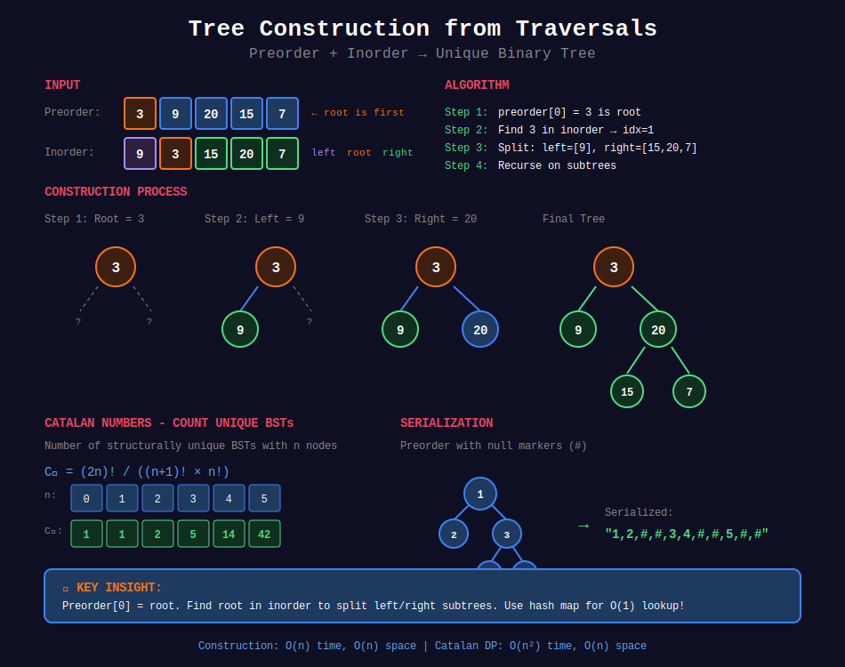

<div align="center">

# 🏗️ Tree Construction



<p>
  
  
</p>

</div>

---

## 🧭 Navigation

| ⬅️ Previous | 📂 Current | ➡️ Next |
|:------------|:----------:|--------:|
| [← 01. Tree Traversal](../01_tree_traversal/README.md) | **02. Tree Construction** | [03. Tree Properties →](../03_tree_properties/README.md) |

---

## 📐 Mathematical Foundations

### 1️⃣ Unique Binary Tree from Traversals

**Theorem:** A binary tree is uniquely determined by:

- Preorder + Inorder

- Postorder + Inorder

**Not unique:** Preorder + Postorder (without inorder)

---

### 2️⃣ Construction from Preorder + Inorder

**Key Insight:**

- Preorder[0] = root

- Find root in inorder → splits left and right subtrees

**Recurrence:**

```
preorder = [root] + preorder(left) + preorder(right)
inorder  = inorder(left) + [root] + inorder(right)

```

**Time:** O(n) with hash map for root lookup.

---

### 3️⃣ Construction from Postorder + Inorder

**Key Insight:**

- Postorder[-1] = root

- Find root in inorder → splits left and right subtrees

**Process right subtree before left** (postorder is LRN).

---

### 4️⃣ Catalan Number - BST Count

Number of structurally unique BSTs with $n$ nodes:

```math
\boxed{C_n = \frac{1}{n+1}\binom{2n}{n} = \frac{(2n)!}{(n+1)!n!}}

```

**Recurrence:**

```math
C_n = \sum_{i=0}^{n-1} C_i \cdot C_{n-1-i}

```

**Interpretation:** Choose root $i$, left subtree has $i$ nodes, right has $n-1-i$.

| n | 0 | 1 | 2 | 3 | 4 | 5 |
|:-:|:-:|:-:|:-:|:-:|:-:|:-:|
| $C\_n$ | 1 | 1 | 2 | 5 | 14 | 42 |

---

### 5️⃣ Serialization

**Preorder with Null Markers:**

```math
\text{serialize}(T) = \text{val} + \text{serialize}(T_L) + \text{serialize}(T_R)

```

Use "#" for null nodes.

**Example:**

```
     1
    / \
   2   3
      / \
     4   5

Serialized: "1,2,#,#,3,4,#,#,5,#,#"

```

---

## 💻 Code Implementations

```python
def buildTree(preorder: list[int], inorder: list[int]) -> TreeNode:
    """
    Construct tree from preorder and inorder.
    
    Preorder[0] = root
    Find root in inorder to split subtrees.
    
    Time: O(n), Space: O(n)
    """
    if not preorder:
        return None
    
    # Build index map for O(1) lookup
    inorder_map = {val: i for i, val in enumerate(inorder)}
    
    def build(pre_start, pre_end, in_start, in_end):
        if pre_start > pre_end:
            return None
        
        root_val = preorder[pre_start]
        root = TreeNode(root_val)
        
        # Find root position in inorder
        root_idx = inorder_map[root_val]
        left_size = root_idx - in_start
        
        # Build subtrees
        root.left = build(pre_start + 1, pre_start + left_size,
                          in_start, root_idx - 1)
        root.right = build(pre_start + left_size + 1, pre_end,
                           root_idx + 1, in_end)
        
        return root
    
    return build(0, len(preorder) - 1, 0, len(inorder) - 1)

def buildTreePost(inorder: list[int], postorder: list[int]) -> TreeNode:
    """
    Construct tree from inorder and postorder.
    
    Postorder[-1] = root
    Process right subtree before left.
    
    Time: O(n), Space: O(n)
    """
    if not postorder:
        return None
    
    inorder_map = {val: i for i, val in enumerate(inorder)}
    post_idx = [len(postorder) - 1]  # Use list for mutable reference
    
    def build(in_start, in_end):
        if in_start > in_end:
            return None
        
        root_val = postorder[post_idx[0]]
        post_idx[0] -= 1
        root = TreeNode(root_val)
        
        root_idx = inorder_map[root_val]
        
        # Build right first (postorder processes right before left)
        root.right = build(root_idx + 1, in_end)
        root.left = build(in_start, root_idx - 1)
        
        return root
    
    return build(0, len(inorder) - 1)

def numTrees(n: int) -> int:
    """
    Count structurally unique BSTs (Catalan number).
    
    C[n] = Σ C[i] × C[n-1-i] for i in [0, n-1]
    
    Time: O(n²), Space: O(n)
    """
    dp = [0] * (n + 1)
    dp[0] = dp[1] = 1
    
    for nodes in range(2, n + 1):
        for root in range(nodes):
            left_trees = dp[root]
            right_trees = dp[nodes - 1 - root]
            dp[nodes] += left_trees * right_trees
    
    return dp[n]

def generateTrees(n: int) -> list[TreeNode]:
    """
    Generate all structurally unique BSTs.
    
    Time: O(4ⁿ/√n), Space: O(4ⁿ/√n)
    """
    if n == 0:
        return []
    
    def generate(start, end):
        if start > end:
            return [None]
        
        trees = []
        for root_val in range(start, end + 1):
            left_trees = generate(start, root_val - 1)
            right_trees = generate(root_val + 1, end)
            
            for left in left_trees:
                for right in right_trees:
                    root = TreeNode(root_val)
                    root.left = left
                    root.right = right
                    trees.append(root)
        
        return trees
    
    return generate(1, n)

class Codec:
    """
    Serialize and Deserialize Binary Tree.
    
    Preorder with null markers.
    """
    def serialize(self, root: TreeNode) -> str:
        """Encodes a tree to a single string."""
        result = []
        
        def preorder(node):
            if not node:
                result.append("#")
                return
            result.append(str(node.val))
            preorder(node.left)
            preorder(node.right)
        
        preorder(root)
        return ",".join(result)
    
    def deserialize(self, data: str) -> TreeNode:
        """Decodes your encoded data to tree."""
        values = iter(data.split(","))
        
        def build():
            val = next(values)
            if val == "#":
                return None
            node = TreeNode(int(val))
            node.left = build()
            node.right = build()
            return node
        
        return build()

```

---

## 🏆 LeetCode Problems

### 🟡 Medium

| # | Problem | Pattern | Time | Space |
|:-:|---------|---------|:----:|:-----:|
| 95 | [Unique Binary Search Trees II](https://leetcode.com/problems/unique-binary-search-trees-ii/) | Generate All | O(Cₙ) | O(Cₙ) |
| 96 | [Unique Binary Search Trees](https://leetcode.com/problems/unique-binary-search-trees/) | Catalan DP | O(n²) | O(n) |
| 105 | [Construct from Preorder & Inorder](https://leetcode.com/problems/construct-binary-tree-from-preorder-and-inorder-traversal/) | Divide & Conquer | O(n) | O(n) |
| 106 | [Construct from Inorder & Postorder](https://leetcode.com/problems/construct-binary-tree-from-inorder-and-postorder-traversal/) | Divide & Conquer | O(n) | O(n) |
| 108 | [Convert Sorted Array to BST](https://leetcode.com/problems/convert-sorted-array-to-binary-search-tree/) | Binary Split | O(n) | O(log n) |
| 109 | [Convert Sorted List to BST](https://leetcode.com/problems/convert-sorted-list-to-binary-search-tree/) | Inorder Simulation | O(n) | O(log n) |
| 889 | [Construct from Preorder & Postorder](https://leetcode.com/problems/construct-binary-tree-from-preorder-and-postorder-traversal/) | Divide & Conquer | O(n) | O(n) |
| 1008 | [Construct BST from Preorder](https://leetcode.com/problems/construct-binary-search-tree-from-preorder-traversal/) | Bound Tracking | O(n) | O(n) |

### 🔴 Hard

| # | Problem | Pattern | Time | Space |
|:-:|---------|---------|:----:|:-----:|
| 297 | [Serialize and Deserialize](https://leetcode.com/problems/serialize-and-deserialize-binary-tree/) | Preorder + Null | O(n) | O(n) |

---

---

## 🎨 Visual Algorithm Walkthrough

### Construct from Preorder + Inorder (#105)

```
Preorder: [3, 9, 20, 15, 7]
Inorder:  [9, 3, 15, 20, 7]

Step 1: Preorder[0] = 3 is root
Find 3 in inorder → index 1

Inorder splits:
Left subtree:  [9]       (index 0-0)
Right subtree: [15,20,7] (index 2-4)

      3
     / \
    ?   ?

Step 2: Build left subtree
Preorder: [9]
Inorder:  [9]
Root = 9 (leaf)

      3
     / \
    9   ?

Step 3: Build right subtree
Preorder: [20, 15, 7]
Inorder:  [15, 20, 7]
Root = 20, find in inorder → index 1

      3
     / \
    9  20
      /  \
     ?    ?

Step 4: Build 20's children
Left:  preorder=[15], inorder=[15] → 15
Right: preorder=[7],  inorder=[7]  → 7

Final tree:
      3
     / \
    9  20
      /  \
     15   7

```

### Catalan Number - Count Unique BSTs (#96)

```
n = 3, find C₃

For each i as root (0 ≤ i < n):
  Left subtree: i nodes → Cᵢ ways
  Right subtree: (n-1-i) nodes → Cₙ₋₁₋ᵢ ways
  Total: Cᵢ × Cₙ₋₁₋ᵢ

C₃ = C₀×C₂ + C₁×C₁ + C₂×C₀
   = 1×2 + 1×1 + 2×1
   = 2 + 1 + 2
   = 5

5 unique structures:
1.  1         2.    1        3.    2        4.    3        5.    3
     \             \            /  \            /              /
      2             3          1    3          1             2
       \           /                          /               /
        3         2                          2               1

```

### Serialize/Deserialize (#297)

```
Original tree:
      1
     / \
    2   3
       / \
      4   5

Preorder serialization with # for null:
[1, 2, #, #, 3, 4, #, #, 5, #, #]

Deserialization (consume one by one):
val=1 → create node(1)
  left = deserialize()
    val=2 → create node(2)
      left = deserialize()
        val=# → null
      right = deserialize()
        val=# → null
    return node(2)
  right = deserialize()
    val=3 → create node(3)
      left = deserialize()
        val=4 → create node(4)
          left = # → null
          right = # → null
        return node(4)
      right = deserialize()
        val=5 → create node(5)
          left = # → null
          right = # → null
        return node(5)
    return node(3)
return node(1)

```

---

## 💡 Pattern Recognition Guide

| Problem Keywords | Pattern | Example |
|-----------------|---------|---------|
| "construct from preorder + inorder" | Divide & conquer | #105 |
| "construct from inorder + postorder" | Divide & conquer | #106 |
| "count unique BSTs" | Catalan DP | #96 |
| "generate all BSTs" | Recursion | #95 |
| "serialize tree" | Preorder + markers | #297 |
| "sorted array to BST" | Binary split | #108 |
| "construct BST from preorder" | Bound tracking | #1008 |

---

## 📚 References & Learning Resources

### 📖 Core Concepts

| Resource | Topic | Link |
|----------|-------|------|
| **GeeksforGeeks** | Construct from traversals | [Tutorial](https://www.geeksforgeeks.org/construct-tree-from-given-inorder-and-preorder-traversal/) |
| **GeeksforGeeks** | Catalan numbers | [Tutorial](https://www.geeksforgeeks.org/program-nth-catalan-number/) |
| **Wikipedia** | Catalan numbers | [Article](https://en.wikipedia.org/wiki/Catalan_number) |
| **CP Algorithms** | Tree construction | [Guide](https://cp-algorithms.com/) |

### 📺 Video Tutorials

| Creator | Topic | Link |
|---------|-------|------|
| **NeetCode** | Construct from Pre+In | [YouTube](https://www.youtube.com/watch?v=ihj4IQGZ2zc) |
| **NeetCode** | Serialize/Deserialize | [YouTube](https://www.youtube.com/watch?v=u4JAi2JJhI8) |
| **Back To Back SWE** | Tree construction | [YouTube](https://www.youtube.com/watch?v=GeltTz3Z1rw) |
| **Abdul Bari** | Catalan numbers | [YouTube](https://www.youtube.com/watch?v=CMaZ69P1bAc) |

### 🎯 Practice Collections

| Platform | Focus | Link |
|----------|-------|------|
| **LeetCode** | Tree construction tag | [Problems](https://leetcode.com/tag/tree/) |
| **HackerRank** | Tree building | [Practice](https://www.hackerrank.com/domains/data-structures?filters%5Bsubdomains%5D%5B%5D=trees) |

### 🔬 Advanced Topics

| Topic | Description | Link |
|-------|-------------|------|
| **Catalan Applications** | Various uses | [Tutorial](https://www.geeksforgeeks.org/applications-of-catalan-numbers/) |
| **Tree Isomorphism** | Checking structural equality | [Article](https://www.geeksforgeeks.org/tree-isomorphism-problem/) |
| **Cartesian Tree** | Special construction | [Wikipedia](https://en.wikipedia.org/wiki/Cartesian_tree) |

### 📊 Visualization

| Tool | Purpose | Link |
|------|---------|------|
| **VisuAlgo** | Tree construction | [Website](https://visualgo.net/en/bst) |
| **CS Animations** | Build tree animations | [Website](https://www.cs.usfca.edu/~galles/visualization/BST.html) |

### 📐 Mathematical Background

| Topic | Description | Link |
|-------|-------------|------|
| **Catalan Formula** | \( C_n = \frac{1}{n+1}\binom{2n}{n} \) | [OEIS](https://oeis.org/A000108) |
| **Catalan Recurrence** | \( C_n = \sum_{i=0}^{n-1} C_i C_{n-1-i} \) | [Proof](https://en.wikipedia.org/wiki/Catalan_number#Second_proof) |

---

## 💡 Pro Tips

> **🎯 Hash Map for O(1) Lookup:** Store inorder indices in hash map. Avoid O(n) search for root position!

> **⚡ Preorder[0] = Root:** First element in preorder is always root. Use it to split inorder!

> **🔍 Catalan DP:** \( C_n = \sum C_i \times C_{n-1-i} \). For each root choice, multiply left × right subtree counts!

> **📊 Serialization Needs Nulls:** Must include null markers to uniquely represent tree. Without nulls, ambiguous!

> **🌊 Postorder Build Right First:** Postorder is LRN, so process from right when building tree!

---

## 🎖️ Practice Roadmap

**Week 1: Fundamentals**
1. Solve #105 (Construct from Pre+In) - Master the pattern
2. Solve #106 (Construct from In+Post) - Similar approach
3. Solve #108 (Sorted Array to BST) - Binary split

**Week 2: Advanced Construction**
4. Solve #96 (Unique BSTs Count) - Catalan DP
5. Solve #95 (Generate All BSTs) - Recursion
6. Solve #1008 (BST from Preorder) - Bound tracking
7. Solve #889 (Pre+Post construction) - Tricky!

**Week 3: Serialization**
8. Solve #297 (Serialize/Deserialize) - Encoding
9. Solve #449 (Serialize/Deserialize BST) - Optimized
10. Solve #109 (Sorted List to BST) - Inorder simulation

---

## ❓ Interview Q&A

**Q: Why do we need inorder for unique construction?**  
A: Inorder splits left and right subtrees. Preorder/postorder alone can't distinguish between different tree structures!

**Q: How to find root in inorder efficiently?**  
A: Build hash map `{value: index}` in O(n). Then root lookup is O(1) instead of O(n)!

**Q: What's the time complexity of construction?**  
A: O(n) with hash map. Each node processed once, root lookup O(1).

**Q: Why is counting unique BSTs a Catalan number?**  
A: For each root choice, multiply ways to build left and right subtrees. This gives Catalan recurrence!

**Q: How to serialize tree without nulls?**  
A: Can't for general binary tree! BST can use preorder only (BST property helps). Otherwise need null markers.

---

## 🔥 Key Insights

- **Unique Construction:** Need inorder + (preorder OR postorder)

- **Root Identification:** First in preorder, last in postorder

- **Hash Map Optimization:** O(1) root lookup instead of O(n)

- **Catalan Numbers:** Count of unique BSTs follows Catalan sequence

- **Serialization:** Preorder with null markers for unique encoding

---

<div align="center">

**Made with ❤️ for the coding community by [Gaurav Goswami](https://github.com/Gaurav14cs17)**

</div>

---

## 🧭 Navigation

| ⬅️ Previous | 📂 Current | ➡️ Next |
|:------------|:----------:|--------:|
| [← 01. Tree Traversal](../01_tree_traversal/README.md) | **02. Tree Construction** | [03. Tree Properties →](../03_tree_properties/README.md) |
