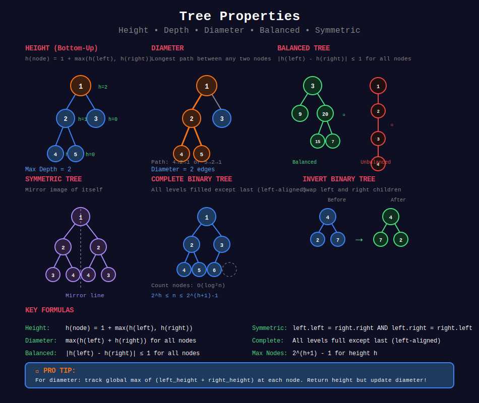

<div align="center">

# 📏 Tree Properties



<p>
  
  
</p>

</div>

---

## 🧭 Navigation

| ⬅️ Previous | 📂 Current | ➡️ Next |
|:------------|:----------:|--------:|
| [← 02. Tree Construction](../02_tree_construction/README.md) | **03. Tree Properties** | [04. Path Problems →](../04_path_problems/README.md) |

---

## 📐 Mathematical Foundations

### 1️⃣ Tree Height

**Definition:** Longest path from root to any leaf.

```math
h(node) = \begin{cases}
0 & \text{if node is null} \\
1 + \max(h(left), h(right)) & \text{otherwise}
\end{cases}

```

---

### 2️⃣ Maximum Depth vs Minimum Depth

**Max Depth:** Longest root-to-leaf path.

```math
\text{maxDepth} = h(root)

```

**Min Depth:** Shortest root-to-leaf path.

```math
\text{minDepth}(node) = \begin{cases}
0 & \text{if null} \\
1 + \text{minDepth}(child) & \text{if one child null} \\
1 + \min(\text{minDepth}(left), \text{minDepth}(right)) & \text{otherwise}
\end{cases}

```

---

### 3️⃣ Balanced Tree

**Definition:** Height difference of subtrees ≤ 1 for all nodes.

```math

|h(left) - h(right)| \leq 1 \quad \forall \text{nodes}

```

**AVL Property:** Self-balancing BST maintains this.

---

### 4️⃣ Diameter

**Definition:** Longest path between any two nodes.

```math
\text{diameter} = \max_{v \in T} (h(v.left) + h(v.right))

```

**Key Insight:** Diameter passes through some node as the highest point.

---

### 5️⃣ Symmetric Tree

**Definition:** Mirror image of itself.

```math
\text{symmetric}(T) \iff \text{mirror}(T_L, T_R)

```

Where:

```math
\text{mirror}(A, B) = (A.val = B.val) \land \text{mirror}(A_L, B_R) \land \text{mirror}(A_R, B_L)

```

---

### 6️⃣ Complete Binary Tree

**Definition:** All levels filled except possibly last, which is left-aligned.

**Node Count Range:**

```math
2^h \leq n \leq 2^{h+1} - 1

```

**Counting Nodes:** Use binary search on last level.

```math
\text{Time: } O(\log^2 n)

```

---

## 💻 Code Implementations

```python
def maxDepth(root: TreeNode) -> int:
    """
    Maximum depth (height) of binary tree.
    
    h(node) = 1 + max(h(left), h(right))
    
    Time: O(n), Space: O(h)
    """
    if not root:
        return 0
    return 1 + max(maxDepth(root.left), maxDepth(root.right))

def minDepth(root: TreeNode) -> int:
    """
    Minimum depth (shortest root-to-leaf path).
    
    Use BFS for efficiency (stops at first leaf).
    
    Time: O(n), Space: O(w)
    """
    if not root:
        return 0
    
    from collections import deque
    queue = deque([(root, 1)])
    
    while queue:
        node, depth = queue.popleft()
        
        # First leaf found
        if not node.left and not node.right:
            return depth
        
        if node.left:
            queue.append((node.left, depth + 1))
        if node.right:
            queue.append((node.right, depth + 1))
    
    return 0

def isBalanced(root: TreeNode) -> bool:
    """
    Check if tree is height-balanced.
    
    |h(left) - h(right)| ≤ 1 for all nodes.
    Return -1 if unbalanced (early termination).
    
    Time: O(n), Space: O(h)
    """
    def height(node):
        if not node:
            return 0
        
        left_h = height(node.left)
        if left_h == -1:
            return -1
        
        right_h = height(node.right)
        if right_h == -1:
            return -1
        
        if abs(left_h - right_h) > 1:
            return -1
        
        return 1 + max(left_h, right_h)
    
    return height(root) != -1

def diameterOfBinaryTree(root: TreeNode) -> int:
    """
    Diameter: longest path between any two nodes.
    
    diameter = max(h(left) + h(right)) for all nodes.
    
    Time: O(n), Space: O(h)
    """
    diameter = [0]
    
    def height(node):
        if not node:
            return 0
        
        left_h = height(node.left)
        right_h = height(node.right)
        
        # Update diameter (path through this node)
        diameter[0] = max(diameter[0], left_h + right_h)
        
        return 1 + max(left_h, right_h)
    
    height(root)
    return diameter[0]

def isSymmetric(root: TreeNode) -> bool:
    """
    Check if tree is symmetric (mirror of itself).
    
    Time: O(n), Space: O(h)
    """
    def isMirror(left, right):
        if not left and not right:
            return True
        if not left or not right:
            return False
        return (left.val == right.val and
                isMirror(left.left, right.right) and
                isMirror(left.right, right.left))
    
    return isMirror(root, root)

def countNodes(root: TreeNode) -> int:
    """
    Count nodes in complete binary tree.
    
    Use binary search on last level.
    
    Time: O(log²n), Space: O(1)
    """
    if not root:
        return 0
    
    def get_depth(node):
        depth = 0
        while node.left:
            node = node.left
            depth += 1
        return depth
    
    def exists(idx, depth, node):
        left, right = 0, 2**depth - 1
        for _ in range(depth):
            mid = (left + right) // 2
            if idx <= mid:
                node = node.left
                right = mid
            else:
                node = node.right
                left = mid + 1
        return node is not None
    
    depth = get_depth(root)
    if depth == 0:
        return 1
    
    # Binary search on last level
    left, right = 0, 2**depth - 1
    while left <= right:
        mid = (left + right) // 2
        if exists(mid, depth, root):
            left = mid + 1
        else:
            right = mid - 1
    
    return 2**depth - 1 + left

```

---

## 🏆 LeetCode Problems

### 🟢 Easy

| # | Problem | Pattern | Time | Space |
|:-:|---------|---------|:----:|:-----:|
| 100 | [Same Tree](https://leetcode.com/problems/same-tree/) | DFS Compare | O(n) | O(h) |
| 101 | [Symmetric Tree](https://leetcode.com/problems/symmetric-tree/) | Mirror Check | O(n) | O(h) |
| 104 | [Maximum Depth](https://leetcode.com/problems/maximum-depth-of-binary-tree/) | DFS | O(n) | O(h) |
| 110 | [Balanced Binary Tree](https://leetcode.com/problems/balanced-binary-tree/) | Height Check | O(n) | O(h) |
| 111 | [Minimum Depth](https://leetcode.com/problems/minimum-depth-of-binary-tree/) | BFS | O(n) | O(w) |
| 226 | [Invert Binary Tree](https://leetcode.com/problems/invert-binary-tree/) | DFS Swap | O(n) | O(h) |
| 543 | [Diameter of Binary Tree](https://leetcode.com/problems/diameter-of-binary-tree/) | Height + Track | O(n) | O(h) |
| 572 | [Subtree of Another Tree](https://leetcode.com/problems/subtree-of-another-tree/) | DFS Match | O(mn) | O(h) |

### 🟡 Medium

| # | Problem | Pattern | Time | Space |
|:-:|---------|---------|:----:|:-----:|
| 222 | [Count Complete Tree Nodes](https://leetcode.com/problems/count-complete-tree-nodes/) | Binary Search | O(log²n) | O(1) |
| 958 | [Check Completeness](https://leetcode.com/problems/check-completeness-of-a-binary-tree/) | BFS | O(n) | O(w) |

---

---

## 🎨 Visual Algorithm Walkthrough

### Diameter of Binary Tree (#543)

```
Tree:
      1
     / \
    2   3
   / \
  4   5

Diameter = longest path between any two nodes

For each node, calculate:
  path_through_node = height(left) + height(right)

Node 1:
  height(left=2) = 2
  height(right=3) = 0
  diameter through 1 = 2 + 0 = 2

Node 2:
  height(left=4) = 0
  height(right=5) = 0
  diameter through 2 = 0 + 0 = 0

Node 3: diameter = 0
Node 4: diameter = 0
Node 5: diameter = 0

Global maximum diameter = 2
Path: 4 → 2 → 1 (length 2 edges)

```

### Balanced Binary Tree (#110)

```
Tree:
      3
     / \
    9  20
      /  \
     15   7

Check balance (bottom-up):

Node 9: height = 0, balanced ✓
Node 15: height = 0, balanced ✓
Node 7: height = 0, balanced ✓

Node 20:
  left_height = 0 (15)
  right_height = 0 (7)
  diff = |0-0| = 0 ≤ 1 ✓
  height = 1

Node 3:
  left_height = 0 (9)
  right_height = 1 (20)
  diff = |0-1| = 1 ≤ 1 ✓
  height = 2

Result: Balanced ✓

```

### Symmetric Tree (#101)

```
Tree:
      1
     / \
    2   2
   / \ / \
  3  4 4  3

Check mirror symmetry:

Level 1: Compare left(2) vs right(2) ✓

Level 2:
  Compare left.left(3) vs right.right(3) ✓
  Compare left.right(4) vs right.left(4) ✓

All nodes match in mirror positions → Symmetric ✓

Non-symmetric example:
      1
     / \
    2   2
     \   \
      3   3

left.right(3) vs right.right(3) ✗
Not mirror positions → Not symmetric

```

### Count Complete Tree Nodes (#222)

```
Complete tree (all levels full except last):
        1
       / \
      2   3
     / \ /
    4  5 6

Height = 2 (leftmost path)
Last level can have 1 to 4 nodes (2² positions)

Binary search on last level:
Check if position exists by path encoding:
  Position 0 (00): L,L → node 4 exists ✓
  Position 1 (01): L,R → node 5 exists ✓
  Position 2 (10): R,L → node 6 exists ✓
  Position 3 (11): R,R → doesn't exist ✗

Nodes in complete levels: 2^h - 1 = 3
Nodes in last level: 3
Total: 3 + 3 = 6

Time: O(log²n) - O(log n) binary search × O(log n) path check

```

---

## 💡 Pattern Recognition Guide

| Problem Keywords | Pattern | Example |
|-----------------|---------|---------|
| "height/depth of tree" | Recursive max | #104 |
| "minimum depth" | BFS early stop | #111 |
| "balanced tree" | Height diff check | #110 |
| "diameter" | Global max tracking | #543 |
| "symmetric/mirror" | Dual recursion | #101 |
| "same tree" | Simultaneous DFS | #100 |
| "invert tree" | Swap children | #226 |
| "complete tree count" | Binary search | #222 |

---

## 📚 References & Learning Resources

### 📖 Core Concepts

| Resource | Topic | Link |
|----------|-------|------|
| **GeeksforGeeks** | Tree height | [Tutorial](https://www.geeksforgeeks.org/write-a-c-program-to-find-the-maximum-depth-or-height-of-a-tree/) |
| **GeeksforGeeks** | Diameter of tree | [Tutorial](https://www.geeksforgeeks.org/diameter-of-a-binary-tree/) |
| **Wikipedia** | AVL tree (balanced) | [Article](https://en.wikipedia.org/wiki/AVL_tree) |
| **GeeksforGeeks** | Symmetric tree | [Tutorial](https://www.geeksforgeeks.org/symmetric-tree-tree-which-is-mirror-image-of-itself/) |

### 📺 Video Tutorials

| Creator | Topic | Link |
|---------|-------|------|
| **NeetCode** | Diameter of Tree | [YouTube](https://www.youtube.com/watch?v=bkxqA8Rfv04) |
| **NeetCode** | Balanced Tree | [YouTube](https://www.youtube.com/watch?v=QfJsau0ItOY) |
| **NeetCode** | Symmetric Tree | [YouTube](https://www.youtube.com/watch?v=Mao9uzxwvmc) |
| **Back To Back SWE** | Tree properties | [YouTube](https://www.youtube.com/watch?v=H5JubkIy_p8) |

### 🎯 Practice Collections

| Platform | Focus | Link |
|----------|-------|------|
| **LeetCode** | Tree tag | [Problems](https://leetcode.com/tag/tree/) |
| **HackerRank** | Tree challenges | [Practice](https://www.hackerrank.com/domains/data-structures?filters%5Bsubdomains%5D%5B%5D=trees) |

### 🔬 Advanced Topics

| Topic | Description | Link |
|-------|-------------|------|
| **AVL Trees** | Self-balancing BST | [Tutorial](https://www.geeksforgeeks.org/avl-tree-set-1-insertion/) |
| **Red-Black Trees** | Another balanced tree | [Wikipedia](https://en.wikipedia.org/wiki/Red%E2%80%93black_tree) |
| **Complete vs Perfect** | Tree type differences | [Article](https://www.geeksforgeeks.org/complete-binary-tree/) |

### 📊 Visualization

| Tool | Purpose | Link |
|------|---------|------|
| **VisuAlgo** | Tree properties | [Website](https://visualgo.net/en/bst) |
| **CS Animations** | Balance checking | [Website](https://www.cs.usfca.edu/~galles/visualization/AVLtree.html) |

---

## 💡 Pro Tips

> **🎯 Height = 1 + max(left, right):** Classic recursive formula. Base case: null = 0!

> **⚡ Diameter ≠ Height:** Diameter passes through some node. Track global max of `h(left) + h(right)` for all nodes!

> **🔍 Balanced Check:** Return -1 for unbalanced, height otherwise. Single pass optimization!

> **📊 Min Depth = BFS:** Stop at first leaf! DFS would check all paths unnecessarily.

> **🌊 Symmetric = Mirror:** Compare left.left with right.right, and left.right with right.left!

---

## 🎖️ Practice Roadmap

**Week 1: Basic Properties**
1. Solve #104 (Max Depth) - Basic recursion
2. Solve #111 (Min Depth) - BFS approach
3. Solve #543 (Diameter) - Global max pattern
4. Solve #110 (Balanced Tree) - Height difference

**Week 2: Comparison Properties**
5. Solve #100 (Same Tree) - Simultaneous DFS
6. Solve #101 (Symmetric Tree) - Mirror check
7. Solve #226 (Invert Tree) - Swap children
8. Solve #572 (Subtree) - Nested comparison

**Week 3: Advanced**
9. Solve #222 (Count Complete Nodes) - Binary search
10. Solve #958 (Check Completeness) - BFS validation

---

## ❓ Interview Q&A

**Q: What's the difference between height and depth?**  
A: Height = distance to farthest leaf (bottom-up). Depth = distance from root (top-down). Leaf has height 0, depth = max depth.

**Q: How to calculate diameter efficiently?**  
A: Single DFS! For each node, calculate `h(left) + h(right)` and track global max. Don't calculate height separately!

**Q: Why use BFS for minimum depth?**  
A: BFS stops at first leaf (shortest path). DFS must check all paths to be sure.

**Q: How to check balanced in one pass?**  
A: Return height if balanced, -1 if not. Check `|left_h - right_h| ≤ 1` at each node.

**Q: Why is counting complete tree nodes O(log²n)?**  
A: Binary search on last level positions (log n). Each check follows path (log n). Total: log n × log n.

---

## 🔥 Key Insights

- **Height Formula:** \( h(node) = 1 + \max(h(left), h(right)) \)

- **Diameter Pattern:** Track global max of \( h(left) + h(right) \)

- **Balanced Check:** \( |h(left) - h(right)| \leq 1 \) for ALL nodes

- **Symmetric = Mirror:** Compare nodes in mirror positions

- **Complete Tree:** All levels full except last (left-aligned)

---

<div align="center">

**Made with ❤️ for the coding community by [Gaurav Goswami](https://github.com/Gaurav14cs17)**

</div>

---

## 🧭 Navigation

| ⬅️ Previous | 📂 Current | ➡️ Next |
|:------------|:----------:|--------:|
| [← 02. Tree Construction](../02_tree_construction/README.md) | **03. Tree Properties** | [04. Path Problems →](../04_path_problems/README.md) |
