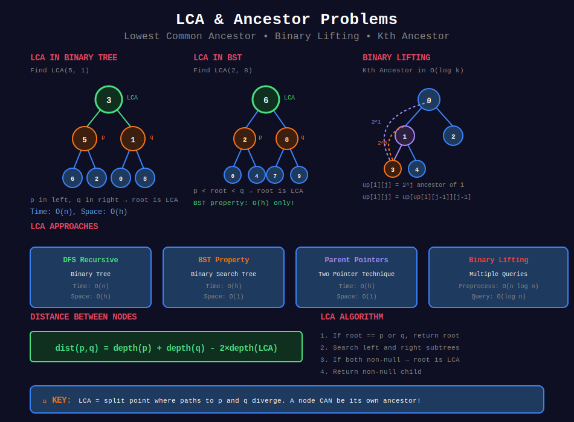

<div align="center">

# 👴 LCA & Ancestor Problems



<p>
  
  
</p>

</div>

---

## 🧭 Navigation

| ⬅️ Previous | 📂 Current | ➡️ Next Topic |
|:------------|:----------:|--------:|
| [← 04. Path Problems](../04_path_problems/README.md) | **05. LCA & Ancestor** | [🏠 Trees Home](../README.md) → [BST](../../08_binary_search_trees/README.md) |

---

## 📐 Mathematical Foundations

### 1️⃣ LCA Definition

**Lowest Common Ancestor of nodes p and q:**

```math
\text{LCA}(p, q) = \text{deepest node that is ancestor of both } p \text{ and } q

```

**Properties:**
- $\text{LCA}(p, p) = p$

- $\text{LCA}(p, q) = \text{LCA}(q, p)$

- If $p$ is ancestor of $q$, then $\text{LCA}(p, q) = p$

---

### 2️⃣ LCA Recursive Formula

```math
\text{LCA}(root, p, q) = \begin{cases}
root & \text{if } root = p \text{ or } root = q \\
root & \text{if } p \in T_L \text{ and } q \in T_R \\
\text{LCA}(root.left, p, q) & \text{if } p, q \in T_L \\
\text{LCA}(root.right, p, q) & \text{if } p, q \in T_R
\end{cases}

```

---

### 3️⃣ LCA in BST

**Using BST property:**

```math
\text{LCA}_{BST}(root, p, q) = \begin{cases}
root & \text{if } p.val \leq root.val \leq q.val \\
\text{LCA}(root.left, p, q) & \text{if } p.val, q.val < root.val \\
\text{LCA}(root.right, p, q) & \text{if } p.val, q.val > root.val
\end{cases}

```

**Time:** O(h) instead of O(n).

---

### 4️⃣ Distance Between Nodes

```math
\text{dist}(p, q) = \text{dist}(root, p) + \text{dist}(root, q) - 2 \times \text{dist}(root, \text{LCA}(p, q))

```

---

### 5️⃣ Binary Lifting (for multiple queries)

**Precompute ancestors at powers of 2:**

```math
\text{ancestor}[i][j] = \text{ancestor}[\text{ancestor}[i][j-1]][j-1]

```

Where $\text{ancestor}[i][j]$ = $2^j$-th ancestor of node $i$.

**Query:** O(log n) per query after O(n log n) preprocessing.

---

### 6️⃣ Kth Ancestor

**Using binary representation of k:**

```math
k = \sum_{i} b_i \cdot 2^i

```

Jump using precomputed $2^i$-th ancestors.

---

## 💻 Code Implementations

```python
def lowestCommonAncestor(root: TreeNode, p: TreeNode, q: TreeNode) -> TreeNode:
    """
    LCA in binary tree.
    
    If both p and q found in different subtrees, root is LCA.
    Otherwise, LCA is in the subtree where both are found.
    
    Time: O(n), Space: O(h)
    """
    if not root or root == p or root == q:
        return root
    
    left = lowestCommonAncestor(root.left, p, q)
    right = lowestCommonAncestor(root.right, p, q)
    
    if left and right:
        return root  # p and q are in different subtrees
    
    return left if left else right

def lowestCommonAncestorBST(root: TreeNode, p: TreeNode, q: TreeNode) -> TreeNode:
    """
    LCA in BST (use BST property for efficiency).
    
    Time: O(h), Space: O(1) iterative
    """
    while root:
        if p.val < root.val and q.val < root.val:
            root = root.left
        elif p.val > root.val and q.val > root.val:
            root = root.right
        else:
            return root
    return None

def lowestCommonAncestorWithParent(p: 'Node', q: 'Node') -> 'Node':
    """
    LCA when nodes have parent pointers.
    
    Find depths, bring to same level, move up together.
    
    Time: O(h), Space: O(1)
    """
    def get_depth(node):
        depth = 0
        while node:
            node = node.parent
            depth += 1
        return depth
    
    depth_p = get_depth(p)
    depth_q = get_depth(q)
    
    # Bring to same level
    while depth_p > depth_q:
        p = p.parent
        depth_p -= 1
    while depth_q > depth_p:
        q = q.parent
        depth_q -= 1
    
    # Move up together
    while p != q:
        p = p.parent
        q = q.parent
    
    return p

def getKthAncestor(node: TreeNode, k: int) -> TreeNode:
    """
    Find kth ancestor (simple version without binary lifting).
    
    Time: O(k), Space: O(1)
    """
    current = node
    for _ in range(k):
        if not current:
            return None
        current = current.parent
    return current

class TreeAncestor:
    """
    Binary Lifting for kth ancestor queries.
    
    Preprocessing: O(n log n)
    Query: O(log n)
    """
    def __init__(self, n: int, parent: list[int]):
        self.LOG = 20  # Supports trees up to 2^20 nodes
        self.up = [[-1] * self.LOG for _ in range(n)]
        
        # Initialize 2^0 (immediate parent)
        for i in range(n):
            self.up[i][0] = parent[i]
        
        # Build 2^j ancestors
        for j in range(1, self.LOG):
            for i in range(n):
                if self.up[i][j-1] != -1:
                    self.up[i][j] = self.up[self.up[i][j-1]][j-1]
    
    def getKthAncestor(self, node: int, k: int) -> int:
        for j in range(self.LOG):
            if k & (1 << j):
                node = self.up[node][j]
                if node == -1:
                    break
        return node

def distanceBetweenNodes(root: TreeNode, p: TreeNode, q: TreeNode) -> int:
    """
    Distance between two nodes = sum of depths - 2 * LCA depth.
    
    Time: O(n), Space: O(h)
    """
    def find_distance(node, target, dist):
        if not node:
            return -1
        if node == target:
            return dist
        
        left = find_distance(node.left, target, dist + 1)
        if left != -1:
            return left
        return find_distance(node.right, target, dist + 1)
    
    lca = lowestCommonAncestor(root, p, q)
    return find_distance(lca, p, 0) + find_distance(lca, q, 0)

```

---

## 🏆 LeetCode Problems

### 🟢 Easy

| # | Problem | Pattern | Time | Space |
|:-:|---------|---------|:----:|:-----:|
| 235 | [LCA of BST](https://leetcode.com/problems/lowest-common-ancestor-of-a-binary-search-tree/) | BST Property | O(h) | O(1) |

### 🟡 Medium

| # | Problem | Pattern | Time | Space |
|:-:|---------|---------|:----:|:-----:|
| 236 | [LCA of Binary Tree](https://leetcode.com/problems/lowest-common-ancestor-of-a-binary-tree/) | DFS | O(n) | O(h) |
| 1026 | [Maximum Difference Between Node and Ancestor](https://leetcode.com/problems/maximum-difference-between-node-and-ancestor/) | Track Min/Max | O(n) | O(h) |
| 1123 | [LCA of Deepest Leaves](https://leetcode.com/problems/lowest-common-ancestor-of-deepest-leaves/) | DFS | O(n) | O(h) |
| 1483 | [Kth Ancestor of a Tree Node](https://leetcode.com/problems/kth-ancestor-of-a-tree-node/) | Binary Lifting | O(log n) | O(n log n) |
| 1644 | [LCA of Binary Tree II](https://leetcode.com/problems/lowest-common-ancestor-of-a-binary-tree-ii/) | DFS + Verify | O(n) | O(h) |
| 1650 | [LCA of Binary Tree III](https://leetcode.com/problems/lowest-common-ancestor-of-a-binary-tree-iii/) | Parent Pointers | O(h) | O(1) |
| 1676 | [LCA of Binary Tree IV](https://leetcode.com/problems/lowest-common-ancestor-of-a-binary-tree-iv/) | Set Match | O(n) | O(n) |

---

---

## 🎨 Visual Algorithm Walkthrough

### LCA of Binary Tree (#236)

```
Tree:        Find LCA(5, 1)
        3
       / \
      5   1
     / \  / \
    6  2 0  8
      / \
     7   4

DFS Search:
Start at 3:
  Search left (5):
    Found 5! Return 5
  Search right (1):
    Found 1! Return 1
  Both left and right non-null → 3 is LCA!

Result: 3

Example 2: Find LCA(5, 4)
  Search left (5):
    Found 5! But continue checking subtree...
    Search 5's left: found 6
    Search 5's right: found 2, then 4
    4 found in left subtree, return up
  Since 5 itself is one target and 4 in its subtree
  Result: 5 (ancestor can be the node itself!)

```

### LCA of BST (#235)

```
BST:         Find LCA(2, 8)
        6
       / \
      2   8
     / \ / \
    0  4 7  9
      / \
     3   5

Using BST property:
At 6: 2 < 6 < 8 → Split! LCA = 6

At 6: 2 < 6 and 4 < 6 → both left
  Go left to 2
At 2: 2 ≤ 2 ≤ 4 → Split! LCA = 2

Time: O(h) - Only one path!

```

### Binary Lifting for Kth Ancestor

```
Tree with parent pointers:
        0
       / \
      1   2
     / \
    3   4

Precompute 2^j ancestors:
up[node][j] = 2^j-th ancestor of node

up[3][0] = 1  (2^0 = 1st parent)
up[3][1] = 0  (2^1 = 2nd ancestor)
up[3][2] = -1 (doesn't exist)

up[4][0] = 1
up[4][1] = 0

To find 3rd ancestor of node 4:
  k = 3 = binary 11 = 2^1 + 2^0
  Jump 2^0: 4 → up[4][0] = 1
  Jump 2^1: 1 → up[1][1] = 0
  Result: 0

Time: O(log k) per query after O(n log n) preprocessing

```

---

## 📊 LCA Pattern Selection

```
LCA Problem
     |
     +-- BST? → Use BST property (O(h))
     |
     +-- Has parent pointers? → Two pointer technique
     |
     +-- Multiple queries? → Binary Lifting
     |
     +-- Single query? → DFS recursive

```

### Complexity Comparison

| Approach | Preprocessing | Query | Space | When to Use |
|----------|--------------|-------|-------|-------------|
| DFS Recursive | - | O(n) | O(h) | Single query |
| BST Property | - | O(h) | O(1) | BST only |
| Parent Pointers | - | O(h) | O(1) | Parents given |
| Binary Lifting | O(n log n) | O(log n) | O(n log n) | Multiple queries |

---

## 💡 Pattern Recognition Guide

| Problem Keywords | Pattern | Example |
|-----------------|---------|---------|
| "LCA in binary tree" | DFS recursive | #236 |
| "LCA in BST" | BST property | #235 |
| "kth ancestor" | Binary lifting | #1483 |
| "distance between nodes" | LCA + depths | - |
| "LCA with parent pointers" | Two pointers | #1650 |
| "LCA of deepest leaves" | DFS | #1123 |

---

## 📚 References & Learning Resources

### 📖 Core Concepts

| Resource | Topic | Link |
|----------|-------|------|
| **Wikipedia** | LCA definition | [Article](https://en.wikipedia.org/wiki/Lowest_common_ancestor) |
| **CP Algorithms** | Binary lifting | [Tutorial](https://cp-algorithms.com/graph/lca_binary_lifting.html) |
| **GeeksforGeeks** | LCA in binary tree | [Tutorial](https://www.geeksforgeeks.org/lowest-common-ancestor-binary-tree-set-1/) |
| **GeeksforGeeks** | LCA in BST | [Tutorial](https://www.geeksforgeeks.org/lowest-common-ancestor-in-a-binary-search-tree/) |

### 📺 Video Tutorials

| Creator | Topic | Link |
|---------|-------|------|
| **NeetCode** | LCA Binary Tree | [YouTube](https://www.youtube.com/watch?v=gs2LMfuOR9k) |
| **NeetCode** | LCA of BST | [YouTube](https://www.youtube.com/watch?v=gs2LMfuOR9k) |
| **William Fiset** | Binary lifting | [YouTube](https://www.youtube.com/watch?v=oib-XsjFa-M) |
| **Back To Back SWE** | LCA problems | [YouTube](https://www.youtube.com/watch?v=13m9ZCB8gjw) |

### 🎯 Practice Collections

| Platform | Focus | Link |
|----------|-------|------|
| **LeetCode** | LCA problems | [Tag](https://leetcode.com/tag/lowest-common-ancestor/) |
| **HackerRank** | Tree challenges | [Practice](https://www.hackerrank.com/domains/data-structures?filters%5Bsubdomains%5D%5B%5D=trees) |

### 🔬 Advanced Topics

| Topic | Description | Link |
|-------|-------------|------|
| **Binary Lifting** | Fast ancestor queries | [CP-Algorithms](https://cp-algorithms.com/graph/lca_binary_lifting.html) |
| **Tarjan's Algorithm** | Offline LCA | [Wikipedia](https://en.wikipedia.org/wiki/Tarjan%27s_off-line_lowest_common_ancestors_algorithm) |
| **RMQ to LCA** | Reduction between problems | [Tutorial](https://www.geeksforgeeks.org/lca-using-rmq/) |

### 📊 Visualization

| Tool | Purpose | Link |
|------|---------|------|
| **VisuAlgo** | LCA visualization | [Website](https://visualgo.net/en/bst) |
| **CS Animations** | Tree ancestors | [Website](https://www.cs.usfca.edu/~galles/visualization/BST.html) |

---

## 💡 Pro Tips

> **🎯 LCA = First Split:** Where paths to p and q diverge. If found in different subtrees, current node is LCA!

> **⚡ BST Optimization:** Use BST property! If p,q < root, go left. If p,q > root, go right. Otherwise, current is LCA!

> **🔍 Parent Pointers:** Move both to same depth, then move together until they meet!

> **📊 Binary Lifting:** Precompute 2^j ancestors. Jump using binary representation of k!

> **🌊 Distance Formula:** \( dist(p,q) = depth(p) + depth(q) - 2 \times depth(LCA) \)

---

## 🎖️ Practice Roadmap

**Week 1: Basic LCA**
1. Solve #236 (LCA Binary Tree) - Master the pattern
2. Solve #235 (LCA of BST) - BST optimization
3. Solve #1650 (LCA with Parents) - Two pointers

**Week 2: Advanced LCA**
4. Solve #1123 (LCA Deepest Leaves) - Modified LCA
5. Solve #1644 (LCA II) - Handle missing nodes
6. Solve #1676 (LCA IV) - Multiple nodes

**Week 3: Binary Lifting**
7. Solve #1483 (Kth Ancestor) - Binary lifting
8. Practice distance calculations
9. Review all patterns

---

## ❓ Interview Q&A

**Q: What's the time complexity of LCA in binary tree?**  
A: O(n) in worst case (skewed tree). O(log n) for balanced tree. Each node visited at most once.

**Q: How is LCA in BST different?**  
A: Use BST property! Only need to traverse one path from root. O(h) time, O(1) space iteratively.

**Q: When to use binary lifting?**  
A: When you have multiple ancestor queries. Preprocessing O(n log n), each query O(log n). Worth it for many queries!

**Q: How to find distance between two nodes?**  
A: Find LCA, then: `distance = depth(p) + depth(q) - 2 * depth(LCA)`

**Q: Can LCA be one of the input nodes?**  
A: Yes! A node can be ancestor of itself. If p is ancestor of q, LCA(p,q) = p.

---

## 🔥 Key Insights

- **Split Point:** LCA is where paths to p and q diverge

- **BST Property:** Navigate using comparisons, O(h) time

- **Parent Pointers:** Bring to same level, move together

- **Binary Lifting:** Jump ancestors using powers of 2
- **Node Can Be Its Own Ancestor:** LCA(p,q) can be p or q itself

---

<div align="center">

**Made with ❤️ for the coding community by [Gaurav Goswami](https://github.com/Gaurav14cs17)**

</div>

---

## 🧭 Navigation

| ⬅️ Previous | 📂 Current | ➡️ Next Topic |
|:------------|:----------:|--------:|
| [← 04. Path Problems](../04_path_problems/README.md) | **05. LCA & Ancestor** | [🏠 Trees Home](../README.md) → [BST](../../08_binary_search_trees/README.md) |
