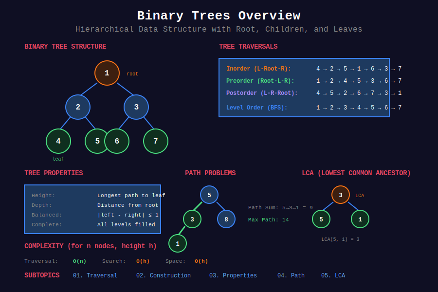

<div align="center">

# 🌲 Trees



<p>
  
  
  
</p>

**Hierarchical data structure with nodes connected by edges**

[⬅️ Previous: Hash Tables](../06_hash_tables/README.md) | [🏠 Home](../README.md) | [Next: BST ➡️](../08_binary_search_trees/README.md)

</div>

---

## 📐 Mathematical Foundation

### 1️⃣ Tree Properties

For a tree with $n$ nodes:

```math
\boxed{\text{edges} = n - 1}

```

**Proof:** Each node except root has exactly one parent edge.

---

### 2️⃣ Binary Tree Node Count

**Maximum nodes at level $k$:** $2^k$

**Maximum nodes in tree of height $h$:**

```math
\boxed{\sum_{k=0}^{h} 2^k = 2^{h+1} - 1}

```

**Minimum height for $n$ nodes:**

```math
h_{min} = \lfloor \log_2 n \rfloor

```

---

### 3️⃣ Full vs Complete vs Perfect Binary Tree

| Type | Property | Nodes |
|------|----------|-------|
| **Full** | Every node has 0 or 2 children | - |
| **Complete** | All levels filled except last (left-aligned) | $[2^h, 2^{h+1}-1]$ |
| **Perfect** | All internal nodes have 2 children, all leaves at same level | $2^{h+1} - 1$ |

---

### 4️⃣ Traversal Sequences

**Preorder (NLR):** $\text{visit}(node) \to \text{preorder}(left) \to \text{preorder}(right)$

**Inorder (LNR):** $\text{inorder}(left) \to \text{visit}(node) \to \text{inorder}(right)$

**Postorder (LRN):** $\text{postorder}(left) \to \text{postorder}(right) \to \text{visit}(node)$

**Key Identity:** Inorder traversal of BST gives sorted order.

---

### 5️⃣ Tree Height Recurrence

```math
\boxed{h(node) = 1 + \max(h(left), h(right))}

```

Base: $h(\text{null}) = 0$ or $h(\text{leaf}) = 0$

---

### 6️⃣ Diameter Formula

Diameter passes through some node $v$:

```math
\boxed{\text{diameter} = \max_{v} (h(v.left) + h(v.right))}

```

---

### 7️⃣ LCA Mathematics

For nodes $p$ and $q$ in a binary tree rooted at $r$:

```math
\text{LCA}(p, q) = \begin{cases}
r & \text{if } p \in T_L \text{ and } q \in T_R \\
\text{LCA}(r.left, p, q) & \text{if } p, q \in T_L \\
\text{LCA}(r.right, p, q) & \text{if } p, q \in T_R
\end{cases}

```

Where $T_L, T_R$ are left and right subtrees.

---

### 8️⃣ Catalan Numbers (Tree Counting)

Number of structurally unique BSTs with $n$ nodes:

```math
\boxed{C_n = \frac{1}{n+1}\binom{2n}{n} = \frac{(2n)!}{(n+1)!n!}}

```

**Recurrence:**

```math
C_n = \sum_{i=0}^{n-1} C_i \cdot C_{n-1-i}

```

First values: $C_0=1, C_1=1, C_2=2, C_3=5, C_4=14, \ldots$

---

## 📂 Subtopics Navigation

| # | Topic | Problems | Link |
|:-:|-------|:--------:|------|
| 1 | Tree Traversal | 15+ | [📖 Go →](./01_tree_traversal/README.md) |
| 2 | Tree Construction | 8+ | [📖 Go →](./02_tree_construction/README.md) |
| 3 | Tree Properties | 12+ | [📖 Go →](./03_tree_properties/README.md) |
| 4 | Path Problems | 10+ | [📖 Go →](./04_path_problems/README.md) |
| 5 | LCA & Ancestor | 8+ | [📖 Go →](./05_lca_ancestor/README.md) |

---

## 🏆 LeetCode Problems

### 🟢 Easy

| # | Problem | Technique | Time | Space |
|:-:|---------|-----------|:----:|:-----:|
| 94 | [Binary Tree Inorder Traversal](https://leetcode.com/problems/binary-tree-inorder-traversal/) | Recursion/Stack | O(n) | O(h) |
| 100 | [Same Tree](https://leetcode.com/problems/same-tree/) | DFS | O(n) | O(h) |
| 101 | [Symmetric Tree](https://leetcode.com/problems/symmetric-tree/) | DFS | O(n) | O(h) |
| 104 | [Maximum Depth](https://leetcode.com/problems/maximum-depth-of-binary-tree/) | DFS | O(n) | O(h) |
| 110 | [Balanced Binary Tree](https://leetcode.com/problems/balanced-binary-tree/) | DFS | O(n) | O(h) |
| 111 | [Minimum Depth](https://leetcode.com/problems/minimum-depth-of-binary-tree/) | BFS | O(n) | O(n) |
| 112 | [Path Sum](https://leetcode.com/problems/path-sum/) | DFS | O(n) | O(h) |
| 144 | [Preorder Traversal](https://leetcode.com/problems/binary-tree-preorder-traversal/) | Recursion/Stack | O(n) | O(h) |
| 145 | [Postorder Traversal](https://leetcode.com/problems/binary-tree-postorder-traversal/) | Recursion/Stack | O(n) | O(h) |
| 226 | [Invert Binary Tree](https://leetcode.com/problems/invert-binary-tree/) | DFS | O(n) | O(h) |
| 543 | [Diameter of Binary Tree](https://leetcode.com/problems/diameter-of-binary-tree/) | DFS | O(n) | O(h) |
| 617 | [Merge Two Binary Trees](https://leetcode.com/problems/merge-two-binary-trees/) | DFS | O(n) | O(h) |

### 🟡 Medium

| # | Problem | Technique | Time | Space |
|:-:|---------|-----------|:----:|:-----:|
| 96 | [Unique Binary Search Trees](https://leetcode.com/problems/unique-binary-search-trees/) | Catalan DP | O(n²) | O(n) |
| 102 | [Level Order Traversal](https://leetcode.com/problems/binary-tree-level-order-traversal/) | BFS | O(n) | O(n) |
| 103 | [Zigzag Level Order](https://leetcode.com/problems/binary-tree-zigzag-level-order-traversal/) | BFS | O(n) | O(n) |
| 105 | [Construct from Preorder & Inorder](https://leetcode.com/problems/construct-binary-tree-from-preorder-and-inorder-traversal/) | Recursion | O(n) | O(n) |
| 106 | [Construct from Inorder & Postorder](https://leetcode.com/problems/construct-binary-tree-from-inorder-and-postorder-traversal/) | Recursion | O(n) | O(n) |
| 113 | [Path Sum II](https://leetcode.com/problems/path-sum-ii/) | DFS + Backtrack | O(n²) | O(n) |
| 114 | [Flatten to Linked List](https://leetcode.com/problems/flatten-binary-tree-to-linked-list/) | DFS | O(n) | O(h) |
| 199 | [Right Side View](https://leetcode.com/problems/binary-tree-right-side-view/) | BFS/DFS | O(n) | O(h) |
| 236 | [Lowest Common Ancestor](https://leetcode.com/problems/lowest-common-ancestor-of-a-binary-tree/) | DFS | O(n) | O(h) |
| 437 | [Path Sum III](https://leetcode.com/problems/path-sum-iii/) | Prefix Sum | O(n) | O(h) |

### 🔴 Hard

| # | Problem | Technique | Time | Space |
|:-:|---------|-----------|:----:|:-----:|
| 124 | [Binary Tree Maximum Path Sum](https://leetcode.com/problems/binary-tree-maximum-path-sum/) | DFS | O(n) | O(h) |
| 297 | [Serialize and Deserialize](https://leetcode.com/problems/serialize-and-deserialize-binary-tree/) | BFS/DFS | O(n) | O(n) |

---

---

## 💡 Key Insights & Pro Tips

> **🎯 Recursion is Natural for Trees**  
> Tree structure is recursive by definition. Most problems have elegant recursive solutions!

> **⚡ Inorder of BST = Sorted**  
> Inorder traversal of BST gives sorted sequence. Key for validation and kth smallest!

> **🔄 Height vs Depth**  
> Height = distance to farthest leaf. Depth = distance from root. Leaf has height 0!

> **📊 Diameter Trick**  
> Diameter passes through some node. For each node: `h(left) + h(right)`. Track global max!

> **🌊 LCA Pattern**  
> If p and q in different subtrees, current node is LCA. Otherwise, recurse into subtree containing both!

---

## 🧮 Quick Pattern Reference

| Pattern in Problem | Technique | Example |
|-------------------|-----------|---------|
| "traverse tree" | DFS/BFS | #94, #102 |
| "construct tree" | Recursion + hash | #105, #106 |
| "height/depth" | DFS with max | #104, #111 |
| "balanced tree" | Check height diff | #110 |
| "diameter" | Track max(h_left + h_right) | #543 |
| "path sum" | DFS with target | #112, #113 |
| "max path sum" | Global max + gain | #124 |
| "LCA" | Recursive split | #236 |
| "serialize/deserialize" | Preorder + markers | #297 |
| "symmetric" | Mirror check | #101 |

---

## 🎯 Must-Solve Problems (Top 20)

| # | Problem | Category | Difficulty | Why Important |
|:-:|---------|----------|------------|---------------|
| 1 | [Inorder Traversal](https://leetcode.com/problems/binary-tree-inorder-traversal/) | Traversal | 🟢 Easy | Foundation |
| 2 | [Level Order](https://leetcode.com/problems/binary-tree-level-order-traversal/) | BFS | 🟡 Medium | BFS pattern |
| 3 | [Maximum Depth](https://leetcode.com/problems/maximum-depth-of-binary-tree/) | DFS | 🟢 Easy | Basic recursion |
| 4 | [Invert Tree](https://leetcode.com/problems/invert-binary-tree/) | DFS | 🟢 Easy | Classic |
| 5 | [Diameter](https://leetcode.com/problems/diameter-of-binary-tree/) | DFS | 🟢 Easy | Global max pattern |
| 6 | [Balanced Tree](https://leetcode.com/problems/balanced-binary-tree/) | DFS | 🟢 Easy | Height check |
| 7 | [Same Tree](https://leetcode.com/problems/same-tree/) | DFS | 🟢 Easy | Comparison |
| 8 | [Symmetric Tree](https://leetcode.com/problems/symmetric-tree/) | DFS | 🟢 Easy | Mirror check |
| 9 | [Path Sum](https://leetcode.com/problems/path-sum/) | DFS | 🟢 Easy | Path tracking |
| 10 | [Construct from Pre+In](https://leetcode.com/problems/construct-binary-tree-from-preorder-and-inorder-traversal/) | Construction | 🟡 Medium | Build tree |
| 11 | [LCA](https://leetcode.com/problems/lowest-common-ancestor-of-a-binary-tree/) | LCA | 🟡 Medium | Classic pattern |
| 12 | [Right Side View](https://leetcode.com/problems/binary-tree-right-side-view/) | BFS/DFS | 🟡 Medium | Level last |
| 13 | [Zigzag Level Order](https://leetcode.com/problems/binary-tree-zigzag-level-order-traversal/) | BFS | 🟡 Medium | Direction flag |
| 14 | [Path Sum II](https://leetcode.com/problems/path-sum-ii/) | Backtracking | 🟡 Medium | All paths |
| 15 | [Flatten to List](https://leetcode.com/problems/flatten-binary-tree-to-linked-list/) | DFS | 🟡 Medium | Modification |
| 16 | [Path Sum III](https://leetcode.com/problems/path-sum-iii/) | Prefix sum | 🟡 Medium | Any-to-any path |
| 17 | [Unique BSTs](https://leetcode.com/problems/unique-binary-search-trees/) | Catalan DP | 🟡 Medium | Counting |
| 18 | [Max Path Sum](https://leetcode.com/problems/binary-tree-maximum-path-sum/) | DFS | 🔴 Hard | Global max |
| 19 | [Serialize/Deserialize](https://leetcode.com/problems/serialize-and-deserialize-binary-tree/) | DFS/BFS | 🔴 Hard | Encoding |
| 20 | [Merge Trees](https://leetcode.com/problems/merge-two-binary-trees/) | DFS | 🟢 Easy | Simultaneous DFS |

---

## 📚 References & Learning Resources

### 📖 Books & Courses

| Resource | Description | Link |
|----------|-------------|------|
| **CLRS Chapter 12** | Binary search trees | [MIT Press](https://mitpress.mit.edu/books/introduction-algorithms) |
| **Algorithms 4th Edition** | Tree algorithms | [Book Site](https://algs4.cs.princeton.edu/) |
| **Competitive Programming 3** | Chapter 2.4 - Trees | [Book](https://cpbook.net/) |

### 🌐 Online Tutorials

| Resource | Description | Link |
|----------|-------------|------|
| **GeeksforGeeks** | Tree complete guide | [Tutorial](https://www.geeksforgeeks.org/binary-tree-data-structure/) |
| **LeetCode Explore** | Binary tree card | [Course](https://leetcode.com/explore/learn/card/data-structure-tree/) |
| **VisuAlgo** | Interactive tree visualization | [Website](https://visualgo.net/en/bst) |
| **HackerRank** | Tree challenges | [Practice](https://www.hackerrank.com/domains/data-structures?filters%5Bsubdomains%5D%5B%5D=trees) |

### 📺 Video Resources

| Resource | Topic | Link |
|----------|-------|------|
| **NeetCode** | Trees playlist | [YouTube](https://www.youtube.com/playlist?list=PLot-Xpze53ldg4pN6PfzoJY7KsKcxF1jg) |
| **Abdul Bari** | Tree lectures | [YouTube](https://www.youtube.com/watch?v=qH6yxkw0u78) |
| **MIT OCW** | Binary search trees | [Lecture](https://ocw.mit.edu/courses/6-006-introduction-to-algorithms-fall-2011/) |
| **Back To Back SWE** | Tree problems | [YouTube](https://www.youtube.com/playlist?list=PLiQ766zSC5jND9vxch5-zT7GuMigiWaV_) |
| **William Fiset** | Tree algorithms | [YouTube](https://www.youtube.com/watch?v=fAAZixBzIAI) |

### 📝 Practice Platforms

| Platform | Focus | Link |
|----------|-------|------|
| **LeetCode** | Tree tag | [Problems](https://leetcode.com/tag/tree/) |
| **HackerRank** | Tree challenges | [Practice](https://www.hackerrank.com/domains/data-structures?filters%5Bsubdomains%5D%5B%5D=trees) |
| **Codeforces** | Tree problems | [Problemset](https://codeforces.com/problemset?tags=trees) |
| **CodeChef** | Tree practice | [Practice](https://www.codechef.com/practice) |

### 🔬 Advanced Topics

| Topic | Description | Link |
|-------|-------------|------|
| **Morris Traversal** | O(1) space traversal | [Tutorial](https://www.geeksforgeeks.org/inorder-tree-traversal-without-recursion-and-without-stack/) |
| **Binary Lifting** | LCA in O(log n) | [CP-Algorithms](https://cp-algorithms.com/graph/lca_binary_lifting.html) |
| **Catalan Numbers** | Count unique BSTs | [Wikipedia](https://en.wikipedia.org/wiki/Catalan_number) |
| **Euler Tour** | Tree to array | [Tutorial](https://www.geeksforgeeks.org/euler-tour-tree/) |
| **Heavy-Light Decomposition** | Path queries | [CP-Algorithms](https://cp-algorithms.com/graph/hld.html) |

### 🎯 Problem Collections

| Collection | Focus | Link |
|-----------|-------|------|
| **NeetCode 150** | Essential trees | [List](https://neetcode.io/practice) |
| **Blind 75** | Core interview | [List](https://www.teamblind.com/post/New-Year-Gift---Curated-List-of-Top-75-LeetCode-Questions-to-Save-Your-Time-OaM1orEU) |
| **Grind 75** | Structured prep | [Guide](https://www.techinterviewhandbook.org/grind75) |
| **Striver's SDE Sheet** | Must-do trees | [Sheet](https://takeuforward.org/interviews/strivers-sde-sheet-top-coding-interview-problems/) |

### 📊 Visualization Tools

| Tool | Purpose | Link |
|------|---------|------|
| **VisuAlgo** | Tree operations | [Website](https://visualgo.net/en/bst) |
| **Algorithm Visualizer** | Tree algorithms | [Website](https://algorithm-visualizer.org/) |
| **CS Animations** | Tree visualizations | [Website](https://www.cs.usfca.edu/~galles/visualization/Algorithms.html) |

### 🏆 Competition Resources

| Resource | Topic | Link |
|----------|-------|------|
| **USACO Guide** | Tree algorithms | [Guide](https://usaco.guide/silver/intro-tree) |
| **TopCoder** | Tree tutorials | [Tutorials](https://www.topcoder.com/thrive/articles/) |
| **Codeforces EDU** | Tree courses | [Course](https://codeforces.com/edu/course/2) |

---

## 🎖️ Interview Success Tips

### Common Mistakes to Avoid

❌ **Don't:**

- Forget base case (null node)

- Confuse height with depth

- Forget to check both children for leaf

- Modify tree when not needed

- Use global variables (pass results up)

✅ **Do:**

- Always handle null nodes first

- Draw small tree (3-5 nodes) to visualize

- Understand difference: height (bottom-up) vs depth (top-down)

- For "all paths", use backtracking

- Return values up the recursion tree

### Optimization Checklist

```
[ ] Can I solve with DFS instead of BFS (usually simpler)?
[ ] Do I need to track global max (diameter, path sum)?
[ ] Should I return multiple values (height + balanced)?
[ ] Is this a construction problem (need hash map)?
[ ] Can I use Morris traversal for O(1) space?
[ ] Do I need parent pointers or can I solve without?

```

---

## 🌟 Motivational Corner

> "Trees are the most important non-linear data structure. Master them, and you master recursion!"

**Progress Tracker:**

- 🥉 **Bronze:** Solve 15 tree problems

- 🥈 **Silver:** Solve 30 tree problems + master traversals

- 🥇 **Gold:** Solve 50 tree problems + LCA patterns

- 💎 **Platinum:** Master all patterns + hard problems

**Remember:** Trees are recursive by nature. Think recursively, code becomes elegant! 🚀

---

<div align="center">

### 🌟 If this helped you, give it a ⭐ on GitHub! 🌟

**Made with ❤️ for the coding community by [Gaurav Goswami](https://github.com/Gaurav14cs17)**

[⬅️ Previous: Hash Tables](../06_hash_tables/README.md) | [🏠 Home](../README.md) | [Next: BST ➡️](../08_binary_search_trees/README.md)

---

*Last Updated: December 2025*  
*Licensed under MIT*  
*Happy Coding! 💻✨*

</div>
