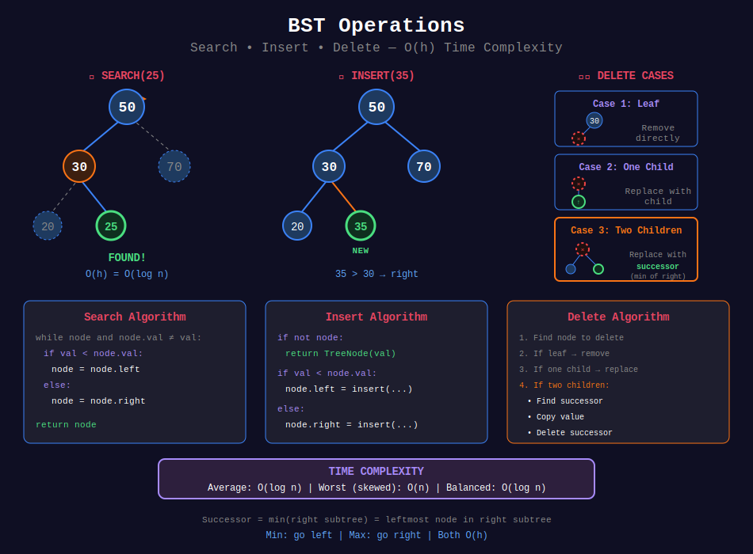

<div align="center">

# ⚙️ BST Operations

<p>
  
  
</p>

</div>

---

## 🧭 Navigation

| ⬅️ Previous | 📂 Current | ➡️ Next |
|:------------|:----------:|--------:|
| [🏠 BST Home](../README.md) | **01. BST Operations** | [02. BST Validation →](../02_bst_validation/README.md) |

---

## 📊 Visual Overview

<div align="center">



</div>

---

## 📐 Mathematical Foundations

### 1️⃣ Search Operation

```math
\text{search}(node, val) = \begin{cases}
node & \text{if } node.val = val \\
\text{search}(node.left, val) & \text{if } val < node.val \\
\text{search}(node.right, val) & \text{if } val > node.val \\
\text{null} & \text{if } node = \text{null}
\end{cases}
```

**Time:** O(h), **Space:** O(1) iterative

---

### 2️⃣ Insert Operation

```math
\text{insert}(node, val) = \begin{cases}
\text{TreeNode}(val) & \text{if } node = \text{null} \\
node.\text{left} = \text{insert}(node.left, val) & \text{if } val < node.val \\
node.\text{right} = \text{insert}(node.right, val) & \text{if } val > node.val
\end{cases}
```

---

### 3️⃣ Delete Operation

**Three cases:**

| Case | Condition | Action |
|------|-----------|--------|
| Leaf | No children | Remove directly |
| One child | One child | Replace with child |
| Two children | Both children | Replace with successor, delete successor |

**Successor:** Minimum in right subtree.

```math
\text{successor}(x) = \min(T_R(x))
```

---

### 4️⃣ Min/Max Operations

```math
\text{min}(T) = \text{leftmost node}
\text{max}(T) = \text{rightmost node}
```

**Time:** O(h)

**Proof:** BST property ensures all left descendants < node. Leftmost has no left child → minimum. ∎

---

### 5️⃣ BST Insertion Correctness

**Theorem:** Insertion maintains BST property.

**Proof by Induction:**
- **Base:** Empty tree → new node is BST ✓
- **Inductive:** If T is BST, inserting val creates BST
  - If val < root.val → insert in left subtree
  - If val > root.val → insert in right subtree
  - BST property preserved at every level ∎

---

### 6️⃣ BST Deletion Complexity

**Three cases with time complexity:**

```math
T(h) = \begin{cases}
O(1) & \text{leaf node} \\
O(1) & \text{one child (replace)} \\
O(h) & \text{two children (find successor)}
\end{cases}
```

**Overall:** O(h) where h = height of tree.

---

### 7️⃣ Trim BST - Pruning Mathematics

**Trim to [L, R]:**

```math
\text{trim}(node, L, R) = \begin{cases}
\text{null} & \text{if } node = \text{null} \\
\text{trim}(node.right, L, R) & \text{if } node.val < L \\
\text{trim}(node.left, L, R) & \text{if } node.val > R \\
\text{node with trimmed children} & \text{otherwise}
\end{cases}
```

**Key Insight:** If node.val < L, entire left subtree is < L → prune!

---

## 🎨 Visual Algorithm Walkthroughs

### 🔍 **Walkthrough 1: BST Insertion**

**Problem:** Insert 15 into BST

```
Initial BST:
      20
     /  \
   10    30
  /  \
 5    15

Insert 15:
Step 1: 15 < 20 → go left
      20
     /
   10
Step 2: 15 > 10 → go right
   10
     \
      15 (existing, stop or handle duplicate)

If 15 doesn't exist, it becomes right child of 10!
```

**Key Steps:**
1. Compare with root: 15 < 20 → left
2. Compare with 10: 15 > 10 → right
3. Found null → create TreeNode(15)

---

### 🗑️ **Walkthrough 2: BST Deletion (Two Children)**

**Problem:** Delete 20 from BST

```
Initial BST:
      20
     /  \
   10    30
  /  \   / \
 5   15 25 35

Delete 20 (has 2 children):

Step 1: Find successor = min(right subtree) = 25
      20
        \
        30
       /
      25 ← successor

Step 2: Replace 20 with 25
      25
     /  \
   10    30
  /  \     \
 5   15    35

Step 3: Delete 25 from right subtree (one child case)

Final:
      25
     /  \
   10    30
  /  \     \
 5   15    35
```

**Why Successor?**
- Successor is smallest in right subtree
- Maintains BST property: left < successor < right ✓

---

### ✂️ **Walkthrough 3: Trim BST to [10, 30]**

```
Original BST:
       25
      /  \
     5    35
    / \   / \
   1  10 30 40

Trim to [10, 30]:

Step 1: Root 25 ∈ [10, 30] → keep, trim children
Step 2: Left child 5 < 10 → prune left subtree, check right
Step 3: 10 ∈ [10, 30] → keep
Step 4: Right child 35 > 30 → prune right subtree, check left
Step 5: 30 ∈ [10, 30] → keep

Result:
       25
      /  \
    10    30
```

**Pruning Logic:**
- If node < L → entire left subtree < L, check only right
- If node > R → entire right subtree > R, check only left

---

## 🎯 Pattern Recognition Guide

| Scenario | Pattern | Example |
|----------|---------|---------|
| **Need to find value** | Binary search on BST | Search #700 |
| **Add new value** | Recursive insertion | Insert #701 |
| **Remove value** | Three cases deletion | Delete #450 |
| **Need min/max** | Go leftmost/rightmost | Find min/max |
| **Filter by range** | Trim with pruning | Trim BST #669 |
| **Modify subtree** | Recursive with base case | All operations |

### When to Use Each Operation

```
Problem mentions:
+-- "search for" → searchBST()
+-- "add" / "insert" → insertIntoBST()
+-- "remove" / "delete" → deleteNode()
+-- "minimum" / "maximum" → findMin() / findMax()
+-- "in range [L, R]" → trimBST() or range query
+-- "valid BST?" → See validation section
```

---

## 💻 Code Implementations

```python
def searchBST(root: TreeNode, val: int) -> TreeNode:
    """
    Search for value in BST.
    
    Time: O(h), Space: O(1)
    """
    while root and root.val != val:
        root = root.left if val < root.val else root.right
    return root

def insertIntoBST(root: TreeNode, val: int) -> TreeNode:
    """
    Insert value into BST.
    
    Time: O(h), Space: O(h) recursive
    """
    if not root:
        return TreeNode(val)
    
    if val < root.val:
        root.left = insertIntoBST(root.left, val)
    else:
        root.right = insertIntoBST(root.right, val)
    
    return root

def deleteNode(root: TreeNode, key: int) -> TreeNode:
    """
    Delete node from BST.
    
    Three cases: leaf, one child, two children.
    
    Time: O(h), Space: O(h)
    """
    if not root:
        return None
    
    if key < root.val:
        root.left = deleteNode(root.left, key)
    elif key > root.val:
        root.right = deleteNode(root.right, key)
    else:

        # Found node to delete
        if not root.left:
            return root.right
        if not root.right:
            return root.left
        
        # Two children: find successor
        successor = root.right
        while successor.left:
            successor = successor.left
        
        root.val = successor.val
        root.right = deleteNode(root.right, successor.val)
    
    return root

def findMin(root: TreeNode) -> TreeNode:
    """Find minimum value node."""
    while root and root.left:
        root = root.left
    return root

def findMax(root: TreeNode) -> TreeNode:
    """Find maximum value node."""
    while root and root.right:
        root = root.right
    return root

def trimBST(root: TreeNode, low: int, high: int) -> TreeNode:
    """
    Trim BST to [low, high] range.
    
    Time: O(n), Space: O(h)
    """
    if not root:
        return None
    
    if root.val < low:
        return trimBST(root.right, low, high)
    if root.val > high:
        return trimBST(root.left, low, high)
    
    root.left = trimBST(root.left, low, high)
    root.right = trimBST(root.right, low, high)
    return root
```

---

## 🏆 LeetCode Problems

### 🟢 Easy

| # | Problem | Pattern | Time | Space |
|:-:|---------|---------|:----:|:-----:|
| 700 | [Search in a BST](https://leetcode.com/problems/search-in-a-binary-search-tree/) | Binary Search | O(h) | O(1) |

### 🟡 Medium

| # | Problem | Pattern | Time | Space |
|:-:|---------|---------|:----:|:-----:|
| 450 | [Delete Node in a BST](https://leetcode.com/problems/delete-node-in-a-bst/) | Three Cases | O(h) | O(h) |
| 669 | [Trim a BST](https://leetcode.com/problems/trim-a-binary-search-tree/) | Recursive Trim | O(n) | O(h) |
| 701 | [Insert into a BST](https://leetcode.com/problems/insert-into-a-binary-search-tree/) | BST Property | O(h) | O(h) |

---

---

## 💡 Pro Tips & Common Mistakes

### ✅ **Do's:**
- ✓ Use iterative search for O(1) space
- ✓ Handle null pointers before accessing
- ✓ Master all 3 deletion cases
- ✓ Remember: Successor = min(right subtree)
- ✓ Use BST property to optimize pruning

### ❌ **Don'ts:**
- ✗ Don't use BFS/DFS when BST property available
- ✗ Don't forget to return modified root in insertion/deletion
- ✗ Don't confuse predecessor (max of left) with successor
- ✗ Don't validate only immediate children (check whole subtree)
- ✗ Don't use global variables for tree modifications

### ⚡ **Optimization Tricks:**
1. **Iterative > Recursive** for space: O(1) vs O(h)
2. **Early termination** in search when found
3. **Prune aggressively** in range queries
4. **Cache parent** if need to go back up

---

## 📚 References & Resources

### 📖 Books & Courses
| Resource | Description | Link |
|----------|-------------|------|
| **CLRS Chapter 12** | BST operations detailed | [MIT Press](https://mitpress.mit.edu/books/introduction-algorithms) |
| **Algorithm Design Manual** | BST chapter | [Springer](https://www.algorist.com/) |
| **Princeton Algorithms** | BST implementations | [Coursera](https://www.coursera.org/learn/algorithms-part1) |

### 🌐 Online Tutorials
| Resource | Topic | Link |
|----------|-------|------|
| **GeeksforGeeks** | BST operations | [Tutorial](https://www.geeksforgeeks.org/binary-search-tree-set-1-search-and-insertion/) |
| **LeetCode Explore** | BST operations card | [Course](https://leetcode.com/explore/learn/card/introduction-to-data-structure-binary-search-tree/) |
| **VisuAlgo** | BST visualizations | [Website](https://visualgo.net/en/bst) |
| **Programiz** | BST operations guide | [Tutorial](https://www.programiz.com/dsa/binary-search-tree) |

### 📺 Video Resources
| Creator | Topic | Link |
|---------|-------|------|
| **Abdul Bari** | BST operations | [YouTube](https://www.youtube.com/watch?v=pYT9F8_LFTM) |
| **NeetCode** | BST problems | [YouTube](https://www.youtube.com/watch?v=p5-HTWKdJJM) |
| **Back To Back SWE** | BST deletion | [YouTube](https://www.youtube.com/watch?v=LFzAoJJt92M) |
| **MIT OCW** | Binary search trees | [Lecture](https://ocw.mit.edu/courses/6-006-introduction-to-algorithms-fall-2011/) |
| **William Fiset** | BST algorithms | [YouTube](https://www.youtube.com/watch?v=JfSdGQdAzq8) |

### 🔧 Interactive Tools
| Tool | Purpose | Link |
|------|---------|------|
| **VisuAlgo BST** | Visualize operations | [Website](https://visualgo.net/en/bst) |
| **CS Animations** | BST operations | [Website](https://www.cs.usfca.edu/~galles/visualization/BST.html) |
| **Algorithm Visualizer** | BST animations | [Website](https://algorithm-visualizer.org/brute-force/binary-search-tree) |

### 📝 Practice Platforms
| Platform | Focus | Link |
|----------|-------|------|
| **LeetCode** | BST operations tag | [Problems](https://leetcode.com/tag/binary-search-tree/) |
| **HackerRank** | BST challenges | [Practice](https://www.hackerrank.com/domains/data-structures?filters%5Bsubdomains%5D%5B%5D=trees) |
| **CodeChef** | BST problems | [Practice](https://www.codechef.com/practice) |

---

## 🎯 Practice Roadmap

### **Phase 1: Foundations (Week 1)**
- [ ] Implement search (iterative & recursive)
- [ ] Implement insert (iterative & recursive)
- [ ] Implement findMin/findMax
- [ ] Solve: #700 Search in BST

### **Phase 2: Deletion (Week 2)**
- [ ] Implement all 3 deletion cases
- [ ] Understand successor/predecessor
- [ ] Solve: #450 Delete Node in BST
- [ ] Solve: #701 Insert into BST

### **Phase 3: Advanced Operations (Week 3)**
- [ ] Implement trimBST
- [ ] Range-based operations
- [ ] Solve: #669 Trim a BST
- [ ] Practice edge cases (empty, single node)

---

## ❓ Interview Deep-Dive Q&A

**Q1: What's the time complexity of BST operations?**
- **A:** Average O(log n), worst O(n) for skewed tree. Balanced BSTs (AVL, Red-Black) guarantee O(log n).

**Q2: Why is deletion harder than insertion?**
- **A:** Deletion has 3 cases. Two children case requires finding successor and recursive deletion.

**Q3: What's the difference between successor and predecessor?**
- **A:** Successor = min(right subtree) or lowest ancestor where node is in left. Predecessor = max(left subtree).

**Q4: How to delete without returning new root?**
- **A:** Swap values instead: `root.val = successor.val`, then delete successor.

**Q5: Can BST have duplicate values?**
- **A:** Usually no. If needed, left ≤ node or node ≤ right (consistent choice).

**Q6: How to convert iterative to recursive?**
- **A:** Recursive: natural with base case. Iterative: use while loop, better space O(1).

**Q7: What if BST is very skewed?**
- **A:** Use AVL or Red-Black tree for guaranteed O(log n), or rebuild with sorted array.

---

<div align="center">

### 🌟 Master these operations — they're fundamental to all BST problems! 🌟

**Made with ❤️ for the coding community by [Gaurav Goswami](https://github.com/Gaurav14cs17)**

</div>

---

## 🧭 Navigation

| ⬅️ Previous | 📂 Current | ➡️ Next |
|:------------|:----------:|--------:|
| [🏠 BST Home](../README.md) | **01. BST Operations** | [02. BST Validation →](../02_bst_validation/README.md) |
