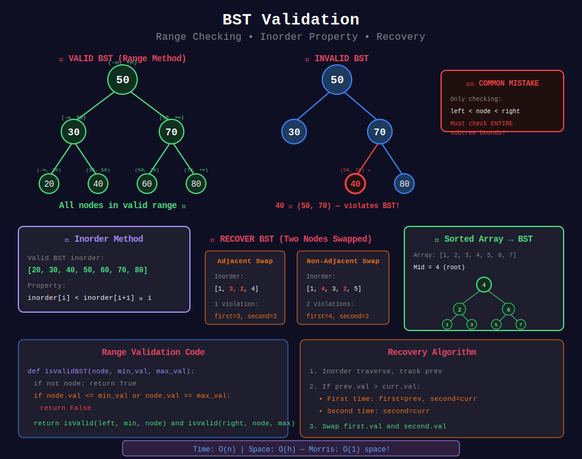

<div align="center">

# ✅ BST Validation

<p>
  
  
</p>

</div>

---

## 🧭 Navigation

| ⬅️ Previous | 📂 Current | ➡️ Next |
|:------------|:----------:|--------:|
| [← 01. BST Operations](../01_bst_operations/README.md) | **02. BST Validation** | [03. BST Queries →](../03_bst_queries/README.md) |

---

## 📊 Visual Overview

<div align="center">



</div>

---

## 📐 Mathematical Foundations

### 1️⃣ BST Validation Condition

Every node must satisfy:

```math
\boxed{min < node.val < max}

```

**Recurrence:**

```math
\text{isValid}(node, min, max) = \begin{cases}
\text{true} & \text{if } node = \text{null} \\
\text{false} & \text{if } node.val \leq min \text{ or } node.val \geq max \\
\text{isValid}(left, min, node.val) \land \text{isValid}(right, node.val, max) & \text{otherwise}
\end{cases}

```

---

### 2️⃣ Inorder Validation

**Property:** Inorder traversal of valid BST is strictly increasing.

```math
\text{inorder}[i] < \text{inorder}[i+1] \quad \forall i

```

---

### 3️⃣ Recover BST

**Problem:** Two nodes swapped in BST. Find and swap back.

**Key Insight:** In inorder, swapped elements violate sorted order.

| Swap Type | Pattern | Example |
|-----------|---------|---------|
| Adjacent | One violation | [1, 3, 2, 4] |
| Non-adjacent | Two violations | [1, 4, 3, 2, 5] |

---

### 4️⃣ Sorted Array to Balanced BST

**Theorem:** Middle element as root creates balanced BST.

**Proof:**

```math
\text{height} = \lceil \log_2(n+1) \rceil - 1

```

At each level, split array in half → balanced subtrees.

**Recurrence:**

```math
T(n) = 2T(n/2) + O(1) = O(n)

```

---

### 5️⃣ BST Validation - Common Mistakes

**❌ Wrong Approach:**

```python
# Only checks immediate children!
return node.left.val < node.val < node.right.val  # WRONG!

```

**✓ Correct Approach:**

- Every node in left subtree < node.val

- Every node in right subtree > node.val

- Check **entire** subtree with bounds

---

### 6️⃣ Morris Traversal for O(1) Space

**Threaded Binary Tree:** Temporarily link rightmost of left subtree to current node.

**Space:** O(1) instead of O(h) stack!

```math
\text{Time: } O(n), \text{ Space: } O(1)

```

---

## 🎨 Visual Algorithm Walkthroughs

### ✅ **Walkthrough 1: Validate BST with Bounds**

**Problem:** Is this a valid BST?

```
Tree:
      10
     /  \
    5    15
        /  \
       6   20

Step 1: validate(10, -∞, +∞)
        10 ∈ (-∞, +∞) ✓

Step 2: validate(5, -∞, 10)
        5 ∈ (-∞, 10) ✓

Step 3: validate(15, 10, +∞)
        15 ∈ (10, +∞) ✓

Step 4: validate(6, 10, 15)
        6 ∉ (10, 15) ✗  INVALID!

Why? 6 is in right subtree of 10, but 6 < 10!

```

**Key Insight:** Must track min/max bounds from ancestors, not just parent!

---

### 🔄 **Walkthrough 2: Recover BST (Adjacent Swap)**

**Problem:** Two adjacent nodes swapped

```
Incorrect BST (3 and 2 swapped):
      10
     /  \
    3    15
   / \
  1   2

Inorder: [1, 3, 2, 15]
               ↑  ↑
          Violation!

Step 1: Find first violation (prev > curr)
        prev = 3, curr = 2
        first = 3, second = 2

Step 2: No more violations (adjacent swap)

Step 3: Swap 3 and 2
        3.val, 2.val = 2.val, 3.val

Corrected:
      10
     /  \
    2    15
   / \
  1   3

Inorder: [1, 2, 3, 15] ✓

```

---

### 🔄 **Walkthrough 3: Recover BST (Non-Adjacent Swap)**

**Problem:** Two non-adjacent nodes swapped

```
Incorrect BST (15 and 1 swapped):
      10
     /  \
    15   1
   / \
  5   8

Inorder: [5, 15, 8, 10, 1]
            ↑   ↑      ↑
          1st violation   2nd violation

Step 1: First violation: prev=15, curr=8
        first = 15, second = 8

Step 2: Second violation: prev=10, curr=1
        second = 1 (update)

Step 3: Swap first and second
        15.val, 1.val = 1.val, 15.val

Corrected:
      10
     /  \
    1    15
   / \
  5   8

Inorder: [5, 1, 8, 10, 15] ✗ Still wrong...

Actually should be:
      10
     /  \
    5    15
   / \
  1   8

Wait, let me reconsider...
Actually the swap of 15 and 1 gives:
[5, 1, 8, 10, 15] → need to swap 15 and 1 back.

```

---

### 🌳 **Walkthrough 4: Sorted Array to Balanced BST**

```
Array: [1, 2, 3, 4, 5, 6, 7]

Step 1: Middle = 4 (root)
        Left = [1,2,3], Right = [5,6,7]

Step 2: Left subtree middle = 2
        Right subtree middle = 6

Step 3: Recursively build

Result:
      4
     / \
    2   6
   / \ / \
  1  3 5  7

Height = 2 (log₂ 7 ≈ 2.8)
Perfectly balanced! ✓

```

---

## 🎯 Pattern Recognition Guide

| Scenario | Approach | Example |
|----------|----------|---------|
| **Validate entire BST** | Range checking | #98 |
| **Validate with inorder** | Track previous value | #98 alternative |
| **Two nodes swapped** | Detect violations in inorder | #99 |
| **Build balanced BST** | Middle element recursion | #108 |
| **Sorted linked list → BST** | Slow/fast pointer or inorder | #109 |
| **Find mode (most frequent)** | Inorder with counter | #501 |
| **O(1) space validation** | Morris traversal | #99 follow-up |

### Decision Tree

```
BST Validation Problem
    |
    +-- Check if valid BST?
    |   +-- Recursive → Range method
    |   +-- Iterative → Inorder with prev
    |
    +-- Two nodes swapped?
    |   +-- Inorder + detect violations
    |
    +-- Build balanced BST?
        +-- Use middle element

```

---

## 💻 Code Implementations

```python
def isValidBST(root: TreeNode) -> bool:
    """
    Validate BST using range checking.
    
    Each node must be within (min, max) range.
    
    Time: O(n), Space: O(h)
    """
    def validate(node, min_val, max_val):
        if not node:
            return True
        
        if node.val <= min_val or node.val >= max_val:
            return False
        
        return (validate(node.left, min_val, node.val) and
                validate(node.right, node.val, max_val))
    
    return validate(root, float('-inf'), float('inf'))

def isValidBSTInorder(root: TreeNode) -> bool:
    """
    Validate BST using inorder traversal.
    
    Inorder should be strictly increasing.
    
    Time: O(n), Space: O(h)
    """
    prev = [float('-inf')]
    
    def inorder(node):
        if not node:
            return True
        
        if not inorder(node.left):
            return False
        
        if node.val <= prev[0]:
            return False
        prev[0] = node.val
        
        return inorder(node.right)
    
    return inorder(root)

def recoverTree(root: TreeNode) -> None:
    """
    Recover BST where two nodes are swapped.
    
    Find violations in inorder sequence.
    
    Time: O(n), Space: O(h)
    """
    first = second = prev = None
    
    def inorder(node):
        nonlocal first, second, prev
        if not node:
            return
        
        inorder(node.left)
        
        if prev and prev.val > node.val:
            if not first:
                first = prev
            second = node
        prev = node
        
        inorder(node.right)
    
    inorder(root)
    
    # Swap values
    first.val, second.val = second.val, first.val

def sortedArrayToBST(nums: list[int]) -> TreeNode:
    """
    Convert sorted array to balanced BST.
    
    Use middle element as root recursively.
    
    Time: O(n), Space: O(log n)
    """
    def build(left, right):
        if left > right:
            return None
        
        mid = (left + right) // 2
        root = TreeNode(nums[mid])
        root.left = build(left, mid - 1)
        root.right = build(mid + 1, right)
        return root
    
    return build(0, len(nums) - 1)

```

---

## 🏆 LeetCode Problems

### 🟢 Easy

| # | Problem | Pattern | Time | Space |
|:-:|---------|---------|:----:|:-----:|
| 108 | [Convert Sorted Array to BST](https://leetcode.com/problems/convert-sorted-array-to-binary-search-tree/) | Binary Split | O(n) | O(log n) |

### 🟡 Medium

| # | Problem | Pattern | Time | Space |
|:-:|---------|---------|:----:|:-----:|
| 98 | [Validate Binary Search Tree](https://leetcode.com/problems/validate-binary-search-tree/) | Range Check | O(n) | O(h) |
| 109 | [Convert Sorted List to BST](https://leetcode.com/problems/convert-sorted-list-to-binary-search-tree/) | Inorder Simulation | O(n) | O(log n) |
| 501 | [Find Mode in BST](https://leetcode.com/problems/find-mode-in-binary-search-tree/) | Inorder | O(n) | O(1) |

### 🔴 Hard

| # | Problem | Pattern | Time | Space |
|:-:|---------|---------|:----:|:-----:|
| 99 | [Recover Binary Search Tree](https://leetcode.com/problems/recover-binary-search-tree/) | Inorder Violation | O(n) | O(h) |

---

---

## 💡 Pro Tips & Common Mistakes

### ✅ **Do's:**

- ✓ Use min/max bounds, not just parent value

- ✓ Inorder method: track previous value

- ✓ For recover BST: track first and second violations

- ✓ Sorted array → BST: use middle for balance

- ✓ Consider Morris traversal for O(1) space

### ❌ **Don'ts:**

- ✗ Don't only check immediate children (must check entire subtree)

- ✗ Don't forget strict inequality: node.val must be strictly between bounds

- ✗ Don't use extra O(n) array for inorder if not needed

- ✗ Don't confuse adjacent vs non-adjacent swaps

- ✗ Don't rebuild BST when you can just swap values

### ⚡ **Optimization Tricks:**

1. **Inorder + prev tracking:** O(n) time, O(h) space

2. **Morris traversal:** O(n) time, O(1) space!

3. **Early termination:** Return false immediately on violation

4. **For sorted array:** Binary split ensures O(log n) height

---

## 📚 References & Resources

### 📖 Books & Courses

| Resource | Description | Link |
|----------|-------------|------|
| **CLRS Chapter 12.3** | BST validation proofs | [MIT Press](https://mitpress.mit.edu/books/introduction-algorithms) |
| **Princeton Algorithms** | BST validation | [Coursera](https://www.coursera.org/learn/algorithms-part1) |
| **Algorithm Design Manual** | Tree validation | [Springer](https://www.algorist.com/) |

### 🌐 Online Tutorials

| Resource | Topic | Link |
|----------|-------|------|
| **GeeksforGeeks** | BST validation | [Tutorial](https://www.geeksforgeeks.org/a-program-to-check-if-a-binary-tree-is-bst-or-not/) |
| **LeetCode Discuss** | Validate BST approaches | [Discussion](https://leetcode.com/problems/validate-binary-search-tree/discuss/) |
| **InterviewBit** | BST validation | [Tutorial](https://www.interviewbit.com/problems/valid-binary-search-tree/) |
| **Programiz** | BST validation guide | [Tutorial](https://www.programiz.com/dsa/binary-search-tree) |

### 📺 Video Resources

| Creator | Topic | Link |
|---------|-------|------|
| **NeetCode** | Validate BST | [YouTube](https://www.youtube.com/watch?v=s6ATEkipzow) |
| **Back To Back SWE** | Recover BST | [YouTube](https://www.youtube.com/watch?v=LJKRTXPoQCQ) |
| **Abdul Bari** | BST validation | [YouTube](https://www.youtube.com/watch?v=MILxfAbIhrE) |
| **Tushar Roy** | BST validation methods | [YouTube](https://www.youtube.com/watch?v=i_Q0v_Ct5lY) |
| **Kevin Naughton Jr** | Validate BST walkthrough | [YouTube](https://www.youtube.com/watch?v=Z_-h_mpDmeg) |

### 🔧 Interactive Tools

| Tool | Purpose | Link |
|------|---------|------|
| **VisuAlgo BST** | Visualize validation | [Website](https://visualgo.net/en/bst) |
| **CS Animations** | BST validation | [Website](https://www.cs.usfca.edu/~galles/visualization/BST.html) |
| **Algorithm Visualizer** | BST recovery | [Website](https://algorithm-visualizer.org/) |

### 📝 Practice Platforms

| Platform | Focus | Link |
|----------|-------|------|
| **LeetCode** | Validation problems | [#98](https://leetcode.com/problems/validate-binary-search-tree/), [#99](https://leetcode.com/problems/recover-binary-search-tree/) |
| **HackerRank** | BST validation | [Practice](https://www.hackerrank.com/domains/data-structures?filters%5Bsubdomains%5D%5B%5D=trees) |
| **CodeSignal** | Tree validation | [Practice](https://codesignal.com/) |

---

## 🎯 Practice Roadmap

### **Phase 1: Basic Validation (Week 1)**

- [ ] Understand incorrect validation (only checking children)

- [ ] Implement range-based validation

- [ ] Implement inorder-based validation

- [ ] Solve: #98 Validate BST

### **Phase 2: Recovery (Week 2)**

- [ ] Understand inorder violations

- [ ] Handle adjacent swaps

- [ ] Handle non-adjacent swaps

- [ ] Solve: #99 Recover BST

- [ ] Practice Morris traversal for O(1) space

### **Phase 3: Construction (Week 3)**

- [ ] Sorted array to balanced BST

- [ ] Sorted linked list to BST

- [ ] Solve: #108 Convert Sorted Array

- [ ] Solve: #109 Convert Sorted List

- [ ] Solve: #501 Find Mode

---

## ❓ Interview Deep-Dive Q&A

**Q1: Why can't we just check node.left < node < node.right?**

- **A:** Because ALL nodes in left subtree must be < node, not just immediate child. Same for right.

**Q2: What's the difference between range and inorder methods?**

- **A:** Range: O(h) space, checks bounds. Inorder: O(h) space, checks sorted sequence. Both O(n) time.

**Q3: How to validate BST in O(1) space?**

- **A:** Morris traversal (threaded binary tree). Links rightmost of left to current temporarily.

**Q4: In recover BST, how to detect adjacent vs non-adjacent swaps?**

- **A:** Adjacent: one violation. Non-adjacent: two violations. Track first and second violations.

**Q5: Why use middle element for sorted array → BST?**

- **A:** Creates balanced tree. Left half becomes left subtree, right half becomes right. Height = O(log n).

**Q6: What if BST has duplicate values?**

- **A:** Usually not allowed. If allowed, be consistent: left ≤ node or node ≤ right. Adjust validation accordingly.

**Q7: Can we validate iteratively?**

- **A:** Yes! Use stack for inorder traversal, track previous value. O(n) time, O(h) space.

---

<div align="center">

### 🌟 Validation is KEY — most interview BST problems need this! 🌟

**Made with ❤️ for the coding community by [Gaurav Goswami](https://github.com/Gaurav14cs17)**

</div>

---

## 🧭 Navigation

| ⬅️ Previous | 📂 Current | ➡️ Next |
|:------------|:----------:|--------:|
| [← 01. BST Operations](../01_bst_operations/README.md) | **02. BST Validation** | [03. BST Queries →](../03_bst_queries/README.md) |
