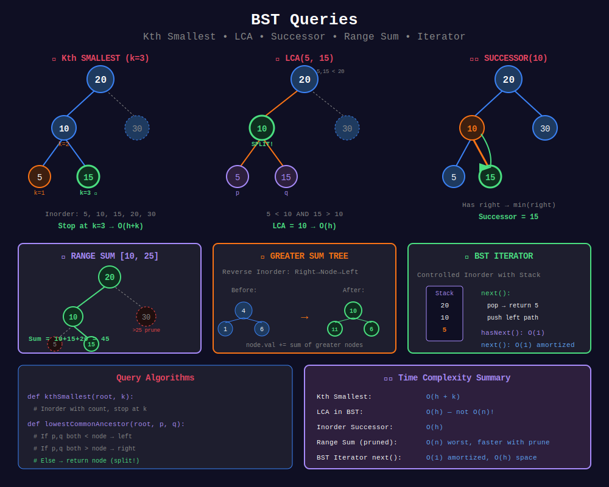

<div align="center">

# 🔎 BST Queries

<p>
  
  
</p>

</div>

---

## 🧭 Navigation

| ⬅️ Previous | 📂 Current | ➡️ Next Topic |
|:------------|:----------:|--------:|
| [← 02. BST Validation](../02_bst_validation/README.md) | **03. BST Queries** | [🏠 BST Home](../README.md) → [Heaps](../../09_heaps/README.md) |

---

## 📊 Visual Overview

<div align="center">



</div>

---

## 📐 Mathematical Foundations

### 1️⃣ Kth Smallest Element

**Using Inorder:**

```math
\text{kth_smallest} = \text{inorder}[k-1]

```

**Time:** O(H + k) where H = height.

---

### 2️⃣ Inorder Successor

```math
\text{successor}(x) = \begin{cases}
\min(T_R(x)) & \text{if } T_R(x) \neq \emptyset \\
\text{lowest ancestor with } x \text{ in left subtree} & \text{otherwise}
\end{cases}

```

---

### 3️⃣ LCA in BST

```math
\text{LCA}(p, q) = \begin{cases}
root & \text{if } p.val \leq root.val \leq q.val \\
\text{LCA}(root.left, p, q) & \text{if } p.val, q.val < root.val \\
\text{LCA}(root.right, p, q) & \text{if } p.val, q.val > root.val
\end{cases}

```

**Time:** O(h) using BST property.

---

### 4️⃣ Range Sum Query

```math
\text{rangeSum}(L, R) = \sum_{L \leq node.val \leq R} node.val

```

**Pruning:** Skip subtrees outside range.

---

### 5️⃣ Greater Sum Tree

**Reverse inorder** (Right → Node → Left) accumulates greater values.

```math
node.val_{new} = node.val + \sum_{x > node.val} x

```

**Correctness:** Reverse inorder visits larger values first → accumulate and update!

---

### 6️⃣ Two Sum in BST

**Approach 1:** Inorder → sorted array → two pointers

- Time: O(n), Space: O(n)

**Approach 2:** Inorder + HashSet

- Time: O(n), Space: O(n)

**Key:** Convert BST to sorted sequence!

---

### 7️⃣ BST Iterator - Amortized Analysis

**Operations:**

- `next()`: O(1) amortized

- `hasNext()`: O(1)

**Why Amortized O(1)?**

- Each node pushed/popped exactly once

- Total n nodes → n pushes + n pops

- Per operation: O(2n)/n = O(1) ✓

---

### 8️⃣ Closest Value in BST

**Binary Search on BST:**

```math
\text{closest} = \arg\min_{node \in BST} |node.val - target|

```

**Time:** O(h) — prune half the tree at each step!

---

## 🎨 Visual Algorithm Walkthroughs

### 🔢 **Walkthrough 1: Kth Smallest Element**

**Problem:** Find 3rd smallest in BST

```
BST:
      20
     /  \
   10    30
  /  \
 5   15

Inorder traversal with count:
Step 1: Go left to 5
        count = 1, value = 5

Step 2: Back to 10
        count = 2, value = 10

Step 3: Go right to 15
        count = 3, value = 15 ← ANSWER!

Stop early! Don't need to visit 20 or 30.

```

**Optimization:** Stop at k-th element, don't traverse entire tree!

---

### 🔄 **Walkthrough 2: Inorder Successor**

**Problem:** Find successor of 10

```
BST:
      20
     /  \
   10    30
  /  \   / \
 5   15 25 35

Case 1: Node has right child (10 has right child)
        Successor = min(right subtree) = 15

Case 2: Node has no right child (15 has no right child)
        Successor = first ancestor where we go left
        
        15 → 10 (we are right child)
        10 → 20 (we are left child) ← Successor!

```

**Rule:**

- If right exists → min of right

- Else → first left-turn ancestor

---

### 🎯 **Walkthrough 3: LCA in BST**

**Problem:** Find LCA of 5 and 15

```
BST:
      20
     /  \
   10    30
  /  \
 5   15

Step 1: At 20
        5 < 20 AND 15 < 20 → go left

Step 2: At 10
        5 < 10 BUT 15 > 10 → SPLIT!
        LCA = 10 ✓

Why? 5 is in left subtree, 15 in right.
10 is the lowest node with this split.

```

**O(h) vs O(n) for regular binary tree!**

---

### 💰 **Walkthrough 4: Convert to Greater Sum Tree**

```
Original BST:
      4
     / \
    1   6
   / \ / \
  0  2 5  7
        \   \
         3   8

Reverse Inorder (Right → Node → Left):
Visit order: 8, 7, 6, 5, 4, 3, 2, 1, 0

running_sum = 0
Visit 8: sum = 0+8 = 8, node.val = 8
Visit 7: sum = 8+7 = 15, node.val = 15
Visit 6: sum = 15+6 = 21, node.val = 21
Visit 5: sum = 21+5 = 26, node.val = 26
Visit 4: sum = 26+4 = 30, node.val = 30
Visit 3: sum = 30+3 = 33, node.val = 33
Visit 2: sum = 33+2 = 35, node.val = 35
Visit 1: sum = 35+1 = 36, node.val = 36
Visit 0: sum = 36+0 = 36, node.val = 36

Result:
      30
     /  \
   36    21
   / \   / \
 36 35 26 15
       \    \
       33    8

```

---

## 🎯 Pattern Recognition Guide

| Scenario | Technique | Complexity | Example |
|----------|-----------|------------|---------|
| **k-th smallest** | Inorder with count | O(h+k) | #230 |
| **Successor/Predecessor** | BST navigation | O(h) | #285 |
| **LCA in BST** | BST property | O(h) | #235 |
| **Range sum** | Pruned DFS | O(n) | #938 |
| **Greater sum tree** | Reverse inorder | O(n) | #538, #1038 |
| **Two sum** | Inorder + hash | O(n) | #653 |
| **Closest value** | Binary search | O(h) | #270 |
| **Min absolute diff** | Inorder consecutive | O(n) | #530 |
| **BST iterator** | Controlled inorder | O(1) amortized | #173 |

### Decision Tree

```
BST Query Problem
    |
    +-- k-th element? → Inorder with early stop
    |
    +-- Successor/Predecessor? → Check right/left, then ancestors
    |
    +-- LCA? → Use BST property (O(h) vs O(n))
    |
    +-- Range query? → Prune branches outside range
    |
    +-- Need sorted order? → Inorder traversal
    |
    +-- Closest to target? → Binary search with tracking

```

---

## 💻 Code Implementations

```python
def kthSmallest(root: TreeNode, k: int) -> int:
    """
    Find kth smallest element.
    
    Inorder traversal stops at kth element.
    
    Time: O(H + k), Space: O(H)
    """
    stack = []
    current = root
    count = 0
    
    while current or stack:
        while current:
            stack.append(current)
            current = current.left
        
        current = stack.pop()
        count += 1
        if count == k:
            return current.val
        
        current = current.right
    
    return -1

def inorderSuccessor(root: TreeNode, p: TreeNode) -> TreeNode:
    """
    Find inorder successor of node p.
    
    Time: O(h), Space: O(1)
    """
    successor = None
    
    while root:
        if p.val < root.val:
            successor = root
            root = root.left
        else:
            root = root.right
    
    return successor

def lowestCommonAncestor(root: TreeNode, p: TreeNode, q: TreeNode) -> TreeNode:
    """
    LCA in BST using BST property.
    
    Time: O(h), Space: O(1)
    """
    while root:
        if p.val < root.val and q.val < root.val:
            root = root.left
        elif p.val > root.val and q.val > root.val:
            root = root.right
        else:
            return root
    return None

def rangeSumBST(root: TreeNode, low: int, high: int) -> int:
    """
    Sum of values in [low, high] range.
    
    Prune branches outside range.
    
    Time: O(n), Space: O(h)
    """
    if not root:
        return 0
    
    if root.val < low:
        return rangeSumBST(root.right, low, high)
    if root.val > high:
        return rangeSumBST(root.left, low, high)
    
    return (root.val + 
            rangeSumBST(root.left, low, high) + 
            rangeSumBST(root.right, low, high))

def convertBST(root: TreeNode) -> TreeNode:
    """
    Convert BST to Greater Sum Tree.
    
    Reverse inorder: Right → Node → Left
    
    Time: O(n), Space: O(h)
    """
    running_sum = [0]
    
    def reverse_inorder(node):
        if not node:
            return
        
        reverse_inorder(node.right)
        
        running_sum[0] += node.val
        node.val = running_sum[0]
        
        reverse_inorder(node.left)
    
    reverse_inorder(root)
    return root

class BSTIterator:
    """
    BST Iterator - Controlled inorder traversal.
    
    next(): O(1) amortized
    hasNext(): O(1)
    Space: O(h)
    """
    def __init__(self, root: TreeNode):
        self.stack = []
        self._push_left(root)
    
    def _push_left(self, node):
        while node:
            self.stack.append(node)
            node = node.left
    
    def next(self) -> int:
        node = self.stack.pop()
        self._push_left(node.right)
        return node.val
    
    def hasNext(self) -> bool:
        return len(self.stack) > 0

def closestValue(root: TreeNode, target: float) -> int:
    """
    Find closest value to target.
    
    Time: O(h), Space: O(1)
    """
    closest = root.val
    
    while root:
        if abs(root.val - target) < abs(closest - target):
            closest = root.val
        
        root = root.left if target < root.val else root.right
    
    return closest

```

---

## 🏆 LeetCode Problems

### 🟢 Easy

| # | Problem | Pattern | Time | Space |
|:-:|---------|---------|:----:|:-----:|
| 235 | [LCA of BST](https://leetcode.com/problems/lowest-common-ancestor-of-a-binary-search-tree/) | BST Property | O(h) | O(1) |
| 270 | [Closest Binary Search Tree Value](https://leetcode.com/problems/closest-binary-search-tree-value/) | Binary Search | O(h) | O(1) |
| 530 | [Minimum Absolute Difference](https://leetcode.com/problems/minimum-absolute-difference-in-bst/) | Inorder | O(n) | O(h) |
| 938 | [Range Sum of BST](https://leetcode.com/problems/range-sum-of-bst/) | Pruned DFS | O(n) | O(h) |

### 🟡 Medium

| # | Problem | Pattern | Time | Space |
|:-:|---------|---------|:----:|:-----:|
| 173 | [Binary Search Tree Iterator](https://leetcode.com/problems/binary-search-tree-iterator/) | Controlled Inorder | O(1)* | O(h) |
| 230 | [Kth Smallest Element](https://leetcode.com/problems/kth-smallest-element-in-a-bst/) | Inorder | O(H+k) | O(H) |
| 285 | [Inorder Successor in BST](https://leetcode.com/problems/inorder-successor-in-bst/) | BST Property | O(h) | O(1) |
| 538 | [Convert BST to Greater Tree](https://leetcode.com/problems/convert-bst-to-greater-tree/) | Reverse Inorder | O(n) | O(h) |
| 653 | [Two Sum IV - BST](https://leetcode.com/problems/two-sum-iv-input-is-a-bst/) | Inorder + Hash | O(n) | O(n) |
| 1038 | [BST to Greater Sum Tree](https://leetcode.com/problems/binary-search-tree-to-greater-sum-tree/) | Reverse Inorder | O(n) | O(h) |

---

---

## 💡 Pro Tips & Common Mistakes

### ✅ **Do's:**

- ✓ For k-th smallest: stop early at k, don't traverse all

- ✓ LCA in BST: O(h) using property, not O(n) like regular tree

- ✓ Greater sum tree: reverse inorder (right first!)

- ✓ BST Iterator: controlled inorder with stack

- ✓ Range queries: prune branches outside range

### ❌ **Don'ts:**

- ✗ Don't traverse entire tree for k-th smallest

- ✗ Don't use regular tree LCA algorithm (slower!)

- ✗ Don't confuse regular inorder with reverse inorder

- ✗ Don't forget to handle edge cases (k > n, target not in tree)

- ✗ Don't use O(n) space when O(h) possible

### ⚡ **Optimization Tricks:**

1. **K-th smallest:** Early termination saves time

2. **LCA in BST:** O(h) iterative, no recursion needed

3. **Two Sum:** Convert to sorted array → two pointers

4. **Iterator:** Amortized O(1) by lazy evaluation

5. **Range queries:** BST property enables aggressive pruning

---

## 📚 References & Resources

### 📖 Books & Courses

| Resource | Description | Link |
|----------|-------------|------|
| **CLRS Chapter 12** | BST queries | [MIT Press](https://mitpress.mit.edu/books/introduction-algorithms) |
| **Princeton Algorithms** | BST operations | [Coursera](https://www.coursera.org/learn/algorithms-part1) |
| **Elements of Programming Interviews** | BST problems | [Book](http://elementsofprogramminginterviews.com/) |

### 🌐 Online Tutorials

| Resource | Topic | Link |
|----------|-------|------|
| **GeeksforGeeks** | BST queries | [Tutorial](https://www.geeksforgeeks.org/binary-search-tree-data-structure/) |
| **LeetCode Explore** | BST card | [Course](https://leetcode.com/explore/learn/card/introduction-to-data-structure-binary-search-tree/) |
| **InterviewBit** | BST problems | [Tutorial](https://www.interviewbit.com/courses/programming/topics/tree-data-structure/) |
| **Programiz** | BST operations | [Tutorial](https://www.programiz.com/dsa/binary-search-tree) |

### 📺 Video Resources

| Creator | Topic | Link |
|---------|-------|------|
| **NeetCode** | Kth Smallest in BST | [YouTube](https://www.youtube.com/watch?v=5LUXSvjmGCw) |
| **NeetCode** | BST Iterator | [YouTube](https://www.youtube.com/watch?v=RXy5RzGF5wo) |
| **Back To Back SWE** | LCA in BST | [YouTube](https://www.youtube.com/watch?v=gs2LMfuOR9k) |
| **Tushar Roy** | Inorder successor | [YouTube](https://www.youtube.com/watch?v=JfSdGQdAzq8) |
| **Abdul Bari** | BST operations | [YouTube](https://www.youtube.com/watch?v=pYT9F8_LFTM) |
| **Kevin Naughton Jr** | Greater sum tree | [YouTube](https://www.youtube.com/watch?v=7vVtYIL2_Yw) |

### 🔧 Interactive Tools

| Tool | Purpose | Link |
|------|---------|------|
| **VisuAlgo BST** | Visualize queries | [Website](https://visualgo.net/en/bst) |
| **CS Animations** | BST operations | [Website](https://www.cs.usfca.edu/~galles/visualization/BST.html) |
| **Algorithm Visualizer** | BST algorithms | [Website](https://algorithm-visualizer.org/) |

### 📝 Practice Platforms

| Platform | Focus | Link |
|----------|-------|------|
| **LeetCode** | BST queries | [Tag](https://leetcode.com/tag/binary-search-tree/) |
| **HackerRank** | BST challenges | [Practice](https://www.hackerrank.com/domains/data-structures?filters%5Bsubdomains%5D%5B%5D=trees) |
| **CodeChef** | Tree problems | [Practice](https://www.codechef.com/practice) |
| **Codeforces** | BST problems | [Problemset](https://codeforces.com/problemset?tags=trees) |

---

## 🎯 Practice Roadmap

### **Phase 1: Basic Queries (Week 1)**

- [ ] Understand inorder = sorted

- [ ] Implement k-th smallest

- [ ] Find min absolute difference

- [ ] Solve: #230 Kth Smallest

- [ ] Solve: #530 Min Absolute Difference

### **Phase 2: Navigation (Week 2)**

- [ ] Understand successor/predecessor

- [ ] Implement LCA in BST

- [ ] Range sum queries

- [ ] Solve: #235 LCA of BST

- [ ] Solve: #285 Inorder Successor

- [ ] Solve: #938 Range Sum of BST

### **Phase 3: Advanced Queries (Week 3)**

- [ ] Implement BST Iterator

- [ ] Convert to greater sum tree

- [ ] Two sum in BST

- [ ] Solve: #173 BST Iterator

- [ ] Solve: #538 Convert BST to Greater Tree

- [ ] Solve: #653 Two Sum IV

### **Phase 4: Mastery (Week 4)**

- [ ] Closest value in BST

- [ ] Count nodes in range

- [ ] Kth largest element

- [ ] Solve: #270 Closest BST Value

- [ ] Solve: #1038 BST to Greater Sum Tree

- [ ] Practice all variations!

---

## ❓ Interview Deep-Dive Q&A

**Q1: What's the advantage of k-th smallest in BST vs array?**

- **A:** BST can stop early at k-th element (O(h+k)). Array needs full sort O(n log n) or QuickSelect O(n).

**Q2: How is LCA in BST different from regular binary tree?**

- **A:** BST: O(h) iterative, no recursion! Check if p and q split. Regular tree: O(n) needs to search both sides.

**Q3: Why reverse inorder for greater sum tree?**

- **A:** Need to add all larger values. Reverse inorder visits larger values first → accumulate correctly!

**Q4: How does BST Iterator achieve O(1) amortized?**

- **A:** Each node pushed/popped exactly once. Total O(n) work for n nodes → O(1) per next() call.

**Q5: What's the difference between k-th smallest and k-th largest?**

- **A:** Smallest: inorder. Largest: reverse inorder. Or: kth largest = (n-k+1)th smallest.

**Q6: How to find range [L, R] sum efficiently?**

- **A:** Prune branches: if node < L, skip left; if node > R, skip right. Only visit relevant nodes.

**Q7: Can we do k-th smallest iteratively?**

- **A:** Yes! Stack-based inorder, count as we pop. Stop when count == k.

**Q8: What if we need frequent k-th smallest queries?**

- **A:** Augment BST with subtree sizes. Each node stores count of nodes in subtree. O(h) per query!

---

<div align="center">

### 🌟 Master BST queries — they appear in 50%+ of tree interviews! 🌟

**Made with ❤️ for the coding community by [Gaurav Goswami](https://github.com/Gaurav14cs17)**

</div>

---

## 🧭 Navigation

| ⬅️ Previous | 📂 Current | ➡️ Next Topic |
|:------------|:----------:|--------:|
| [← 02. BST Validation](../02_bst_validation/README.md) | **03. BST Queries** | [🏠 BST Home](../README.md) → [Heaps](../../09_heaps/README.md) |
