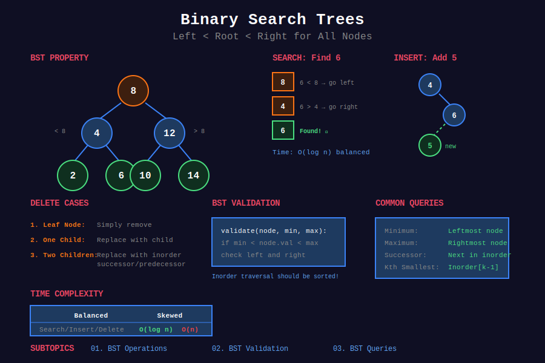
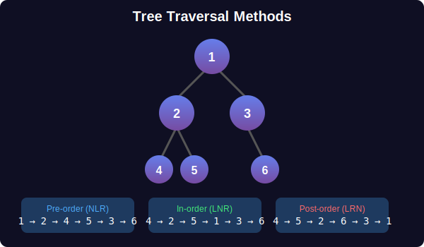

<div align="center">

# 🔍 Binary Search Trees



<p>
  
  
  
</p>

**Ordered binary tree enabling O(log n) search, insert, and delete**

[⬅️ Previous: Trees](../07_trees/README.md) | [🏠 Home](../README.md) | [Next: Heaps ➡️](../09_heaps/README.md)

</div>

---

## 📊 Visual Overview

<div align="center">



</div>

---

## 📐 Mathematical Foundation

### 1️⃣ BST Property

For every node $x$:

```math
\boxed{\forall y \in T_L(x): y.val < x.val < z.val \; \forall z \in T_R(x)}

```

**Left subtree:** All values less than node
**Right subtree:** All values greater than node

---

### 2️⃣ Time Complexity

| Operation | Average | Worst (Skewed) | Balanced |
|-----------|:-------:|:--------------:|:--------:|
| Search | O(log n) | O(n) | O(log n) |
| Insert | O(log n) | O(n) | O(log n) |
| Delete | O(log n) | O(n) | O(log n) |
| Min/Max | O(log n) | O(n) | O(log n) |

**Balanced BSTs (AVL, Red-Black):** Guarantee O(log n) height.

---

### 3️⃣ BST Height Bounds

**Best case (balanced):**

```math
h_{min} = \lfloor \log_2 n \rfloor

```

**Worst case (skewed):**

```math
h_{max} = n - 1

```

**Average case (random insertions):**

```math
E[h] = O(\log n)

```

---

### 4️⃣ Inorder Traversal = Sorted Order

**Theorem:** Inorder traversal of BST produces sorted sequence.

**Proof:**

- Inorder visits: Left → Node → Right

- BST property: Left < Node < Right

- By induction, entire sequence is sorted ∎

---

### 5️⃣ Successor and Predecessor

**Successor of x (next larger):**

```math
\text{succ}(x) = \begin{cases}
\min(T_R(x)) & \text{if right subtree exists} \\
\text{first ancestor where } x \text{ is in left subtree} & \text{otherwise}
\end{cases}

```

**Predecessor of x (next smaller):**

```math
\text{pred}(x) = \begin{cases}
\max(T_L(x)) & \text{if left subtree exists} \\
\text{first ancestor where } x \text{ is in right subtree} & \text{otherwise}
\end{cases}

```

---

### 6️⃣ BST Validation

**Condition:** Each node must be within valid range.

```math
\text{isValidBST}(node, min, max) = min < node.val < max

```

---

### 7️⃣ Kth Smallest Element

**Using augmented BST:**

Store subtree size at each node.

```math
\text{rank}(x) = \text{size}(T_L(x)) + 1

```

**Search:** O(h) with size augmentation.

---

### 8️⃣ BST from Sorted Array

**Balanced BST:** Use middle element as root recursively.

```math
\text{root} = arr[mid], \quad mid = \lfloor (left + right) / 2 \rfloor

```

**Time:** O(n), **Height:** O(log n)

---

## 📂 Subtopics Navigation

| # | Topic | Problems | Link |
|:-:|-------|:--------:|------|
| 1 | BST Operations | 10+ | [📖 Go →](./01_bst_operations/README.md) |
| 2 | BST Validation | 8+ | [📖 Go →](./02_bst_validation/README.md) |
| 3 | BST Queries | 10+ | [📖 Go →](./03_bst_queries/README.md) |

---

## 🎯 Key Patterns

### BST Search

```python
def searchBST(root: TreeNode, val: int) -> TreeNode:
    """
    Search in BST.
    
    Use BST property to eliminate half at each step.
    
    Time: O(h), Space: O(1)
    """
    while root and root.val != val:
        root = root.left if val < root.val else root.right
    return root

```

### BST Insert

```python
def insertIntoBST(root: TreeNode, val: int) -> TreeNode:
    """
    Insert value into BST.
    
    Time: O(h), Space: O(h) recursive
    """
    if not root:
        return TreeNode(val)
    
    if val < root.val:
        root.left = insertIntoBST(root.left, val)
    else:
        root.right = insertIntoBST(root.right, val)
    
    return root

```

### BST Delete

```python
def deleteNode(root: TreeNode, key: int) -> TreeNode:
    """
    Delete value from BST.
    
    Three cases: leaf, one child, two children.
    
    Time: O(h), Space: O(h)
    """
    if not root:
        return None
    
    if key < root.val:
        root.left = deleteNode(root.left, key)
    elif key > root.val:
        root.right = deleteNode(root.right, key)
    else:
        # Node to delete found
        if not root.left:
            return root.right
        if not root.right:
            return root.left
        
        # Two children: replace with successor
        successor = root.right
        while successor.left:
            successor = successor.left
        root.val = successor.val
        root.right = deleteNode(root.right, successor.val)
    
    return root

```

---

## 🏆 LeetCode Problems

### 🟢 Easy

| # | Problem | Pattern | Time | Space |
|:-:|---------|---------|:----:|:-----:|
| 108 | [Convert Sorted Array to BST](https://leetcode.com/problems/convert-sorted-array-to-binary-search-tree/) | Binary Split | O(n) | O(log n) |
| 235 | [LCA of BST](https://leetcode.com/problems/lowest-common-ancestor-of-a-binary-search-tree/) | BST Property | O(h) | O(1) |
| 530 | [Minimum Absolute Difference](https://leetcode.com/problems/minimum-absolute-difference-in-bst/) | Inorder | O(n) | O(h) |
| 700 | [Search in BST](https://leetcode.com/problems/search-in-a-binary-search-tree/) | Binary Search | O(h) | O(1) |
| 783 | [Minimum Distance Between BST Nodes](https://leetcode.com/problems/minimum-distance-between-bst-nodes/) | Inorder | O(n) | O(h) |

### 🟡 Medium

| # | Problem | Pattern | Time | Space |
|:-:|---------|---------|:----:|:-----:|
| 98 | [Validate Binary Search Tree](https://leetcode.com/problems/validate-binary-search-tree/) | Range Check | O(n) | O(h) |
| 173 | [BST Iterator](https://leetcode.com/problems/binary-search-tree-iterator/) | Controlled Inorder | O(1)* | O(h) |
| 230 | [Kth Smallest Element](https://leetcode.com/problems/kth-smallest-element-in-a-bst/) | Inorder | O(h+k) | O(h) |
| 285 | [Inorder Successor in BST](https://leetcode.com/problems/inorder-successor-in-bst/) | BST Property | O(h) | O(1) |
| 450 | [Delete Node in BST](https://leetcode.com/problems/delete-node-in-a-bst/) | Three Cases | O(h) | O(h) |
| 501 | [Find Mode in BST](https://leetcode.com/problems/find-mode-in-binary-search-tree/) | Inorder | O(n) | O(1) |
| 538 | [Convert BST to Greater Tree](https://leetcode.com/problems/convert-bst-to-greater-tree/) | Reverse Inorder | O(n) | O(h) |
| 653 | [Two Sum IV - BST](https://leetcode.com/problems/two-sum-iv-input-is-a-bst/) | Inorder + Two Pointers | O(n) | O(n) |
| 669 | [Trim a BST](https://leetcode.com/problems/trim-a-binary-search-tree/) | Recursion | O(n) | O(h) |
| 701 | [Insert into BST](https://leetcode.com/problems/insert-into-a-binary-search-tree/) | BST Property | O(h) | O(h) |
| 1038 | [BST to Greater Sum Tree](https://leetcode.com/problems/binary-search-tree-to-greater-sum-tree/) | Reverse Inorder | O(n) | O(h) |

### 🔴 Hard

| # | Problem | Pattern | Time | Space |
|:-:|---------|---------|:----:|:-----:|
| 99 | [Recover Binary Search Tree](https://leetcode.com/problems/recover-binary-search-tree/) | Inorder Detect | O(n) | O(h) |

---

## 📊 BST Pattern Decision

```
BST Problem
     |
     +-- Search/Insert/Delete → Use BST property (O(h))
     |
     +-- Sorted order needed → Inorder traversal
     |
     +-- Range queries → Validate with bounds
     |
     +-- Kth element → Inorder with count

```

---

---

## 💡 Key Insights & Pro Tips

> **🎯 Inorder = Sorted:** BST inorder traversal gives sorted sequence. Key for validation, kth smallest!

> **⚡ BST Property = Binary Search:** Compare with node, go left/right. O(log n) in balanced tree!

> **🔄 Delete = 3 Cases:** Leaf (easy), one child (replace), two children (use successor)!

> **📊 Validation Needs Bounds:** Not just left < node < right. Must check ENTIRE subtree ranges!

> **🌊 Reverse Inorder = Descending:** Right → Node → Left gives descending order. Useful for greater sum tree!

---

## 🧮 Quick Pattern Reference

| Pattern in Problem | Technique | Example |
|-------------------|-----------|---------|
| "search in BST" | Binary search tree | #700 |
| "insert into BST" | Recursive placement | #701 |
| "delete from BST" | Three cases | #450 |
| "validate BST" | Range checking | #98 |
| "kth smallest" | Inorder with count | #230 |
| "inorder successor" | BST navigation | #285 |
| "convert to greater tree" | Reverse inorder | #538, #1038 |
| "sorted array to BST" | Binary split | #108 |
| "LCA in BST" | BST property | #235 |
| "two sum in BST" | Inorder + pointers | #653 |

---

## 🎯 Must-Solve Problems (Top 15)

| # | Problem | Category | Difficulty | Why Important |
|:-:|---------|----------|------------|---------------|
| 1 | [Search in BST](https://leetcode.com/problems/search-in-a-binary-search-tree/) | Operations | 🟢 Easy | BST foundation |
| 2 | [Insert into BST](https://leetcode.com/problems/insert-into-a-binary-search-tree/) | Operations | 🟡 Medium | Basic operation |
| 3 | [Delete Node](https://leetcode.com/problems/delete-node-in-a-bst/) | Operations | 🟡 Medium | Three cases |
| 4 | [Validate BST](https://leetcode.com/problems/validate-binary-search-tree/) | Validation | 🟡 Medium | Classic problem |
| 5 | [Kth Smallest](https://leetcode.com/problems/kth-smallest-element-in-a-bst/) | Queries | 🟡 Medium | Inorder pattern |
| 6 | [LCA of BST](https://leetcode.com/problems/lowest-common-ancestor-of-a-binary-search-tree/) | Queries | 🟢 Easy | BST property |
| 7 | [Sorted Array to BST](https://leetcode.com/problems/convert-sorted-array-to-binary-search-tree/) | Construction | 🟢 Easy | Build balanced |
| 8 | [BST Iterator](https://leetcode.com/problems/binary-search-tree-iterator/) | Design | 🟡 Medium | Controlled inorder |
| 9 | [Inorder Successor](https://leetcode.com/problems/inorder-successor-in-bst/) | Queries | 🟡 Medium | Navigation |
| 10 | [Convert to Greater Tree](https://leetcode.com/problems/convert-bst-to-greater-tree/) | Transformation | 🟡 Medium | Reverse inorder |
| 11 | [Two Sum IV](https://leetcode.com/problems/two-sum-iv-input-is-a-bst/) | Queries | 🟢 Easy | Inorder + hash |
| 12 | [Trim BST](https://leetcode.com/problems/trim-a-binary-search-tree/) | Operations | 🟡 Medium | Range pruning |
| 13 | [Min Absolute Difference](https://leetcode.com/problems/minimum-absolute-difference-in-bst/) | Queries | 🟢 Easy | Consecutive inorder |
| 14 | [Find Mode](https://leetcode.com/problems/find-mode-in-binary-search-tree/) | Queries | 🟡 Medium | Frequency tracking |
| 15 | [Recover BST](https://leetcode.com/problems/recover-binary-search-tree/) | Validation | 🔴 Hard | Detect swapped |

---

## 📚 References & Learning Resources

### 📖 Books & Courses

| Resource | Description | Link |
|----------|-------------|------|
| **CLRS Chapter 12** | Binary search trees | [MIT Press](https://mitpress.mit.edu/books/introduction-algorithms) |
| **Algorithms 4th Edition** | BST implementations | [Book Site](https://algs4.cs.princeton.edu/) |
| **Competitive Programming 3** | Chapter 2.3 - BST | [Book](https://cpbook.net/) |

### 🌐 Online Tutorials

| Resource | Description | Link |
|----------|-------------|------|
| **GeeksforGeeks** | BST complete guide | [Tutorial](https://www.geeksforgeeks.org/binary-search-tree-data-structure/) |
| **LeetCode Explore** | BST card | [Course](https://leetcode.com/explore/learn/card/introduction-to-data-structure-binary-search-tree/) |
| **VisuAlgo** | Interactive BST | [Website](https://visualgo.net/en/bst) |
| **HackerRank** | BST challenges | [Practice](https://www.hackerrank.com/domains/data-structures?filters%5Bsubdomains%5D%5B%5D=trees) |

### 📺 Video Resources

| Resource | Topic | Link |
|----------|-------|------|
| **NeetCode** | BST playlist | [YouTube](https://www.youtube.com/playlist?list=PLot-Xpze53ldg4pN6PfzoJY7KsKcxF1jg) |
| **Abdul Bari** | BST lectures | [YouTube](https://www.youtube.com/watch?v=pYT9F8_LFTM) |
| **MIT OCW** | Binary search trees | [Lecture](https://ocw.mit.edu/courses/6-006-introduction-to-algorithms-fall-2011/) |
| **Back To Back SWE** | BST problems | [YouTube](https://www.youtube.com/playlist?list=PLiQ766zSC5jND9vxch5-zT7GuMigiWaV_) |
| **William Fiset** | BST algorithms | [YouTube](https://www.youtube.com/watch?v=JfSdGQdAzq8) |

### 📝 Practice Platforms

| Platform | Focus | Link |
|----------|-------|------|
| **LeetCode** | BST tag | [Problems](https://leetcode.com/tag/binary-search-tree/) |
| **HackerRank** | BST challenges | [Practice](https://www.hackerrank.com/domains/data-structures?filters%5Bsubdomains%5D%5B%5D=trees) |
| **Codeforces** | BST problems | [Problemset](https://codeforces.com/problemset?tags=trees) |
| **CodeChef** | BST practice | [Practice](https://www.codechef.com/practice) |

### 🔬 Advanced Topics

| Topic | Description | Link |
|-------|-------------|------|
| **AVL Trees** | Self-balancing BST | [Tutorial](https://www.geeksforgeeks.org/avl-tree-set-1-insertion/) |
| **Red-Black Trees** | Another balanced BST | [Wikipedia](https://en.wikipedia.org/wiki/Red%E2%80%93black_tree) |
| **Splay Trees** | Self-adjusting BST | [Wikipedia](https://en.wikipedia.org/wiki/Splay_tree) |
| **B-Trees** | Generalized BST | [Tutorial](https://www.geeksforgeeks.org/introduction-of-b-tree-2/) |
| **Treap** | Randomized BST | [CP-Algorithms](https://cp-algorithms.com/data_structures/treap.html) |

### 🎯 Problem Collections

| Collection | Focus | Link |
|-----------|-------|------|
| **NeetCode 150** | Essential BST | [List](https://neetcode.io/practice) |
| **Blind 75** | Core interview | [List](https://www.teamblind.com/post/New-Year-Gift---Curated-List-of-Top-75-LeetCode-Questions-to-Save-Your-Time-OaM1orEU) |
| **Grind 75** | Structured prep | [Guide](https://www.techinterviewhandbook.org/grind75) |
| **Striver's SDE Sheet** | Must-do BST | [Sheet](https://takeuforward.org/interviews/strivers-sde-sheet-top-coding-interview-problems/) |

### 📊 Visualization Tools

| Tool | Purpose | Link |
|------|---------|------|
| **VisuAlgo** | BST operations | [Website](https://visualgo.net/en/bst) |
| **Algorithm Visualizer** | BST algorithms | [Website](https://algorithm-visualizer.org/) |
| **CS Animations** | BST visualizations | [Website](https://www.cs.usfca.edu/~galles/visualization/BST.html) |

### 🏆 Competition Resources

| Resource | Topic | Link |
|----------|-------|------|
| **USACO Guide** | BST guide | [Guide](https://usaco.guide/silver/intro-tree) |
| **TopCoder** | BST tutorials | [Tutorials](https://www.topcoder.com/thrive/articles/) |
| **Codeforces EDU** | Tree courses | [Course](https://codeforces.com/edu/course/2) |

---

## 🎖️ Interview Success Tips

### Common Mistakes to Avoid

❌ **Don't:**

- Validate BST by only checking immediate children

- Forget to handle duplicate values (usually not allowed)

- Use global variables for tracking state

- Forget the three cases in deletion

- Ignore that inorder gives sorted sequence

✅ **Do:**

- Validate with min/max bounds for entire subtree

- Clarify if duplicates allowed (usually no)

- Pass state through parameters or return values

- Master deletion: leaf, one child, two children

- Use inorder for sorted-order problems

### Optimization Checklist

```
[ ] Can I use BST property to eliminate half the search space?
[ ] Do I need inorder traversal (sorted order)?
[ ] Should I use iterative instead of recursive (space)?
[ ] Can I solve in O(h) instead of O(n)?
[ ] Do I need to augment nodes with extra info (size, height)?
[ ] Is this a balanced BST (guaranteed O(log n))?

```

---

## 🌟 Motivational Corner

> "BST combines the elegance of binary search with the flexibility of linked structures!"

**Progress Tracker:**

- 🥉 **Bronze:** Solve 10 BST problems

- 🥈 **Silver:** Solve 20 BST problems + master operations

- 🥇 **Gold:** Solve 30 BST problems + validation patterns

- 💎 **Platinum:** Master all patterns + balanced trees

**Remember:** BST property enables O(log n) operations. That's the power of ordering! 🚀

---

<div align="center">

### 🌟 If this helped you, give it a ⭐ on GitHub! 🌟

**Made with ❤️ for the coding community by [Gaurav Goswami](https://github.com/Gaurav14cs17)**

[⬅️ Previous: Trees](../07_trees/README.md) | [🏠 Home](../README.md) | [Next: Heaps ➡️](../09_heaps/README.md)

---

*Last Updated: December 2025*  
*Licensed under MIT*  
*Happy Coding! 💻✨*

</div>
