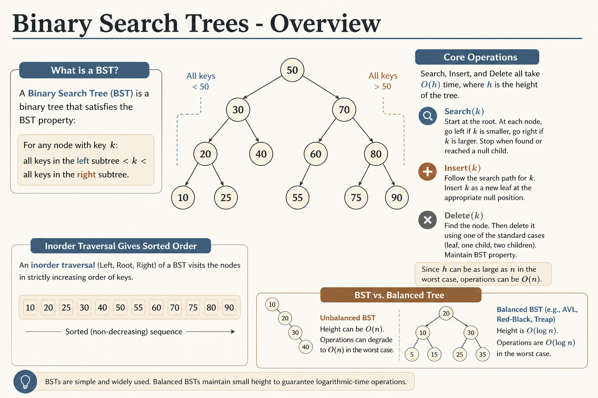
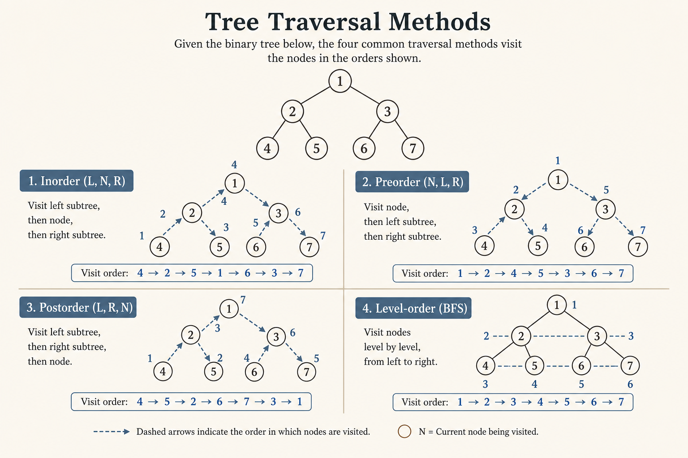

<div align="center">

# 🔍 Binary Search Trees

### *Ordered binary tree enabling O(log n) search, insert, and delete*


<p>
  
  
  
</p>

**Ordered binary tree enabling O(log n) search, insert, and delete**

[⬅️ Previous: Trees](../07_trees/README.md) | [🏠 Home](../README.md) | [Next: Heaps ➡️](../09_heaps/README.md)

</div>

---

## 📊 Visual Overview

<div align="center">





*Binary Search Tree*

</div>

---

## 🎯 At a Glance

| | |
|:---|:---|
| **In one line** | Ordered binary tree enabling O(log n) search, insert, and delete |
| **Difficulty** | Medium |
| **Subtopics** | 3 |
| **Problems** | 25+ |

> **How to use this page:** Start with the visual overview, scan **At a Glance**, then work through theory → walkthroughs → code.

---

## 📂 Subtopics Navigation

| # | Topic | Problems | Link |
|:-:|-------|:--------:|------|
| 1 | BST Operations | 10+ | [📖 Go →](./01_bst_operations/README.md) |
| 2 | BST Validation | 8+ | [📖 Go →](./02_bst_validation/README.md) |
| 3 | BST Queries | 10+ | [📖 Go →](./03_bst_queries/README.md) |

---

## 📐 Mathematical Foundation

### 1️⃣ BST Property

For every node $x$:

$$\boxed{\forall y \in T_L(x): y.val < x.val < z.val \; \forall z \in T_R(x)}$$

**Left subtree:** All values less than node
**Right subtree:** All values greater than node

---

### 2️⃣ Time Complexity

| Operation | Average | Worst (Skewed) | Balanced |
|-----------|:-------:|:--------------:|:--------:|
| Search | O(log n) | O(n) | O(log n) |
| Insert | O(log n) | O(n) | O(log n) |
| Delete | O(log n) | O(n) | O(log n) |
| Min/Max | O(log n) | O(n) | O(log n) |

**Balanced BSTs (AVL, Red-Black):** Guarantee O(log n) height.

---

### 3️⃣ BST Height Bounds

**Best case (balanced):**

$$h_{min} = \lfloor \log_2 n \rfloor$$

**Worst case (skewed):**

$$h_{max} = n - 1$$

**Average case (random insertions):**

$$E[h] = O(\log n)$$

---

### 4️⃣ Inorder Traversal = Sorted Order

**Theorem:** Inorder traversal of BST produces sorted sequence.

**Proof:**

- Inorder visits: Left → Node → Right

- BST property: Left < Node < Right

- By induction, entire sequence is sorted ∎

---

### 5️⃣ Successor and Predecessor

**Successor of x (next larger):**

$$\text{succ}(x) = \begin{cases}
\min(T_R(x)) & \text{if right subtree exists} \\
\text{first ancestor where } x \text{ is in left subtree} & \text{otherwise}
\end{cases}$$

**Predecessor of x (next smaller):**

$$\text{pred}(x) = \begin{cases}
\max(T_L(x)) & \text{if left subtree exists} \\
\text{first ancestor where } x \text{ is in right subtree} & \text{otherwise}
\end{cases}$$

---

### 6️⃣ BST Validation

**Condition:** Each node must be within valid range.

$$\text{isValidBST}(node, min, max) = min < node.val < max$$

---

### 7️⃣ Kth Smallest Element

**Using augmented BST:**

Store subtree size at each node.

$$\text{rank}(x) = \text{size}(T_L(x)) + 1$$

**Search:** O(h) with size augmentation.

---

### 8️⃣ BST from Sorted Array

**Balanced BST:** Use middle element as root recursively.

$$\text{root} = arr[mid], \quad mid = \lfloor (left + right) / 2 \rfloor$$

**Time:** O(n), **Height:** O(log n)

---

## 🎯 Key Patterns

### BST Search

```python
def searchBST(root: TreeNode, val: int) -> TreeNode:
    """
    Search in BST.
    
    Use BST property to eliminate half at each step.
    
    Time: O(h), Space: O(1)
    """
    while root and root.val != val:
        root = root.left if val < root.val else root.right
    return root
```

### BST Insert

```python
def insertIntoBST(root: TreeNode, val: int) -> TreeNode:
    """
    Insert value into BST.
    
    Time: O(h), Space: O(h) recursive
    """
    if not root:
        return TreeNode(val)
    
    if val < root.val:
        root.left = insertIntoBST(root.left, val)
    else:
        root.right = insertIntoBST(root.right, val)
    
    return root
```

### BST Delete

```python
def deleteNode(root: TreeNode, key: int) -> TreeNode:
    """
    Delete value from BST.
    
    Three cases: leaf, one child, two children.
    
    Time: O(h), Space: O(h)
    """
    if not root:
        return None
    
    if key < root.val:
        root.left = deleteNode(root.left, key)
    elif key > root.val:
        root.right = deleteNode(root.right, key)
    else:
        # Node to delete found
        if not root.left:
            return root.right
        if not root.right:
            return root.left
        
        # Two children: replace with successor
        successor = root.right
        while successor.left:
            successor = successor.left
        root.val = successor.val
        root.right = deleteNode(root.right, successor.val)
    
    return root
```

### Pattern Decision Tree

```text
BST Problem
     |
 Search    Insert    Delete    Validate
```


### Pattern Checklist

- [ ] Can I use BST property to eliminate half the search space?
- [ ] Do I need inorder traversal (sorted order)?
- [ ] Should I use iterative instead of recursive (space)?
- [ ] Can I solve in O(h) instead of O(n)?
- [ ] Do I need to augment nodes with extra info (size, height)?
- [ ] Is this a balanced BST (guaranteed O(log n))?


---

## 🏆 LeetCode Problems

### 🟢 Easy

| # | Problem | Pattern | Time | Space |
|:-:|---------|---------|:----:|:-----:|
| 700 | [Search in BST](https://leetcode.com/problems/search-in-a-binary-search-tree/) | BST Search | O(h) | O(h) |
| 938 | [Range Sum of BST](https://leetcode.com/problems/range-sum-of-bst/) | DFS | O(n) | O(h) |
| 108 | [Convert Sorted Array to BST](https://leetcode.com/problems/convert-sorted-array-to-binary-search-tree/) | Recursion | O(n) | O(n) |

### 🟡 Medium

| # | Problem | Pattern | Time | Space |
|:-:|---------|---------|:----:|:-----:|
| 98 | [Validate BST](https://leetcode.com/problems/validate-binary-search-tree/) | Inorder/Bounds | O(n) | O(h) |
| 230 | [Kth Smallest in BST](https://leetcode.com/problems/kth-smallest-element-in-a-bst/) | Inorder | O(n) | O(h) |
| 450 | [Delete Node in BST](https://leetcode.com/problems/delete-node-in-a-bst/) | BST Delete | O(h) | O(h) |
| 501 | [Find Mode in BST](https://leetcode.com/problems/find-mode-in-binary-search-tree/) | Inorder | O(n) | O(h) |

### 🔴 Hard

| # | Problem | Pattern | Time | Space |
|:-:|---------|---------|:----:|:-----:|
| 99 | [Recover BST](https://leetcode.com/problems/recover-binary-search-tree/) | Inorder | O(n) | O(h) |

---

## 📚 References & Learning Resources

### 📖 Core Concepts

| Resource | Description | Link |
|----------|-------------|------|
| **Binary Search Tree** | Wikipedia | [BST](https://en.wikipedia.org/wiki/Binary_search_tree) |
| **GeeksforGeeks** | BST guide | [Tutorial](https://www.geeksforgeeks.org/binary-search-tree-data-structure/) |
| **LeetCode Explore** | BST card | [Explore Card](https://leetcode.com/explore/learn/card/introduction-to-data-structure-binary-search-tree/) |

### 📝 Practice

| Platform | Focus | Link |
|----------|-------|------|
| **LeetCode** | BST tag | [Problems](https://leetcode.com/tag/binary-search-tree/) |

---

## 🌟 Motivational Corner

> "BST combines the elegance of binary search with the flexibility of linked structures!"

**Progress Tracker:**

- 🥉 **Bronze:** Solve 10 BST problems

- 🥈 **Silver:** Solve 20 BST problems + master operations

- 🥇 **Gold:** Solve 30 BST problems + validation patterns

- 💎 **Platinum:** Master all patterns + balanced trees

**Remember:** BST property enables O(log n) operations. That's the power of ordering! 🚀

---

<div align="center">

### 🌟 If this helped you, give it a ⭐ on GitHub! 🌟

**Made with ❤️ for the coding community by [Gaurav Goswami](https://github.com/Gaurav14cs17)**

[⬅️ Previous: Trees](../07_trees/README.md) | [🏠 Home](../README.md) | [Next: Heaps ➡️](../09_heaps/README.md)

---

*Last Updated: December 2025*  
*Licensed under MIT*  
*Happy Coding! 💻✨*

</div>
