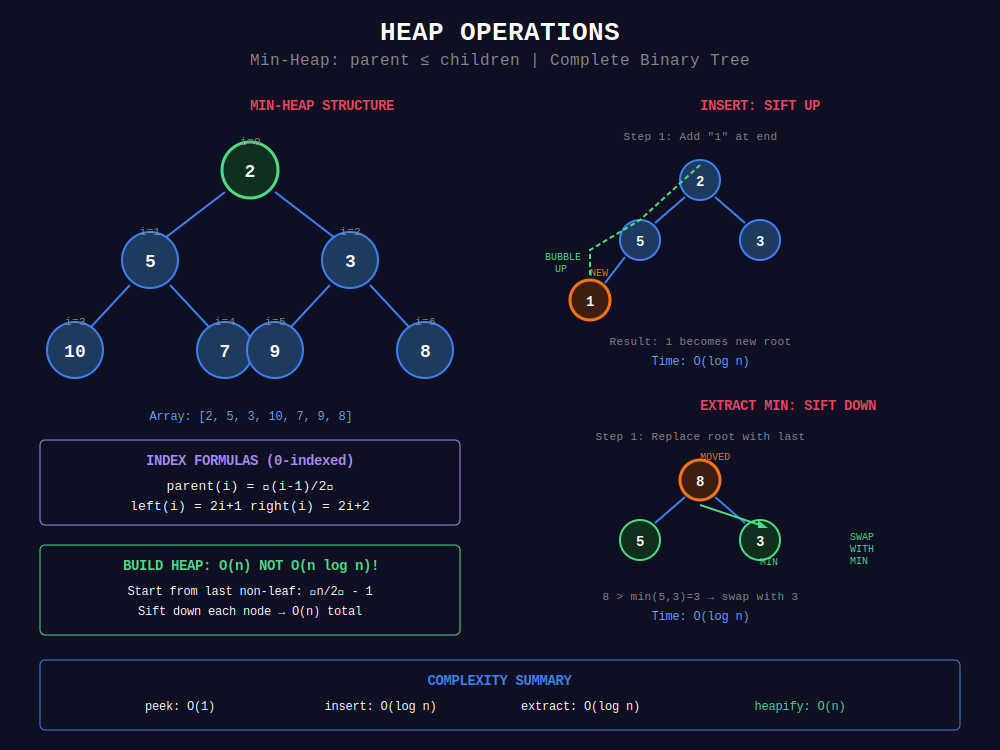

<div align="center">

# 📦 Basic Heap Operations

<p>
  
  
</p>

</div>

---

## 🧭 Navigation

| ⬅️ Previous | 📂 Current | ➡️ Next |
|:------------|:----------:|--------:|
| [🏠 Heaps Home](../README.md) | **01. Basic Heap** | [02. Top K Problems →](../02_top_k_problems/README.md) |

---

## 📐 Mathematical Foundations

### 1️⃣ Heap Property Maintenance

**Insert (Sift Up):**

```
Add at end → Bubble up until heap property restored

```

```math
\text{Time: } O(\log n)

```

**Extract (Sift Down):**

```
Replace root with last → Bubble down until heap property restored

```

```math
\text{Time: } O(\log n)

```

---

### 2️⃣ Index Formulas (0-indexed)

```math
\text{parent}(i) = \lfloor (i-1)/2 \rfloor
\text{left}(i) = 2i + 1
\text{right}(i) = 2i + 2

```

---

### 3️⃣ Build Heap Complexity Proof

Starting from last non-leaf node $\lfloor n/2 \rfloor - 1$:

```math
T(n) = \sum_{h=0}^{\log n} \frac{n}{2^{h+1}} \cdot O(h) = O(n)

```

**Key Insight:** Most nodes are near leaves (low height).

**Detailed Proof:**
- Level 0 (leaves): $n/2$ nodes, $h = 0$ → $O(0)$ work each

- Level 1: $n/4$ nodes, $h = 1$ → $O(1)$ work each

- Level 2: $n/8$ nodes, $h = 2$ → $O(2)$ work each

- ...

- Total: $\sum\_{h=0}^{\log n} \frac{n}{2^{h+1}} \cdot h = n \sum\_{h=0}^{\infty} \frac{h}{2^h} = O(n)$

The series $\sum\_{h=0}^{\infty} \frac{h}{2^h} = 2$, so $T(n) = O(n)$. ∎

---

### 4️⃣ Heap Sort Time Complexity

**Two phases:**
1. Build heap: $O(n)$
2. Extract max $n$ times: $n \times O(\log n) = O(n \log n)$

```math
\boxed{T(n) = O(n) + O(n \log n) = O(n \log n)}

```

**Space:** $O(1)$ in-place (better than merge sort!)

---

### 5️⃣ Sift Up vs Sift Down

| Operation | Direction | When Used | Time |
|-----------|-----------|-----------|------|
| **Sift Up** | Child → Parent | After insertion | O(log n) |
| **Sift Down** | Parent → Child | After extraction, heapify | O(log n) |

**Sift Up Invariant:** New element bubbles up until parent ≥ child (min-heap).

**Sift Down Invariant:** Element sinks down until smaller than both children.

---

### 6️⃣ Huffman Coding (Heap Application)

**Problem:** Optimal prefix-free encoding.

**Algorithm:**
1. Build min-heap of character frequencies
2. Extract two minimum, merge, insert back
3. Repeat until one node remains

```math
\text{Time: } O(n \log n)

```

**Why Optimal?** Greedy choice: combine least frequent first minimizes weighted path length.

---

### 7️⃣ Kth Largest in Stream

**Maintain min-heap of size k:**

```math
\text{answer} = \text{heap}[0]

```

**Invariant:** Heap contains k largest elements seen so far.

**Why Min-Heap?** Root is smallest of k largest → k-th largest overall!

---

## 🎨 Visual Algorithm Walkthroughs

<div align="center">



</div>

### ⬆️ **Walkthrough 1: Heap Insert (Sift Up)**

```
Insert 2 into min-heap:

Initial heap: [3, 5, 8, 10, 7, 9]

       3
      / \
     5   8
    / \ /
   10 7 9

Step 1: Add 2 at end
       3
      / \
     5   8
    / \ / \
   10 7 9  2

Array: [3, 5, 8, 10, 7, 9, 2]
         parent(6) = (6-1)/2 = 2

Step 2: Compare with parent 8
        2 < 8, swap!

       3
      / \
     5   2
    / \ / \
   10 7 9  8

Step 3: Compare with parent 3
        2 < 3, swap!

       2
      / \
     5   3
    / \ / \
   10 7 9  8

Done! Heap property restored.

```

---

### ⬇️ **Walkthrough 2: Heap Extract (Sift Down)**

```
Extract minimum from min-heap:

Initial heap: [2, 5, 3, 10, 7, 9, 8]

       2
      / \
     5   3
    / \ / \
   10 7 9  8

Step 1: Save root 2 (return value)
        Replace root with last element 8

       8
      / \
     5   3
    / \ /
   10 7 9

Step 2: Compare 8 with children 5 and 3
        min(5, 3) = 3 < 8, swap with 3!

       3
      / \
     5   8
    / \ /
   10 7 9

Step 3: Compare 8 with child 9
        9 > 8, stop!

Done! Return 2, heap property restored.

```

---

### 🏗️ **Walkthrough 3: Build Heap (Heapify)**

```
Build min-heap from [9, 5, 6, 2, 3]:

Initial array: [9, 5, 6, 2, 3]
           9
          / \
         5   6
        / \
       2   3

Last non-leaf: floor(5/2) - 1 = 1

Step 1: Heapify at index 1 (value 5)
        Children: 2, 3
        min(2, 3) = 2 < 5, swap!
           9
          / \
         2   6
        / \
       5   3

Step 2: Heapify at index 0 (value 9)
        Children: 2, 6
        min(2, 6) = 2 < 9, swap!
           2
          / \
         9   6
        / \
       5   3

Step 3: After swap, heapify at index 1 (value 9)
        Children: 5, 3
        min(5, 3) = 3 < 9, swap!
           2
          / \
         3   6
        / \
       5   9

Final min-heap: [2, 3, 6, 5, 9] ✓
Time: O(n), not O(n log n)!

```

---

### 🪨 **Walkthrough 4: Last Stone Weight**

```
Stones: [2, 7, 4, 1, 8, 1]

Use max-heap (negate in Python):
heap = [-8, -7, -4, -2, -1, -1]

Round 1: Extract -8 and -7 → smash → 8-7=1, push -1
heap = [-4, -2, -1, -1, -1]

Round 2: Extract -4 and -2 → smash → 4-2=2, push -2
heap = [-2, -1, -1, -1]

Round 3: Extract -2 and -1 → smash → 2-1=1, push -1
heap = [-1, -1, -1]

Round 4: Extract -1 and -1 → same → nothing
heap = [-1]

Answer: 1 (last remaining stone)

```

---

## 🎯 Pattern Recognition Guide

| Scenario | Heap Type | Why | Example |
|----------|-----------|-----|---------|
| **Need repeated min** | Min-Heap | O(1) access to min | Dijkstra, tasks |
| **Need repeated max** | Max-Heap | O(1) access to max | #1046 stones |
| **Combine smallest** | Min-Heap | Greedy: merge smallest first | #1167 sticks |
| **k largest in stream** | Min-Heap size k | Root = k-th largest | #703 |
| **Priority scheduling** | Priority Queue | Order by priority | Task scheduler |
| **Heap sort** | Max-Heap | Extract max repeatedly | Sorting |

### When to Use Each Operation

```
Problem mentions:
+-- "smallest/minimum repeatedly" → Min-Heap
+-- "largest/maximum repeatedly" → Max-Heap
+-- "k-th largest" → Min-Heap size k
+-- "merge smallest pairs" → Min-Heap (Huffman)
+-- "schedule by priority" → Priority Queue
+-- "sort in-place" → Heap Sort

```

---

## 💻 Code Implementations

```python
import heapq

class MinHeap:
    """
    Min-Heap implementation using Python's heapq.
    """
    def __init__(self):
        self.heap = []
    
    def push(self, val):
        """Insert value. O(log n)"""
        heapq.heappush(self.heap, val)
    
    def pop(self):
        """Extract minimum. O(log n)"""
        return heapq.heappop(self.heap)
    
    def peek(self):
        """Get minimum. O(1)"""
        return self.heap[0] if self.heap else None
    
    def __len__(self):
        return len(self.heap)

class MaxHeap:
    """
    Max-Heap using negation trick.
    """
    def __init__(self):
        self.heap = []
    
    def push(self, val):
        heapq.heappush(self.heap, -val)
    
    def pop(self):
        return -heapq.heappop(self.heap)
    
    def peek(self):
        return -self.heap[0] if self.heap else None

def heapSort(arr: list[int]) -> list[int]:
    """
    Heap sort using heapify + extract.
    
    Time: O(n log n), Space: O(1) for in-place
    """
    heapq.heapify(arr)  # O(n)
    return [heapq.heappop(arr) for _ in range(len(arr))]  # O(n log n)

def lastStoneWeight(stones: list[int]) -> int:
    """
    Last Stone Weight - smash two heaviest.
    
    Use max-heap, repeatedly extract two largest.
    
    Time: O(n log n), Space: O(n)
    """
    # Convert to max-heap using negation
    heap = [-s for s in stones]
    heapq.heapify(heap)
    
    while len(heap) > 1:
        first = -heapq.heappop(heap)
        second = -heapq.heappop(heap)
        
        if first != second:
            heapq.heappush(heap, -(first - second))
    
    return -heap[0] if heap else 0

```

---

## 🏆 LeetCode Problems

### 🟢 Easy

| # | Problem | Pattern | Time | Space |
|:-:|---------|---------|:----:|:-----:|
| 703 | [Kth Largest Element in Stream](https://leetcode.com/problems/kth-largest-element-in-a-stream/) | Min-Heap | O(log k) | O(k) |
| 1046 | [Last Stone Weight](https://leetcode.com/problems/last-stone-weight/) | Max-Heap | O(n log n) | O(n) |

### 🟡 Medium

| # | Problem | Pattern | Time | Space |
|:-:|---------|---------|:----:|:-----:|
| 1167 | [Minimum Cost to Connect Sticks](https://leetcode.com/problems/minimum-cost-to-connect-sticks/) | Min-Heap | O(n log n) | O(n) |

---

---

## 💡 Pro Tips & Common Mistakes

### ✅ **Do's:**

- ✓ Know build heap is O(n), not O(n log n)!

- ✓ Use heapify() for bulk insertion

- ✓ Remember peek is O(1), extract is O(log n)

- ✓ For max-heap in Python: negate values

- ✓ Heap is O(log n) for insert/delete, BST can be O(n)

### ❌ **Don'ts:**

- ✗ Don't insert n elements one by one when you can heapify

- ✗ Don't confuse heap with BST (heap is NOT sorted!)

- ✗ Don't forget to negate when using max-heap in Python

- ✗ Don't assume heap gives sorted order (only top element)

- ✗ Don't use heap when you only need min/max once (just use min()/max())

### ⚡ **Optimization Tricks:**
1. **heapify() > n×push():** O(n) vs O(n log n)
2. **In-place heap sort:** O(1) space, better than merge sort
3. **Custom comparator:** Use tuples (priority, value)
4. **Heap vs Sorting:** Heap better when n >> k
5. **Replace() operation:** More efficient than pop() + push()

---

## 📚 References & Resources

### 📖 Books & Courses

| Resource | Description | Link |
|----------|-------------|------|
| **CLRS Chapter 6** | Heapsort & priority queues | [MIT Press](https://mitpress.mit.edu/books/introduction-algorithms) |
| **Princeton Algorithms** | Priority queues chapter | [Coursera](https://www.coursera.org/learn/algorithms-part1) |
| **Algorithm Design Manual** | Heap implementations | [Springer](https://www.algorist.com/) |

### 🌐 Online Tutorials

| Resource | Topic | Link |
|----------|-------|------|
| **GeeksforGeeks** | Binary heap basics | [Tutorial](https://www.geeksforgeeks.org/binary-heap/) |
| **VisuAlgo** | Interactive heap | [Website](https://visualgo.net/en/heap) |
| **Python heapq** | Module documentation | [Docs](https://docs.python.org/3/library/heapq.html) |
| **Programiz** | Heap data structure | [Tutorial](https://www.programiz.com/dsa/heap-data-structure) |
| **InterviewBit** | Heap tutorial | [Tutorial](https://www.interviewbit.com/tutorial/introduction-to-heap-data-structure/) |

### 📺 Video Resources

| Creator | Topic | Link |
|---------|-------|------|
| **Abdul Bari** | Heap insertion/deletion | [YouTube](https://www.youtube.com/watch?v=HqPJF2L5h9U) |
| **MIT OCW** | Priority queues lecture | [Lecture](https://ocw.mit.edu/courses/6-006-introduction-to-algorithms-fall-2011/) |
| **William Fiset** | Heap data structure | [YouTube](https://www.youtube.com/watch?v=t0Cq6tVNRBA) |
| **NeetCode** | Heap problems | [YouTube](https://www.youtube.com/watch?v=B7hVxCmfPtM) |
| **Tushar Roy** | Heap basics | [YouTube](https://www.youtube.com/watch?v=t0Cq6tVNRBA) |

### 🔧 Interactive Tools

| Tool | Purpose | Link |
|------|---------|------|
| **VisuAlgo Heap** | Visualize operations | [Website](https://visualgo.net/en/heap) |
| **CS Animations** | Heap visualizations | [Website](https://www.cs.usfca.edu/~galles/visualization/Heap.html) |
| **Algorithm Visualizer** | Heap algorithms | [Website](https://algorithm-visualizer.org/) |

### 📝 Practice Platforms

| Platform | Focus | Link |
|----------|-------|------|
| **LeetCode** | Heap/PQ tag | [Problems](https://leetcode.com/tag/heap-priority-queue/) |
| **HackerRank** | Heap challenges | [Practice](https://www.hackerrank.com/domains/data-structures?filters%5Bsubdomains%5D%5B%5D=heap) |
| **CodeChef** | Heap problems | [Practice](https://www.codechef.com/practice) |

---

## 🎯 Practice Roadmap

### **Phase 1: Foundations (Week 1)**

- [ ] Implement min-heap from scratch

- [ ] Implement max-heap with negation

- [ ] Understand sift up/down operations

- [ ] Solve: #1046 Last Stone Weight

### **Phase 2: Build & Heapify (Week 2)**

- [ ] Understand O(n) build heap proof

- [ ] Implement heapify from array

- [ ] Implement heap sort

- [ ] Solve: #703 Kth Largest in Stream

### **Phase 3: Applications (Week 3)**

- [ ] Huffman coding pattern

- [ ] Priority scheduling

- [ ] Solve: #1167 Minimum Cost to Connect Sticks

- [ ] Practice custom comparators

---

## ❓ Interview Deep-Dive Q&A

**Q1: Why is build heap O(n), not O(n log n)?**
- **A:** Most nodes are near leaves. Sum of heights converges: $\sum \frac{h}{2^h} = 2$. Sift down from bottom is faster!

**Q2: When to use heap vs sorting?**
- **A:** Heap if you need top-k from n items (O(n log k) vs O(n log n)). Sorting if you need all elements ordered.

**Q3: How to implement max-heap in Python?**
- **A:** heapq is min-heap only. Negate values: push(-x), then negate on pop: -heappop().

**Q4: What's the difference between heap and BST?**
- **A:** Heap: O(1) min/max, O(log n) insert. BST: O(log n) search, inorder gives sorted. Heap NOT for search!

**Q5: Can you delete arbitrary element from heap?**
- **A:** Yes, but O(n) to find it first. Replace with last, then sift up/down. Better to use indexed heap.

**Q6: Is heap sort stable?**
- **A:** No! Extract changes relative order of equal elements.

**Q7: How to implement heap without heapq?**
- **A:** Array-based: parent(i)=(i-1)//2, left(i)=2i+1, right(i)=2i+2. Implement sift_up/sift_down manually.

---

<div align="center">

### 🌟 Master heap basics — foundation for all heap problems! 🌟

**Made with ❤️ for the coding community by [Gaurav Goswami](https://github.com/Gaurav14cs17)**

</div>

---

## 🧭 Navigation

| ⬅️ Previous | 📂 Current | ➡️ Next |
|:------------|:----------:|--------:|
| [🏠 Heaps Home](../README.md) | **01. Basic Heap** | [02. Top K Problems →](../02_top_k_problems/README.md) |
