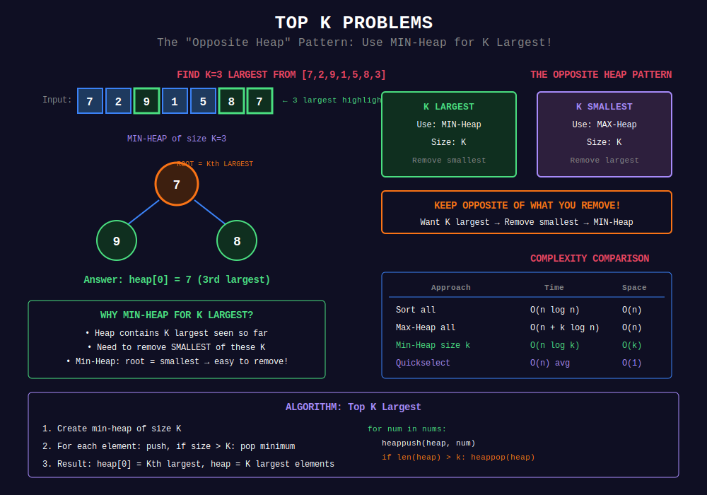

<div align="center">

# 🏆 Top K Problems

<p>
  
  
</p>

</div>

---

## 🧭 Navigation

| ⬅️ Previous | 📂 Current | ➡️ Next |
|:------------|:----------:|--------:|
| [← 01. Basic Heap](../01_basic_heap/README.md) | **02. Top K Problems** | [03. Merge K Streams →](../03_merge_k_streams/README.md) |

---

## 📐 Mathematical Foundations

### 1️⃣ Top K Strategy

**Finding K largest:** Use **Min-Heap** of size k.

$$
\text{Invariant: Heap contains k largest seen so far}
$$

**Why Min-Heap?** We need to quickly remove the smallest of top-k.

---

### 2️⃣ Complexity Analysis

| Approach | Time | Space |
|----------|:----:|:-----:|
| Sort | O(n log n) | O(n) |
| Max-Heap | O(n + k log n) | O(n) |
| Min-Heap of size k | O(n log k) | O(k) |
| Quickselect | O(n) avg | O(1) |

**Best for large n, small k:** Min-Heap of size k.

---

### 3️⃣ Kth Largest Formula

**Maintain heap of size k:**

$$
\text{answer} = \text{heap}[0] \text{ (root of min-heap)}
$$

---

### 4️⃣ Top K Frequent

**Two-phase approach:**

1. Count frequencies: O(n)
2. Top K by frequency: O(n log k) or O(n) with bucket sort

---

### 5️⃣ Why Opposite Heap? (The Key Insight!)

**For K largest → Use Min-Heap:**
- Want to keep k largest
- Need to remove smallest of these k
- Min-Heap root = smallest → easy to remove!

**For K smallest → Use Max-Heap:**
- Want to keep k smallest
- Need to remove largest of these k
- Max-Heap root = largest → easy to remove!

$$
\boxed{\text{Keep opposite of what you want to remove!}}
$$

---

### 6️⃣ Quickselect vs Heap

| Approach | Time (Average) | Time (Worst) | Space | When to Use |
|----------|:---:|:----:|:-----:|-------------|
| **Quickselect** | O(n) | O(n²) | O(1) | One-time k-th, acceptable worst case |
| **Min-Heap size k** | O(n log k) | O(n log k) | O(k) | Small k, streaming, guaranteed time |
| **Full Sort** | O(n log n) | O(n log n) | O(n) | Need all elements sorted |

---

### 7️⃣ Top K Frequent - Bucket Sort Optimization

**When frequency range is small:**

$$
\text{frequencies} \in [0, n] \implies \text{use bucket sort for } O(n)
$$

**Bucket i:** contains all elements with frequency i

Collect from highest bucket downward until k elements found!

---

## 🎨 Visual Pattern Guide

<div align="center">



</div>

---

## 💻 Code Implementations

```python
import heapq
from collections import Counter

def findKthLargest(nums: list[int], k: int) -> int:
    """
    Find kth largest element.
    
    Min-heap of size k: smallest in heap = kth largest.
    
    Time: O(n log k), Space: O(k)
    """
    heap = []
    
    for num in nums:
        heapq.heappush(heap, num)
        if len(heap) > k:
            heapq.heappop(heap)
    
    return heap[0]

def topKFrequent(nums: list[int], k: int) -> list[int]:
    """
    Find k most frequent elements.
    
    Approach 1: Min-heap by frequency
    Time: O(n log k), Space: O(n)
    """
    freq = Counter(nums)
    
    # Min-heap of (frequency, number)
    heap = []
    for num, count in freq.items():
        heapq.heappush(heap, (count, num))
        if len(heap) > k:
            heapq.heappop(heap)
    
    return [num for count, num in heap]

def topKFrequentBucket(nums: list[int], k: int) -> list[int]:
    """
    Find k most frequent elements using bucket sort.
    
    Time: O(n), Space: O(n)
    """
    freq = Counter(nums)
    
    # Bucket by frequency
    buckets = [[] for _ in range(len(nums) + 1)]
    for num, count in freq.items():
        buckets[count].append(num)
    
    # Collect from highest frequency
    result = []
    for i in range(len(buckets) - 1, -1, -1):
        for num in buckets[i]:
            result.append(num)
            if len(result) == k:
                return result
    
    return result

def kClosest(points: list[list[int]], k: int) -> list[list[int]]:
    """
    K closest points to origin.
    
    Max-heap of size k by distance.
    
    Time: O(n log k), Space: O(k)
    """

    # Max-heap: negate distance for max behavior
    heap = []
    
    for x, y in points:
        dist = -(x*x + y*y)  # Negate for max-heap
        heapq.heappush(heap, (dist, [x, y]))
        if len(heap) > k:
            heapq.heappop(heap)
    
    return [point for dist, point in heap]

class KthLargest:
    """
    Kth largest element in stream.
    
    Maintain min-heap of size k.
    """
    def __init__(self, k: int, nums: list[int]):
        self.k = k
        self.heap = nums
        heapq.heapify(self.heap)
        
        while len(self.heap) > k:
            heapq.heappop(self.heap)
    
    def add(self, val: int) -> int:
        heapq.heappush(self.heap, val)
        if len(self.heap) > self.k:
            heapq.heappop(self.heap)
        return self.heap[0]
```

---

## 🏆 LeetCode Problems

### 🟢 Easy

| # | Problem | Pattern | Time | Space |
|:-:|---------|---------|:----:|:-----:|
| 703 | [Kth Largest Element in a Stream](https://leetcode.com/problems/kth-largest-element-in-a-stream/) | Min-Heap size k | O(log k) | O(k) |

### 🟡 Medium

| # | Problem | Pattern | Time | Space |
|:-:|---------|---------|:----:|:-----:|
| 215 | [Kth Largest Element in Array](https://leetcode.com/problems/kth-largest-element-in-an-array/) | Quickselect/Heap | O(n) avg | O(1) |
| 347 | [Top K Frequent Elements](https://leetcode.com/problems/top-k-frequent-elements/) | Bucket/Heap | O(n) | O(n) |
| 451 | [Sort Characters By Frequency](https://leetcode.com/problems/sort-characters-by-frequency/) | Heap/Bucket | O(n) | O(n) |
| 692 | [Top K Frequent Words](https://leetcode.com/problems/top-k-frequent-words/) | Heap | O(n log k) | O(n) |
| 973 | [K Closest Points to Origin](https://leetcode.com/problems/k-closest-points-to-origin/) | Max-Heap | O(n log k) | O(k) |

---

## 📊 Top K Pattern Selection

```
Top K Problem
     |
     +-- K largest → Min-Heap of size k
     |
     +-- K smallest → Max-Heap of size k
     |
     +-- K most frequent → Count + Heap or Bucket Sort
     |
     +-- Exact kth → Quickselect O(n) avg
```

---

## 📚 References

| Resource | Link |
|----------|------|
| **Quickselect** | [Wikipedia](https://en.wikipedia.org/wiki/Quickselect) |
| **Top K Patterns** | [LeetCode Guide](https://leetcode.com/discuss/study-guide/1360400/) |

---

<div align="center">

**Made with ❤️ by [Gaurav Goswami](https://github.com/Gaurav14cs17)**

</div>

---

## 🧭 Navigation

| ⬅️ Previous | 📂 Current | ➡️ Next |
|:------------|:----------:|--------:|
| [← 01. Basic Heap](../01_basic_heap/README.md) | **02. Top K Problems** | [03. Merge K Streams →](../03_merge_k_streams/README.md) |
