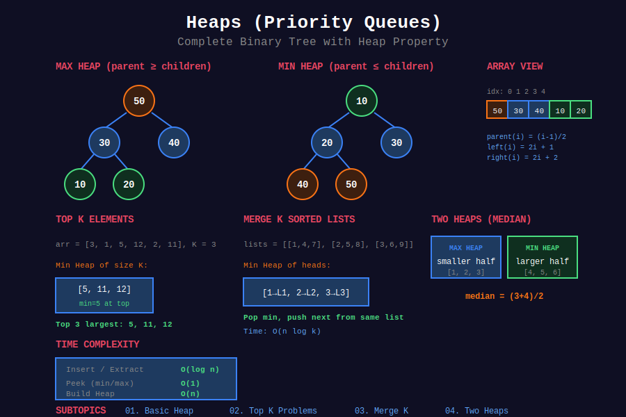

<div align="center">

# ⛰️ Heaps / Priority Queues



<p>
  
  
  
</p>

**Complete binary tree with heap property - O(log n) insert and extract**

[⬅️ Previous: BST](../08_binary_search_trees/README.md) | [🏠 Home](../README.md) | [Next: Graphs ➡️](../10_graphs/README.md)

</div>

---

## 📐 Mathematical Foundation

### 1️⃣ Heap Property

**Max-Heap:**

```math
\boxed{\forall i: A[\text{parent}(i)] \geq A[i]}

```

**Min-Heap:**

```math
\boxed{\forall i: A[\text{parent}(i)] \leq A[i]}

```

---

### 2️⃣ Array Representation

For 0-indexed array:

```math
\text{parent}(i) = \lfloor (i-1)/2 \rfloor
\text{left}(i) = 2i + 1
\text{right}(i) = 2i + 2

```

---

### 3️⃣ Height of Heap

For heap with $n$ elements:

```math
\boxed{h = \lfloor \log_2 n \rfloor}

```

**Proof:** Complete binary tree property.

---

### 4️⃣ Time Complexity

| Operation | Time |
|-----------|:----:|
| peek (find max/min) | O(1) |
| insert | O(log n) |
| extract max/min | O(log n) |
| heapify (build heap) | O(n) |
| increase/decrease key | O(log n) |

---

### 5️⃣ Build Heap in O(n)

**Theorem:** Building heap from array is O(n), not O(n log n).

**Proof:**

```math
T(n) = \sum_{h=0}^{\lfloor \log n \rfloor} \lceil \frac{n}{2^{h+1}} \rceil \cdot O(h)
= O(n \sum_{h=0}^{\log n} \frac{h}{2^h}) = O(n \cdot 2) = O(n)

```

The sum converges to 2.

---

### 6️⃣ Heapify (Sift Down)

**Restore heap property after root change:**

```math
\text{heapify}(i) = \text{swap with largest child, recurse}

```

**Time:** O(h) = O(log n)

---

### 7️⃣ Heap Sort

1. Build max-heap: O(n)
2. Extract max n times: O(n log n)

```math
\boxed{T(n) = O(n \log n)}

```

**Space:** O(1) in-place

---

### 8️⃣ K-way Merge

**Problem:** Merge k sorted lists of total n elements.

**Heap approach:**

```math
T(n, k) = O(n \log k)

```

Each element: insert once, extract once → 2 × O(log k).

---

## 📂 Subtopics Navigation

| # | Topic | Problems | Link |
|:-:|-------|:--------:|------|
| 1 | Basic Heap | 8+ | [📖 Go →](./01_basic_heap/README.md) |
| 2 | Top K Problems | 10+ | [📖 Go →](./02_top_k_problems/README.md) |
| 3 | Merge K Streams | 6+ | [📖 Go →](./03_merge_k_streams/README.md) |
| 4 | Two Heaps | 6+ | [📖 Go →](./04_two_heaps/README.md) |

---

## 🎯 Key Patterns

### Min-Heap in Python

```python
import heapq

# Min-heap (default in Python)
heap = []
heapq.heappush(heap, 5)
heapq.heappush(heap, 3)
heapq.heappush(heap, 7)

min_val = heapq.heappop(heap)  # 3
peek = heap[0]  # 5 (next minimum)

```

### Max-Heap (Negate Values)

```python
# Max-heap using negation
max_heap = []
heapq.heappush(max_heap, -5)
heapq.heappush(max_heap, -3)
heapq.heappush(max_heap, -7)

max_val = -heapq.heappop(max_heap)  # 7

```

### Heap with Custom Key

```python
# Heap of tuples (priority, value)
heap = []
heapq.heappush(heap, (2, "task B"))
heapq.heappush(heap, (1, "task A"))
heapq.heappush(heap, (3, "task C"))

priority, task = heapq.heappop(heap)  # (1, "task A")

```

---

## 🏆 LeetCode Problems

### 🟢 Easy

| # | Problem | Pattern | Time | Space |
|:-:|---------|---------|:----:|:-----:|
| 703 | [Kth Largest Element in a Stream](https://leetcode.com/problems/kth-largest-element-in-a-stream/) | Min-Heap size k | O(log k) | O(k) |
| 1046 | [Last Stone Weight](https://leetcode.com/problems/last-stone-weight/) | Max-Heap | O(n log n) | O(n) |

### 🟡 Medium

| # | Problem | Pattern | Time | Space |
|:-:|---------|---------|:----:|:-----:|
| 215 | [Kth Largest Element in Array](https://leetcode.com/problems/kth-largest-element-in-an-array/) | Quickselect/Heap | O(n) avg | O(1) |
| 253 | [Meeting Rooms II](https://leetcode.com/problems/meeting-rooms-ii/) | Min-Heap | O(n log n) | O(n) |
| 347 | [Top K Frequent Elements](https://leetcode.com/problems/top-k-frequent-elements/) | Bucket/Heap | O(n) | O(n) |
| 355 | [Design Twitter](https://leetcode.com/problems/design-twitter/) | Merge K | O(k log k) | O(n) |
| 373 | [Find K Pairs with Smallest Sums](https://leetcode.com/problems/find-k-pairs-with-smallest-sums/) | Min-Heap | O(k log k) | O(k) |
| 378 | [Kth Smallest Element in Sorted Matrix](https://leetcode.com/problems/kth-smallest-element-in-a-sorted-matrix/) | Min-Heap | O(k log k) | O(k) |
| 451 | [Sort Characters By Frequency](https://leetcode.com/problems/sort-characters-by-frequency/) | Heap/Bucket | O(n) | O(n) |
| 621 | [Task Scheduler](https://leetcode.com/problems/task-scheduler/) | Greedy + Heap | O(n) | O(1) |
| 692 | [Top K Frequent Words](https://leetcode.com/problems/top-k-frequent-words/) | Heap | O(n log k) | O(n) |
| 767 | [Reorganize String](https://leetcode.com/problems/reorganize-string/) | Max-Heap | O(n log 26) | O(26) |
| 973 | [K Closest Points to Origin](https://leetcode.com/problems/k-closest-points-to-origin/) | Max-Heap | O(n log k) | O(k) |
| 1094 | [Car Pooling](https://leetcode.com/problems/car-pooling/) | Line Sweep/Heap | O(n log n) | O(n) |
| 1167 | [Minimum Cost to Connect Sticks](https://leetcode.com/problems/minimum-cost-to-connect-sticks/) | Min-Heap | O(n log n) | O(n) |

### 🔴 Hard

| # | Problem | Pattern | Time | Space |
|:-:|---------|---------|:----:|:-----:|
| 23 | [Merge k Sorted Lists](https://leetcode.com/problems/merge-k-sorted-lists/) | Min-Heap | O(n log k) | O(k) |
| 239 | [Sliding Window Maximum](https://leetcode.com/problems/sliding-window-maximum/) | Monotonic Deque | O(n) | O(k) |
| 295 | [Find Median from Data Stream](https://leetcode.com/problems/find-median-from-data-stream/) | Two Heaps | O(log n) | O(n) |
| 407 | [Trapping Rain Water II](https://leetcode.com/problems/trapping-rain-water-ii/) | Min-Heap + BFS | O(mn log mn) | O(mn) |
| 480 | [Sliding Window Median](https://leetcode.com/problems/sliding-window-median/) | Two Heaps | O(n log k) | O(k) |
| 502 | [IPO](https://leetcode.com/problems/ipo/) | Two Heaps | O(n log n) | O(n) |
| 778 | [Swim in Rising Water](https://leetcode.com/problems/swim-in-rising-water/) | Dijkstra/Heap | O(n² log n) | O(n²) |

---

## 📊 Heap Pattern Decision

```
Heap Problem
     |
     +-- Top K smallest → Max-Heap of size k
     |
     +-- Top K largest → Min-Heap of size k
     |
     +-- Merge K sorted → Min-Heap of k elements
     |
     +-- Median stream → Two Heaps (max + min)
     |
     +-- Schedule/Priority → Priority Queue

```

---

---

## 💡 Key Insights & Pro Tips

> **🎯 Top K Pattern:** K largest → Min-Heap size k. K smallest → Max-Heap size k. Always opposite!

> **⚡ Build Heap = O(n):** Not O(n log n)! Bottom-up heapify is linear time!

> **🔄 Two Heaps = Median:** Max-heap (left half) + Min-heap (right half). Balance them!

> **📊 K-way Merge:** Always O(n log k), not O(nk). Heap keeps only k elements!

> **🌊 Greedy + Heap:** Most scheduling/priority problems use greedy with heap!

---

## 🧮 Quick Pattern Reference

| Pattern in Problem | Heap Type | Technique | Example |
|-------------------|-----------|-----------|---------|
| "k largest elements" | Min-Heap size k | Keep smallest of k largest | #215, #703 |
| "k smallest elements" | Max-Heap size k | Keep largest of k smallest | #378, #973 |
| "merge k sorted" | Min-Heap | K pointers | #23, #373 |
| "median" | Two Heaps | Max-heap + Min-heap | #295, #480 |
| "top k frequent" | Min-Heap size k | Frequency + heap | #347, #692 |
| "schedule/priority" | Priority Queue | Greedy ordering | #253, #621 |
| "running minimum" | Min-Heap | Track minimum | #1046 |
| "k closest" | Max-Heap size k | Distance + heap | #973 |

---

## 🎯 Must-Solve Problems (Top 20)

| # | Problem | Category | Difficulty | Why Important |
|:-:|---------|----------|------------|---------------|
| 1 | [Kth Largest in Array](https://leetcode.com/problems/kth-largest-element-in-an-array/) | Top K | 🟡 Medium | Core pattern |
| 2 | [Top K Frequent](https://leetcode.com/problems/top-k-frequent-elements/) | Top K | 🟡 Medium | Classic problem |
| 3 | [K Closest Points](https://leetcode.com/problems/k-closest-points-to-origin/) | Top K | 🟡 Medium | Distance pattern |
| 4 | [Kth Largest in Stream](https://leetcode.com/problems/kth-largest-element-in-a-stream/) | Basic Heap | 🟢 Easy | Design pattern |
| 5 | [Last Stone Weight](https://leetcode.com/problems/last-stone-weight/) | Basic Heap | 🟢 Easy | Max-heap basics |
| 6 | [Merge K Sorted Lists](https://leetcode.com/problems/merge-k-sorted-lists/) | Merge K | 🔴 Hard | Classic merge |
| 7 | [Find Median from Stream](https://leetcode.com/problems/find-median-from-data-stream/) | Two Heaps | 🔴 Hard | Two heaps pattern |
| 8 | [Meeting Rooms II](https://leetcode.com/problems/meeting-rooms-ii/) | Scheduling | 🟡 Medium | Interval + heap |
| 9 | [Task Scheduler](https://leetcode.com/problems/task-scheduler/) | Scheduling | 🟡 Medium | Greedy + heap |
| 10 | [Reorganize String](https://leetcode.com/problems/reorganize-string/) | Greedy Heap | 🟡 Medium | Frequency pattern |
| 11 | [Top K Frequent Words](https://leetcode.com/problems/top-k-frequent-words/) | Top K | 🟡 Medium | With ordering |
| 12 | [Kth Smallest in Matrix](https://leetcode.com/problems/kth-smallest-element-in-a-sorted-matrix/) | Merge K | 🟡 Medium | 2D merge |
| 13 | [Find K Pairs](https://leetcode.com/problems/find-k-pairs-with-smallest-sums/) | Merge K | 🟡 Medium | Pair generation |
| 14 | [Sliding Window Median](https://leetcode.com/problems/sliding-window-median/) | Two Heaps | 🔴 Hard | Dynamic median |
| 15 | [IPO](https://leetcode.com/problems/ipo/) | Two Heaps | 🔴 Hard | Greedy selection |
| 16 | [Minimum Cost Sticks](https://leetcode.com/problems/minimum-cost-to-connect-sticks/) | Basic Heap | 🟡 Medium | Huffman coding |
| 17 | [Sort By Frequency](https://leetcode.com/problems/sort-characters-by-frequency/) | Top K | 🟡 Medium | Frequency sort |
| 18 | [Design Twitter](https://leetcode.com/problems/design-twitter/) | Merge K | 🟡 Medium | Multi-stream |
| 19 | [Trapping Rain Water II](https://leetcode.com/problems/trapping-rain-water-ii/) | Heap + BFS | 🔴 Hard | Advanced pattern |
| 20 | [Swim in Rising Water](https://leetcode.com/problems/swim-in-rising-water/) | Heap + BFS | 🔴 Hard | Path finding |

---

## 📚 References & Learning Resources

### 📖 Books & Courses

| Resource | Description | Link |
|----------|-------------|------|
| **CLRS Chapter 6** | Heapsort and priority queues | [MIT Press](https://mitpress.mit.edu/books/introduction-algorithms) |
| **Princeton Algorithms** | Priority queues | [Coursera](https://www.coursera.org/learn/algorithms-part1) |
| **Algorithm Design Manual** | Heap chapter | [Springer](https://www.algorist.com/) |
| **Competitive Programming 3** | Chapter 2.3 - Heap | [Book](https://cpbook.net/) |

### 🌐 Online Tutorials

| Resource | Description | Link |
|----------|-------------|------|
| **GeeksforGeeks** | Heap data structure | [Tutorial](https://www.geeksforgeeks.org/heap-data-structure/) |
| **LeetCode Explore** | Heap card | [Course](https://leetcode.com/explore/learn/card/heap/) |
| **VisuAlgo** | Interactive heap | [Website](https://visualgo.net/en/heap) |
| **InterviewBit** | Heap problems | [Tutorial](https://www.interviewbit.com/courses/programming/topics/heaps-and-maps/) |
| **Programiz** | Binary heap guide | [Tutorial](https://www.programiz.com/dsa/heap-data-structure) |

### 📺 Video Resources

| Resource | Topic | Link |
|----------|-------|------|
| **Abdul Bari** | Heap complete playlist | [YouTube](https://www.youtube.com/watch?v=HqPJF2L5h9U) |
| **NeetCode** | Heap problems | [YouTube](https://www.youtube.com/playlist?list=PLot-Xpze53lfxD6l5pAGvCD4nPvWKU8Qo) |
| **MIT OCW** | Priority queues lecture | [Lecture](https://ocw.mit.edu/courses/6-006-introduction-to-algorithms-fall-2011/) |
| **Back To Back SWE** | Heap algorithms | [YouTube](https://www.youtube.com/playlist?list=PLiQ766zSC5jMW0kE6TYTe0V-l-8xJhEcG) |
| **William Fiset** | Heap data structure | [YouTube](https://www.youtube.com/watch?v=t0Cq6tVNRBA) |
| **Tushar Roy** | Heap problems | [YouTube](https://www.youtube.com/watch?v=B7hVxCmfPtM) |

### 📝 Practice Platforms

| Platform | Focus | Link |
|----------|-------|------|
| **LeetCode** | Heap tag | [Problems](https://leetcode.com/tag/heap-priority-queue/) |
| **HackerRank** | Heap challenges | [Practice](https://www.hackerrank.com/domains/data-structures?filters%5Bsubdomains%5D%5B%5D=heap) |
| **Codeforces** | Priority queue | [Problemset](https://codeforces.com/problemset?tags=data+structures) |
| **CodeChef** | Heap practice | [Practice](https://www.codechef.com/practice) |

### 🔬 Advanced Topics

| Topic | Description | Link |
|-------|-------------|------|
| **Fibonacci Heap** | O(1) amortized decrease-key | [Wikipedia](https://en.wikipedia.org/wiki/Fibonacci_heap) |
| **Binomial Heap** | Mergeable heap | [Tutorial](https://www.geeksforgeeks.org/binomial-heap-2/) |
| **Pairing Heap** | Simple, good practical performance | [Wikipedia](https://en.wikipedia.org/wiki/Pairing_heap) |
| **d-ary Heap** | More than 2 children | [Wikipedia](https://en.wikipedia.org/wiki/D-ary_heap) |
| **Huffman Coding** | Heap application | [Tutorial](https://www.geeksforgeeks.org/huffman-coding-greedy-algo-3/) |

### 🎯 Problem Collections

| Collection | Focus | Link |
|-----------|-------|------|
| **NeetCode 150** | Essential heap | [List](https://neetcode.io/practice) |
| **Blind 75** | Core problems | [List](https://www.teamblind.com/post/New-Year-Gift---Curated-List-of-Top-75-LeetCode-Questions-to-Save-Your-Time-OaM1orEU) |
| **Grind 75** | Structured prep | [Guide](https://www.techinterviewhandbook.org/grind75) |
| **Striver's SDE Sheet** | Must-do heap | [Sheet](https://takeuforward.org/interviews/strivers-sde-sheet-top-coding-interview-problems/) |

### 📊 Visualization Tools

| Tool | Purpose | Link |
|------|---------|------|
| **VisuAlgo** | Heap operations | [Website](https://visualgo.net/en/heap) |
| **Algorithm Visualizer** | Heap algorithms | [Website](https://algorithm-visualizer.org/) |
| **CS Animations** | Heap visualizations | [Website](https://www.cs.usfca.edu/~galles/visualization/Heap.html) |

### 🏆 Competition Resources

| Resource | Topic | Link |
|----------|-------|------|
| **USACO Guide** | Priority queue guide | [Guide](https://usaco.guide/silver/intro-sorted-sets) |
| **CP-Algorithms** | Heap tutorials | [Website](https://cp-algorithms.com/) |
| **Codeforces EDU** | Priority queue course | [Course](https://codeforces.com/edu/course/2) |

---

## 🎖️ Interview Success Tips

### Common Mistakes to Avoid

❌ **Don't:**
- Confuse top K largest (use min-heap) with top K smallest (use max-heap)
- Think build heap is O(n log n) — it's O(n)!
- Use heap when array/quickselect is faster
- Forget to negate values for max-heap in Python
- Ignore that heappop() doesn't preserve order for ties

✅ **Do:**
- Master the "opposite heap" pattern for Top K
- Know heapify() is faster than n insertions
- Consider quickselect for one-time k-th element
- Use (priority, value) tuples for custom ordering
- Remember heap is O(1) peek, O(log n) insert/extract

### Optimization Checklist

```
[ ] Can I use heap instead of sorting? (O(n log k) vs O(n log n))
[ ] Is this a Top K problem? (Use opposite heap!)
[ ] Is this a merge K problem? (Heap of k pointers)
[ ] Do I need dynamic median? (Two heaps!)
[ ] Is this greedy + priority? (Heap for next choice)
[ ] Can I build heap once instead of repeated inserts?

```

---

## 🌟 Motivational Corner

> "Heap is the Swiss Army knife of interviews — Top K, merge, median, scheduling, all use heaps!"

**Progress Tracker:**
- 🥉 **Bronze:** Solve 10 heap problems + master basic operations
- 🥈 **Silver:** Solve 20 heap problems + Top K patterns
- 🥇 **Gold:** Solve 30 heap problems + merge K + two heaps
- 💎 **Platinum:** Master all patterns + advanced heaps

**Remember:** Heap operations are O(log n), but build heap is O(n)! 🚀

---

<div align="center">

### 🌟 If this helped you, give it a ⭐ on GitHub! 🌟

**Made with ❤️ for the coding community by [Gaurav Goswami](https://github.com/Gaurav14cs17)**

[⬅️ Previous: BST](../08_binary_search_trees/README.md) | [🏠 Home](../README.md) | [Next: Graphs ➡️](../10_graphs/README.md)

---

*Last Updated: December 2025*  
*Licensed under MIT*  
*Happy Coding! 💻✨*

</div>
