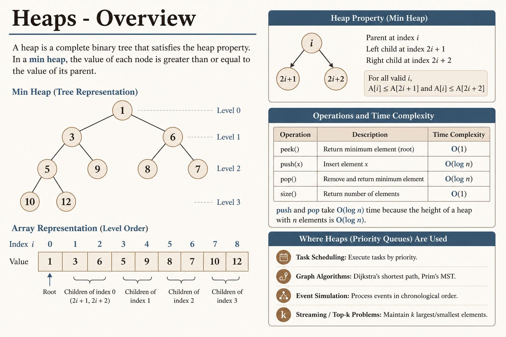

<div align="center">

# ⛰️ Heaps / Priority Queues

### *Priority queues on a complete binary tree — O(log n) insert & extract*

<p>
  
  
  
</p>

**Complete binary tree with heap property — O(log n) insert and extract**

[⬅️ Previous: BST](../08_binary_search_trees/README.md) | [🏠 Home](../README.md) | [Next: Graphs ➡️](../10_graphs/README.md)

</div>

---

## 🎯 At a Glance

| | |
|:---|:---|
| **Core idea** | Keep min (or max) at the root; parent ≤ children (min-heap) |
| **Best for** | Top-K, merge K streams, streaming median, scheduling |
| **Peek** | O(1) · **Insert / extract** | O(log n) · **Build heap** | O(n) |
| **Python tip** | `heapq` is min-heap; negate values for max-heap |

{: .highlight }
> **Interview lens:** If the problem says *k largest*, *k smallest*, *merge k lists*, *running median*, or *next task by priority* — think heap first.

---

## 📂 Subtopics Navigation

| # | Topic | Problems | Link |
|:-:|-------|:--------:|------|
| 1 | Basic Heap | 8+ | [📖 Go →](./01_basic_heap/README.md) |
| 2 | Top K Problems | 10+ | [📖 Go →](./02_top_k_problems/README.md) |
| 3 | Merge K Streams | 6+ | [📖 Go →](./03_merge_k_streams/README.md) |
| 4 | Two Heaps | 6+ | [📖 Go →](./04_two_heaps/README.md) |

---

## 📐 Mathematical Foundation

### 1️⃣ Heap Property

**Max-Heap:**

$$\boxed{\forall i: A[\text{parent}(i)] \geq A[i]}$$

**Min-Heap:**

$$\boxed{\forall i: A[\text{parent}(i)] \leq A[i]}$$

---

### 2️⃣ Array Representation

For 0-indexed array:

$$\text{parent}(i) = \lfloor (i-1)/2 \rfloor
\text{left}(i) = 2i + 1
\text{right}(i) = 2i + 2$$

---

### 3️⃣ Height of Heap

For heap with $n$ elements:

$$\boxed{h = \lfloor \log_2 n \rfloor}$$

**Proof:** Complete binary tree property.

---

### 4️⃣ Time Complexity

| Operation | Time |
|-----------|:----:|
| peek (find max/min) | O(1) |
| insert | O(log n) |
| extract max/min | O(log n) |
| heapify (build heap) | O(n) |
| increase/decrease key | O(log n) |

---

### 5️⃣ Build Heap in O(n)

**Theorem:** Building heap from array is O(n), not O(n log n).

**Proof:**

$$T(n) = \sum_{h=0}^{\lfloor \log n \rfloor} \lceil \frac{n}{2^{h+1}} \rceil \cdot O(h)
= O(n \sum_{h=0}^{\log n} \frac{h}{2^h}) = O(n \cdot 2) = O(n)$$

The sum converges to 2.

---

### 6️⃣ Heapify (Sift Down)

**Restore heap property after root change:**

$$\text{heapify}(i) = \text{swap with largest child, recurse}$$

**Time:** O(h) = O(log n)

---

### 7️⃣ Heap Sort

1. Build max-heap: O(n)

2. Extract max n times: O(n log n)

$$\boxed{T(n) = O(n \log n)}$$

**Space:** O(1) in-place

---

### 8️⃣ K-way Merge

**Problem:** Merge k sorted lists of total n elements.

**Heap approach:**

$$T(n, k) = O(n \log k)$$

Each element: insert once, extract once → 2 × O(log k).

---

## 📊 Visual Overview

<div align="center">



*Min-heap tree, array layout, operations table, and real-world use cases*

</div>

---

## 🎯 Key Patterns

### Min-Heap in Python

```python
import heapq

# Min-heap (default in Python)
heap = []
heapq.heappush(heap, 5)
heapq.heappush(heap, 3)
heapq.heappush(heap, 7)

min_val = heapq.heappop(heap)  # 3
peek = heap[0]  # 5 (next minimum)
```

### Max-Heap (Negate Values)

```python
# Max-heap using negation
max_heap = []
heapq.heappush(max_heap, -5)
heapq.heappush(max_heap, -3)
heapq.heappush(max_heap, -7)

max_val = -heapq.heappop(max_heap)  # 7
```

### Heap with Custom Key

```python
# Heap of tuples (priority, value)
heap = []
heapq.heappush(heap, (2, "task B"))
heapq.heappush(heap, (1, "task A"))
heapq.heappush(heap, (3, "task C"))

priority, task = heapq.heappop(heap)  # (1, "task A")
```


```text
Heap Problem
     |
 Top K    Merge K    Two Heaps
```


### Pattern Checklist

- [ ] Can I use heap instead of sorting? (O(n log k) vs O(n log n))
- [ ] Is this a Top K problem? (Use opposite heap!)
- [ ] Is this a merge K problem? (Heap of k pointers)
- [ ] Do I need dynamic median? (Two heaps!)
- [ ] Is this greedy + priority? (Heap for next choice)
- [ ] Can I build heap once instead of repeated inserts?


---

## 🏆 LeetCode Problems

### 🟢 Easy

| # | Problem | Pattern | Time | Space |
|:-:|---------|---------|:----:|:-----:|
| 703 | [Kth Largest Element in Stream](https://leetcode.com/problems/kth-largest-element-in-a-stream/) | Min-Heap | O(log k) | O(k) |
| 1046 | [Last Stone Weight](https://leetcode.com/problems/last-stone-weight/) | Max-Heap | O(n log n) | O(n) |

### 🟡 Medium

| # | Problem | Pattern | Time | Space |
|:-:|---------|---------|:----:|:-----:|
| 215 | [Kth Largest Element in Array](https://leetcode.com/problems/kth-largest-element-in-an-array/) | Heap/Quickselect | O(n) avg | O(1) |
| 347 | [Top K Frequent Elements](https://leetcode.com/problems/top-k-frequent-elements/) | Bucket Sort | O(n) | O(n) |
| 973 | [K Closest Points to Origin](https://leetcode.com/problems/k-closest-points-to-origin/) | Max-Heap | O(n log k) | O(k) |
| 295 | [Find Median from Data Stream](https://leetcode.com/problems/find-median-from-data-stream/) | Two Heaps | O(log n) | O(n) |
| 23 | [Merge K Sorted Lists](https://leetcode.com/problems/merge-k-sorted-lists/) | Min-Heap | O(n log k) | O(k) |

### 🔴 Hard

| # | Problem | Pattern | Time | Space |
|:-:|---------|---------|:----:|:-----:|
| 502 | [IPO](https://leetcode.com/problems/ipo/) | Two Heaps | O(n log n) | O(n) |

---

## 📚 References & Learning Resources

### 📖 Core Concepts

| Resource | Description | Link |
|----------|-------------|------|
| **Binary Heap** | Wikipedia overview | [Heap (data structure)](https://en.wikipedia.org/wiki/Heap_(data_structure)) |
| **Priority Queue** | GeeksforGeeks | [Priority Queue](https://www.geeksforgeeks.org/priority-queue-set-1-introduction/) |
| **LeetCode Explore** | Heap card | [Explore Card](https://leetcode.com/explore/learn/card/heap/) |

### 📝 Practice

| Platform | Focus | Link |
|----------|-------|------|
| **LeetCode** | Heap tag | [Problems](https://leetcode.com/tag/heap-priority-queue/) |

---

## 🌟 Motivational Corner

> "Heap is the Swiss Army knife of interviews — Top K, merge, median, scheduling, all use heaps!"

**Progress Tracker:**

- 🥉 **Bronze:** Solve 10 heap problems + master basic operations

- 🥈 **Silver:** Solve 20 heap problems + Top K patterns

- 🥇 **Gold:** Solve 30 heap problems + merge K + two heaps

- 💎 **Platinum:** Master all patterns + advanced heaps

**Remember:** Heap operations are O(log n), but build heap is O(n)! 🚀

---

<div align="center">

### 🌟 If this helped you, give it a ⭐ on GitHub! 🌟

**Made with ❤️ for the coding community by [Gaurav Goswami](https://github.com/Gaurav14cs17)**

[⬅️ Previous: BST](../08_binary_search_trees/README.md) | [🏠 Home](../README.md) | [Next: Graphs ➡️](../10_graphs/README.md)

---

*Last Updated: December 2025*  
*Licensed under MIT*  
*Happy Coding! 💻✨*

</div>
