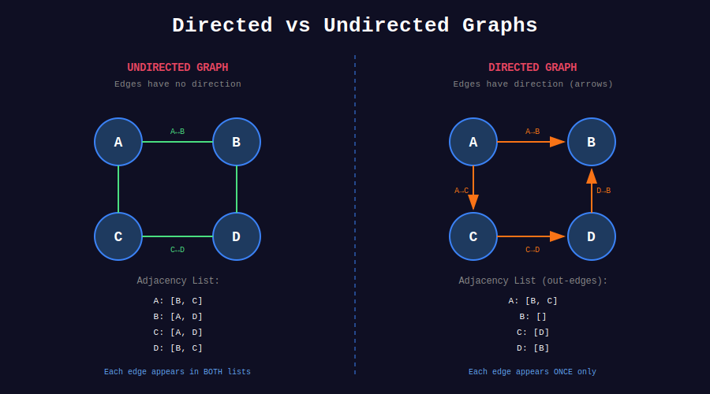

<div align="center">

# 🗺️ Graph Representation

<p>
  
  
</p>

</div>

---

## 🧭 Navigation

| ⬅️ Previous | 📂 Current | ➡️ Next |
|:------------|:----------:|--------:|
| [🏠 Graphs Home](../README.md) | **01. Graph Representation** | [02. BFS Problems →](../02_bfs_problems/README.md) |

---

## 📐 Mathematical Foundations

### 1️⃣ Graph Definition

**Formal Definition:**

$$\boxed{G = (V, E)}$$

Where:

- $V$ = set of vertices (nodes)

- $E \subseteq V \times V$ = set of edges

**Types:**

**Undirected Graph:**

$$E = \{(u, v) : u, v \in V\} \text{ where } (u, v) = (v, u)$$

**Directed Graph (Digraph):**

$$E = \{(u, v) : u, v \in V\} \text{ where } (u, v) \neq (v, u)$$

**Weighted Graph:**

$$E = \{(u, v, w) : u, v \in V, w \in \mathbb{R}\}$$

---

### 2️⃣ Graph Properties

**Vertex Degree:**

For undirected graph:

$$\boxed{\deg(v) = |\{u \in V : (v, u) \in E\}|}$$

For directed graph:

- **In-degree:** $\deg^-(v) = |\{u : (u, v) \in E\}|$

- **Out-degree:** $\deg^+(v) = |\{u : (v, u) \in E\}|$

**Handshaking Lemma:**

$$\boxed{\sum_{v \in V} \deg(v) = 2|E|}$$

**Proof:** Each edge contributes 2 to the sum (once for each endpoint) ∎

---

### 3️⃣ Space Complexity Analysis

**Adjacency Matrix:**

$$\boxed{S_{matrix} = O(|V|^2)}$$

Stores $|V| \times |V|$ matrix regardless of $|E|$

**Adjacency List:**

$$\boxed{S_{list} = O(|V| + |E|)}$$

- Undirected: $|V|$ lists with total $2|E|$ entries

- Directed: $|V|$ lists with total $|E|$ entries

**When to use which:**

| Graph Type | Density | Best Choice |
|------------|---------|-------------|
| Dense ($\|E\| \approx \|V\|^2$) | High | **Matrix** |
| Sparse ($\|E\| \ll \|V\|^2$) | Low | **List** |

---

### 4️⃣ Time Complexity Comparison

| Operation | Adjacency Matrix | Adjacency List |
|-----------|:----------------:|:--------------:|
| **Check edge (u,v)** | **O(1)** | O(deg(u)) |
| **Add edge** | **O(1)** | O(1) |
| **Remove edge** | **O(1)** | O(deg(u)) |
| **Find neighbors** | O(V) | **O(deg(u))** |
| **Space** | O(V²) | **O(V + E)** |

---

### 5️⃣ Complete Graph Mathematics

**Complete Graph $K_n$:**

Every pair of vertices connected.

$$|E| = \binom{n}{2} = \frac{n(n-1)}{2}$$

**Proof:**

- Choose 2 vertices from $n$: $\binom{n}{2}$

- Each pair forms one edge ∎

**Examples:**

- $K_3$ (triangle): $\frac{3 \times 2}{2} = 3$ edges

- $K_4$: $\frac{4 \times 3}{2} = 6$ edges

- $K_5$: $\frac{5 \times 4}{2} = 10$ edges

---

### 6️⃣ Path and Connectivity

**Path:** Sequence of vertices $v_1, v_2, \ldots, v_k$ where $(v_i, v_{i+1}) \in E$

**Simple Path:** No repeated vertices

**Cycle:** Path where $v_1 = v_k$

**Connected Graph:** Path exists between every pair of vertices

**Strongly Connected (Directed):** Path exists in both directions between every pair

**Connected Components Formula:**

For graph $G$ with $k$ components:

$$\boxed{\text{rank}(G) = |V| - k}$$

---

## 🎨 Visual Representations

### SVG Diagrams

<div align="center">


*Adjacency Matrix vs Adjacency List Comparison*



*Directed vs Undirected Graph Representation*

</div>

---

### Adjacency Matrix Example

```
Graph:
    0 ←→ 1
    ↓ ╲  ↑
    ↓  ╲ ↑
    ↓   ╲↑
    2 ←→ 3

Adjacency Matrix (Undirected):
     0  1  2  3
  +------------+
0 | 0  1  1  1 |  Row 0: neighbors of vertex 0
1 | 1  0  0  1 |  Row 1: neighbors of vertex 1
2 | 1  0  0  1 |  Row 2: neighbors of vertex 2
3 | 1  1  1  0 |  Row 3: neighbors of vertex 3
  +------------+

Matrix[i][j] = 1 if edge (i,j) exists
Matrix[i][j] = 0 otherwise

Space: O(V²) = O(16) for 4 vertices
Even if graph has only 6 edges!

Advantages:
✓ O(1) edge lookup: Matrix[u][v]
✓ Simple implementation
✓ Good for dense graphs

Disadvantages:
✗ O(V²) space even for sparse graphs
✗ O(V) to find all neighbors

```

---

### Adjacency List Example

```
Same Graph:
    0 ←→ 1
    ↓ ╲  ↑
    ↓  ╲ ↑
    ↓   ╲↑
    2 ←→ 3

Adjacency List (Undirected):
+---+

| 0 | → [1] → [2] → [3] → null
+---+
| 1 | → [0] → [3] → null
+---+

| 2 | → [0] → [3] → null
+---+
| 3 | → [0] → [1] → [2] → null
+---+

Each vertex has a list of neighbors.

Space: O(V + E) = O(4 + 12) = O(16)
(4 vertices + 6 edges × 2 for undirected)

Advantages:
✓ O(V + E) space for sparse graphs
✓ O(degree) to find neighbors
✓ Efficient for traversals (BFS/DFS)

Disadvantages:
✗ O(degree) to check edge existence
✗ More complex implementation

```

---

### Directed vs Undirected Visual

```
UNDIRECTED GRAPH
================
    A ←→ B
    ↑ ╲  ↑
    ↑  ╲ ↑
    ↑   ╲↑
    C ←→ D

Adjacency List:
A: [B, C, D]
B: [A, D]
C: [A, D]
D: [A, B, C]

Each edge appears in BOTH adjacency lists.
Edge (A,B) means:

- A is in B's list

- B is in A's list

DIRECTED GRAPH
==============
    A → B
    ↓ ╲ ↑
    ↓  ╲↑
    ↓   ╲
    C → D

Adjacency List:
A: [B, C, D]  ← Out-edges from A
B: []         ← No out-edges from B
C: [D]        ← Out-edges from C
D: [B]        ← Out-edges from D

Edge (A,B) means:

- B is in A's list (A→B)

- A is NOT in B's list (no B→A)

Key Difference:
Undirected: |E| edges → 2|E| list entries
Directed:   |E| edges → |E| list entries

```

---

### Weighted Graph Representation

```
Weighted Graph:
         5
    A --------- B
    |         / |
   2|       /7  |3
    |     /     |
    C ---------  D
         4

Adjacency List (with weights):
A: [(B, 5), (C, 2)]
B: [(A, 5), (C, 7), (D, 3)]
C: [(A, 2), (B, 7), (D, 4)]
D: [(B, 3), (C, 4)]

Each entry: (neighbor, weight)

Adjacency Matrix (with weights):
     A  B  C  D
  +------------+
A | 0  5  2  ∞ |
B | 5  0  7  3 |
C | 2  7  0  4 |
D | ∞  3  4  0 |
  +------------+

∞ means no edge exists
0 on diagonal (no self-loops)

Common weight representations:

- Distance/Cost: positive numbers

- No edge: ∞ or -1
- Self-loops: typically 0

```

---

### Graph Cloning Visualization

```
Original Graph:
    1 ←→ 2
    ↓    ↑
    ↓    ↑
    ↓    ↑
    4 ←→ 3

Node 1: neighbors = [2, 4]
Node 2: neighbors = [1, 3]
Node 3: neighbors = [2, 4]
Node 4: neighbors = [1, 3]

+--------------------------------------------------------------------+

|  Deep Clone Process (DFS Approach)                                 |
+--------------------------------------------------------------------+
|  Step 1: Start at node 1                                           |
|  Create clone of 1                                                 |
|  original_map[1] = clone_1                                         |
|                                                                    |
|  Original:          Clone:                                         |
|  [1]                [1']                                           |
|                                                                    |
|  Explore neighbors of 1: [2, 4]                                    |
+--------------------------------------------------------------------+

|  Step 2: Visit neighbor 2                                          |
|  Create clone of 2                                                 |
|  original_map[2] = clone_2                                         |
|  Connect: clone_1.neighbors += [clone_2]                           |
|                                                                    |
|  Original:          Clone:                                         |
|  [1] → [2]          [1'] → [2']                                    |
|                                                                    |
|  Explore neighbors of 2: [1, 3]                                    |
|  - 1 already cloned, add connection                                |
|  - 3 not cloned yet, recurse                                       |
+--------------------------------------------------------------------+

|  Step 3: Visit neighbor 3                                          |
|  Create clone of 3                                                 |
|  Connect: clone_2.neighbors += [clone_3]                           |
|                                                                    |
|  Original:          Clone:                                         |
|  [1] → [2]          [1'] → [2']                                    |
|         ↓                   ↓                                      |
|        [3]                 [3']                                    |
|                                                                    |
|  Explore neighbors of 3: [2, 4]                                    |
|  - 2 already cloned, add connection                                |
|  - 4 not cloned yet, recurse                                       |
+--------------------------------------------------------------------+

|  Step 4: Visit neighbor 4                                          |
|  Create clone of 4                                                 |
|  Connect: clone_3.neighbors += [clone_4]                           |
|                                                                    |
|  Original:          Clone:                                         |
|  [1] → [2]          [1'] → [2']                                    |
|  ↓     ↓            ↓      ↓                                       |
|  [4] → [3]          [4'] → [3']                                    |
|                                                                    |
|  Explore neighbors of 4: [1, 3]                                    |
|  - Both already cloned, add connections                            |
+--------------------------------------------------------------------+

|  Final: Complete clone with all connections preserved              |
|                                                                    |
|  Clone Graph:                                                      |
|  [1'] ←→ [2']                                                      |
|   ↓       ↑                                                        |
|   ↓       ↑                                                        |
|  [4'] ←→ [3']                                                      |
|                                                                    |
|  Key Insight: HashMap prevents infinite recursion                 |
|  on cycles and ensures each node cloned exactly once!              |
+--------------------------------------------------------------------+

```

---

## 💻 Code Implementations

```python
from typing import List, Dict, Set
from collections import deque, defaultdict

class GraphNode:
    """Node for graph representation (used in Clone Graph problem)."""
    def __init__(self, val=0, neighbors=None):
        self.val = val
        self.neighbors = neighbors if neighbors is not None else []

class Graph:
    """
    Graph implementation using adjacency list.
    
    Supports both directed and undirected graphs.
    Can handle weighted edges.
    """
    def __init__(self, directed=False):
        self.adj_list = defaultdict(list)
        self.directed = directed
        self.vertices = set()
    
    def add_vertex(self, v):
        """Add a vertex to the graph. O(1)"""
        self.vertices.add(v)
        if v not in self.adj_list:
            self.adj_list[v] = []
    
    def add_edge(self, u, v, weight=None):
        """
        Add edge from u to v.
        For undirected graph, also adds edge v to u.
        
        Time: O(1)
        """
        self.add_vertex(u)
        self.add_vertex(v)
        
        # Store as (neighbor, weight) or just neighbor
        edge_data = (v, weight) if weight is not None else v
        self.adj_list[u].append(edge_data)
        
        # For undirected, add reverse edge
        if not self.directed:
            reverse_data = (u, weight) if weight is not None else u
            self.adj_list[v].append(reverse_data)
    
    def remove_edge(self, u, v):
        """
        Remove edge from u to v.
        
        Time: O(degree(u))
        """
        self.adj_list[u] = [
            neighbor for neighbor in self.adj_list[u]
            if (neighbor if isinstance(neighbor, int) else neighbor[0]) != v
        ]
        
        if not self.directed:
            self.adj_list[v] = [
                neighbor for neighbor in self.adj_list[v]
                if (neighbor if isinstance(neighbor, int) else neighbor[0]) != u
            ]
    
    def has_edge(self, u, v):
        """
        Check if edge exists from u to v.
        
        Time: O(degree(u))
        """
        for neighbor in self.adj_list[u]:
            neighbor_val = neighbor if isinstance(neighbor, int) else neighbor[0]
            if neighbor_val == v:
                return True
        return False
    
    def get_neighbors(self, v):
        """
        Get all neighbors of vertex v.
        
        Time: O(1) to access, O(degree(v)) to iterate
        """
        return self.adj_list[v]
    
    def degree(self, v):
        """
        Get degree of vertex v.
        
        For directed graph, returns out-degree.
        """
        return len(self.adj_list[v])
    
    def __str__(self):
        """String representation of graph."""
        result = []
        for vertex in sorted(self.vertices):
            neighbors = self.adj_list[vertex]
            result.append(f"{vertex}: {neighbors}")
        return "\n".join(result)

class GraphMatrix:
    """
    Graph implementation using adjacency matrix.
    
    Better for dense graphs where |E| ≈ |V|².
    Supports O(1) edge lookup.
    """
    def __init__(self, num_vertices, directed=False):
        self.n = num_vertices
        self.directed = directed
        # Initialize with infinity (no edge)
        self.matrix = [[float('inf')] * num_vertices 
                      for _ in range(num_vertices)]
        # Distance from vertex to itself is 0
        for i in range(num_vertices):
            self.matrix[i][i] = 0
    
    def add_edge(self, u, v, weight=1):
        """
        Add edge from u to v with given weight.
        
        Time: O(1)
        """
        self.matrix[u][v] = weight
        if not self.directed:
            self.matrix[v][u] = weight
    
    def remove_edge(self, u, v):
        """Remove edge from u to v. O(1)"""
        self.matrix[u][v] = float('inf')
        if not self.directed:
            self.matrix[v][u] = float('inf')
    
    def has_edge(self, u, v):
        """Check if edge exists. O(1)"""
        return self.matrix[u][v] != float('inf')
    
    def get_neighbors(self, v):
        """
        Get all neighbors of vertex v.
        
        Time: O(V) - must scan entire row
        """
        neighbors = []
        for i in range(self.n):
            if self.matrix[v][i] != float('inf') and i != v:
                neighbors.append((i, self.matrix[v][i]))
        return neighbors
    
    def __str__(self):
        """Pretty print matrix."""
        result = []
        # Header
        result.append("    " + " ".join(f"{i:3}" for i in range(self.n)))
        result.append("  " + "-" * (4 * self.n))
        # Rows
        for i in range(self.n):
            row = f"{i} |"
            for j in range(self.n):
                val = self.matrix[i][j]
                if val == float('inf'):
                    row += "  ∞"
                else:
                    row += f"{val:3}"
            result.append(row)
        return "\n".join(result)

def clone_graph(node: GraphNode) -> GraphNode:
    """
    Clone undirected graph (LeetCode #133).
    
    DFS approach with HashMap to track cloned nodes.
    HashMap prevents:
    1. Infinite recursion on cycles
    2. Duplicate cloning
    
    Time: O(V + E), Space: O(V)
    """
    if not node:
        return None
    
    # Map original node to cloned node
    cloned = {}
    
    def dfs(original):
        # Already cloned
        if original in cloned:
            return cloned[original]
        
        # Clone the node
        clone = GraphNode(original.val)
        cloned[original] = clone
        
        # Clone all neighbors recursively
        for neighbor in original.neighbors:
            clone.neighbors.append(dfs(neighbor))
        
        return clone
    
    return dfs(node)

def clone_graph_bfs(node: GraphNode) -> GraphNode:
    """
    Clone graph using BFS approach.
    
    Alternative to DFS, same complexity.
    """
    if not node:
        return None
    
    cloned = {node: GraphNode(node.val)}
    queue = deque([node])
    
    while queue:
        original = queue.popleft()
        
        for neighbor in original.neighbors:
            if neighbor not in cloned:
                # Clone neighbor
                cloned[neighbor] = GraphNode(neighbor.val)
                queue.append(neighbor)
            
            # Add cloned neighbor to current node's neighbors
            cloned[original].neighbors.append(cloned[neighbor])
    
    return cloned[node]

def valid_tree(n: int, edges: List[List[int]]) -> bool:
    """
    Check if graph is a valid tree (LeetCode #261).
    
    Tree properties:
    1. Exactly n-1 edges
    2. Connected (all nodes reachable)
    3. No cycles
    
    Can check either:
    - n-1 edges AND connected
    - n-1 edges AND no cycles
    
    Time: O(V + E), Space: O(V + E)
    """
    # Property 1: Tree must have exactly n-1 edges
    if len(edges) != n - 1:
        return False
    
    # Build adjacency list
    adj_list = defaultdict(list)
    for u, v in edges:
        adj_list[u].append(v)
        adj_list[v].append(u)
    
    # Check connectivity using DFS
    visited = set()
    
    def dfs(node, parent):
        visited.add(node)
        for neighbor in adj_list[node]:
            if neighbor == parent:
                continue  # Skip edge back to parent
            if neighbor in visited:
                return False  # Cycle found
            if not dfs(neighbor, node):
                return False
        return True
    
    # Start DFS from node 0
    if not dfs(0, -1):
        return False
    
    # Check if all nodes visited (connected)
    return len(visited) == n

def count_components(n: int, edges: List[List[int]]) -> int:
    """
    Count number of connected components (LeetCode #323).
    
    Algorithm: Run DFS/BFS from each unvisited node.
    Each DFS/BFS marks one complete component.
    
    Time: O(V + E), Space: O(V + E)
    """
    # Build adjacency list
    adj_list = defaultdict(list)
    for u, v in edges:
        adj_list[u].append(v)
        adj_list[v].append(u)
    
    visited = set()
    
    def dfs(node):
        """Mark all nodes in this component as visited."""
        visited.add(node)
        for neighbor in adj_list[node]:
            if neighbor not in visited:
                dfs(neighbor)
    
    components = 0
    for node in range(n):
        if node not in visited:
            dfs(node)
            components += 1
    
    return components

def find_center(edges: List[List[int]]) -> int:
    """
    Find center of star graph (LeetCode #1791).
    
    Star graph: One center connected to all others.
    
    Key insight: Center appears in ALL edges.
    So center must be common endpoint of first two edges!
    
    Time: O(1), Space: O(1)
    """
    # Check which endpoint of edge[0] appears in edge[1]
    a, b = edges[0]
    c, d = edges[1]
    
    # Center must be common to both edges
    return a if a == c or a == d else b

def find_judge(n: int, trust: List[List[int]]) -> int:
    """
    Find the town judge (LeetCode #997).
    
    Properties of judge:
    1. Judge trusts nobody: out-degree = 0
    2. Everyone trusts judge: in-degree = n-1
    
    Algorithm: Track in-degree and out-degree.
    
    Time: O(E), Space: O(V)
    """
    in_degree = [0] * (n + 1)
    out_degree = [0] * (n + 1)
    
    for a, b in trust:
        out_degree[a] += 1
        in_degree[b] += 1
    
    for person in range(1, n + 1):
        if in_degree[person] == n - 1 and out_degree[person] == 0:
            return person
    
    return -1

def can_finish(num_courses: int, prerequisites: List[List[int]]) -> bool:
    """
    Course schedule - detect cycle in directed graph (LeetCode #207).
    
    Prerequisites form directed graph:
    [course, prerequisite] means prerequisite → course
    
    Can finish all courses iff no cycle exists.
    
    Algorithm: DFS with three states:
    - UNVISITED (0): not visited yet
    - VISITING (1): in current DFS path (cycle if revisited)
    - VISITED (2): fully processed
    
    Time: O(V + E), Space: O(V + E)
    """
    # Build adjacency list
    adj_list = defaultdict(list)
    for course, prereq in prerequisites:
        adj_list[course].append(prereq)
    
    # States: 0=unvisited, 1=visiting, 2=visited
    state = [0] * num_courses
    
    def has_cycle(course):
        if state[course] == 1:
            return True  # Cycle: revisited node in current path
        if state[course] == 2:
            return False  # Already processed
        
        # Mark as visiting
        state[course] = 1
        
        # Check all prerequisites
        for prereq in adj_list[course]:
            if has_cycle(prereq):
                return True
        
        # Mark as visited
        state[course] = 2
        return False
    
    # Check each course
    for course in range(num_courses):
        if has_cycle(course):
            return False
    
    return True

```

---

## 🏆 LeetCode Problems

### 🟢 Easy

| # | Problem | Pattern | Time | Space |
|:-:|---------|---------|:----:|:-----:|
| 997 | [Find the Town Judge](https://leetcode.com/problems/find-the-town-judge/) | In/Out Degree | O(E) | O(V) |
| 1791 | [Find Center of Star Graph](https://leetcode.com/problems/find-center-of-star-graph/) | Degree | O(1) | O(1) |

### 🟡 Medium

| # | Problem | Pattern | Time | Space |
|:-:|---------|---------|:----:|:-----:|
| 133 | [Clone Graph](https://leetcode.com/problems/clone-graph/) | DFS/BFS + HashMap | O(V+E) | O(V) |
| 207 | [Course Schedule](https://leetcode.com/problems/course-schedule/) | Cycle Detection | O(V+E) | O(V) |
| 210 | [Course Schedule II](https://leetcode.com/problems/course-schedule-ii/) | Topological Sort | O(V+E) | O(V) |
| 261 | [Graph Valid Tree](https://leetcode.com/problems/graph-valid-tree/) | DFS + Properties | O(V+E) | O(V) |
| 323 | [Number of Connected Components](https://leetcode.com/problems/number-of-connected-components-in-an-undirected-graph/) | DFS/Union-Find | O(V+E) | O(V) |
| 1557 | [Minimum Vertices to Reach All Nodes](https://leetcode.com/problems/minimum-number-of-vertices-to-reach-all-nodes/) | In-Degree | O(V+E) | O(V) |

---

## 💡 Key Insights & Pro Tips

> **🎯 Choosing Representation**  
> Dense graph ($|E| \approx |V|^2$): Use matrix. Sparse graph ($|E| \ll |V|^2$): Use list. Most interview problems are sparse!

> **⚡ Clone Graph Trick**  
> Use HashMap to map original→clone. Prevents infinite loops and duplicate cloning. Essential for cyclic graphs!

> **🔄 Tree vs Graph**  
> Tree = connected + acyclic + exactly V-1 edges. If any property fails, not a tree!

> **📊 Degree Analysis**  
> Many problems solved by analyzing degrees: center of star (max degree), judge (in-degree = V-1), etc.

> **🔍 Cycle Detection**  
> Use 3-state DFS: unvisited, visiting (in path), visited (done). Cycle exists if we revisit a "visiting" node.

> **💰 Space Trade-off**  
> Adjacency list: O(V+E) space but flexible. Matrix: O(V²) space but O(1) edge lookup.

---

## 🎓 Pattern Recognition Guide

### Graph Problem Identifiers

| Problem Says... | Representation Needed | Example |
|----------------|----------------------|---------|
| "clone graph" | DFS/BFS + HashMap | #133 |
| "course schedule" | Adjacency list + cycle detection | #207 |
| "connected components" | Adjacency list + DFS/Union-Find | #323 |
| "valid tree" | Check properties | #261 |
| "town judge" | Degree analysis | #997 |
| "star graph center" | Degree analysis | #1791 |
| "prerequisites" | Directed graph + topological sort | #210 |

---

## 🧮 Complexity Deep Dive

### When Matrix Beats List

**Matrix preferred when:**

- Frequent edge existence checks: O(1) vs O(degree)

- Dense graph: Space difference minimal

- Simple implementation needed

- Small graphs ($V \leq 1000$)

**List preferred when:**

- Sparse graph: Huge space savings

- Need to iterate neighbors frequently

- Large graphs ($V > 10000$)

- Most real-world networks

### Real-World Examples

| Graph Type | |V| | |E| | Density | Best Choice |
|------------|-----|------|---------|-------------|
| **Social Network** | 10⁹ | 10¹⁰ | Sparse | **List** |
| **Airline Routes** | 10³ | 10⁴ | Sparse | **List** |
| **Chess Board** | 64 | ~196 | Medium | Either |
| **Complete Graph K₅₀** | 50 | 1225 | Dense | **Matrix** |

---

## 📚 References & Learning Resources

### 📖 Core Concepts

| Resource | Topic | Link |
|----------|-------|------|
| **CLRS Chapter 22** | Graph representations | [MIT Press](https://mitpress.mit.edu/books/introduction-algorithms) |
| **Graph Theory** | Mathematical foundations | [Wikipedia](https://en.wikipedia.org/wiki/Graph_theory) |
| **GeeksforGeeks** | Graph implementations | [Tutorial](https://www.geeksforgeeks.org/graph-data-structure-and-algorithms/) |

### 🎥 Video Tutorials

| Creator | Topic | Link |
|---------|-------|------|
| **William Fiset** | Graph theory playlist | [YouTube](https://www.youtube.com/playlist?list=PLDV1Zeh2NRsDGO4--qE8yH72HFL1Km93P) |
| **Abdul Bari** | Graph representations | [YouTube](https://www.youtube.com/watch?v=gXgEDyodOJU) |
| **NeetCode** | Clone graph explained | [YouTube](https://www.youtube.com/watch?v=mQeF6bN8hMk) |

### 📝 Interactive Learning

| Platform | Focus | Link |
|----------|-------|------|
| **VisuAlgo** | Graph visualizations | [Website](https://visualgo.net/en/graphds) |
| **Graph Online** | Draw & analyze graphs | [Website](https://graphonline.ru/en/) |

---

## 🎯 Practice Roadmap

### Week 1: Fundamentals

1. Implement both representations (matrix & list)

2. **Clone Graph** (#133) - Master the technique

3. **Find Center** (#1791) - Easy warm-up

### Week 2: Properties

4. **Graph Valid Tree** (#261) - Tree properties

5. **Connected Components** (#323) - DFS mastery

6. **Town Judge** (#997) - Degree analysis

### Week 3: Advanced

7. **Course Schedule** (#207) - Cycle detection

8. **Course Schedule II** (#210) - Topological sort

---

## 💭 Common Interview Questions

**Q: When to use adjacency matrix vs list?**  
A: Matrix for dense graphs or frequent edge checks. List for sparse graphs (most real problems).

**Q: How to handle weighted graphs?**  
A: Store (neighbor, weight) tuples in adjacency list. Store weights in matrix cells.

**Q: Why HashMap in clone graph?**  
A: Prevents infinite loops on cycles and ensures each node cloned exactly once.

**Q: How to detect if graph is a tree?**  
A: Check: exactly V-1 edges, connected, and acyclic. Any two sufficient.

**Q: Directed vs undirected in code?**  
A: Undirected: add edge in both directions. Directed: add edge in one direction only.

---

## 🧩 Common Pitfalls & Solutions

### Pitfall 1: Infinite Loop in Clone

```python
# ❌ WRONG: Infinite loop on cycles
def clone(node):
    clone = GraphNode(node.val)
    for neighbor in node.neighbors:
        clone.neighbors.append(clone(neighbor))  # Revisits!
    return clone

# ✅ CORRECT: Use HashMap
def clone(node):
    cloned = {}
    def dfs(n):
        if n in cloned:
            return cloned[n]
        clone = GraphNode(n.val)
        cloned[n] = clone
        for neighbor in n.neighbors:
            clone.neighbors.append(dfs(neighbor))
        return clone
    return dfs(node)

```

### Pitfall 2: Forgetting Reverse Edge

```python
# ❌ WRONG: Only one direction for undirected
def add_edge(u, v):
    adj_list[u].append(v)

# ✅ CORRECT: Both directions
def add_edge(u, v):
    adj_list[u].append(v)
    adj_list[v].append(u)  # Undirected!

```

### Pitfall 3: Not Handling Disconnected Components

```python
# ❌ WRONG: Only checks from node 0
def is_connected():
    visited = set()
    dfs(0, visited)
    return len(visited) == n

# ✅ CORRECT: Check all nodes
def is_connected():
    visited = set()
    dfs(0, visited)
    return len(visited) == n  # OK if all nodes reachable from 0

```

---

<div align="center">

### 🗺️ Master Graph Representation: Choose the Right Tool

*Matrix for dense, List for sparse. Know when to use which!*

**Made with ❤️ by [Gaurav Goswami](https://github.com/Gaurav14cs17)**

[⬅️ Graphs Home](../README.md) | [➡️ BFS Problems](../02_bfs_problems/README.md)

---

*"The right representation makes all the difference."*  
*Start with Clone Graph (#133) today!* 🚀

</div>

---

## 🧭 Navigation

| ⬅️ Previous | 📂 Current | ➡️ Next |
|:------------|:----------:|--------:|
| [🏠 Graphs Home](../README.md) | **01. Graph Representation** | [02. BFS Problems →](../02_bfs_problems/README.md) |
