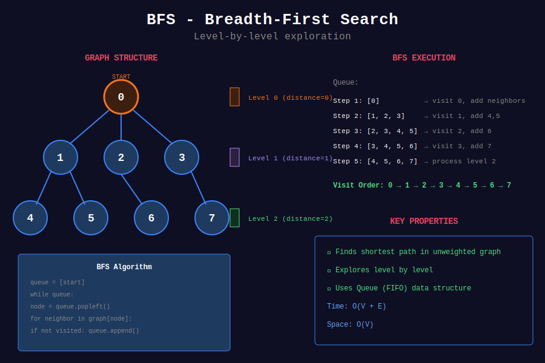
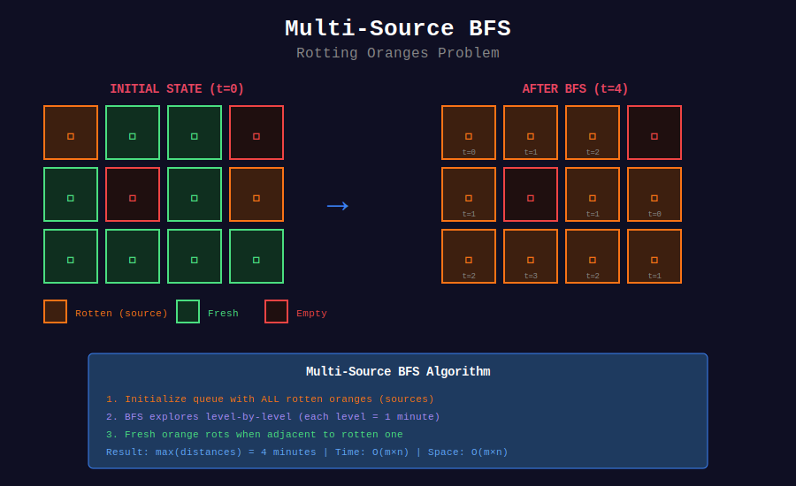

<div align="center">

# 🌊 BFS Problems

<p>
  
  
</p>

</div>

---

## 🧭 Navigation

| ⬅️ Previous | 📂 Current | ➡️ Next |
|:------------|:----------:|--------:|
| [← 01. Graph Representation](../01_graph_representation/README.md) | **02. BFS Problems** | [03. DFS Problems →](../03_dfs_problems/README.md) |

---

## 📐 Mathematical Foundations

### 1️⃣ BFS Correctness

**Theorem:** BFS finds shortest path in unweighted graphs.

**Proof:**
- BFS explores vertices level by level

- When vertex $v$ is discovered from $u$, distance$(v)$ = distance$(u)$ + 1
- First discovery of $v$ is optimal since all shorter paths already explored ∎

---

### 2️⃣ Time Complexity

```math
\boxed{T(V, E) = O(V + E)}

```

**Breakdown:**
- Each vertex enqueued/dequeued once: O(V)

- Each edge examined once: O(E)

---

### 3️⃣ Multi-source BFS

**Problem:** Shortest distance from multiple sources.

```math
\text{dist}[v] = \min_{s \in S} \text{dist}(s, v)

```

**Solution:** Start BFS with all sources in queue.

---

### 4️⃣ Level-order Traversal

BFS naturally gives level-order for trees:

```math
\text{Level } k = \{v : \text{dist}(\text{root}, v) = k\}

```

---

## 🎨 Visual Diagrams

<div align="center">



*BFS Level-by-Level Exploration*



*Multi-Source BFS (Rotting Oranges)*

</div>

---

## 💻 Code Implementations

```python
from collections import deque

def bfs(graph: dict, start: int) -> dict:
    """
    Standard BFS template.
    
    Returns distances from start to all reachable vertices.
    
    Time: O(V+E), Space: O(V)
    """
    dist = {start: 0}
    queue = deque([start])
    
    while queue:
        u = queue.popleft()
        for v in graph[u]:
            if v not in dist:
                dist[v] = dist[u] + 1
                queue.append(v)
    
    return dist

def shortestPathBinaryMatrix(grid: list[list[int]]) -> int:
    """
    Shortest path in binary matrix (LeetCode 1091).
    
    8-directional BFS.
    
    Time: O(n²), Space: O(n²)
    """
    n = len(grid)
    if grid[0][0] == 1 or grid[n-1][n-1] == 1:
        return -1
    
    directions = [(-1,-1),(-1,0),(-1,1),(0,-1),(0,1),(1,-1),(1,0),(1,1)]
    queue = deque([(0, 0, 1)])  # (row, col, distance)
    grid[0][0] = 1  # Mark visited
    
    while queue:
        r, c, dist = queue.popleft()
        
        if r == n - 1 and c == n - 1:
            return dist
        
        for dr, dc in directions:
            nr, nc = r + dr, c + dc
            if 0 <= nr < n and 0 <= nc < n and grid[nr][nc] == 0:
                grid[nr][nc] = 1
                queue.append((nr, nc, dist + 1))
    
    return -1

def orangesRotting(grid: list[list[int]]) -> int:
    """
    Rotting Oranges (LeetCode 994).
    
    Multi-source BFS from all rotten oranges.
    
    Time: O(mn), Space: O(mn)
    """
    m, n = len(grid), len(grid[0])
    queue = deque()
    fresh = 0
    
    # Initialize: find all rotten oranges and count fresh
    for i in range(m):
        for j in range(n):
            if grid[i][j] == 2:
                queue.append((i, j, 0))
            elif grid[i][j] == 1:
                fresh += 1
    
    if fresh == 0:
        return 0
    
    directions = [(0, 1), (0, -1), (1, 0), (-1, 0)]
    time = 0
    
    while queue:
        r, c, t = queue.popleft()
        time = t
        
        for dr, dc in directions:
            nr, nc = r + dr, c + dc
            if 0 <= nr < m and 0 <= nc < n and grid[nr][nc] == 1:
                grid[nr][nc] = 2
                fresh -= 1
                queue.append((nr, nc, t + 1))
    
    return time if fresh == 0 else -1

def updateMatrix(mat: list[list[int]]) -> list[list[int]]:
    """
    01 Matrix (LeetCode 542).
    
    Multi-source BFS from all 0s.
    
    Time: O(mn), Space: O(mn)
    """
    m, n = len(mat), len(mat[0])
    result = [[float('inf')] * n for _ in range(m)]
    queue = deque()
    
    # Start from all 0s
    for i in range(m):
        for j in range(n):
            if mat[i][j] == 0:
                result[i][j] = 0
                queue.append((i, j))
    
    directions = [(0, 1), (0, -1), (1, 0), (-1, 0)]
    
    while queue:
        r, c = queue.popleft()
        for dr, dc in directions:
            nr, nc = r + dr, c + dc
            if 0 <= nr < m and 0 <= nc < n:
                if result[nr][nc] > result[r][c] + 1:
                    result[nr][nc] = result[r][c] + 1
                    queue.append((nr, nc))
    
    return result

```

---

## 🏆 LeetCode Problems

### 🟡 Medium

| # | Problem | Pattern | Time | Space |
|:-:|---------|---------|:----:|:-----:|
| 286 | [Walls and Gates](https://leetcode.com/problems/walls-and-gates/) | Multi-source BFS | O(mn) | O(mn) |
| 542 | [01 Matrix](https://leetcode.com/problems/01-matrix/) | Multi-source BFS | O(mn) | O(mn) |
| 785 | [Is Graph Bipartite?](https://leetcode.com/problems/is-graph-bipartite/) | BFS Coloring | O(V+E) | O(V) |
| 994 | [Rotting Oranges](https://leetcode.com/problems/rotting-oranges/) | Multi-source BFS | O(mn) | O(mn) |
| 1091 | [Shortest Path in Binary Matrix](https://leetcode.com/problems/shortest-path-in-binary-matrix/) | BFS | O(n²) | O(n²) |

### 🔴 Hard

| # | Problem | Pattern | Time | Space |
|:-:|---------|---------|:----:|:-----:|
| 127 | [Word Ladder](https://leetcode.com/problems/word-ladder/) | BFS | O(M²·N) | O(M²·N) |
| 815 | [Bus Routes](https://leetcode.com/problems/bus-routes/) | BFS | O(N·S) | O(N·S) |

---

## 📊 BFS Pattern Selection

```
BFS Problem
     |
     +-- Shortest unweighted path → Standard BFS
     |
     +-- Distance from multiple sources → Multi-source BFS
     |
     +-- Level-by-level processing → BFS with level tracking
     |
     +-- Bipartite check → BFS with 2-coloring

```

---

## 📚 References

| Resource | Link |
|----------|------|
| **BFS** | [Wikipedia](https://en.wikipedia.org/wiki/Breadth-first_search) |

---

<div align="center">

**Made with ❤️ by [Gaurav Goswami](https://github.com/Gaurav14cs17)**

</div>

---

## 🧭 Navigation

| ⬅️ Previous | 📂 Current | ➡️ Next |
|:------------|:----------:|--------:|
| [← 01. Graph Representation](../01_graph_representation/README.md) | **02. BFS Problems** | [03. DFS Problems →](../03_dfs_problems/README.md) |
